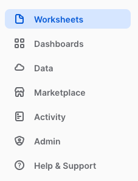
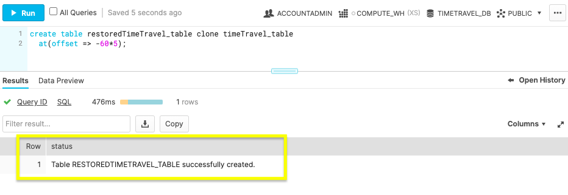
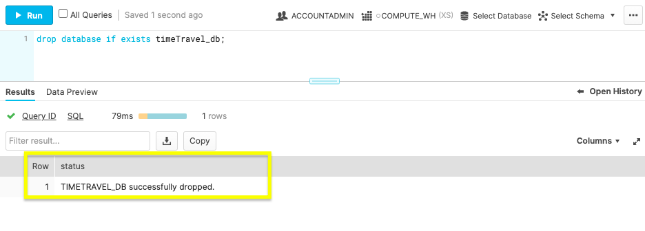

summary: Use Time Travel to query previous database states and undrop data.
id: getting_started_with_time_travel
categories: featured,getting-started
environments: test, web, hello
status: Published
feedback link: https://github.com/Snowflake-Labs/sfguides/issues
tags: Getting Started, SQL, Data Engineering

# Getting Started with Time Travel
<!-- ------------------------ -->
## Overview 
Duration: 3

Panic hits when you mistakenly delete data. Problems can come from a mistake that disrupts a process, or worse, the whole database was deleted. Thoughts of how recent was the last backup and how much time will be lost might have you wishing for a rewind button. Straightening out your database isn’t a disaster to recover from with Snowflake’s Time Travel. A few SQL commands allow you to go back in time and reclaim the past, saving you from the time and stress of a more extensive restore.

We’ll get started in the Snowflake web console, configure data retention, and use Time Travel to retrieve historic data. Before querying for your previous database states, let’s review the prerequisites for this guide.
### Prerequisites
- Quick Video [Introduction to Snowflake](https://www.youtube.com/watch?v=fEtoYweBNQ4&ab_channel=SnowflakeInc.)
- Snowflake [Data Loading Basics](https://www.youtube.com/watch?v=us6MChC8T9Y&ab_channel=SnowflakeInc.) Video

### What You’ll Learn 
- Snowflake account and user permissions
- Make database objects
- Set data retention timelines for Time Travel
- Query Time Travel data
- Clone past database states
- Remove database objects
- Next options for data protection

### What You’ll Need 
- A [Snowflake](https://signup.snowflake.com/?lab=getStartedWithTimeTravel&utm_cta=quickstart-getstartedwithtimetravel-en) Account

### What You’ll Build 
- Create database objects with Time Travel data retention

<!-- ------------------------ -->

## Get Started With the Essentials
Duration: 7

First things first, let’s get your Snowflake account and user permissions primed to use Time Travel features.

### Create a Snowflake Account

Snowflake lets you try out their services for free with a [trial account](https://signup.snowflake.com/?lab=getStartedWithTimeTravel&utm_cta=quickstart-getstartedwithtimetravel-en). A **Standard**  account allows for one day of Time Travel data retention, and an **Enterprise** account allows for 90 days of data retention. An **Enterprise** account is necessary to practice some commands in this tutorial.

### Login and Setup Lab
Log into your Snowflake account. You can access the SQL commands we will execute throughout this lab directly in your Snowflake account by going to the [lab details page](https://app.snowflake.com/resources/labs/getStartedWithTimeTravel) and clicking the `Setup Lab` button. This will create worksheets containing the lab SQL that can be executed as we step through this lab.


Once the lab has been setup, it can be continued by revisiting the [lab details page](https://app.snowflake.com/resources/labs/getStartedWithTimeTravel) and clicking `Continue Lab`


or by navigating to Worksheets and selecting the `Getting Started with Time Travel` folder.



### Increase Your Account Permission

Snowflake’s web interface has a lot to offer, but for now, switch the account role from the default `SYSADMIN` to `ACCOUNTADMIN`. You’ll need this increase in permissions later.


Now that you have the account and user permissions needed, let’s create the required database objects to test drive Time Travel.

<!-- ------------------------ -->
## Generate Database Objects
Duration: 5

Within the Snowflake web console, navigate to **Worksheets** and use the 'Getting Started with Time Travel' Worksheets we created earlier.

### Create Database

```
create or replace database timeTravel_db;
```


Use the above command to make a database called ‘timeTravel_db’. The **Results** output will show a status message of `Database TIMETRAVEL_DB successfully created`.

### Create Table

```
create or replace table timeTravel_table(ID int);
```


This command creates a table named ‘timeTravel_table’ on the timeTravel_db database. The **Results** output should show a status message of `Table TIMETRAVEL_TABLE successfully created`.

With the Snowflake account and database ready, let’s get down to business by configuring Time Travel.

<!-- ------------------------ -->
## Prepare Your Database for Disaster
Duration: 6

Be ready for anything by setting up data retention beforehand. The default setting is one day of data retention. However, if your one day mark passes and you need the previous database state back, you can’t retroactively extend the data retention period. This section teaches you how to be prepared by preconfiguring Time Travel retention.

### Alter Table
```
alter table timeTravel_table set data_retention_time_in_days=55;
```


The command above changes the table’s data retention period to 55 days. If you opted for a **Standard** account, your data retention period is limited to the default of one day. An **Enterprise** account allows for 90 days of preservation in Time Travel.

Now you know how easy it is to [alter](https://docs.snowflake.com/en/sql-reference/sql/alter-table.html#alter-table) your data retention, let’s bend the rules of time by querying an old database state with Time Travel.

<!-- ------------------------ -->
## Query Your Time Travel Data
Duration: 4

With your data retention period specified, let’s turn back the clock with the `AT` and `BEFORE` [clauses](https://docs.snowflake.com/en/sql-reference/constructs/at-before.html#at-before).

### At

```
select * from timeTravel_table at(timestamp => 'Fri, 23 Oct 2020 16:20:00 -0700'::timestamp);
```
Use `timestamp` to summon the database state **at**  a specific date and time.
```
select * from timeTravel_table at(offset => -60*5);
```
Employ `offset` to call the database state **at** a time difference of the current time. Calculate the offset in seconds with math expressions. The example above states, `-60*5`, which translates to five minutes ago.

### Before

```
select * from timeTravel_table before(statement => '<statement_id>');
```

If you’re looking to restore a database state just **before** a transaction occurred, grab the transaction’s statement id. Use the command above with your statement id to get the database state right before the transaction statement was executed.

By practicing these queries, you’ll be confident in how to find a previous database state. After locating the desired database state, you’ll need to get a copy by cloning in the next step. 

<!-- ------------------------ -->
## Clone Past Database States
Duration: 5

With the past at your fingertips, make a copy of the old database state you need with the `clone` keyword.
 
### Clone Table

```
create table restoredTimeTravel_table clone timeTravel_table
  at(offset => -60*5);
```


The command above creates a new table named `restoredTimeTravel_table` that is an exact copy of the table `timeTravel_table` from five minutes prior.

Cloning will allow you to maintain the current database while getting a copy of a past database state. After practicing the steps in this guide, remove the practice database objects in the next section.

<!-- ------------------------ -->
## Cleanup and Know Your Options
Duration: 4

You’ve created a Snowflake account, made database objects, configured data retention, query old table states, and generate a copy of the old table state. Pat yourself on the back! Complete the steps to this tutorial by deleting the objects created.

### Drop Table

```
drop table if exists timeTravel_table;
```


By dropping the table before the database, the retention period previously specified on the object is honored. If a parent object(e.g., database) is removed without the child object(e.g., table) being dropped prior, the child’s data retention period is null.

### Drop Database

```
drop database if exists timeTravel_db;
```



With the database now removed, you’ve completed learning how to call, copy, and erase the past. 
