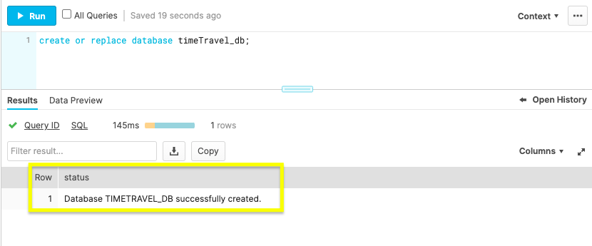
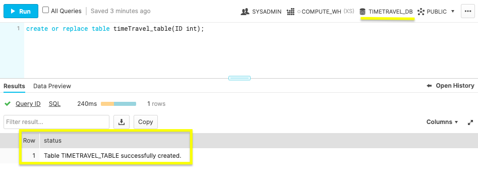
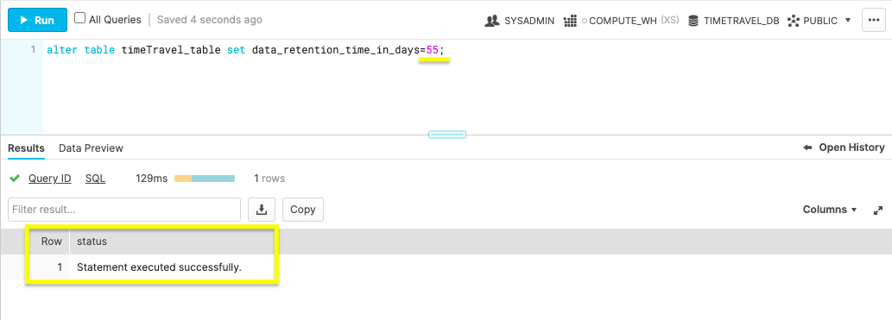
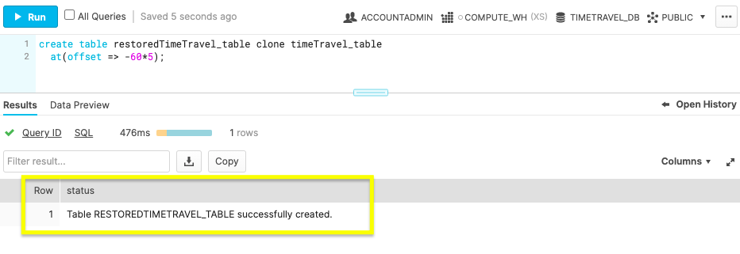
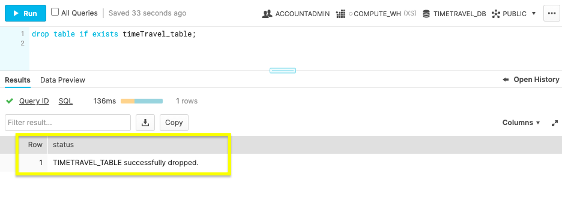
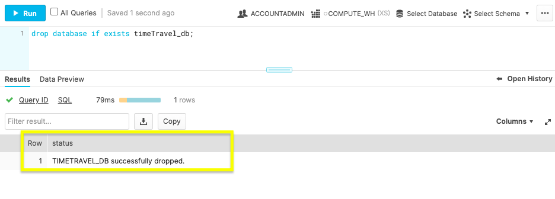

id: getting_started_with_time_travel_kr
summary: Time Travel을 사용하여 이전 데이터베이스 상태를 쿼리하고 데이터를 복구합니다.
categories: undefined
environments: web
status: Hidden
feedback link: https://github.com/Snowflake-Labs/sfguides/issues
tags: 스노우플레이크 시작하기, SQL, 데이터 엔지니어링, kr

# Time Travel 시작하기

<!-- ------------------------ -->
## 개요

Duration: 3

실수로 데이터를 삭제했을 때 우리는 당황하곤 합니다. 프로세스에 지장을 주는 실수로 인해서나 더 심각하게는 모든 데이터베이스가 삭제되어 문제가 발생할 수 있습니다. 마지막 백업이 언제였는지와 얼마나 많은 시간을 허비할지를 생각하면 되감기 버튼을 원하게 될 수도 있습니다. Snowflake의 Time Travel을 사용하여 복구하면 데이터베이스를 바로잡는 것은 재해가 아닙니다. 몇몇 SQL 명령을 통해 과거로 되돌아가 복구할 수 있습니다. 이를 통해 시간을 절약하고 보다 광범위한 복원에 스트레스를 받지 않을 수 있습니다.

Snowflake 웹 콘솔에서 시작하여 데이터 보존을 구성하고 과거 데이터를 검색하기 위해 Time Travel을 사용하겠습니다. 이전 데이터베이스 상태를 쿼리하기 전에 이 가이드의 사전 필요조건을 검토하겠습니다.

### 사전 필요 조건 및 지식

- 짧은 [Snowflake 소개](https://www.youtube.com/watch?v=fEtoYweBNQ4&ab_channel=SnowflakeInc.) 동영상
- Snowflake [데이터 로딩 기본 사항](https://www.youtube.com/watch?v=us6MChC8T9Y&ab_channel=SnowflakeInc.) 동영상

### 학습할 내용

- Snowflake 계정 및 사용자 권한
- 데이터베이스 오브젝트 생성
- Time Travel을 위해 데이터 보존 타임라인 설정
- Time Travel 데이터 쿼리
- 과거 데이터베이스 상태 복제
- 데이터베이스 오브젝트 삭제
- 데이터 보호를 위한 다음 옵션

### 필요한 것

- [Snowflake](https://signup.snowflake.com/) 계정

### 구축할 것

- Time Travel 데이터 보존으로 데이터베이스 오브젝트 생성

<!-- ------------------------ -->
## 기본 요소부터 시작하기

Duration: 7

우선 Time Travel 기능을 사용하기 위해 준비된 Snowflake 계정과 사용자 권한을 가져오겠습니다.

### Snowflake 계정 생성

Snowflake는 무료로 Snowflake 서비스를 이용해 볼 수 있도록 [평가판 계정](https://signup.snowflake.com/)을 제공합니다. **Standard** 계정은 Time Travel 데이터 보존이 1일 동안 가능하며 **Enterprise** 계정은 90일의 데이터 보존이 가능합니다. **Enterprise** 계정은 이 자습서에서 일부 명령을 연습하는 데 필요합니다.

### Snowflake의 웹 콘솔 액세스

`https://<account-name>.snowflakecomputing.com/console/login`

브라우저에서 웹 인터페이스에 로그인합니다. URL은 여러분의 [계정 이름](https://docs.snowflake.com/ko/user-guide/connecting.html#your-snowflake-account-name)과 잠재적으로 지역을 포함합니다.

### 계정 권한 확장

Snowflake의 웹 인터페이스는 다양한 기능을 제공하지만 지금은 계정 역할을 기본값인 `SYSADMIN`에서 `ACCOUNTADMIN`으로 전환합니다. 권한은 나중에 확대해야 합니다.


필요한 계정과 사용자 권한을 이제 가지고 있으니 Time Travel 시험 사용에 필요한 데이터베이스 오브젝트를 생성하겠습니다.

<!-- ------------------------ -->
## 데이터베이스 오브젝트 생성

Duration: 5

Snowflake 웹 콘솔 내에서 **Worksheets**로 이동한 다음 새로운 워크시트를 사용하여 다음 명령을 실행합니다.

### 데이터베이스 생성

```
create or replace database timeTravel_db;
```



위 명령을 사용하여 ‘timeTravel_db’라는 데이터베이스를 만듭니다. **Results** 출력은 `Database TIMETRAVEL_DB successfully created`라는 상태 메시지를 표시합니다.

### 테이블 생성

```
create or replace table timeTravel_table(ID int);
```



이 명령은 timeTravel_db 데이터베이스에 ‘timeTravel_table’이라는 테이블을 생성합니다. **Results** 출력은 `Table TIMETRAVEL_TABLE successfully created`라는 상태 메시지를 표시할 것입니다.

Snowflake 계정과 데이터베이스가 준비되었으니 Time Travel을 구성하여 본격적으로 시작하겠습니다.

<!-- ------------------------ -->
## 재해에 대비하여 데이터베이스 준비

Duration: 6

사전에 데이터 보존을 설정하여 모든 것에 대비하십시오. 기본 설정은 1일 동안의 데이터 보존입니다. 그러나 하루가 지난 다음 이전 데이터베이스 상태를 복구해야 한다면 과거로 거슬러 올라가 데이터 보존 기간을 늘릴 수 없습니다. 이 섹션에서는 Time Travel 보존을 사전에 구성하여 준비하는 방법을 알려 드립니다.

### 테이블 변경

```
alter table timeTravel_table set data_retention_time_in_days=55;
```



위 명령은 테이블의 데이터 보존 기간을 55일로 변경합니다. **Standard** 계정을 선택했다면 여러분의 데이터 보존 기간은 기본값인 1일로 제한됩니다. **Enterprise** 계정은 데이터를 Time Travel에서 90일 동안 보존합니다.

이제 데이터 보존을 [변경](https://docs.snowflake.com/ko/sql-reference/sql/alter-table.html#alter-table)하는 것이 얼마나 쉬운지 알게 되었으니 과거 데이터베이스 상태를 Time Travel로 쿼리하여 시간 규칙을 바꾸겠습니다.

<!-- ------------------------ -->
## Time Travel 데이터 쿼리

Duration: 4

지정된 데이터 보존 기간을 사용하여 `AT`과 `BEFORE` [절](https://docs.snowflake.com/ko/sql-reference/constructs/at-before.html#at-before)로 시간을 되돌리겠습니다.

### AT

```
select * from timeTravel_table at(timestamp => 'Fri, 23 Oct 2020 16:20:00 -0700'::timestamp);
```

`timestamp`를 사용하여 특정 날짜와 시간의 **지점**으로 데이터베이스 상태를 호출합니다.

```
select * from timeTravel_table at(offset => -60*5);
```

`offset`을 사용하여 현재 시간과 시간 차이가 나는 **지점**에 있는 데이터베이스 상태를 호출합니다. 수학식을 사용하여 오프셋을 초로 계산합니다. 위 예는 5분 전을 나타내는 `-60*5`를 명시합니다.

### BEFORE

```
select * from timeTravel_table before(statement => '<statement_id>');
```

트랜잭션이 발생한 시점 바로 **전**으로 데이터베이스 상태를 복원하려면 트랜잭션의 문 ID를 가져옵니다. 문 ID와 더불어 위 명령을 사용하여 트랜잭션 문이 실행되기 바로 전의 데이터베이스 상태를 가져옵니다.

이러한 쿼리를 연습하면 이전 데이터베이스 상태를 자신 있게 찾을 수 있습니다. 원하는 데이터베이스 상태를 찾은 후 다음 단계에서 복제하여 사본을 가져가야 합니다.

<!-- ------------------------ -->
## 과거 데이터베이스 상태 복제

Duration: 5

과거에 쉽게 접근할 수 있으니 `clone` 키워드에 필요한 과거 데이터베이스 상태의 사본을 만듭니다.

### 테이블 복제

```
create table restoredTimeTravel_table clone timeTravel_table
  at(offset => -60*5);
```



위 명령은 `restoredTimeTravel_table`이라는 새로운 테이블을 생성합니다. 이 테이블은 `timeTravel_table` 테이블의 5분 전 버전의 사본입니다.

복제를 통해 과거 데이터베이스 상태의 사본을 가져오는 동시에 현재 데이터베이스를 유지할 수 있습니다. 이 가이드에서 단계를 연습한 후 다음 섹션에서 연습 데이터베이스 오브젝트를 삭제합니다.

<!-- ------------------------ -->
## 정리 및 옵션 파악

Duration: 4

여러분은 Snowflake 계정을 생성하고, 데이터베이스 오브젝트를 만들고, 데이터 보존을 구성하고, 과거 테이블 상태를 쿼리하고, 과거 테이블 상태의 사본을 생성했습니다. 스스로를 칭찬해 주세요! 생성한 오브젝트를 삭제하여 이 자습서 단계를 완료하십시오.

### 테이블 삭제

```
drop table if exists timeTravel_table;
```



데이터베이스를 삭제하기 전에 테이블을 삭제하여 이전에 해당 오브젝트에 지정했던 보존 기간을 유지합니다. 부모 오브젝트(예: 데이터베이스)가 자식 오브젝트(예: 테이블)가 삭제되기 전에 삭제된다면 자식 오브젝트의 데이터 보존 기간이 무효 처리됩니다.

### 데이터베이스 삭제

```
drop database if exists timeTravel_db;
```



데이터베이스가 삭제되었습니다. 이제 과거 호출, 복사 및 초기화 방법을 모두 배우셨습니다.