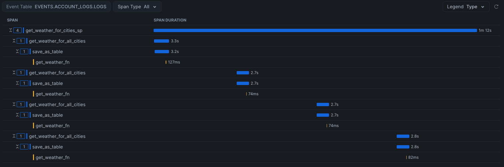

author: Brad Culberson
id: getting_started_with_traces
summary: Getting Started with Traces
categories: featured,getting-started
environments: web
status: Published 
feedback link: https://github.com/Snowflake-Labs/sfguides/issues
tags: Getting Started, Data Science, Data Engineering, Snowpark Python, Notebooks, Observability

# Getting Started with Traces
<!-- ------------------------ -->
## Overview 
Duration: 1

This guide will introduce you to Traces and Resource Metrics in Snowflake which are useful you optimize performance and find errors in notebooks, udfs, and stored procedures.

It will use APIs from OpenWeather to showcase the capabilities in Snowflake.

### Prerequisites

- Familiarity with Python and SQL

### What you will Learn

* How to create a Notebook which incorporates python and SQL cells
* How to build a python udf which pulls data from an external API
* How to create a procedure which will populates the bronze level data
* How to trace performance of the procedure and udf
* How to get memory and cpu information from the procedure execution

### What you will Need

* Snowflake account with
 + Access to create a Database
 + Access to create an Integration
 + Account has accepted [external offering terms](https://docs.snowflake.com/en/developer-guide/udf/python/udf-python-packages#getting-started)
* Free API Key from [OpenWeather](https://openweathermap.org/)

### What you will Build 

* A Notebook that can pull weather data into a bronze layer

<!-- ------------------------ -->
## Creating the Notebook
Duration: 2

Login to Snowsight using your credentials in Snowflake.

You'll need a Database and Schema to work in for this quickstart. 

Create a new database by clicking on Data, and click + Database and use the database name `TRACING_QUICKSTART`. After creating the database, click on the database under data and add a Schema called `DATA` by clicking on + Schema.

Go to Projects, Notebooks in the left navigation. Click the + Notebook to create a new Notebook. Name the Notebook "Tracking Quickstart" and Select the `TRACING_QUICKSTART` database and the `DATA` schema you created. You can select any warehouse where you would like the Quickstart to run, leave the default Run on warehouse selected and click Create.

<!-- ------------------------ -->
## Cell 1: Setup
Duration: 2

The first cell will be used to setup the notebook. These variables will be used in subsequent cells.

Paste this code into the first cell. If you'd like to pull data for other cities, edit the city_list.

```python
import streamlit as st

from snowflake.snowpark.context import get_active_session
session = get_active_session()

user_name = session.sql("SELECT current_user()").collect()[0][0]

api_key = st.text_input("Enter API key for openweathermap")
schema_name = "DATA"
database_name = "TRACING_QUICKSTART"

city_list = [(37.5533204, -122.3059259, 'San Mateo'), (52.3368551, 4.8694973, 'Amsterdam'),(52.5100227, 13.3776724, 'Berlin'), (52.2299305,20.9764142, 'Warsaw'), (18.5645333,73.911966, 'Pune')]

if api_key == "":
    raise Exception("Configuration needed")
```

When running this cell, it will prompt for entering an API Key. This was done with the streamlit text_input widget. You will need to go to [OpenWeather](https://openweathermap.org/) to get a free API key.

Enter the key in the dialog and hit enter.

<!-- ------------------------ -->
## Cell 2: Confgure External API Access
Duration: 2

In the second cell, a network rule, secret, and external access integration will be configured to allow outbound connectivity to the OpenWeather API. This is necessary because the Python Notebook does not have
network access without this configuration. A stage is also created to allow storage of the permanent UDF and procedure. A Permanent (will be stored in the database) UDF and procedure was chosen so these utilities could be called outside the notebook in the future if desired.

Paste this code into the second cell.

```sql
USE DATABASE "{{database_name}}";
USE SCHEMA "{{schema_name}}";

CREATE OR REPLACE NETWORK RULE openweathermap_api_network_rule
  MODE = EGRESS
  TYPE = HOST_PORT
  VALUE_LIST = ('api.openweathermap.org');

CREATE OR REPLACE SECRET openweathermap_api_key
    TYPE = GENERIC_STRING
    SECRET_STRING = "{{api_key}}";

CREATE OR REPLACE EXTERNAL ACCESS INTEGRATION openweathermap_access_integration
  ALLOWED_NETWORK_RULES = (openweathermap_api_network_rule)
  ALLOWED_AUTHENTICATION_SECRETS = (openweathermap_api_key)
  ENABLED = true;

CREATE STAGE IF NOT EXISTS EXEC_STORAGE;
```

Run this cell to verify it is successful.

<!-- ------------------------ -->
## Cell 3: Enabling Traces
Duration: 2

In order to get logs on errors and get traces, levels need to be modified. This can easily be done in sql.

Cahnge the third cell to SQL and paste this section into the body.

```sql
ALTER DATABASE "{{database_name}}" SET LOG_LEVEL = ERROR;
ALTER SCHEMA "{{schema_name}}" SET LOG_LEVEL = ERROR;
ALTER DATABASE "{{database_name}}" SET TRACE_LEVEL = ALWAYS;
ALTER SCHEMA "{{schema_name}}" SET TRACE_LEVEL = ALWAYS;
ALTER DATABASE "{{database_name}}" SET METRIC_LEVEL = ALL;
ALTER SCHEMA "{{schema_name}}" SET METRIC_LEVEL = ALL;

ALTER SESSION SET METRIC_LEVEL = ALL;
```

Run this cell to verify it is successful.

<!-- ------------------------ -->
## Cell 4: Create and execute the UDF and Procedure
Duration: 5

A UDF will use the External Access and Secret created previously and pull data from the OpenWeather API using Python Requests library. It will pull the current weather for a specific latitude and longitude.

In order to populate the bronze layer, a stored procedure will call the UDF for every city in the city_list to get the current weather. This is done with a dataframe and will append the data to a table for usage in the future.

When calling to a 3rd party API like this, it is important to know the performance and potential errors coming from those calls. To trace this information, the function uses a custom span in OpenTelemetry. Review the tracer variable and how that is used. Without the custom span, it would be difficult to know which calls were erroring out to the API and what status code the API was returning.

Both the function and procedure will be stored in the database schema and can be used in the future from sql or python.

Create a new python cell by clicking on + Python.

Paste this section into the new cell.

```python
import _snowflake
import requests
import json

from opentelemetry import trace
from snowflake import telemetry

rsession = requests.Session()
def get_weather(lat, lon):
  api_key = _snowflake.get_generic_secret_string('api_key')
  url = f"https://api.openweathermap.org/data/2.5/weather?lat={lat}&lon={lon}&exclude=hourly,daily&appid={api_key}"
  tracer = trace.get_tracer(__name__) 
  with tracer.start_as_current_span(f"openweather_api_call") as p:
    response = rsession.get(url)
    if response.status_code == 200:
        p.set_status(trace.Status(trace.StatusCode.OK))
    else:
        p.set_status(trace.Status(trace.StatusCode.ERROR, str(response.status_code)))
  return response.json()

from snowflake.snowpark.context import get_active_session
from snowflake.snowpark.types import VariantType, FloatType, IntegerType, StringType
session = get_active_session()

get_weather_fn = session.udf.register(get_weather,
                                   return_type=VariantType(),
                                   input_types=[FloatType(),FloatType()],
                                   name="get_weather_fn",
                                   replace=True,
                                   is_permanent=True,
                                   stage_location="EXEC_STORAGE",
                                   secrets={'api_key':'openweathermap_api_key'},
                                   external_access_integrations=["openweathermap_access_integration"],
                                   packages=["snowflake-snowpark-python", "requests", "snowflake-telemetry-python"])

import datetime 
import time
import snowflake.snowpark
from snowflake.snowpark.functions import sproc

def get_weather_for_cities(session, to_table, minutes_to_run, seconds_to_wait):
    df = session.table("city_list")
    stop_time = datetime.datetime.utcnow() + datetime.timedelta(minutes = minutes_to_run)
    while datetime.datetime.utcnow() < stop_time: 
        pdf = df.select(get_weather_fn("lat", "lon").alias("current_weather"), "name")
        pdf.write.mode("append").save_as_table(to_table)
        time.sleep(seconds_to_wait)
    return "OK"

df = session.create_dataframe(city_list).to_df("lat","lon","name")
df.write.mode("overwrite").save_as_table("city_list")

get_weather_for_cities_sp = session.sproc.register(get_weather_for_cities, 
                                                   name="get_weather_for_cities_sp",
                                                   return_type=StringType(),
                                                   input_types=[StringType(),IntegerType(),IntegerType()],
                                                   is_permanent=True,
                                                   replace=True,
                                                   stage_location="EXEC_STORAGE")

session.sql("call get_weather_for_cities_sp('bronze_weather_api', 1, 15)").collect()
```

Run this cell to verify it is successful.

<!-- ------------------------ -->
## Cell 5: Query the Data Ingested
Duration: 2

Create a new sql cell by clicking on + SQL.

Paste this section into the new cell.

```sql
select NAME, CURRENT_WEATHER['main']['temp']::float as kelvin_temp, CURRENT_WEATHER['weather'][0]['main']::varchar as conditions from bronze_weather_api
QUALIFY row_number() over (partition by NAME order by CURRENT_WEATHER['dt'] desc) = 1;
```

Run this cell to verify it is successful.

This will show the latest weather pulled by the notebook.


<!-- ------------------------ -->
## View the Trace Information
Duration: 5

The previous stored procedure run as well as all the notebook executions thus far have been stored in a trace.

Click on the left navigation item to get to the "Traces & Logs".

The top entry in the traces will be the Current Notebook.

Look for the `save_as_table` span and the `get_weather_fn` spans which are the more time consuming parts of the procedure.

If you expand the `__main__:openweather_api_call` entry, you can see each instance of the call to get weather and the status of those calls.

This tracing information shows the entire execution timeline with information on every call.



<!-- ------------------------ -->
## View the Metrics Information
Duration: 3

Memory and CPU metrics are also available because the session set the METRIC_LEVEL to all.

To get to this data, it is in the Events table.

Find your events table by running this sql:

```sql
SHOW PARAMETERS LIKE 'event_table' IN ACCOUNT;
```

Query the memory and cpu metrics with this query, replaciung `YOUR_EVENT_TABLE` with your event table found in the previous query:

```sql
SELECT *
FROM YOUR_EVENT_TABLE
WHERE
    RECORD_TYPE = 'METRIC' 
    and RESOURCE_ATTRIBUTES['db.user'] = '{{user_name}}' 
    and RESOURCE_ATTRIBUTES['snow.database.name'] = '{{database_name}}' 
    and RESOURCE_ATTRIBUTES['snow.schema.name'] = '{{schema_name}}'
ORDER BY TIMESTAMP DESC;
```

<!-- ------------------------ -->
## Disabling Traces and Metrics
Duration: 2

Disabling tracing and metrics can be done similarly to how we enabled it, with SQL.

Add a new SQL Cell and paste in the following contents and run.

```sql
ALTER DATABASE "{{database_name}}" SET TRACE_LEVEL = OFF;
ALTER SCHEMA "{{schema_name}}" SET TRACE_LEVEL = OFF;
ALTER DATABASE "{{database_name}}" SET METRIC_LEVEL = NONE;
ALTER SCHEMA "{{schema_name}}" SET METRIC_LEVEL = NONE;

ALTER SESSION SET METRIC_LEVEL = NONE;
```

<!-- ------------------------ -->
## Cleanup
Duration: 1

Run the following in a Worksheet to clean up all objects created in this quickstart, including the notebook.

```sql
DROP DATABASE TRACING_QUICKSTART;
DROP INTEGRATION openweathermap_access_integration;
DROP SECRET openweathermap_api_key;
DROP NETWORK RULE openweathermap_api_network_rule;
```

<!-- ------------------------ -->
## Conclusion
Duration: 1

Traces and Metrics are a very powerful tool to develop, optimize, and debug jobs that run in Snowflake.

If you want to learn more, check out the docs on [Traces](https://docs.snowflake.com/en/LIMITEDACCESS/logging-tracing/tracing-accessing-events) and [Metrics](https://docs.snowflake.com/LIMITEDACCESS/snowpark-python-metrics).

Also checkout other related guides:
- [Event Tables and Alerts](https://quickstarts.snowflake.com/guide/alert_on_events/index.html)
- [Snowflake Notebooks](https://quickstarts.snowflake.com/guide/getting_started_with_snowflake_notebooks/index.html)

### What You Learned
- Creating a notebook
- Creating a Network Rule, Secret and Access Integration to access 3rd party data
- Enabling & Configuring Tracing and Metrics
- Adding a custom span for easier debugging
- Viewing Traces and Querying Metric Data
