author: Scott Teal, Saurin Shah, Zohar Nissare-Houssen, Kesav Rayaprolu
id: getting_started_with_unstructured_data
summary: This is a guide to get familiar with Snowflake's support for unstructured data
categories: Getting Started
environments: web
status: Hidden
feedback link: https://github.com/Snowflake-Labs/sfguides/issues
tags: Getting Started, Data Science, Data Engineering, Data Lake, Unstructured Data 

# Getting Started with Unstructured Data
<!-- ------------------------ -->
## Overview 
Duration: 1

This Quickstart is designed to help you understand the capabilities included in Snowflake’s support for unstructured data. Sign up for a free 30-day trial of Snowflake and follow along with this lab exercise. After completing this lab, you’ll be ready to start storing and managing your own unstructured data in Snowflake. 

### Prerequisites
- Snowflake account
- Basic knowledge of SQL, database concepts, and objects
- Recommended to first complete [Getting Started with SnowSQL](https://quickstarts.snowflake.com/guide/getting_started_with_snowsql/index.html?index=..%2F..index)

### What You’ll Learn 
- How to access and store unstructured data
- How to govern unstructured data
- How to search for unstructured data using directory tables
- How to securely share unstructured data
- How to process unstructured data

### What You'll Build
- A stage for storing and accessing files in Snowflake
- A user-defined function using Snowflake's engine to process files
- A secure view to share in the Snowflake Marketplace

<!-- ------------------------ -->
## Notice and Terms of Use
Duration: 1

The data provided for this lab is an extract from the Enron email database made available by Carnegie Mellon University ([https://www.cs.cmu.edu/~enron/](https://www.cs.cmu.edu/~enron/)).

Use of the data provided is limited to this quickstart in connection with the Snowflake service and is subject to any additional terms and conditions on the Carnegie Mellon site.

By accessing this data, you acknowledge and agree to the limits and terms related to the use of the Enron email data.

<!-- ------------------------ -->
## Prepare your lab environment
Duration: 2

If you haven't already, register for a [Snowflake free 30-day trial](https://trial.snowflake.com/).
The Snowflake edition (Standard, Enterprise, Business Critical, e.g.), cloud provider (AWS, Azure, e.g.), and Region (US East, EU, e.g.) do not matter for this lab. We suggest you select the region which is physically closest to you and the Enterprise Edition, our most popular offering. After registering, you will receive an email with an activation link and your Snowflake account URL.


### Navigating to Snowsight
For this lab, you will use the latest Snowflake web interface, Snowsight.
1. Log into your Snowflake trial account
2. Click on __Snowsight__ Worksheets tab. The new web interface opens in a separate tab or window.
3. Click __Worksheets__ in the left-hand navigation bar. The __Ready to Start Using Worksheets and Dashboards__ dialog opens.
4. Click the __Enable Worksheets and Dashboards button__.

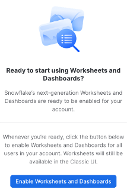

<!-- ------------------------ -->
## Store & Access Unstructured Data
Duration: 10

Let’s start by preparing to load the unstructured data into Snowflake. Snowflake supports two types of stages for storing data files used for loading and unloading:
- [Internal stages](https://docs.snowflake.com/en/user-guide/data-load-overview.html#internal-stages) store the files internally within Snowflake.
- [External stages](https://docs.snowflake.com/en/user-guide/data-load-overview.html#external-stages) store the files in an external location (i.e. S3 bucket) that is referenced by the stage. An external stage specifies location and credential information, if required, for the bucket.

### Create a Database, Schema, and Warehouse
Before creating any stages, let’s create a database and a schema that will be used for loading the unstructured data. We will use the UI within the Worksheets tab to run the DDL that creates the database and schema. Copy the commands below into your trial environment, and execute each individually.

```sql
use role sysadmin;

create or replace database emaildb comment = 'Enron Email Corpus Database';
create or replace schema raw;
create or replace warehouse quickstart;

use database emaildb;
use schema raw;
use warehouse quickstart;
```

### Access Unstructured Data Stored in an S3 Bucket
The data we will be using in this lab is stored in an S3 bucket.

#### Create an External Stage
You are working with unstructured PDFs that have already been staged in a public, external S3 bucket. Before you can use this data, you first need to create a Stage that specifies the location of our external bucket.

<aside class="warning">
  For this lab we are using an AWS S3 bucket in us-east-1. To minimize data egress/transfer costs in the future, you should select a staging location from the same cloud provider and region as your Snowflake environment.
</aside>

Grant the `PUBLIC` schema access to the database, schema, and warehouse just created (This will be relevant in the next section).

```sql
use role sysadmin;
grant usage on database emaildb to public;
grant usage on schema emaildb.raw to public;
grant usage on warehouse quickstart to public;
```

From the same worksheet you’ve been using, run this command to create an external stage called `email_stage`.

```sql
use schema emaildb.raw;
-- Create an external stage where files are stored.
create or replace stage email_stage
 url = "s3://sfquickstarts/Getting Started Unstructured Data/Emails/mailbox/"
 directory = (enable = true auto_refresh = true);
```

You can run this command to see a list of the files in your external stage.

```sql
ls @email_stage;
```
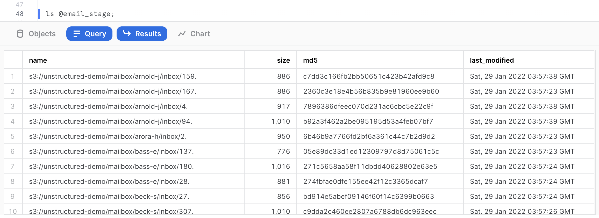

We can see that the stage contains various mailboxes from Enron users containing some files (which are text files) of various sizes. We can get a summary of the file corpus in the query results on the right-hand side. For the purpose of this quickstart, just a sample of 226 files out of 517,551 files has been extracted.

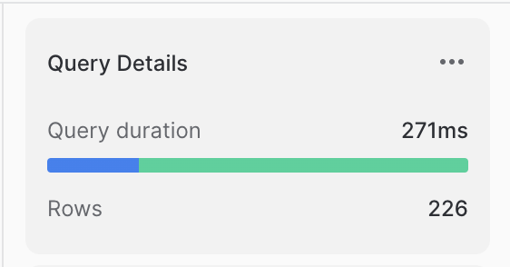

__The size of the files__: We can see that the file size ranges from 666 bytes to 1023 bytes, with the majority of the files closer to 1023 bytes. If we click on the size metric, we can get more detailed information. The total corpus size is 208,414 bytes, with an average size of 922 bytes. If we hover over the histogram, we can filter results based on file size.

### Store Unstructured Data in an Internal Stage
Alternatively, you can store data directly in Snowflake with internal stages. Now, we want to create an internal stage and upload the same files while maintaining the directory structure of the various individual mailboxes on an internal stage.

#### Create an Internal Stage
Run this command to create an internal stage called `email_stage_internal` as follows.

```sql
use schema emaildb.raw;
create or replace stage email_stage_internal
directory = (enable = TRUE)
encryption = (type = 'SNOWFLAKE_SSE');
```

<aside class="warning">
    Note that we have to specify a server-side encryption on the internal stage. When using the default client side encryption, the files will be returned encrypted and not readable when accessed through URLs (in Section 6).
</aside>

#### Download Data and Scripts
We need to first download the following files to the local workstation by clicking on the hyperlinks below. The subsequent steps require [SnowSQL CLI](https://docs.snowflake.com/en/user-guide/snowsql.html) installed on the local workstation where the lab is ran:

- [upload.snf](<https://sfquickstarts.s3.amazonaws.com/Getting Started Unstructured Data/Files/upload.snf>): SnowSQL Script which will upload the files to the internal stage just created.
- [mailbox.tar.gz](<https://sfquickstarts.s3.amazonaws.com/Getting Started Unstructured Data/Files/mailbox.tar.gz>): The actual email data.

Once downloaded, untar the contents of the files on your local workstation and note the full path including the mailbox parent directory of the tar archive. In the example below, this path is `/Users/znh/Downloads/quickstart/`. The file can be untarred as follows.

```bash
cd /Users/znh/Downloads/quickstart/
tar xzvf mailbox.tar.gz
```

#### Upload Files using SnowSQL
Before opening terminal, find out your account identifier which for the trial account will be `&lt;account-locator&gt;.&lt;region-id&gt;.&lt;cloud&gt;`. These fields can be retrieved from the URL of your Snowflake account.

For example, the URL to access the trial account is `https://xx74264.ca-central-1.aws.snowflakecomputing.com/`. These are the values for the account identifier:

- Account Identifier: `xx74264`
- Region ID: `ca-central-1`
- Cloud: `aws`

There may be additional segments if you are using your own account part of an organization. You can find those from the URL of your Snowflake account. Please check the [Snowflake Documentation](https://docs.snowflake.com/en/user-guide/admin-account-identifier.html#account-identifiers) for additional details on this topic.

Now open a terminal on your workstation and run the following SnowSQL command. You will be prompted for the password for the Snowflake user passed as a parameter.

```
snowsql -a <account-identifier> \
-u <user-id> -d emaildb -r sysadmin -s raw \
-D srcpath=<source-path> \
-D stagename=@email_stage_internal \
-o variable_substitution=true -f upload.snf
```

Using the examples above for the path and the account identifier, and the userid `myuser`, the command would be:

```
snowsql -a xx74264.ca-central1-1.aws \
-u myuser -d emaildb -r sysadmin -s raw \
-D srcpath=/Users/znh/Downloads/quickstart/mailbox \
-D stagename=@email_stage_internal \
-o variable_substitution=true -f /Users/znh/Downloads/quickstart/upload.snf
```

The upload may take a few seconds depending on the speed of your internet connection. If the upload is successful, you should see data being uploaded in each subfolder, and you may see an output like the following on your terminal.

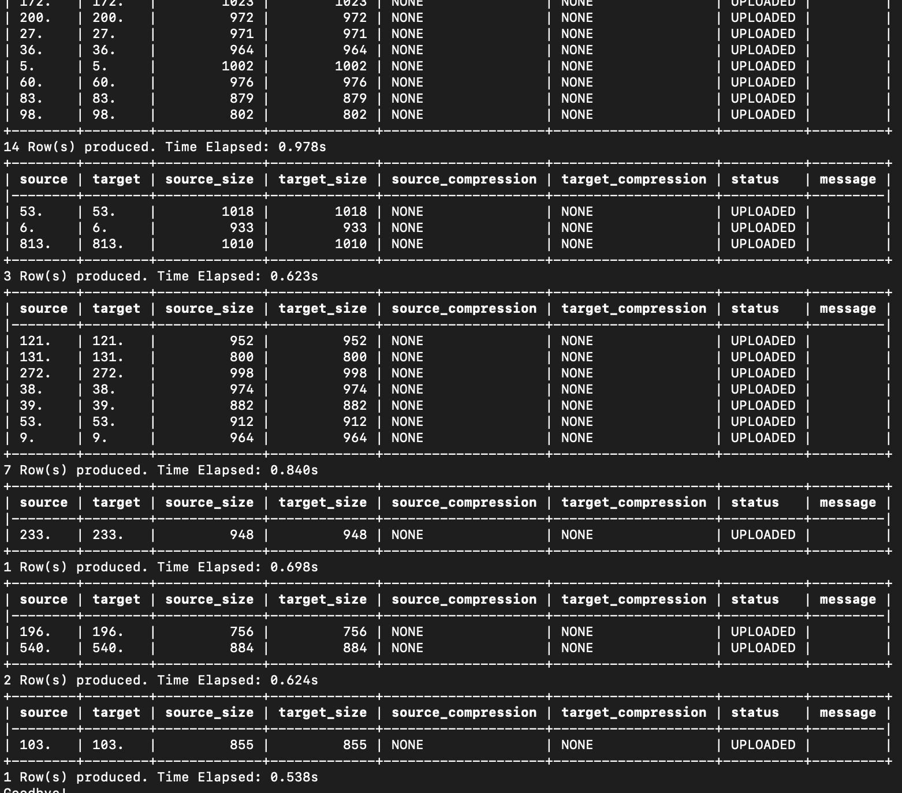

Verify if the files have been uploaded successfully by entering the following command on your Snowflake worksheet.

```sql
ls @email_stage_internal;
```

You should now see an identical list of files uploaded to the internal stage. Make sure you see 226 files uploaded

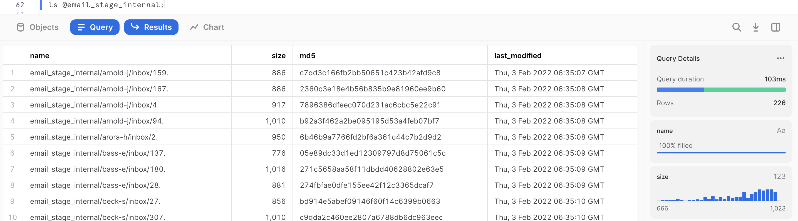

<!-- ------------------------ -->
## Govern Unstructured Data Access
Duration: 5

Just like structured and semi-structured data, access permissions to unstructured data in Snowflake can be governed using role-based access control (RBAC).

### Create Role and Grant Access
Let’s create a role that will provide read access to the external stage we’ve already created that contains PDFs.

Let’s first create the analyst role.

```sql
use role accountadmin;
create or replace role analyst;
grant role analyst to role sysadmin;
```

Then, switch back to `sysadmin` role, and `grant` the role `analyst` the rights to use the database `emaildb`, and the schema `raw` we just created earlier, as well as the ability to `read` from the stage.

```sql
grant usage on database emaildb to role analyst;
grant usage on schema emaildb.raw to role analyst;
grant usage on warehouse quickstart to role analyst;
grant read on stage email_stage_internal to role analyst;
```

You can verify the `analyst` role only has access to read by listing the files in the external stage, then trying to remove files from the external stage. When trying to remove, this should result in an error message.

```sql
use role analyst;

-- List files from the stage. This should execute successfully.
ls @email_stage_internal;

-- Try to remove files from the stage. This should return an error.
rm @email_stage_internal;
```

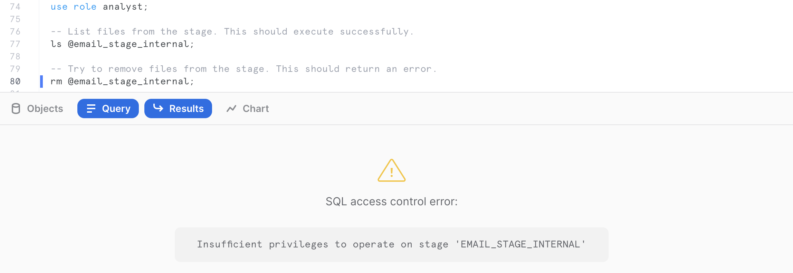

In the subsequent sections, we will see a more fine-grained access control of the different unstructured files stored in Snowflake using scoped URLs.

<!-- ------------------------ -->
## Catalog Unstructured Data using Directory Tables
Duration: 6

One of the main pain points in managing large repositories of unstructured data is the ability to access metadata easily on the numerous files, as well as retrieve files per some metadata attributes (last modified, file size, file patterns).

Directory Tables are built-in tables in Snowflake that provide an up-to-date, tabular file catalog for external and internal stages. Directory Tables make it easy to search for and query files using SQL.

We will first reset the session parameters to the correct role, virtual warehouse, database and schema:

```sql
use role sysadmin;
use warehouse quickstart;
use schema emaildb.raw;
```

Prior to accessing the directory, it needs to be refreshed first for the files previously uploaded using the following command.

```sql	
alter stage email_stage_internal refresh;
```

Run the following command to access the directory table.

```sql
select *
from directory(@email_stage_internal);
```

This will provide some detailed metadata information about the files stored in the stage including the `RELATIVE_PATH`, the `LAST MODIFIED` timestamp, the `SIZE`, the `ETAG` as well as the `FILE URL` (more information on this in the next section).

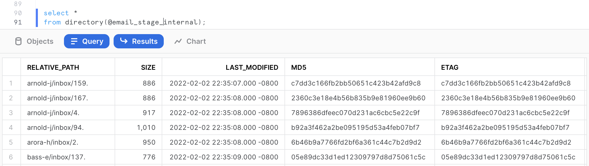


### Searching Directory Tables
We could now query these files using some SQL commands. For example, let’s assume we want to identify all the emails from the mailbox belonging to the user `nemec-g`. We could easily do this with the following SQL query.

```sql
select *
from directory(@email_stage_internal) 
where RELATIVE_PATH like '%nemec-g%';
```
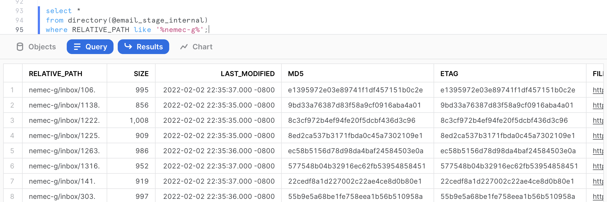

This query returns the 13 emails belonging to that user. Now let’s try to identify the 5 largest email text in the dataset. We can do that with the following query.

```sql
select *
from directory(@email_stage_internal)
order by size desc
limit 5;
```

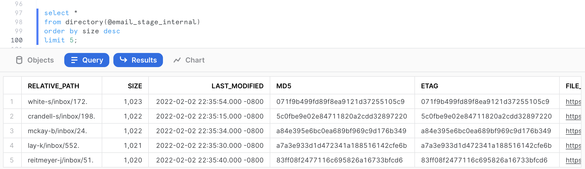

### Automatic Refresh
Say you want the directory table to refresh whenever a file is added to your S3 bucket. This can be accomplished by using event notifications in S3. When a new file is added to a bucket, S3 will send a notification to Snowflake, and a Stream can refresh the directory table.

In this quickstart, we won’t setup notifications in S3, but the command below is what you would use to create a stream on the directory table for a stage. More detailed documentation for automatically refreshing directory tables can be found [here](https://docs.snowflake.com/en/user-guide/data-load-dirtables-auto.html).

```sql
-- Create a table stream on directory table
create stream documents_stream on directory(@documents);
```

<!-- ------------------------ -->
## URLs for Secure Access
Duration: 5

In the previous sections, we have seen how to store unstructured data in Snowflake, as well as access metadata about the unstructured files, and build queries to retrieve files based on metadata filters. 

In this section, we will look into how Snowflake offers access to the unstructured data through various types of URLs, as well as provide a more granular governance over unstructured data than at the stage level, as reviewed previously in Section 2.

There are three different types of URLs that you can use to access unstructured data:
- [__Scoped URL__](https://docs.snowflake.com/en/sql-reference/functions/build_scoped_file_url.html): A scoped file URL can be generated for a user to give the user short-lived, scoped access to the file without giving privileges on the stage.
- [__File URL__](https://docs.snowflake.com/en/sql-reference/functions/build_stage_file_url.html): A file URL requires a user to be authenticated with Snowflake and requires the user to have read privileges on the stage.
- [__Pre-signed URL__](https://docs.snowflake.com/en/sql-reference/functions/get_presigned_url.html): As the name suggests, pre-signed URLs are already authenticated. Users can simply download the files using pre-signed URLs.


The URL format for files is https://&lt;account&gt;.snowflakecomputing.com/api/files/&lt;db_name&gt;/&lt;schema_name&gt;/&lt;stage_name&gt;/&lt;file_path&gt;. 

### Scoped URL
Scoped URLs are encoded URLs that permit temporary access to a staged file without granting privileges to the stage. The URL expires when the persisted query result period ends (i.e. the results cache expires), which is currently 24 hours.

We can generate a scoped URL of any file using the function `build_scoped_url()`. For example, let’s create a view which provides the scoped URL for files in the stage `email_stage_internal`.

```sql
create or replace view email_scoped_url_v
as
select
	relative_path
	, build_scoped_file_url(@email_stage_internal,relative_path) as scoped_url
from directory(@email_stage_internal);
```
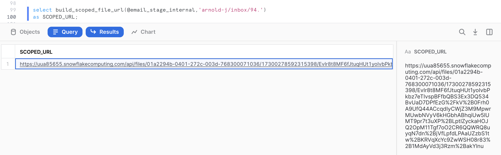

As explained previously, this URL will be valid for 24 hours. Snowsight retrieves the file only for the user who generated the scoped URL.

Scoped URLs enable access to the files via a view that retrieves scoped URLs. Only roles that have privileges on the view can access the files. The scoped URL contents are all encrypted and doesn't give any information about the bucket, database or schema.

#### Secure Access with RBAC and Scoped URL
Let’s assume a scenario where the `analyst` role needs access to all the files from the inbox of `NEMEC-G`. We can build a dynamic view which will filter the output based on the role of the view user.

First let’s build an assignment table where various roles (or even users) can be assigned a given mailbox for further analysis.

```sql
create or replace table assignment (mailbox string, role string, filter string);

insert into assignment values ('NEMEC-G','analyst','%nemec-g%');
insert into assignment values ('*','accountadmin','%');

select * from assignment;
```

As we can see from the query output above, the assignment table controls a 1-to-1 role-to-mailbox access mapping.

We can now build a SQL view which will join with the assignment table to dynamically filter rows based on the role of the user executing the view and grant access to the view to the `analyst` role:

```sql
create or replace secure view analyst_file_access_v as
    select
	    relative_path
		, build_scoped_file_url(@email_stage_internal,relative_path) as scoped_url
    from directory(@email_stage_internal)
	    inner join assignment
    where relative_path like filter
  	    and role = current_role();

grant select on analyst_file_access_v to role analyst;
```

Let’s switch to role `analyst` and query the view.

```sql
use role analyst;
use warehouse quickstart;
select * from analyst_file_access_v;
```
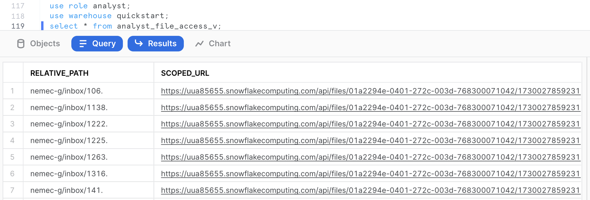

Click the `scoped_url` corresponding to the file `1222.` to your workstation and review the file locally.

If we switch the role to `sysadmin` and run the same query:

```sql
use role sysadmin;
select * from analyst_file_access_v;
```

This returns scoped URLs to access all the files.

As we just experimented, scoped URLs are ideal for use in custom applications, providing unstructured data to other accounts via a share, or for downloading and ad-hoc analysis of unstructured data via Snowsight.


### File URL
A file URL is a permanent URL that identifies the database, schema, stage, and file path to a set of files, as opposed to the previous scoped URL where all this information is encrypted. A role that has sufficient privileges on the stage can access the files. It does not contain any authentication token. Authentication needs to be done when connecting through REST API. However, it works from our current authenticated Snowsight session.

The following query will provide the file urls for the mailbox `arnold-j`.

```sql
select
    relative_path
    , build_stage_file_url(@email_stage_internal,relative_path) as stage_file_url
from directory(@email_stage_internal) 
where relative_path like '%arnold-j%';
```
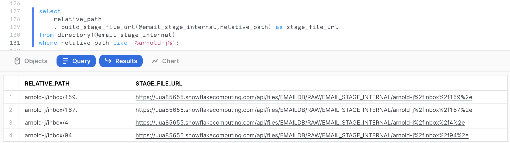

Click on any of the stage file URLs and download the file to your workstation.

### Pre-signed URL
Pre-signed URLs are used to download or access files, via a web browser for example, without authenticating into Snowflake or passing an authorization token. These URLs are ideal for business intelligence applications or reporting tools that need to display the unstructured file contents.

Pre-signed URLs are open but temporary. The expiration time for the access token is configurable when generating the URL. Any user or application can directly access or download the files until the expiration time is reached. 

The following query will generate the pre-signed URLs for the mailbox `beck-s`. In the `get_presigned_url()` system function, we pass the parameter `300` which represents the expiration time for the token in seconds (which is 300s, so 5 minutes in this case).
```sql
select
    relative_path
    , get_presigned_url(@email_stage_internal,relative_path,300) as presigned_url
from directory(@email_stage_internal) 
where relative_path like '%beck-s%';
```
Click on any cell value in the `PRESIGNED_URL` column. This should give the actual full URL on the right hand side in the grey cell. (Click to Copy)

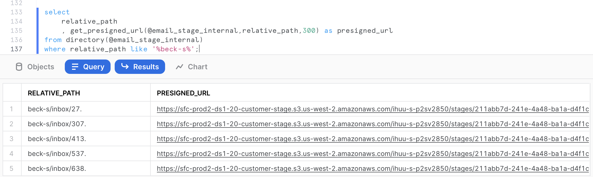

Open a new tab in your web browser, and paste the copied URL. This should download the file on your workstation. As you can see, the URL is valid even when executed outside from the Snowsight UI.

<!-- ------------------------ -->
## Perform Natural Language Processing
Duration: 20

We have so far reviewed how to store unstructured data files, retrieve them, provide granular access to the files through various URLs and through secure views. In this section, we want to extract additional attributes from the files.

The entities extracted are going to be person names mentioned in the emails, as well as locations. The goal is to have these additional attributes used to enrich the file-level metadata for analytics.

### The Java Code
The Java for the user-defined function (UDF) has already been written and provided below. This code uses the open source [Apache OpenNLP](https://opennlp.apache.org/) library to perform natural language processing on English text in this occurrence.

The Java code leverages pre-built [machine learning models](http://opennlp.sourceforge.net/models-1.5/) to perform named entity extraction for persons and locations. These models are packaged manually post-build in a Fat JAR.

At a high level, the code does the following:

- Parse the text file contents using an Apache Tika text parser. 
- Tokenize the parsed contents using a model.
- From the tokens, perform a named entity extraction for persons and locations using pre-built ML models.
- Serialize the results in a JSON string returned as an output.
 
```java
public String ParseText(String filePath) throws IOException, SAXException, TikaException {
			
// Configure gson	      
GsonBuilder gsonBuilder = new GsonBuilder()
Gson gson = gsonBuilder.create();
		
//detecting the file type
BodyContentHandler handler = new BodyContentHandler();
Metadata metadata = new Metadata();
ParseContext pcontext=new ParseContext();
	     
SnowflakeFile file = SnowflakeFile.newInstance(filePath);
InputStream ins = file.getInputStream();
	      
//Text document parser
TXTParser  TexTParser = new TXTParser();
TexTParser.parse(ins, handler, metadata, pcontext);
	      
String Contents = handler.toString();
	      
String[] AllPersonEntities = null;
String[] AllLocationEntities = null;
String JsonResult = null;
	      
NamedEntities NE = new NamedEntities(AllPersonEntities, AllLocationEntities);
			
 try {
         for(int i=0;i<sentences.length;i++){
	          String Tokens[] = new NamedEntityExtraction().ParseTokens(Contents);
	          String PersonEntities[] = new NamedEntityExtraction().findName(Tokens);
	          String LocationEntities[] = new NamedEntityExtraction().findLocation(Tokens);
	           
	          AllPersonEntities = ArrayUtils.addAll(AllPersonEntities, PersonEntities);
	          AllLocationEntities = ArrayUtils.addAll(AllLocationEntities, LocationEntities);
	           
	          NE.setPersons(AllPersonEntities);
	          NE.setLocations(AllLocationEntities);
	           
	          JsonResult = gson.toJson(NE).toString();	
               		
		
			} catch (IOException e) {
	            e.printStackTrace();
	        }
		     return(JsonResult);
}
```

A few elements relevant for this code:

- Notice the main class is __NamedEntityExtraction__.
- The method __ParseText__ will be invoked by the UDF in the next section.
- The file path is passed as a parameter. It can be a URL to the file, or the path on the stage.

### Creating a UDF in Snowflake
The precompiled jar file including all the dependencies has been uploaded and available on a Snowflake s3 public bucket. Creating the UDF involves a few steps in Snowflake.

1. Create the external stage mapping to the S3 bucket URI where the jar file is currently available. From the Snowflake worksheet, enter the following command:
```sql
use role sysadmin;
use schema emaildb.raw;

create or replace stage jars_stage_external
url = "s3://sfquickstarts/Common JARs/"
directory = (enable = true auto_refresh = true);
```
From the Snowflake worksheet, you can run the following command to confirm the jar file is listed in the external stage.
```sql
ls @jars_stage_external;
```

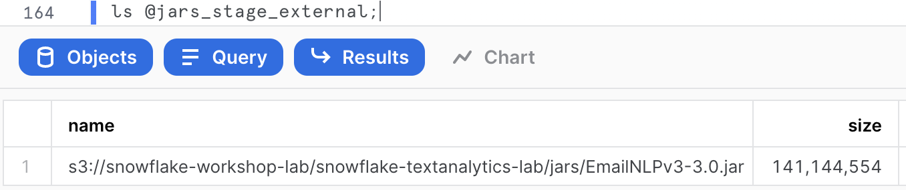

2. We can now create the UDF in Snowflake as the following.
```sql
create or replace function  parseText(file string)
returns string
language java
imports = ('@jars_stage_external/EmailNLPv3-3.0.jar')
handler = 'NamedEntityExtraction.ParseText'
;
```

### Invoking the Java UDF
The UDF can be invoked on any text file containing readable english. From the email corpus stored on the internal stage, we can invoke the UDF as follows.

```sql
select parseText('@email_stage_internal/sanders-r/inbox/60.') 
as entities_extraction;
```

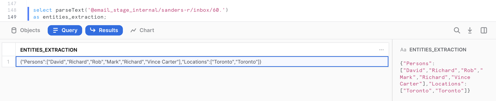

The output is actually serialized as a valid JSON format by the UDF. It contains 2 arrays, one for each named entities extraction:

```json
{
"Persons":["David","Richard","Rob","Mark","Richard","Vince Carter"],
"Locations":["Toronto","Toronto"]
}
```

Since we are using pre-built models which haven’t been trained on this particular corpus, the entity extraction may not always be accurate. However, the models perform overall quite well for illustration purposes for this quickstart.

### Extracting and Storing Named Entities
We want to store the named entities as additional attributes for analysts to be able to select and retrieve the files of interest in their analysis, as well as perform some analytics on the attributes found.

We first want to scale-up the default warehouse size to run the Java UDF at scale across all cores available on all nodes on a 2XL warehouse (64 nodes). This can be done easily and quickly because of Snowflake's instant elasticity:

```sql
alter warehouse quickstart set warehouse_size = xxlarge;
```

Now let's run the following query to store the named entities into a table.

```sql
create or replace table email_named_entities_base as
select
    relative_path
    , upper(replace(get(split(relative_path, '/'), 0), '\"', ''))	as mailbox
    , parseText('@email_stage_internal/' || relative_path) 		as named_entities
from (
    select relative_path
    from directory(@email_stage_internal)
    group by relative_path
);
```

After running this query, we can set the `warehouse` size back to a smaller size.

<aside class="warning">
    THIS STEP IS VERY IMPORTANT NOT TO EXHAUST YOUR TRIAL CREDIT
</aside>

```sql
alter warehouse quickstart set warehouse_size = xsmall;
```

Verify with the following command that the warehouse is back to an `xsmall` size.

```sql
show warehouses;
```

The output should show the `QUICKSTART` size as being `XSMALL`. Now let's query the base table containing the named entities.

```sql
select
    *
from email_named_entities_base
limit 5;
```

For each email, we now have created a `MAILBOX` attribute, as well as JSON string containing the named entities present in the file.

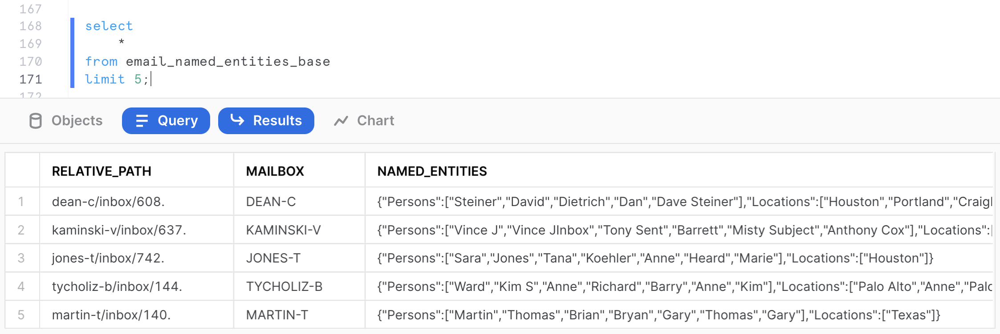

### Exploring the Mailbox Corpus
We have now extracted the named entities the analysts are interested in seeing to do some analytics on this email corpus. We can use Snowflake native capabilities to easily store and query semi-structured data, in this case JSON.

We will first create a view to parse the `NAMED_ENTITIES` JSON string and extract separately the persons and the locations entities, as well as count the number of entities identified in each email:

```sql
create or replace view email_info_v
as
with named_entities
as (
    select
	    relative_path
	    , mailbox
	    , parse_json(named_entities) as named_entities
    from email_named_entities_base
)
select
    relative_path
    , mailbox
    , named_entities:Persons::variant				as persons
    , array_size(persons)							as num_person_entities
    , named_entities:Locations::variant				as locations
    , array_size(locations)							as num_location_entities
    , array_size(persons) + array_size(locations)	as total_entities
    , build_scoped_file_url(@email_stage_internal, relative_path)	as scoped_email_url
from named_entities;
```
We can query the view and examine the output. Notice that we now have JSON arrays in separate columns for name and location entities, count of entities, and a scoped URL to access the file if we need to further examine its contents.

```sql
select * from email_info_v limit 10;
```
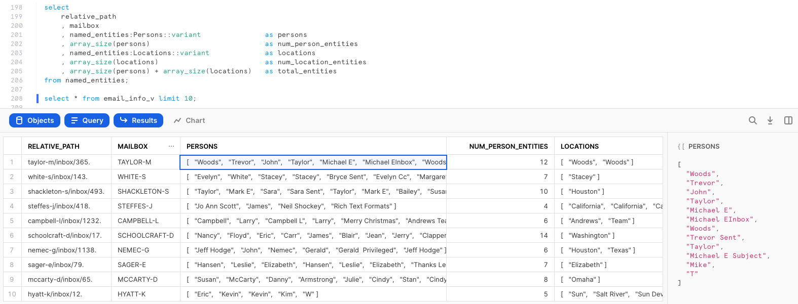

We can now query the view to retrieve various entity metrics. For example, the following query identifies the top 5 emails in terms of total number of entities.

```sql
select
	relative_path
	, mailbox
	, total_entities
	, num_person_entities
	, num_location_entities
	, persons
	, locations
	, scoped_email_url
from email_info_v
order by total_entities desc
limit 10;
```
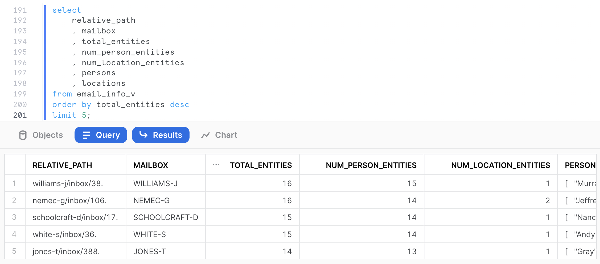

The following query aggregates statistics on the number of entities identified per mailbox and returns the top 5 mailbox by total number of entities identified in the mailbox.

```sql
select
	mailbox
	, count(relative_path)				as num_emails
	, sum(total_entities)				as sum_entities
	, round(avg(total_entities))		as avg_entities
	, sum(num_person_entities)			as sum_persons
	, round(avg(num_person_entities))	as avg_persons
	, sum(num_location_entities)		as sum_locations
	, round(avg(num_location_entities))	as avg_locations
from email_info_v
group by mailbox
order by sum_entities desc
limit 5;
```

We know that the most prolific mailbox is `WHITE-S` for identified entities in this email corpus.

### Performing Analytics on the Mailbox
Let’s assume an analyst wants to identify all email correspondence where the name of 'Willman' (chosen completely randomly in this example) is mentioned. With Snowflake, you can easily flatten arrays to run this type of query.

```sql
select
	relative_path
	, mailbox
	, pers.value::string as person_entity
from
	email_info_v
	, lateral flatten(input => Persons) pers;
```
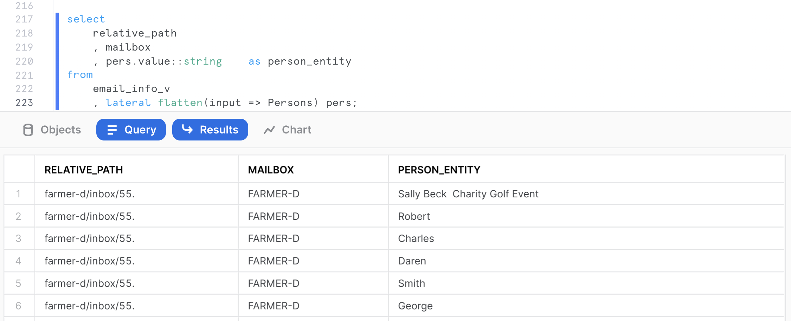

We can use the previous query as a CTE to retrieve all emails mentioning a specific person, including a scoped URL to access the actual email file.

```sql
with persons_flattened as (
    select
    	relative_path
		, mailbox
		, pers.value::string as person_entity
    from
    	email_info_v
		, lateral flatten(input => Persons) pers
)
select
    relative_path
    , mailbox
    , person_entity
    , build_scoped_file_url(@email_stage_internal,relative_path) as scoped_email_url
from persons_flattened
where person_entity like '%Willmann%';
```
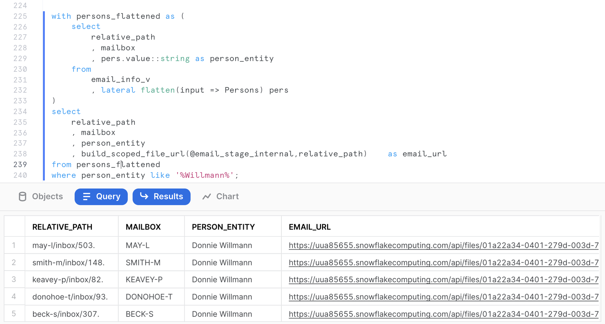

Click on any `MAY-L` mailbox email to download and review the email. This will allow you to learn a little bit more about that person's role and responsibilities in the Enron organization.

Let’s assume we want to identify the top 5 locations mentioned in the email corpus.

```sql
with locations_flattened as (
    select
    	relative_path
	    , mailbox
	    , loc.value::string	as location_entity
    from
	    email_info_v
	    , lateral flatten(input => Locations) loc
)
select
    location_entity
    , count(location_entity) as num_occurrences
from locations_flattened
group by location_entity
order by num_occurrences desc
limit 5;
```

We can use Snowsight to produce a visualization. Click on chart and set the settings as shown below.

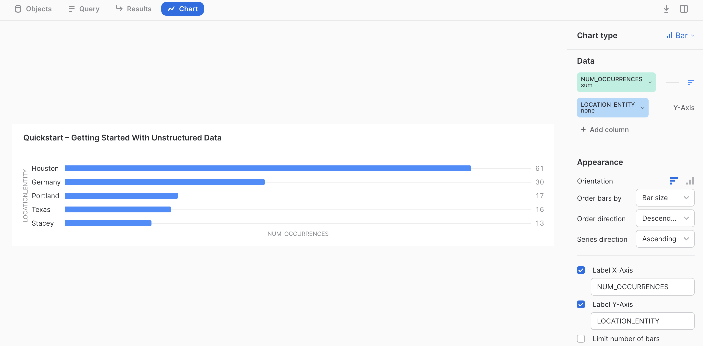

As you can see, we can perform aggregations, and analytics on unstructured text data after extracting entities and information of interest. At this point, one could run more advanced data science use cases or visualizations using the numerous options available in Snowflake.


<!-- ------------------------ -->
## Share Unstructured Data
Duration: 15

In this example, we want to share all the email corpus mentioning 'Willman' with another party using a Snowflake reader account.

### Creating a Reader Account
The first step is to create a reader account as follows. Note that you will need to provide a secure password of your choice.

```sql
use role accountadmin;
create managed account if not exists emaildb_reader
admin_name='admin', admin_password='<password>',
type=reader, COMMENT='Emaildb Reader Account';
```

This command should return the account name, and the URL to access the account. Please copy and paste the output of the command as it provides you the login URL information for the account, as well as the user and password you chose

```
{
"accountName":"<account_name>",
"loginUrl":"https://<account>.snowflakecomputing.com"
}
```

You can run the following command to retrieve the managed account information at anytime.

```sql
show managed accounts;
```

You can connect to the previous reader account using the URL, and the userid/password credentials you passed as parameters.

### Creating a Secure View to Share
Let’s now create the secure view based on the query ran in the previous section that will be shared with the reader account.

```sql
use role sysadmin;
use schema emaildb.raw;

create or replace secure view email_corpus_willman_v as
with persons_flattened as (
    select
        relative_path
        , mailbox
        , pers.value::string as person_entity
    from
		email_info_v
        , lateral flatten(input => Persons) pers
)
select
    relative_path
    , mailbox
    , person_entity
    , build_scoped_file_url(@email_stage_internal,relative_path) as email_url
from persons_flattened
where person_entity like '%Willmann%';
```

### Create the Share

We can now create the share as follows. You will need to provide the reader account name created earlier:

```sql
-- Create the share object
use role accountadmin;
create or replace share email_corpus 
comment='Share in scope email corpus information';

--what are we sharing?
grant usage on database emaildb to share email_corpus;
grant usage on schema emaildb.raw to share email_corpus;
grant select on view emaildb.raw.email_corpus_willman_v to share email_corpus;

-- whom are we sharing with?
alter share email_corpus add accounts = <reader-account-name>;
```

We can review the share we have just created. The following command provides all the shares in the account.

```sql
-- check the share
show shares like 'email_corpus';
```

We can get more details about the share, and the scope of the objects shared using the following command.

```sql
-- review share
describe share email_corpus;
```
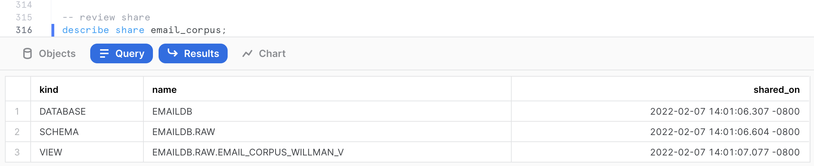

This command shows us that the view `EMAIL_CORPUS_WILLMAN_V` is shared from the database `EMAILDB` and schema `RAW` in the current account.

### Accessing Shared Data
Switch to the web browser tab where you opened the session with the reader account created in step 6.1 or open a new session on the reader account. Now, click on the blue Snowsight UI button at the top and authenticate again.

After logging in, as this is a new account, click on the worksheet button at the top and create a new virtual warehouse.

```sql
use role sysadmin;
	
create or replace warehouse compute_wh 
warehouse_size=xsmall
auto_suspend=1
auto_resume=true
initially_suspended=true;

grant usage on warehouse compute_wh to public;
```

First, let's switch back to the `ACCOUNTADMIN` role. Click on the __Home__ button in the top-left. Then in the top-left, click on __ADMIN__, then hover over __Switch Role__, and click on __ACCOUNTADMIN__.
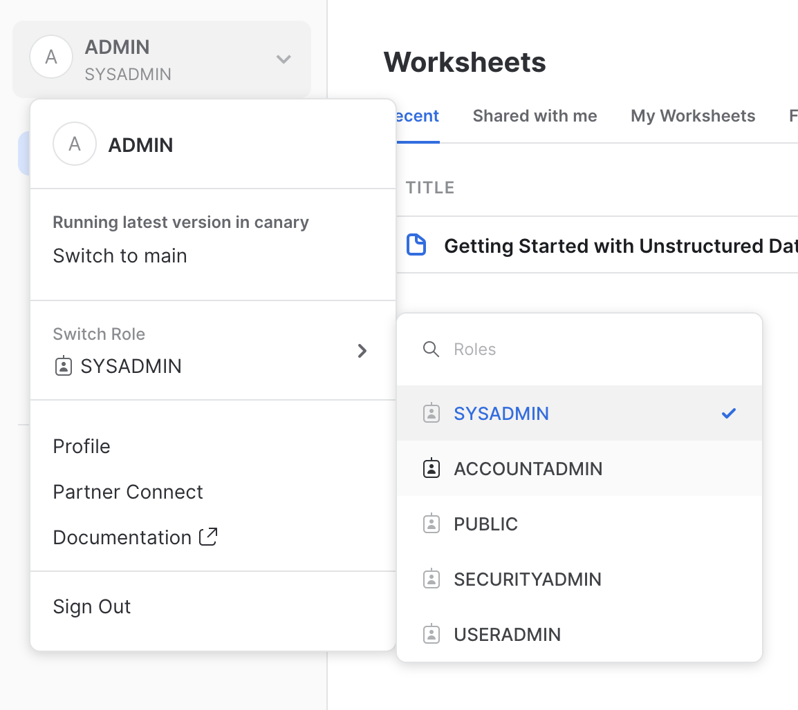

Now let's view the shared data. In the pane on the left, click on on __Data__, then __Shared Data__. You will see the `EMAIL_CORPUS` database listed under __Ready to Get__. Select it and give the database name `EMAIL_CORPUS` and make it available to `PUBLIC`, then click the __Get Data__ button.
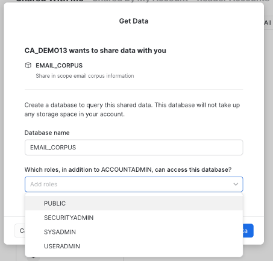

Click on __Databases__, then click on the __Refresh__ button (round arrow button on the right side above the database list). You will now see the database `EMAIL_CORPUS`.
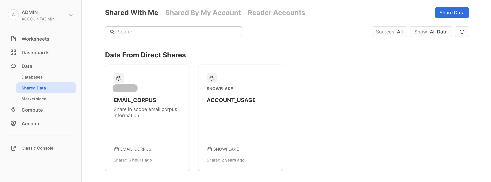

Select the worksheet created in this reader account. Add the following commands to set the worksheet session parameters and review the view objects available.

```sql
use role sysadmin;
use schema email_corpus.raw;
use warehouse compute_wh;

show views;
```

If you expand the database hierarchy on the left side of the window, you will see that the share appears from the consumer side as a database `EMAIL_CORPUS`, with a schema `RAW` and a single view object `EMAIL_CORPUS_WILLMAN_V`.

We can now query the shared data. The query below will display only the emails related to 'Willmann'.

```sql
select * from email_corpus_willman_v;
```

From the results, notice that all the URLs are encrypted, not revealing any information of the location where the shared data came from. Click on any `EMAIL_URL` and get access to the actual email text downloaded to your workstation. Download and review the email. Make sure it is valid.
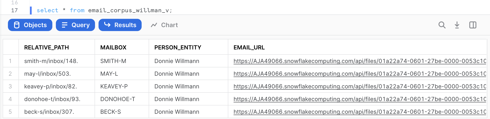

You have now completed this demonstration of how unstructured data can be securely shared in the Snowflake Data Cloud using Snowflake Data Sharing capabilities.


<!-- ------------------------ -->
## Conclusion
Duration: 1

Congratulations! You used Snowflake to perform natural language processing on email files. 

### What we've covered
- Accessing external data with an __External Stage__
- Storing unstructured data with an __Internal Stage__ and __SnowSQL__
- Governing unstructured data with __Role-Based Access Control__
- Catalog unstructured data with __Directory Tables__
- Securely access unstructured data with __Scoped, File, and Pre-signed URLs__
- Processing unstructured data with a __Java UDF__
- Sharing unstructured data in the __Data Cloud__

### Related Resources
- [Unstructured Data Docs](https://docs.snowflake.com/en/user-guide/unstructured.html)
- [Java UDF Docs](https://docs.snowflake.com/en/developer-guide/udf/java/udf-java.html)
- [Snowpark Docs](https://docs.snowflake.com/en/developer-guide/snowpark/index.html)
