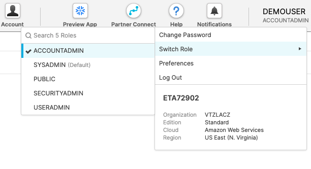
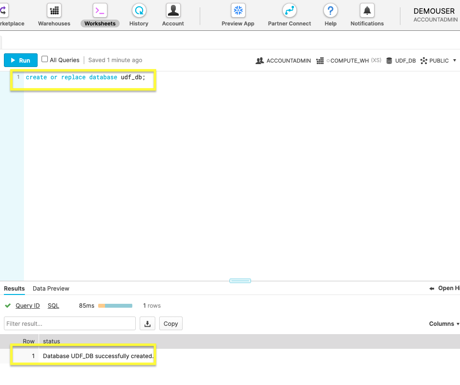
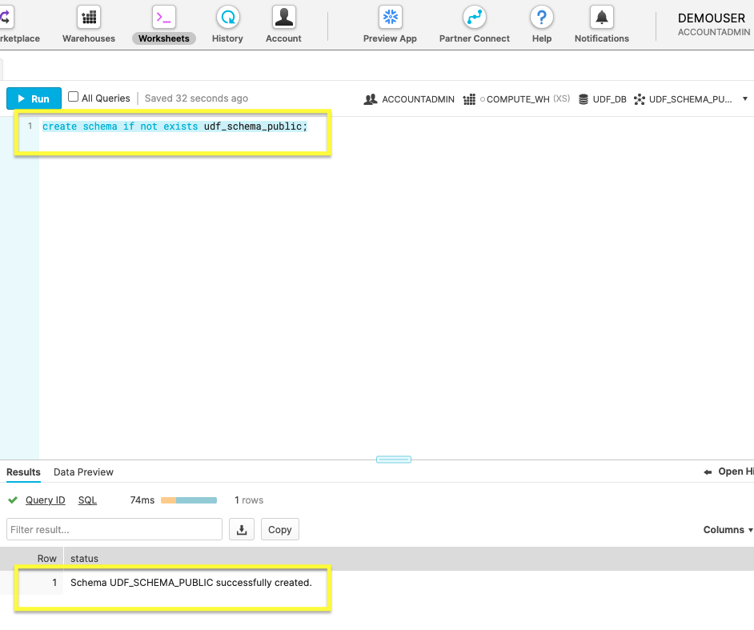
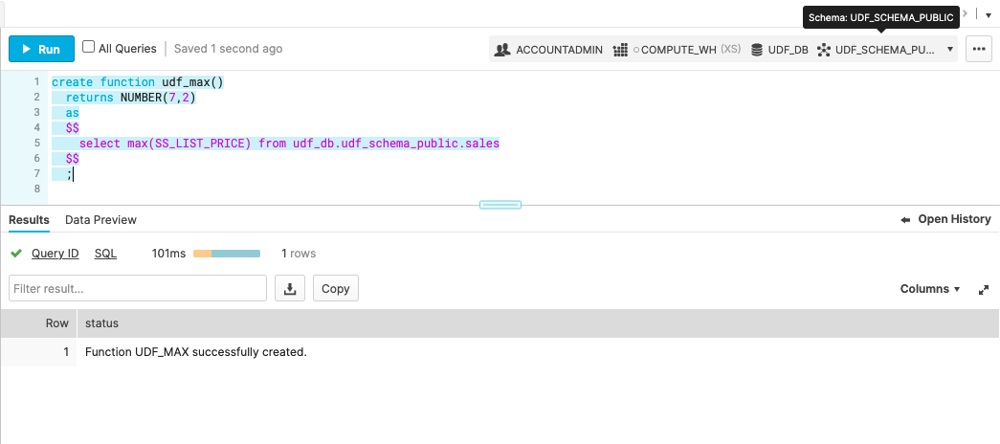
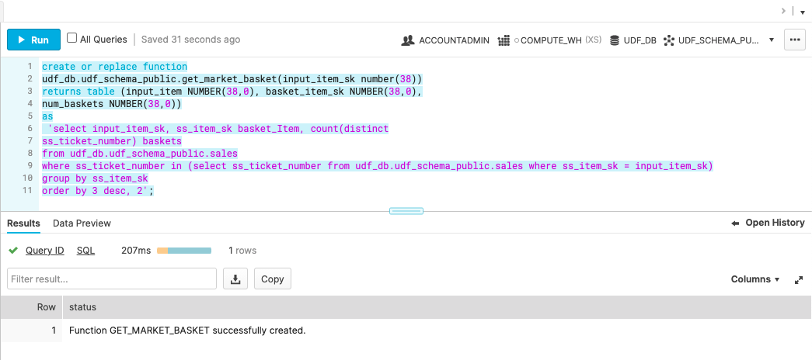
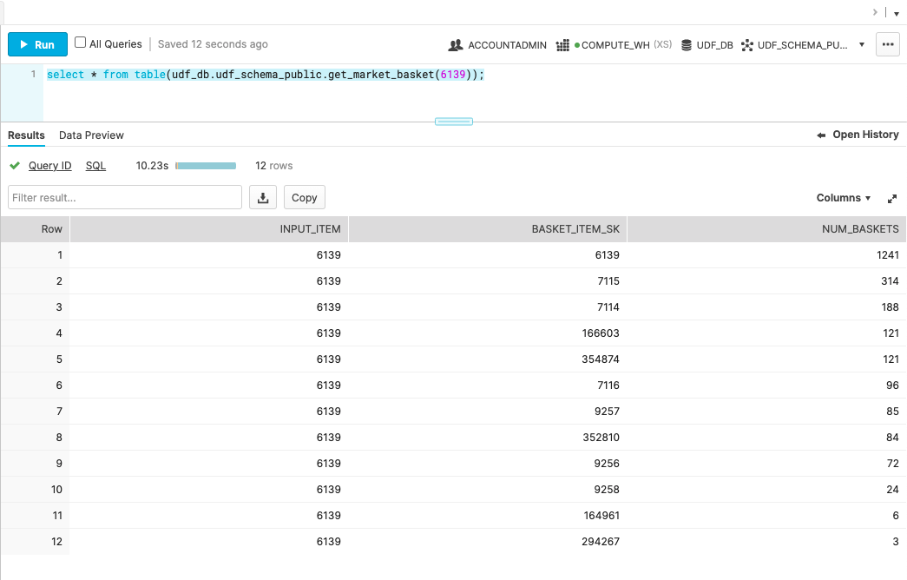

summary: Guide to getting started with user-defined SQL functions
Id: getting_started_with_user_defined_sql_functions
categories: Getting Started, UDF, UDTF
environments: Web
status: Published
feedback link: https://github.com/Snowflake-Labs/devlabs/issues
tags: Getting Started, SQL, UDF, UDTF
authors: Jason West

# Getting Started With User-Defined SQL Functions

<!-- ------------------------ -->
## Overview
Duration: 3

### User-defined functions (UDFs) let you extend the system to perform operations that are not available through the built-in, system-defined functions provided by Snowflake. 

#### Snowflake currently supports the following languages for writing UDFs:

- **SQL**: A SQL UDF evaluates an arbitrary SQL expression and returns either scalar or tabular results.

- JavaScript: A JavaScript UDF lets you use the JavaScript programming language to manipulate data and return either scalar or tabular results.

- Java: A Java UDF lets you use the Java programming language to manipulate data and return scalar results.


#### This guide will walk you through setting up Snowflake and getting familiar with 
- Creating and executing **SQL** user-defined functions(UDFs) 
- Creating and executing **SQL** user-defined table functions(UDTFs).


### Prerequisites

If you are not familiar with the Snowflake User Interface, then please watch the video below.

- Quick Video [Introduction to Snowflake](https://www.youtube.com/watch?v=fEtoYweBNQ4&ab_channel=SnowflakeInc.)

### What You’ll Learn

- Snowflake account and user permissions
- Creating database objects
- Query a user-defined scalar function
- Query a user-defined table function
- Delete database objects


### What You’ll Need

- A [Snowflake](https://signup.snowflake.com/) Trial Account

### What You’ll Build

- Database objects and user-defined functions to query those objects.

<!-- ------------------------ -->
## Begin With the Basics
Duration: 3

#### First, we'll go over how to create your Snowflake account and manage user permissions.

### Create a Snowflake Account

Snowflake lets you try out their services for free with a [trial account](https://signup.snowflake.com/). Follow the prompts to activate your account via email.

If you already have a Snowflake account, you can use it.  You just need a role with permission to create a database.

### Access Snowflake’s Web Console

```
https://<your-account-name>.snowflakecomputing.com/console/login
```

Log in to the [web interface](https://docs.snowflake.com/en/user-guide/connecting.html#logging-in-using-the-web-interface) from your browser. The URL contains your [account name](https://docs.snowflake.com/en/user-guide/connecting.html#your-snowflake-account-name) and potentially the region.

### Changing your role

Positive
: If you already have a Snowflake account, you can use a role with privildges to create a database.



Switch the account role from the default <code>SYSADMIN</code> to <code>ACCOUNTADMIN</code>.
This **is not required**, but will ensure your web UI aligns with the screen shots in this lab.

With your new account created and the role configured, you're ready to begin creating database objects in the following section.

<!-- ------------------------ -->
## Create Database Objects
Duration: 5

With your Snowflake account at your fingertips, it's time to create the database objects.

Within the Snowflake web console, navigate to **Worksheets** and use a fresh worksheet to run the following commands.

### 1. Create a new Database

```sql
create or replace database udf_db;
```

Build your new database named `udf_db` with the command above.



Positive
: The **Results** should display a status message of **Database UDF_DB successfully created** .

### 2. Create a new Schema

```sql
create schema if not exists udf_schema_public;
```

Use the above command to whip up a schema called `udf_schema_public`.



Positive
: The **Results** should display a status message of **Schema UDF_SCHEMA_PUBLIC successfully created**.

### 3. Copy Sample Data Into New Table

```sql
create or replace table udf_db.udf_schema_public.sales 
  as
    (select * from snowflake_sample_data.tpcds_sf10tcl.store_sales sample block (1));

```

Create a table named ‘sales’ and import the sales data with this command. Bear in mind, importing the sample data will take a longer time to execute than the previous steps.


Positive
: The **Results** should display a status of **Table SALES successfully created** .


With the necessary database objects created, it’s time to move onto the main course of working with a UDF in the next section.

<!-- ------------------------ -->
## Execute a Scalar User-Defined Function
Duration: 6

With the database primed with sample sales data, we're _almost_ ready to try creating a scalar UDF. Before diving in, let’s first understand more about UDF naming conventions.

Negative
: If the function name doesn't specify the database and schema(e.x. `udf_db.udf_schema_public.udf_name`) then it defaults to the active session. Since UDFs are database objects, it's better to follow their [naming conventions](https://docs.snowflake.com/en/sql-reference/udf-overview.html#naming-conventions-for-udfs). For this quick practice, we'll rely on our active session.

### 1. Create UDF

```sql
create function udf_max()
  returns NUMBER(7,2)
  as
  $$
    select max(SS_LIST_PRICE) from udf_db.udf_schema_public.sales
  $$
  ;
```

The [SQL function](https://docs.snowflake.com/en/sql-reference/functions/min.html#min-max) `max` returns the highest value in the column `SS_LIST_PRICE`.



The image shows the successful creation of the function `udf_max`.

### 2. Call the UDF

```sql
select udf_max();
```

Summon your new UDF with the [SQL command](https://docs.snowflake.com/en/sql-reference/sql/select.html) `select`.


Pictured above is the returned **Results**.

Now that you've practiced the basics of creating a UDF, we'll kick it up a notch in the next section by creating a UDF that returns a new table.

<!-- ------------------------ -->
## Query With User-Defined Table Function
Duration: 6

After creating a successful scalar UDF, move onto making a function that returns a table with a UDTF(user-defined table function).

### 1. Create a UDTF

```sql
create or replace function
udf_db.udf_schema_public.get_market_basket(input_item_sk number(38))
returns table (input_item NUMBER(38,0), basket_item_sk NUMBER(38,0),
num_baskets NUMBER(38,0))
as
 'select input_item_sk, ss_item_sk basket_Item, count(distinct
ss_ticket_number) baskets
from udf_db.udf_schema_public.sales
where ss_ticket_number in (select ss_ticket_number from udf_db.udf_schema_public.sales where ss_item_sk = input_item_sk)
group by ss_item_sk
order by 3 desc, 2';
```

The code snippet above creates a function that returns a table with a market basket analysis.



### 2. Run the UDTF

```sql
select * from table(udf_db.udf_schema_public.get_market_basket(6139));
```

Just like for the scalar UDF, this will execute your function.



Returned is the market basket analysis table based on the sample sales data.

You've practiced making UDTFs and have become familiar with UDFs. In the last section, we'll delete our unneeded database objects.

<!-- ------------------------ -->
## Cleanup
Duration: 2

We've covered a lot of ground! Before we wrap-up, drop the practice database you created in this guide.
This will remove the database and all of the tables and functions that you created.

### 1. Drop the Database


Drop the database: `udf_db`.

```sql
drop database if exists udf_db;
```


Verify the database is entirely gone by checking the **Results** for `UDF_DB successfully dropped`.

<!-- ------------------------ -->
## Conclusion and Next Steps
Duration: 2

You should now have a good handle on SQL UDFs by practicing both scalar and table functions. With our database objects cleared, it's time to look ahead.

Consider the potential of a sharable and [secure](https://docs.snowflake.com/en/sql-reference/udf-secure.html#secure-udfs) user-defined function. You can learn how to share user-defined functions, such as the market basket analysis table, following this post about [the power of secure UDFs](https://www.snowflake.com/blog/the-power-of-secure-user-defined-functions-for-protecting-shared-data/).

### What we've covered

- Registered a Snowflake account
- Configured role permissions
- Created a database and other objects
- Created a table to analyze data with a UDTF
- Queried a custom UDF
- Droping a database to clean up all objects

### Related Resources

For more information on UDF's:

- [SQL UDF's](https://docs.snowflake.com/en/developer-guide/udf/sql/udf-sql.html#sql-udfs)
- [JavaScript UDF's](https://docs.snowflake.com/en/developer-guide/udf/javascript/udf-javascript.html#javascript-udfs)
- [Java UDF's](https://docs.snowflake.com/en/developer-guide/udf/java/udf-java.html#java-udfs)
