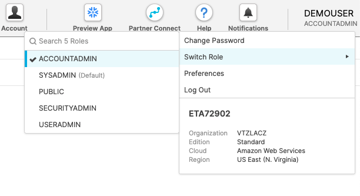
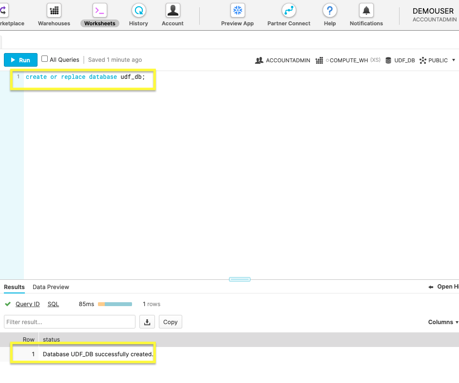
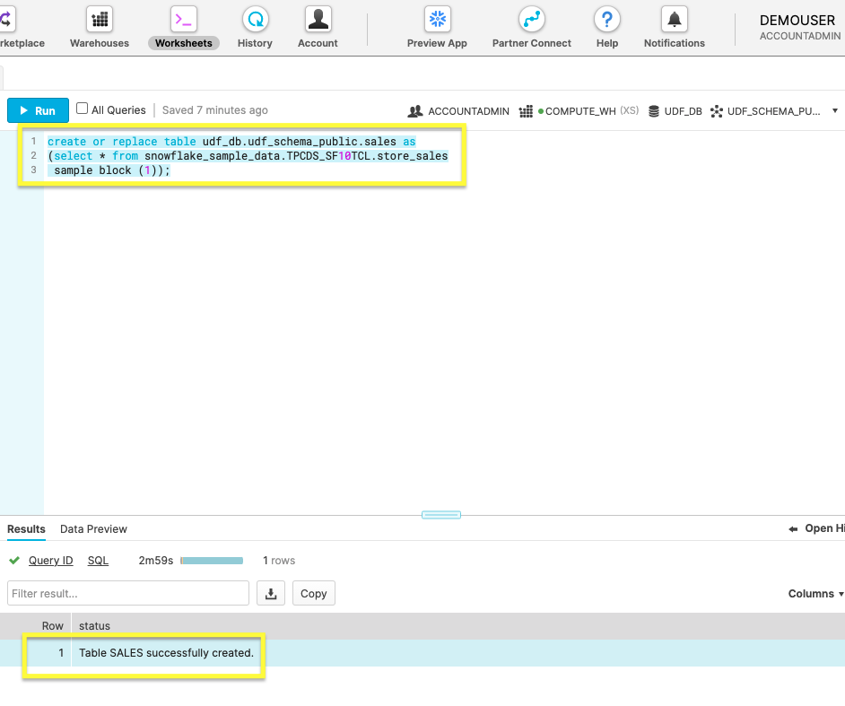
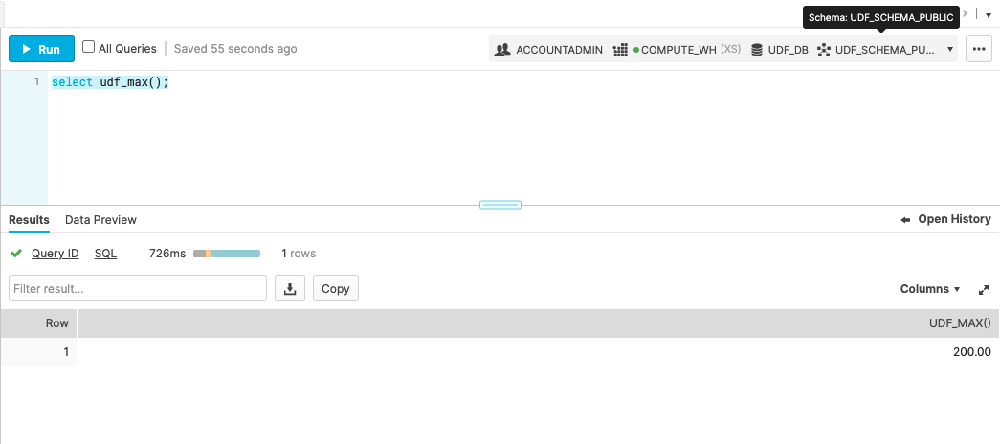
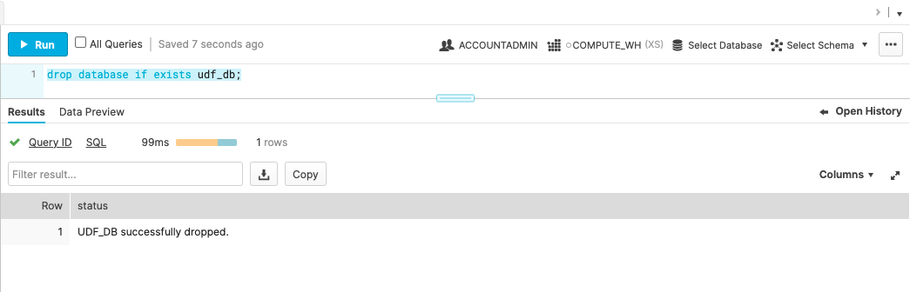

id: getting_started_with_user_defined_sql_functions_kr
summary: 사용자 정의 SQL 함수 시작하기 가이드
categories: undefined
environments: Web
status: Hidden
feedback link: https://github.com/Snowflake-Labs/devlabs/issues
tags: 스노우플레이크 시작하기, SQL, UDF, UDTF, kr
authors: Jason West

# 사용자 정의 SQL 함수 시작하기

<!-- ------------------------ -->
## 개요

Duration: 3

UDF(사용자 정의 함수)로 시스템을 확장하면, Snowflake에서 제공하는 내장 시스템 정의 함수를 통해 제공되지 않는 작업을 수행할 수 있습니다.

#### Snowflake는 현재 UDF 작성을 위해 다음 언어를 지원합니다.

- **SQL**: SQL UDF는 임의 SQL 식을 평가하며 스칼라 또는 테이블 형식 결과를 반환합니다.

- **JavaScript**: JavaScript UDF를 통해 JavaScript 프로그래밍 언어를 사용하여 데이터를 조작하고 스칼라 또는 테이블 형식 결과를 반환할 수 있습니다.

- **Java**: Java UDF를 통해 Java 프로그래밍 언어를 사용하여 데이터를 조작하고 스칼라 결과를 반환할 수 있습니다.

#### 이 가이드는 Snowflake 설정 과정을 안내하며 여러분이 다음에 익숙해질 수 있도록 합니다

- **SQL** UDF(사용자 정의 함수) 생성 및 실행
- **SQL** UDTF(사용자 정의 테이블 함수) 생성 및 실행.

### 사전 필요 조건 및 지식

Snowflake 사용자 인터페이스에 익숙하지 않다면 아래 동영상을 시청하십시오.

- 짧은 [Snowflake 소개](https://www.youtube.com/watch?v=fEtoYweBNQ4&ab_channel=SnowflakeInc.) 동영상

### 학습할 내용

- Snowflake 계정 및 사용자 권한
- 데이터베이스 오브젝트 생성
- 사용자 정의 스칼라 함수 쿼리
- 사용자 정의 테이블 함수 쿼리
- 데이터베이스 오브젝트 삭제

### 필요한 것

- [Snowflake](https://signup.snowflake.com/) 평가판 계정

### 구축할 것

- 오브젝트 쿼리를 위한 데이터베이스 오브젝트 및 사용자 정의 함수.

<!-- ------------------------ -->
## 기본 사항부터 시작하기

Duration: 3

#### 우선 여러분의 Snowflake 계정을 생성하고 사용자 권한을 관리하는 방법을 다루겠습니다.

### Snowflake 계정 생성

Snowflake는 무료로 Snowflake 서비스를 이용해 볼 수 있도록 [평가판 계정](https://signup.snowflake.com/)을 제공합니다. 프롬프트에 따라 이메일로 계정을 활성화합니다.

Snowflake 계정이 이미 있다면 이를 사용할 수 있습니다.  데이터베이스 생성 권한을 가진 역할만 있으면 됩니다.

### Snowflake의 웹 콘솔 액세스

```
https://<your-account-name>.snowflakecomputing.com/console/login
```

브라우저에서 [웹 인터페이스](https://docs.snowflake.com/ko/user-guide/connecting.html#logging-in-using-the-web-interface)에 로그인합니다. URL은 여러분의 [계정 이름](https://docs.snowflake.com/ko/user-guide/connecting.html#your-snowflake-account-name)과 잠재적으로 지역을 포함합니다.

### 역할 변경

Positive : Snowflake 계정이 이미 있다면 데이터베이스 생성 권한을 가진 역할을 사용할 수 있습니다.



기본값인 <code>SYSADMIN</code>에서 <code>ACCOUNTADMIN</code>으로 계정 역할을 전환합니다. **필수는 아니지만**, 이 랩의 스크린샷과 웹 UI가 일치하게 만들어 줍니다.

새로운 계정을 생성하고 역할을 구성했으니 다음 섹션에서 데이터베이스 오브젝트 생성을 시작할 준비가 되었습니다.

<!-- ------------------------ -->
## 데이터베이스 오브젝트 생성

Duration: 5

Snowflake 계정에 쉽게 접근할 수 있으니 데이터베이스 오브젝트를 생성할 시간입니다.

Snowflake 웹 콘솔 내에서 **Worksheets**로 이동한 다음 새로운 워크시트를 사용하여 다음 명령을 실행합니다.

### 1. 새로운 데이터베이스 생성

```sql
create or replace database udf_db;
```

위 명령으로 `udf_db`라는 새로운 데이터베이스를 구축합니다.



Positive : **Results**는 **Database UDF_DB successfully created**라는 상태 메시지를 표시해야 합니다.

### 2. 새로운 스키마 생성

```sql
create schema if not exists udf_schema_public;
```

위 명령을 사용하여 `udf_schema_public`이라는 스키마를 생성합니다.


Positive : **Results**는 **Schema UDF_SCHEMA_PUBLIC successfully created**라는 상태 메시지를 표시해야 합니다.

### 3. 새로운 테이블에 샘플 데이터 복사

```sql
create or replace table udf_db.udf_schema_public.sales 
  as
    (select * from snowflake_sample_data.tpcds_sf10tcl.store_sales sample block (1));

```

'sales'라는 테이블을 생성하고 이 명령으로 매출 데이터를 가져옵니다. 샘플 데이터를 가져오는 데 이전 단계에서 보다 더 긴 실행 시간이 소요될 것입니다.



Positive : **Results**는 **Table SALES successfully created**라는 상태 메시지를 표시해야 합니다.

필요한 데이터베이스 오브젝트가 생성되었으니 다음 섹션에서 UDF로 작업하는 메인 수업으로 이동할 시간입니다.

<!-- ------------------------ -->
## 스칼라 사용자 정의 함수 실행

Duration: 6

샘플 매출 데이터가 포함된 데이터베이스가 있으니 스칼라 UDF 생성을 시도할 준비가 _거의_ 끝났습니다. 시작하기 전에 우선 UDF 명명 규칙에 대해 더 자세히 이해해 보겠습니다.

Negative : 함수 이름이 데이터베이스와 스키마(예: `udf_db.udf_schema_public.udf_name`)를 지정하지 않는다면 기본값으로 활성 세션이 됩니다. UDF는 데이터베이스 오브젝트이기에 자체적인 [명명 규칙](https://docs.snowflake.com/ko/sql-reference/udf-overview.html#naming-conventions-for-udfs)을 따르는 것이 더 낫습니다. 빠른 연습을 위해 활성 세션에 의존하겠습니다.

### 1. UDF 생성

```sql
create function udf_max()
  returns NUMBER(7,2)
  as
  $$
    select max(SS_LIST_PRICE) from udf_db.udf_schema_public.sales
  $$
  ;
```

[SQL 함수](https://docs.snowflake.com/ko/sql-reference/functions/min.html#min-max) `max`는 `SS_LIST_PRICE` 열에서 가장 높은 값을 반환합니다.


이미지는 `udf_max` 함수의 성공적인 생성을 보여 줍니다.

### 2. UDF 호출

```sql
select udf_max();
```

[SQL 명령](https://docs.snowflake.com/ko/sql-reference/sql/select.html) `select`로 새로운 UDF를 호출합니다.



위 이미지는 반환된 **Results**입니다.

이제 UDF 생성의 기본 사항을 연습했으니 새로운 테이블을 반환하는 UDF를 생성하여 다음 섹션에서 한 단계 더 어려운 작업을 시작하겠습니다.

<!-- ------------------------ -->
## 사용자 정의 테이블 함수로 쿼리

Duration: 6

성공적인 스칼라 UDF를 생성한 후 UDTF(사용자 정의 테이블 함수)로 테이블을 반환하는 함수를 만들어 보겠습니다.

### 1. UDTF 생성

```sql
create or replace function
udf_db.udf_schema_public.get_market_basket(input_item_sk number(38))
returns table (input_item NUMBER(38,0), basket_item_sk NUMBER(38,0),
num_baskets NUMBER(38,0))
as
 'select input_item_sk, ss_item_sk basket_Item, count(distinct
ss_ticket_number) baskets
from udf_db.udf_schema_public.sales
where ss_ticket_number in (select ss_ticket_number from udf_db.udf_schema_public.sales where ss_item_sk = input_item_sk)
group by ss_item_sk
order by 3 desc, 2';
```

위 코드 조각은 시장바구니 분석을 포함한 테이블을 반환하는 함수를 생성합니다.


### 2. UDTF 실행

```sql
select * from table(udf_db.udf_schema_public.get_market_basket(6139));
```

스칼라 UDF와 같이 이는 여러분의 함수를 실행합니다.


반환된 것은 샘플 매출 데이터를 기반으로 한 시장바구니 분석 테이블입니다.

여러분은 UDTF를 만드는 것을 연습했으며 UDF에 익숙해졌습니다. 마지막 섹션에서는 필요 없는 데이터베이스 오브젝트를 삭제하겠습니다.

<!-- ------------------------ -->
## 정리

Duration: 2

많은 내용을 다뤘습니다! 마무리하기 전에 이 가이드에서 생성했던 연습 데이터베이스를 삭제하십시오. 이는 생성했던 데이터베이스와 모든 테이블 및 함수를 삭제합니다.

### 1. 데이터베이스 삭제

데이터베이스 삭제: `udf_db`.

```sql
drop database if exists udf_db;
```



`UDF_DB successfully dropped`의 **Results**를 확인하여 데이터베이스가 완전히 삭제되었는지 확인합니다.

<!-- ------------------------ -->
## 종료 및 다음 단계

Duration: 2

스칼라와 테이블 함수를 모두 연습했기에 이제 SQL UDF를 잘 다룰 수 있을 것입니다. 데이터베이스 오브젝트를 끝냈으니 앞으로의 단계를 살펴볼 시간입니다.

공유 가능하고 [안전한](https://docs.snowflake.com/ko/sql-reference/udf-secure.html#secure-udfs) 사용자 정의 함수의 잠재력을 고려하십시오. [안전한 UDF의 위력](https://www.snowflake.com/blog/the-power-of-secure-user-defined-functions-for-protecting-shared-data/)에 대한 이 게시물에서 시장바구니 분석 테이블과 같은 사용자 정의 함수를 공유하는 방법을 배울 수 있습니다.

### 다룬 내용

- Snowflake 계정 등록
- 역할 권한 구성
- 데이터베이스 및 기타 오브젝트 생성
- UDTF로 데이터를 분석하기 위한 테이블 생성
- 사용자 지정 UDF 쿼리
- 모든 오브젝트를 정리하기 위해 데이터베이스 삭제

### 관련 리소스

UDF에 대한 더 많은 정보:

- [SQL UDF](https://docs.snowflake.com/ko/developer-guide/udf/sql/udf-sql.html#sql-udfs)
- [JavaScript UDF](https://docs.snowflake.com/ko/developer-guide/udf/javascript/udf-javascript.html#javascript-udfs)
- [Java UDF](https://docs.snowflake.com/ko/developer-guide/udf/java/udf-java.html#java-udfs)