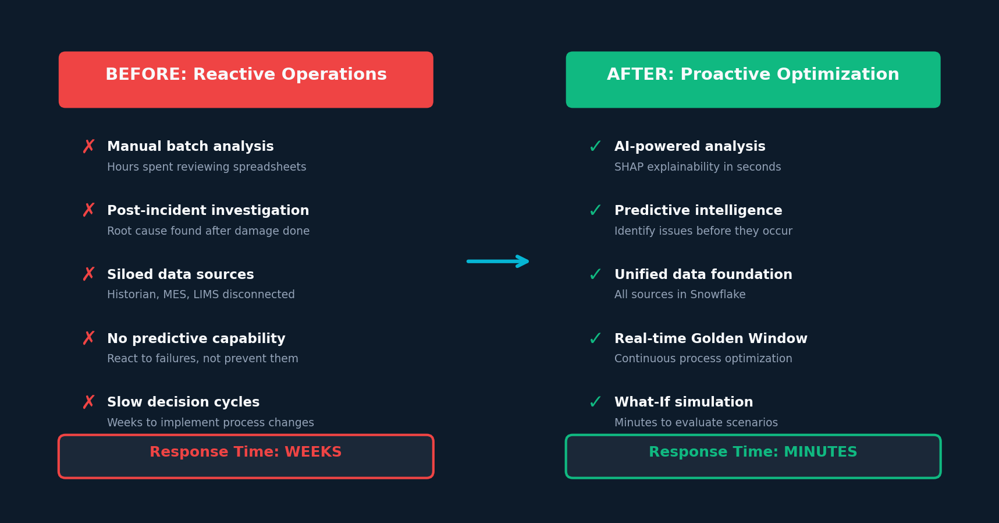
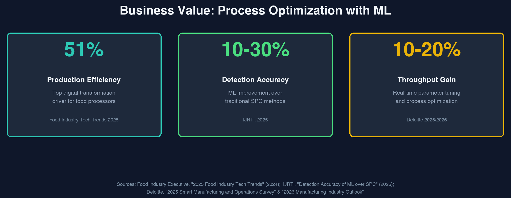
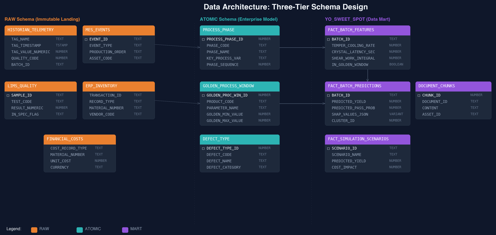
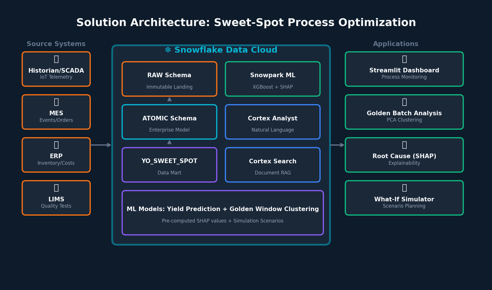
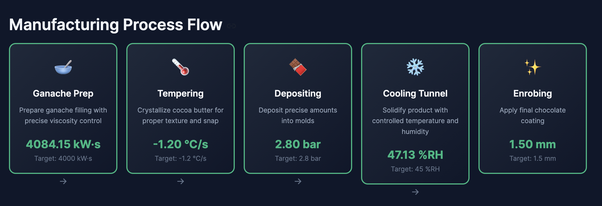
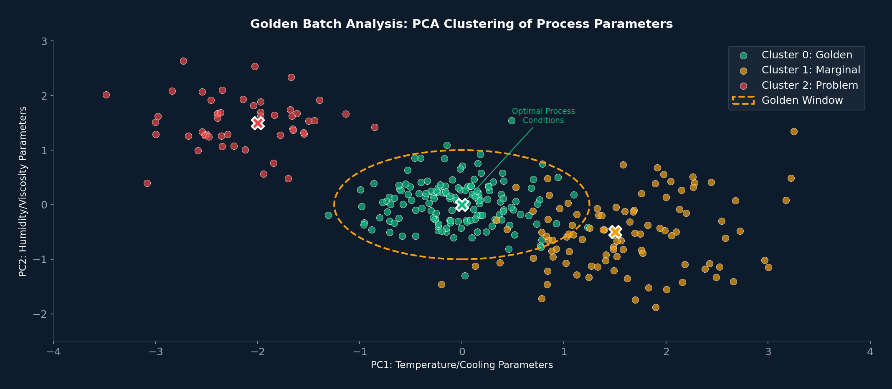
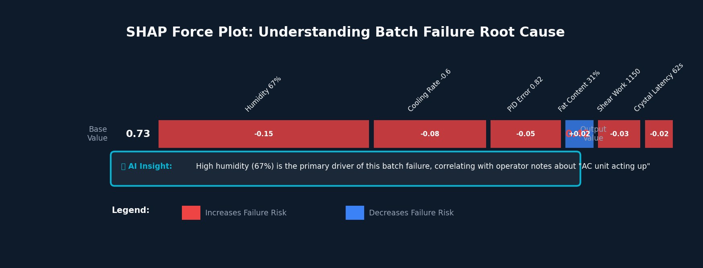
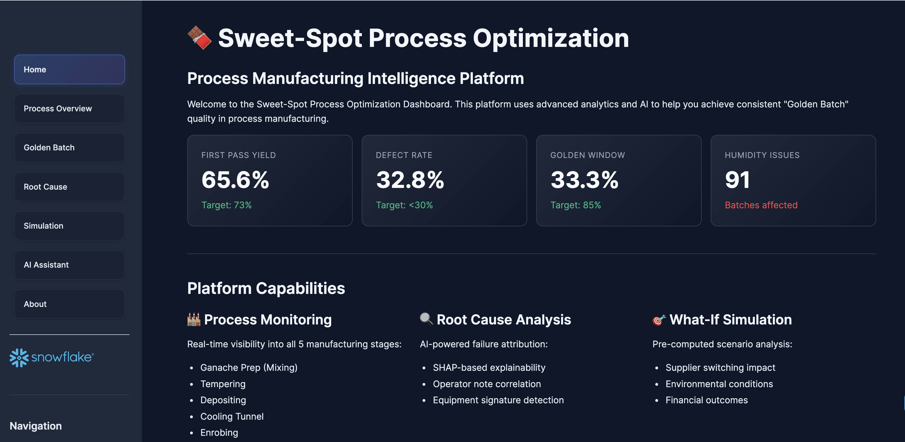

author: Tripp Smith, Dureti Shemsi
id: golden-batch-process-optimization-with-cortex-ai
language: en
summary: AI-powered Golden Batch process optimization for process manufacturing, built on Snowflake with ML yield prediction, SHAP explainability, What-If simulation, and Cortex AI natural language analytics
categories: snowflake-site:taxonomy/product/ai, snowflake-site:taxonomy/product/analytics, snowflake-site:taxonomy/snowflake-feature/applied-analytics, snowflake-site:taxonomy/snowflake-feature/cortex-analyst, snowflake-site:taxonomy/snowflake-feature/cortex-search, snowflake-site:taxonomy/snowflake-feature/model-development, snowflake-site:taxonomy/snowflake-feature/unstructured-data-analysis, snowflake-site:taxonomy/snowflake-feature/snowpark, snowflake-site:taxonomy/snowflake-feature/snowpark-container-services, snowflake-site:taxonomy/industry/manufacturing, snowflake-site:taxonomy/industry/retail-and-cpg, snowflake-site:taxonomy/solution-center/certification/certified-solution
environments: web
status: Published
feedback_link: https://github.com/Snowflake-Labs/sfguides/issues
fork_repo_link: https://github.com/Snowflake-Labs/sfguide-golden-batch-process-optimization-with-cortex-ai

# Golden Batch Process Optimization with Cortex AI

## Overview

This guide delivers an AI-powered Golden Batch optimization platform for process manufacturing built entirely on Snowflake. Using a confectionery production line as a representative example, the solution unifies historian telemetry, Manufacturing Execution System (MES) events, Laboratory Information Management System (LIMS) quality tests, and Enterprise Resource Planning (ERP) transactions to capture the interactions between raw material properties, equipment physics, and environmental drift that determine product quality.

The platform demonstrates how manufacturers can move from reactive troubleshooting to proactive correction by training XGBoost models in Snowpark, explaining predictions with SHapley Additive exPlanations (SHAP), clustering Golden Batch parameters with Principal Component Analysis (PCA) and K-Means, and delivering insights through a Streamlit dashboard with Cortex Analyst natural language queries and Cortex Search document retrieval. While the demo uses chocolate manufacturing data, the architecture and approach apply to any batch process industry — food & beverage, chemicals, pharmaceuticals, or specialty materials.

## The Business Challenge

Process manufacturing faces billions of dollars in annual losses from product recalls, contamination events, quality failures, and process deviations that existing systems fail to catch in time. Plants routinely lose significant yield to process failures and off-spec batches that current systems only detect after the damage is done.

The root cause? Siloed data. When historian, MES, LIMS, and ERP systems don't talk to each other, operators are flying blind. Connecting an environmental drift to dozens of failed batches takes weeks of manual forensics.

**Reactive Quality Management**: Problems are discovered after batches fail, not before. Identifying root cause stretches to days or weeks.

**Siloed Data Ecosystems**: Historian telemetry, MES events, LIMS quality tests, and ERP transactions live in disconnected systems with no unified view.

**Inconsistent Golden Batch Attainment**: Even with the same recipe, batch quality varies based on environmental factors, raw material properties, and equipment drift that current systems can't correlate.

**Expensive Troubleshooting**: Process engineers spend hours in spreadsheets trying to identify whether defects come from physical process parameters or raw material chemistry — rarely with definitive answers.

This demo illustrates these challenges through a confectionery production line, where tempering failures, bloom defects, and humidity-driven quality issues represent the same class of problems found across process manufacturing.

## The Transformation

This solution transforms process manufacturing from reactive firefighting to proactive optimization. Instead of investigating failures after the fact, plant managers receive AI-powered alerts when process parameters drift outside the "Golden Window." Process engineers get SHAP-based explainability that identifies root cause in seconds, not weeks. And the VP of Ops can simulate supplier changes or environmental scenarios before committing real production resources.

## Business Value

By replacing manual investigation with ML-driven prediction and SHAP explainability, the platform targets the same categories of improvement that manufacturers are already achieving with AI-powered process optimization:

| Metric | Industry Benchmark | Source |
|--------|-------------------|--------|
| **Production Efficiency** | 51% of food processors cite improving production efficiency as the top driver for digital transformation | [Food Industry Tech Trends 2025](https://foodindustryexecutive.com/2024/11/2025-food-industry-tech-trends-ai-and-supply-chain-solutions-lead-investment-priorities/) |
| **Defect Detection Accuracy** | 10–30% improvement with ML over traditional Statistical Process Control (SPC) methods | [IJRTI, 2025](https://ijrti.org/papers/IJRTI2512047.pdf) |
| **Throughput Improvement** | 10–20% through real-time parameter tuning | [Deloitte 2025 Smart Manufacturing Survey](https://www.deloitte.com/us/en/insights/industry/manufacturing-industrial-products/smart-manufacturing-operations-survey.html) |

*These benchmarks are specific to process parameter optimization with machine learning — the core capability this solution demonstrates. Actual results will vary based on data maturity, process complexity, and implementation scope.*

## Why Snowflake

**Unified Data Foundation**: Historian telemetry, MES events, LIMS quality tests, operator data, and ERP transactions converge in a single governed platform. No more data silos — just one trusted source of truth.

**Performance That Scales**: Process your telemetry readings without capacity planning friction. Elastic compute means the What-If simulator responds in milliseconds, not minutes.

**Built-in AI/ML**: Train ML models in Snowpark, explain predictions with SHAP, and deploy the results as a Streamlit dashboard — all without moving data outside Snowflake.

**Collaboration Without Compromise**: Share Golden Batch insights across plants, regions, or with equipment vendors — all with governance intact. No data copies, no security gaps.

## The Data

> **Note**: The data and configuration described below are provided for demonstration purposes. This is representative of a typical process manufacturing data landscape but is not prescriptive. Customers should adapt the schema, data sources, and volumes to match their own production environment.

### Source Tables

| Table | Layer | Purpose |
|-------------------------------|-----------|---------|
| **HISTORIAN_TELEMETRY** | Raw | High-frequency IoT sensor data from Supervisory Control and Data Acquisition (SCADA) historians |
| **MES_EVENTS** | Raw | Batch events, operator notes, equipment alarms |
| **LIMS_QUALITY** | Raw | Lab quality tests: Gloss, Snap, Viscosity, Temper Index |
| **ERP_INVENTORY** | Raw | Raw material inventory and supplier lot tracking |
| **FINANCIAL_COSTS** | Raw | Standard cost elements and unit costs per material, used by the Simulation page for financial impact analysis |
| **FACT_BATCH_FEATURES** | Data Mart | Engineered features per batch with ML-ready structure |
| **FACT_BATCH_PREDICTIONS** | Data Mart | Model inference results with pre-computed SHAP values |
| **FACT_SIMULATION_SCENARIOS** | Data Mart | Pre-computed What-If scenarios for instant simulation |

### Schema Architecture

| Schema | Purpose |
|--------|---------|
| **RAW** | Immutable landing zone for source system data |
| **ATOMIC** | Enterprise relational model with Slowly Changing Dimension (SCD) Type 2 versioning |
| **YO_SWEET_SPOT** | Analytical data mart with engineered features and ML outputs |

## Solution Architecture

Data flows through three integrated layers:

- **Source Systems**: Historian, MES, ERP, and LIMS push data into Snowflake's RAW schema
- **ATOMIC Schema**: Normalizes and enriches data with a Unified Namespace (UNS) hierarchy (e.g., Global_Confections/CLT_NC/PROD_KITCHEN/LINE_04 in the demo)
- **YO_SWEET_SPOT Data Mart**: Aggregates batch-level features using advanced engineering (cooling rate slopes, shear work integrals, Proportional-Integral-Derivative (PID) error Root Mean Square Error (RMSE))
- **Snowpark ML**: Trains ML models for yield prediction and Golden Window parameter identification
- **Streamlit Dashboard**: Delivers insights to plant managers, process engineers, and executives through purpose-built visualizations

## Key Visualizations

### Manufacturing Process Flow

In this confectionery example, the 5-stage process — Ganache Prep, Tempering, Depositing, Cooling, and Enrobing — each has critical control variables. The platform tracks all five stages simultaneously, identifying which parameter drifted outside the Golden Window. The same multi-stage tracking approach applies to any batch process with sequential operations.

### Golden Batch Analysis

ML-driven batch analysis reveals three distinct batch populations: **Golden** (optimal conditions), **Marginal** (at-risk parameters), and **Problem** (consistent defects). The dashboard shows real-time batch classification and Golden Window attainment trends.

### SHAP Explainability

When a batch fails, SHAP force plots show exactly which features pushed the prediction toward failure. In this confectionery demo, high humidity (67%) is the dominant factor, correlating with operator notes about "AC unit acting up." No more guessing — the AI identifies root cause instantly. The same explainability approach works for any process variable in any batch industry.

## Application Experience

The Golden Batch Dashboard deploys as a 6-page Streamlit application in Snowsight:

| Page | Purpose |
|------|---------|
| **Process Overview** | Real-time Key Performance Indicators (KPIs) and stage-by-stage performance monitoring |
| **Golden Batch** | Batch classification and Golden Window attainment trends |
| **Root Cause** | SHAP force plots with operator note correlation |
| **Simulation** | Pre-computed What-If scenarios with financial impact |
| **AI Assistant** | Natural language queries via Cortex Analyst and document search |
| **About** | Project information and documentation |

## Get Started

Ready to deploy Golden Batch optimization in your Snowflake account? This guide includes everything you need to get up and running quickly.

**[GitHub Repository →](https://github.com/Snowflake-Labs/sfguide-golden-batch-process-optimization-with-cortex-ai)**

The repository contains the complete SQL setup scripts, ML notebook, Streamlit dashboard, Cortex Search configuration, and teardown script for deploying the full solution.

*Transform your plant from reactive troubleshooting to proactive optimization — where AI-driven insights prevent quality failures before they cascade, and every process engineer has the intelligence to identify and replicate the Golden Batch. While this demo uses confectionery as the example, the platform is designed for any batch process industry.*

## Resources

- [Cortex Analyst Documentation](https://docs.snowflake.com/en/user-guide/snowflake-cortex/cortex-analyst)
- [Cortex Search Documentation](https://docs.snowflake.com/en/user-guide/snowflake-cortex/cortex-search/cortex-search-overview)
- [Snowflake ML Documentation](https://docs.snowflake.com/en/developer-guide/snowflake-ml/overview)
- [Snowpark Documentation](https://docs.snowflake.com/en/developer-guide/snowpark/python/index)
- [Snowflake Notebooks](https://docs.snowflake.com/en/user-guide/ui-snowsight/notebooks)
- [Streamlit in Snowflake Documentation](https://docs.snowflake.com/en/developer-guide/streamlit/about-streamlit)
