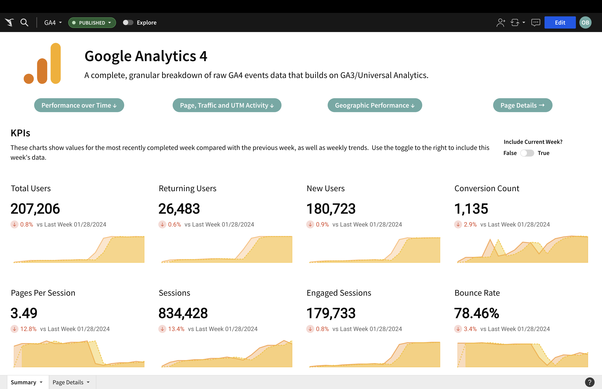
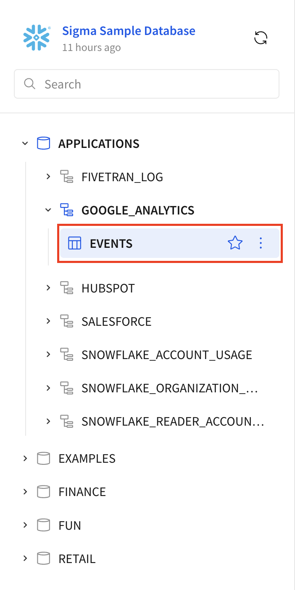
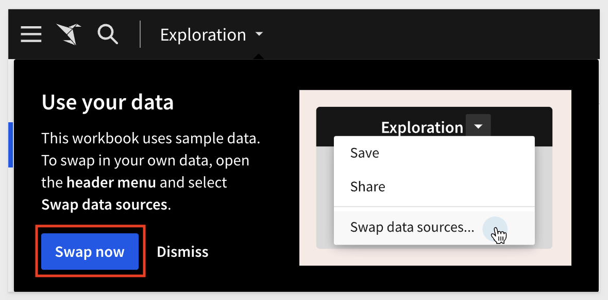

author: obashaw
id: google-analytics-4-template-setup
categories: snowflake-site:taxonomy/solution-center/certification/quickstart, snowflake-site:taxonomy/solution-center/certification/partner-solution, snowflake-site:taxonomy/solution-center/includes/architecture, snowflake-site:taxonomy/product/applications-and-collaboration
language: en
summary: This QuickStart provides instructions on how to set up Sigma's Google Analytics 4 template. 
environments: web
status: Published
feedback link: https://github.com/sigmacomputing/sigmaquickstarts/issues
lastUpdated: 2023-09-21

# Getting Started with Google Analytics 4 (GA4) Using Snowflake and Sigma

## Overview 

### Overview
This **QuickStart** provides instructions on how to set up Sigma's **Google Analytics 4** template. 

This template gives you a prebuilt analytics package for Google Analytics 4 events data, including detailed page-level metrics for **every** page and the ability to dive into event-level details, and is based on reports from Universal Analytics/GA3.

The template can run on top of any cloud data warehouse, but this guide details how to use the template on top of [Snowflake's Google Analytics connector](https://other-docs.snowflake.com/en/connectors/google/gard/gard-connector-about).

There are 4 steps to setting up the template:
  1.  Prepare your Google Analytics and Google Cloud Platform (GCP) accounts
  2.  Install and configure Snowflake's Google Analytics Raw Data connector
  3.  Transform the Google Analytics events data using the provided SQL script
  4.  Launch the template in Sigma and **Swap Sources** to the table created in step 3



### What You’ll Build
<ul>
  <li>An up-to-date, analytics-ready Google Analytics events table in your Snowflake account.
  <li>A Sigma workbook that tracks website activity with full visibility into granular event-level metrics.
</ul>

### What You Will Learn
How to deploy Sigma's **Google Analytics 4** template.

### Prerequisites

<ul>
  <li>Access to your Google Analytics and GCP accounts.</li>
  <li>Access to your Snowflake account with the ability to create tables and grant access to the role used in your Sigma connection.</li>
  <li>Access to your Sigma account with the ability to create a workbook.</li>
</ul>

<button>[Sigma Free Trial](https://www.sigmacomputing.com/free-trial/)</button>

<!-- END OF OVERVIEW -->

## Preparing your Google Analytics and GCP accounts

Before configuring the Snowflake Connector for Google Analytics Raw Data (GARD), you will need to perform some one-time setup in your Google account.  This process requires access to both Google Analytics and Google Cloud Platform (GCP).  

At a high level, the necessary actions in your Google account are
<ol>
  <li>Migrate your Google Analytics from Universal Analytics to GA4.  This is done inside the GA platform.</li>
  <li>Configure a BigQuery link for GA4 data.  This is done inside the GA platform and allows raw GA data to be dumped into a GCP project.  Note that you should use the Daily export option.</li>
  <li>Configure a service account or OAuth authentication to allow Snowflake to read data from BigQuery storage.  This is done in the GCP platform.</li>
</ol> 

For a detailed step-by-step process, we refer to Snowflake's documentation on [Preparing your Google analytics and GCP accounts for the GARD Connector](https://other-docs.snowflake.com/en/connectors/google/gard/gard-connector-prereqs).

<!-- END OF SECTION-->

## Install and configure Snowflake's Google Analytics Raw Data Connector

Once your Google Analytics data is in BigQuery, it's time to install the GARD Connector. To do that, find the [Snowflake Connector for Google Analytics Raw Data](https://app.snowflake.com/marketplace/listing/GZSTZTP0KKC/snowflake-snowflake-connector-for-google-analytics-raw-data) listing on the Snowflake Marketplace.

You will be prompted to configure a few fields for the connector (Warehouse, Destination Database, Destination Schema and Role) as well as the authentication (either service account or OAuth).

Follow [this Snowflake Documentation for setup](https://other-docs.snowflake.com/en/connectors/google/gard/gard-connector-installing), and make sure to note the **Destination Database** and **Destination Schema** as we will reference them again later.

Once the connector is installed, you'll need to set up Data Ingestion.  This is a quick process and [Snowflake provides directions here](https://other-docs.snowflake.com/en/connectors/google/gard/gard-connector-setting-up-data).

Now the GA4 raw data will sync into your Snowflake account at the desired cadence.

<!-- END OF SECTION-->

## Transforming the Raw GA4 Data

The Google Analytics data that the Snowflake Connector loads into your account is raw events data.  Each row represents a unique event, but that data is wrapped in nested JSON.

To make it analytics-ready, we provide you with a SQL script that transforms the data into the format needed for the template.  The script requires you to input a few fields, then creates a new table called `events` and a stored procedure to update the `events` table with new rows each day.  It will also grant access on the table to the role used in your Sigma connection.

Copy and paste the following SQL script into a new worksheet in Snowflake:  

**Input the required fields (indicated below the script) and then run the script.**

```sql
/*************************************************************************************
*   Name: google_analytics_4_setup_script.sql
*   Dev:  Oscar Bashaw and Jake Hannan
*   Date: Feb 15 2023
*   Summary: creates a modeled GA4 events table and sets up incremental materialization (updates) for that table
*   Desc: This series of commands will do the following:
*           1. Set session variables and create materialization task
*           2. Grant necessary privileges to materialization role
*           3. Create the modeled Google Analytics events table with all events that happened on or before yesterday
*           4. Create a stored procedure that models raw events not in the table created in step 3 and insert them to that table
*           5. Start the task created in step 1 (calls the stored procedure created in step 4)
*          
*           
*   Prereqs: To run this script the following is required:
*           - The ability to use the SYSADMIN role (just briefly, to give the proper privileges to another role)
*           - The ability to use a role that will be the owner of the GA4 data modeling
*           - The database, schema and table names for the raw GA4 data in your Snowflake account
*           - The name of the role used in your Sigma connection
*
*   Additional Resources: The Quickstart tutorial found at ##
*************************************************************************************/

---------------------------------------------------------------------------------------------------------
-- 1. Set session variables and create materialization task
---------------------------------------------------------------------------------------------------------

-- Specify the database, schema and table of the raw Google Analytics data
set ga_raw_data_dest_db = 'the database where the raw Google Analytics data lives';
set ga_raw_data_dest_schema = 'the schema where the raw Google Analytics data lives';
set ga_raw_data_dest_table = 'the table where the raw Google Analytics data lives';

-- Set the database and schema where the modeled Google Analytics events table will live
-- NOTE: this database and schema must already exist in your Snowflake account
set ga_modeled_data_target_db = 'target database for modeled Google Analytics data (must exist already)';
set ga_modeled_data_target_schema = 'target schema for modeled Google Analytics data (must exist already)';

-- Set the role and warehouse used for materialization 
set materialization_role_name = 'role that will own the modeled events table and the stored procedure / task used for materialization';
set materialization_warehouse_name = 'name of warehouse used to create and update the modeled events table';
-- Optional: adjust this CRON string to update the modeled events table on a different schedule
set materialization_CRON_string = 'USING CRON 0 3 * * Mon-Fri America/Los_Angeles';

-- Set the role used in your Sigma connection, ie the role that will need select access to the modeled table
set sigma_role_name = 'role used in your Sigma connection';

/* IMPORTANT!!
  Inside the parentheses of usp_materialize_ga_events(''), replace database.schema.table with the fully qualified
  name of the raw Google Analytics table (the database, schema and table you specified above)
  For example, if you have 
    set ga_raw_data_dest_db = 'GA_RAW_DATA_DEST_DB';
    set ga_raw_data_dest_schema = 'GA_RAW_DATA_DEST_SCHEMA';
    set ga_raw_data_dest_table = 'ANALYTICS_123456';
  then the command (last line) of the task should read
    call usp_materialize_ga_events('GA_RAW_DATA_DEST_DB.GA_RAW_DATA_DEST_SCHEMA.ANALYTICS_123456');

  Note that the stored procedure usp_materialize_ga_events() will be created later in the script.  We have just placed this piece here for your convenience.
*/
create or replace task task_call_usp_materialize_ga_events
warehouse = $materialization_warehouse_name
schedule = $materialization_CRON_string
as
call usp_materialize_ga_events('raw_database.raw_schema.raw_table');

/*************************************************************************************
*
*   DO NOT MODIFY BELOW THIS SECTION
*
*************************************************************************************/

---------------------------------------------------------------------------------------------------------
-- 2. Grant necessary privileges to materialization role
---------------------------------------------------------------------------------------------------------
-- Use the sysadmin (or similarly-privileged) role to grant permissions to the materialization role
use role sysadmin;

grant usage on database identifier($ga_raw_data_dest_db) to role identifier($materialization_role_name);
use database identifier($ga_raw_data_dest_db);

grant usage on schema identifier($ga_raw_data_dest_schema) to role identifier($materialization_role_name);
use schema identifier($ga_raw_data_dest_schema);

grant select on table identifier($ga_raw_data_dest_table) to role identifier($materialization_role_name);
grant usage on warehouse identifier($materialization_warehouse_name) to role identifier($materialization_warehouse_name);
grant execute task on account to role identifier($materialization_role_name);

-- Use the materialization role for the remainder of the script
use role identifier($materialization_role_name);
use warehouse identifier($materialization_warehouse_name);
use database identifier($ga_modeled_data_target_db);
use schema identifier($ga_modeled_data_target_schema);
grant create table on schema identifier($ga_modeled_data_target_db) to role identifier($materialization_role_name);

set ga_raw_data_fully_qualified_table = concat(GETVARIABLE('GA_RAW_DATA_DEST_DB'), '.', GETVARIABLE('GA_RAW_DATA_DEST_SCHEMA'), '.', GETVARIABLE('GA_RAW_DATA_DEST_TABLE'));

------------------------------------------------------------------------------------------------------------
-- 3. Create the modeled Google Analytics events table with all events that happened on or before yesterday
------------------------------------------------------------------------------------------------------------
create or replace table events as (
with raw_data as (
  select * 
  from identifier($ga_raw_data_fully_qualified_table)
  where to_timestamp(raw:"event_timestamp"::int, 6) < date_trunc(day, current_date())
)

, parsed_data as (
  select
    to_date(raw:"event_date"::string, 'yyyymmdd') as event_date
    , to_timestamp(raw:"event_timestamp"::int, 6) as event_timestamp
    , raw:"event_name"::string as event_name
    , parse_json(raw:"event_params") as event_params
    , to_timestamp(raw:"event_previous_timestamp"::int, 6) as event_previous_timestamp
    , raw:"event_value_in_usd"::float as event_value_in_usd
    , raw:"event_bundle_sequence_id"::int as event_bundle_sequence_id
    , raw:"event_dimensions"::string as event_dimensions
    , raw:"event_server_timestamp_offset"::int as event_server_timestamp_offset
    , raw:"user_id"::string as user_id
    , raw:"user_pseudo_id"::string as user_pseudo_id
    , raw:"privacy_info"."analytics_storage"::string as privacy_info_analytics_storage
    , raw:"privacy_info"."ads_storage"::string as privacy_info_ads_storage
    , raw:"privacy_info"."uses_transient_token"::string as privacy_info_uses_transient_token
    , raw:"user_properties" as user_properties
    , to_timestamp(raw:"user_first_touch_timestamp"::int, 6) as user_first_touch_timestamp
    , raw:"user_ltv"."revenue"::float as user_ltv_revenue
    , raw:"user_ltv"."currency"::string as user_ltv_currency
    , raw:"device"."category"::string as device_category
    , raw:"device"."mobile_brand_name"::string as device_mobile_brand_name
    , raw:"device"."mobile_model_name"::string as device_mobile_model_name
    , raw:"device"."mobile_marketing_name"::string as device_mobile_marketing_name
    , raw:"device"."mobile_os_hardware_model"::string as device_mobile_os_hardware_model
    , raw:"device"."operating_system"::string as device_operating_system
    , raw:"device"."operating_system_version"::string as device_operating_system_version
    , raw:"device"."vendor_id"::string as device_vendor_id
    , raw:"device"."advertising_id"::string as device_advertising_id
    , raw:"device"."language"::string as device_language
    , raw:"device"."is_limited_ad_tracking"::boolean as device_is_limited_ad_tracking
    , raw:"device"."time_zone_offset_seconds"::int as device_time_zone_offset_seconds
    , raw:"device"."browser"::string as device_browser
    , raw:"device"."browser_version"::string as device_browser_version
    , raw:"device"."web_info"."browser"::string as device_web_info_browser
    , raw:"device"."web_info"."browser_version"::string as device_web_info_browser_version
    , raw:"device"."web_info"."hostname"::string as device_web_info_hostname
    , raw:"geo"."continent"::string as geo_continent
    , raw:"geo"."country"::string as geo_country
    , raw:"geo"."region"::string as geo_region
    , raw:"geo"."city"::string as geo_city
    , raw:"geo"."sub_continent"::string as geo_sub_continent
    , raw:"geo"."metro"::string as geo_metro
    , raw:"app_info"."id"::string as app_info_id
    , raw:"app_info"."version"::string as app_info_version
    , raw:"app_info"."install_store"::string as app_info_install_store
    , raw:"app_info"."firebase_app_id"::string as app_info_firebase_app_id
    , raw:"app_info"."install_source"::string as app_info_install_source
    , raw:"traffic_source"."name"::string as traffic_source_name
    , raw:"traffic_source"."medium"::string as traffic_medium
    , raw:"traffic_source"."source"::string as traffic_source
    , raw:"stream_id"::string as stream_id
    , raw:"platform"::string as platform
    , raw:"event_dimensions"."hostname"::string as event_dimensions_hostname
    , raw:"ecommerce"."total_item_quantity"::int as ecommerce_total_item_quantity
    , raw:"ecommerce"."purchase_revenue_in_usd"::float as ecommerce_purchase_revenue_in_usd
    , raw:"ecommerce"."purchase_revenue"::float as ecommerce_purchase_revenue
    , raw:"ecommerce"."refund_value_in_usd"::float as ecommerce_refund_value_in_usd
    , raw:"ecommerce"."refund_value"::float as ecommerce_refund_value
    , raw:"ecommerce"."shipping_value_in_usd"::float as ecommerce_shipping_value_in_usd
    , raw:"ecommerce"."shipping_value"::float as ecommerce_shipping_value
    , raw:"ecommerce"."tax_value_in_usd"::float as ecommerce_tax_value_in_usd
    , raw:"ecommerce"."tax_value"::float as ecommerce_tax_value
    , raw:"ecommerce"."unique_items"::int as ecommerce_unique_items
    , raw:"ecommerce"."transaction_id"::string as ecommerce_transaction_id
    , raw:"items" as items
    , raw:"collected_traffic_source"."manual_campaign_id"::string as collected_trafic_source_manual_campaign_id
    , raw:"collected_traffic_source"."manual_campaign_name"::string as collected_trafic_source_manual_campaign_name
    , raw:"collected_traffic_source"."manual_source"::string as collected_trafic_source_manual_source
    , raw:"collected_traffic_source"."manual_medium"::string as collected_trafic_source_manual_medium
    , raw:"collected_traffic_source"."manual_term"::string as collected_trafic_source_manual_term
    , raw:"collected_traffic_source"."manual_content"::string as collected_trafic_source_manual_content
    , raw:"collected_traffic_source"."gclid"::string as collected_trafic_source_gclid
    , raw:"collected_traffic_source"."dclid"::string as collected_trafic_source_dclid
    , raw:"collected_traffic_source"."srsltid"::string as collected_trafic_source_srsltid
  from raw_data 
)

, final as (
  select
    event_date
    , event_timestamp
    , user_pseudo_id
    , traffic_medium
    , traffic_source
    , traffic_source_name
    , event_name
    , geo_country
    , geo_city
    , device_web_info_hostname as host_name
    , platform
    , max(case when params.value:key::string = 'ga_session_id' then params.value:value:int_value end)::int as ga_session_id
    , max(case when params.value:key::string = 'engaged_session_event' then params.value:value:int_value end)::int as engaged_session_event
    , max(case when params.value:key::string = 'ga_session_number' then params.value:value:int_value end)::int as ga_session_number
    , max(case when params.value:key::string = 'page_title' then params.value:value:string_value end)::string as page_title
    , max(case when params.value:key::string = 'page_location' then params.value:value:string_value end)::string as page_location
    , parse_url(page_location, 1) as page_url_parsed
    , page_url_parsed:parameters.utm_term::string as utm_term
    , page_url_parsed:parameters.utm_medium::string as utm_medium
    , page_url_parsed:parameters.utm_campaign::string as utm_campaign
    , case 
        when page_url_parsed:path::string = '' then 'home' 
        else split_part(page_url_parsed:path::string, '/', 1)
      end as website_bucket
    , max(case when params.value:key::string = 'page_referrer' then params.value:value:string_value end)::string as page_referrer
    , max(case when params.value:key::string = 'session_engaged' then params.value:value:string_value end)::int as session_engaged
    , max(case when params.value:key::string = 'campaign' then params.value:value:string_value end)::string as campaign_name
    , div0(max(case when params.value:key::string = 'engagement_time_msec' then params.value:value:int_value end)::int, 1000) as engagement_time_sec
  from parsed_data
  , lateral flatten(input => parsed_data.event_params) params
  group by all
  order by event_timestamp asc
)

select
  event_date
  , event_timestamp
  , user_pseudo_id
  , traffic_medium
  , traffic_source
  , traffic_source_name
  , event_name
  , utm_term
  , utm_medium
  , utm_campaign
  , geo_country
  , geo_city
  , host_name
  , platform
  , ga_session_id
  , engaged_session_event
  , ga_session_number
  , page_title
  , page_location
  , page_url_parsed
  , website_bucket
  , page_referrer
  , session_engaged
  , campaign_name
  , engagement_time_sec
  , md5(concat(
      event_timestamp
      , user_pseudo_id
      , event_name
      , website_bucket
      , page_location
    )) as ga_event_id
from final
)
;

-- Grant role used in Sigma connection access to this modeled events table
grant usage on database identifier($ga_modeled_data_target_db) to role identifier($sigma_role_name);
grant usage on schema identifier($ga_modeled_data_target_schema) to role identifier($sigma_role_name);
grant select on table events to role identifier($sigma_role_name);

------------------------------------------------------------------------------------------------------------
-- 4. Create stored procedure to model and insert new events into the modeled events table
------------------------------------------------------------------------------------------------------------
create or replace procedure usp_materialize_ga_events(ga_raw_data_fully_qualified_table string)
returns string
language sql
as
$$
BEGIN
  begin transaction;
  
  insert into events 
    with last_inserted_event as (
        select max(event_timestamp) as last_inserted_event_ts
        from events
    ) 
    , raw_data as (
        select * 
        from identifier(:ga_raw_data_fully_qualified_table)
        where to_timestamp(raw:"event_timestamp"::int, 6) > (select last_inserted_event_ts from last_inserted_event)
        )

    , parsed_data as (
        select
            to_date(raw:"event_date"::string, 'yyyymmdd') as event_date
            , to_timestamp(raw:"event_timestamp"::int, 6) as event_timestamp
            , raw:"event_name"::string as event_name
            , parse_json(raw:"event_params") as event_params
            , to_timestamp(raw:"event_previous_timestamp"::int, 6) as event_previous_timestamp
            , raw:"event_value_in_usd"::float as event_value_in_usd
            , raw:"event_bundle_sequence_id"::int as event_bundle_sequence_id
            , raw:"event_dimensions"::string as event_dimensions
            , raw:"event_server_timestamp_offset"::int as event_server_timestamp_offset
            , raw:"user_id"::string as user_id
            , raw:"user_pseudo_id"::string as user_pseudo_id
            , raw:"privacy_info"."analytics_storage"::string as privacy_info_analytics_storage
            , raw:"privacy_info"."ads_storage"::string as privacy_info_ads_storage
            , raw:"privacy_info"."uses_transient_token"::string as privacy_info_uses_transient_token
            , raw:"user_properties" as user_properties
            , to_timestamp(raw:"user_first_touch_timestamp"::int, 6) as user_first_touch_timestamp
            , raw:"user_ltv"."revenue"::float as user_ltv_revenue
            , raw:"user_ltv"."currency"::string as user_ltv_currency
            , raw:"device"."category"::string as device_category
            , raw:"device"."mobile_brand_name"::string as device_mobile_brand_name
            , raw:"device"."mobile_model_name"::string as device_mobile_model_name
            , raw:"device"."mobile_marketing_name"::string as device_mobile_marketing_name
            , raw:"device"."mobile_os_hardware_model"::string as device_mobile_os_hardware_model
            , raw:"device"."operating_system"::string as device_operating_system
            , raw:"device"."operating_system_version"::string as device_operating_system_version
            , raw:"device"."vendor_id"::string as device_vendor_id
            , raw:"device"."advertising_id"::string as device_advertising_id
            , raw:"device"."language"::string as device_language
            , raw:"device"."is_limited_ad_tracking"::boolean as device_is_limited_ad_tracking
            , raw:"device"."time_zone_offset_seconds"::int as device_time_zone_offset_seconds
            , raw:"device"."browser"::string as device_browser
            , raw:"device"."browser_version"::string as device_browser_version
            , raw:"device"."web_info"."browser"::string as device_web_info_browser
            , raw:"device"."web_info"."browser_version"::string as device_web_info_browser_version
            , raw:"device"."web_info"."hostname"::string as device_web_info_hostname
            , raw:"geo"."continent"::string as geo_continent
            , raw:"geo"."country"::string as geo_country
            , raw:"geo"."region"::string as geo_region
            , raw:"geo"."city"::string as geo_city
            , raw:"geo"."sub_continent"::string as geo_sub_continent
            , raw:"geo"."metro"::string as geo_metro
            , raw:"app_info"."id"::string as app_info_id
            , raw:"app_info"."version"::string as app_info_version
            , raw:"app_info"."install_store"::string as app_info_install_store
            , raw:"app_info"."firebase_app_id"::string as app_info_firebase_app_id
            , raw:"app_info"."install_source"::string as app_info_install_source
            , raw:"traffic_source"."name"::string as traffic_source_name
            , raw:"traffic_source"."medium"::string as traffic_medium
            , raw:"traffic_source"."source"::string as traffic_source
            , raw:"stream_id"::string as stream_id
            , raw:"platform"::string as platform
            , raw:"event_dimensions"."hostname"::string as event_dimensions_hostname
            , raw:"ecommerce"."total_item_quantity"::int as ecommerce_total_item_quantity
            , raw:"ecommerce"."purchase_revenue_in_usd"::float as ecommerce_purchase_revenue_in_usd
            , raw:"ecommerce"."purchase_revenue"::float as ecommerce_purchase_revenue
            , raw:"ecommerce"."refund_value_in_usd"::float as ecommerce_refund_value_in_usd
            , raw:"ecommerce"."refund_value"::float as ecommerce_refund_value
            , raw:"ecommerce"."shipping_value_in_usd"::float as ecommerce_shipping_value_in_usd
            , raw:"ecommerce"."shipping_value"::float as ecommerce_shipping_value
            , raw:"ecommerce"."tax_value_in_usd"::float as ecommerce_tax_value_in_usd
            , raw:"ecommerce"."tax_value"::float as ecommerce_tax_value
            , raw:"ecommerce"."unique_items"::int as ecommerce_unique_items
            , raw:"ecommerce"."transaction_id"::string as ecommerce_transaction_id
            , raw:"items" as items
            , raw:"collected_traffic_source"."manual_campaign_id"::string as collected_trafic_source_manual_campaign_id
            , raw:"collected_traffic_source"."manual_campaign_name"::string as collected_trafic_source_manual_campaign_name
            , raw:"collected_traffic_source"."manual_source"::string as collected_trafic_source_manual_source
            , raw:"collected_traffic_source"."manual_medium"::string as collected_trafic_source_manual_medium
            , raw:"collected_traffic_source"."manual_term"::string as collected_trafic_source_manual_term
            , raw:"collected_traffic_source"."manual_content"::string as collected_trafic_source_manual_content
            , raw:"collected_traffic_source"."gclid"::string as collected_trafic_source_gclid
            , raw:"collected_traffic_source"."dclid"::string as collected_trafic_source_dclid
            , raw:"collected_traffic_source"."srsltid"::string as collected_trafic_source_srsltid
        from raw_data 
        )

    , final as (
        select
            event_date
            , event_timestamp
            , user_pseudo_id
            , traffic_medium
            , traffic_source
            , traffic_source_name
            , event_name
            , geo_country
            , geo_city
            , device_web_info_hostname as host_name
            , platform
            , max(case when params.value:key::string = 'ga_session_id' then params.value:value:int_value end)::int as ga_session_id
            , max(case when params.value:key::string = 'engaged_session_event' then params.value:value:int_value end)::int as engaged_session_event
            , max(case when params.value:key::string = 'ga_session_number' then params.value:value:int_value end)::int as ga_session_number
            , max(case when params.value:key::string = 'page_title' then params.value:value:string_value end)::string as page_title
            , max(case when params.value:key::string = 'page_location' then params.value:value:string_value end)::string as page_location
            , parse_url(page_location, 1) as page_url_parsed
            , page_url_parsed:parameters.utm_term::string as utm_term
            , page_url_parsed:parameters.utm_medium::string as utm_medium
            , page_url_parsed:parameters.utm_campaign::string as utm_campaign
            , case 
                when page_url_parsed:path::string = '' then 'home' 
                else split_part(page_url_parsed:path::string, '/', 1)
            end as website_bucket
            , max(case when params.value:key::string = 'page_referrer' then params.value:value:string_value end)::string as page_referrer
            , max(case when params.value:key::string = 'session_engaged' then params.value:value:string_value end)::int as session_engaged
            , max(case when params.value:key::string = 'campaign' then params.value:value:string_value end)::string as campaign_name
            , div0(max(case when params.value:key::string = 'engagement_time_msec' then params.value:value:int_value end)::int, 1000) as engagement_time_sec
        from parsed_data
        , lateral flatten(input => parsed_data.event_params) params
        group by all
        order by event_timestamp asc
        )

    select
    event_date
    , event_timestamp
    , user_pseudo_id
    , traffic_medium
    , traffic_source
    , traffic_source_name
    , event_name
    , utm_term
    , utm_medium
    , utm_campaign
    , geo_country
    , geo_city
    , host_name
    , platform
    , ga_session_id
    , engaged_session_event
    , ga_session_number
    , page_title
    , page_location
    , page_url_parsed
    , website_bucket
    , page_referrer
    , session_engaged
    , campaign_name
    , engagement_time_sec
    , md5(concat(
        event_timestamp
        , user_pseudo_id
        , event_name
        , website_bucket
        , page_location
        )) as ga_event_id
    from final;  
  commit;
  return 'Success! GA Events table materialized.';
EXCEPTION
    when other then 
        rollback;
        return sqlerrm;
END;
$$
;

---------------------------------------------------------------------------------------------------------
-- 5. Start the task created in step 1 that calls the stored procedure for materialization
---------------------------------------------------------------------------------------------------------
alter task task_call_usp_materialize_ga_events resume;


---------------------------------------------------------------------------------------------------------
-- END OF SCRIPT
---------------------------------------------------------------------------------------------------------
```

The necessary input fields are:
<ul>
  <li><strong>ga_raw_data_dest_db</strong>: the destination database you specified in Snowflake when setting up the GARD connector</li>
  <li><strong>ga_raw_data_dest_schema</strong>: the destination schema you specified in Snowflake when setting up the GARD connector</li>
  <li><strong>ga_raw_data_dest_table</strong>: the table that contains raw GA4 events data (created by the connector, named like ANALYTICS_123546)</li>
  <li><strong>ga_modeled_data_target_db</strong>: the target database for the modeled Google Analytics data (must exist already)</li>
  <li><strong>ga_modeled_data_target_schema</strong>: the target schema for modeled Google Analytics data (must exist already)</li>
  <li><strong>materialization_role_name</strong>: the Snowflake role that will own the modeled GA data and materialization</li>
  <li><strong>materialization_warehouse_name</strong>: the warehouse used to create and update the modeled events table</li>
  <li><strong>materialization_CRON_string</strong>: the materialization schedule.  Default is every weekday at 3am PT</li>
  <li><strong>sigma_role_name</strong>: the role used in your Sigma connection</li>
</ul>

You will be instructed how to input these fields in Section 1 of the SQL script.  For each variable, delete the placeholder text and enter the desired value inside the single quotes.
<br>

<aside class="negative">
<strong>IMPORTANT:</strong><br> Setup is not done at this point.  Read below. 
</aside>

Then, you'll need to set the argument for the stored procedure called by the task `task_call_usp_materialize_ga_events`.
At the end of Section 1, you will see the following statement:

```plaintext
create or replace task task_call_usp_materialize_ga_events
warehouse = $materialization_warehouse_name
schedule = $materialization_CRON_string
as
call usp_materialize_ga_events('raw_database.raw_schema.raw_table');
```

You need to replace the argument passed to `usp_materialize_ga_events()` with the name of your **raw** Google Analytics events table.
For example, if your raw table (the one created by the GARD connector) is located at `GA_RAW_DATA_DEST_DB.GA_RAW_DATA_DEST_SCHEMA.ANALYTICS_123456`,
you would edit the argument in the stored procedure like so:
```plaintext
create or replace task task_call_usp_materialize_ga_events
warehouse = $materialization_warehouse_name
schedule = $materialization_CRON_string
as
call usp_materialize_ga_events('GA_RAW_DATA_DEST_DB.GA_RAW_DATA_DEST_SCHEMA.ANALYTICS_123456');
```
<br>
<br>
<br>
Once you've set this value, you can run the entire script and verify that you can see the new `events` table in your Sigma connection browser.
<br>


<!-- END OF SECTION-->

## Deploying the template

Once you have created the `events` table, go to Sigma.

From the home page, navigate to the `Templates` section, then to `External`.

Click on the `Google Analytics 4` template:


You will be prompted to swap data sources. Click `Swap Now`:



Verify that Sigma has found the `events` table and click `Swap Now`:


Click `Save As` and give your workbook a title.

**That's all there is to it!**  

You should now see the Google Analytics 4 Template on top of your own data. 

For example:


<!-- END OF SECTION-->

## Conclusion and Resources

### What You Learned
In this QuickStart we created a table called `events` with analytics-ready GA4 data and launched Sigma's `Google Analytics 4` template.

### Related Resources

- Be sure to check out all Sigma's latest developments at [Sigma's First Friday Feature page!](https://quickstarts.sigmacomputing.com/firstfridayfeatures/)
- [Download Reference Architecture](/content/dam/snowflake-site/developers/2024/10/Snowflake-Solution-GA4-Architecute-diagram.pdf)
- [Read the Blog](https://medium.com/snowflake/how-snowflakes-connector-for-google-analytics-centralizes-marketing-data-cd6df8f53105)
- [Watch the Demo](https://youtu.be/svz3NB3_WRg?si=6WLx-6XzHHpkwzJL)
  

[Help Center Home](https://help.sigmacomputing.com)<br>
[Sigma Community](https://community.sigmacomputing.com/)<br>
[Sigma Blog](https://www.sigmacomputing.com/blog/)<br>
<br>

[](https://twitter.com/sigmacomputing)&emsp;
[](https://www.linkedin.com/company/sigmacomputing)&emsp;
[](https://www.facebook.com/sigmacomputing)

<!-- END OF QUICKSTART -->
