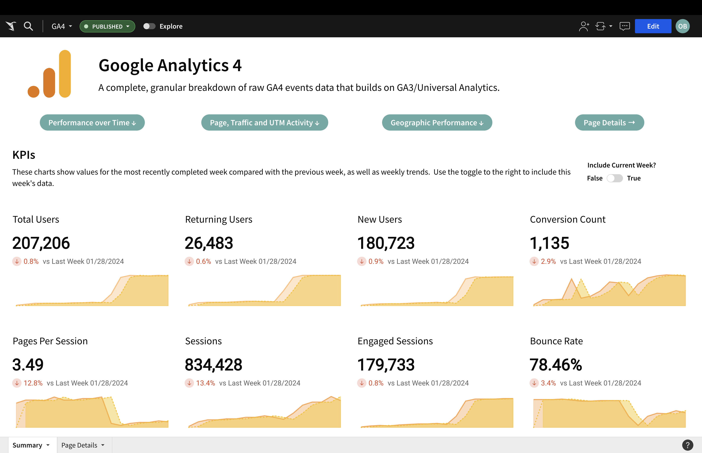
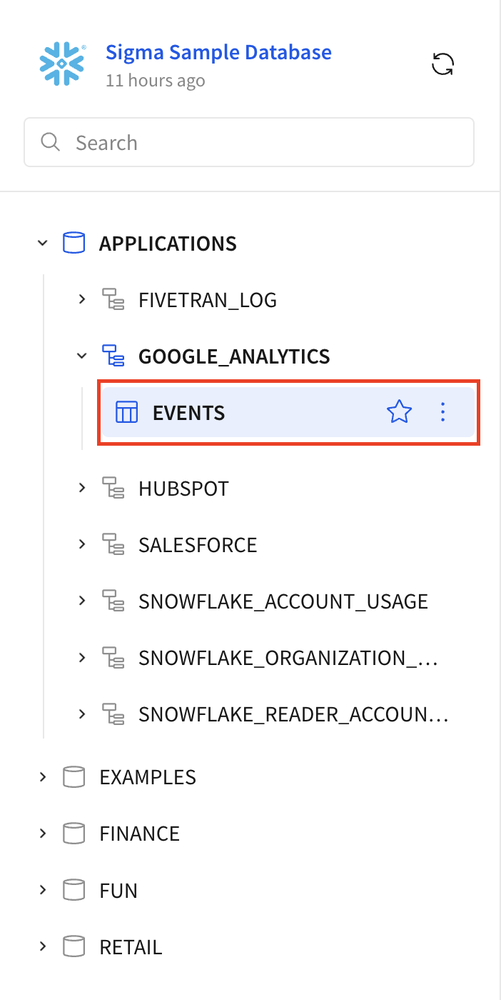
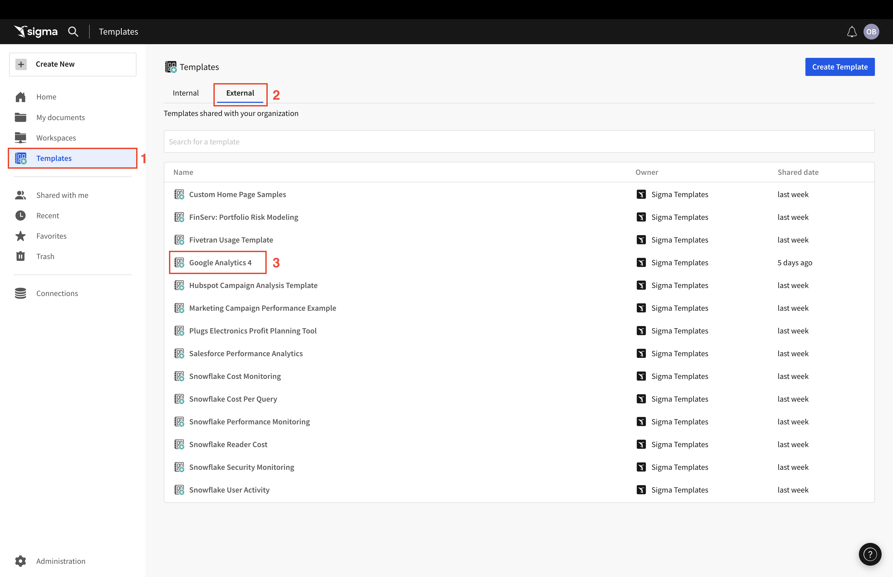
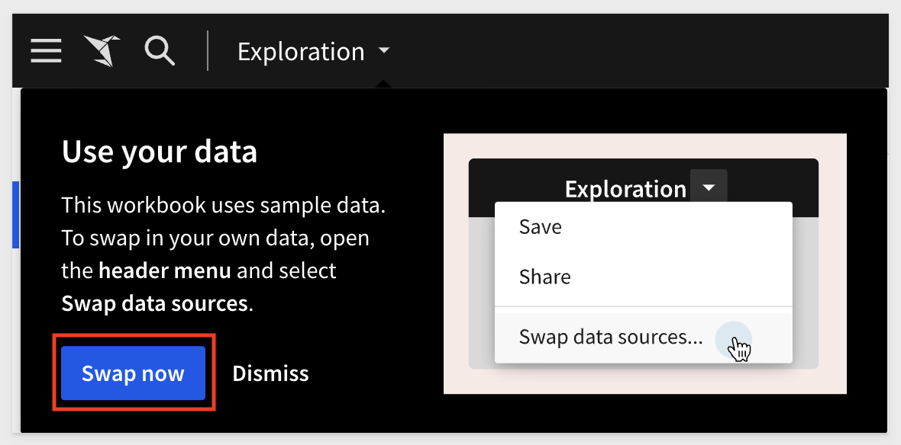
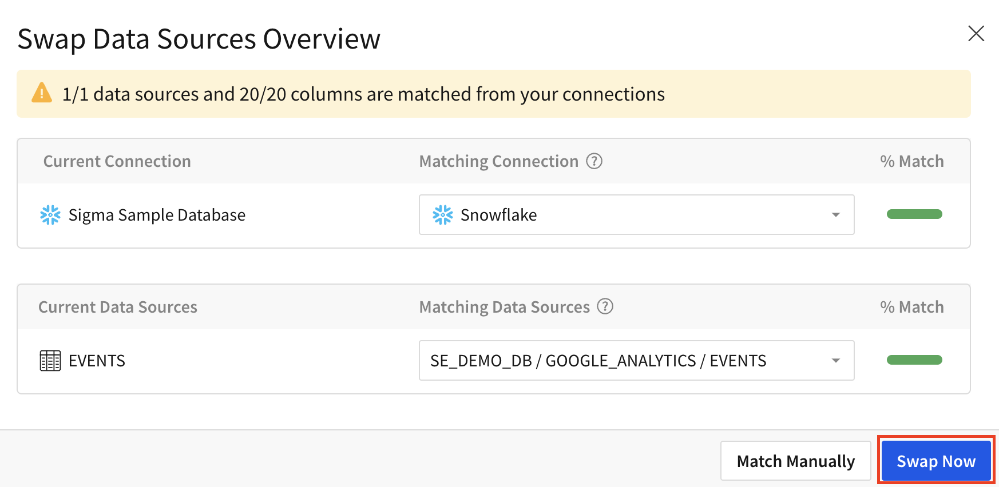

author: obashaw
id: google_analytics_4_template_setup
summary: This QuickStart provides instructions on how to set up Sigma's Google Analytics 4 template.
categories: partners,featured,partner-integrations
environments: web
status: Published
feedback link: https://github.com/sigmacomputing/sigmaquickstarts/issues
tags: Getting Started, Data Applications, Data Engineering, Sigma 
lastUpdated: 2023-09-12

# Google Analytics 4 Template Setup

## Overview 
This **QuickStart** provides instructions on how to set up Sigma's **Google Analytics 4** template. 

This template gives you a prebuilt analytics package for Google Analytics 4 events data, including detailed page-level metrics for **every** page and the ability to dive into event-level details, and is based on reports from Universal Analytics/GA3.

The template can run on top of any cloud data warehouse, but this guide details how to use the template on top of [Snowflake's Google Analytics connector](https://other-docs.snowflake.com/en/connectors/google/gard/gard-connector-about).

There are 4 steps to setting up the template:
  1.  Prepare your Google Analytics and Google Cloud Platform (GCP) accounts
  2.  Install and configure Snowflake's Google Analytics Raw Data connector
  3.  Transform the Google Analytics events data using the provided SQL script
  4.  Launch the template in Sigma and **Swap Sources** to the table created in step 3



### Target Audience
Anyone who is trying to gain better insight into Google Analytics 4 data.

### Prerequisites

<ul>
  <li>Access to your Google Analytics and GCP accounts.</li>
  <li>Access to your Snowflake account with the ability to create tables and grant access to the role used in your Sigma connection.</li>
  <li>Access to your Sigma account with the ability to create a workbook.</li>
</ul>

<button>[Sigma Free Trial](https://www.sigmacomputing.com/free-trial/)</button>

### What You’ll Learn
How to deploy Sigma's **Google Analytics 4** template.

### What You’ll Build
<ul>
  <li>An up-to-date, analytics-ready Google Analytics events table in your Snowflake account.
  <li>A Sigma workbook that tracks website activity with full visibility into granular event-level metrics.
</ul>


<!-- END OF OVERVIEW -->

## Preparing your Google Analytics and GCP accounts
Duration: 20

Before configuring the Snowflake Connector for Google Analytics Raw Data (GARD), you will need to perform some one-time setup in your Google account.  This process requires access to both Google Analytics and Google Cloud Platform (GCP).  

At a high level, the necessary actions in your Google account are
<ol>
  <li>Migrate your Google Analytics from Universal Analytics to GA4.  This is done inside the GA platform.</li>
  <li>Configure a BigQuery link for GA4 data.  This is done inside the GA platform and allows raw GA data to be dumped into a GCP project.  Note that you should use the Daily export option.</li>
  <li>Configure a service account or OAuth authentication to allow Snowflake to read data from BigQuery storage.  This is done in the GCP platform.</li>
</ol> 

For a detailed step-by-step process, we refer to Snowflake's documentation on [Preparing your Google analytics and GCP accounts for the GARD Connector](https://other-docs.snowflake.com/en/connectors/google/gard/gard-connector-prereqs).

<!-- END OF SECTION-->

## Install and configure Snowflake's Google Analytics Raw Data Connector
Duration: 10

Once your Google Analytics data is in BigQuery, it's time to install the GARD Connector. To do that, find the [Snowflake Connector for Google Analytics Raw Data](https://app.snowflake.com/marketplace/listing/GZSTZTP0KKC/snowflake-snowflake-connector-for-google-analytics-raw-data) listing on the Snowflake Marketplace.

You will be prompted to configure a few fields for the connector (Warehouse, Destination Database, Destination Schema and Role) as well as the authentication (either service account or OAuth).

Follow [this Snowflake Documentation for setup](https://other-docs.snowflake.com/en/connectors/google/gard/gard-connector-installing), and make sure to note the **Destination Database** and **Destination Schema** as we will reference them again later.

Once the connector is installed, you'll need to set up Data Ingestion.  This is a quick process and [Snowflake provides directions here](https://other-docs.snowflake.com/en/connectors/google/gard/gard-connector-setting-up-data).

Now the GA4 raw data will sync into your Snowflake account at the desired cadence.

<!-- END OF SECTION-->

## Transforming the Raw GA4 Data
Duration: 5

The Google Analytics data that the Snowflake Connector loads into your account is raw events data.  Each row represents a unique event, but that data is wrapped in nested JSON.

To make it analytics-ready, we provide you with a SQL script that transforms the data into the format needed for the template.  The script requires you to input a few fields, then creates a new table called `events` and a stored procedure to update the `events` table with new rows each day.  It will also grant access on the table to the role used in your Sigma connection.

[Download the SQL script here](https://github.com/sigmacomputing/quickstarts-public/blob/main/google_analytics_4_template/google_analytics_4_setup_script.sql) and copy/paste it into a new worksheet in Snowflake.  Input the required fields and run the script.

The necessary input fields are:
<ul>
  <li><strong>ga_raw_data_dest_db</strong>: the destination database you specified in Snowflake when setting up the GARD connector</li>
  <li><strong>ga_raw_data_dest_schema</strong>: the destination schema you specified in Snowflake when setting up the GARD connector</li>
  <li><strong>ga_raw_data_dest_table</strong>: the table that contains raw GA4 events data (created by the connector, named like ANALYTICS_123546)</li>
  <li><strong>ga_modeled_data_target_db</strong>: the target database for the modeled Google Analytics data (must exist already)</li>
  <li><strong>ga_modeled_data_target_schema</strong>: the target schema for modeled Google Analytics data (must exist already)</li>
  <li><strong>materialization_role_name</strong>: the Snowflake role that will own the modeled GA data and materialization</li>
  <li><strong>materialization_warehouse_name</strong>: the warehouse used to create and update the modeled events table</li>
  <li><strong>materialization_CRON_string</strong>: the materialization schedule.  Default is every weekday at 3am PT</li>
  <li><strong>sigma_role_name</strong>: the role used in your Sigma connection</li>
</ul>


You will be instructed how to input these fields in Section 1 of the SQL script.  For each variable, delete the placeholder text and enter the desired value inside the single quotes.
<br>
<br>
<aside class="negative">
<strong>IMPORTANT:</strong><br> Setup is not done at this point.  Read below. 
</aside>

Then, you'll need to set the argument for the stored procedure called by the task `task_call_usp_materialize_ga_events`.
At the end of Section 1, you will see the following statement:

```plaintext
create or replace task task_call_usp_materialize_ga_events
warehouse = $materialization_warehouse_name
schedule = $materialization_CRON_string
as
call usp_materialize_ga_events('raw_database.raw_schema.raw_table');
```

You need to replace the argument passed to `usp_materialize_ga_events()` with the name of your **raw** Google Analytics events table.
For example, if your raw table (the one created by the GARD connector) is located at `GA_RAW_DATA_DEST_DB.GA_RAW_DATA_DEST_SCHEMA.ANALYTICS_123456`,
you would edit the argument in the stored procedure like so:
```plaintext
create or replace task task_call_usp_materialize_ga_events
warehouse = $materialization_warehouse_name
schedule = $materialization_CRON_string
as
call usp_materialize_ga_events('GA_RAW_DATA_DEST_DB.GA_RAW_DATA_DEST_SCHEMA.ANALYTICS_123456');
```
<br>
<br>
<br>
Once you've set this value, you can run the entire script and verify that you can see the new `events` table in your Sigma connection browser.
<br>



<!-- END OF SECTION-->

## Deploying the template
Duration: 5

Once you have created the `events` table, go to Sigma.

From the home page, navigate to the `Templates` section, then to `External`.

Click on the `Google Analytics 4` template:



You will be prompted to swap data sources. Click `Swap Now`:



Verify that Sigma has found the `events` table and click `Swap Now`:



Click `Save As` and give your workbook a title.

**That's all there is to it!**  

You should now see the Google Analytics 4 Template on top of your own data. 

For example:


<!-- END OF SECTION-->


## What we've covered
Duration: 0

In this QuickStart we created a table called `events` with analytics-ready GA4 data and launched Sigma's `Google Analytics 4` template.

<!-- THE FOLLOWING ADDITIONAL RESOURCES IS REQUIRED AS IS FOR ALL QUICKSTARTS -->
**Additional Resource Links**

Be sure to check out all the latest developments at [Sigma's First Friday Feature page!](https://quickstarts.sigmacomputing.com/firstfridayfeatures/)

[Help Center Home](https://help.sigmacomputing.com)<br>
[Sigma Community](https://community.sigmacomputing.com/)<br>
[Sigma Blog](https://www.sigmacomputing.com/blog/)<br>
<br>

[](https://twitter.com/sigmacomputing)&emsp;
[](https://www.linkedin.com/company/sigmacomputing)&emsp;
[](https://www.facebook.com/sigmacomputing)


<!-- END OF WHAT WE COVERED -->
<!-- END OF QUICKSTART -->
