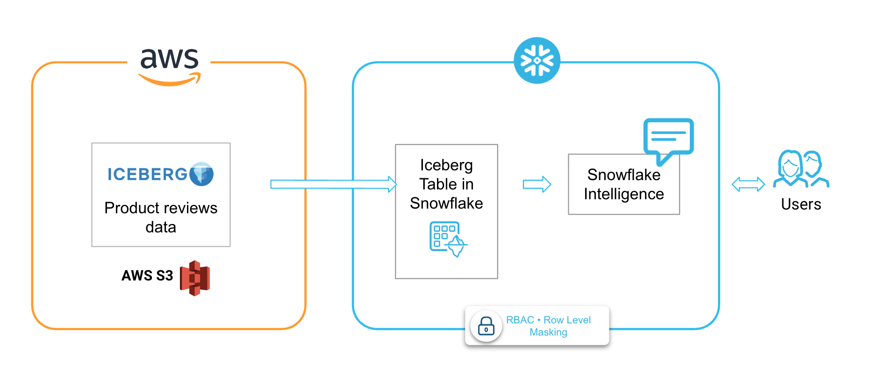

author: Vino Duraisamy
id: govern-your-lakehouse-for-ai
categories: snowflake-site:taxonomy/solution-center/certification/quickstart, snowflake-site:taxonomy/product/data-engineering, snowflake-site:taxonomy/snowflake-feature/iceberg
language: en
summary: This QuickStart provides instructions on how to set up governance using Snowflake for your lakehouse for AI use-cases
environments: web
status: Published
feedback link: https://github.com/Snowflake-Labs/sfguides/issues

# Getting Started with Governing your Lakehouse for AI use-cases

<!-- ------------------------ -->
This guide walks you through setting up a governed data lakehouse with Apache Iceberg tables in Snowflake, implementing data governance policies, establishing data quality monitoring, and creating an AI agent for natural language data exploration.

## Overview

### What You'll Build

In this guide, you will build an **end-to-end governed data lakehouse** for **Amazon Product Reviews Analytics**.

We will cover key aspects of building a production-ready, AI-enabled data lakehouse that combines open table formats with enterprise governance. You'll create a complete solution that:

1. **Connects to external Iceberg data** stored in Amazon S3
2. **Implements fine-grained access controls** with row-level security and data masking
3. **Monitors data quality** with automated metric functions
4. **Enables natural language queries** through a Cortex AI Agent



### What You'll Learn

**In this guide, you will learn:**

- How to configure Apache Iceberg tables with external cloud storage
- How to implement enterprise-grade data governance on open table formats
    - Row Access Policies for role-based row filtering
    - Dynamic Data Masking for sensitive column protection
    - Object Tagging for data classification and compliance
- How to monitor data quality with Data Metric Functions (DMFs)
    - Creating custom quality metrics
    - Scheduling automated quality checks
- How to build AI-powered data access with Cortex Agents
    - Semantic model design for text-to-SQL
    - Agent creation and configuration

### What is Apache Iceberg?

Apache Iceberg is an open table format designed for huge analytic datasets. It provides:

- **ACID transactions** - Reliable operations with atomicity, consistency, isolation, and durability
- **Schema evolution** - Add, rename, or remove columns without rewriting data
- **Hidden partitioning** - Automatic partition management without user-visible partition columns
- **Time travel** - Query data at any point in time using snapshots

### What are Iceberg Tables in Snowflake?

Iceberg tables in Snowflake combine the performance and query semantics of native Snowflake tables with external cloud storage that you manage. They are ideal for:

- Existing data lakes you cannot (or choose not to) migrate
- Multi-engine architectures where multiple compute engines access the same data
- Cost optimization by leveraging your own cloud storage

### Iceberg Tables - Key Concepts

**External Volume:**
- Account-level object connecting Snowflake to your cloud storage
- Stores IAM credentials for secure access
- Supports S3, GCS, and Azure Blob Storage

**Catalog Integration:**
- Defines how Snowflake interacts with Iceberg metadata
- Options: Snowflake-managed, AWS Glue, or object store catalogs

**Metadata Management:**
- Iceberg uses manifest files to track data files
- Snowflake reads metadata to understand table structure
- Enables features like schema evolution and time travel

### What is Snowflake Data Governance?

Snowflake provides a comprehensive suite of governance features that work seamlessly with Iceberg tables:

### Row Access Policies
Row-level security that filters rows at query time based on user context:
- ✅ **Dynamic filtering** based on `CURRENT_ROLE()`, `CURRENT_USER()`, or custom logic
- ✅ **No data duplication** - single table serves multiple audiences
- ✅ **Transparent to queries** - users write normal SQL

### Dynamic Data Masking
Column-level security that transforms sensitive data at query time:
- ✅ **Role-based visibility** - privileged users see real data
- ✅ **Multiple masking patterns** - full mask, partial mask, tokenization
- ✅ **Applied dynamically** - original data unchanged

### Object Tagging
Classification system for organizing and governing data:
- ✅ **Hierarchical tags** - apply to databases, schemas, tables, columns
- ✅ **Tag-based policies** - link masking policies to tags
- ✅ **Compliance tracking** - identify PII, sensitivity levels

### What are Data Metric Functions?

Data Metric Functions (DMFs) measure the state and integrity of your data. They enable:

**Automated Quality Monitoring:**
- Schedule quality checks to run automatically
- Results stored in dedicated event tables
- Alert on quality threshold violations

**Built-in and Custom Metrics:**
- ✅ **System DMFs** - NULL count, duplicate count, uniqueness, freshness
- ✅ **Custom DMFs** - Define your own quality rules with SQL

**Serverless Execution:**
- No warehouse management required
- Snowflake handles compute automatically
- Pay only for scheduled executions

### What are Cortex Agents?

Cortex Agents are AI-powered assistants that orchestrate across multiple tools to answer questions and perform tasks.

**Semantic Model:**
- YAML definition of your data's business meaning
- Dimensions, measures, and time dimensions
- Synonyms for natural language understanding
- Verified queries for accuracy

## Prerequisites

### Snowflake Requirements

| Requirement | Details |
|-------------|---------|
| **Snowflake Account** | Snowflake Free Trial Account |
| **Edition** | Enterprise Edition or higher (required for governance features) |
| **Role** | `ACCOUNTADMIN` or equivalent privileges |
| **Cloud Region** | AWS US-WEST-2 (Snowflake instance should be in the same region as your AWS instance) |


### AWS Requirements (for custom external volumes)

| Requirement | Details |
|-------------|---------|
| **S3 Bucket** | Bucket containing Iceberg data files |
| **IAM Permissions** | Ability to create IAM policies and roles |


### Skills & Knowledge

- Basic SQL proficiency
- Familiarity with cloud storage (AWS S3 in particular for this demo)

### Download SQL files

Download the SQL, JSON and YAML files from [this git repository](https://github.com/Snowflake-Labs/sf-samples/tree/main/samples/govern-your-lakehouse-for-ai-vhol) into your local machine. 

### File Reference

| File | Purpose |
|------|---------|
| `iam_policy.json` | AWS IAM policy for S3 bucket access |
| `1-setup.sql` | Database, warehouse, external volume, and Iceberg table creation |
| `2-governance.sql` | Role creation, row access policies, masking policies, and tagging |
| `3-data-quality.sql` | Custom data metric functions for quality monitoring |
| `4-create-agent.sql` | Cortex Agent with Cortex Analyst for natural language queries |
| `product_reviews_semantic_model.yaml` | Semantic model defining business context for AI |

<!-- ------------------------ -->

## Setup: External Iceberg Tables

### AWS IAM Configuration

Before creating an external volume, you need to configure AWS IAM to grant Snowflake access to your S3 bucket.

#### Step 1: Create an IAM Policy

Create a policy that grants Snowflake the necessary S3 permissions. The policy in `iam_policy.json` provides:

```json
{
    "Version": "2012-10-17",
    "Statement": [
        {
            "Sid": "AllowIcebergObjectAccess",
            "Effect": "Allow",
            "Action": [
                "s3:PutObject",
                "s3:GetObject",
                "s3:GetObjectVersion",
                "s3:DeleteObject",
                "s3:DeleteObjectVersion"
            ],
            "Resource": "arn:aws:s3:::<bucket-name-and-prefix>/*"
        },
        {
            "Sid": "AllowIcebergBucketAccess",
            "Effect": "Allow",
            "Action": [
                "s3:ListBucket",
                "s3:GetBucketLocation"
            ],
            "Resource": "arn:aws:s3:::<bucket-name>",
            "Condition": {
                "StringLike": {
                    "s3:prefix": [
                        "<prefix>/*"
                    ]
                }
            }
        }
    ]
}
```

**Key Permissions Explained:**

| Permission | Purpose |
|------------|---------|
| `s3:PutObject` | Write data files to S3 |
| `s3:GetObject` | Read data and metadata files |
| `s3:GetObjectVersion` | Access versioned objects (required for Time Travel) |
| `s3:DeleteObject` | Remove data files during compaction |
| `s3:ListBucket` | List bucket contents |
| `s3:GetBucketLocation` | Verify bucket region |

#### Step 2: Create an IAM Role

1. Create an AWS IAM role with a trust policy for Snowflake
2. Attach the IAM policy created above
3. Record the Role ARN for use in the external volume configuration

#### Step 3: Update Trust Policy

After creating the external volume, retrieve the Snowflake IAM user ARN using `DESC EXTERNAL VOLUME` and update the IAM role's trust policy:

```json
{
  "Version": "2012-10-17",
  "Statement": [
    {
      "Effect": "Allow",
      "Principal": {
        "AWS": "<snowflake_user_arn>"
      },
      "Action": "sts:AssumeRole",
      "Condition": {
        "StringEquals": {
          "sts:ExternalId": "<your_external_id>"
        }
      }
    }
  ]
}
```

### Snowflake Setup Script (`1-setup.sql`)

```sql
USE ROLE ACCOUNTADMIN;

CREATE DATABASE LAKEHOUSE_VHOL;
CREATE WAREHOUSE VHOL_XS WAREHOUSE_SIZE = XSMALL;

USE LAKEHOUSE_VHOL.PUBLIC;
USE WAREHOUSE VHOL_XS;
```

#### External Volume

An **external volume** is an account-level Snowflake object that connects Snowflake to your external cloud storage for Iceberg tables. It stores the IAM entity that Snowflake uses to securely access your storage.

```sql
CREATE OR REPLACE EXTERNAL VOLUME amazon_reviews_iceberg_volume
  STORAGE_LOCATIONS = (
    (
      NAME = 'amazon-reviews-s3'
      STORAGE_PROVIDER = 'S3'
      STORAGE_BASE_URL = 's3://amazon-product-reviews-dataset/curated/product_reviews/product_reviews_db/product_reviews_100k/'
      STORAGE_AWS_ROLE_ARN = '<>'
      STORAGE_AWS_EXTERNAL_ID = 'ext_id'
    )
  )
  ALLOW_WRITES = TRUE;
```

**Parameters:**
| Parameter | Description |
|-----------|-------------|
| `STORAGE_PROVIDER` | Cloud provider (`S3`, `GCS`, `AZURE`) |
| `STORAGE_BASE_URL` | Base URL for your storage location |
| `STORAGE_AWS_ROLE_ARN` | ARN of the IAM role with S3 access |
| `STORAGE_AWS_EXTERNAL_ID` | External ID for cross-account access security |
| `ALLOW_WRITES` | Enable write operations (required for Snowflake-managed tables) |

Verify the external volume configuration:

```sql
DESC EXTERNAL VOLUME amazon_reviews_iceberg_volume;
SELECT SYSTEM$VERIFY_EXTERNAL_VOLUME('amazon_reviews_iceberg_volume');
```

#### Catalog Integration

A **catalog integration** tells Snowflake how to interact with Iceberg metadata. For externally managed tables, use `OBJECT_STORE`:

```sql
CREATE OR REPLACE CATALOG INTEGRATION amazon_reviews_catalog_int
  CATALOG_SOURCE = OBJECT_STORE
  TABLE_FORMAT = ICEBERG
  ENABLED = TRUE;
```

#### Create the Iceberg Table

Create an Iceberg table pointing to existing metadata:

```sql
CREATE OR REPLACE ICEBERG TABLE product_reviews_iceberg
  EXTERNAL_VOLUME = 'amazon_reviews_iceberg_volume'
  CATALOG = 'amazon_reviews_catalog_int'
  METADATA_FILE_PATH = 'metadata/00000-00a5b7be-48a2-4966-918f-99af062f8e85.metadata.json';
```

#### Verify Your Data

```sql
SELECT * FROM product_reviews_iceberg LIMIT 10;

SELECT COUNT(*) AS total_reviews,
       ROUND(AVG(OVERALL), 2) AS avg_rating,
       COUNT(DISTINCT ASIN) AS unique_products,
       COUNT(DISTINCT REVIEWERID) AS unique_reviewers
FROM product_reviews_iceberg;
```
<!-- ------------------------ -->
## Governance: Access Control, Tagging & Masking

### Overview

Snowflake provides comprehensive governance features for Iceberg tables, enabling you to:
- Control row-level access based on user roles
- Mask sensitive data dynamically
- Classify and tag data for compliance

### Role-Based Access Control (`2-governance.sql`)

#### Create Custom Roles

```sql
USE ROLE ACCOUNTADMIN;

CREATE ROLE IF NOT EXISTS DATA_ADMIN;
CREATE ROLE IF NOT EXISTS ANALYST;

SET my_user = CURRENT_USER();

GRANT ROLE DATA_ADMIN TO USER IDENTIFIER($my_user);
GRANT ROLE ANALYST TO USER IDENTIFIER($my_user);
```

#### Grant Permissions

```sql
GRANT USAGE ON DATABASE LAKEHOUSE_VHOL TO ROLE DATA_ADMIN;
GRANT USAGE ON DATABASE LAKEHOUSE_VHOL TO ROLE ANALYST;
GRANT USAGE ON SCHEMA LAKEHOUSE_VHOL.PUBLIC TO ROLE DATA_ADMIN;
GRANT USAGE ON SCHEMA LAKEHOUSE_VHOL.PUBLIC TO ROLE ANALYST;
GRANT SELECT ON ICEBERG TABLE LAKEHOUSE_VHOL.PUBLIC.product_reviews_iceberg TO ROLE DATA_ADMIN;
GRANT SELECT ON ICEBERG TABLE LAKEHOUSE_VHOL.PUBLIC.product_reviews_iceberg TO ROLE ANALYST;
GRANT USAGE ON WAREHOUSE VHOL_XS TO ROLE DATA_ADMIN;
GRANT USAGE ON WAREHOUSE VHOL_XS TO ROLE ANALYST;
```

### Row Access Policies

**Row Access Policies** enable row-level security by determining which rows are visible based on the user's role and context. The policy is evaluated at query runtime, creating a dynamic secure view.

#### Create a Time-Based Row Access Policy

This policy restricts the `ANALYST` role to only see reviews from 2010 onwards, while `DATA_ADMIN` and `ACCOUNTADMIN` can see all data:

```sql
CREATE OR REPLACE ROW ACCESS POLICY LAKEHOUSE_VHOL.PUBLIC.time_based_review_policy
AS (UNIXREVIEWTIME NUMBER) RETURNS BOOLEAN ->
  CASE
    WHEN CURRENT_ROLE() IN ('ACCOUNTADMIN', 'DATA_ADMIN') THEN TRUE
    WHEN CURRENT_ROLE() = 'ANALYST' 
      AND TO_TIMESTAMP(UNIXREVIEWTIME) >= '2010-01-01'::TIMESTAMP THEN TRUE
    ELSE FALSE
  END;
```

#### Apply the Policy

```sql
ALTER ICEBERG TABLE LAKEHOUSE_VHOL.PUBLIC.product_reviews_iceberg
  ADD ROW ACCESS POLICY LAKEHOUSE_VHOL.PUBLIC.time_based_review_policy ON (UNIXREVIEWTIME);
```

#### Verify Role-Based Access

```sql
-- DATA_ADMIN: should see all 100,000 rows (1997-2014)
USE ROLE DATA_ADMIN;
SELECT 'DATA_ADMIN' AS role, COUNT(*) AS visible_rows,
       MIN(TO_TIMESTAMP(UNIXREVIEWTIME))::DATE AS earliest,
       MAX(TO_TIMESTAMP(UNIXREVIEWTIME))::DATE AS latest
FROM LAKEHOUSE_VHOL.PUBLIC.product_reviews_iceberg;

-- ANALYST: should see fewer rows (2010-2014 only)
USE ROLE ANALYST;
SELECT 'ANALYST' AS role, COUNT(*) AS visible_rows,
       MIN(TO_TIMESTAMP(UNIXREVIEWTIME))::DATE AS earliest,
       MAX(TO_TIMESTAMP(UNIXREVIEWTIME))::DATE AS latest
FROM LAKEHOUSE_VHOL.PUBLIC.product_reviews_iceberg;
```

### Dynamic Data Masking

**Dynamic Data Masking** is a column-level security feature that masks data at query time based on the user's role. The original data remains unchanged; masking is applied dynamically.

#### Create a Masking Policy

```sql
USE ROLE ACCOUNTADMIN;

CREATE OR REPLACE MASKING POLICY LAKEHOUSE_VHOL.PUBLIC.mask_reviewer_name
AS (val STRING) RETURNS STRING ->
  CASE
    WHEN CURRENT_ROLE() IN ('ACCOUNTADMIN', 'DATA_ADMIN') THEN val
    ELSE '***MASKED***'
  END;
```

#### Apply the Masking Policy

```sql
ALTER ICEBERG TABLE LAKEHOUSE_VHOL.PUBLIC.product_reviews_iceberg
  MODIFY COLUMN REVIEWERNAME SET MASKING POLICY LAKEHOUSE_VHOL.PUBLIC.mask_reviewer_name;
```

#### Verify Masking Behavior

```sql
-- DATA_ADMIN sees real names
USE ROLE DATA_ADMIN;
SELECT REVIEWERID, REVIEWERNAME, SUMMARY 
FROM LAKEHOUSE_VHOL.PUBLIC.product_reviews_iceberg LIMIT 5;

-- ANALYST sees masked names
USE ROLE ANALYST;
SELECT REVIEWERID, REVIEWERNAME, SUMMARY 
FROM LAKEHOUSE_VHOL.PUBLIC.product_reviews_iceberg LIMIT 5;
```

### Object Tagging

**Tags** enable data classification and can be used to organize data governance across your organization. Tags can be applied to tables, columns, and other database objects.

#### Create Classification Tags

```sql
USE ROLE ACCOUNTADMIN;

CREATE OR REPLACE TAG LAKEHOUSE_VHOL.PUBLIC.pii_type ALLOWED_VALUES 'name', 'email', 'id', 'none';
CREATE OR REPLACE TAG LAKEHOUSE_VHOL.PUBLIC.data_sensitivity ALLOWED_VALUES 'high', 'medium', 'low';
```

#### Apply Tags to Columns

```sql
ALTER ICEBERG TABLE LAKEHOUSE_VHOL.PUBLIC.product_reviews_iceberg
  MODIFY COLUMN REVIEWERNAME SET TAG LAKEHOUSE_VHOL.PUBLIC.pii_type = 'name';

ALTER ICEBERG TABLE LAKEHOUSE_VHOL.PUBLIC.product_reviews_iceberg
  MODIFY COLUMN REVIEWERID SET TAG LAKEHOUSE_VHOL.PUBLIC.pii_type = 'id';

ALTER ICEBERG TABLE LAKEHOUSE_VHOL.PUBLIC.product_reviews_iceberg
  MODIFY COLUMN REVIEWTEXT SET TAG LAKEHOUSE_VHOL.PUBLIC.data_sensitivity = 'medium';
```

#### Apply Tags to the Table

```sql
ALTER ICEBERG TABLE LAKEHOUSE_VHOL.PUBLIC.product_reviews_iceberg
  SET TAG LAKEHOUSE_VHOL.PUBLIC.data_sensitivity = 'medium';
```

#### View All Tags

```sql
SELECT * FROM TABLE(
  INFORMATION_SCHEMA.TAG_REFERENCES_ALL_COLUMNS(
    'LAKEHOUSE_VHOL.PUBLIC.product_reviews_iceberg',
    'TABLE'
  )
);
```
<!-- ------------------------ -->

## Data Quality: Monitoring with Data Metric Functions

### Overview

**Data Metric Functions (DMFs)** measure the state and integrity of your data. Snowflake provides built-in system DMFs and supports custom DMFs for specialized quality measurements. DMFs can be scheduled to run automatically and results are stored in a dedicated event table.

### Benefits of DMFs:
- **Automated measurement** - Schedule quality checks without manual intervention
- **Compliance facilitation** - Document data quality for regulatory requirements
- **SLA monitoring** - Track freshness and accuracy metrics
- **Consistent evaluation** - Apply the same metrics across tables

### Create Custom DMFs (`3-data-quality.sql`)

#### Empty Review Count DMF

Checks for NULL or empty review text:

```sql
USE ROLE ACCOUNTADMIN;

CREATE OR REPLACE DATA METRIC FUNCTION LAKEHOUSE_VHOL.PUBLIC.empty_review_count(
  ARG_T TABLE(ARG_C STRING)
)
RETURNS NUMBER AS
'SELECT COUNT(*) FROM ARG_T WHERE ARG_C IS NULL OR TRIM(ARG_C) = \'\'';
```

#### Invalid Rating Count DMF

Validates ratings are within the expected 1-5 range:

```sql
CREATE OR REPLACE DATA METRIC FUNCTION LAKEHOUSE_VHOL.PUBLIC.invalid_rating_count(
  ARG_T TABLE(ARG_C FLOAT)
)
RETURNS NUMBER AS
'SELECT COUNT(*) FROM ARG_T WHERE ARG_C < 1 OR ARG_C > 5 OR ARG_C IS NULL';
```

### Schedule DMF Execution

```sql
ALTER ICEBERG TABLE LAKEHOUSE_VHOL.PUBLIC.product_reviews_iceberg
  SET DATA_METRIC_SCHEDULE = '5 MINUTE';
```

### Run DMFs Directly

```sql
-- Check for empty reviews
SELECT LAKEHOUSE_VHOL.PUBLIC.empty_review_count(
  SELECT REVIEWTEXT FROM LAKEHOUSE_VHOL.PUBLIC.product_reviews_iceberg
) AS empty_review_count;

-- Check for invalid ratings
SELECT LAKEHOUSE_VHOL.PUBLIC.invalid_rating_count(
  SELECT OVERALL FROM LAKEHOUSE_VHOL.PUBLIC.product_reviews_iceberg
) AS invalid_rating_count;
```

### DMF Execution Model

| Feature | Description |
|---------|-------------|
| **Serverless compute** | DMFs use Snowflake-managed compute resources |
| **Event logging** | Results are logged to a dedicated event table |
| **Billing** | Charged under "Data Quality Monitoring" category |
| **Scheduling** | All DMFs on a table follow the same schedule |

<!-- ------------------------ -->

## AI Agent: Natural Language Data Access

### Overview

**Snowflake Cortex Agents** are AI-powered assistants that orchestrate across multiple tools to answer questions and perform tasks. In this lab, we create an agent that uses **Cortex Analyst** for text-to-SQL capabilities, allowing users to query product reviews using natural language.

### Semantic Model

The semantic model (`product_reviews_semantic_model.yaml`) defines the business meaning of your data, enabling the AI to generate accurate SQL queries.

#### Key Components:

**Dimensions** - Categorical attributes for grouping and filtering:
```yaml
dimensions:
  - name: asin
    synonyms:
      - product_id
      - amazon_product_id
    description: Amazon Standard Identification Number - unique product identifier
    expr: ASIN
    data_type: VARCHAR
```

**Time Dimensions** - Date/time fields for temporal analysis:
```yaml
time_dimensions:
  - name: review_timestamp
    synonyms:
      - review_date
      - timestamp
    description: Unix timestamp when the review was posted
    expr: TO_TIMESTAMP(UNIXREVIEWTIME)
    data_type: TIMESTAMP
```

**Measures** - Quantitative metrics for aggregation:
```yaml
measures:
  - name: overall_rating
    synonyms:
      - rating
      - stars
      - score
    description: Overall rating given by the reviewer (typically 1-5 scale)
    expr: OVERALL
    data_type: FLOAT
    default_aggregation: avg
```

**Verified Queries** - Pre-validated query patterns:
```yaml
verified_queries:
  - name: average_rating
    question: What is the average overall rating?
    sql: |
      SELECT AVG(OVERALL) as average_rating
      FROM LAKEHOUSE_VHOL.PUBLIC.PRODUCT_REVIEWS_ICEBERG
```

### Create the Agent (`4-create-agent.sql`)

#### Upload the Semantic Model

```sql
USE LAKEHOUSE_VHOL.PUBLIC;
USE WAREHOUSE VHOL_XS;
USE ROLE ACCOUNTADMIN;

CREATE STAGE IF NOT EXISTS LAKEHOUSE_VHOL.PUBLIC.SEMANTIC_MODELS;

-- Manually upload product_reviews_semantic_model.yaml to the stage
```

#### Setup Snowflake Intelligence Database

For agents to be discoverable in Snowflake Intelligence, they must be created in the `SNOWFLAKE_INTELLIGENCE.AGENTS` schema:

```sql
CREATE DATABASE IF NOT EXISTS SNOWFLAKE_INTELLIGENCE;
GRANT USAGE ON DATABASE SNOWFLAKE_INTELLIGENCE TO ROLE PUBLIC;

CREATE SCHEMA IF NOT EXISTS SNOWFLAKE_INTELLIGENCE.AGENTS;
GRANT USAGE ON SCHEMA SNOWFLAKE_INTELLIGENCE.AGENTS TO ROLE PUBLIC;
GRANT CREATE AGENT ON SCHEMA SNOWFLAKE_INTELLIGENCE.AGENTS TO ROLE ACCOUNTADMIN;
```

#### Create the Agent

```sql
CREATE OR REPLACE AGENT SNOWFLAKE_INTELLIGENCE.AGENTS.AMAZON_PRODUCT_REVIEWS_AGENT
  COMMENT = 'Agent for querying Amazon product reviews data'
  PROFILE = '{"display_name": "Amazon Product Reviews Assistant"}'
  FROM SPECIFICATION $$
  {
    "models": {
      "orchestration": "claude-4-sonnet"
    },
    "instructions": {
      "orchestration": "Use the product reviews tool to answer questions about reviews, ratings, and customer feedback.",
      "response": "Be concise and data-driven. When showing ratings, include counts for context."
    },
    "tools": [
      {
        "tool_spec": {
          "type": "cortex_analyst_text_to_sql",
          "name": "product_reviews",
          "description": "Query product reviews data including ratings, review text, summaries, and reviewer information"
        }
      }
    ],
    "tool_resources": {
      "product_reviews": {
        "semantic_model_file": "@LAKEHOUSE_VHOL.PUBLIC.SEMANTIC_MODELS/product_reviews_semantic_model.yaml",
        "execution_environment": {
          "type": "warehouse",
          "warehouse": "VHOL_XS"
        }
      }
    }
  }
  $$;
```

#### Agent Specification Components

| Component | Description |
|-----------|-------------|
| `models.orchestration` | LLM for planning and tool selection (e.g., `claude-4-sonnet`, `llama3.3-70B`) |
| `instructions.orchestration` | Guidance for tool selection and query planning |
| `instructions.response` | Tone and formatting for responses |
| `tools` | Array of tool definitions (Cortex Analyst, Cortex Search, custom tools) |
| `tool_resources` | Configuration for each tool (semantic model, warehouse, etc.) |

#### Grant Access

```sql
GRANT USAGE ON AGENT SNOWFLAKE_INTELLIGENCE.AGENTS.AMAZON_PRODUCT_REVIEWS_AGENT TO ROLE PUBLIC;
```

### Using the Agent

After creation, the agent is accessible via:
1. **Snowflake Intelligence UI** (AI & ML > Snowflake Intelligence)
2. **REST API** for programmatic access
3. **SQL** using agent functions

Example questions the agent can answer:
- "What is the average rating for all products?"
- "How many reviews are there for each star rating?"
- "Show me the most recent reviews"
- "What products have the highest ratings?"

<!-- ------------------------ -->

## Conclusion and Resources

### What did you build?

In this guide, you built an **end-to-end governed data lakehouse** for **Amazon Product Reviews Analytics**.

You have covered key aspects of building a production-ready, AI-enabled data lakehouse that combines open table formats with enterprise governance. You created a complete solution that:

1. **Connects to external Iceberg data** stored in Amazon S3
2. **Implements fine-grained access controls** with row-level security and data masking
3. **Monitors data quality** with automated metric functions
4. **Enables natural language queries** through a Cortex AI Agent

### Additional Resources

- [Apache Iceberg Tables in Snowflake](https://docs.snowflake.com/en/user-guide/tables-iceberg)
- [Configure an External Volume for Amazon S3](https://docs.snowflake.com/en/user-guide/tables-iceberg-configure-external-volume-s3)
- [Understanding Row Access Policies](https://docs.snowflake.com/en/user-guide/security-row-intro)
- [Understanding Dynamic Data Masking](https://docs.snowflake.com/en/user-guide/security-column-ddm-intro)
- [Introduction to Data Quality and DMFs](https://docs.snowflake.com/en/user-guide/data-quality-intro)
- [Cortex Agents Documentation](https://docs.snowflake.com/en/user-guide/snowflake-cortex/cortex-agents)
- [Snowflake Intelligence Overview](https://docs.snowflake.com/user-guide/snowflake-cortex/snowflake-intelligence)
