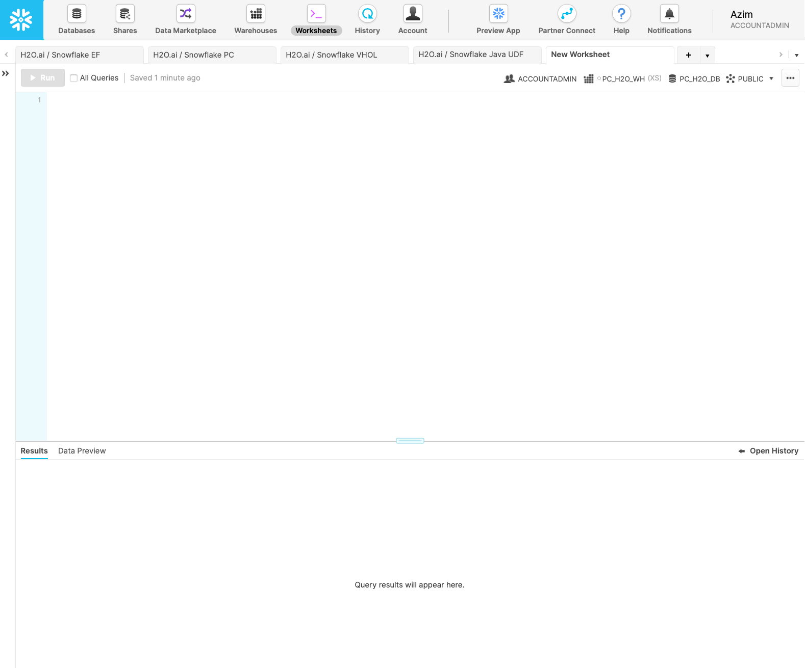
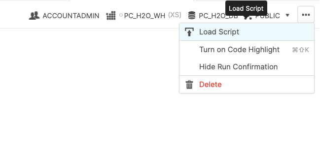

author: miles.adkins@snowflake.com
id: automl_with_snowflake_and_h2o
summary: This lab will walk you through how to use Snowflake and H2O to perform supervised machine learning.
categories: Getting Started
environments: web
status: Published
feedback link: https://github.com/Snowflake-Labs/sfguides/issues
tags: H2O, AutoML, Partner Connect, Databases, Tables, Stages, File Formats

# AutoML with Snowflake and H2O

<!-- ------------------------ -->
## Use Case Overview
Duration: 5

This guide will take you through the process of performing supervised machine learning by building a binary classification model to help predict whether a customer is likely to churn (that is, no longer be our customer).

Supervised machine learning is the process of taking a historical dataset with KNOWN outcomes of what we would like to predict, to train a model, that can be used to make future predictions.

The historical dataset we will be working with today is taken from a fictitious telecommunications company, and contains details about a customers plan usage, spend patterns, issues logged with customer support, geographical information, and a binary value (hence binary classification) indicating whether that person ended their contract with the company (churned). Here is a snippet of the data:
<br/><br/>

<br/><br/>
Throughout this process, you will discover the ease at which it is possible to build and deploy machine learning models by leveraging the scale and performance of Snowflake and the automation of the H2O platform.

To showcase the full lifecycle of a deploying machine learning model, we will first load in Snowflake, our data cloud where all of our data lives. Then, we will leverage the H2Oauto-pilot process to perform exploratory data analysis, and then train, evaluate, and interpret a slew of potential machine learning models. And finally, use the Snowflake-H2O prediction integration to score our model against new data, as if the model was in production.
### Prerequisites
- Basic knowledge of SQL, and database concepts and objects
- Basic understanding of data science and machine learning

### What You'll Learn
- How to create and utilize databases, tables, views, and warehouses
- Load structured data into Snowflake
- Use Snowflake’s “Partner Connect” to seamlessly create a H2O trial
- Automatically create, run, and evaluate prediction models in H2O
- Write results to Snowflake

### What You’ll Need
- A [Snowflake](https://signup.snowflake.com/) Account (if you are using an enterprise account through your organization, it is unlikely that you will have the privileges to use the `ACCOUNTADMIN` role, which is required for this lab).

### What You’ll Build
- Snowflake objects, including tables and warehouses, to scale and manage your data
- Over 50+ machine learning models automatically to measure their performance and interpret
- A prediction pipeline to automate scoring new data on your deployed model

<!-- ------------------------ -->
## Setting up Snowflake
Duration: 5

The first thing you will need to do is download the following .sql file that contains a series of SQL commands we will execute throughout this lab.

<button>
  [Download .sql File](https://snowflake-workshop-lab.s3.amazonaws.com/Snowflake_Datarobot_VHOL_guides.sql)
</button>
<br/><br/>

At this point, log into your Snowflake account and have a clear screen to start working with. If you have just created a free trial account, feel free to minimize or close and hint boxes that are looking to help guide you. These will not be need for this lab and most of the hints will be covered throughout the remainder of this exercise.


<br/><br/>

To ingest our script in the Snowflake UI, navigate to the ellipsis button on the top right hand side of a “New Worksheet” and load our script.


<br/><br/>

Snowflake provides "worksheets" as the spot for you to execute your code. For each worksheet you create, you will need to set the “context” so the worksheet knows how to behave. A “context” in Snowflake is made up of 4 distinctions that must be set before we can perform any work: the “role” we want to act as, the “database” and “schema” we want to work with, and the “warehouse” we want to perform the work. This can be found in the top right hand section of a new worksheet.


Lets go ahead and set the role we want to act as, which will be `SYSADMIN` to begin with. We can either set this either manually (`SYSADMIN` is the default role for a first time user, so this already may be populated) by hovering over the people icon and choosing SYSADMIN from the “Role” dropdown, or we can run the following line of code in our worksheet. In addition to traditional SQL statements, Snowflake Data Definition ([DDL](https://docs.snowflake.com/en/sql-reference/sql-ddl-summary.html)) commands, such as setting the worksheet context, can also be written and executed within the worksheet.

```sql
USE ROLE sysadmin;
```

To execute this code, all we need to do is place our cursor on the line we wish to run and then either hit the "run" button at the top left of the worksheet or press `Cmd/Ctrl + Enter`.

Each step throughout the guide has an associated SQL command to perform the work we are looking to execute, and so feel free to step through each action running the code line by line as we walk through the lab. For the purposes of this demo, we will not be running multiple statements in a row.
