author: miles.adkins@snowflake.com
id: automl_with_snowflake_and_h2o
summary: This lab will walk you through how to use Snowflake and H2O Driverless AI to perform supervised machine learning.
categories: Getting Started
environments: web
status: Published
feedback link: https://github.com/Snowflake-Labs/sfguides/issues
tags: H2O, AutoML, Partner Connect, Databases, Tables, Stages, File Formats

# AutoML with Snowflake and H2O Driverless AI

<!-- ------------------------ -->
# AutoML with Snowflake and H2O Driverless AI
Duration: 5
## Use Case Overview

H2O Driverless AI is an artificial intelligence (AI) platform for automatic machine learning. Driverless AI automates the most difficult data science and machine learning workflows such as feature engineering, model validation, model tuning, model selection, and model deployment. Modeling pipelines (feature engineering and models) are exported as standalone scoring artifacts.

This tutorial presents a quick introduction to the Driverless AI platform on Snowflake. Driverless AI is a tool for easily building predictive (supervised learning) models. Supervised learning methods take historic data where the response or **target** is known and build relationships between the input variables and the target variable. The result is a prediction where new input variables are known but the target is unknown.

We will use a dataset from Lending Club to build a classification model that predicts whether a Lending Club customer defaults on their loan. Lending Club is an established online loan marketplace that funds personal loans, commercial loans, funding of medical procedures, and other financing needs. The data consist of 25 columns and approximately 39,000 rows, with each row corresponding to a customer. A preview of the data is shown below.

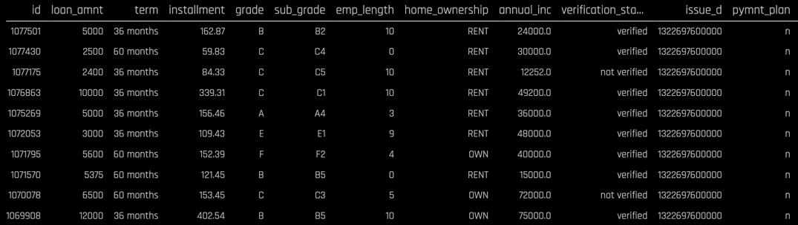

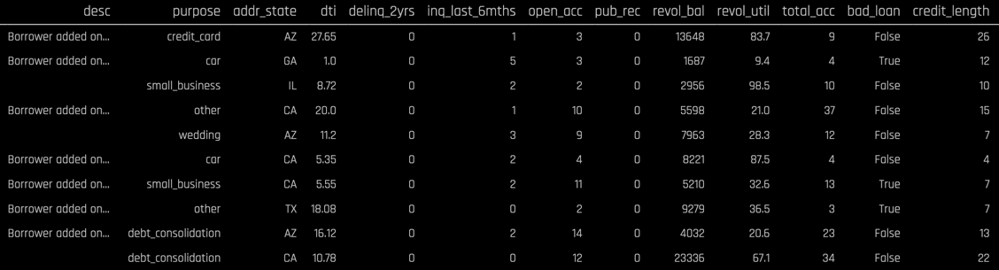

Note that the dataset consist of numerical columns (`loan_amount`, `installment`, `emp_length`, `dti`, etc.), categorical columns (`term`, `home_ownership`, `verification_status`, `purpose`, etc.), and a text column (`desc`). Our target variable is `bad_loan` which is Boolean with values `True` and `False`.

We will use Snowflake and Driverless AI to:

- **Import** the data from Snowflake
- **Explore** the data using summary descriptive statistics and automated visualizations (AutoViz)
- **Build** a predictive model using an evolutionary algorithm for automatic feature engineering and model optimization
- **Measure** the model through diagnostics
- **Understand** the model through MLI (machine learning interpretability)
- **Deploy** the model into production in a Snowflake system

### Prerequisites

* A [Snowflake](https://signup.snowflake.com/) Account deployed in AWS (if you are using an enterprise account through your organization, it is unlikely that you will have the privileges to use the `ACCOUNTADMIN` role, which is required for this lab).
* An [H2O Driverless AI](https://www.h2o.ai/try-driverless-ai/) trial license.
* A basic understanding of data science and machine learning concepts.

### What You'll Learn

* How to use Snowflake's "Partner Connect" to create a Driverless AI instance
* How to use Driverless AI to build a supervised learning classification model.
* How to deploy the finished model pipeline as a Snowflake Java UDF.

<!-- ------------------------ -->
## Setting up Snowflake
Duration: 5

The first thing you will need to do is download the following .sql file that contains a series of SQL commands we will execute throughout this lab.

<button>
  [Download .sql File](https://snowflake-workshop-lab.s3.amazonaws.com/h2o/Snowflake_H2o_VHOL_guides.sql)
</button>

At this point, log into your Snowflake account and have a clear screen to start working with. If you have just created a free trial account, feel free to minimize or close and hint boxes that are looking to help guide you. These will not be need for this lab and most of the hints will be covered throughout the remainder of this exercise.

To ingest our script in the Snowflake UI, navigate to the ellipsis button on the top right hand side of a “New Worksheet” and load our script.

Snowflake provides "worksheets" as the spot for you to execute your code. For each worksheet you create, you will need to set the “context” so the worksheet knows how to behave. A “context” in Snowflake is made up of 4 distinctions that must be set before we can perform any work: the “role” we want to act as, the “database” and “schema” we want to work with, and the “warehouse” we want to perform the work. This can be found in the top right hand section of a new worksheet.

Lets go ahead and set the role we want to act as, which will be `SYSADMIN` to begin with. We can either set this either manually (`SYSADMIN` is the default role for a first time user, so this already may be populated) by hovering over the people icon and choosing SYSADMIN from the “Role” dropdown, or we can run the following line of code in our worksheet. In addition to traditional SQL statements, Snowflake Data Definition ([DDL](https://docs.snowflake.com/en/sql-reference/sql-ddl-summary.html)) commands, such as setting the worksheet context, can also be written and executed within the worksheet.

```sql
USE ROLE sysadmin;
```

To execute this code, all we need to do is place our cursor on the line we wish to run and then either hit the "run" button at the top left of the worksheet or press `Cmd/Ctrl + Enter`.

Each step throughout the guide has an associated SQL command to perform the work we are looking to execute, and so feel free to step through each action running the code line by line as we walk through the lab. For the purposes of this demo, we will not be running multiple statements in a row.

<!-- ------------------------ -->
## Launching Driverless AI
Duration: 5
### Connecting from Snowflake

We assume you are logged into your Snowflake account viewing the Snowflake Partner Connect screen. Connecting to H2O from here is quite simple. First select the H2O link and click `Connect`

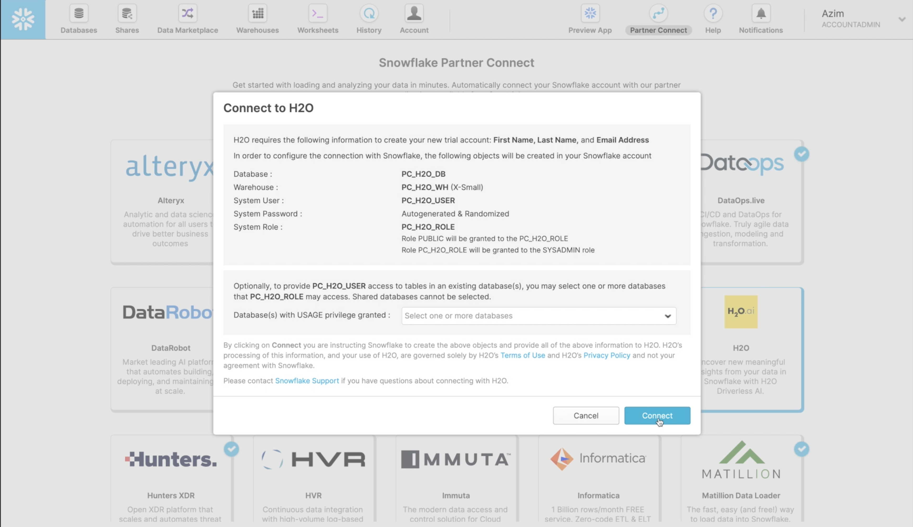

This creates a partner account which you can immediately `Activate`

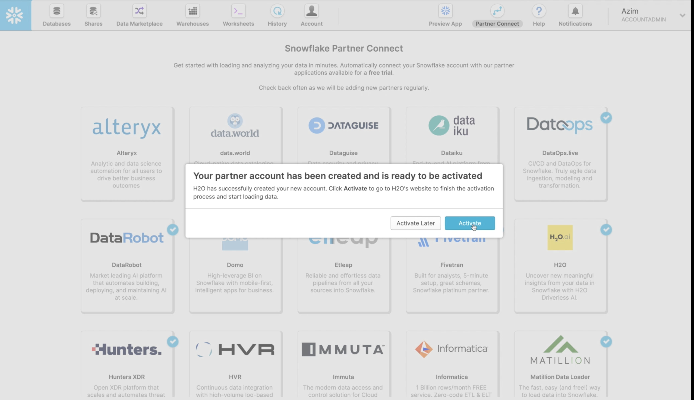

You next need to accept the H2O Terms and Conditions for the Trial Agreement


and wait while your H2O Driverless AI instance is configured and launched.

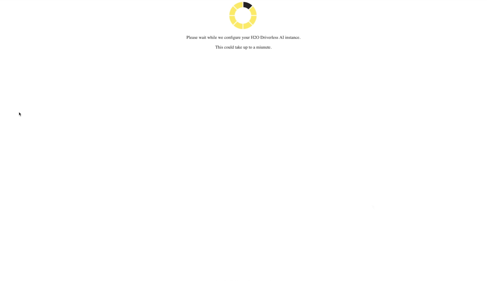

### Driverless AI Interface

Your brand new Driverless AI instance looks like

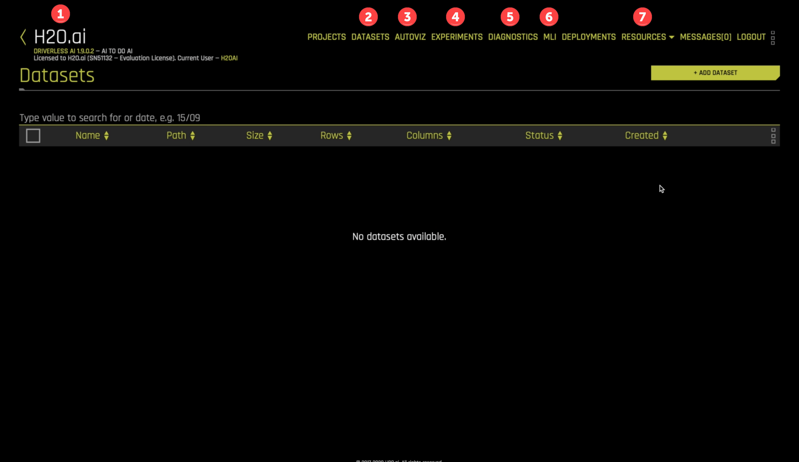

A summary of the information and views we cover in this tutorial include

1. H2O.ai information: This displays the version (Driverless AI 1.9.0.2), the license owner and status, and the current user (H2OAI).
2. `DATASETS`: A view for importing, listing, and operating on datasets.
3. `AUTOVIZ`: The Automatic Visualizations of data view.
4. `EXPERIMENTS`: The view where we build and deploy predictive models.
5. `DIAGNOSTICS`: Model diagnostics view.
6. `MLI`: Machine learning interpretability view, information to help us understand our models.
7. `RESOURCES`: A pull-down menu for accessing system information, clients, help, and other resources.

<!-- ------------------------ -->
## Import Data from Snowflake
Duration: 5

From the empty Datasets view, click the `Add Dataset` button and select the `SNOWFLAKE` connector:

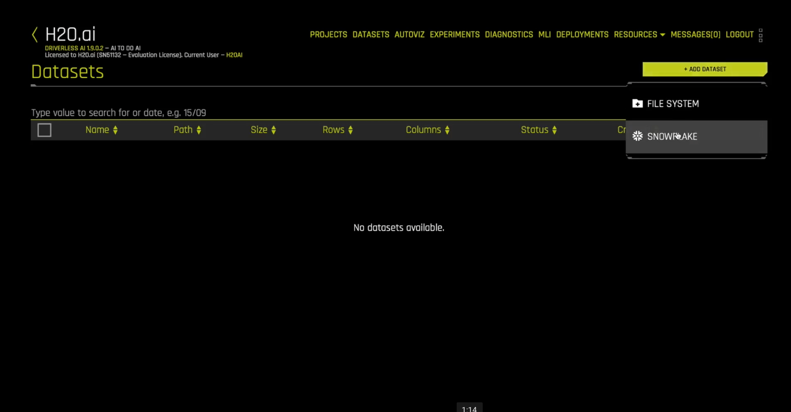

This launches the `Make Snowflake Query` form.


Enter into the form

* the Database `Lendingclub`,
* the Schema as `public`,
* the Warehouse as `demo_wh`,
* the Name as `loans.csv`,
* the SQL Query `select * from loans`.

Then click the `CLICK TO MAKE QUERY` button. This imports the data into the Driverless AI system.

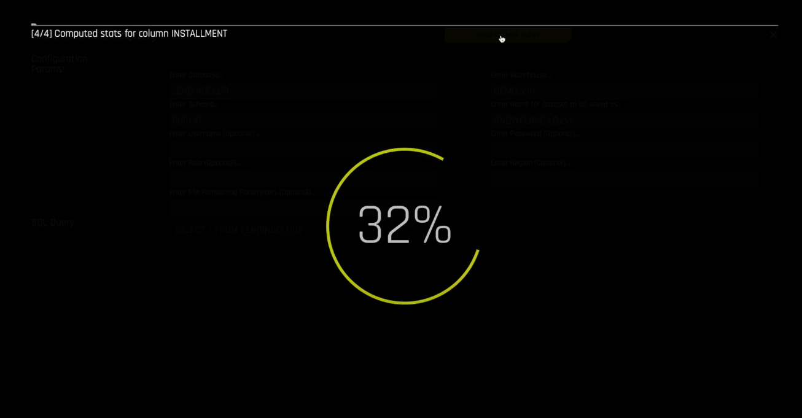

The dataset is now available for next steps in Driverless AI

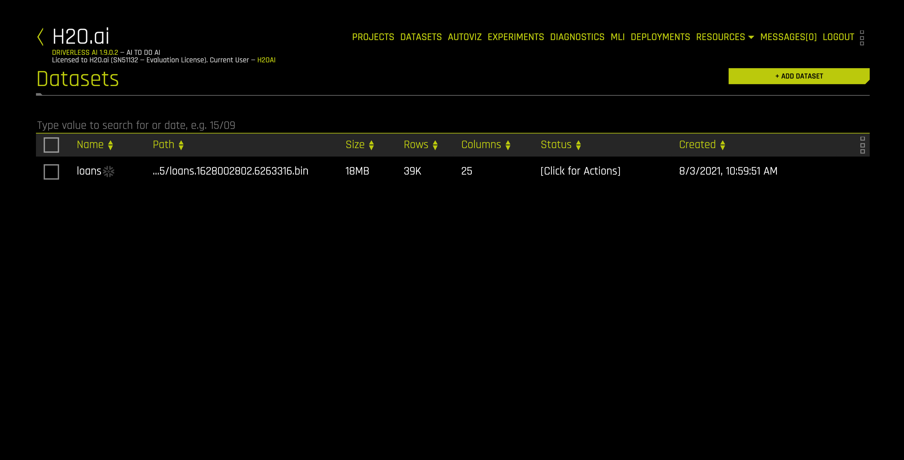

<!-- ------------------------ -->
## Dataset Details
Duration: 5

Right click the `loans` dataset to get details.

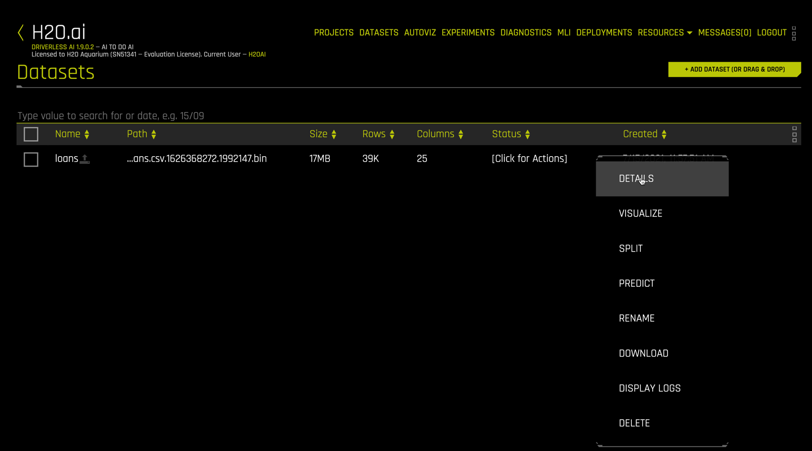

The `Dataset Details` view is a quick way to inspect the dataset columns, see their storage type (integer, string, etc.), get summary statistics and distribution plots for each column.


In more advanced usage, you can edit the data type interactively


Scrolling to the right, inspect the `bad_loans` column, our target variable.

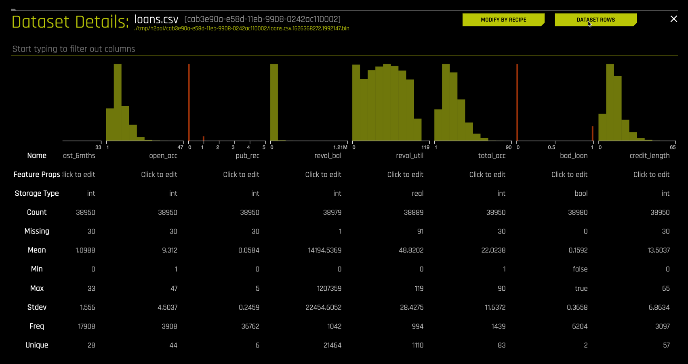

The target `bad_loans` is Boolean with 38,980 observations and has a mean value of 0.1592. This means that 15.92% of the customers (rows) in this dataset have a loan that was not paid off.

Clicking the `DATASET ROWS` button on the upper right yields a spreadsheet format.

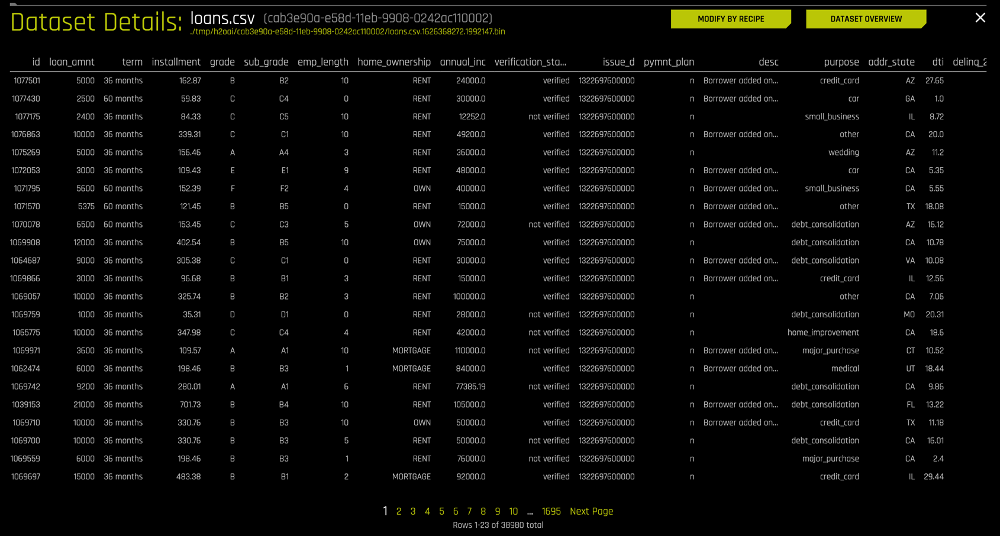

This is helpful in understanding the layout of the data. A quick inspection of your dataset using `Details` is a good practice that we always recommended.

<!-- ------------------------ -->
## Automatically Visualizing Datasets
Duration: 5

`Autoviz` in Driverless AI automatically creates a variety of informative interactive graphs that are designed for understanding the data to be used in building a predictive model. `Autoviz` is unique in that it only shows the graphs that are applicable for your data based on the information in your data.

Right click the dataset name and select `VISUALIZE` to launch AutoViz


The available visualizations for the `loans` data are shown below.

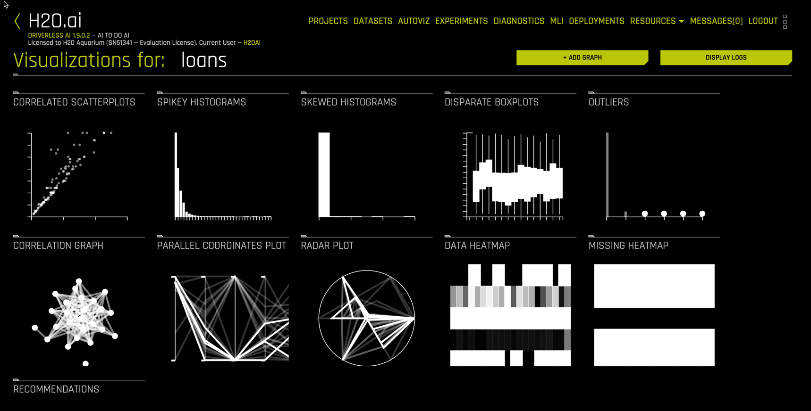

Selecting the `SKEWED HISTOGRAMS` section, for example, yields a series of histograms on only the columns that are sufficiently skewed. We show one below for the `credit_length` column.

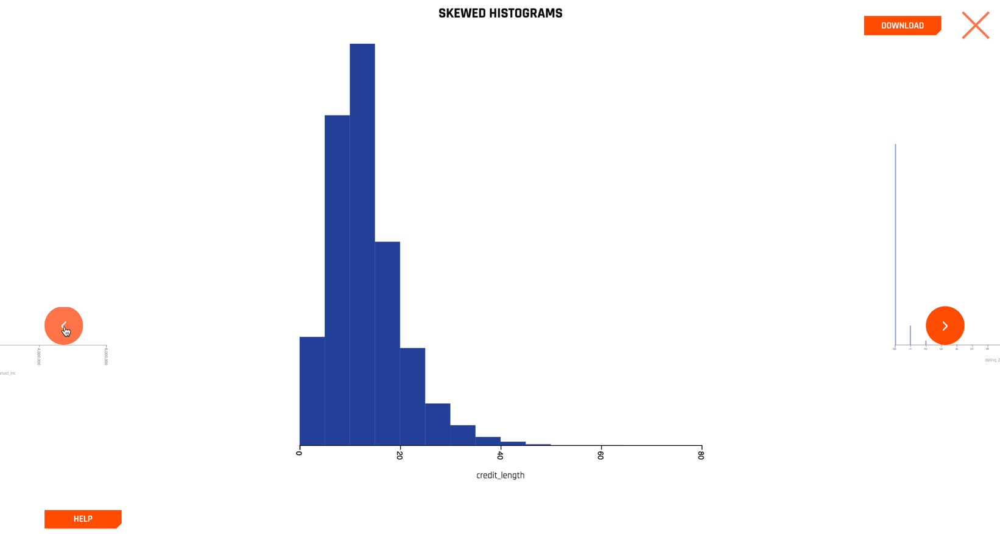

Clicking the left and right navigation arrows allows you to inspect additional variables, ordered by their skewness.

Close the `SKEWED HISTOGRAMS` display and scroll down to see `RECOMMENDATIONS`.

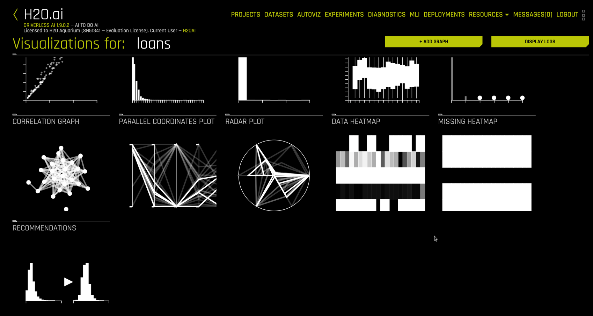

Selecting `RECOMMENDATIONS` produces

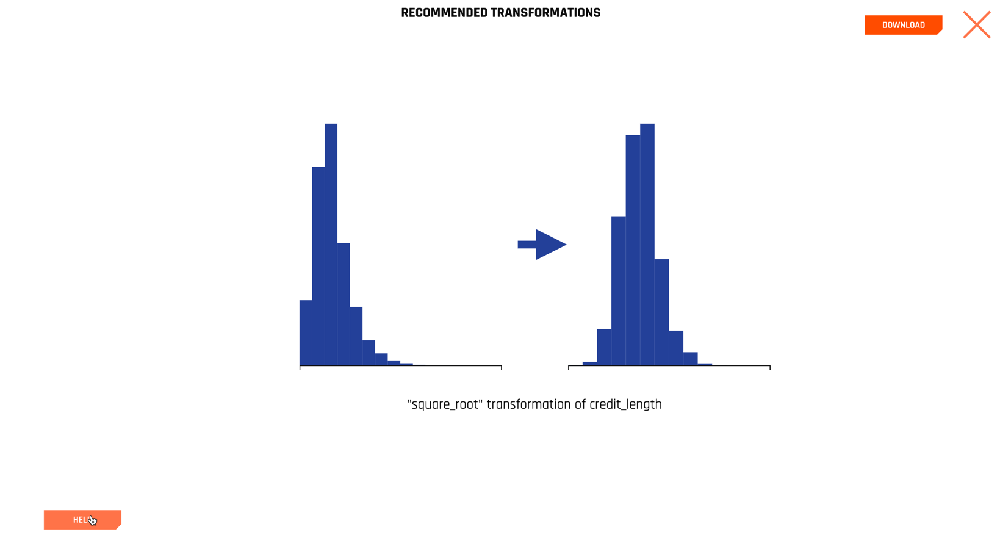

The philosophy underlying automatic visualizations is to make it easy for the data scientist to quickly understand their data fields, but it does not make decisions for the data scientist.

There are a number of additional useful graphs that can be navigated to fully understand your data prior to modeling.

<!-- ------------------------ -->
## Split Data
Duration: 5

Splitting data into train and test sets allows models to be built with the train set and evaluated on the test data. This protects against overfit and yields more accurate error estimates. To use the Dataset Splitter utility, right click the dataset and select `SPLIT`

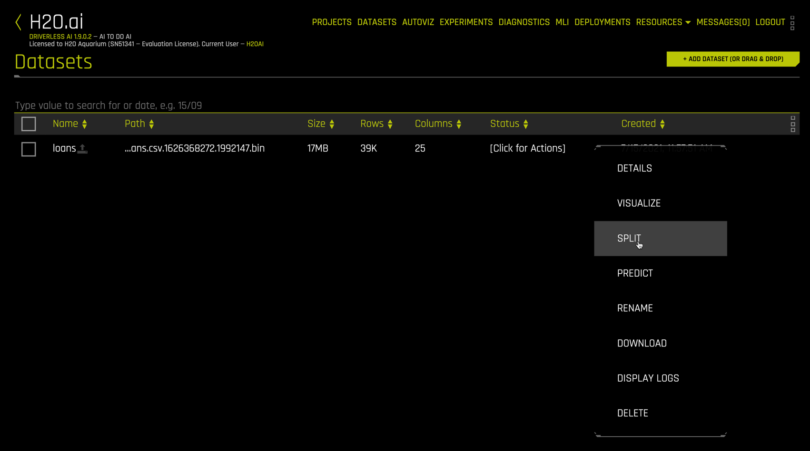

Name your `train` and `test` splits, then select a split ratio (here we use 0.8).


For a time series use case, enter the time column. If your data have predefined folds for k-fold cross validation, enter the fold column. A seed is available for reproducibility. Select the target column `bad_loan`


The data type of the target column determines the splitting algorithm. For classification problems, stratefied random sampling is used. For numeric target columns, simple random sampling is used.

Click `SAVE` to create the datasets.


The `train` dataset has around 31,000 rows and the `test` dataset around 8000 rows.

<!-- ------------------------ -->
## Experiment
Duration: 5

We use the term _Experiment_ in Driverless AI to refer to the entire feature engineering and model evolution process. Instead of fitting one model, we are fitting many and using a "survival of the fittest" approach to optimize features and model hyperparameters. The result is a combination feature engineering-modeling _pipeline_, which can easily be investigated and promoted into production.

### Set up an Experiment

We start an experiment from the `Datasets` view by clicking on the line corresponding to the `train` dataset and selecting `PREDICT` from the dropdown menu

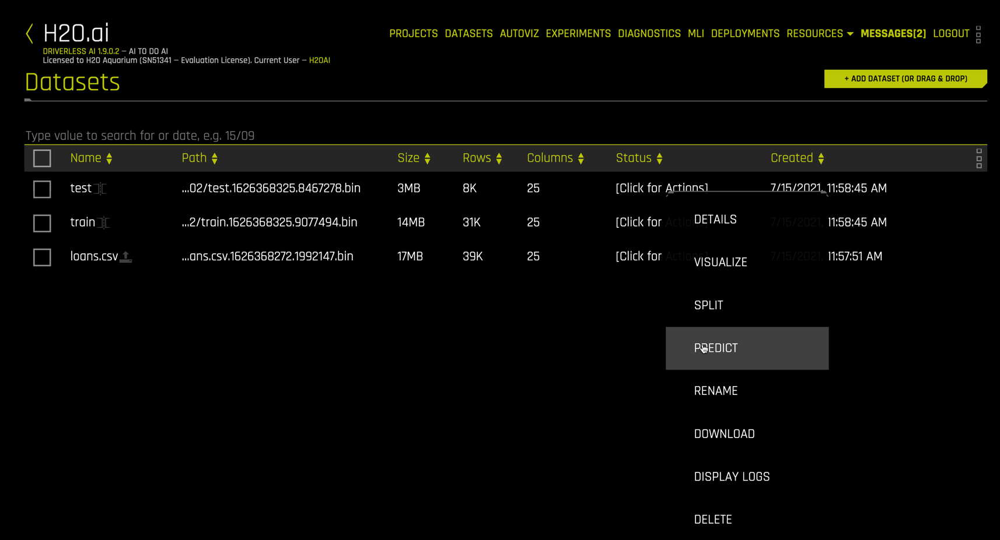

This opens the following form for configuring an experiment.

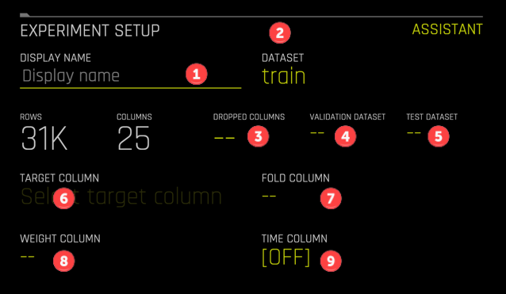

The fields are

1. (Optional) Name your experiment. This is especially helpful for leaderboards in `Projects`.
2. The prefilled training dataset.
3. (Optional) Select columns to drop from modeling.
4. (Optional) Select a validation dataset. Setting this option will enforce a train-validate split throughout the experiment.
5. (Recommended) Select the test dataset. You should **always** have a holdout test dataset to evaluate your model!
6. Select the target column. This option is flashing so you will not miss it.
7. (Optional) Select a column containing fold numbers. This is used where folds for k-fold cross validation have already been defined.
8. (Optional) Select weight column.
9. (Optional) Select a time column. This switches Driverless AI into a time-series mode, where specialized data, feature engineering, and model settings are enabled.

For our experiment, enter "Baseline" as the display name (#1). Next select the `TEST DATASET` file `test` (#5). The `desc` column contains a written explanation from the customer describing the reason for requesting a loan. Although Driverless AI has extensive NLP (natural language processing) capabilities, we omit them in this baseline model. Thus using `DROPPED COLUMNS` (#3), select `desc`:

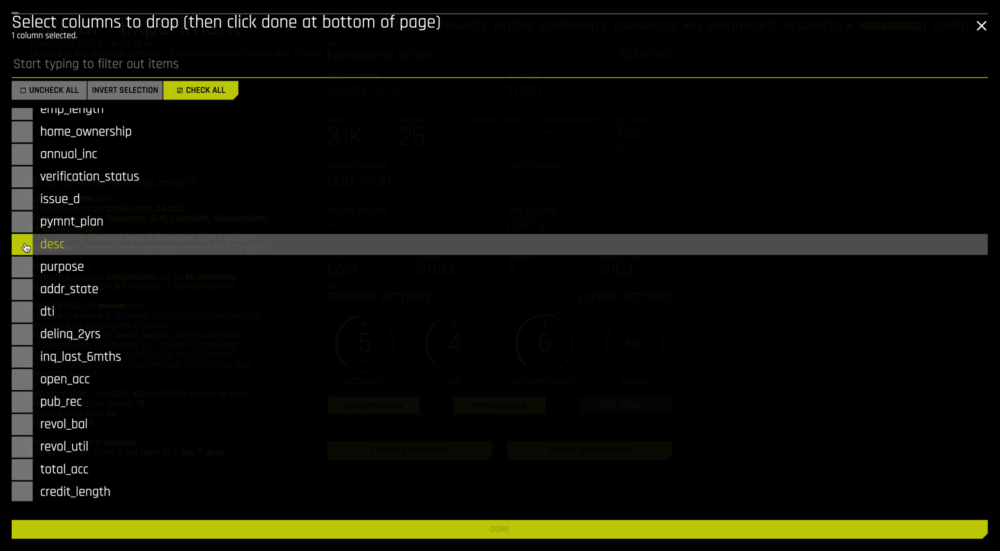

Next select `bad_loan` as the `TARGET COLUMN` (#6). You will have to scroll down, since `bad_loan` is the next-to-last variable in the dataset


After selecting the target variable, Driverless AI analyzes the data and experimental settings and prefills additional options:  

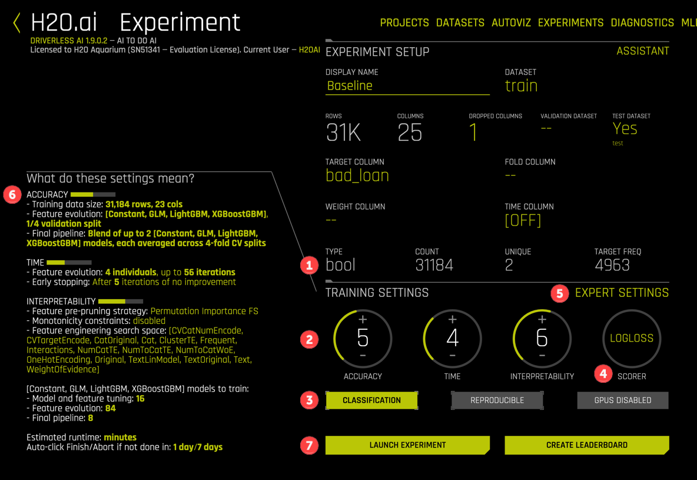

These include

1. Target variable status.
2. The `ACCURACY/TIME/INTERPRETABILITY` dials which range from 1 to 10 and largely determine the recipe for the experiment.
3. The `CLASSIFICATION/REPRODUCIBLE/GPUS DISABLED` clickable buttons.
4. The `SCORER` used in model building and evaluation.
5. `EXPERT SETTINGS` for fine control over a vast number of system, model, feature, recipe, and specialty options.  
6. A detailed settings description.
7. `LAUNCH EXPERIMENT` to run the experiment defined by dial settings, scorer, and expert settings.

For our experiment,

* The target variable is `bool` (Boolean) with 31,184 observations, 4963 of which are equal to 1 (#1). The `CLASSIFICATION` button (#3) is enabled by default because the target is Boolean.
* The `ACCURACY` dial is set to 5. Higher values of accuracy are more computationally intensive. The description under (#6) shows that `ACCURACY` impacts how features are evaluated (model & validation strategy) and what form the final pipeline will take (individual models vs. ensembles and validation strategy).
* The `TIME` dial is set to 4. Higher values of `TIME` allow for longer feature evolution. `TIME` levels also include early stopping rules for efficiency.
* Note: Higher values of `ACCURACY` and `TIME` do not always lead to better predictive models. Model performance should always be evaluated using a holdout test data set.
* The `INTERPRETABILITY` dial ranges from 1 (least interpretable = most complex) to 10 (most interpretable = least complex). `INTERPRETABILITY` set to 7 or higher enable monotonicity constraints, which significantly increases model understanding.


Click on the `REPRODUCIBLE` button to enable reproducibility. This may be important for regulatory reasons or, as in our case, for educational purposes. Also select AUC as the scorer (#4)

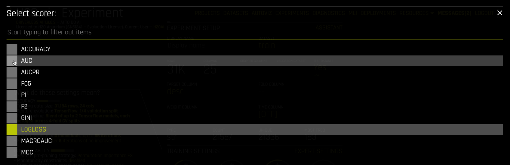

Clicking on `EXPERT SETTINGS` (#5) exposes an immense array of options and settings


This gives the expert data scientist complete control over the Driverless AI experience, including the ability to customize models, feature transformers, scorers, and data using `CUSTOM RECIPES`. Select `CANCEL` to exit out of the expert settings screen.

### Run Experiment

Before launching the experiment, your settings should look like the following.

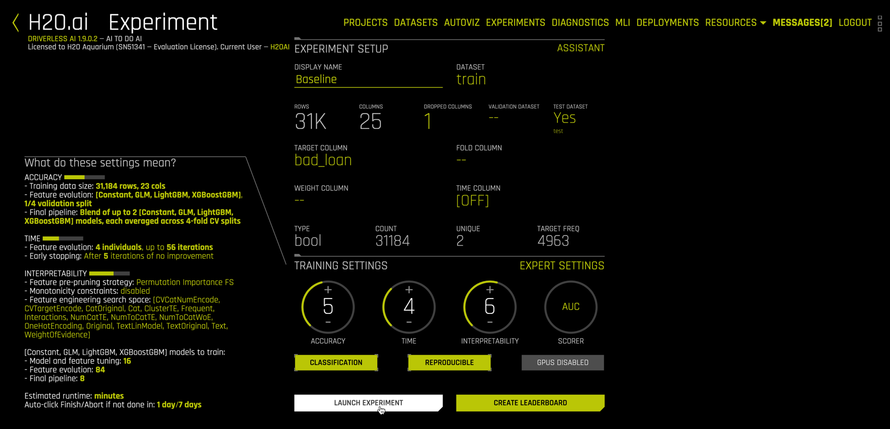

Click `LAUNCH EXPERIMENT` to commence.
The Driverless AI UI now includes a descriptive rotating dial in the center with live monitoring displays for model evolution, variable importance, resource usage, and model evaluation.

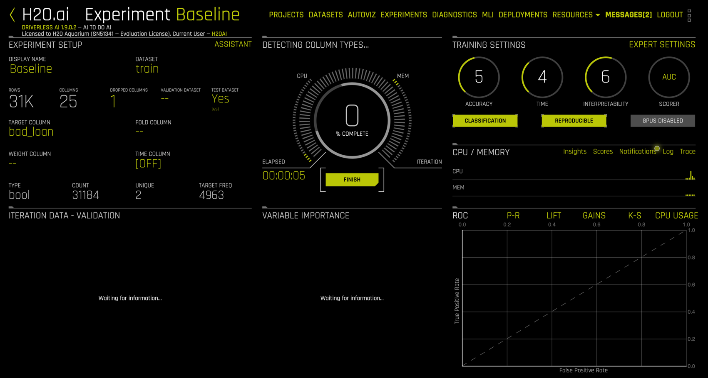

To get more detailed resource monitoring, go to `RESOURCES` in the menu and select `SYSTEM INFO`.


The `System Info` view shows hardware usage and live activity monitoring of individual CPU cores.

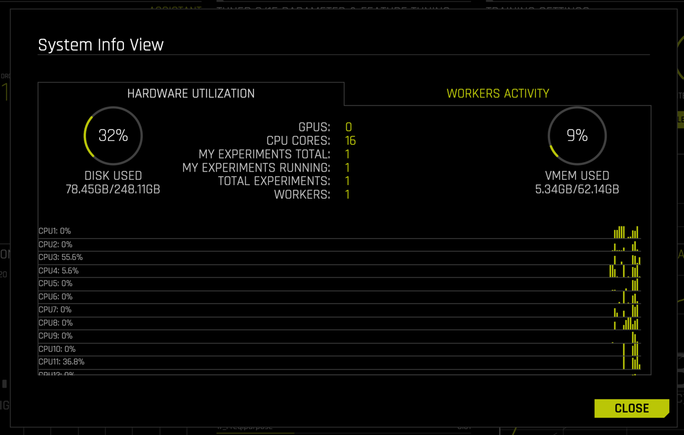

Clicking `CLOSE` sends us back to the running `Experiment Baseline` view.

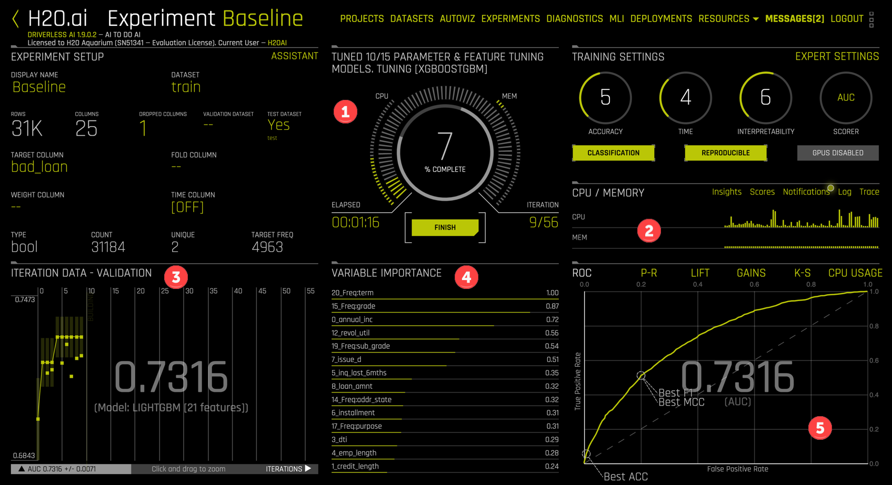

Note that

1. The central dial shows 7% completion after 1:06 with 9/56 planned iterations completed.
2. The CPU and memory usage monitor is a simplified version of the `System Info` view we just closed.
3. Each dot in the `ITERATION` monitor corresponds to an individual model. The last model evaluated is a LightGBM model with 21 features and an AUC of 0.7316. Moving your mouse over any of the model dots will highlight that model and summary information.
4. The `VARIABLE IMPORTANCE` display shows the features of the latest model (or the model selected in the `ITERATION DATA` display) and their relative importance.
5. By default, the ROC curve for the selected model and AUC are displayed, but other displays are available: P-R (Precision Recall), Lift, Gains, and K-S (Kolmogorov-Smirnov).

#### Notifications

Selecting `Notifications` in the `CPU/MEMORY` section (#2) opens important information and discoveries from Driverless AI.

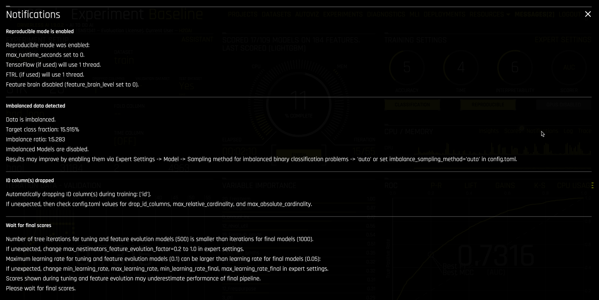

Ours reports that

* Reproducible mode was enabled, along with all of its settings and implications.
* Imbalanced data was detected but imbalanced settings were not enabled. Notifications then indicates the expert settings required to account for imbalance in the data.
* An ID column was identified and automatically dropped from data.
* Additional information on scoring during feature and model tuning.

Notification are important to read and understand. The advice in notifications often leads to better models.

#### Technical logs

The technical data scientist might consider selecting `Log` in the `CPU/MEMORY` section. Driverless AI logs its entire process in great detail. Clicking `Log` opens a system logging window for monitoring live. Logs can be downloaded during or after the experiment.

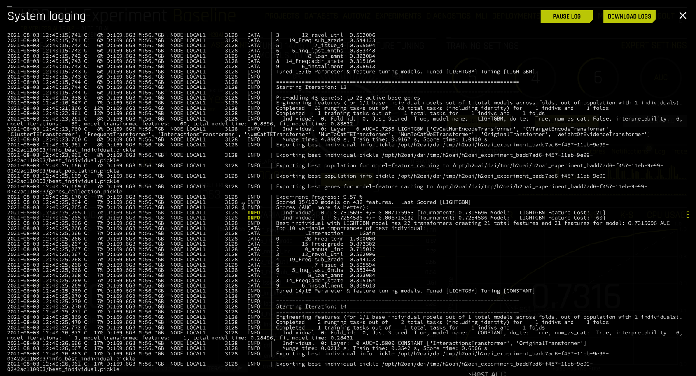

Nearing the conclusion of the experiment

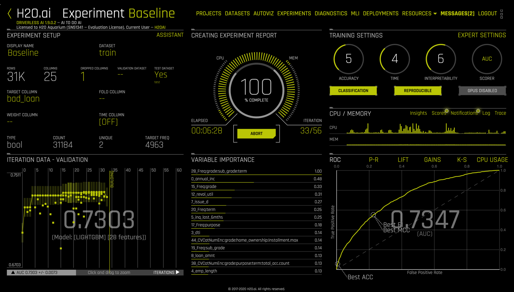

we see that the dial is at 100% complete, the elapsed time is approximately 6:30 (while results are reproducible, times are not themselves exactly reproducible), and the experiment is stopping early, needing only 33 of 56 iterations.

### Completed Experiment

Upon completion, the `Experiment Baseline` view replaces the spinning dial in the center with a stack of clickable bars.


#### Summary

The lower right panel includes an experiment summary, zoomed in below:


The summary contains information about the experiment settings, its seed, the train, validation, and test data, system (hardware) specifications, features created, models created, timing, and scores. In particular, note that

* 230 features were created but only 28 were used,
* feature evolution used 35 models,
* feature tuning used 16 models,
* final pipeline training used an additional 8 models.

Importantly, the MOJO latency timing of 0.13 milliseconds indicates the speed of scoring this model in production.

#### Model Performance

Selecting ROC in the lower right replaces the summary with the ROC curve.

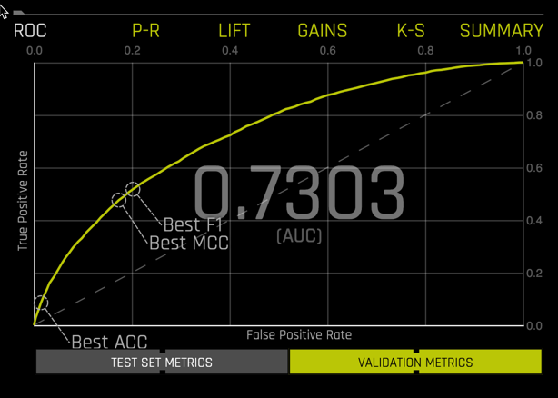

You can toggle between `VALIDATION METRICS` and `TEST SET METRICS` for this display.

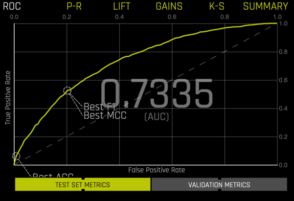

Selecting any point along the curve produces a confusion matrix with additional peformance metrics


You can view other model performance metrics, including Precision-Recall

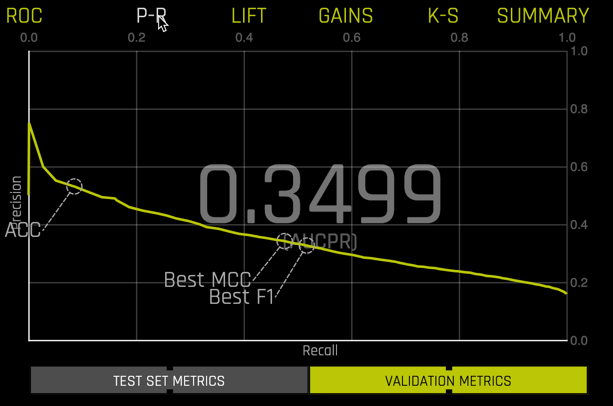

Lift chart

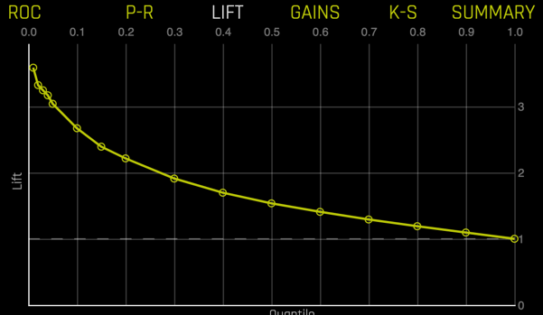

Gains chart


and Kolmogorov-Smirnov

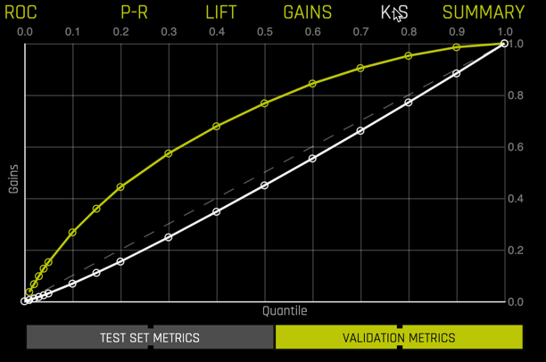

<!-- ------------------------ -->
## Experiment Inspection
Duration: 5

Once an experiment is completed, it is important to understand the final model's predictive performance, its features, parameters, and how the features and model are combined to make a pipeline.

### Diagnostics

The `DIAGNOSE MODEL ON NEW DATASET ...` button is used to create extensive diagnostics for a model built in Driverless AI. After clicking the button,

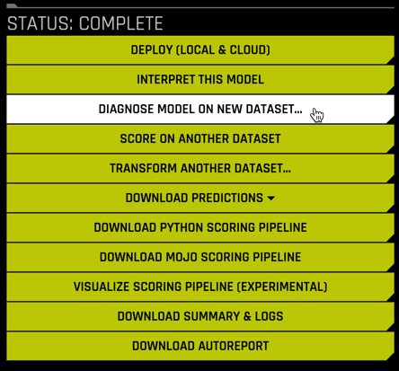

select the dataset used for diagnostics, we will use the `test` dataset.

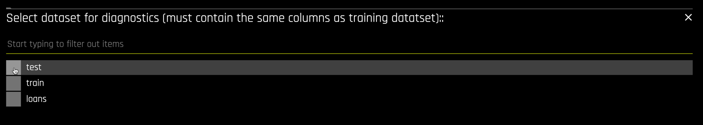

The `Diagnostics` view that is returned is very complete. You can choose from a plethora of `Scores` on the left. Each of the `Metric Plots` on the right is interactive.

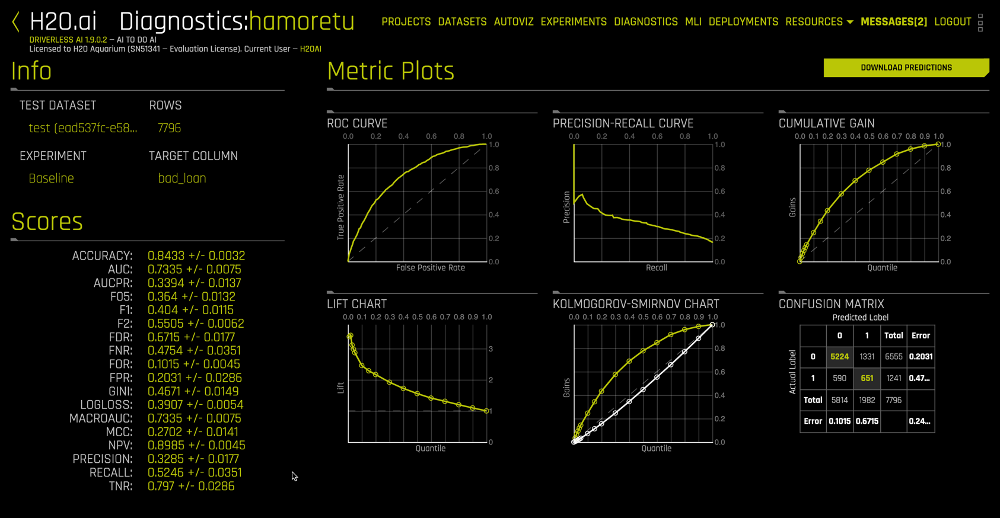

Selecting the confusion matrix plot yields


Likewise, the interactive ROC curve produces

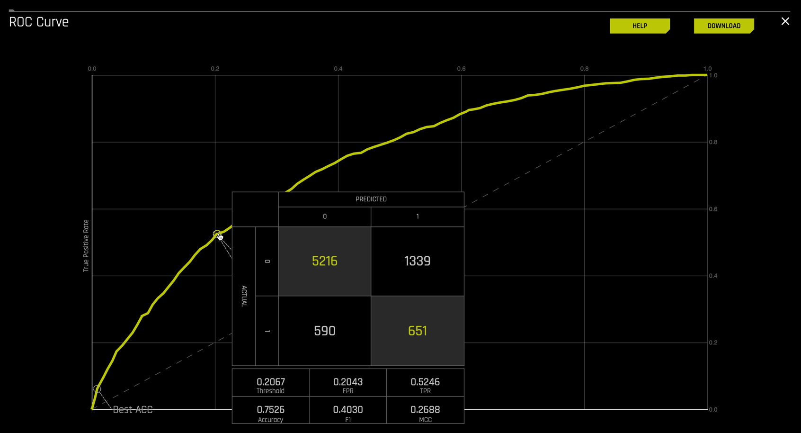

### AutoReport

By default, an automated report is created for each experiment that is run. Download the `AutoReport` by

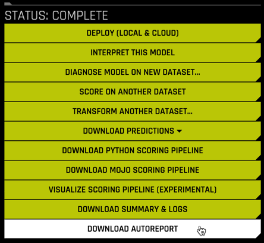

The document that is created is a very thorough summary of the experiment in the form of a white paper, documenting in detail the data, settings, and methodologies used to create the final pipeline.


This includes detailed information on the features that were engineered and the process for engineering them.


It also contains validation and test metrics and plots.


For this particular experiment, the AutoReport is a 36-page technically detailed document.

### Pipeline Visualization

Selecting the `VISUALIZE SCORING PIPELINE` button

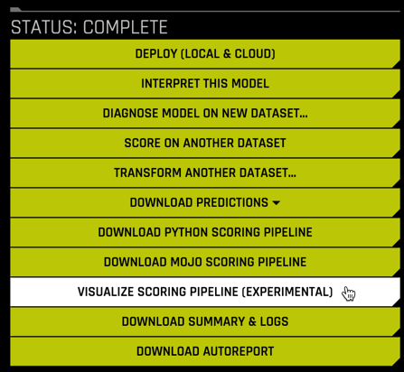

returns a visual representation of the pipeline

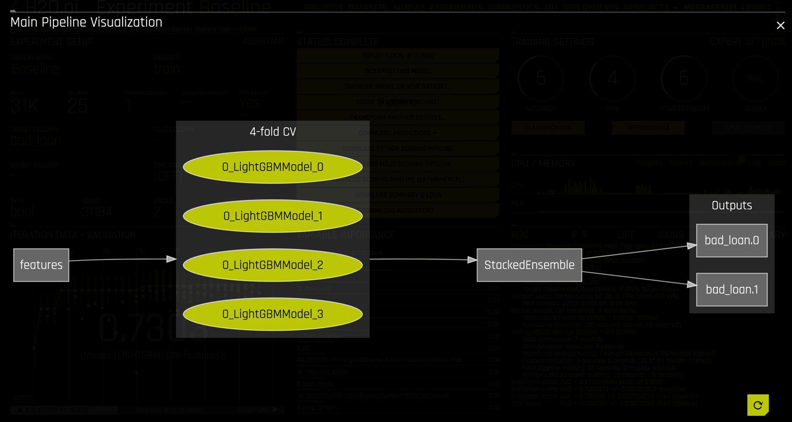

This pipeline is also available in the AutoReport, along with explanatory notes copied below. The pipeline consists of

* 28 total features, both original and engineered.
* Two LightGBM models created with 4-fold cross validation each.
* A stacked ensemble blending the two LightGBM models.
* The outputs are probabilities for `bad_loan = False` and `bad_loan = True`.

<!-- ------------------------ -->
## Machine Learning Interpretability (MLI)
Duration: 5

One of Driverless AI's most important features is the implementation of a host of cutting-edge techniques and methodologies for interpreting and explaining the results of black-box models. In this tutorial, we merely highlight some of the MLI features available in Driverless AI without discussing their theoretical underpinnings.


To launch MLI from a completed experiment, select the `INTERPRET THIS MODEL` button


The MLI view allows easy navigation through the various interactive plots.

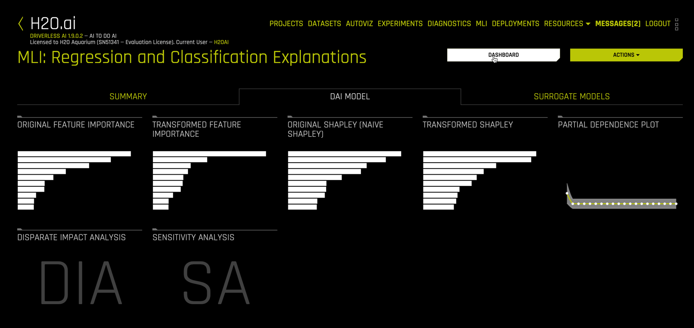

### Dashboard

The `Dashboard` view displays four useful summary plots.

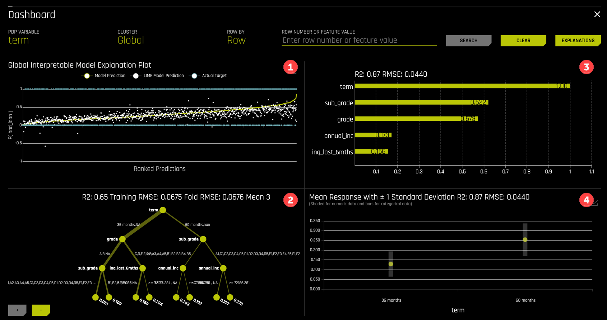

These include

1. A K-LIME (**L**ocal **I**nterpretable **M**odel-agnostic **E**xplanations) surrogate model.
2. A Decision Tree surrogate model.
3. A feature importance plot.
4. A PDP (Partial Dependence Plot).

Each of these plots are available in a larger format from the main MLI view.

### Feature Importance

Other plots include Feature importance on the transformed features


and on the original features

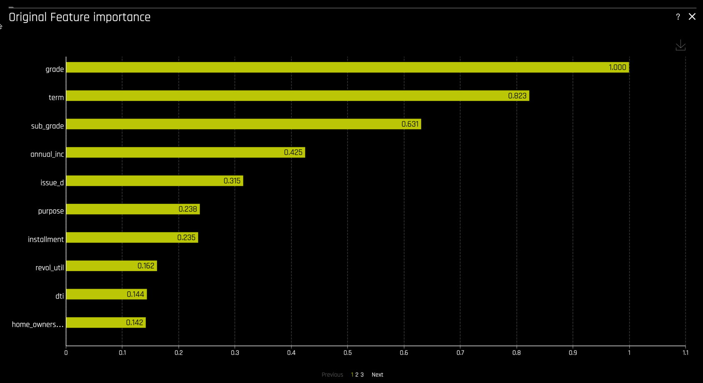

### Shapley

Shapley values are also available for the transformed and original features


### Additional Capabilities

The MLI view provides tools for disparate impact analysis and sensitivity analysis, also called "What If" analysis.


<!-- ------------------------ -->
## Deploy the model using Java UDFs
Duration: 5

### Introduction

The final model from a Driverless AI experiment can be exported as either a **MOJO scoring pipeline** or a **Python scoring pipeline**. The MOJO scoring pipeline comes with a `pipeline.mojo` file that can be deployed in any environment that supports Java or C++. There are a myriad of different deployment scenarios for Real-time, Batch or Stream scoring with the `pipeline.mojo` file. In this tutorial, we deploy the final model as a Snowflake Java UDF.  

### Gather Driverless AI artifacts

We need to collect the following components from Driverless AI:

- `pipeline.mojo`
- `mojo2-runtime.jar`
- `H2oDaiScore.jar`
- A valid Driverless AI license file.

The first two files we will download from Driverless AI directly. Select `DOWNLOAD MOJO SCORING PIPELINE` from the `STATUS: COMPLETE` buttons 

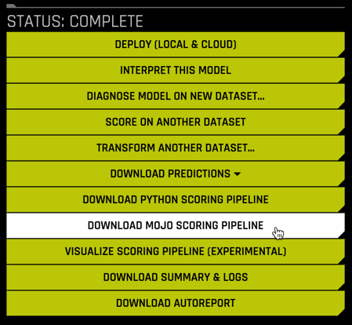

and then `DOWNLOAD MOJO SCORING PIPELINE` again from the `MOJO Scoring Pipeline instructions` screen


This downloads a file `mojo.zip` which contains the `pipeline.mojo` and `mojo2-runtime.jar` files, along with a number of other files we will not be needing.

The next file, `H2oDaiScore`, is a custom scorer developed by H2O.ai to deploy MOJOs using Snowflake Java UDFs. It can be downloaded from H2O here: [https://s3.amazonaws.com/artifacts.h2o.ai/releases/ai/h2o/dai-snowflake-integration/java-udf/download/index.html](https://s3.amazonaws.com/artifacts.h2o.ai/releases/ai/h2o/dai-snowflake-integration/java-udf/download/index.html). Select the latest release (0.0.3 at the time of this writing). Extract the downloaded `H2oScore-0.0.3.tgz` file to find `H2oDaiScore-0.0.3.jar`.

Last, you will need your Driverless AI license file `license.sig`.

### Setup Snowflake

The Snowflake system in this VHOL has already been set up for you. If you were to do it on your own system, follow the instructions found here: [https://docs.snowflake.com/en/user-guide/snowsql-install-config.html](https://docs.snowflake.com/en/user-guide/snowsql-install-config.html).

### Create a Java UDF in Snowflake

Execute a `CREATE FUNCTION` statement and provide:

- a name for the function and its parameters,
- the location in the stage of `pipeline.mojo` and all other artifacts,
- the Java method to be invoked when the Java UDF is called.

For example,

``` sql
CREATE FUNCTION H2OScore_Java(params STRING, rowData ARRAY)

    returns variant language java

    imports = ('@java_udf_stage/h2oScorePackages/pipeline.mojo',
               '@java_udf_stage/h2oScorePackages/license.sig',
               '@java_udf_stage/h2oScorePackages/mojo2-runtime.jar',
               '@java_udf_stage/h2oScorePackages/H2oDaiScore-0.0.3.jar'
               )

    handler = 'h2oScorePackages.H2oDaiScore.h2oDaiScore';
```


### Make predictions using the Java UDF

The syntax for calling a Java UDF in Snowflake is

``` sql
SELECT <JAVA_UDF_FUNCTION_NAME>(<JAVA_UDF_FUNCTION_PARAMS>) FROM <TABLE_NAME>;
```

Using the `H2OScore_Java` UDF defined above, we score a table `loans` using `pipeline.mojo` as follows:

``` sql
SELECT
    ID,
    H2OScore_Java(
        'Modelname=pipeline.mojo',
        ARRAY_CONSTRUCT(loan_amnt, term, installment, grade, sub_grade, emp_length,
                        home_ownership, annual_inc, verification_status, issue_d,
                        purpose, addr_state, dti, inq_last_6mths, open_acc,
                        revol_util, total_acc, credit_length)
    ) AS H2OScore
FROM loans;
```

> Scored 38,980 rows in 7s

The results should look like this

**Results Preview** (first 3 rows)

| Row      | ID | H2OScore |
| ----------- | ----------- | ----------- |
| 1      | 1077501       |0.8469023406505585
| 2   | 1077430        |0.5798575133085251
| 3   | 1077175        |0.5994115248322487


### Easy Deployment using AutoGen

A Snowflake Worksheet template to deploy and score DAI MOJOs using Java UDFs can be automatically generated using the H2O REST Server deployment:

``` sh
curl "<ip>:<port>/autogen?name=<model_name>&notebook=snowflake.udf"
```

For example,

```sh
curl "http://127.0.0.1:8080/autogen?name=pipeline.mojo&notebook=snowflake.udf"
```
