author: Eddy Widjaja
id: harness_the_power_of_snowflake_with_informatica_idmc
summary: This is a guide for getting started with Data Engineering using Informatica Data Management Cloud
categories: Getting Started
environments: web
status: Published 
feedback link: https://github.com/Snowflake-Labs/sfguides/issues
tags: Getting Started, Data Engineering, Data Integration, ETL, ELT, PDO, Informatica

# Harness the Power of Snowflake with Informatica Intelligent Data Management Cloud
<!-- ------------------------ -->
## Overview
Duration: 2

This quickstart will guide you through the steps to use the Informatica Intelligent Cloud Services Accelerator for Snowflake to create an Informatica Intelligent Data Management Cloud (IDMC) organization, which provides free data processing of up to one billion records per month.  You will then learn how to build a data integration mapping and mapping task or data pipeline using Informatica's Data Integration.

The Informatica IDMC provides complete, comprehensive cloud-native and AI-powered data management capabilities, including data catalog, data integration, API and application integration, data prep, data quality, master data management, and a data marketplace, on a foundation of governance and privacy. Informatica IDMC is powered by our AI and machine learning (ML) engine, CLAIRE®, optimized for intelligence and automation, and is built on a modern, elastic, serverless microservices stack that connects data consumers to the data sources they need. It enables you to intelligently discover and understand all the data within and outside the enterprise, access and ingest all types of data wherever and whenever you want, curate and prepare data in a self-service fashion so that it is fit for use, and deliver an authoritative and trusted single view of all your data. Informatica IDMC is the single and most complete platform you will ever need for cloud-native data management.

IDMC Data Integration allows you to load source data from databases, applications, and data files in the cloud or on-premises into Snowflake. Data Integration supports many transformations that can be used to transform and enrich the source data. In addition, pushdown optimization (PDO) can be utilized for some transformations and functions to take advantage of Snowflake compute resources for data processing.

In this lab, you will create a mapping to read two delimited files (Orders and Lineitem) from S3, join the files, perform an aggregation to create a count and total, and write the results into a new table in Snowflake. Then in the mapping task, you will turn on pushdown optimization to enable the processing to occur in Snowflake.

JSON (JavaScript Object Notation) is a text-based data format commonly used between servers and web applications and web-connected devices.  Because it is text-based, it is readable by both humans and machines.  JSON semi-structured data can be stored in Snowflake variant column alongside relational data.  In IDMC, the hierarchy parser transformation parses and transforms hierarchy data to relational data.

In this lab, you will also use sample weather forecast data to create a hierarchical schema, then use it in a mapping to parse and transform the JSON weather forecast data, join them, add an expression to convert the temperature, and then write the data to a new table.

### Prerequisites
- Familiarity with Snowflake
- Familiarity with data integration (ETL) concepts
- Familiarity with AWS S3
- Familiarity with hiearchical data

### What You'll Learn
By the end of this guide, you'll learn:
- How to create an IDMC organization from Snowflake Partner Connect
- How to view the Snowflake connection configuration in IDMC
- How to configure an S3 connection.
- How to build a data integration mapping to read S3 files and load into Snowflake.
- How to turn on Pushdown Optimization (PDO) or ELT in a mapping task to use Snowflake's warehouse to process the data integration mapping.
- How to verify PDO is successfully enabled.
- How to configure a hierarchical schema
- How to build a data integration mapping to flatten JSON data into relational data
- All of the above without writing a single line of code.

### What You’ll Need 
- A Snowflake account with access to the ACCOUNTADMIN role
- An email address for IDMC registration
- Configured Snowflake connection in IDMC org if your org will not be registered from Partner Connect.  [Documentation on how to create a Snowflake connection](https://docs.informatica.com/integration-cloud/cloud-data-integration-connectors/current-version/snowflake-cloud-data-warehouse-v2-connector/snowflake-cloud-data-warehouse-v2-connections/snowflake-cloud-data-warehouse-v2-connection-properties/standard-authentication.html)
- AWS S3 bucket access and credential

### What You’ll Build
- An Informatica Data Management Cloud organization
- An S3 connection
- A data integration mapping to load S3 files into Snowflake
- A mapping task to use PDO for processing the data integration mapping
- A hierarchical schema
- A data integration mapping to parse JSON weather data and flatten it.

<!-- ------------------------ -->

## Prepare Your Lab Environment

Duration: 5

If you haven’t already, register for a [Snowflake free 30-day trial](https://trial.snowflake.com).  You can also use an existing Snowflake account **as long as you have ACCOUNTADMIN access in that account**.

Please select a region which is physically closest to you, and select the Enterprise edition so you can leverage some advanced capabilities that are not available in the Standard Edition.  

After registering, you will receive an email with an activation link and your Snowflake account URL. Bookmark this URL for easy, future access. After activation, you will create a user name and password. Write down these credentials.

Resize your browser window, so that you can view this guide and your web browser side-by-side and follow the lab instructions. If possible, use a secondary display dedicated to the lab guide.

<!-- ------------------------ -->
## Create the IDMC Organization
Duration: 3

### Step 1 
1. Login to **Snowflake Snowsight**.
2. Switch role to **ACCOUNTADMIN**.
3. Click **Admin > Partner Connect**.
4. Search for **Informatica**.
5. Click **Informatica** tile.
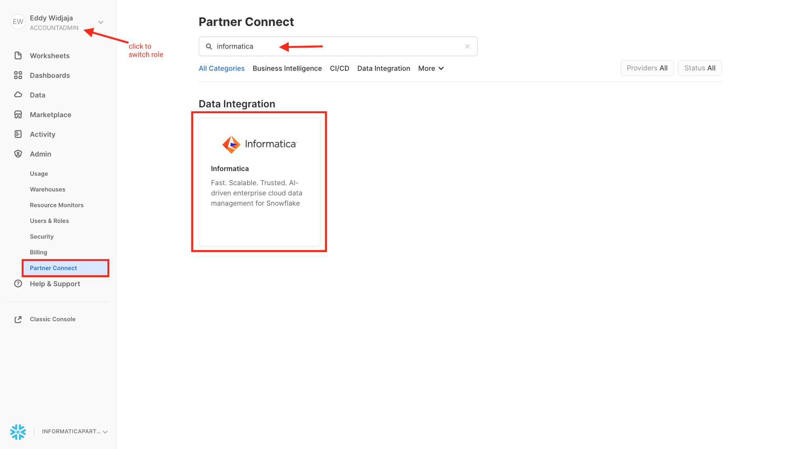

### Step 2
1. Note the objects that will be created in Snowflake.
2. Click **Connect**.<BR>


### Step 3
1. Click **Activate**.<BR>
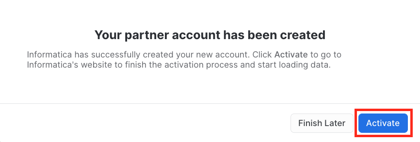

### Step 4
1. Fill in the Informatica registration form.
2. Select a **Data Center** in your region.
3. Click **Submit**.<BR>
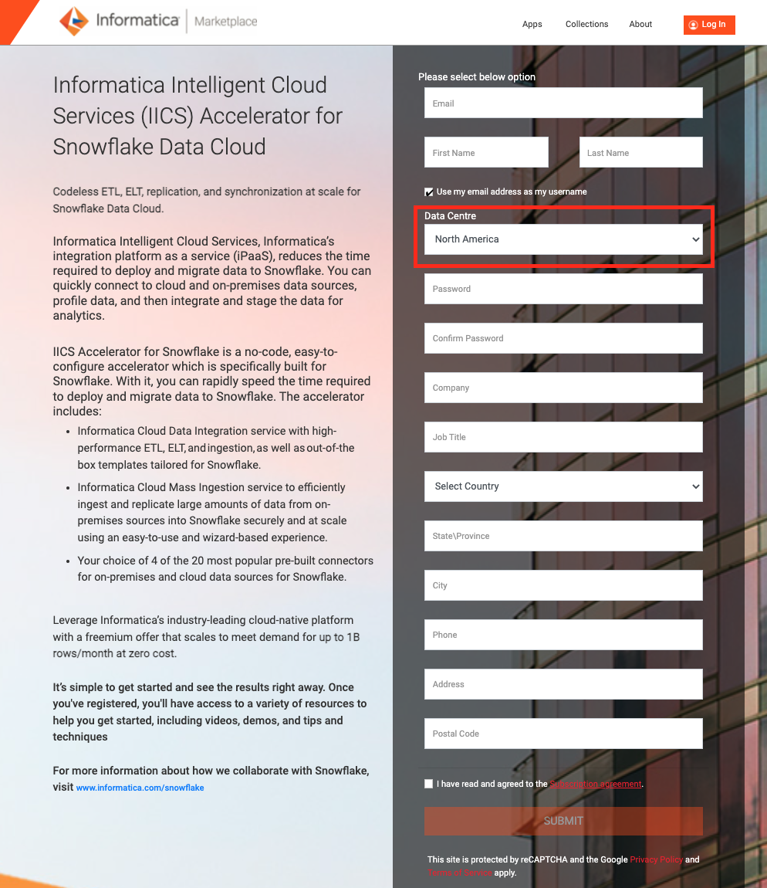

4. Upon successful registration, you will receive an email with the subject line: **Thanks for signing up for the Informatica Intelligent Cloud Services Accelerator for Snowflake**.


### Step 5
1. This [page](https://marketplace.informatica.com/thank-you/snowflake.html) will automatically open up in your browser.  Bookmark this page for future reference. Please also read through Knowledge Base materials and demo recording for more information.
2. Click the **region** you selected in step 4 to go to the **Login** page.


### Step 6
1. Enter your **username** and **password**.
2. Click **Log In**.<BR>
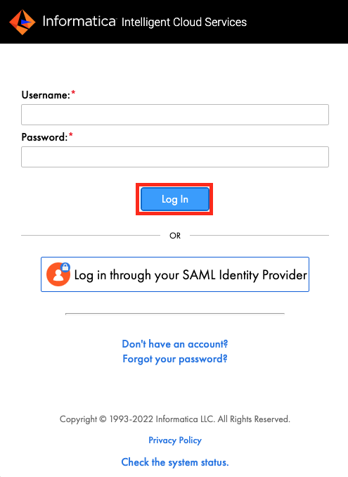

### Step 7
1. The first time logging in, you will be prompted to enter a security **question** and **answer**.  Fill them in.
2. Click **Log In**.<BR>
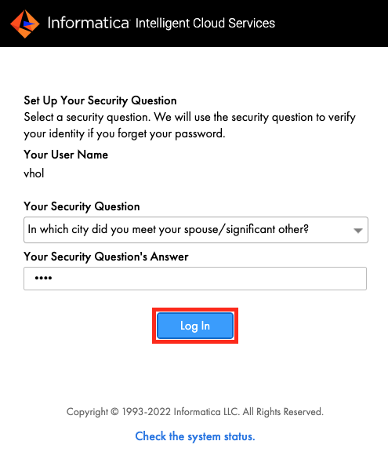

3. The Sample Use-Cases walkthrough page shows up.  Click "Don't show this again".


4. To re-visit the Sample Use-Cases walkthrough page, click **?** at the top right and choose **Walkthroughs**.  Feel free to go through the sample use-cases walkthrough at your convenience.
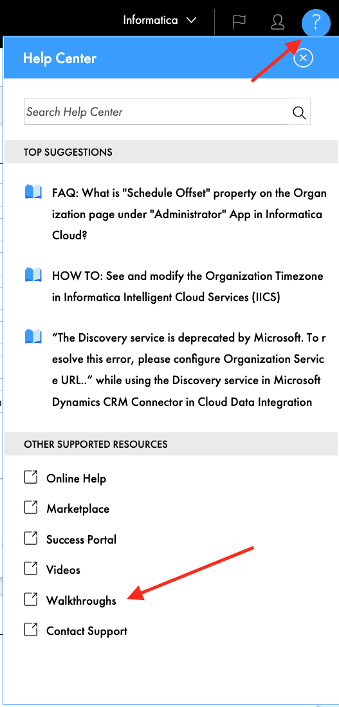

5. In the next section, we will look at the Snowflake connection that was created by the registration process.

<!-- ------------------------ -->
## Review the Snowflake Connection
Duration: 2

The Snowflake connection is automatically configured in the IDMC organization when you create the organization through Snowflake Partner Connect.  Let's take a look at the connection.

### Step 1
1. Click **Administrator** in the service selector page.
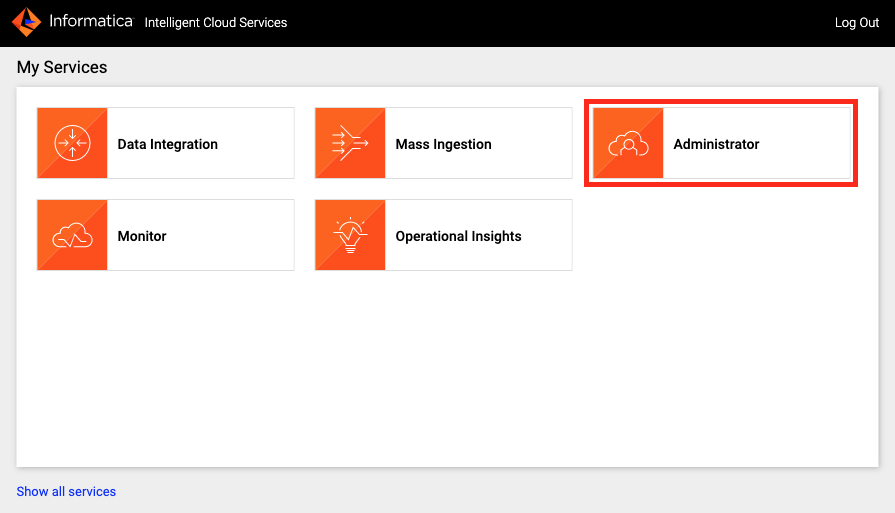

2. Click **Connections** on the left panel.
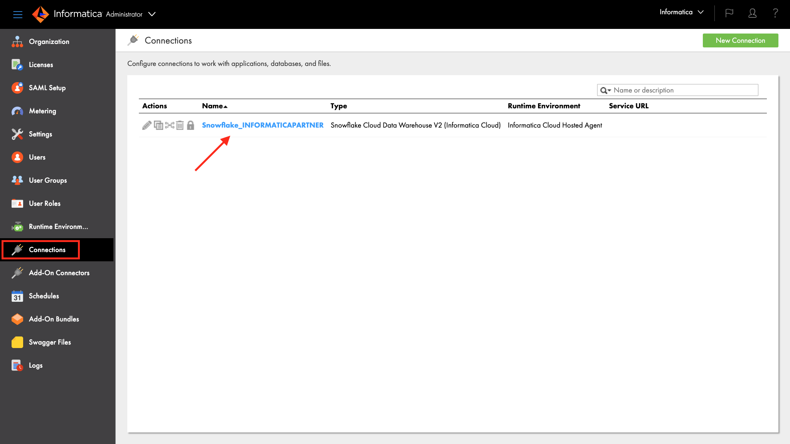

3. Click the Snowflake connection that was created by the registration process.  Your connection name will have Snowflake followed by your Snowflake account name.

4. Following is a screenshot of a Snowflake connection.  Note the properties i.e. Snowflake objects under the **Connection Section**.
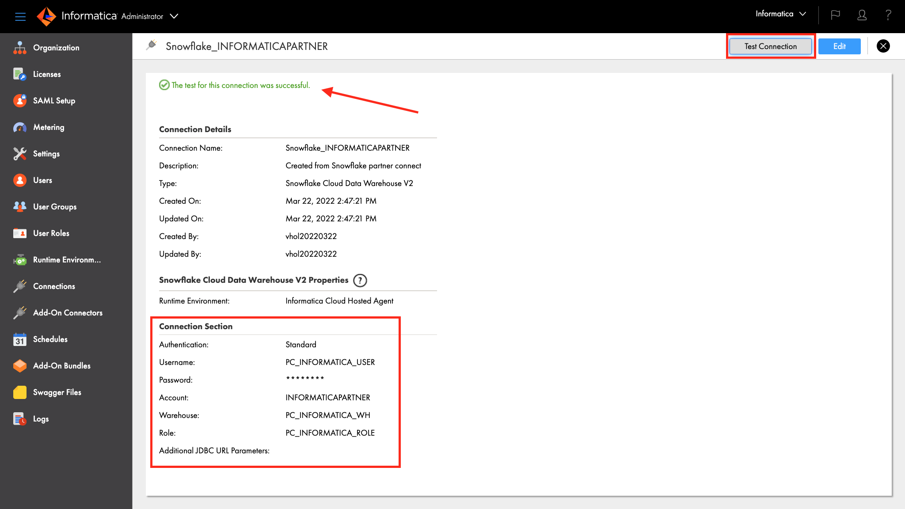

5. Click **Test Connection** button and you should see a successful test notification.

6. In the next section, we will review the Snowflake objects that were created by Partner Connect.

<!-- ------------------------ -->
## Review the Snowflake Objects
Duration: 2

As described in Step 2 of **Create IDMC Organization** section, a set of Snowflake objects were created.  Those objects are Database, Warehouse, System User, and System Role.

Let's take a look at those objects.

### Step 1
1. Go to **Worksheets** in Snowflake and perform the following queries.

### Step 2
1. Run the following query to show the database object.
```SQL 
show databases like 'PC_INF%';
```
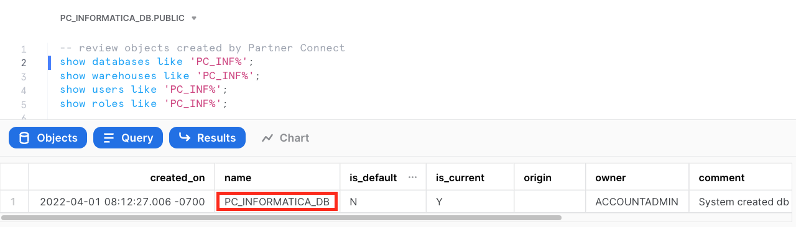

2. Run the following query to show the warehouse object.
```SQL
show warehouses like 'PC_INF%';
```
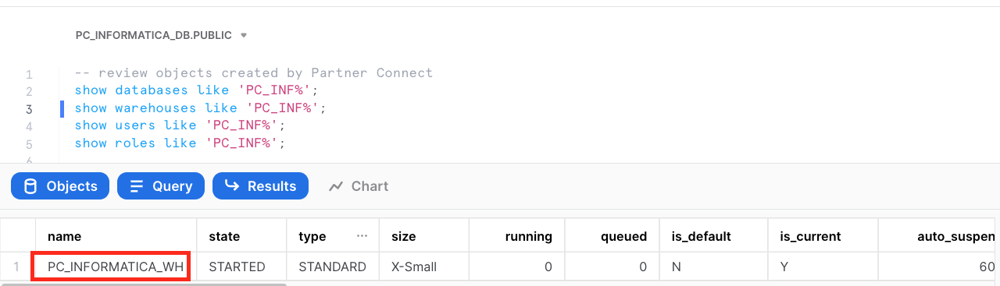

3. Run the following query to show the user object.
```SQL
show users like 'PC_INF%';
```
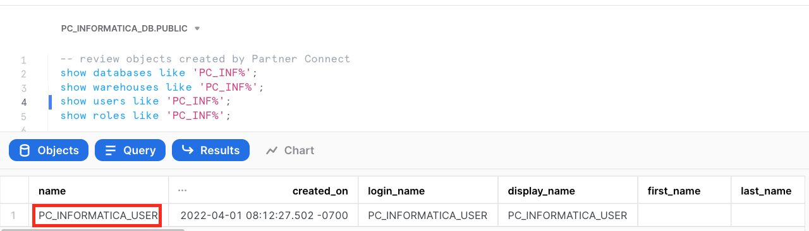

4. Run the following query to show the role object.
```SQL
show roles like 'PC_INF%';
```
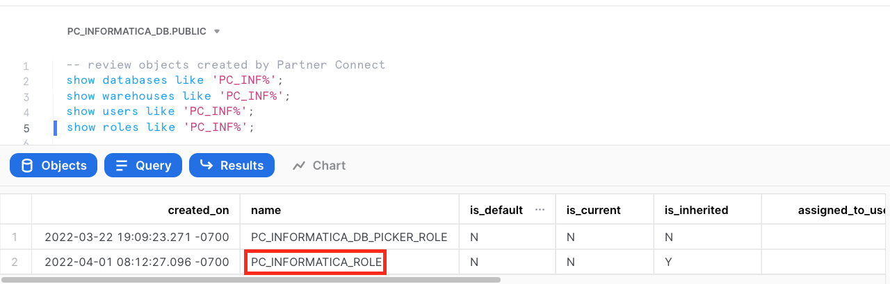

5. Now we're ready to start building our data integration pipeline.

<!-- ------------------------ -->
## Configure an AWS S3 connection
Duration: 5

An AWS S3 connection is required to access and read an AWS S3 bucket.  Follow configuration steps below to create the S3 connection.

Note that the S3 connection requires that the S3 objects be encrypted.  If you are doing this lab live, you will be given an Access Key and Secret Key to use.  Alternatively, you can download the files at the end of this page and load them to your own S3 bucket.

### Step 1
1. Login to **IDMC**.
2. Click **Administrator** in the service selector page.


### Step 2
1. Click **Connections** on the left panel.
2. Click **New Connection** button to create a new connection.


### Step 3
1.	Enter **S3** in the Connection Name field.
2.	Select **Amazon S3 v2** from the Type dropdown field.
3.	Select **Informatica Cloud Hosted Agent** from the Runtime Environment dropdown field.  
4.	Enter your access key in the Access Key field.
5.	Enter your secret key in the Secret Key field.
6.	Enter S3 bucket name in the Folder Path field.
7.	Select your bucket's region from the Region Name dropdown field.
8.	Click **Test Connection** button.  If the configuration is correct, the page should display **“The test for this connection was successful.”** 
9.	Click **Save** button.
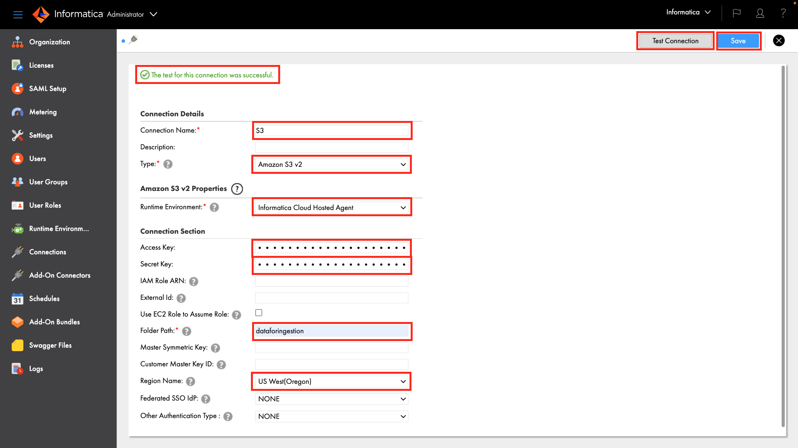
Reference: [AWS S3 V2 Connector Documentation](https://docs.informatica.com/integration-cloud/cloud-data-integration-connectors/current-version/amazon-s3-v2-connector/amazon-s3-v2-connections/amazon-s3-v2-connection-properties.html)

10. You should have an AWS S3 and Snowflake connections configured.
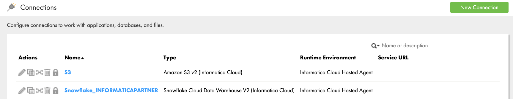

### Step 4 (Alternative method for using your own S3 bucket)
1. Click to download the following files.<br>
  <button>
  [orders.tbl](https://sfquickstarts.s3.us-west-1.amazonaws.com/VHOL+Informatica+Data+Management/orders.tbl)
  </button>
  <button>
  [lineitem.tbl](https://sfquickstarts.s3.us-west-1.amazonaws.com/VHOL+Informatica+Data+Management/lineitem.tbl)
  </button>
2. Upload those two files into your S3 bucket.  Make sure to the files are protected with an access key and secret key.  IDMC requires those keys in the S3 connection.
3. Follow the steps above to create the S3 connection using your own S3 credentials.

## Create a Project Folder
Duration: 2

### Step 1
1. Click the Service Selector at the top left, then select **Data Integration** service.


### Step 2
Let's create a project to store our mapping or assets.
1. Click **Explore** on the left panel.
2. Click **New Project** to create a new project.
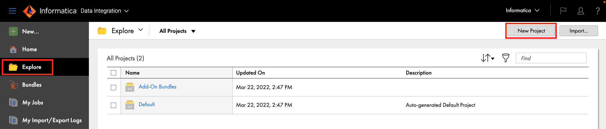
3. Enter **Hands-on Lab** in the Name field.
4. Click **Save**.<BR>
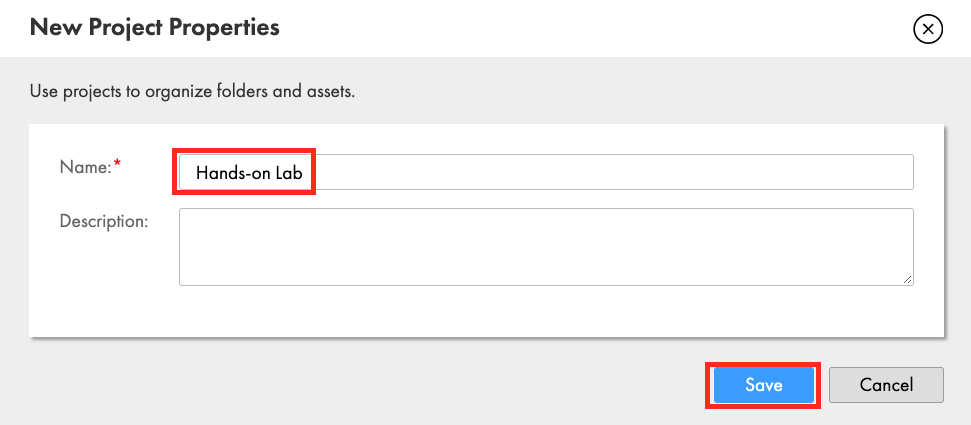
5. Click **Hands-on Lab** project.
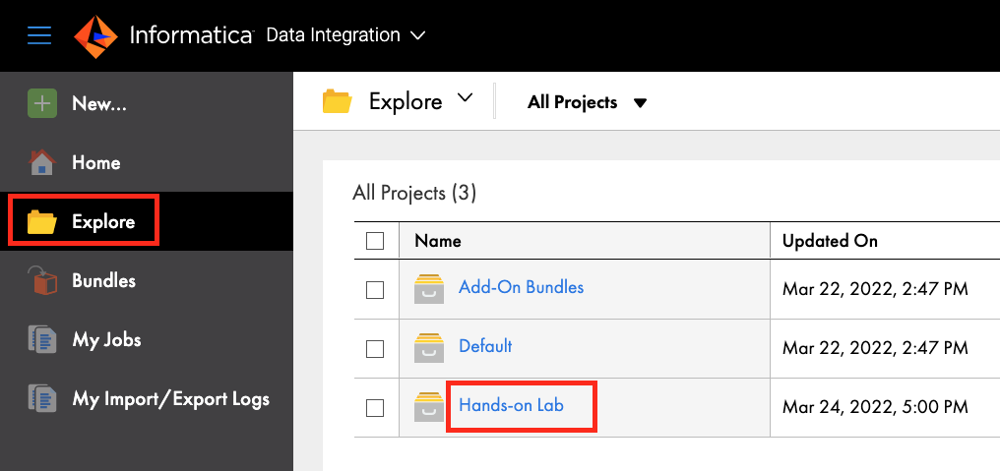

## Load Data from AWS S3 into Snowflake using Pushdown Optimization (ELT)
Duration: 15

IDMC Data Integration allows you to load source data from databases, applications, and data files in the cloud or on-premises into Snowflake.  Data Integration supports many transformations that can be used to transform and enrich the source data.  In addition, pushdown optimization (PDO) can be utilized for some transformations and functions to take advantage of Snowflake compute resources for data processing.

In this lab, you will create a mapping to read two delimited files (Orders and Lineitem) from S3, join the files, perform an aggregation to create a count and total, and write the results into a new table in Snowflake.  Then in the mapping task, you will turn on pushdown optimization to enable the processing to occur in Snowflake.

### Step 1
Create a new mapping
1. Click **New...**
2. Click **Mappings**
3. Select **Mapping**
4. Click **Create** <BR>

5. Under properties, enter **m_S3_Orders_Lineitem_into_Snowflake** in Name field.
6. Ensure that Location is **Hands-on Lab**. If not, click **Browse** and select it.
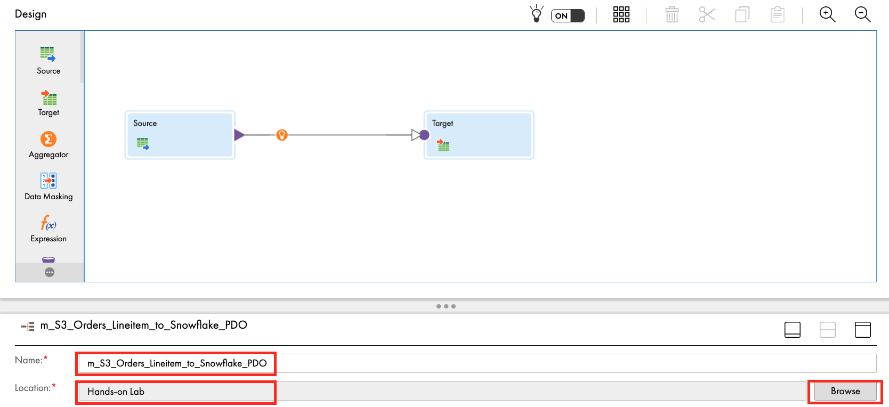

### Step 2
Let's configure the Orders data source from S3.
1.	Click the **Source** transform in the mapping canvas to assign its properties.
2.	In the General tab, enter **src_S3_Orders** in the Name field.<BR>
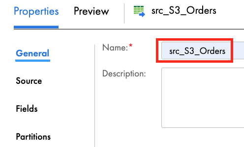
3.	In the Source tab, select **S3** in the Connection dropdown field.
4.	Click **Select** to select a source file.
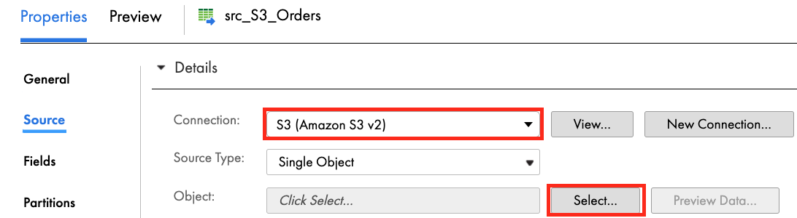
5.	Click on **dataforingestion** S3 bucket.
6.	From the results on the right, select **orders.tbl** file.
7.	Click **OK**. <BR>
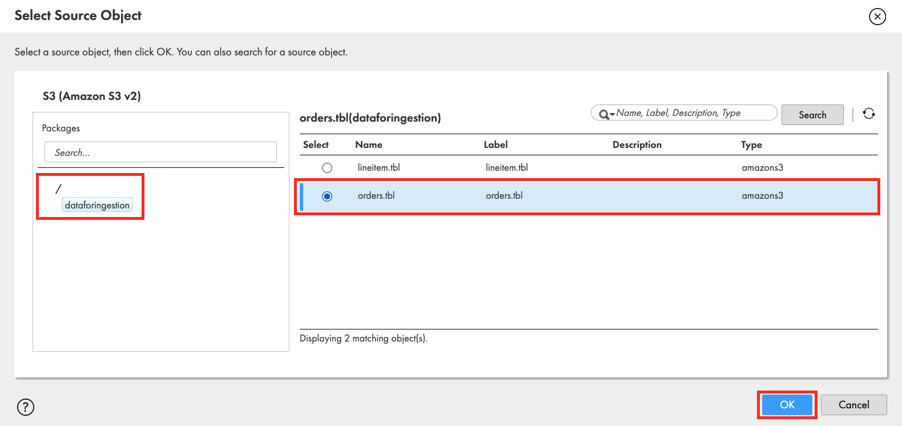
8.	Click Format dropdown field and select **Flat**.
9.	Click **Formatting Options**.

10.	Enter a **vertical bar** character in the delimiter field.
11.	Click **Data Preview** to view the first 10 records.  
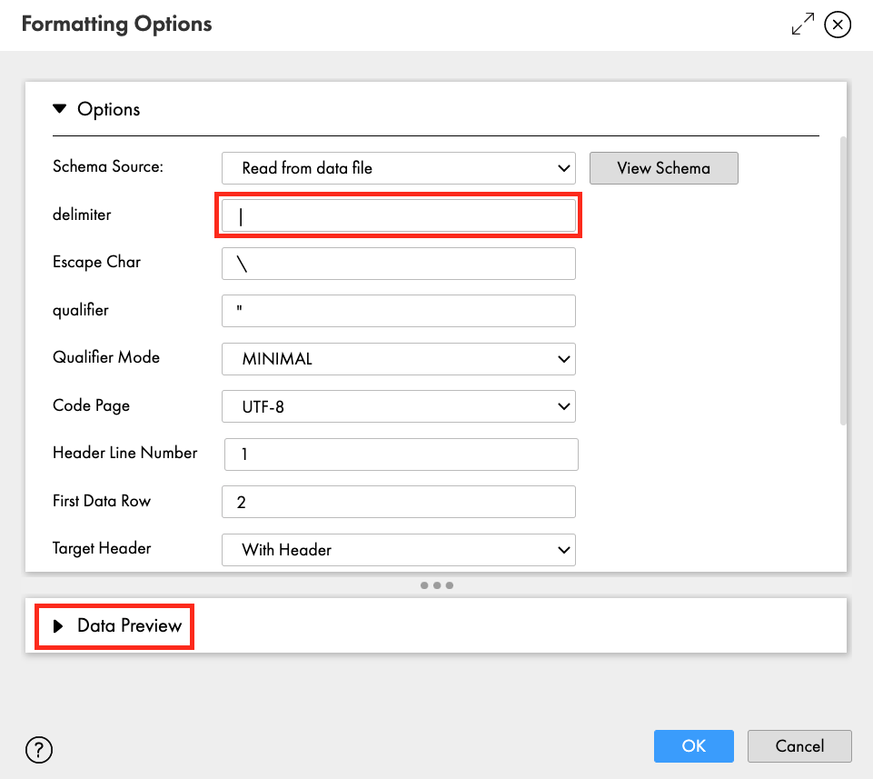
12.	Records should be separated by fields.
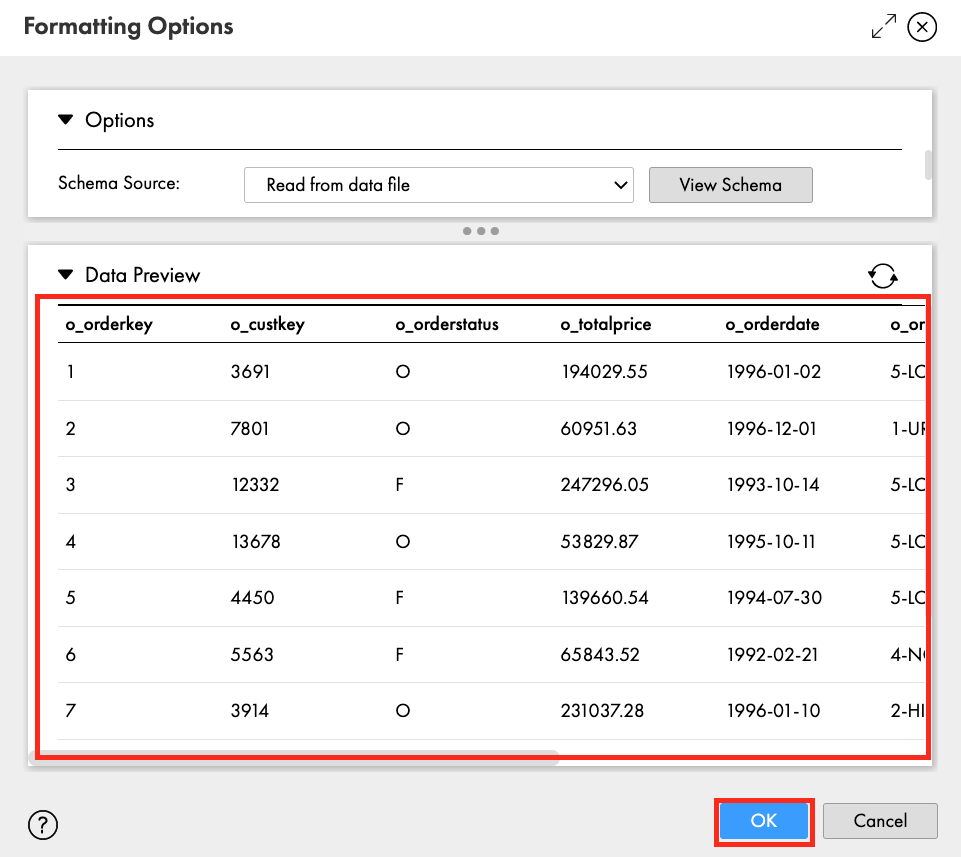
13.	Click **OK**.
14.	In the Fields tab, select fields **7**, **8**, and **9**.  Then click **trash icon** to remove those fields.  
15.	Click **Yes** when prompted.
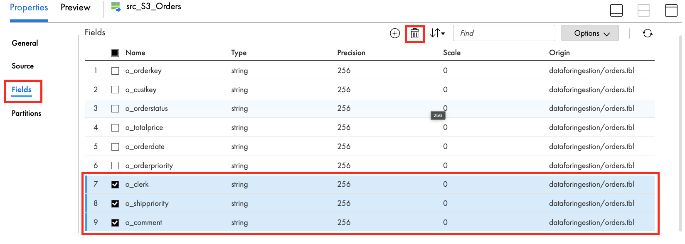
16.	Let’s edit the **o_totalprice** metadata so that it is a decimal field.
17.	Click **Options** dropdown, select **Edit Metadata**.
18.	Click flat_string Native Type field for o_totalprice and select **flat_number**.
19.	Change the Type to **decimal**.
20.	Change the Native Precision and Precision to **38**.
21.	Change the Native Scale and Scale to **2**.<br>
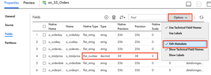
22.	Click **Save** to save work in progress.

### Step 3
Now we will add the Lineitem file as another data source.  The steps are the same as the above Orders data source.

1.	From the transformation palette, drag **Source** transform and drop in the mapping canvas.
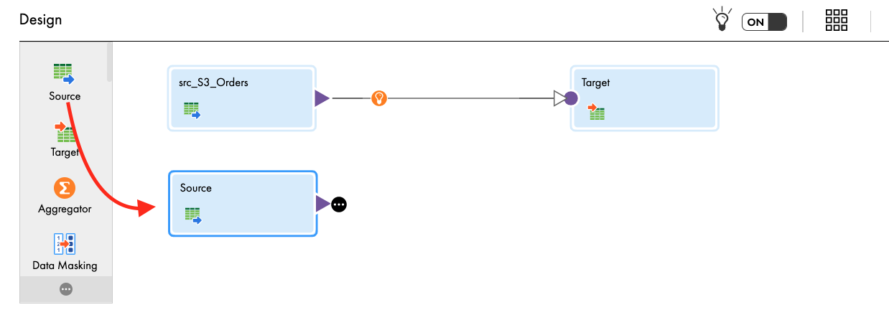
2.	Let’s assign its properties.
3.	In the General tab, enter **src_S3_Lineitem** in the Name field.
4.	In the Source tab, select **S3** in the Connection dropdown field.
5.	Click **Select** to select a source file.
6.	Click on **dataforingestion** S3 bucket.
7.	From the results on the right, select **lineitem.tbl** file.
8.	Click **OK**.
9.	Click Format dropdown field and select **Flat**.
10.	Click **Formatting Options**.
11.	Enter a **vertical bar** character in the delimiter field.
12.	Click **Data Preview** to view the first 10 records.
13.	Records should be separated by fields.
14.	Click **OK**.
15.	In the Fields tab, remove all fields except **l_orderkey**, **l_extendedprice**, **l_discount**, **l_tax**.
16. Click **Yes**. <BR>
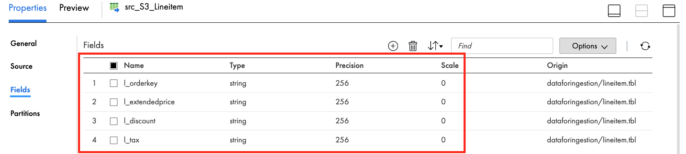
17.	Click **Save** to save work in progress.

### Step 4
Let’s join the two data sources.

1.	From the transformation palette, drag the **Joiner** transform and drop it over the line between the src_S3_Orders source and target transforms.  The Joiner should now be linked to the Orders and target.  If not, manually link them.
2.	Click align icon to align transformations in the mapping canvas.
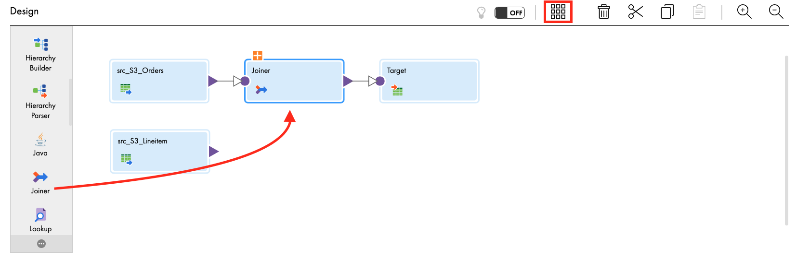
3.	Click the plus icon above the Joiner to expand.  
4.	Link **src_S3_Lineitem** to the Detail of Joiner transform.
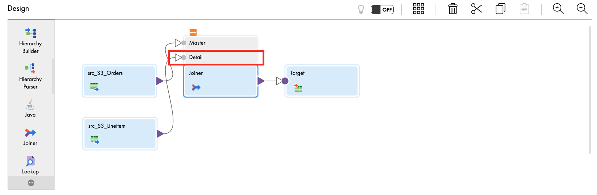
5.	Let’s assign the Joiner properties.
6.	In the General tab, enter **jnr_orders_lineitem** in the Name field.
7.	In the Join Condition tab, click the plus icon to add a new condition.
8.	Select **o_orderkey** for Master and **l_orderkey** for Detail.
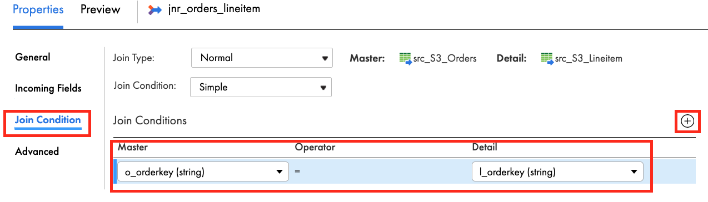
9.	In the Advanced tab, check the **Sorted Input** checkbox.
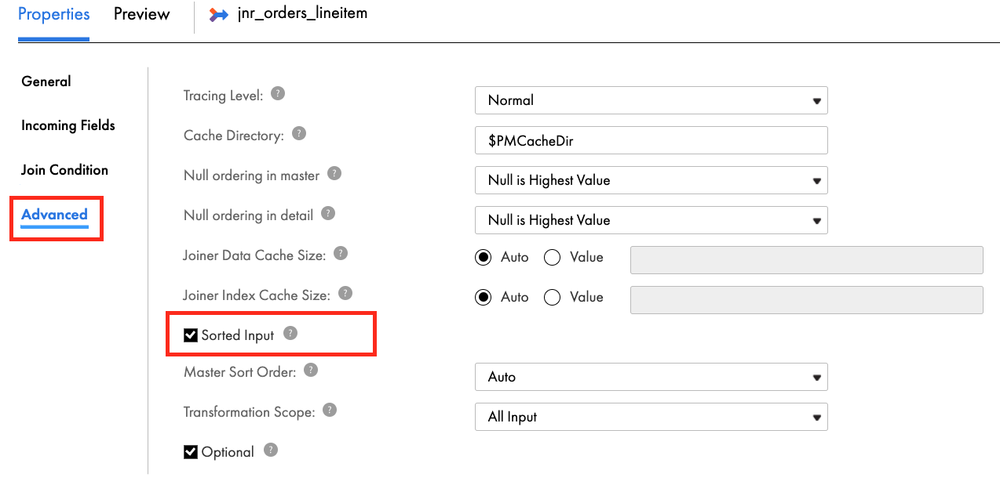
10.	Click **Save** to save work in progress.

### Step 5
Now we will add an Aggregator transformation in the mapping to calculate the number of items for an order and the total of all items.

1.	From the transformation palette, select **Aggregator** transformation, drag and drop between the exp_itemtotal and Target in mapping canvas window.
2.	Click align icon to align transformations in the mapping canvas.
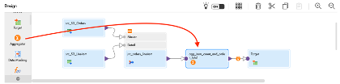
3.	Let’s assign the properties.
4.	In the General tab, enter **agg_item_count_and_order_total** in the Name field.
5.	In the Group By tab, click the plus icon to add new fields.
6.	Add the following fields:
<br>	**o_orderkey**
<br>	**o_custkey**
<br>	**o_orderstatus**
<br>	**o_totalprice**
<br>	**o_orderdate**
<br>	**o_orderpriority**
7.	When completed, the Group By tab properties should look like this:
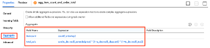
8.	In the Aggregate tab, click the plus icon   to add a new field.
9.	Enter **itemcount** in the Name field.
10.	Select **integer** in the Type dropdown field.
11.	Enter **10** in the Precision field.
12.	Enter **0** in the Scale field.
13.	Click **OK**.
14.	Click **Configure** to configure the expression.
15.	Enter **count(l_orderkey)** in the Expression field.  This function will result in the total number of items in an order.
16.	Click **Validate**.
17.	Click **OK**.
18.	Click the plus icon to add another new field.
19.	Enter **total_calc** in the Name field.
20.	Select **decimal** in the Type dropdown field.
21.	Enter **38** in the Precision field.
22.	Enter **2** in the Scale field.
23.	Click **OK**.
24.	Click **Configure** to configure the expression.
25.	Enter the following in the Expression field.  This function will add the total of all items in an order.

```SQL
sum(to_decimal(l_extendedprice) * (1-to_decimal(l_discount)) * (1+to_decimal(l_tax)))
```

26.	Click **Validate**.
27.	Click **OK**.
28.	When completed, your Expression tab properties should look like this:
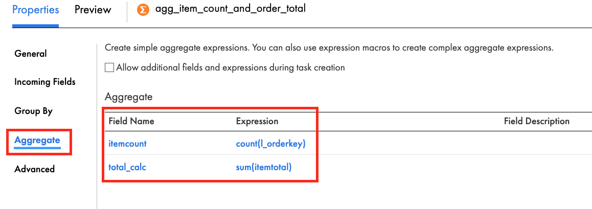
29.	Click **Save** to save work in progress.

### Step 6 (Optional)
Now we will add another expression to rename the fields so that they look better and are in the order we want in the Snowflake table.  This is an optional transformation.

1.	From the transformation palette, drag **Expression** transform and drop it over the line between the agg_item_count_and_order_total and target transforms.  The expression should now be linked to the aggregator and Target transforms.  If not, manually link them.
2.	Click align icon to align transformations in the mapping canvas.
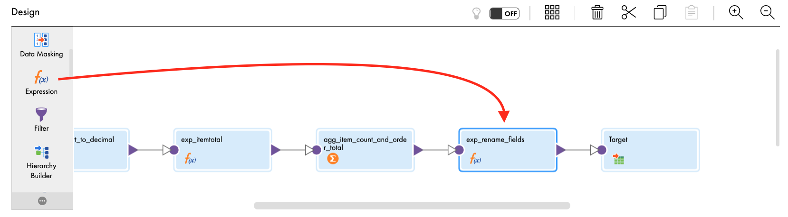
3.	Let’s assign the properties.
4.	In the General tab, enter **exp_rename_fields** in the Name field.
5.	In the Expression tab, click the plus icon to add the following fields:

| **Field Name** | **Type** | **Precision**	| **Scale**	| **Expression** |
| --- | --- | --- | --- | --- |
| orderkey | string	| 255 | 0 | o_orderkey |
| custkey	| string | 255 | 0 | o_custkey | 
| orderdate	| string | 255 | 0 | o_orderdate | 
| orderpriority	| string	| 255	| 0	| o_orderpriority| 
| orderstatus| 	string| 	255| 	0| 	o_orderstatus| 
| totalprice| 	decimal| 	38| 	2| 	o_totalprice|

6.	When completed, your Expression tab properties should look like this:
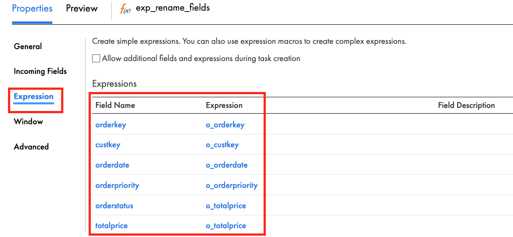
7.	Click **Save** to save work in progress.

### Step 7
Lastly the target table is going to be in Snowflake.

1.	Click **Target** to set a target properties.
2.	In the General tab, enter **tgt_Snowflake** in the Name field.
3.	In the Incoming Fields tab, click plus icon to add a field rule.
4.	Click Include operator and change it to **Exclude**.
5.	Click **Configure**.
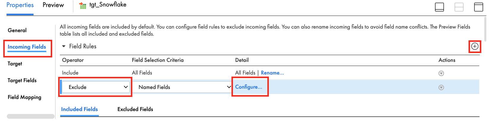
6.	Select all fields except the following:
<br>	custkey
<br>	itemcount
<br>	orderdate
<br>	orderkey
<br>	orderpriority
<br>	orderstatus
<br>	total_calc
<br>	totalprice
7.	When completed, the Incoming Fields tab should look like this:
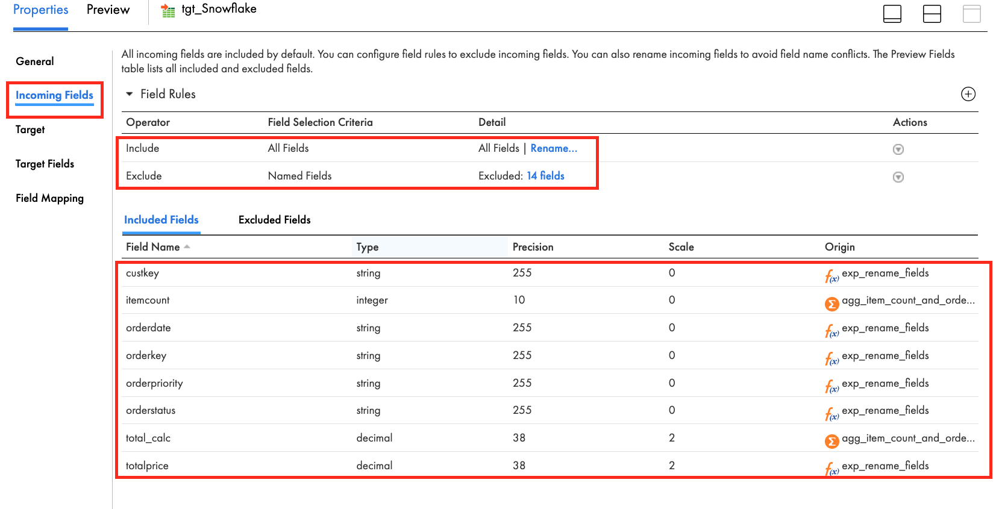
8.	Click **Select** to select target table.
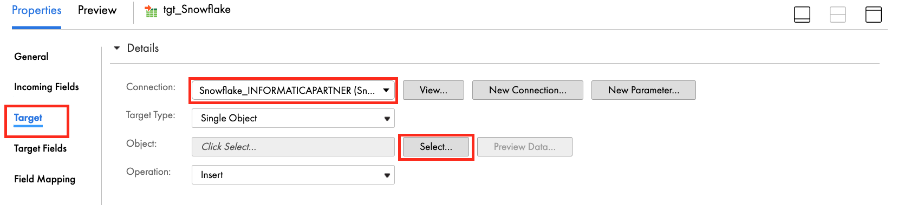
9.	Select **Create New at Runtime** for Target Object.
10.	Enter **ORDERSLINEITEM** in Object Name field.
11.	Enter **TABLE** in the TableType field.
12.	Enter **PC_INFORMATICA_DB/PUBLIC** in Path field.
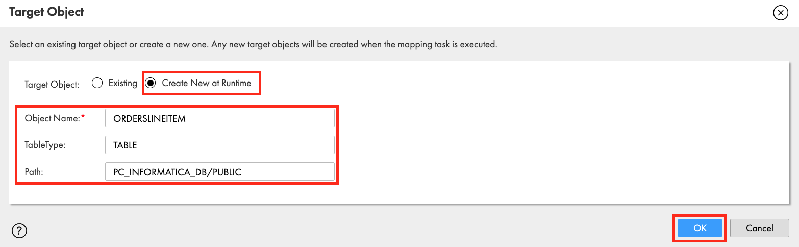
13.	The Target Fields tab should look like this:
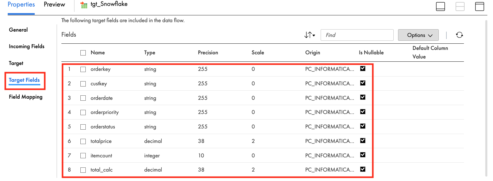
14.	The Field Mapping tab should look like this:
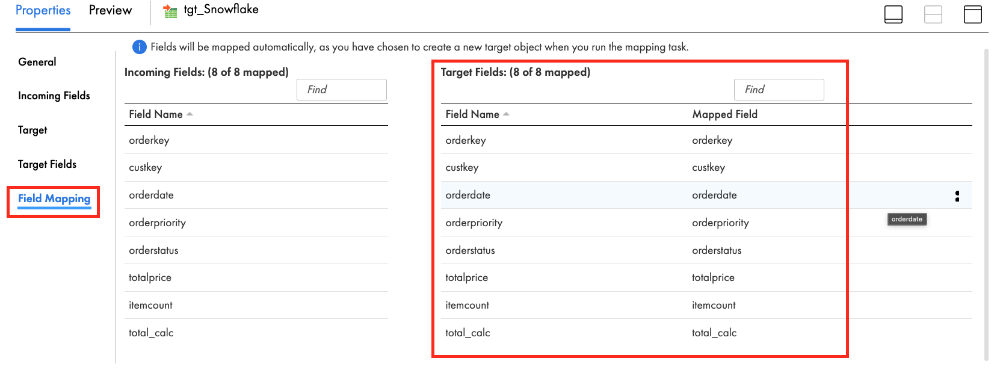

## Configure Pushdown Optimization and Execute the Mapping Task
Duration: 10

Let’s configure Pushdown Optimization (PDO) in the Mapping Task and execute it.

### Step 1

1.	Click **Save** to save and validate the mapping.
2.	Click 3 dots icon to create a **Mapping task** from the mapping
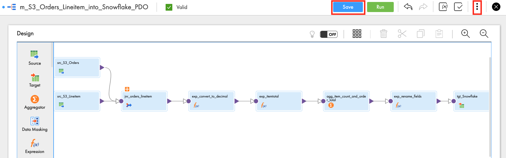
3.	Select **New Mapping Task…**
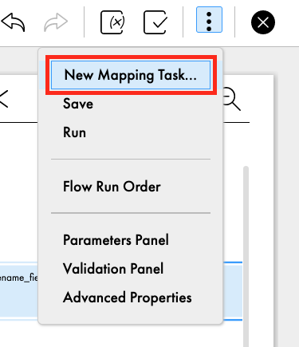
4.	In the New mapping task window, enter **mct_S3_Orders_Lineitem_to_Snowflake_PDO** in the Name field.
5.	Select **Hands-on Lab** for Location.
6.	Select **Informatica Cloud Hosted Agent** for Runtime Environment.
7.	Click **Next**. <BR>
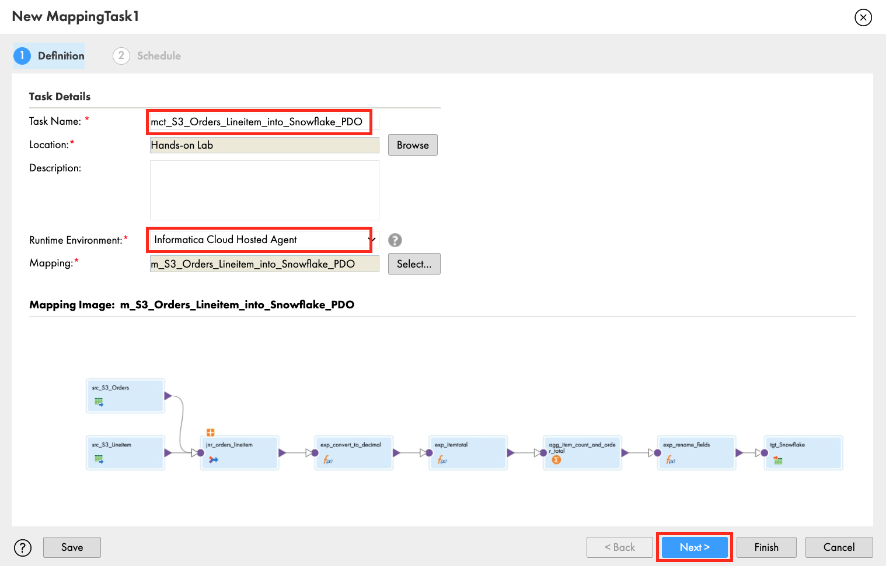 
8.	Scroll down to the Pushdown Optimization section.
9.	Select **Full** from the Pushdown Optimization dropdown list.
10. Check **Create Temporary View** and **Create Temporary Sequence**.
11.	Click **Finish**. <BR>
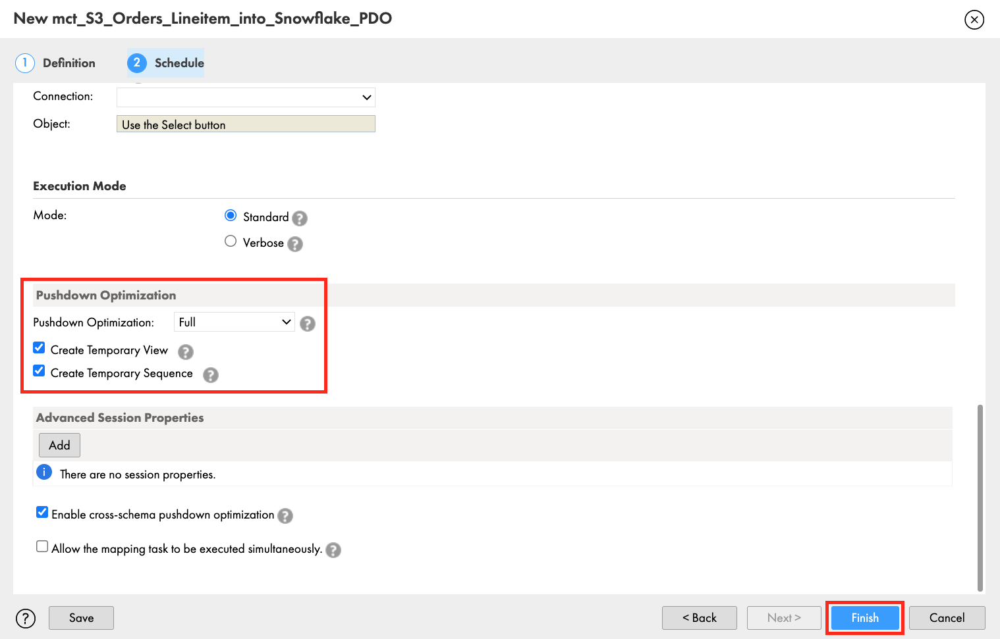
12.	Click **Run** to execute the mapping task.
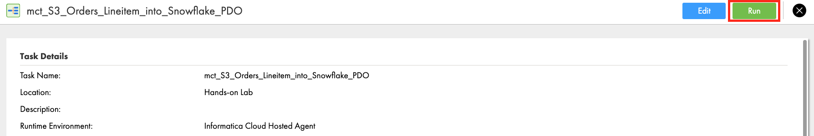

### Step 2
View job execution progress.

1.	Click **My Jobs** to monitor the job execution.
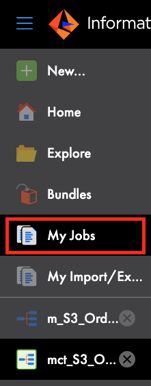
2.	Click **Refresh** icon when the “Updates available” message appears.
3.	When the job is completed, make sure Status is **Success**.
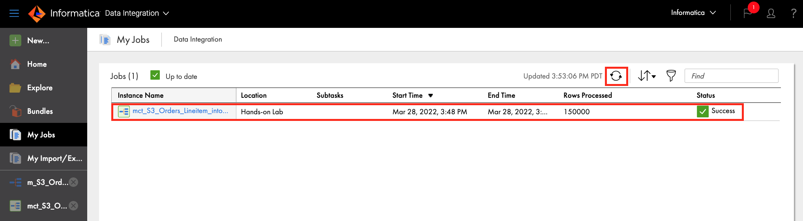
4.	Drill down to the completed job by clicking the instance name.  Then click Download Session Log to view the log.  
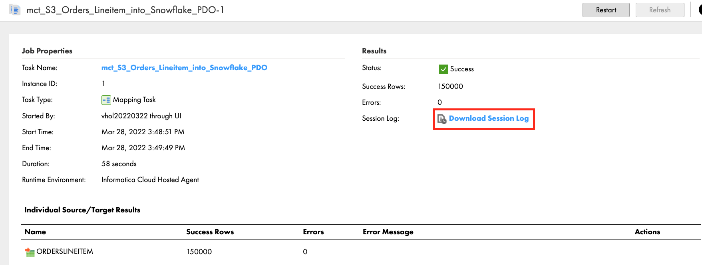
5. In the log you will see a message indicating that Pushdown Optimization is successfully enabled. 
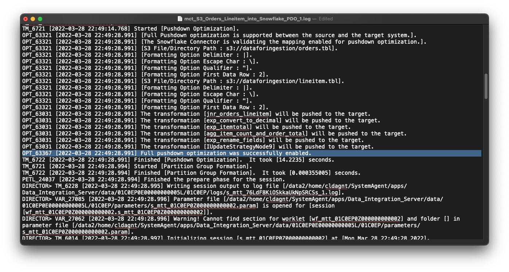
6.	You will also see an INSERT SQL statement that Informatica generated for execution in Snowflake.

```SQL
INSERT INTO "PC_INFORMATICA_DB"."PUBLIC"."ORDERSLINEITEM"("orderkey","custkey","orderdate","orderpriority","orderstatus","totalprice","itemcount","total_calc") SELECT t5.t5c6, t5.t5c7, t5.t5c10, t5.t5c11, t5.t5c8, t5.t5c9, t5.t5c12::NUMBER(18,0), t5.t5c13 FROM (SELECT t3.t3c0, t3.t3c1, t3.t3c2, t3.t3c3, t3.t3c4, t3.t3c5, t3.t3c0 c0, t3.t3c1 c1, t3.t3c2 c2, t3.t3c3 c3, t3.t3c4 c4, t3.t3c5 c5, COUNT(t1.t1c0)::NUMBER(10,0), SUM(((t1.t1c1) * (1 - (t1.t1c2))) * (1 + (t1.t1c3))) FROM (SELECT t0."l_orderkey"::VARCHAR(256), t0."l_extendedprice"::VARCHAR(256), t0."l_discount"::VARCHAR(256), t0."l_tax"::VARCHAR(256) FROM "PC_INFORMATICA_DB"."PUBLIC"."ORDERSLINEITEM_1617648173588" AS t0) AS t1(t1c0 , t1c1 , t1c2 , t1c3) Join (SELECT t2."o_orderkey"::VARCHAR(256), t2."o_custkey"::VARCHAR(256), t2."o_orderstatus"::VARCHAR(256), (t2."o_totalprice"::NUMBER(38,2))::DOUBLE, t2."o_orderdate"::VARCHAR(256), t2."o_orderpriority"::VARCHAR(256) FROM "PC_INFORMATICA_DB"."PUBLIC"."ORDERSLINEITEM_1617648173277" AS t2) AS t3(t3c0 , t3c1 , t3c2 , t3c3 , t3c4 , t3c5) ON t3.t3c0 = t1.t1c0 GROUP BY 1, 2, 3, 4, 5, 6) AS t5(t5c0 , t5c1 , t5c2 , t5c3 , t5c4 , t5c5 , t5c6 , t5c7 , t5c8 , t5c9 , t5c10 , t5c11 , t5c12 , t5c13)
```

### Step 3
1.	In Snowflake Snowsight, you should see 150,000 rows inserted in the **ORDERSLINEITEM** table.
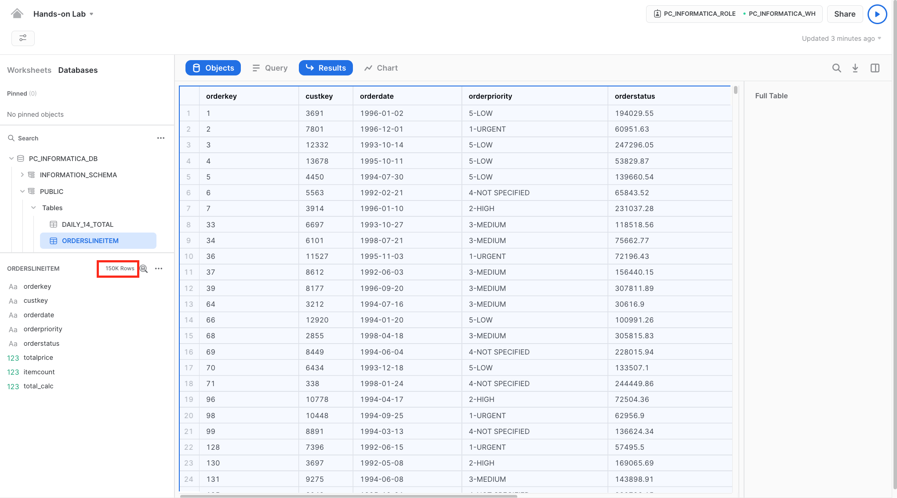
2. You can also view the Informatica-generated INSERT statement that was executed in the Snowflake query history page.  Use Filter and filter for INSERT statement.
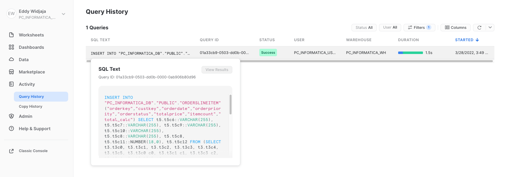

<!-- ------------------------ -->
## Transform Semi-Structured JSON Data
Duration: 3

### Step 1 
JSON (JavaScript Object Notation) is a text-based data format commonly used between servers and web applications and web-connected devices.  Because it is text-based, it is readable by both humans and machines.  JSON semi-structured data can be stored in Snowflake variant column alongside relational data.  In IDMC, the hierarchy parser transformation parses and transforms hierarchy data to relational data.

In this section, we'll load some JSON-formatted weather data into the PC_INFORMATICA_DB database.  You will then use it to create a hierarchical schema, then use it in a mapping to parse and transform the JSON weather forecast data, join them, add an expression to convert the temperature, then write to a new table.

For this step we will use standard Snowflake SQL commands to create a table with a Snowflake **VARIANT** column, create an external stage (pointing to an S3 buket), re-size our warehouse to **Large** to speed up the load, run a Snowflake **COPY** command to load the data, and importantly, re-size the warehouse back to **X-Small** after all of the commands complete.

1. In Snowflake **Snowsight**, execute all of the following SQL statements.

```SQL
-- Set the correct ROLE, WAREHOUSE, and SCHEMA
use role PC_INFORMATICA_ROLE;
use warehouse PC_INFORMATICA_WH;
use schema PC_INFORMATICA_DB.PUBLIC;

-- Create the table
create or replace table pc_informatica_db.public.daily_14_total (
  v variant,
  t timestamp);

-- Define a stage that describes where the data will be loaded from
create or replace stage weather_data_s3
  url = 's3://sfquickstarts/VHOL Informatica Data Management/WEATHER/';

-- Re-size the warehouse so we can load the data quicker
alter warehouse pc_informatica_wh set warehouse_size = large;

-- Load the data
copy into daily_14_total
   from (select $1, to_timestamp($1:time)
   from @weather_data_s3)
   file_format = (type=json);
   
-- Set the warehouse back to the original size
alter warehouse pc_informatica_wh set warehouse_size = xsmall;
```

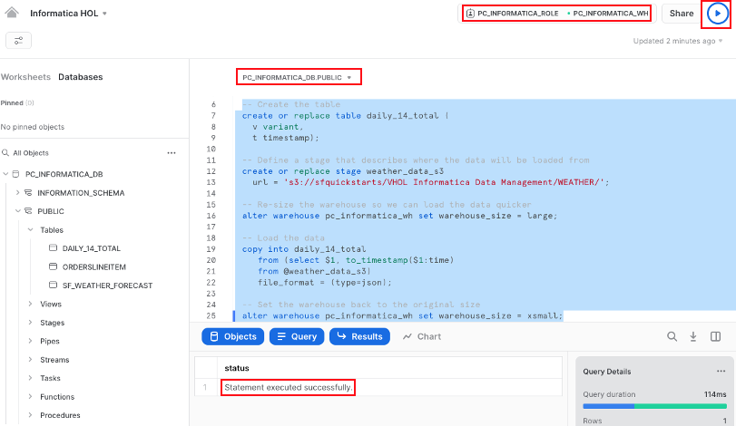

## Configure Hierarchical Schema
Duration: 5

### Step 1
Copy JSON data from the Snowflake table and save it locally in your computer.

1.	Go to Worksheets, execute the following query:
```SQL
select * from daily_14_total limit 1000;
```
2. Click the first row in column V in the result panel.
3. Click copy icon to copy JSON string to clipboard.
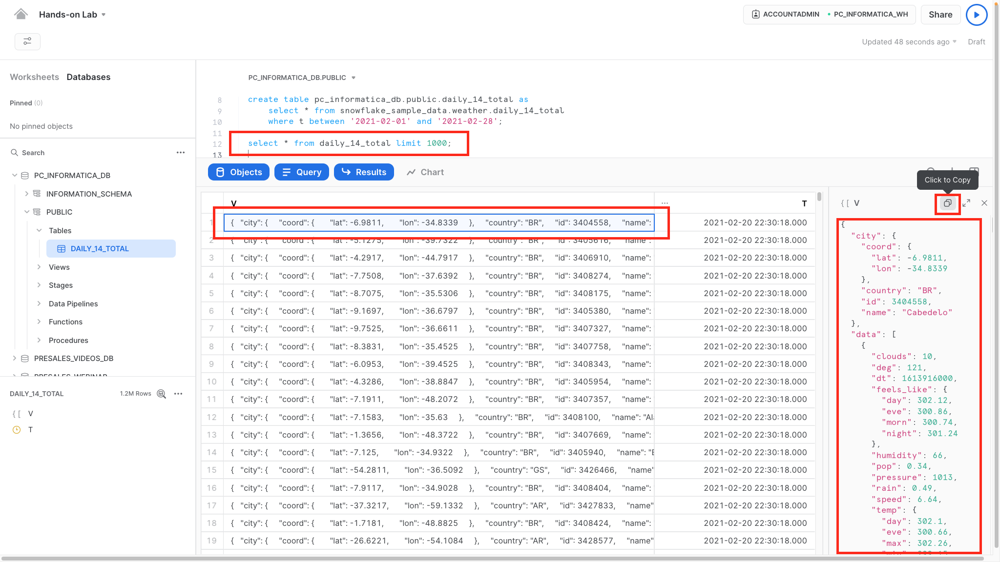
4. Save the copied JSON in a text file locally on your computer.  Filename: **daily_14.json**.

### Step 2
Create a Hierarchical Schema in IDMC.

1.	In IDMC, go to **Data Integration** service.
2.  Click **New**.
3.	Click **Components**.
4.	Select **Hierarchical Schema** and click **Create**.
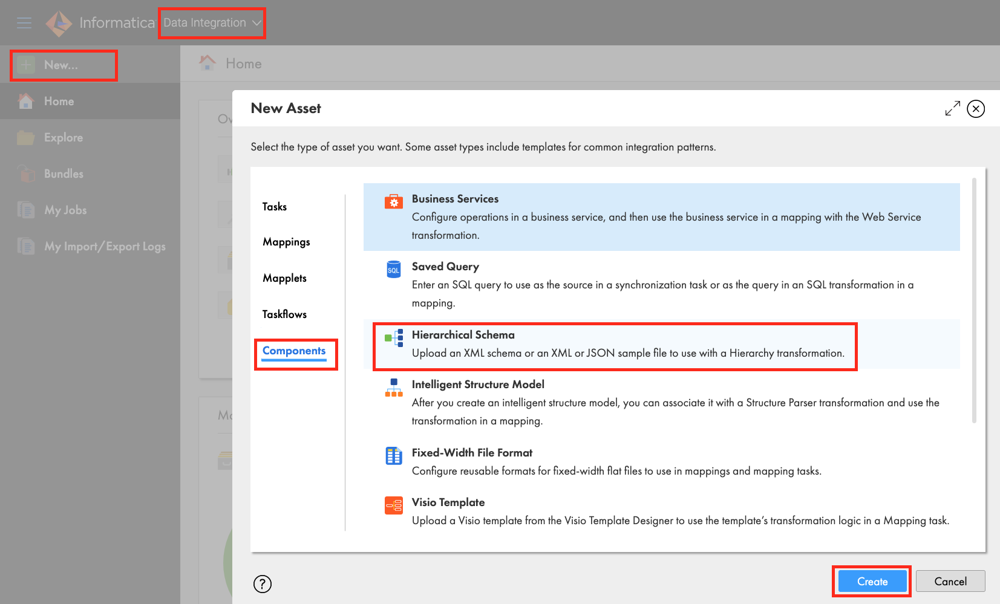
5.	Enter **Daily_14** in the Name field.
6.	Select **Hands-on Lab** in the Location field if not already filled in.
7.	Click **Upload**.
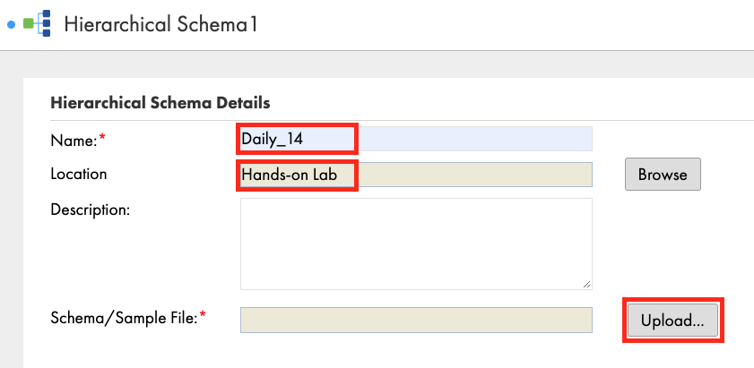
8.	Click **Choose File** and select the JSON file you saved in Step 1 above.
9.	Click **Validate** and you should see **"JSON Sample is Valid"** message.
10.	Click **OK**.
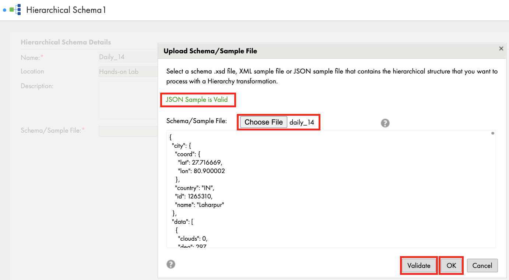
11.	Click Save.
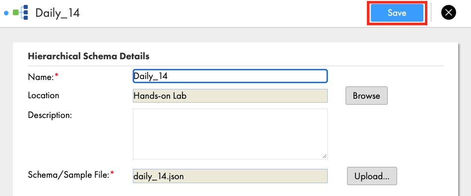

## Create a Mapping to Read the Weather Table
Duration: 15

Create a mapping to read from the daily_14_total table, use hierarchy parser to parse the JSON data, join the relational data, convert the temperature and write to a new Snowflake table.

### Step 1
1.	Click **New…**
2.	Click **Mappings**.
3.	Select **Mapping**.
4.	Click **Create**.
5.	Under properties, enter **m_transform_JSON** in Name field.
6.	Ensure Location is **Hands-on Lab**. If not, click **Browse** and select it.
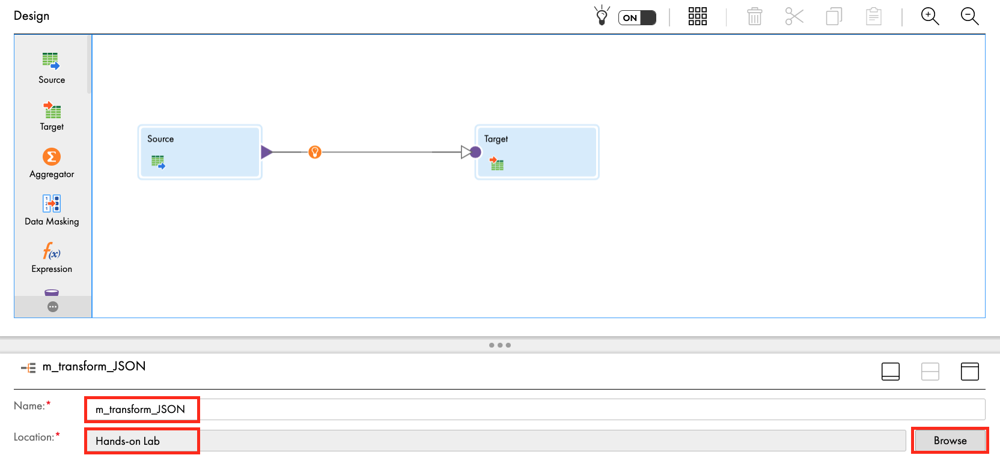

### Step 2
Let’s configure the data source from Snowflake. 

1.	Click **Source** transform in the mapping canvas to assign its properties.
2.	In General tab, enter **src_daily_14** in the Name field.
3.	In Source tab, select **Snowflake_[account name]** in the Connection dropdown field.
4.	Click **Select** to select the source table/object.
5.	In Select Source Object window, scroll down to find **PC_INFORMATICA_DB** and click it.  Then click **PUBLIC** schema.
6.	Select **DAILY_14_TOTAL** in the tables list on the right pane.
7.	Click **OK**.
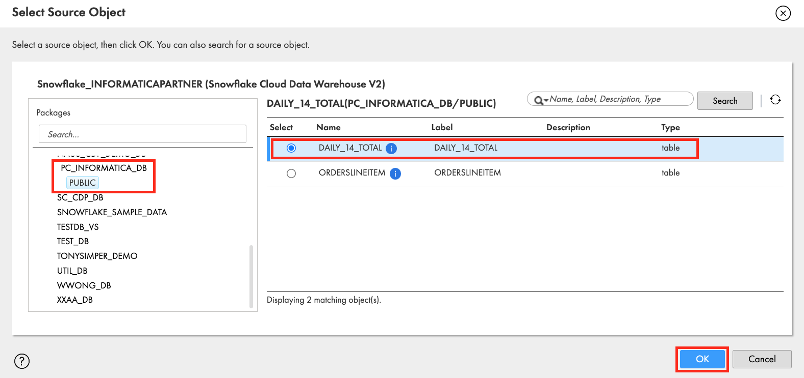
8.	Expand **Query Options**.
9.	Click **Configure** for Filter.
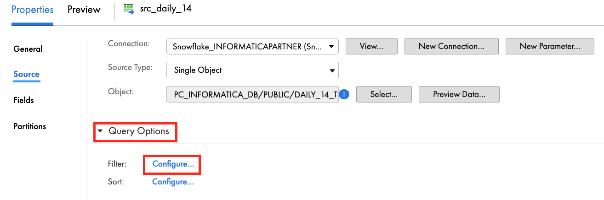
10.	Click Filter Condition dropdown and select **Advanced**.
11.	Paste the following in the filter condition:

```condition
DAILY_14_TOTAL.T >= to_date('2021-02-01','YYYY-MM-DD') AND DAILY_14_TOTAL.T <= to_date('2021-02-28','YYYY-MM-DD') AND DAILY_14_TOTAL.V:city:country='US' and DAILY_14_TOTAL.V:city:name = 'San Francisco'
```

12.	Click **OK**.
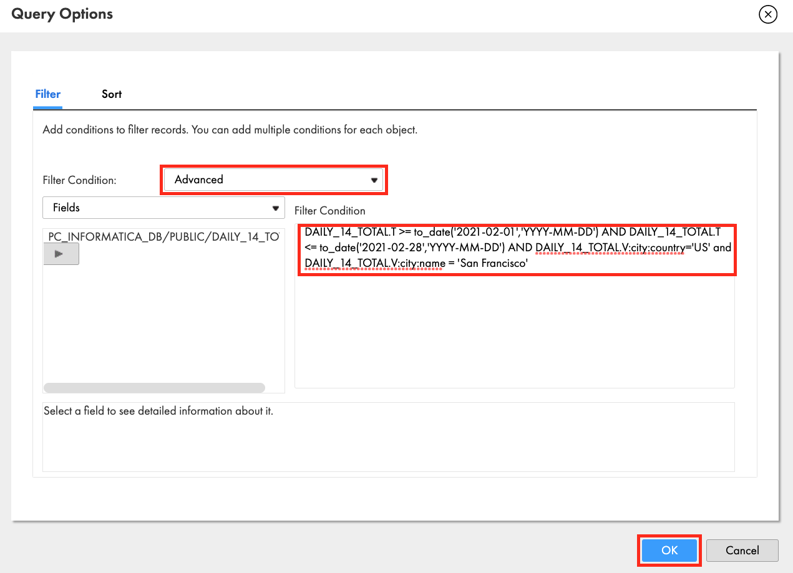
13.	Click **Save** to save work in progress.

### Step 3
Add HierarchyParser transform and configure it. 

1.	Drag and drop **Hierarchy Parser** transform on to the canvas.
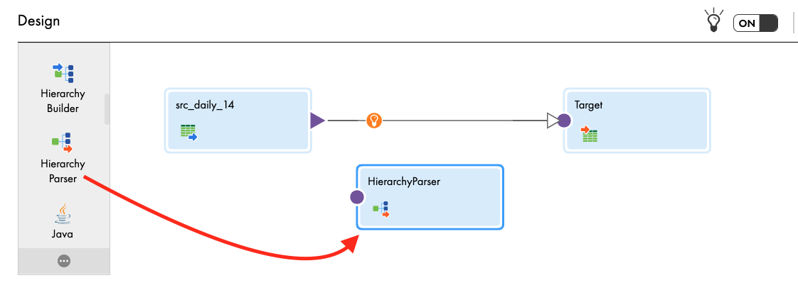
2.	In General tab, enter **hp_parse_JSON** in the Name field.
3.	In Input Settings tab, click Select and select the **Daily_14** hierarchical schema.  Click **OK**.
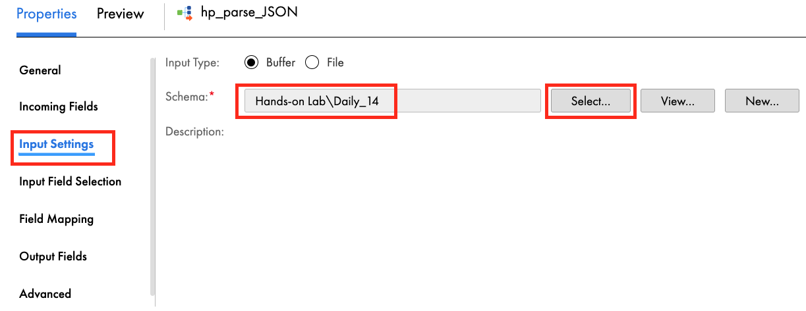
4.	Select the link from **src_daily_14** to **Target** and click delete icon.
5.	Link **src_daily_14** to **hp_parse_JSON**.  
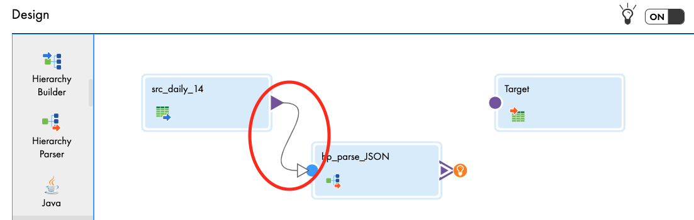
6.	In Input Field Selection tab, drag and drop **V** field from Incoming Fields to Input field in Hierarchical Schema Input Fields.
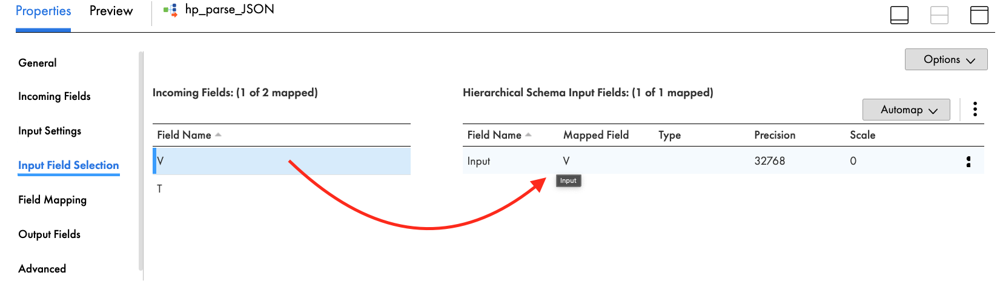
7.	In Field Mapping tab, expand root element by clicking the triangle icon or expand/contract icon.
8.	Select (check) the following fields: **country**, **name**, **dt**, **humidity**, **max**, **min**, **description** in the Schema Structure panel.  Selected fields will automatically show up in the Relational Fields on the right panel.  Primary keys and foregin keys are auto created to make the fields relational.
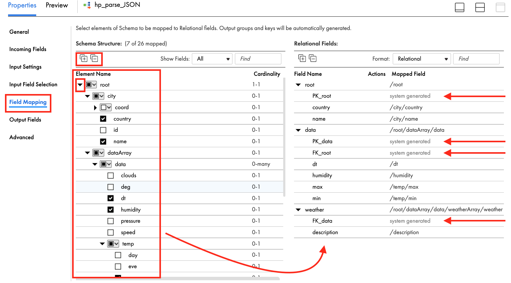
9.	Click **Save** to save work in progress.

### Step 4
Add a Joiner transform to link root and data relational field groups and configure it. 

1.	Drag and drop **Joiner** transform on the canvas.
2.	Link **hp_parse_JSON** to the **Master** in Joiner transform.  
3.	Select Output Group window appears.  Select **root** and click **OK**.
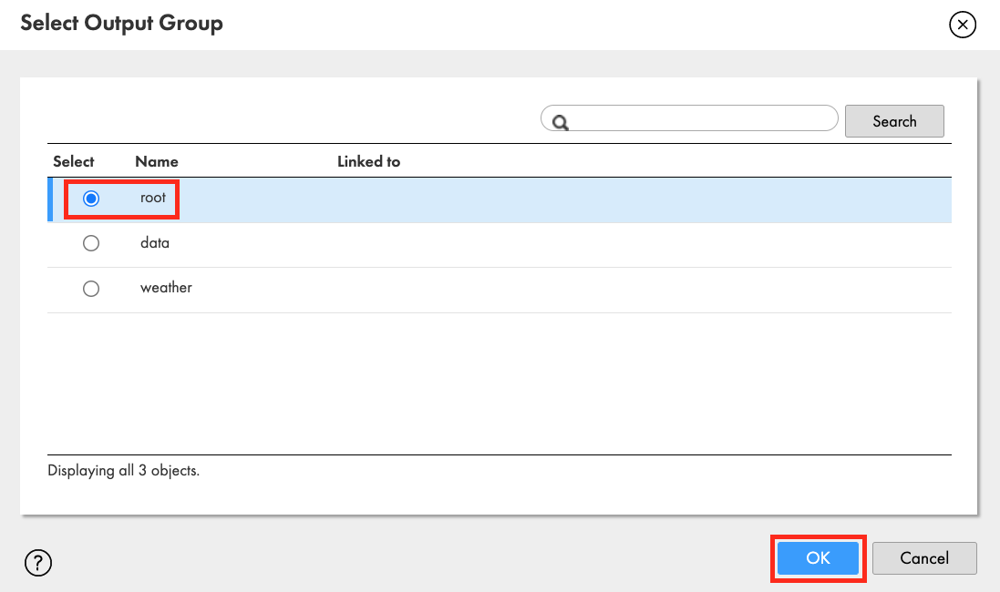
4.	Link **hp_parse_JSON** again but this time to the **Detail** in Joiner transform.
5.	Select **data** in Output Group and click **OK**.
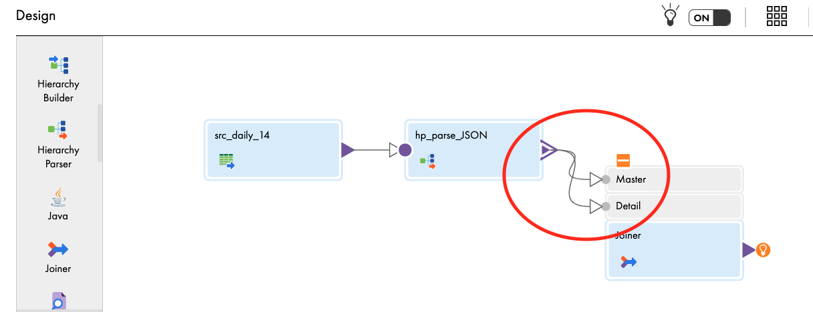
6.	In General tab, enter **jnr_temperature** in the Name field.
7.	In Join Condition tab, click add icon.
8.	Select **PK_root (bigint)** in Master column and **FK_root (bigint)** in the Detail.
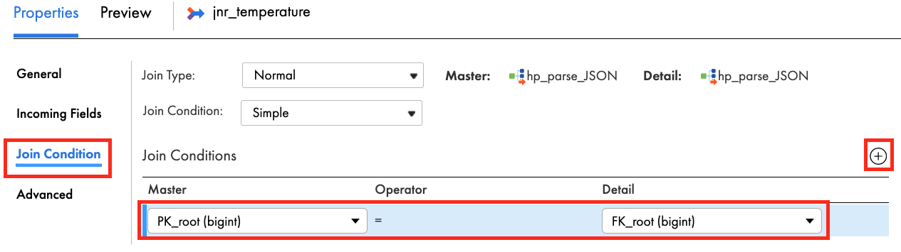
9.	In Advanced tab, select **Sorted Input**.
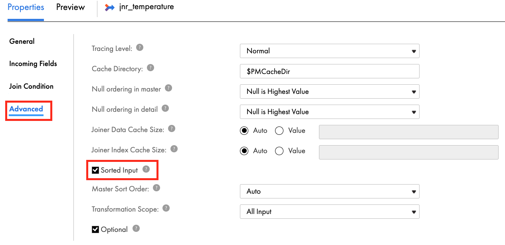
10.	Click **Save** to save work in progress.

### Step 5
Add another Joiner transform to join and configure it. 

1.	Drag and drop **Joiner** transform on the canvas.
2.	Link **jnr_temperature** to the **Master** in Joiner transform.  
3.	Link **hp_parse_JSON** to the **Detail** in Joiner transform.
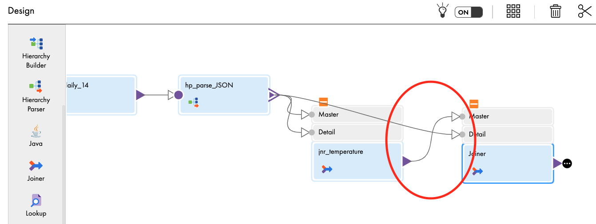
4.	Select Output Group window appears.  Select **weather** and click **OK**.
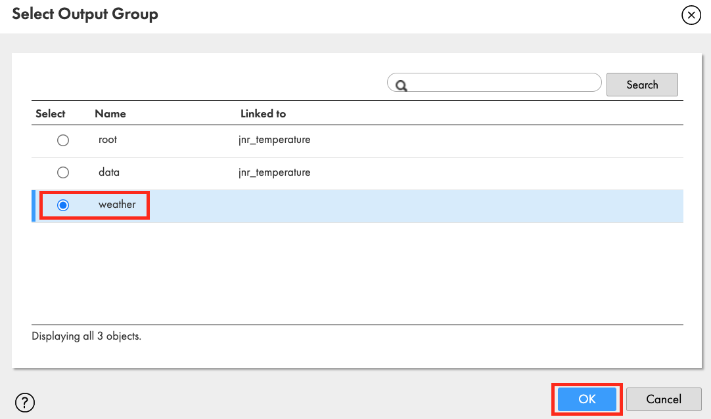
5.  In General tab, enter **jnr_condition** in the Name field.
6.	In Join Condition tab, select **PK_data (bigint)** in Master and **FK_data (bigint)** in Detail.
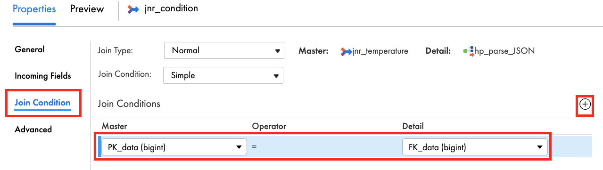
6.	In Advanced tab, select **Sorted Input**.
7.	Click **Save** to save work in progress.

### Step 6
Add Expression transform to create an ordered fields in the target and convert temperature from Kelvin to Fahrenheit. 

1.	Drag and drop **Expression** transform on the canvas.
2.	Link **jnr_condition** to the **Expression**.
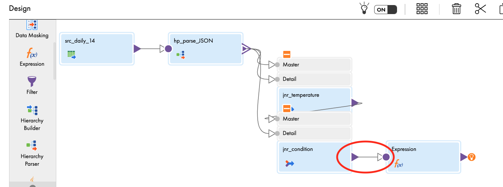
3.	In the General tab, enter **exp_convert_temperature** in the Name field.
4.	In the Expression tab, add the following fields and expressions.

| **Field Name** | **Type; Precision; Scale** | **Expression** |
| --- | --- | --- |
| Date | Date/time; 29; 9 | Add_To_Date(To_Date( '1970-01-01', 'YYYY-MM-DD'),'SS',dt) |
| City | String; 255; 0 | name |
| Country_Name | String; 255; 0 | country | 
| Min_Temp | Decimal; 10; 1 | (min - 273.15) * 9/5 + 32 |
| Max_Temp | Decimal; 10; 1 | (max - 273.15) * 9/5 + 32 |
| Condition | String; 100; 0 | description |
| Humidity_Level | Double; 15; 0 | humidity |

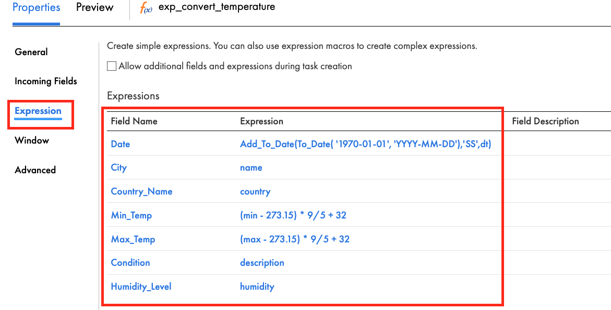

### Step 7
Finally, let’s configure the Target. 

1.	Link **exp_convert_temperature** to Target.
2.	In the General tab, enter **tgt_sf_weather_forecast** in the Name field.
3.	In the Incoming Fields tab, change All Fields to **Named Fields** by clicking on that field.
4.	Then click **Configure** to select fields.  Select the fields that were created in the **exp_convert_temperature** expression transform.
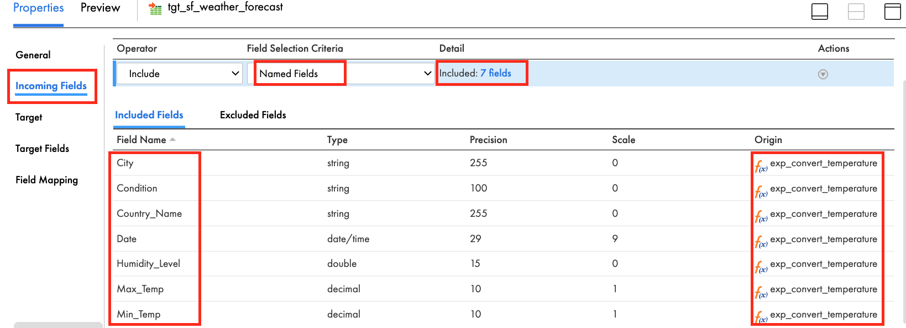
5.	In the Target tab, select **Snowflake** connection.
6.	Click **Select** to select a table.
7.	In the Target Object window, check **Create New at Runtime**.
8.	Enter **SF_WEATHER_FORECAST** in Object Name field.
9.	Enter **TABLE** in TableType.
10.	Enter **PC_INFORMATICA_DB/PUBLIC** in Path.
11.	Click **OK**.
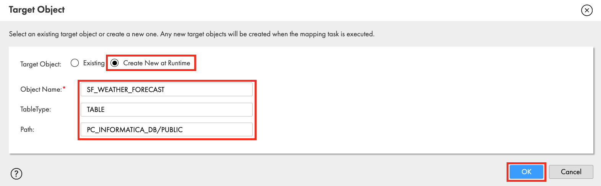
12.	In the Field Mapping tab, the target fields are automatically mapped from the incoming fields.
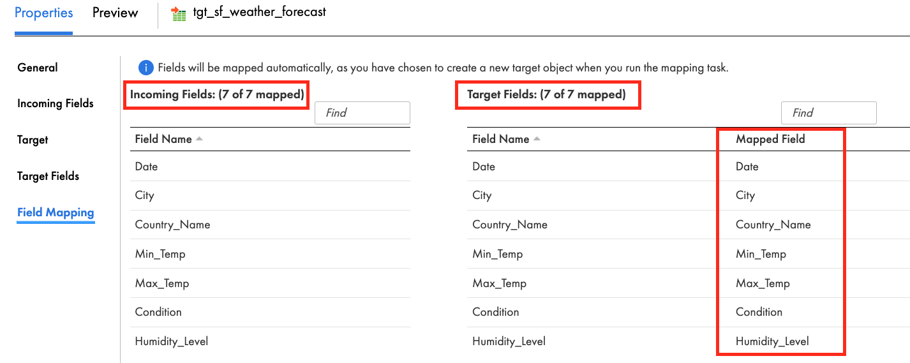
13.	Click **Save**.


## Create and Execute a Mapping Task
Duration: 5

### Step 1

Let’s configure a Mapping Task and execute it.

1.	Click 3 dots to create Mapping task from the mapping
2.	Select **New Mapping Task…**
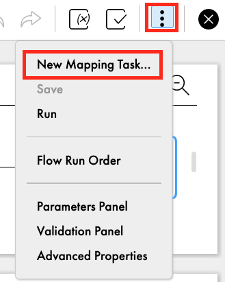
3.	In the New mapping task window, enter **mct_transform_JSON** in the Name field.
4.	Select **Hands-on Lab** for Location.
5.	Select **Informatica Cloud Hosted Agent** for Runtime Environment.
6.	Click **Finish**.
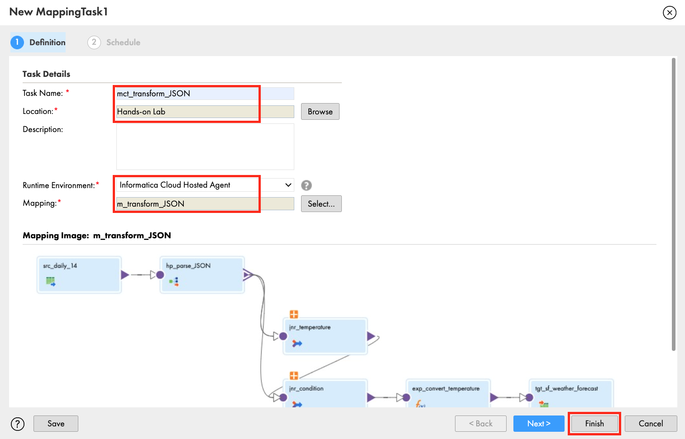
7.	Click Run to execute the mapping task.

### Step 2
Validate job execution result.

1.	Click **My Jobs** to monitor the job execution.
2.	Click **Refresh** icon when “Updates available” message appears.
3.	When the job is completed, make sure the Status is **Success**.
4.	**864** rows were processed.
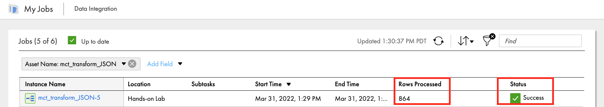
5.	In the Snowflake table preview, there are 864 rows as well.  Notice that the columns label are in the order as configured in the Expression transform.
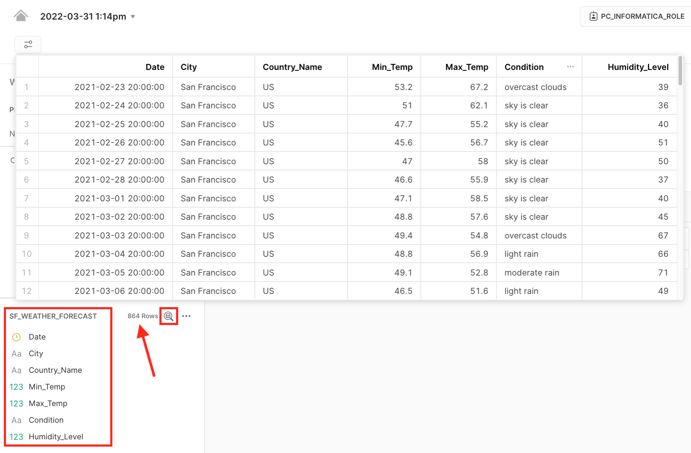

<!-- ------------------------ -->
## Conclusion
Duration: 2

**Congratulations! You have successfully created a free IDMC organization, completed an ELT workload to load S3 files into Snowflake, and transformed JSON using the IDMC Data Integration service.**

You can utilize your new IDMC org to load data from various data sources into Snowflake and perform data transformations using Data Integration service.  With this free IDMC org, you can load 1 billion records per month for free. In this guide, you learned how to use Pushdown Optimization/ELT to load S3 files into Snowflake, and how to transform JSON data using Hierarchy Parser transformation.

### What we've covered in this guide
- Create an IDMC org via Snowflake Partner Connect
- Review Snowflake connection in IDMC
- Review Snowflake objects created by the registration process
- Configure AWS S3 connection
- Create a Project folder
- Create a data integration mapping to load S3 files into Snowflake
- Configure Pushdown Optimization
- View mapping job result 
- Confirm Pushdown Optimization is activated
- View result in Snowflake
- Create JSON schema in Data Integration service
- Use Hierarchy Parser transformation
- Create a data integration mapping to load transform JSON hierarchical data into relational format
- Create a mapping task
- View mapping job result 
- View result in Snowflake

### Continue learning and check out these guides

[Documentation: Informatica Data Integration](https://docs.informatica.com/integration-cloud/cloud-data-integration/current-version/introduction/introducing-informatica-cloud--data-integration/data-integration.html)

[Documentation: Snowflake connector](https://docs.informatica.com/integration-cloud/cloud-data-integration/current-version/data-integration-connections/connection-properties/snowflake-data-cloud-connection-properties.html)

[Landing page for Informatica Intelligent Cloud Services Accelerator for Snowflake](https://marketplace.informatica.com/thank-you/snowflake.html) 

[FAQ for Snowflake Accelerator](https://docs.informatica.com/integration-cloud/cloud-platform/h2l/1423-informatica-intelligent-cloud-services-for-snowflake-accele/frequently-asked-questions/frequently-asked-questions.html)