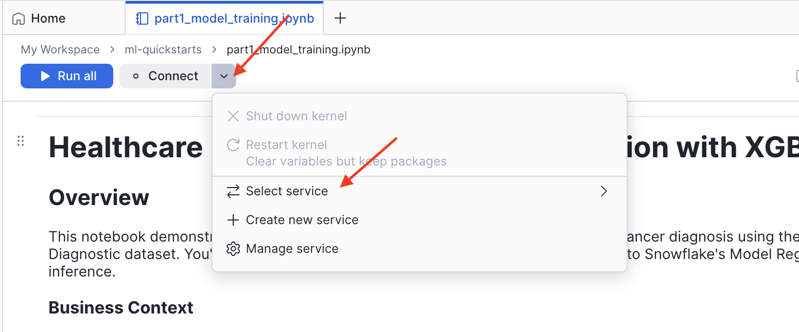
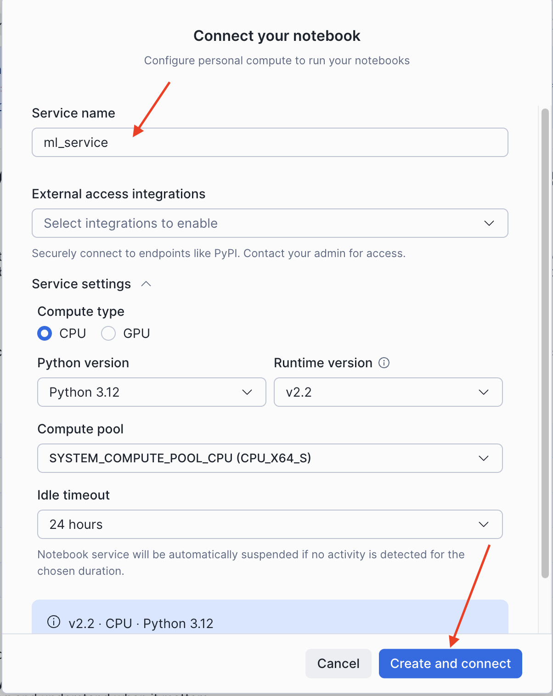

author: Dureti Shemsi
language: en
id: healthcare-ml-breast-cancer-classification
summary: Build, evaluate, and deploy a breast cancer classification model using XGBoost and Snowflake Model Registry with Snowflake Notebooks in Workspaces
categories: snowflake-site:taxonomy/product/ai, snowflake-site:taxonomy/product/data-engineering, snowflake-site:taxonomy/snowflake-feature/model-development, snowflake-site:taxonomy/snowflake-feature/applied-analytics, snowflake-site:taxonomy/snowflake-feature/snowflake-ml-functions, snowflake-site:taxonomy/snowflake-feature/snowpark-container-services, snowflake-site:taxonomy/industry/healthcare-and-life-sciences, snowflake-site:taxonomy/solution-center/certification/quickstart
environments: web
status: Published
feedback link: https://github.com/Snowflake-Labs/sfguides/issues
fork repo link: https://github.com/Snowflake-Labs/sfquickstarts/tree/master/site/sfguides/src/healthcare-ml-breast-cancer-classification


# Healthcare ML: Breast Cancer Classification with XGBoost

<!-- ------------------------ -->
## Overview

This guide walks you through an end-to-end machine learning workflow for breast cancer diagnosis using the Wisconsin Diagnostic dataset. You'll build a production-ready XGBoost classification model, evaluate it with clinical metrics, and deploy it to the Snowflake Model Registry for governed, scalable inference — all using [Snowflake Notebooks in Workspaces](https://docs.snowflake.com/en/user-guide/ui-snowsight/notebooks-in-workspaces/notebooks-in-workspaces-overview), the new Jupyter-compatible notebook experience with managed CPU and GPU compute, file management, and direct access to governed Snowflake data.

Early detection of breast cancer significantly improves patient outcomes. The model analyzes cell nucleus characteristics from fine needle aspirate (FNA) images to predict whether a tumor is malignant (cancerous) or benign (non-cancerous).

### Prerequisites
- A Snowflake account in an AWS or Azure commercial region
- ACCOUNTADMIN access or equivalent privileges to run the setup script for Part 2
- Basic knowledge of Python and SQL
- Familiarity with machine learning concepts

### What You'll Learn
- How to perform exploratory data analysis with statistical visualizations
- How to apply feature scaling and compare multiple classification algorithms
- How to use 5-fold stratified cross-validation for robust model evaluation
- How to analyze feature importance with XGBoost
- How to log a model to the Snowflake Model Registry with metrics and version metadata
- How to run batch inference using a registered model

### What You'll Need
- A [Snowflake](https://signup.snowflake.com/?utm_source=snowflake-devrel&utm_medium=developer-guides&utm_cta=developer-guides) account
- Basic understanding of Snowpark and Snowflake ML

### What You'll Build
- A trained XGBoost classifier with high accuracy and strong ROC AUC
- A registered model version in Snowflake Model Registry with logged metrics
- A reusable inference workflow via Python and SQL

<!-- ------------------------ -->
## Set Up Part 1 Notebook

Part 1 does not require any setup script. You only need to create a service and upload the notebook. All work runs inside [Snowflake Notebooks in Workspaces](https://docs.snowflake.com/en/user-guide/ui-snowsight/notebooks-in-workspaces/notebooks-in-workspaces-overview) — a Jupyter-compatible environment with managed compute and direct access to Snowflake data.

### Create Service

1. Open Snowflake and navigate to **Projects** > **Workspaces**
2. Click the **Connect** button in the top toolbar
3. Select **Create new service**



4. In the **Connect your notebook** dialog, configure the service:
   - **Service name**: Enter a name (e.g., `ml_service`)
   - **External access integrations**: Leave empty (not required for Part 1)
   - Expand **Service settings** and set:
     - **Compute type**: `CPU`
     - **Python version**: `3.12`
     - **Runtime version**: `v2.2`
     - **Compute pool**: Select an available CPU compute pool
     - **Idle timeout**: `24 hours` (default)
5. Click **Create and connect**



### Upload Notebook (Part 1)

Download the first notebook to your local machine:

1. Click this link: [0_start_here.ipynb](https://github.com/Snowflake-Labs/sfquickstarts/blob/master/site/sfguides/src/healthcare-ml-breast-cancer-classification/notebooks/0_start_here.ipynb)
2. On the GitHub page, click the **Download raw file** button (download icon in the top right)
3. Save the `.ipynb` file to your computer

Now upload the notebook into your workspace:

1. In **Projects** > **Workspaces**, click **Add new** > **Upload Files**
2. Select the downloaded `0_start_here.ipynb` file
3. Click on the uploaded file to open it — it is ready to run


> NOTE:
> Part 1 uses Snowflake Notebooks in Workspaces and connects to Snowflake using `get_active_session()`. Data is loaded from `sklearn.datasets` — no database or compute pool setup is required.

<!-- ------------------------ -->
## Load and Explore the Dataset

This section covers loading the Breast Cancer Wisconsin dataset and performing exploratory data analysis to understand class balance and feature distributions.

### About the Dataset

The **Breast Cancer Wisconsin (Diagnostic)** dataset contains 569 samples with 30 features computed from digitized fine needle aspirate (FNA) images of breast masses. Each feature describes characteristics of cell nuclei present in the image.

| Feature | Description | Clinical Relevance |
|---------|-------------|-------------------|
| Radius | Mean distance from center to perimeter | Larger cells may indicate abnormality |
| Texture | Standard deviation of gray-scale values | Irregular texture suggests malignancy |
| Perimeter | Cell boundary length | Related to cell size |
| Area | Cell size measurement | Malignant cells often larger |
| Smoothness | Local variation in radius lengths | Irregular shapes are concerning |
| Compactness | Perimeter² / Area - 1.0 | Shape regularity metric |
| Concavity | Severity of concave portions | Indentations in cell boundary |
| Concave Points | Number of concave portions | Count of boundary indentations |
| Symmetry | Symmetry measurement | Asymmetry may indicate problems |
| Fractal Dimension | "Coastline approximation" - 1 | Boundary complexity |

For each feature, three statistics are computed — mean, standard error, and worst (mean of 3 largest values) — yielding **30 features** total.

**Target classes:**
- **0 = Malignant** (cancerous) — 212 samples (37.3%)
- **1 = Benign** (non-cancerous) — 357 samples (62.7%)

### Load the Data

Run the data loading cell in the notebook:

```python
from sklearn.datasets import load_breast_cancer
import pandas as pd

cancer = load_breast_cancer()
feature_names = [name.replace(' ', '_').upper() for name in cancer.feature_names]
X = pd.DataFrame(cancer.data, columns=feature_names)
y = pd.Series(cancer.target, name="DIAGNOSIS")
```

### Class Distribution Analysis

The dataset has a **1.68:1 Benign:Malignant ratio** — a moderate class imbalance. The notebook visualizes this as a bar chart and pie chart. Understanding class balance is critical because:

- Imbalanced data can bias models toward the majority class
- Accuracy alone becomes misleading with imbalanced classes
- Stratified sampling ensures both train and test sets maintain class proportions

### Feature Distributions by Diagnosis

The notebook plots histograms of six key mean features (radius, texture, perimeter, area, smoothness, compactness) split by diagnosis class. Features with distinct distributions between classes — such as mean radius and mean area — will be strong predictors.

### Correlation Analysis

A correlation heatmap of the 10 mean features reveals that radius, perimeter, and area are highly correlated (geometrically related). This multicollinearity does not harm tree-based models like XGBoost but affects linear model interpretation.

<!-- ------------------------ -->
## Prepare Data and Compare Models

This section covers train-test splitting, feature scaling, and comparing three classification algorithms using cross-validation.

### Train-Test Split

The notebook uses an **80-20 stratified split** to maintain class proportions in both sets:

```python
from sklearn.model_selection import train_test_split

X_train, X_test, y_train, y_test = train_test_split(
    X, y, test_size=0.2, random_state=42, stratify=y
)
```

| Split | Size |
|-------|------|
| Training | 455 samples (80%) |
| Test | 114 samples (20%) |

### Feature Scaling

`StandardScaler` transforms features to have mean=0 and std=1. The scaler is fit **only on training data** to prevent data leakage:

```python
from sklearn.preprocessing import StandardScaler

scaler = StandardScaler()
X_train_scaled = scaler.fit_transform(X_train)
X_test_scaled = scaler.transform(X_test)
```

Scaled features are used for Logistic Regression (scale-sensitive). XGBoost is scale-invariant but scaling is applied for a fair comparison.

### Model Comparison with 5-Fold Cross-Validation

The notebook compares three algorithms using Stratified K-Fold cross-validation to reduce variance in performance estimates:

| Algorithm | Strengths |
|-----------|-----------|
| Logistic Regression | Fast, interpretable, probabilistic |
| Random Forest | Handles non-linearity, robust to outliers |
| XGBoost | State-of-the-art accuracy, handles class imbalance |

```python
from sklearn.model_selection import StratifiedKFold, cross_val_score

cv = StratifiedKFold(n_splits=5, shuffle=True, random_state=42)

for name, model in models.items():
    scores = cross_val_score(model, X_train, y_train, cv=cv, scoring='accuracy')
    print(f"{name}: {scores.mean():.4f} (+/- {scores.std()*2:.4f})")
```

XGBoost achieves the highest mean cross-validation accuracy and is selected as the final model.

<!-- ------------------------ -->
## Evaluate the Model

This section covers evaluating the final XGBoost model on the held-out test set using multiple clinical metrics.

### Clinical Metrics for Cancer Screening

| Metric | Formula | Clinical Meaning |
|--------|---------|-----------------|
| Accuracy | (TP+TN) / Total | Overall correctness |
| Precision | TP / (TP+FP) | When predicted malignant, how often correct? |
| Recall (Sensitivity) | TP / (TP+FN) | Of actual cancers, how many detected? |
| F1-Score | 2 × (P × R) / (P + R) | Harmonic mean of precision/recall |
| AUC-ROC | Area under ROC curve | Model's discriminative ability |

In cancer screening, **high recall is critical**. A false negative (missed cancer) means the patient goes untreated — potentially fatal. A false positive leads to additional testing, which is manageable.

### Confusion Matrix

```python
from sklearn.metrics import confusion_matrix

cm = confusion_matrix(y_test, y_pred)
```

The confusion matrix shows where the model makes errors. The notebook visualizes this as an annotated heatmap.

### ROC Curve

```python
from sklearn.metrics import roc_curve, auc

fpr, tpr, _ = roc_curve(y_test, y_pred_proba)
roc_auc = auc(fpr, tpr)
```

The XGBoost model achieves a **ROC AUC of ~0.99**, which falls in the "Excellent" range (0.90–1.00).

### Precision-Recall Curve

For imbalanced datasets or when false negatives are costly, PR curves provide more information than ROC alone. The notebook plots the full precision-recall tradeoff at all classification thresholds.

### Feature Importance

XGBoost provides feature importance scores based on how frequently each feature is used in tree splits and how much it improves model accuracy:

```python
feature_importance = pd.DataFrame({
    'feature': X.columns,
    'importance': best_model.feature_importances_
}).sort_values('importance', ascending=True).tail(15)
```

"Worst" features (the largest observed values per nucleus) consistently dominate — extreme cell characteristics are the strongest predictors of malignancy.

### Save Artifacts for Part 2

Part 1 ends by saving the trained model and all metrics to `/tmp` so Part 2 can load them without retraining:

```python
import pickle

artifacts = {
    'best_model': best_model,
    'X_train': X_train,
    'X_test': X_test,
    'y_train': y_train,
    'y_test': y_test,
    'test_accuracy': test_accuracy,
    'test_f1': test_f1,
    'roc_auc': roc_auc,
    'pr_auc': pr_auc,
    'cv_results': cv_results,
    'feature_names': X.columns.tolist()
}

with open('/tmp/breast_cancer_artifacts.pkl', 'wb') as f:
    pickle.dump(artifacts, f)
```

> NOTE:
> The notebook working directory (`/home/udf/`) does not persist between sessions. The `/tmp` path is shared within the same session, which is why Part 2 must be run in the same Snowflake Notebooks session immediately after Part 1.

<!-- ------------------------ -->
## Deploy to Snowflake Model Registry

Part 2 deploys the trained model to Snowflake Model Registry. This requires running the setup script first to create the necessary database, warehouse, compute pool, and role.

### Run the Setup Script

Download the [setup.sql](https://github.com/Snowflake-Labs/sfquickstarts/blob/master/site/sfguides/src/healthcare-ml-breast-cancer-classification/scripts/setup.sql) script and run it as **ACCOUNTADMIN** in a new SQL file in **Projects** > **Workspaces**, or copy and paste the script below.

1. Open Snowflake and navigate to **Projects** > **Workspaces**
2. Click **Add new** > **Upload Files** to upload the notebook


3. Copy and paste the following setup script into a new SQL file
4. Run the entire script as **ACCOUNTADMIN**

```sql
/*
 * ============================================================================
 * Healthcare ML: Breast Cancer Classification with XGBoost
 * ============================================================================
 *
 * Resources created:
 *   - Role: HEALTHCARE_ML_ROLE
 *   - Database: HEALTHCARE_ML
 *   - Schema: HEALTHCARE_ML.DIAGNOSTICS
 *   - Warehouse: HEALTHCARE_ML_WH (for SQL queries and model inference)
 *   - Compute Pool: HEALTHCARE_ML_CPU_POOL (for running the notebook)
 *   - Stage: ARTIFACTS (for persisting data)
 */

USE ROLE ACCOUNTADMIN;

SET USERNAME = (SELECT CURRENT_USER());
SELECT $USERNAME AS CURRENT_USERNAME;

CREATE ROLE IF NOT EXISTS HEALTHCARE_ML_ROLE;
GRANT ROLE HEALTHCARE_ML_ROLE TO USER IDENTIFIER($USERNAME);

CREATE DATABASE IF NOT EXISTS HEALTHCARE_ML;
CREATE SCHEMA IF NOT EXISTS HEALTHCARE_ML.DIAGNOSTICS;

CREATE WAREHOUSE IF NOT EXISTS HEALTHCARE_ML_WH
    WAREHOUSE_SIZE = 'XSMALL'
    AUTO_SUSPEND = 60
    AUTO_RESUME = TRUE;

CREATE COMPUTE POOL IF NOT EXISTS HEALTHCARE_ML_CPU_POOL
    MIN_NODES = 1
    MAX_NODES = 1
    INSTANCE_FAMILY = CPU_X64_XS
    AUTO_SUSPEND_SECS = 300
    AUTO_RESUME = TRUE;

CREATE STAGE IF NOT EXISTS HEALTHCARE_ML.DIAGNOSTICS.ARTIFACTS
    DIRECTORY = (ENABLE = TRUE);

GRANT USAGE ON DATABASE HEALTHCARE_ML TO ROLE HEALTHCARE_ML_ROLE;
GRANT USAGE ON SCHEMA HEALTHCARE_ML.DIAGNOSTICS TO ROLE HEALTHCARE_ML_ROLE;
GRANT CREATE TABLE ON SCHEMA HEALTHCARE_ML.DIAGNOSTICS TO ROLE HEALTHCARE_ML_ROLE;
GRANT CREATE MODEL ON SCHEMA HEALTHCARE_ML.DIAGNOSTICS TO ROLE HEALTHCARE_ML_ROLE;
GRANT CREATE NOTEBOOK ON SCHEMA HEALTHCARE_ML.DIAGNOSTICS TO ROLE HEALTHCARE_ML_ROLE;
GRANT READ, WRITE ON STAGE HEALTHCARE_ML.DIAGNOSTICS.ARTIFACTS TO ROLE HEALTHCARE_ML_ROLE;
GRANT USAGE ON WAREHOUSE HEALTHCARE_ML_WH TO ROLE HEALTHCARE_ML_ROLE;
GRANT USAGE, MONITOR ON COMPUTE POOL HEALTHCARE_ML_CPU_POOL TO ROLE HEALTHCARE_ML_ROLE;
GRANT BIND SERVICE ENDPOINT ON ACCOUNT TO ROLE HEALTHCARE_ML_ROLE;

USE ROLE HEALTHCARE_ML_ROLE;
USE DATABASE HEALTHCARE_ML;
USE SCHEMA DIAGNOSTICS;
USE WAREHOUSE HEALTHCARE_ML_WH;

SELECT '✅ Setup complete! You are ready to run the Healthcare ML notebook.' AS STATUS;
```

This will create:
- A dedicated role: `HEALTHCARE_ML_ROLE`
- A warehouse: `HEALTHCARE_ML_WH` (XSMALL)
- A database: `HEALTHCARE_ML`
- A schema: `HEALTHCARE_ML.DIAGNOSTICS`
- A stage: `ARTIFACTS`
- A compute pool: `HEALTHCARE_ML_CPU_POOL` (CPU_X64_XS, 1 node)

### Upload Notebook (Part 2)

Download the second notebook to your local machine:

1. Click this link: [1_snowflake_deployment.ipynb](https://github.com/Snowflake-Labs/sfquickstarts/blob/master/site/sfguides/src/healthcare-ml-breast-cancer-classification/notebooks/1_snowflake_deployment.ipynb)
2. On the GitHub page, click the **Download raw file** button
3. Save the `.ipynb` file to your computer

Upload the notebook into Snowflake:

1. Change role to `HEALTHCARE_ML_ROLE`
2. Navigate to **Projects** > **Workspaces** in Snowsight
3. Click **Add new** > **Upload Files** (same steps as Part 1)
4. Select the downloaded `1_snowflake_deployment.ipynb` file
5. Open the file and connect it to the `HEALTHCARE_ML_CPU_POOL` compute pool using the same **Create and connect** flow as Part 1

### Load Artifacts and Connect

```python
import pickle
from snowflake.snowpark.context import get_active_session

with open('/tmp/breast_cancer_artifacts.pkl', 'rb') as f:
    artifacts = pickle.load(f)

best_model = artifacts['best_model']
X_train = artifacts['X_train']
X_test = artifacts['X_test']
test_accuracy = artifacts['test_accuracy']
roc_auc = artifacts['roc_auc']

session = get_active_session()
```

### Register the Model

Log the trained model to Snowflake Model Registry with full metric metadata:

```python
from snowflake.ml.registry import Registry
from snowflake.ml.model import task

registry = Registry(session=session)

mv = registry.log_model(
    best_model,
    model_name="BREAST_CANCER_CLASSIFIER",
    sample_input_data=X_train.head(),
    target_platforms=["WAREHOUSE"],
    task=task.Task.TABULAR_BINARY_CLASSIFICATION,
    options={'relax_version': False},
    metrics={
        "test_accuracy": float(test_accuracy),
        "test_f1_score": float(test_f1),
        "roc_auc": float(roc_auc),
        "cv_accuracy_mean": float(cv_results['XGBoost'].mean()),
        "cv_accuracy_std": float(cv_results['XGBoost'].std()),
        "n_estimators": 100,
        "max_depth": 6,
        "learning_rate": 0.1
    },
    comment="XGBoost classifier for breast cancer diagnosis. Trained on Wisconsin Diagnostic dataset (569 samples, 30 features). Cross-validated."
)
```

The Model Registry provides:
- Version control (V1, V2, ...) with full lineage
- Metadata storage for metrics and hyperparameters
- Snowflake RBAC for model access governance
- Inference via Python or SQL at warehouse scale

### Run Batch Inference

Once registered, run predictions using the model version object:

```python
predictions = mv.run(X_test, function_name="predict")
```

Or use SQL directly for pipeline integration:

```sql
SELECT BREAST_CANCER_CLASSIFIER!PREDICT(*) FROM your_patient_data;
```

### View the Model in Snowsight

Navigate to **AI & ML** > **Models** in Snowsight to view your registered model. You can inspect version history, logged metrics, and available inference methods from the UI.

<!-- ------------------------ -->
## Clean Up Guide Resources

When you're finished with the guide, remove all created resources to avoid incurring costs.

### Run the Teardown Script

Run the [teardown.sql](https://github.com/Snowflake-Labs/sfquickstarts/blob/master/site/sfguides/src/healthcare-ml-breast-cancer-classification/scripts/teardown.sql) script as **ACCOUNTADMIN** in a new SQL file in **Projects** > **Workspaces**.

> NOTE:
> This will permanently delete all data and resources created during the guide, including any models registered in the Snowflake Model Registry under the `HEALTHCARE_ML` database.

<!-- ------------------------ -->
## Conclusion and Resources

Congratulations! You've built a complete end-to-end ML workflow for breast cancer classification on Snowflake — from raw data to a governed, versioned model ready for production inference.

### What You Learned
- How to load and explore a clinical dataset with statistical visualizations
- How to apply feature scaling and avoid data leakage
- How to compare Logistic Regression, Random Forest, and XGBoost with 5-fold cross-validation
- How to evaluate a binary classifier with confusion matrix, ROC curve, PR curve, and feature importance
- How to register a model in Snowflake Model Registry with full metric metadata
- How to run batch inference via Python and SQL using a registered model

### Key Takeaways

- **Snowflake Notebooks in Workspaces** provides a Jupyter-compatible environment with managed CPU/GPU compute and no infrastructure setup required
- **Snowflake Model Registry** enables versioned, governed ML deployment within your Snowflake account
- **XGBoost** achieves high accuracy and strong ROC AUC on this dataset
- **High recall** is the right optimization target for cancer screening — catching missed cases matters most

### Related Resources

- [GitHub Repository — Complete Code and Notebooks](https://github.com/Snowflake-Labs/sfquickstarts/tree/master/site/sfguides/src/healthcare-ml-breast-cancer-classification)
- [Snowflake Notebooks in Workspaces](https://docs.snowflake.com/en/user-guide/ui-snowsight/notebooks-in-workspaces/notebooks-in-workspaces-overview)
- [Snowflake Model Registry Documentation](https://docs.snowflake.com/en/developer-guide/snowflake-ml/model-registry/overview)
- [Snowflake ML for Python](https://docs.snowflake.com/en/developer-guide/snowpark-ml/index)
- [XGBoost Documentation](https://xgboost.readthedocs.io/)

