author: gflomo@hex.tech
id: hex
summary: This lab will walk you through how to use Snowflake and Hex.
categories: data-science-&-ml,partner-integrations
environments: web
status: Published
feedback link: https://github.com/Snowflake-Labs/sfguides/issues
tags: Hex, Notebooks, Partner Connect

# Building and deploying a time series forecast with Hex + Snowflake

<!-- ------------------------ -->
## Lab Overview 
Duration: 5

In this demo, we will play the role of a data scientist at a large restaurant chain tasked with helping the restaurant operators optimize their staffing schedule. To do this, we would like to forecast the hourly foot traffic for each of the restaurants stores in 200 different locations. Let's see how we can use Hex in collaboration with Snowflake/Snowpark to build an XGBoost forecasting model to help with the task at hand. 

### Prerequisites
- Familiarity with basic Python and SQL 
- Familiarity with training ML models
- Familiarity with data science notebooks


### What You'll Learn
* How to generate a time series dataset
* How to import/export data between Hex and Snowflake
* How to train an XGBoost model and deploy to Snowflake using UDTFs
* How to visualize the predicted results from the forecasting model
* How to convert a Hex project into an interactive web app


### What You’ll Need
- A [Snowflake](https://signup.Snowflake.com/) Account (if you are using an enterprise account through your organization, it is unlikely that you will have the privileges to use the `ACCOUNTADMIN` role, which is required for this lab).

### What You’ll Build
An end-to-end Machine Learning pipeline to forecast hourly traffic for a restaurant chain using Hex, Snowflake, Snowpark, and XGBoost.

This pipeline will:
- Generate the hourly restaurant data used for training the model
- Write your data back to Snowflake using writeback cells
- Train an XGBoost forecasting model
- Deploy the trained model as a UDTF
- Use the model to make predictions on future data


<!-- ------------------------ -->
## Creating a Snowflake account
Duration: 5

Head over to the [Snowflake](https://signup.Snowflake.com/) sign-up page and register for a free account. Once you've registered, you'll get an email that will bring you to Snowflake so that you can sign in.

## Connecting Snowflake with Hex
Duration: 5


Once you've logged into your Snowflake account, you'll land on the `Learn` page. Simply navigate to the `Admin` tab on the left and click `Partner connect`. In the search bar at the top, type in `Hex`, and you should see the Hex partner connect tile appear. Clicking on the tile will bring up a new screen, and all you have to do is to press the connect button in the lower right corner. After this, you'll see a new screen confirming that your account has been created and from here you can click `Activate`.

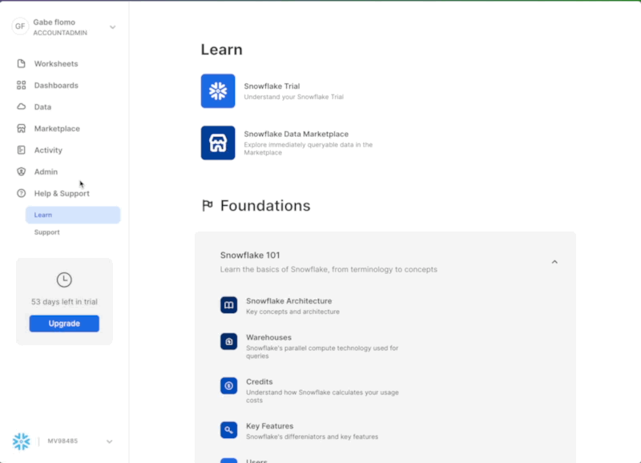

### Workflow roadblocks
The following issues may occur if you have an existing Hex account and you're not an Admin in that org.

**Unauthorized error**
> If you have an existing Hex account that was created with a password and username, you may run into an "Unauthorized" error when activating your workspace in Partner Connect. If this is your experience, head over to [hex.tech](https://hex.tech) and login with your password and username. 

**Plan upgrade**
> If you are an existing Hex user currently on a Community plan, you may encounter an issue that will prevent you from using Partner Connect. If you’re unclear on what Hex plan you are on, feel free to reach out to [support@hex.tech](mailto:support@hex.tech). If you are the Admin of your organization, you can see your plan under Manage plan on the Settings page. To extend a trial, email [support@hex.tech](mailto:support@hex.tech) with the subject "VHOL trial extension."

**Role privileges**
> If you do not have an Editor role or higher, you won't be able to create data connections in your workspace. To upgrade your role, contact your workspace Admin. You can find out who this is by navigating to Settings -> Users & groups within your Hex workspace.

*If you're still encountering issues, or encounter any issues other than the ones listed above, please contact our support team [support@hex.tech](mailto:support@hex.tech) with the subject "VHOL" for priority support.*

### Creating a workspace
Once activated, you'll be brought over to Hex and will be prompted to create/name your new workspace. After you've named your workspace, you'll be brought to the [projects](https://learn.hex.tech/docs/getting-started/intro-to-projects#projects-home) page where you can create new projects, import existing projects (Hex or Jupyter) as well as navigate to other sections of your workspace.

### Enabling ORGADMIN

We'll revisit your newly created workspace in a bit, but for now, head back over to Snowflake. Let's navigate to the `Admin` tab again but this time select `Users & roles`. From here, you should see 3 users with one of them being named `PC_HEX_USER`. This is the user that was created when you activated Hex with partner connect. We'll need to activate the `ORGADMIN` role for this user. Select `PC_HEX_USER`, and at the bottom of the page you'll see a section to grant new roles.

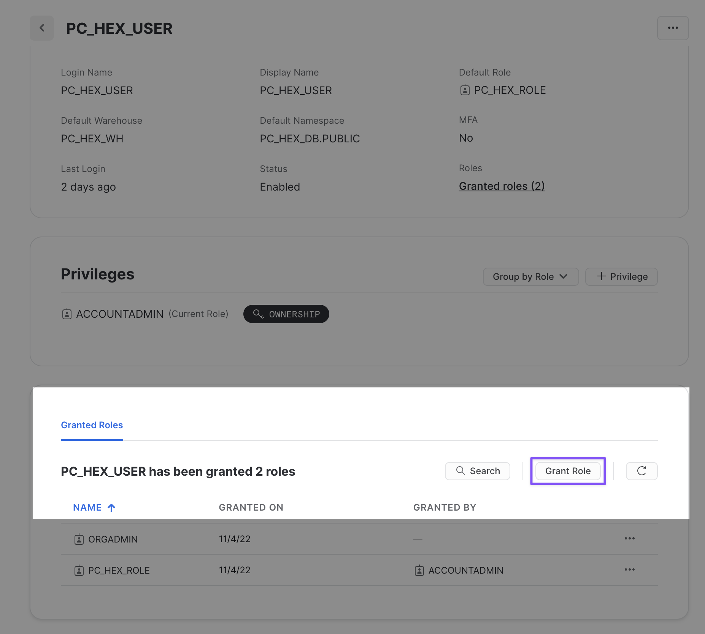

Click on grant role, which will open a window to grant roles to the `PC_HEX_USER` account. In the `Role to grant` dropdown, you'll see the role `ORGADMIN`. Select this role and then click `Grant`. We will revisit this step in a later section.


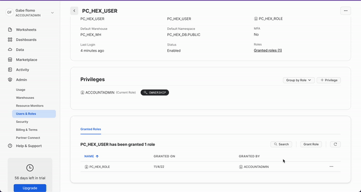

<!-- ### Configuring the Snowflake data connection in Hex
Next, we'll need to tweak the configurations of our data connection a bit. Head over to Hex, click on `Projects` and then navigate to the  `Settings` page. On the left side of the screen, you'll see a section called `Workspace settings` with the subcategory `Workspace assets`, this is where we can edit our data connection settings. 

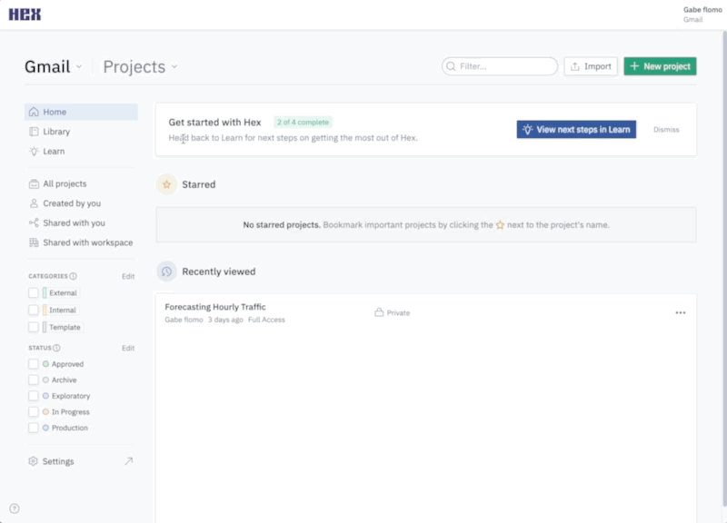

Inside of the Workspace assets page, you'll see your data connections at the top with a Snowflake data connection created by partner connect. You can configure the connection settings by clicking the 3-dot menu and selecting edit. 


Inside of the data connection configuration page, we'll change 3 things
* Remove `.Snowflakecomputing.com` from the Account name.
* Turn `Proxy` off.
* Enable `Writeback` functionality.

 -->

<!-- ### Accepting Anaconda terms

The last thing we'll want to do is accept the [Anaconda terms and conditions enabled by the ORGADMIN](https://docs.Snowflake.com/en/developer-guide/udf/python/udf-python-packages.html#using-third-party-packages-from-anaconda) role we granted ourselves access to earlier. To do this, navigate back to Snowflake and click on your username in the top left corner. You'll see a section that will allow you to switch to the ORGADMIN role. Once switched over, navigate to the `Admin` tab and select `Billing & Terms`. From here, you will see a section that will allow to accept the anaconda terms and conditions which is required for a later step in our project.

 -->

<!-- ------------------------ -->
## Getting Started with Hex
Duration: 5

Now we can move back over to Hex and get started on our project. The first thing you'll need to do is download the Hex project that contains all of the code for generating our data and training our model.

<button>


[Download Hex project](https://static.hex.site/Forecasting%20Hourly%20Traffic.yaml)

</button>

Once downloaded, head over to Hex and you'll see a button to import a project in the upper right corner. Select `import` and upload the file that we just downloaded above.  

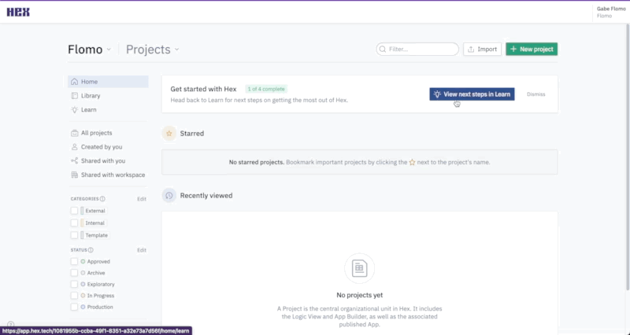

Now that you've got your project imported, you will find yourself in the [Logic view](https://learn.hex.tech/docs/develop-logic/logic-view-overview) of a Hex project. The Logic view is a notebook-like interface made up of cells such as code cells, markdown cells, input parameters and more! On the far left side, you'll see a control panel that will allow you to do things like upload files, import data connections, or search your project. Before we dive into the code, we'll need to:
1. Change our compute profile to run Python 3.8
2. Import our Snowflake data connection

Which we can do all from the left control panel. To change the compute profile, click on the Environments tab represented by a cube. At the top of this section you'll see the compute profile portion at the top. Click on the `Image` dropdown and select Python 3.8. 


Next we can import our Snowflake data connection by heading over to the `Data sources` tab represented by a database icon with a lightning bolt. At the bottom of this section, you'll see a portion that says available workspace connections and you should see one that says Snowflake. Once you import this connection, all the setup steps will be completed and we can dive into the project. 


## Install and import required packages
Duration: 3

The first thing we'll want to do is make sure that all of the packages we want to use are installed and imported. Hex comes with a variety of [pre-installed](https://learn.hex.tech/docs/environment-configuration/using-packages#use-a-pre-installed-package) packages and also supports [installing new packages through pip](https://learn.hex.tech/docs/environment-configuration/using-packages#install-new-packages-through-pip). You can run this cell to install the packages: 


Notice that running the cell doesn't actually install the packages and the output prompts us to click the button above the cell in order to install. This is because this cell is being controlled by a [button input parameter](https://learn.hex.tech/docs/logic-cell-types/input-parameter-cells/run-button), which allows you to control when and how your code gets executed. If you take a look under the button input parameter, you'll see an output variable named `install`. This variable is set to true whenever the button is activated, resulting in any conditional logic to be executed.

Clicking the button will install the packages.


## Establishing a connection to Snowflake
Duration: 3

Now, we can connect to our Snowflake connection that we imported earlier. To do this head over to the data sources tab on the left control panel to find your Snowflake connection. If you hover your mouse over the connection, you'll see a `query` option appear at the bottom. This will allow us to query this connection in an SQL cell, however, what we want to do is create a Snowpark session using this connection. Click on the dropdown next to the `query` button and select `get Snowpark session`. What this will do is create a new cell for us with all the code needed to spin up a Snowpark session.


*The cell created by this button will be positioned under the cell that is currently selected. Make sure that the cell you have selected is the markdown cell with the header "Establishing a secure connection to Snowflake." You'll know if this cell is selected because it'll be outlined in blue.*


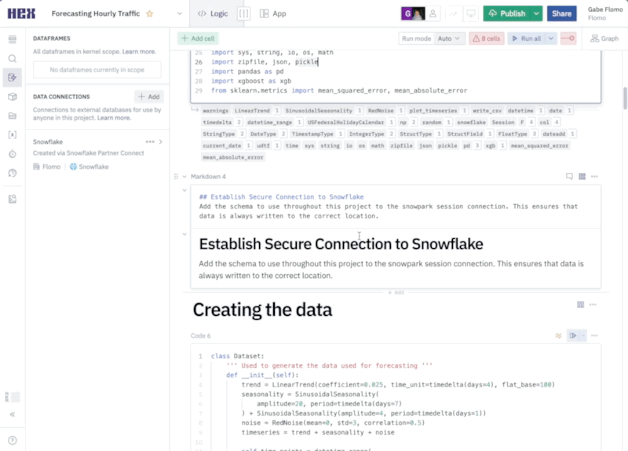

We'll also add the following two lines at the end of the cell to let Snowpark know which schema and database we want to use throughout the project.

```python
hex_snowpark_session.use_schema("PC_HEX_DB.PUBLIC")
hex_snowpark_session.use_database(database='PC_HEX_DB')
```

In this cell, we reference our Snowpark session with the variable `hex_snowpark_session` which is the name assigned by default. Throughout the rest of the project however, we reference our Snowpark session with the variable name `session`. The most effective way to change the name of variables in Hex is to change the name of the output variable located at the bottom of the cell rather than in the cell itself. By changing the name of the output variable, we ensure that all other references to that variable are updated throughout the entirety of the project.


## Generating our forecasting data
Duration: 8

<!-- Not sure how much detail I should go into here -->

In order to train our forecasting model, we'll need to show it historical data so that it can have a source to learn from. In code cell 7, we've defined a class that does all the heavy lifting for us and we can generate the data we need with a single function call. In code cell 8, we're creating an instance of our dataset class so that we can use this object in the following cells. In code cell 9, we're calling the `create_traffic_table()` function which will return a dataframe with the hourly traffic data from 2018 up until now. The final data generation step in code cell 10 creates a calendar table that includes the day of the week, month of the year, holidays, etc.

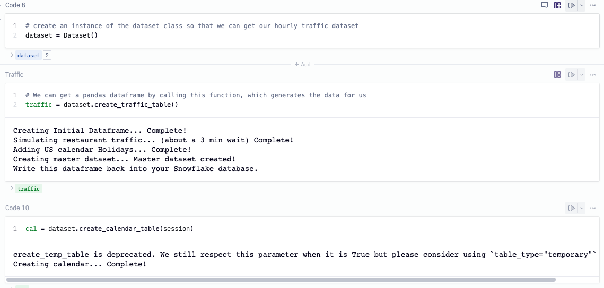

<!-- Ask chase what exactly the holiday table is for, also maybe check out the presentation that he sent. https://www.Snowflake.com/blog/Snowpark-python-feature-engineering-machine-learning/ -->

## Write the data back to Snowflake
Duration: 5

Now that we've created our data, we're going to write our tables back to Snowflake. To do this, we'll use one of Hex's utility cells called the [writeback cell](https://learn.hex.tech/docs/logic-cell-types/writeback-cells). What this cell does is exactly what it sounds like, writes data back to a database. If you hover your mouse under the header "Write data back to database" an element to add a new cell will appear. Click on this element to see a panel of all the different cell types available and you'll find writeback under utilities. 

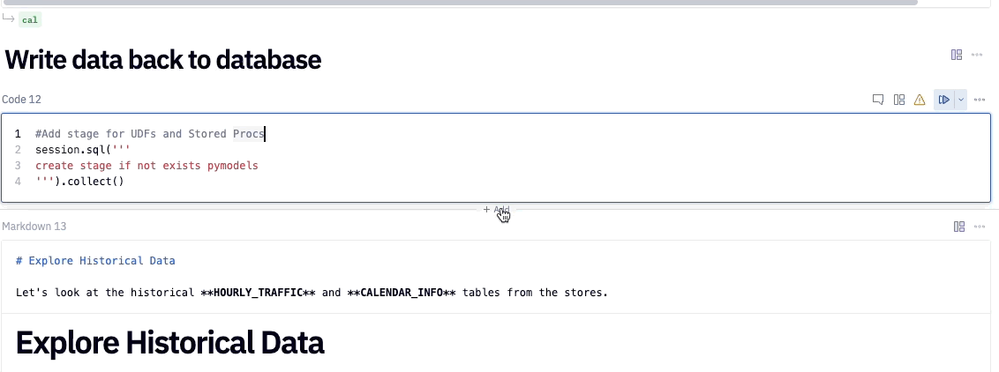

Using this cell is quite simple. First we'll need choose the source data from the dataframes currently in the project that we want to write back into Snowflake. The first dataframe we'll want to write back is our `traffic` dataframe, so we'll choose `traffic` from our list. The next step is to select our Snowflake connection as the warehouse that we want to write the data to. Once complete, we'll choose the database and schema, then we can name our table. For the database, choose `PC_HEX_DB` and use the `PUBLIC` schema. For the table name, use `HOURLY_TRAFFIC`.


You can repeat these same steps for the `cal` dataframe, the only change to make here is naming the table `CALENDAR_INFO`.


To write the data back to our database, we'll want to enable the cell by clicking on the disabled button in the top right corner and selecting `Logic session`. To initiate the writeback, run the cell.


## Exploring the Historical data
Duration: 3

Now that we have our data back in Snowflake, we can use our Snowpark session object to pull our data back into Hex using the function `session.table()` with the name of our tables as arguments. By calling the `toPandas` function, we can preview the table in Hex.

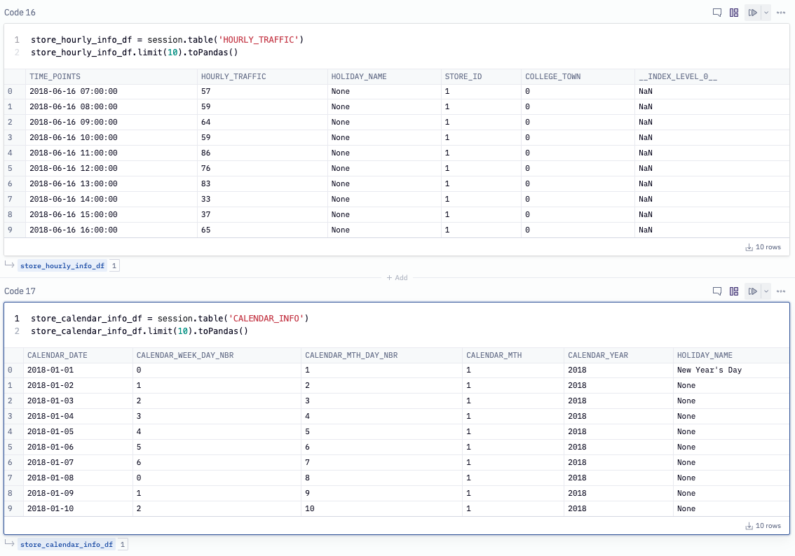

## Feature Engineering
Duration: 5

To create our training dataset we'll use our tables pulled in from Snowflake and join them together. We extract the date and hour from the `TIME_POINTS` column in the traffic table and join on the `DATE` column in the calendar table. We've also filtered out records between the hours of 10pm and 7am which is when the restaurants are closed. This table will be the input to our XGBoost model where we'll index on the `TIME_POINTS` column, the rest of the columns will be our features and `HOURLY_TRAFFIC` is the value we want to predict.

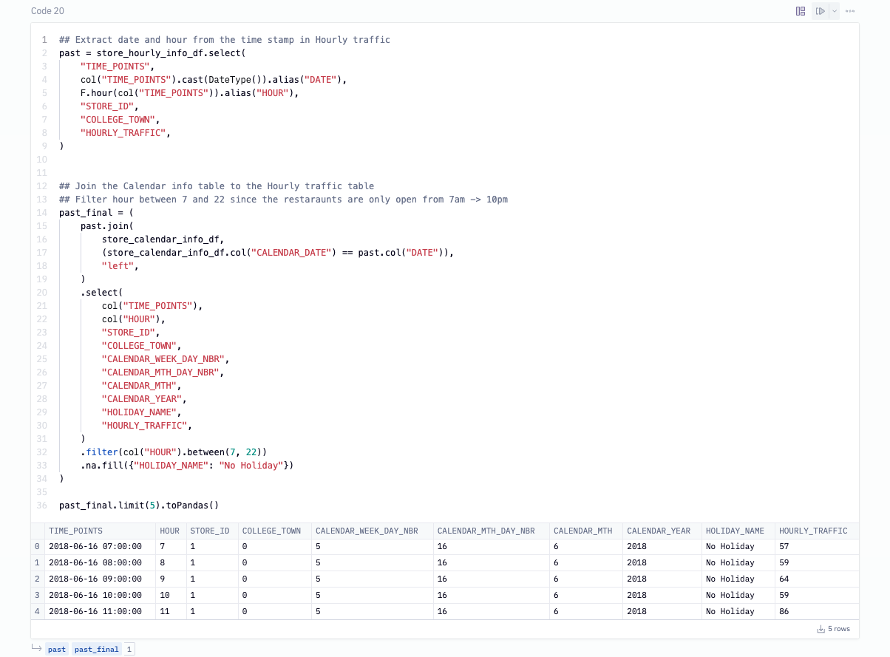

To run a forecast using XGBoost, not only do we need to provide the historical values but we will need the future ones as well. To do this, we'll create a column that will have the hourly records for the next 4 weeks and filtering out the closed hours. Then, we [cross join](https://www.w3resource.com/sql/joins/cross-join.php) this column with the `HOURLY_TRAFFIC` table such that each store has these future values.

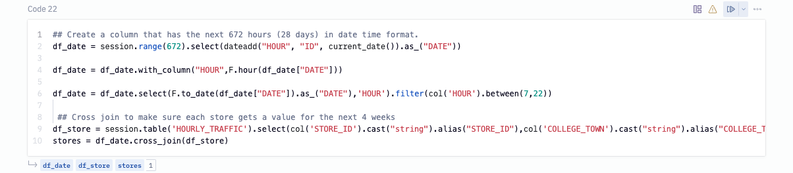

Next, we want to also add in the calendar features for the next 4 weeks while also replacing nulls for the holiday column. We can then join the future hourly traffic with the future calendar info to get our final future table. Since we don't know what the traffic will be like in the future, we've filled that columns with 0s and it will be replaced with the predictions once we run our forecast.

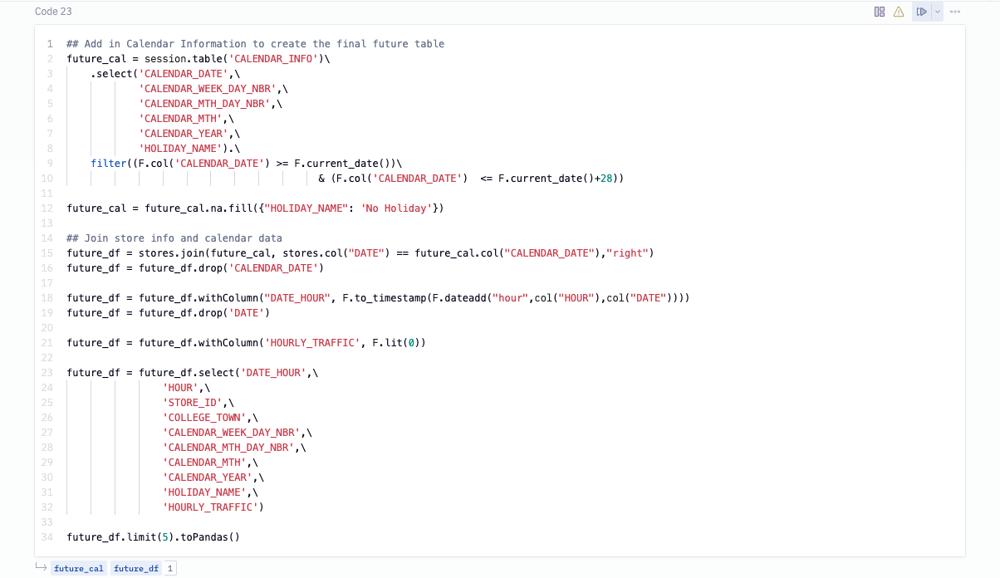

As the last step, we combine the past and future tables together in order to obtain our final training table. Then we can write this table back to Snowflake by calling `write.saveAsTable()` on our joined dataframe.

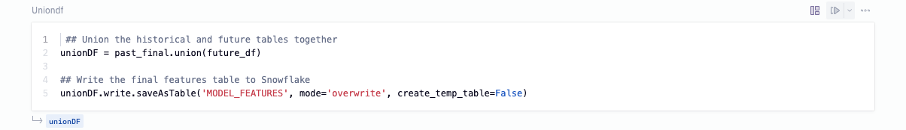


## Training the model
Duration: 10

The objective here is to provide a store level forecast across the restaurant's 200 locations, which means we need to train 200 individual forecast models. By leveraging a UDTF, we're able to distribute the processing across multiple nodes and train our model in parallel. First, we'll define the output schema for the UDTF.

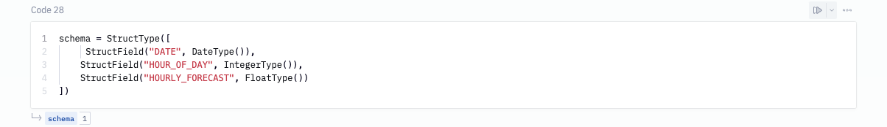

We can register our UDTF using the decorator and specify the required parameters such as the output and input types, name of the UDTF, and required packages. Because the same packages and versions are being installed in Snowflake, Snowpark automatically picks up and resolves these dependencies on the server side using the integrated Conda package manager ensuring all our code runs seamlessly inside of Snowflake.

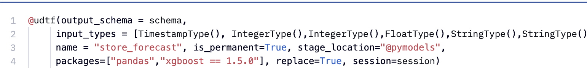

To get a high level overview of the forecast class, the init method initializes the processing of input partitions. The process method is invoked for each input drill, and the end partition method is invoked to finalize the processing of input partitions. In the end partition method, we set the datetime column as our index. We then convert all variables to categorical, then encode our features since the XGBoost model expects all numerical inputs. Next, we split our data into train and test sets and pass the training data to our XGBoost model.


### Accepting Anaconda terms


At this point, you are going to run into an error when running the cell that defines the UDTF. This is because we haven't yet accepted the Anaconda terms and conditions. In this step, we'll go over how to accept the [Anaconda terms and conditions enabled by the ORGADMIN](https://docs.Snowflake.com/en/developer-guide/udf/python/udf-python-packages.html#using-third-party-packages-from-anaconda) role we granted ourselves access to earlier. To do this, navigate back to Snowflake and click on your username in the top left corner. You'll see a section that will allow you to switch to the `ORGADMIN` role. Once switched over, navigate to the `Admin` tab and select `Billing & Terms`. From here, you will see a section that will allow you to accept the anaconda terms and conditions. Once this is done, you can head back over to Hex and run the cell that defines our UDTF.


### Using our forecasting model

Now that we've developed our training code, to get our predictions without moving any data out of Snowflake, all we need to do is call the UDTF on the model features we created earlier. The UDTF runs the model on the historical data and returns the forecast for the hourly traffic.


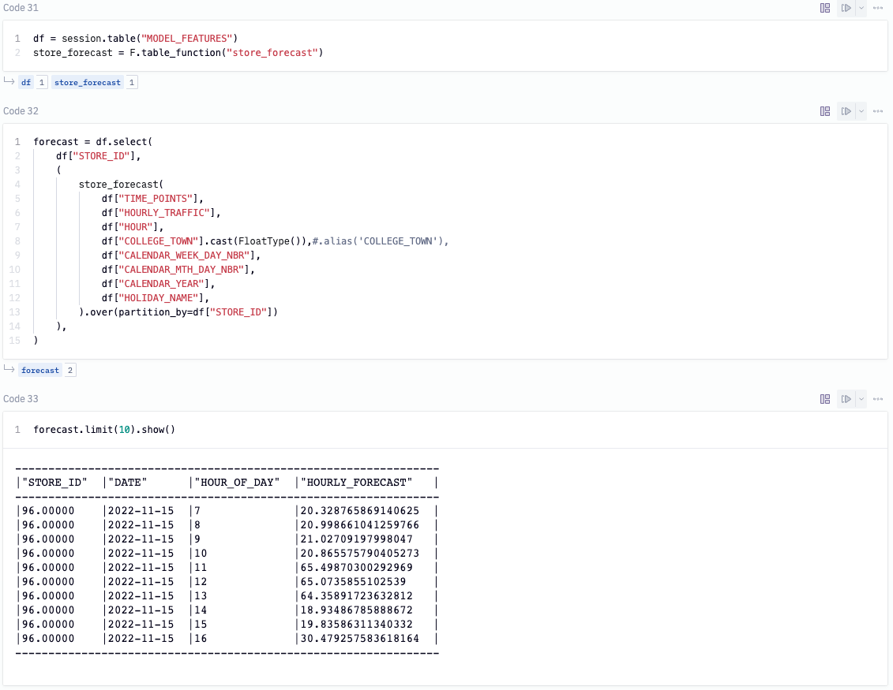

As a last step, we can write the predicted values back into our Snowflake database. To do this, we'll call `write.saveAsTable('FOUR_WEEK_FORECAST', mode='overwrite', create_temp_table=False)` on our forecast model.

If you want to see a performance boost at this step, you can upgrade the size of the warehouse that processes our model. To do this, head back over to Snowflake and select `Warehouses` under the `Admin` tab. Here, you should only see a single warehouse that we can edit. Click the 3-dot menu on the far right and select edit. You'll see a dropdown to change the size of your warehouse. If the model is already running, you may want to cancel and run again in order to run on the new warehouse.


## Visualizing the results
Duration: 5

Now that we have our data in Snowflake, we can pull the predicted values back into Hex using an SQL cell. To do this, add a new SQL cell to the project and paste the following snippet into the cell.

```sql
select * from "PC_HEX_DB"."PUBLIC"."FOUR_WEEK_FORECAST"
```

By default, the output of SQL cells in Hex are dataframes. This allows us to seamlessly switch between SQL and Python where the dataframe can be further manipulated in any Python cell. You can even query it again using [dataframe SQL](https://learn.hex.tech/docs/logic-cell-types/sql-cells/overview#dataframe-sql). 


Here, we've taken the results of our query and combined the `DATE` and `HOUR_OF_DAY` columns into a datetime column so that we can visualize the traffic per hour. 

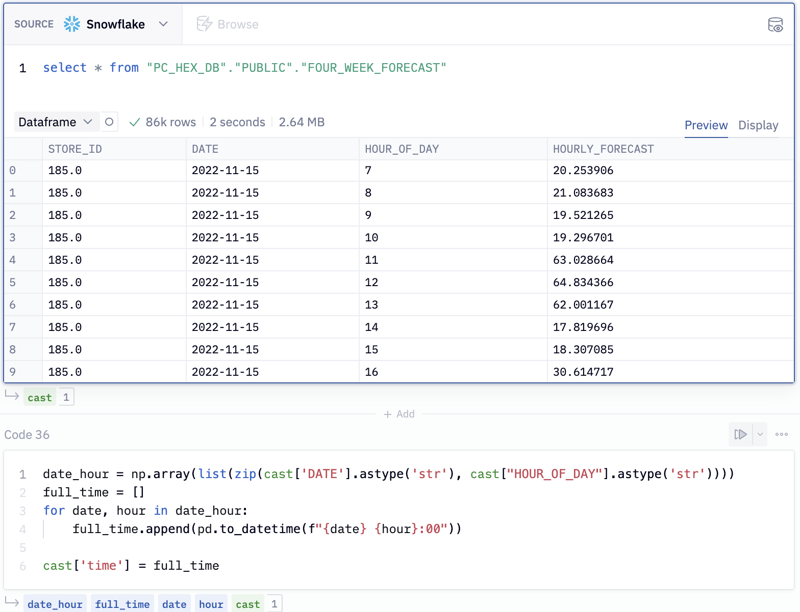

We can use a native Hex chart to build up this visual. First, hover over the output variable `cast` under cell 36. You'll see a panel appear with the option to visualize in a chart cell. Select this option and select `time` as the x-axis variable and `HOURLY_FORECAST` as the y-axis variable. 


Once selected you will see this visual appear:

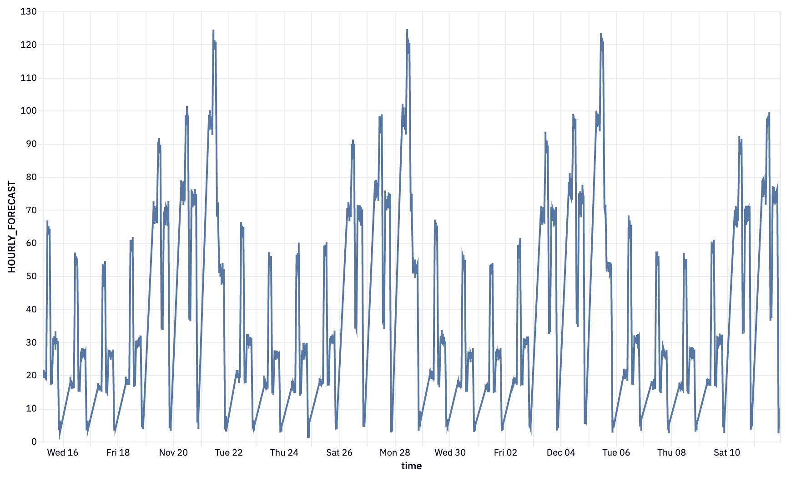

## Sharing our results
Duration: 3

Now that we've completed going through our project, how can we share this project with others? First, we might want to arrange our cells and also hide some of the logic that isn't super important for understanding how to build a forecast model. To do this we can head over to the app side of things. At the top of your project, you'll see a button showing if you're in the logic or app view. By switching over to the app side of things, we can start arranging our cells and adding/removing them as we see fit. Check out the [Hex docs](https://learn.hex.tech/docs/build-apps/app-builder) to learn about how you can effectively use the app builder.


Once we're happy with the layout, we can go a head and publish. Publishing is like taking a snapshot of the current state of our app and publishing it as an interactive web app that anyone can see. To publish, hit the green publish button in the top right corner. Once that's done, hit the blue share button next to publish, and select `Publish to web`. Whoever you share the link with will be able to see the live version of your app.


<!-- ***The "Publish with errors" is expected. When publishing an app, the project runs from top to bottom on a fresh kernel. This means that the packages we installed in the beginning haven't been installed yet because we haven't clicked the button yet. So when we try to import a package that hasn't been installed yet, we get the error. Running this button while publishing will resolve the error.*** -->

## Conclusion
Congratulations on on making it to the end of this Lab! You can view the published version of this [project here](https://app.hex.tech/810c3d49-47a5-470c-9eaa-f471548c9620/app/af138a51-cae9-4300-9aee-6805afe6e699/latest)!

### What we've covered
- Use Snowflake’s “Partner Connect” to seamlessly create a Hex trial
- How to navigate the Hex workspace/notebooks
- How to train an XGBoost model and deploy to Snowflake using UDTFs

### Resources
- [Hex docs](https://learn.hex.tech/docs)
- [Snowflake Docs](https://docs.Snowflake.com/en/)
- [UDTFs](https://docs.Snowflake.com/en/developer-guide/udf/sql/udf-sql-tabular-functions.html)


