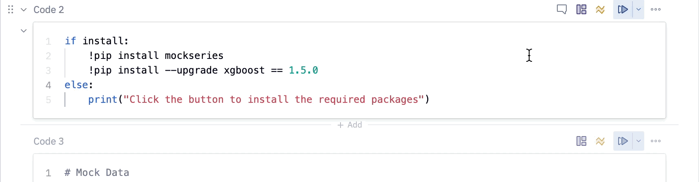

author: miles.adkins@snowflake.com
id: hex
summary: This lab will walk you through how to use Snowflake and Hex.
categories: Getting Started
environments: web
status: Published
feedback link: https://github.com/Snowflake-Labs/sfguides/issues
tags: Hex, Notebooks, Partner Connect

# Building and deploying a time series forecasts with Hex + Snowflake

<!-- ------------------------ -->
## Lab Overview 
Duration: 5

{use case / lab overview}

Hex is a platform for doing collaborative data science and analytics in Python, SQL, and No-code. In this guide, you will be introduced to the basics of using Hex in collaboration with Snowflake/Snowpark to build a data science project. It is designed specifically for use with the [Snowflake free 30-day trial](https://trial.snowflake.com), and a Hex trial account via Snowflake’s Partner Connect.

This lab will walk you through the process of creating a forecasting model to predict the hourly foot traffic for various restaurants. We will then take our trained model and deploy it to Snowflake through the use of a User-Defined Table Function or UDTF. Once our function is 

### Prerequisites
- Familiarity with basic Python and SQL 
- Familiarity with training ML models
- Familiarity with data science notebooks

### What You'll Learn
- Use Snowflake’s “Partner Connect” to seamlessly create a Hex trial


### What You’ll Need
- A [Snowflake](https://signup.snowflake.com/) Account (if you are using an enterprise account through your organization, it is unlikely that you will have the privileges to use the `ACCOUNTADMIN` role, which is required for this lab).

### What You’ll Build
An end-to-end Machine Learning pipeline to forecast hourly traffic for a restaurant chain using Hex, Snowflake, Snowpark, and XGBoost.

This pipeline will:
- Generate the hourly restaurant data used for training the model
- Write your data back to Snowflake using writeback cells
- Train an XGBoost forecasting model
- Deploy the trained model as a UDTF
- Use the model to make predictions on future data


<!-- ------------------------ -->
## Connecting Snowflake with Hex
Duration: 5

At this point in time, we have our data sitting in an optimized table within Snowflake that is available for a variety of different downstream functions. Snowflake does not offer notebook capabilities, and therefore, happily partners with the leading cloud notebook  partners in the industry.

Once you've logged into your Snowflake account, you'll land on the `Learn` page. Simply navigate to the `Admin` tab on the left and click `Partner connect`. In the search bar at the top, type in `Hex`, and you should see the Hex partner connect tile appear. Clicking on the tile will bring up a connection screen, and all that's required is to press the connect button in the lower right corner. This will bring you to a new screen saying that your account has been created and from here you can click `Activate`.


Once activated, you'll be brought to a Hex screen asking you what you'd like to name your Hex workspace *(you can choose whatever name you like)*. Once you've created your workspace, head back over to Snowflake and navigate to the `Admin` tab again but this time select `Users & roles`. From here, you should see 3 users with one of them being named `PC_HEX_USER`. This is the user that was created when you activated Hex with partner connect. We'll need to activate the `ORGADMIN` role for this user. Select `PC_HEX_USER`, and at the bottom of the page you'll see a section to grant new roles.


Click on grant role, which will open a window to grant roles to the `PC_HEX_USER` account. In the `Role to grant` dropdown, you'll see the role `ORGADMIN`. Select this role and then click `Grant`. This will activate the role for you and we'll come back to this later.


### Configuring the Snowflake data connection in Hex
Next, we'll need to tweak the configurations of our data connection a bit. Head over to Hex, click on `Projects` and then navigate to the  `Settings` page. On the left side of the screen, you'll see a section called `Workspace settings` with the subcategory `Workspace assets`, this is where we can edit our data connection settings. 


Inside of the Workspace assets page, you'll see your data connections at the top with a Snowflake data connection created by partner connect. You can configure the connection settings by clicking the 3-dot menu and selecting edit. 


Inside of the data connection configuration page, we'll change 3 things
* Remove `.snowflakecomputing.com` from the Account name.
* Turn `Proxy` off.
* Enable `Writeback` functionality.


The last thing we'll want to do is accept the [Anaconda terms and conditions enabled by the ORGADMIN](https://docs.snowflake.com/en/developer-guide/udf/python/udf-python-packages.html#using-third-party-packages-from-anaconda) role we granted ourselves access to earlier. To do this, navigate back to Snowflake and click on your username in the top left corner. You'll see a section that will allow you to switch to the ORGADMIN role. Once switched over, navigate to the `Admin` tab and select `Billing & Terms`. From here, you will see a section that will allow to accept the anaconda terms and conditions which is required for a later step in our project.


<!-- ------------------------ -->
## Getting Started with Hex
Duration: 10

Now we can move back over to Hex and get started on our project. The first thing you'll need to do is download the Hex project that contains all of the code for generating our data and training our model.

<button>

[Download Hex project](https://static.hex.site/Forecasting%20Hourly%20Traffic.yaml)

</button>

Once downloaded, head over to Hex and you'll see a button to import a project in the upper right corner. Select `import` and upload the file that we just downloaded above.  


Now that you've got your project imported, you will find yourself in the [Logic view](https://learn.hex.tech/docs/develop-logic/logic-view-overview) of a Hex project. On the far left side, you'll see a control panel that will allow you to do things like upload files, import data connections, or search your project. Before we dive into the code, we'll need to:
1. Change our compute profile to run Python 3.8
2. Import our Snowflake data connection

Which we can do all from the left control panel. To change the compute profile, click on the Environments tab represented by a cube, at the top of this section you'll see the compute profile portion at the top. CLick on the `Image` dropdown and select Python 3.8. 


Next we can import our Snowflake data connection by heading over to the `Data sources` tab represented by a database icon with a lightning bolt. At the bottom of this section, you'll see a portion that says available workspace connections and you should see one that says Snowflake. Once you import this connection, all the setup steps will be completed and you can dive into the project. 


## Install and import required packages
The first thing we'll want to do is make sure that all of the packages we want to use are installed and imported. Hex comes with a variety of [pre-installed](https://learn.hex.tech/docs/environment-configuration/using-packages#use-a-pre-installed-package) packages and also supports [installing new packages through pip](https://learn.hex.tech/docs/environment-configuration/using-packages#install-new-packages-through-pip). You can run this cell to install the packages: 



Notice that running the cell doesn't actually install the packages and the output prompts us to click the button above the cell in order to install them. This is because this cell is being controlled by an input parameter. Specifically, we're using a button which allows you to control when and how your code gets executed. If you take a look under the button input parameter, you'll see an output variable named `install`. This variable is set to true whenever the button is activated, resulting in any conditional logic to be executed once this occurs.

Let's follow the buttons instructions now and click it to install the packages.


## Establishing a connection to Snowflake
Now, we can connect to that Snowflake connection that we imported earlier. To do this head over to the data sources tab on the left control panel to find your Snowflake connection. If you hover your mouse over the connection, you'll see a `query` option appear at the bottom. This will allow us to query this connection in an SQL cell, however, what we want to do is create a snowpark session using this connection. Click on the dropdown next to the `query` button and select `get snowpark session`. What this will do is create a new cell for us with all the code needed to spin up a snowpark session.

```
 The cell created by this button will be positioned under the cell that is currently selected. Make sure the the cell you have selected is the markdown cell with the 
 
 header "Establishing a secure connection to Snowflake." You'll know if this cell is selected because it'll be outlined in blue.
```


We'll also add a two lines at the end of the cell to let snowpark know which schema and database we want to use throughout the project.

```python
hex_snowpark_session.use_schema("PC_HEX_DB.PUBLIC")
hex_snowpark_session.use_database(database='PC_HEX_DB')
```

In this cell, we reference our snowpark session with the variable `hex_snowpark_session` which is the name assigned by default. Throughout the rest of the project however, we reference our snowpark session with the variable name `session`. The most effective way to change the name of variables in Hex is to change the name of the output variable located at the bottom of the cell rather than in the cell itself. By changing the name of the output variable, we ensure that all other references to that variable are updated throughout the entirety of the project.


## Generating our forecasting data
<!-- Not sure how much detail I should go into here -->

In order to train our forecasting model, we'll need to show it historical data so that it can have a source to learn from. In code cell 7, we've defined a class that does all the heavy lifting for us and we can generate the data we need with a single function call. In code cell 8, we're creating an instance of our dataset class so that we can use this object in the following cells. In code cell 9, we're calling the `create_traffic_table()` function which will return a dataframe with the hourly traffic data from 2018 up until now. The final data generation step in code cell 10 creates a calendar table that includes the day of the week, month of the year, holidays, etc.


<!-- Ask chase what exactly the holiday table is for, also maybe check out the presentation that he sent. https://www.snowflake.com/blog/snowpark-python-feature-engineering-machine-learning/ -->

## Write the data back to snowflake
Now that we've created our data, we're going to write our tables back to snowflake. To do this, we'll use one of Hex's utility cells called the [writeback cell](https://learn.hex.tech/docs/logic-cell-types/writeback-cells). What this cell does is exactly what it sounds like, writes data back to a database. If you hover your mouse under the header "Write data back to database" an element to add a new cell will appear. Click on this element to see a panel of all the different cell types available and you'll find writeback under utilities. 


Using this cell is quite simple. First we'll need choose the source data from the dataframes currently in the project that we want to write back into Snowflake. The first dataframe we'll want to write back is our `traffic` dataframe, so we'll choose `traffic` from our list. The next step is to select our Snowflake connection as the warehouse that we want to write the data to. Once complete, we'll choose the database and schema, then we can name our table. For the database, choose `PC_HEX_DB` and use the `PUBLIC` schema. For the table name, use `HOURLY_TRAFFIC`.


You can repeat these same steps for the `cal` dataframe, the only change is that we'll name the table `CALENDAR_INFO`.


To write the data back to our database, we'll want to enable the cell by clicking on the disabled button in the top right corner and selecting `Logic session`. To initiate the writeback, run the cell.


## Exploring the Historical data
Now that we have our data back in Snowflake, we can use our snowpark session object to pull our data back into Hex using the function `session.table()` with the name of our tables as arguments. By calling the `toPandas` function, we can preview the table in Hex.


## Feature Engineering
To create our training dataset we'll use our tables pulled in from snowflake and join them together. We extract the date and hour from the `TIME_POINTS` column in the traffic table and join on the `DATE` column in the calendar table. We've also filtered out records between the hours of 10pm and 7am which is when the restaurants are closed. This table will be the input to our XGBoost model where we'll index on the `TIME_POINTS` column, the rest of the columns will be our features and `HOURLY_TRAFFIC` is the value we want to predict.


To run a forecast using XGBoost, not only do I need to provide the historical values but I will need the future ones as well. To do this, we'll create a column that will have the hourly records for the next 4 weeks and filtering out the closed hours. Then, we [cross join](https://www.w3resource.com/sql/joins/cross-join.php) this column with the `HOURLY_TRAFFIC` table such that each store has these future values.


Next, we want to also add in the calendar features for the next 4 weeks while also replacing nulls for the holiday column. We can then join the future hourly traffic with the future calendar info to get our final future table. Since we don't know what the traffic will be like in he future, we've filled that columns with 0s and will be replaced with the predictions once we run our forecast.


As the last step, we combine the past and future tables together in order to obtain our final training table. Then we can write this table back to snowflake by calling `write.saveAsTable()` on our joined dataframe.


## Training the model
The objective 

## Visualizing the results