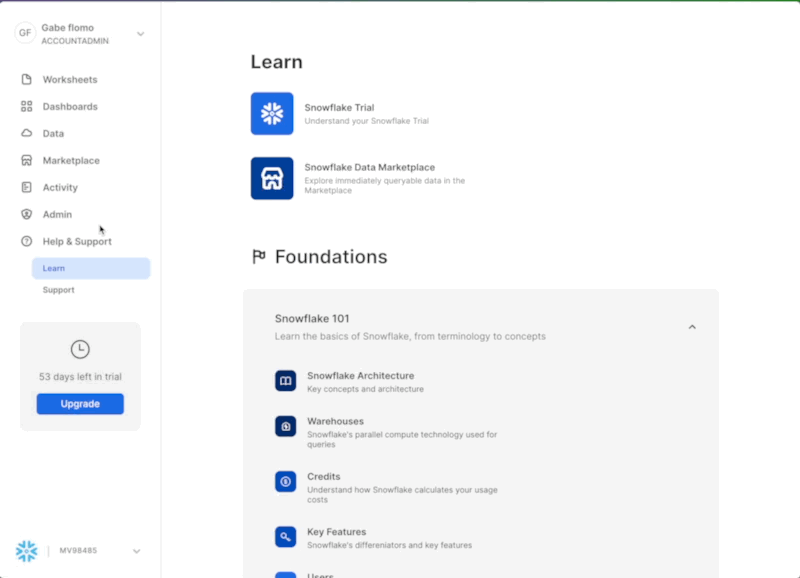
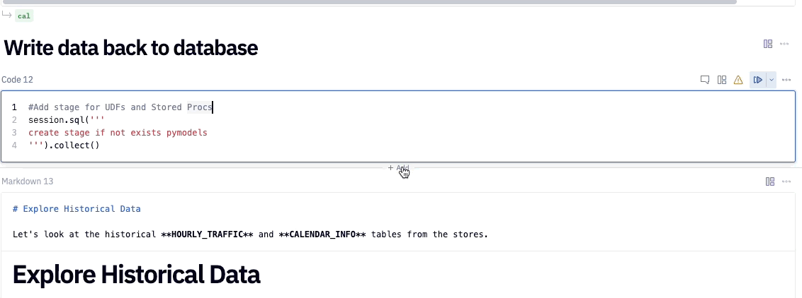

author: Armin Efendic
id: building_ml_models_in_minutes_with_hex_and_cortex
summary: This lab will walk you through how to use Cortex ML Functions and Hex.
categories: data-science-&-ml,partner-integrations
environments: web
status: Published
feedback link: https://github.com/Snowflake-Labs/sfguides/issues
tags: Hex, Notebooks, Partner Connect

# Building ML Models In Minutes With Hex And Cortex

<!-- ------------------------ -->
## Overview 
Duration: 5

In this quickstart, we will be utilizing the population gathered by the US Census Bureau. This dataset will be used to forecast population growth of various countries. The forecasting model we will use is the Cortex Forecast function. 

### Prerequisites
- Familiarity with basic Python and SQL 
- Familiarity with data science notebooks
- A [Snowflake](https://signup.Snowflake.com/) Account (if you are using an enterprise account through your organization, it is unlikely that you will have the privileges to use the `ACCOUNTADMIN` role, which is required for this lab).

Head over to the [Snowflake](https://signup.Snowflake.com/) sign-up page and register for a free account. Once you've registered, you'll get an email that will bring you to Snowflake so that you can sign in.

#### Connecting Snowflake with Hex
Once you've logged into your Snowflake account, you'll land on the `Learn` page. Simply navigate to the `Admin` tab on the left and click `Partner connect`. In the search bar at the top, type in `Hex`, and you should see the Hex partner connect tile appear. Clicking on the tile will bring up a new screen, and all you have to do is to press the connect button in the lower right corner. After this, you'll see a new screen confirming that your account has been created and from here you can click `Activate`.

#### Workflow roadblocks
The following issues may occur if you have an existing Hex account and you're not an Admin in that org.

**Unauthorized error**
> If you have an existing Hex account that was created with a password and username, you may run into an "Unauthorized" error when activating your workspace in Partner Connect. If this is your experience, head over to [hex.tech](https://hex.tech) and login with your password and username. 

**Plan upgrade**
> If you are an existing Hex user currently on a Community plan, you may encounter an issue that will prevent you from using Partner Connect. If you’re unclear on what Hex plan you are on, feel free to reach out to [support@hex.tech](mailto:support@hex.tech). If you are the Admin of your organization, you can see your plan under Manage plan on the Settings page. To extend a trial, email [support@hex.tech](mailto:support@hex.tech) with the subject "VHOL trial extension."

**Role privileges**
> If you do not have an Editor role or higher, you won't be able to create data connections in your workspace. To upgrade your role, contact your workspace Admin. You can find out who this is by navigating to Settings -> Users & groups within your Hex workspace.

*If you're still encountering issues, or encounter any issues other than the ones listed above, please contact our support team [support@hex.tech](mailto:support@hex.tech) with the subject "VHOL" for priority support.*

#### Creating a workspace
Once activated, you'll be brought over to Hex and will be prompted to create/name your new workspace. After you've named your workspace, you'll be brought to the [projects](https://learn.hex.tech/docs/getting-started/intro-to-projects#projects-home) page.

<!-- ------------------------ -->

### What You Will Learn
* How to perform model training using Cortex ML functions
* How to handle model training for multi-series datasets
* How to call the model for inference
* How to create charts in Hex and finally a Hex App

### What You Will Build
In this quickstart, you will create a few machine learning models using Cortex ML. In the end we will use our results and data exploration to create a final Hex app.
<!-- ------------------------ -->

## Getting Started with Hex
Duration: 5

Now we can move back over to Hex and get started on our project. The first thing you'll need to do is transfer the Hex project into your new Hex org.

<button>

[Get Hex project](https://app.hex.tech/hex-public/hex/12851f3a-23b7-4b92-887a-109231d6d5be/draft/logic)

</button>

Select Get a copy, select your new Hex org, and ensure the Hex project is in your new Hex org. 

Now that you've got your project, you will find yourself in the [Logic view](https://learn.hex.tech/docs/develop-logic/logic-view-overview) of a Hex project. The Logic view is a notebook-like interface made up of cells such as code cells, markdown cells, input parameters and more! On the far left side, you'll see a control panel that will allow you to do things like upload files, import data connections, or search your project. Before we dive into the code, we'll need to import our Snowflake connection to our project.

We can import our Snowflake data connection by heading over to the `Data sources` tab represented by a database icon with a lightning bolt. At the bottom of this section, you'll see a portion that says available workspace connections and you should see one that says Snowflake. Once you import this connection, all the setup steps will be completed and we can dive into the project. 

## Writing Data Back To Snowflake
Duration: 5

In this project we will write  data into our new Snowflake instance. To do this, we'll use one of Hex's utility cells called the [writeback cell](https://learn.hex.tech/docs/logic-cell-types/writeback-cells). What this cell does is exactly what it sounds like, writes data back to a database. If you hover your mouse under the header "Write data back to database" an element to add a new cell will appear. Click on this element to see a panel of all the different cell types available and you'll find writeback under utilities. 

Detailed instructions on how and when to utilize this type of cell is found in the Hex project.

## Hex Project
Duration: 45

The rest of the lab can entirely be followed step-by-step from the Hex project. Any subsequent steps and explanation will be found in the Hex project itself.

Key sections of the Hex project include:
- Data Gather and Clean Up
- Single Series Modeling
- Mutli-Series Modeling
- Hex app creation

## Sharing our results
Duration: 3

Now that we've completed going through our project, we can share this project with others! To do this:
- Head over to the app builder
- A pre-built layout has been designed but feel free to customize and add any additional elements
- To customize add, remove, and arrange cells. Check out the [Hex docs](https://learn.hex.tech/docs/build-apps/app-builder) for more info.
- Publish the app with the [Publish button](https://learn.hex.tech/docs/share-insights/apps/publish-and-share-apps)
- Lastly, hit the share button next to publish, and select `Publish to web`.

## Conclusion
Congratulations on making it to the end of this Lab! You can view a published version of this [project here](https://app.hex.tech/810c3d49-47a5-470c-9eaa-f471548c9620/app/af138a51-cae9-4300-9aee-6805afe6e699/latest)!

If you have any questions please feel free to reach out and connect with:
Chase Romano - [LinkedIn](https://www.linkedin.com/in/chase-romano-0aa4046b/)
Armin Efendic - [LinkedIn](https://www.linkedin.com/in/armin-efendic/)
