summary: Marketing Orchestration and Campaign Intelligence with Hightouch and Snowflake
id: hightouch-cdp
categories: snowflake-site:taxonomy/solution-center/certification/quickstart, snowflake-site:taxonomy/solution-center/certification/partner-solution, snowflake-site:taxonomy/solution-center/includes/architecture, snowflake-site:taxonomy/product/applications-and-collaboration
language: en
environments: web
status: Draft
feedback link: https://github.com/Snowflake-Labs/sfguides/issues
author: Luke Ambrosetti


# Marketing Orchestration and Campaign Intelligence with Hightouch and Snowflake
<!-- ------------------------ -->
## Overview 

Too often, marketers have limited access to their data. They must submit ad-hoc requests to data teams, rely on analysts to provide customer insights, and sporadically collect and upload manual customer list CSVs into their marketing and advertising platforms.
 
In this Quickstart, Snowflake and Hightouch will walk you through how to equip your business teams with powerful self-serve tools that transform Snowflake into a marketing engine that drives growth for your business. 

Using Hightouch, data teams from leading enterprises enable their marketing teams to independently improve campaign conversion, deliver captivating personalized customer experiences, and accelerate their marketing efforts - all with the power of the Marketing Data Cloud.

Hightouch offers teams the ability to implement a Composable Customer Data Platform. The product has all the features needed to transform Snowflake into a marketing-friendly platform that drives growth.

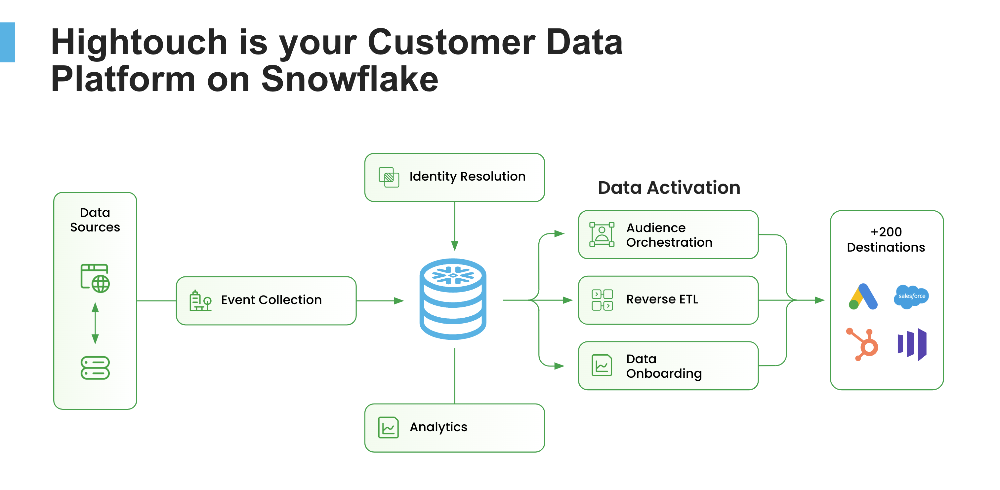

### What You Will Learn

This Quickstart is for both business teams and data teams but will focus on how data teams can set up visual UIs for their business teams to use. You'll be hands-on with a semantic layer, audience builder, and analytics suite, with the end goal of taking home a demo that should excite both your data and marketing teams.  

At the end of this Quickstart, you will successfully:
- Turn Snowflake into a Composable CDP that your marketing team can self-serve.
- Set up a self-serve audience builder that is fully customized to match your custom schema within Snowflake.
- Create a split test to measure the impact of a marketing campaign on key business metrics.
- Analyze the results of your split test with a suite of no-code analytics tools that pull insight directly from Snowflake.

Note: To complete this quickstart, you must have access to the advanced features of Hightouch. If completing outside of Snowflake hands-on labs, please reach out to the Hightouch team to get access. 

### Prerequisites

- Snowflake Account

You will need a Snowflake Account with ACCOUTADMIN access to install Hightouch via Partner Connect. If you don't have the correct permissions, you'll need to start a trial account, which the next section details.

<!-- ------------------------ -->
## Pre-work: Create Hightouch Workspace

***Important: You will need to set up a new workspace in Hightouch specifically for this lab. If you already have a Hightouch account, please create a new Workspace through Partner Connect as described in this section.***

### Log in to Snowflake

If you already have a Snowflake account, you can use your credentials to log in.  If you do not already have an account, you can visit [https://signup.snowflake.com/](https://signup.snowflake.com/?utm_source=snowflake-devrel&utm_medium=developer-guides&utm_cta=developer-guides) to sign up for a 30-day free trial.  You will want to make sure that the account you use in Snowflake has the permissions to create a new database, schema, and warehouse to be used by Hightouch.

### Set-up Hightouch through Partner Connect

You can set up a database, schema, and warehouse for use with Hightouch by setting up Hightouch through Partner Connect in Snowsight.  See the [detailed instructions](https://hightouch.com/blog/hightouch-snowflake-partner-connect) on the Hightouch Blog for more details.

1. Click the **Partner Connect** tab under **Data Products**.

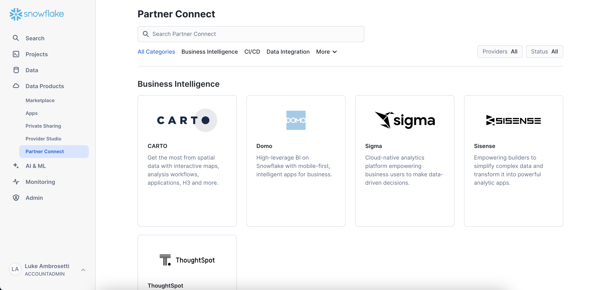

2. Search for Hightouch (or scroll to the **Data Integration** section), and select it.


3. View the Database, Warehouse, User, and Role that will be created for the integration, and click **Launch**.

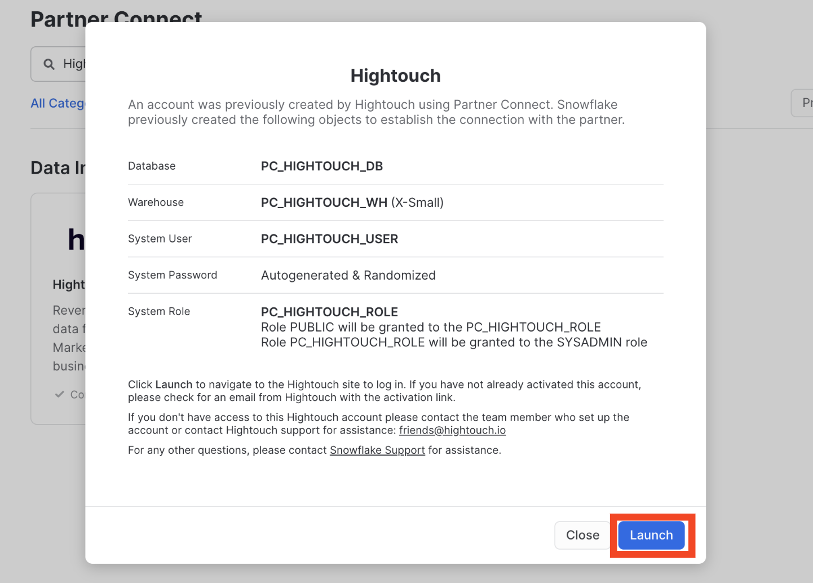

4. When the creation is complete, you will see a pop-up telling you that the creation has finished.  Click **Activate** to be taken to Hightouch to log in.


5. Create a new Workspace starting as "SNOWHOL-firstname-lastname". **Failure to follow this step will delay your start of the in-person lab.** If you are not running this quickstart as a part of a lab, ignore the naming convention for this step and reach out to Hightouch after creating your workspace.

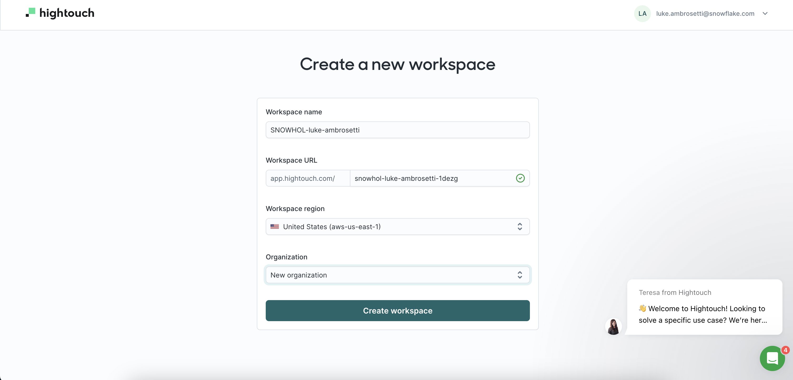

6. Log in to Hightouch using your Hightouch credentials, and you will have a Data Source from Snowflake created in Hightouch.

<!-- ------------------------ -->
## Pre-work: Load Sample Data

1. Copy the following SQL:

```sql
// Set context with appropriate privileges 
USE ROLE PC_HIGHTOUCH_ROLE;
USE DATABASE PC_HIGHTOUCH_DB;
USE SCHEMA PUBLIC;
// Create tables for demo
CREATE TABLE IF NOT EXISTS events (
    user_id VARCHAR(16777216),
    product_id VARCHAR(16777216),
    event_type VARCHAR(16777216),
    timestamp DATE,
    quantity INT,
    price NUMBER(38,2),
    category VARCHAR(16777216)
);
CREATE TABLE IF NOT EXISTS users (
    id VARCHAR,
    first_name VARCHAR(16777216),
    last_name VARCHAR(16777216),
    email VARCHAR(16777216),
    gender VARCHAR(16777216),
    birthday DATE,
    city VARCHAR(16777216),
    state VARCHAR(16777216),
    phone VARCHAR(16777216)
);

// Create file format 
CREATE OR REPLACE FILE FORMAT mycsvformat
   TYPE = 'CSV'
   FIELD_DELIMITER = ','
   SKIP_HEADER = 1;

// Create external stage
CREATE OR REPLACE STAGE my_csv_stage 
  FILE_FORMAT = mycsvformat
  URL = 's3://ht-snow-quickstart-hol';

// Run COPY INTO commands to load .csvs into Snowflake
COPY INTO events
FROM @my_csv_stage/snowflake_hol_events.csv
FILE_FORMAT = (TYPE = CSV)
ON_ERROR = 'continue';

COPY INTO users
FROM @my_csv_stage/snowflake_hol_users.csv
FILE_FORMAT = (TYPE = CSV)
ON_ERROR = 'continue';

// Option to test tables
select * from events;
select * from users;
```

2. Within Snowflake’s Snowsight UI, select Create Worksheet

3. Paste the SQL into the new worksheet

4. Run the entire worksheet to setup the tables required for the HOL. You can select all and hit "run" on the top right. Alternative, the keyboard shortcut is ctrl+enter (Windows) or command+return (Mac).

<!-- ------------------------ -->
## Destination Creation

[Destinations](https://hightouch.com/docs/getting-started/concepts#destinations) are the tools and services you want to send your data to. You need to connect your destination to Hightouch before you can set up any syncs to destinations. For the purpose of this live Hands-on-Lab, your workspace will come pre-configured with destinations. Please SKIP this Adding a Destination section.

### Adding a Destination

1. Click within the integrations tab on the side nav, then click destinations. 

2. Click **Add destination**

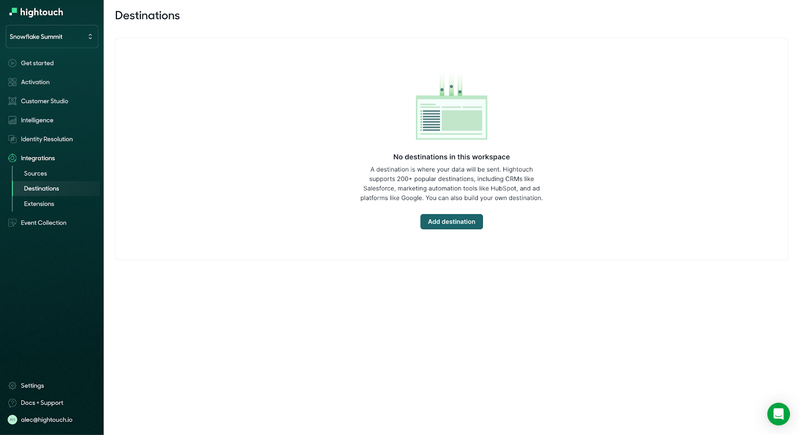

3. Select the destination you want to add - in this case, **Facebook Custom Audiences** and click Continue.

4. Authorize connecting to your destination or enter the relevant credentials and inputs. These differ depending on the destination. In this case, you will click “Use System user token.” 

5. Click Continue. Before continuing, Hightouch validates that you have the necessary access and permissions. If the test fails, you need to confirm and re-enter your credentials.

6. Give your destination a Destination name. This name is how your destination appears in the Hightouch workspace. It helps to include details about the destination's business purposes and owners, particularly if you plan on connecting multiple instances of the destination, for example, a development and prod version. In this case, use **Facebook Audiences Dev**

7. Click Finish.

<!-- ------------------------ -->
## Customer Studio - Schema Creation

Schemas define the data Hightouch should read from in Snowflake. Think about this as setting up your semantic layer with a visual ERD in Hightouch. Once you've set up your schema, which is a one-time setup*, you and your marketing team can build thousands of audiences with just a small set of initial models and events.

By following along with the setup in this section, you'll learn how to create a simple schema like this that ties users to Purchase, Add to Carts, and Product View events.

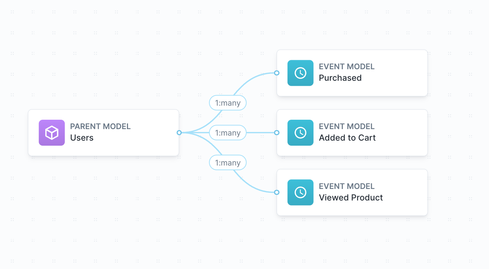


<!-- ------------------------ -->
## Customer Studio - Creating a Parent Model

In this example, the parent model would be the dataset of all customers. The example data set will include the following columns:

- **user_id:** a unique identifier for the customer—the primary key for this table and used as a foreign key for other tables
- **first_name:** the user's first name
- **last_name:** the user's last name
- **city:** the city where they live, valuable for precision geographic targeting
- **state:** the city where they live, valuable for broad geographic targeting
- **email:** the user's email address, valuable for matching CRM profiles
- **phone:** the user's phone number, valuable for matching paid media profiles 

1. Navigate to the Schema tab under Customer Studio

2. Ensure that your Data Source is correct (ex. Clone of Snowflake)

3. Select “Create Parent Model”

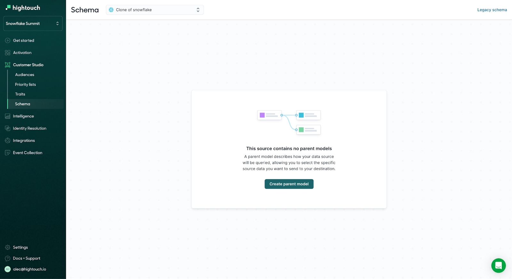

4. Hightouch has a few modeling methods. For this parent model, select **Table Selector** and then select the **PUBLIC.USERS** table

5. Preview results to ensure you can see the underlying data

6. Click Continue

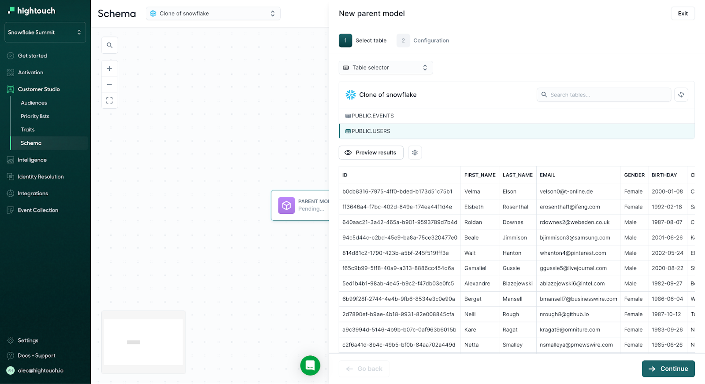

7. Enter a name for your parent model. In this case, we will use "Users."

8. Optionally, enter a description.

9. Select a [primary key](https://hightouch.com/docs/getting-started/concepts#unique-primary-key-requirement). This should be a column with [unique values](https://hightouch.com/docs/models/creating-models#unique-primary-key-requirement). In this case, we will use **ID** to represent our user identifier

10. Select columns for the model's primary label and secondary label. Hightouch displays these column values when [previewing audiences](https://hightouch.com/docs/customer-studio/insights#customer-explorer).

11. Click Create parent model.

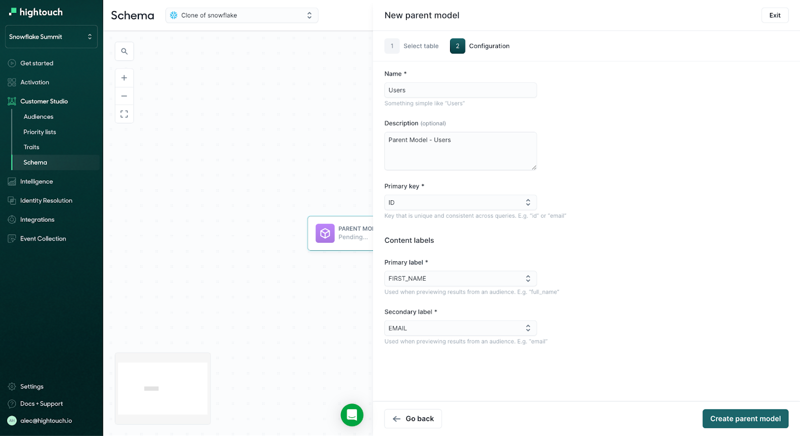

<!-- ------------------------ -->
## Customer Studio - Creating Event Models

Great, now your parent model **Users** have been created. Your team can now begin building audiences off of this data. That said, they’ll likely want to utilize more than just user data, so we will go ahead and add event models to create audiences using customer behavioral events. 

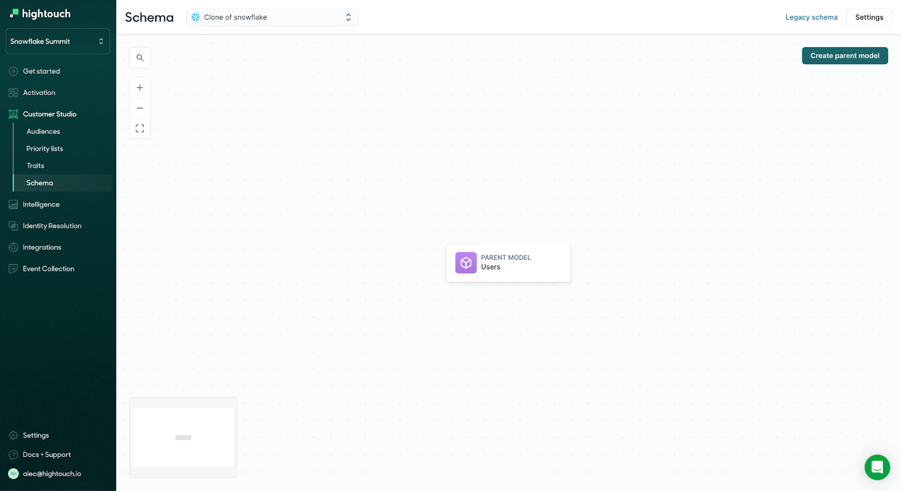

### Create First Event Model

An events model might include Product Viewed events with columns for:

- **user_id**: a reference to the user who viewed the product
- **page_path**: the URL path for the product detail page
- **timestamp**: when the user viewed the product

1. To create an event model, hover over the parent model (Users) and click the + icon

2. Select “Create a related event”

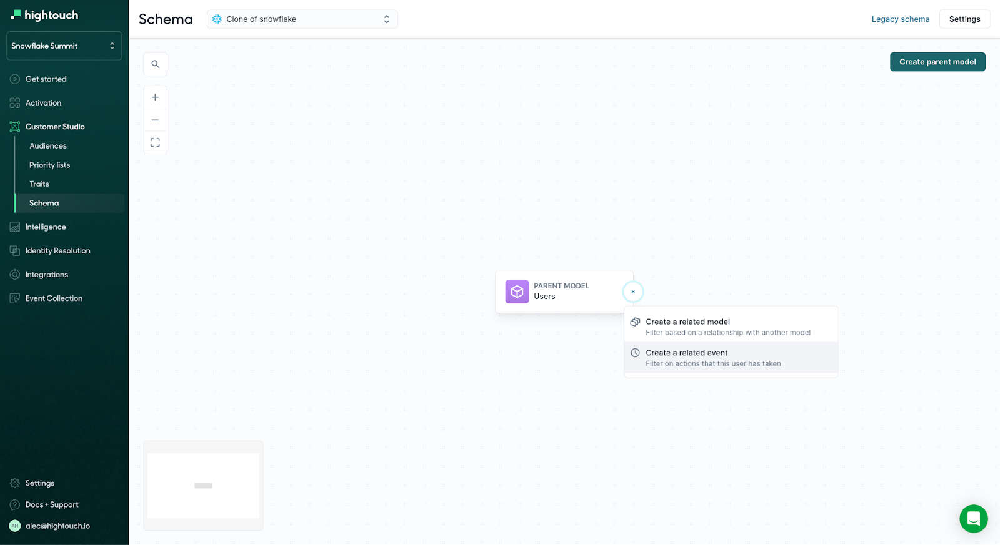

3. Rather than using the table selector this time, we will use SQL to define the model. Click the table selector dropdown and change it to SQL query

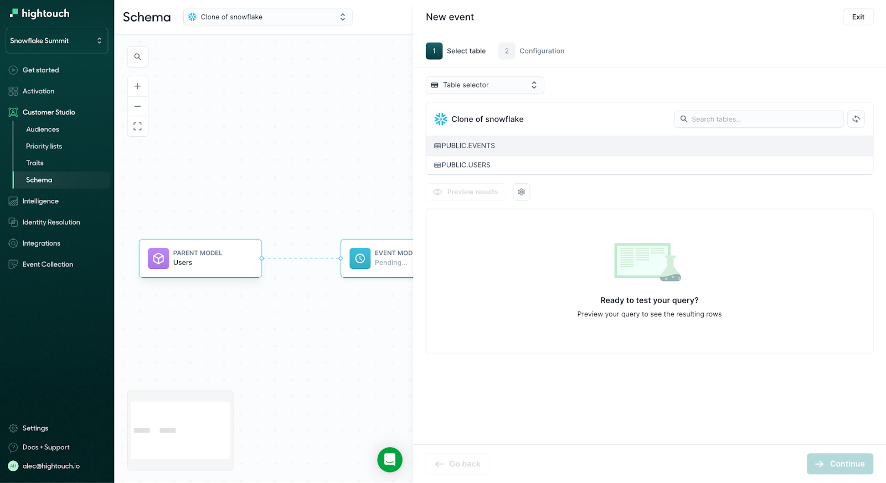

4. Input the SQL query that defines your desired event. In this case, we will use the following query:

```sql
select * from PUBLIC.EVENTS WHERE event_type = 'product_viewed'
```

5. Click **Preview** to inspect the underlying data, then click **Continue**

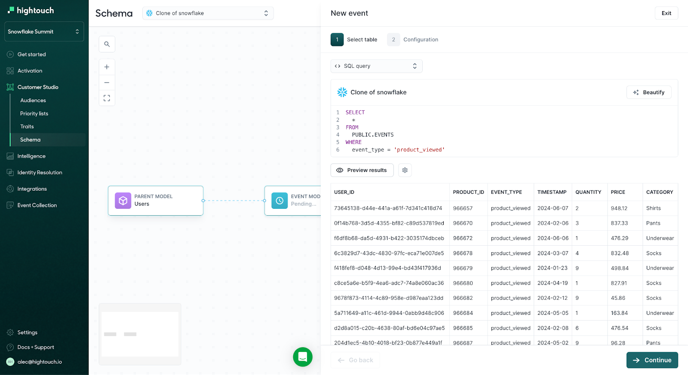

6. Enter a name for your event model, in this case, **Viewed Product**, then optionally, enter a model description.

7. Select the relationship's cardinality (how this joins to the parent model). You can select from 1:1, 1:many, or many:1. In most cases, parent models have a 1:many relationship with events. Select **1:many**

8. To relate rows from the events model to rows in the parent model, select the relevant foreign key columns from the parent and event models. In this case, we will use **ID** from our parent model and **USER_ID** from the event mode

9. If there are multiple columns that the parent and related model must match on, enable [Multiple join keys](https://hightouch.com/docs/customer-studio/schema#multiple-join-keys) and make additional selections. In this example, we will only match with one key.

10. Click Create event

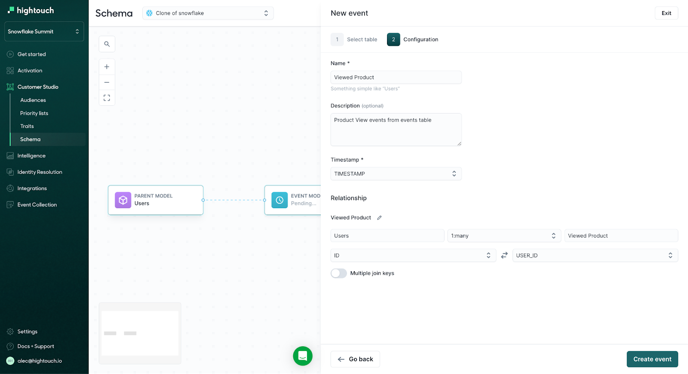

### Create Additional Event Models

Great! With your first event model created, the Product Viewed event can now be used to build audiences. We will now go ahead and repeat this process to add two more additional events. 

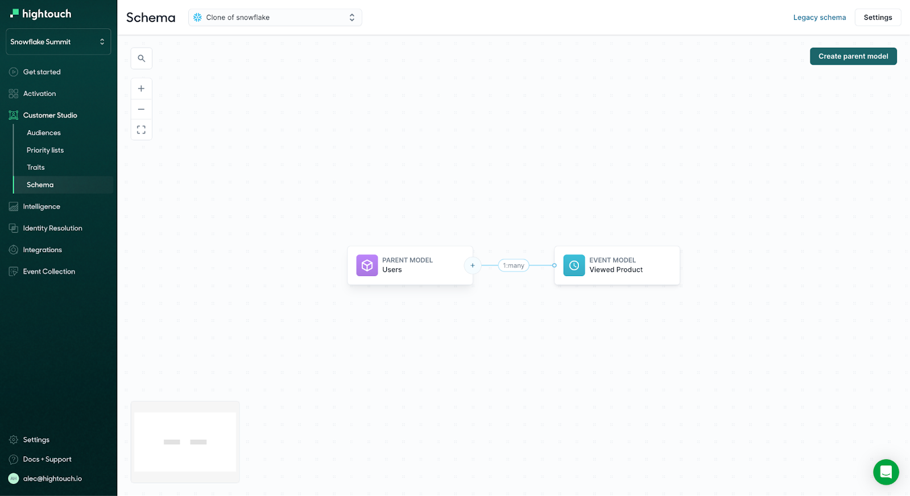

1. Once again, hover over the **Users** model and click + 

2. Select **Create a related event**

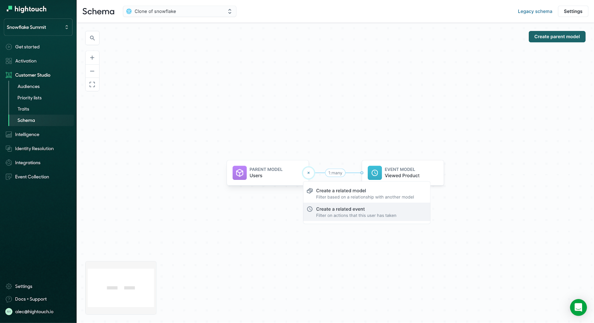

3. Again, we will use a SQL query to define our event model. Select SQL query from the modeling dropdown

4. Enter the SQL query that defines the Add to Cart event:

```sql
select * from PUBLIC.EVENTS WHERE event_type = 'add_to_cart'
```

5. Preview the model and click **Continue**

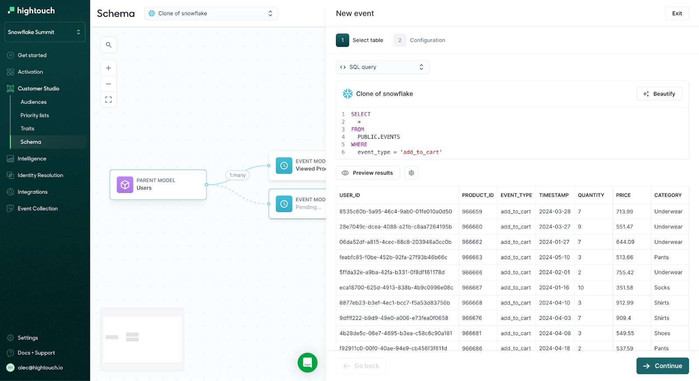

6. Add your model name, **“Added to cart”** and optionally, enter a description.

7. Select the relationship's cardinality as **1:many**

8. To relate rows from the events model to rows in the parent model, select **ID** from the Users parent model and **USER_ID** from the event model

9. Click **Create Event**

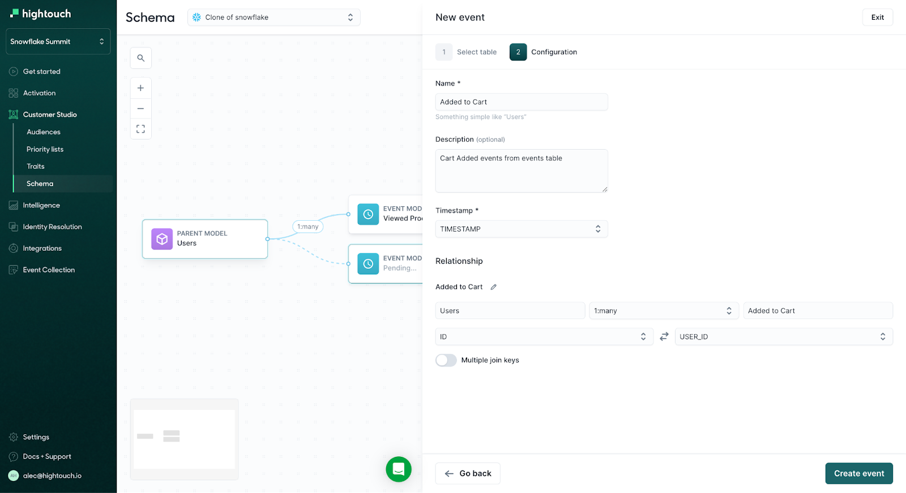

10. Great, the new event model has been added! Now, we will go ahead and add the final event model for Purchases. Again, hover over the parent model and click the +


11. Change the modeling method to SQL editor and enter the SQL query:

```sql
select * from PUBLIC.EVENTS WHERE event_type = 'purchase'
```

12. Preview the data and click **Continue**

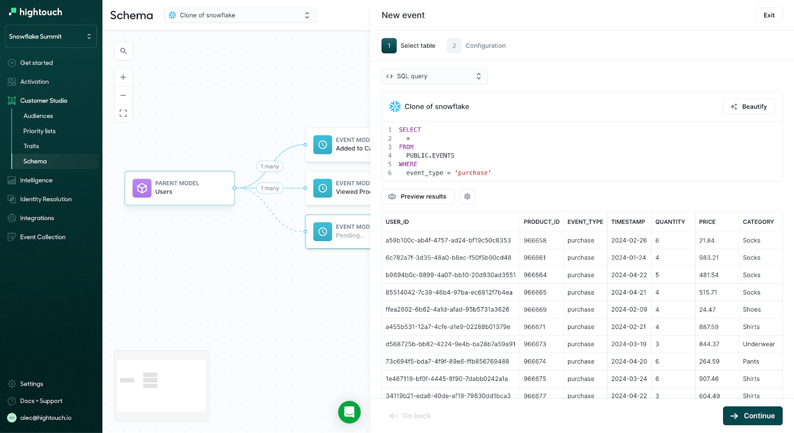

13. Enter “Purchased” as your model name and optionally, enter a description

14. Select the relationship's cardinality as **1:many**

15. To relate rows from the events model to rows in the parent model, select **ID** from the Users parent model and **USER_ID** from the event model

16. Click **Create Event**

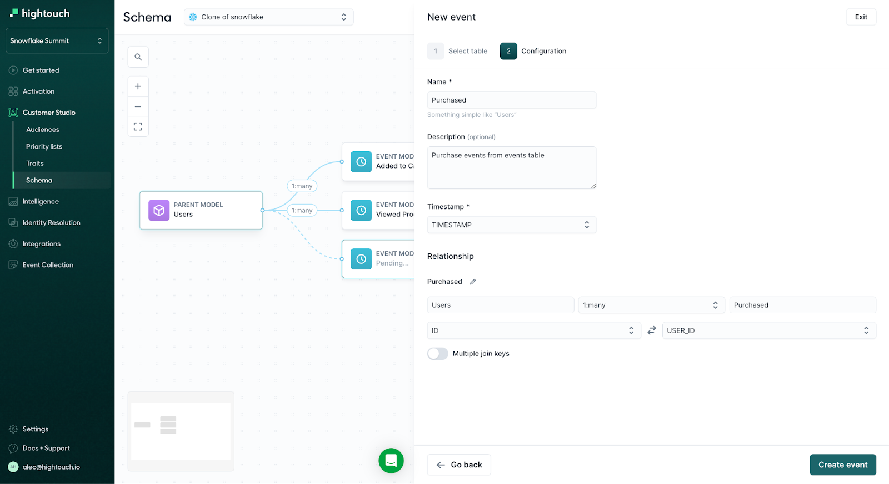

Great! Your Schema has been fully configured. Your team can now use any information from your users table and any events from your Purchased, Added to Cart, and Viewed Product event models when creating audiences in Customer Studio. 

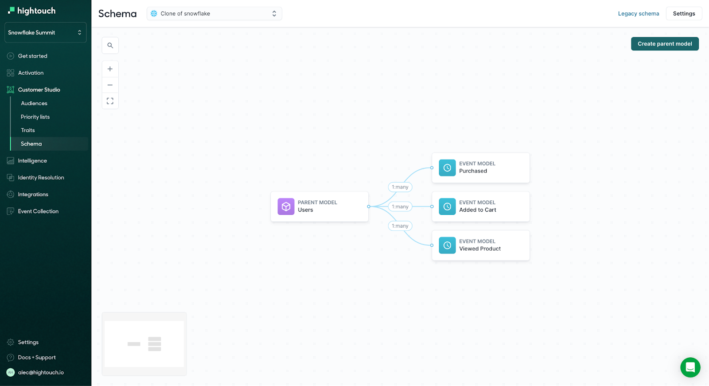

As a last step, you can click into your models to configure the columns with additional settings like previews (to ensure the fields show as suggestions in the audience builder) and redactions (to hide unwanted fields). 

For this quickstart, navigate to each event model, click **columns**, click the **settings gear**, and turn all **column suggestions on**.

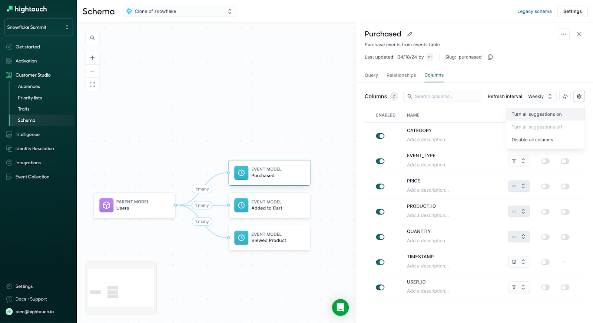

**Note:** *The schema builder can be as large as desired and can additionally support related models to bring in data from related objects like accounts, households, vehicles, pets, etc. However, for this Quickstart, we will not use any related models.*

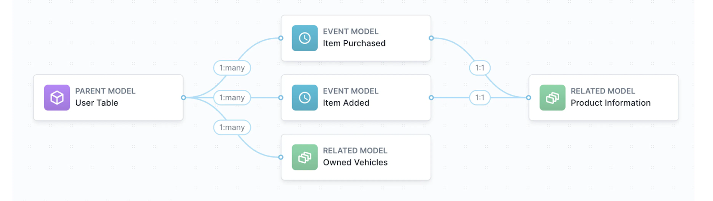

<!-- ------------------------ -->
## Customer Studio - Audiences and Syncs

With your Schema defined, any Hightouch user can now use Customer Studio to explore, build, and sync audiences across marketing tools and advertising channels. Hightouch’s powerful no-code audience builder gives marketers everything they need to operate independently on the data in Snowflake - all while giving data teams peace of mind through enterprise-grade governance controls.

### Building an Audience

1. To create your first audience, navigate to the Audiences tab under Customer Studio, then click **Add Audience**

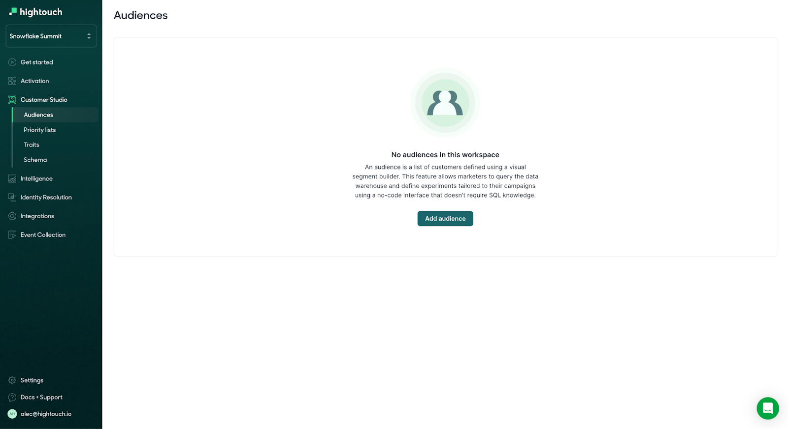

2. Select the [parent model](https://hightouch.com/docs/customer-studio/schema#parent-models) to build audiences from - in this case, we will use our Users parent model

3. Click "Add filter" and then scroll through to see your available segmentation fields. You’ll notice you can filter on Properties, Relations, Events, Audiences, or Custom Traits. Search for the Purchased event through the dropdown or by clicking the events filter 

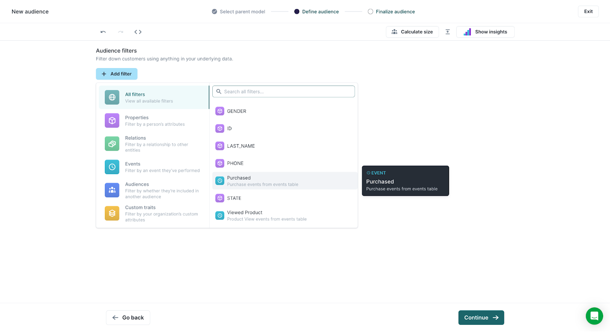

4. Select Purchased

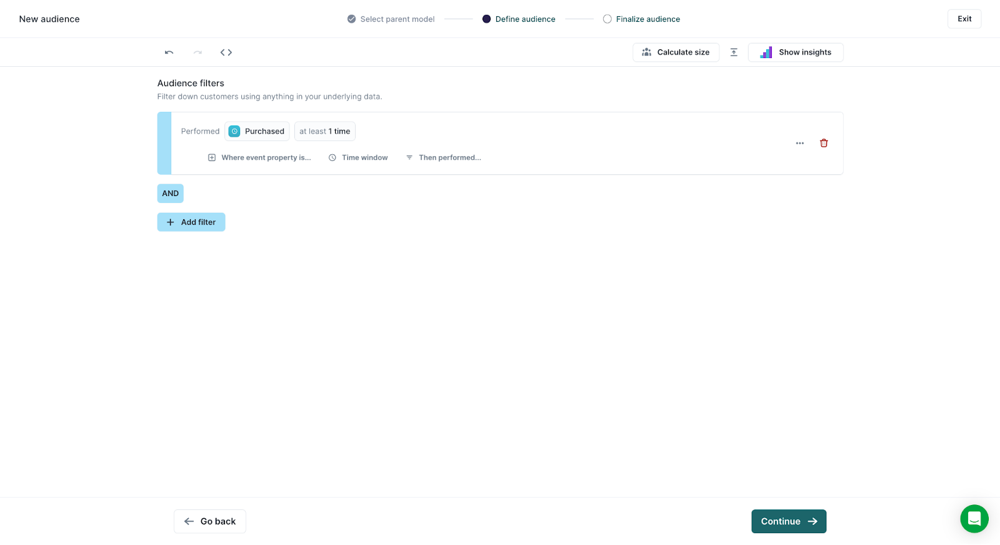

5. Add a Time Window of within 365 days to only include customers who have purchased in the last year 

6. Add additional logic on the specific purchase event by clicking “+where property is…” and select Category equals Shoes

7. With your audience defined, click the **Show Insights** tab on the top right to see the Audience size and explore users within the audience

8. To get a better understanding of your audience makeup, click the **Breakdown** tab and then click “+add breakdown”

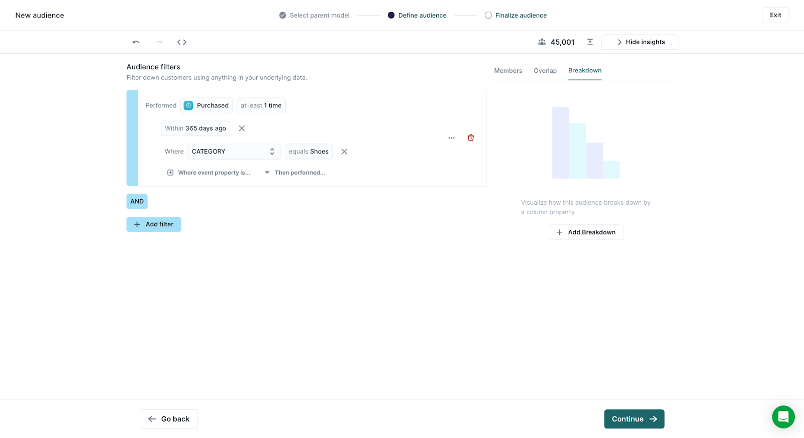

9. Click through the various visual types by toggling “SHOW AS” to bar charts, pie charts, and tables. You can also toggle settings to show all data, switch axes, and show a percentage. In this case, use a pie chart to explore how the audience is distributed.

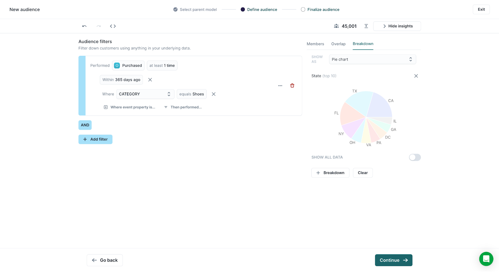

10. Once you feel comfortable with your audience, click “Continue” and name the audience  “Purchased Shoes p365d [Your First Initial and Company Name]”. *Note: adding the name at the end is simply for this lab to ensure that your audience name is unique in the demo destinations.*

11. You can additionally add a description or create folders for organization; however, in this case, we will simply click “finish.”

### Create a sync

With our audience now created, we can now sync it out to any destination. To do so, we will need to create a sync. 

1. Click “Add Sync” in the top right corner of the audience page. 

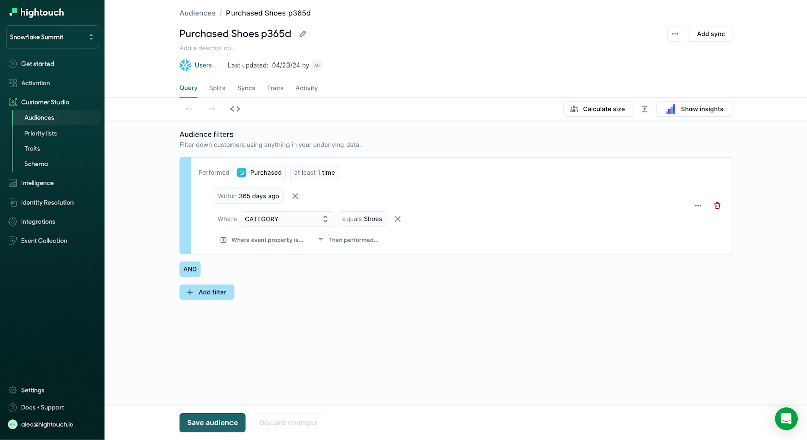

2. Click the destination you want to sync the audience to - we will use our Facebook Custom Audiences Dev destination.

3. Configure the audience settings. Note: This process is NOT required each time you create an audience, thanks to Sync Templates that you can easily create for each destination. We will create this in the next section.

4. Ensure that “Create a new Facebook audience” is selected, and then leave the audience name blank. The Hightouch audience name will be used when uploading to Facebook.

5. Next, we need to define the columns from our Snowflake table that we would like to sync to Facebook Custom Audiences ID fields.
- To do so, click “Add Mapping” and select “Email” from the dropdown.
- Next, click the associated Facebook field - in this case, Email.
- Proceed by mapping phone, first_name, last_name, city, and state. Remember, the more fields that you add, the higher the match rate - increasing the probability of Facebook matching users to your audience.

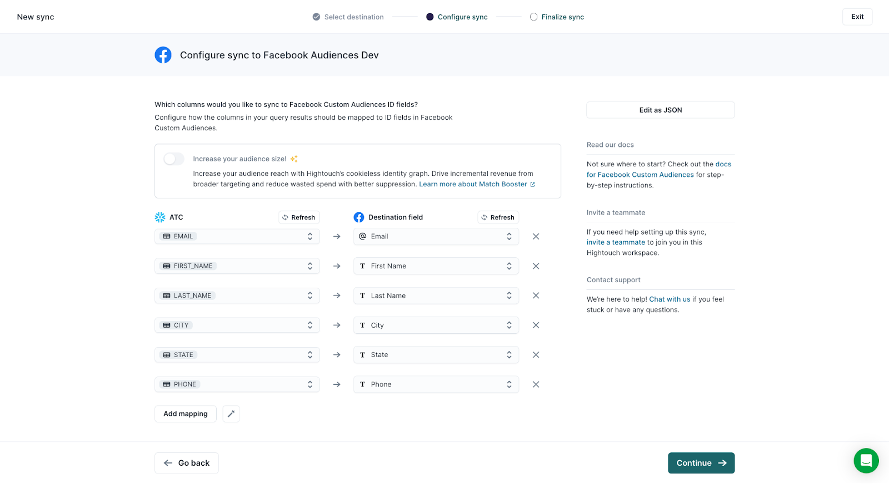

6. Under the field hashing setting, choose “YES” to allow Hightouch to hash values since the data is not hashed yet. 

7. Leave the Shared Audience section blank.

8. Choose to Remove the Facebook Custom Audiences record from the specified audience - this ensures that as users fall out of our audience criteria, they are removed from the Facebook audience.

9. Click “Continue.”

10. Optionally, enter a description for the sync. In this case, you can leave it blank.

11. Finally, select the schedule on which you would like this sync to run. Hightouch offers a number of different sync scheduling options to meet your various needs. In this case, we will select the schedule type of “Interval” and then choose an interval of “Every 1 Hour(s).”

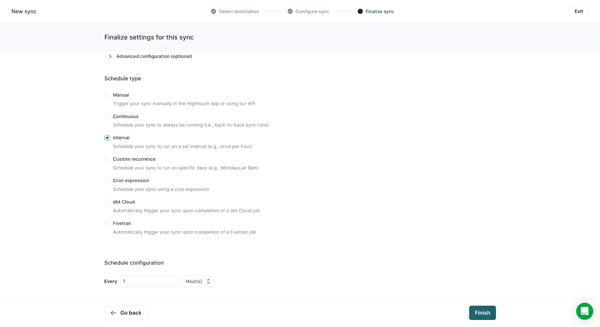

12. Click “Finish.” Your sync will now Run for the first time. All records that fit the audience criteria will be sent to the Facebook destination along with the specific fields we mapped in the earlier steps. 
13. With the audience sync in place, you can additionally QA the sync, set up alerting, monitor activity, set up sync logs (writing the audience back to Snowflake), and edit any settings for future syncs. In this case, we will simply continue.

### Create a Sync Template

As you can imagine, while the flexibility is great for configuring each setting of your sync, managing many audiences can become tedious. Hightouch’s sync templates allow marketers to set up syncs with just one click.  

Sync templates let you define sync configuration settings once for a particular destination. You create the sync template and then use it to add syncs for each audience requiring the same configuration settings and schedule.

1. Navigate back to “Schema” within the Customer Studio tab.

2. Click “Settings” and go to the Sync Templates tab.

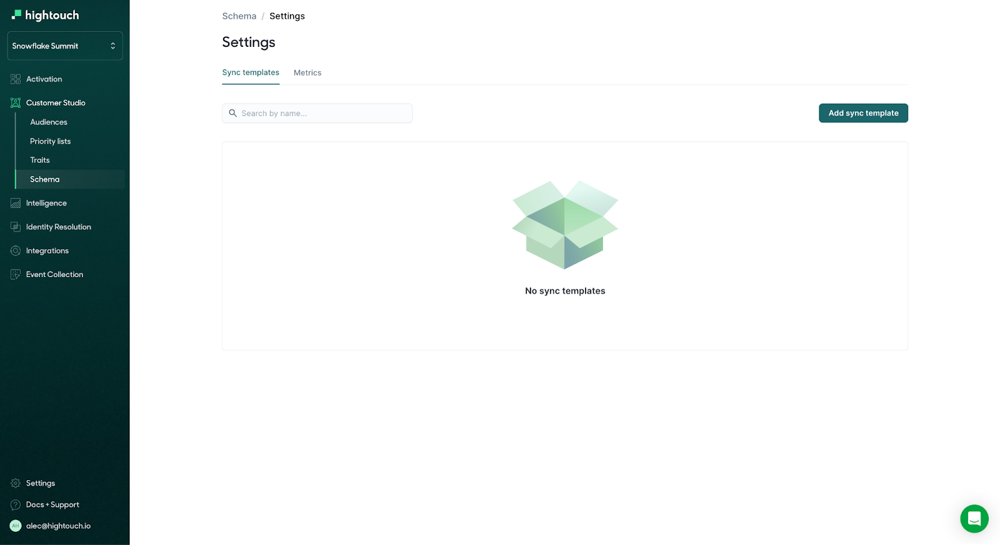

3. Click “Add Sync Template” to launch the template creation flow.

4. Select your existing User parent model.

5. Select your existing Facebook destination.

6. Configure your sync as you would typically: create your specific field mappings (see below) and make sure to toggle on “Remove the Facebook Custom Audiences record from the specified audience.”

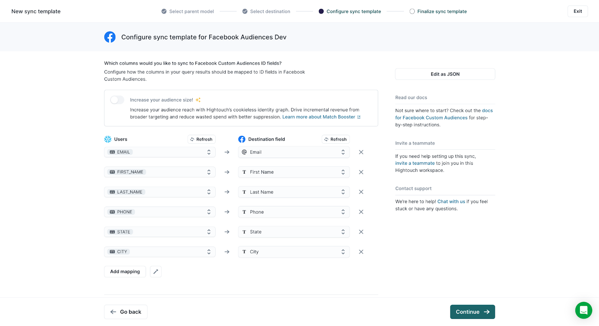

7. Click “Continue” and select an hourly interval as your sync schedule. 

8. Optionally enter a template name - in this case, you can leave as-is.

9. Click “Finish”, and that's it! Your marketing team can now use this sync template for any future audience syncs.

<!-- ------------------------ -->
## Customer Studio - Splits

### Experiment with Splits

As a marketer gearing up for your next campaign, you're likely thinking about critical questions like "Which channel should I leverage?" or "What copy or offer will resonate best?" The key to unlocking these answers lies in continuous testing and iteration.

Hightouch’s Splits feature powers rapid A/B and multivariate testing. With Splits, Hightouch segments your audience(s) into randomized groups across your channels and writes the segments back to Snowflake to streamline experimentation and analysis.

You can specify:
- The number of splits you want to use.
- The percentage of the total audience membership that each split should have; for example, split A gets 40%, and split B gets 60%.
- The destination to send each split to; for example, split A goes to Facebook, Split B goes to Google, and split C is a holdout that doesn't get sent to any destination.

Using Splits, you can run experiments such as:
- Holdout Tests: Send one split to a marketing destination (email, Google, Facebook, etc.) and have the other split act as a control and receive no messaging. These tests use the holdout group feature and can prove if there was an actual lift from marketing efforts.
- Channel Tests: Send splits to different channels to determine the most effective one.
- Offer/Creative Tests: Deploy different messaging on each split to see what resonates the best.


1. To create a split, we will first create another audience by clicking into Audiences in the Customer Studio tab and then clicking **Add Audience**.

2. Select your Users parent model.

3. Create a cart abandon audience. 
- Click “Add Filter” and select the event Added to Cart.
- Add a time window to only include users who added to cart in prev 30 days.
- Click “Then Performed” and Toggle “Then Performed” to “Then did not Perform.”
- Select “Purchased” as the field within Then did not Perform.
- Add a time window of 7 days of Added to Cart. 

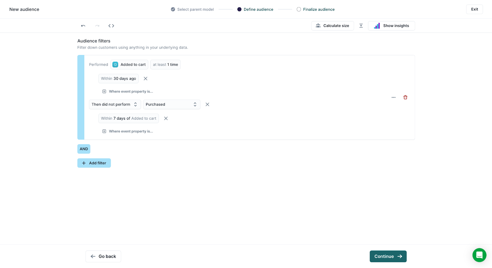

4. With your logic defined, you can Click “Show Insights” and use the Overlap tab to see the overlap of this new audience with your Purchaser audience by selecting it from the dropdown.

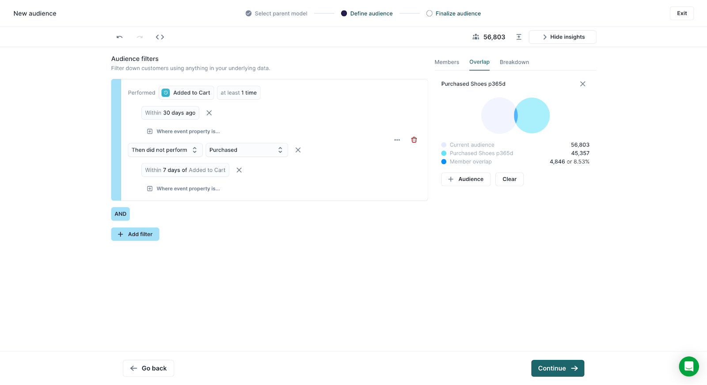

5. Once you check the overlap, click “Continue.”

6. Name the audience “Cart Abandoners p30d [Your First Initial and Company Name]” and optionally add a description.

7. Click “Finish.” 

8. With the audience now created, click the “Splits” tab within the Cart Abandoners audience.

9. Toggle to Enable Split Groups.

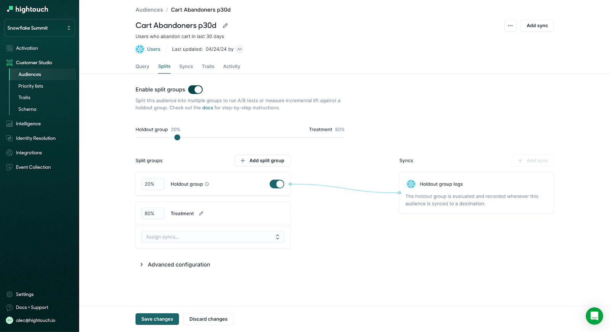

10. You can now choose how many splits you would like Hightouch to randomly create within your audience, the weighting that each split should be, and the destinations that each split should be sent to - users in holdout groups will only be synced into a Snowflake table so that you have a control group to analyze lift against. For now, leave the splits as-is at 80/20 between the treatment and control. Click save changes.

11. Click the “+ Add sync” within the Splits window to create a sync for the split group. 

12. Select the Facebook sync template you created in the previous section and click “Add Syncs.”

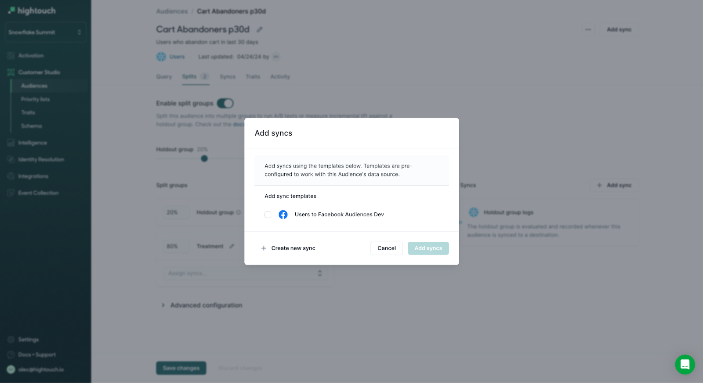

13. With the sync created, the Treatment group is now sent to Facebook as an audience, while the Holdout is ONLY sent to Snowflake for analysis. 

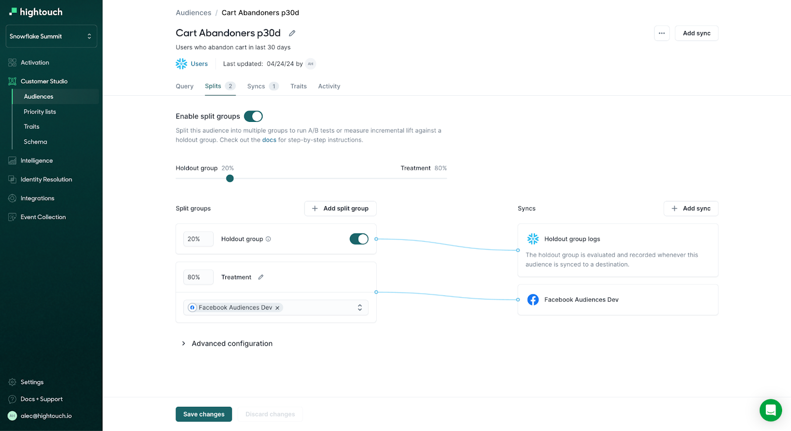

<!-- ------------------------ -->
## (Optional) Campaign Intelligence

### Analyze data with Campaign Intelligence

No matter how great your ideas are, marketing success hinges on your ability to try new things, understand what’s working, and iterate quickly. Unfortunately, understanding what’s working is a massive challenge today for most teams. They struggle to analyze performance across channels and data silos, are often stuck with basic metrics, and have to rely on technical teams for deeper insights.

[Campaign Intelligence](https://hightouch.com/blog/announcing-campaign-intelligence#getting-started) tackles these challenges head-on. It gives marketers an easy, self-service platform for marketing analytics on top of their complete campaign and customer data in Snowflake. Combined with the rest of Hightouch, marketers can now build audiences, orchestrate cross-channel experiments, and measure campaign ROI–all within one platform.

#### Create a Performance Analysis

1. Click into “Charts” under the Intelligence tab.

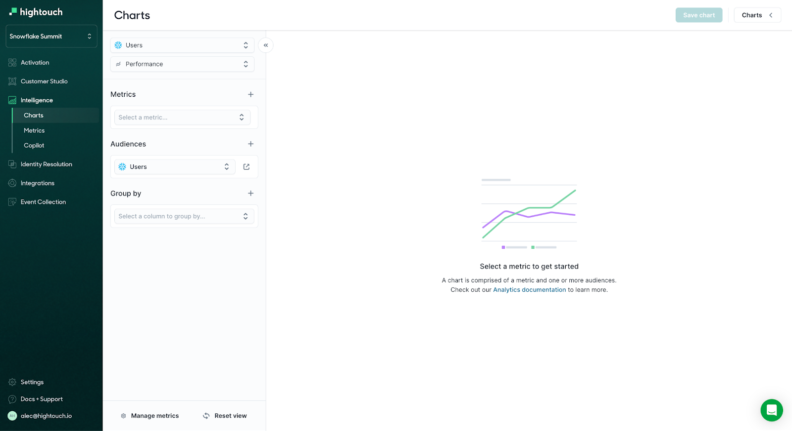

2. Select “Purchased” as your Metric.
3. Change the group by to “Category”.
4. Change your date range to “Custom”, and select 5/1/2024 - 6/1/2024.

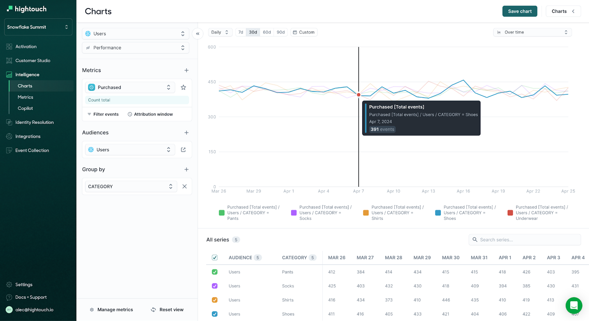

You can now explore how certain events or metrics trend over time across audiences or are grouped by specific attributes. 

#### Create a Funnel Analysis

1. Toggle the chart type from “Performance” to “Funnel”.
 - Note*: Make sure your date range is still set to "Custom", and select 5/1/2024 - 6/1/2024.

2. Under Steps, set up your specific funnel.
- Click the “+” next to Steps.
- Select “Viewed Product” as the first step.
- Select “Added to Cart” as the second step.
- Select “Purchased” as the third step. 

3. Under Conversion criteria, change the attribution window to “30 days.”

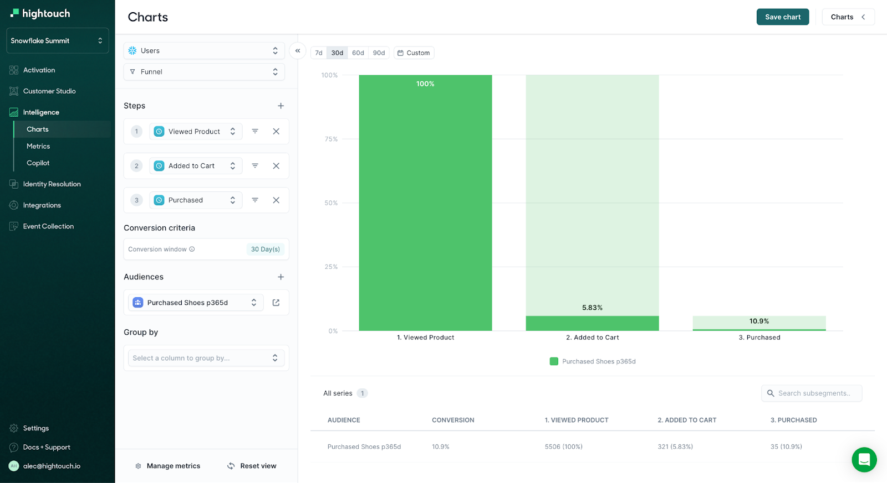

4. You can now identify metrics like the % of dropoff between funnel steps. *Additionally, limiting the analysis to specific audiences or grouping by certain columns from your parent model will allow you to dig deeper to identify trends and better understand user behavior.* Hover over the drop-off area (light green) in the “Added to Cart” step. You can now see the % of users who viewed a product but did NOT add to cart. 


5. Click in the light green area to display the Create Audience modal.

6. Click “Create Audience” to automatically set up an audience with the criteria specific to this cohort of users to allow you to quickly target these users with relevant messaging on advertising and marketing channels.

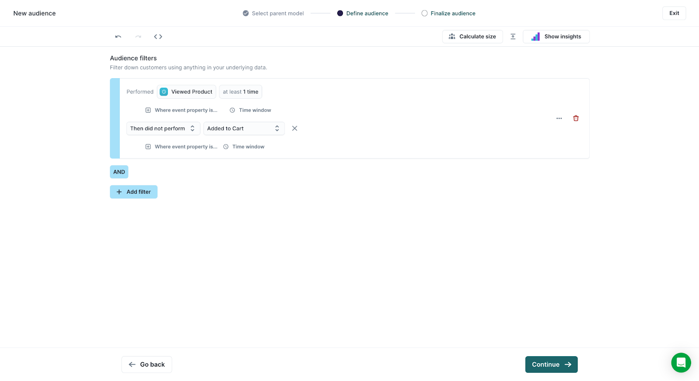

7. Click “Continue.”

8. Name the audience “Funnel Dropoff - ATC [Your First Initial and Company Name]” and click Save.

9. Click “Create Sync” in the top right corner on the audience page and select your Facebook Sync Template.

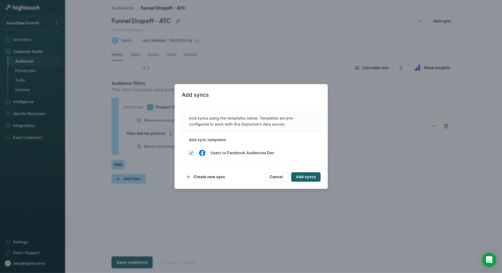

10. Click “Add Syncs,” and your audience will be sent to Facebook. Users who abandoned your site before adding to the cart can now be retargeted on Facebook to drive more users to complete the next step of your purchase funnel. 

As you can imagine, the Intelligence, Audiences, and Splits features all come together to enable marketing teams with an iterative optimization loop - enabling marketers to independently launch campaigns, experiment on them, analyze performance, and then apply those insights to further optimize existing and future campaigns. 

<!-- ------------------------ -->
## Conclusion and Resources

Congratulations! You have successfully learned how to transform your Data Cloud into a Self-Serve Marketing Engine.

#### What you learned

- How to turn Snowflake into a Composable CDP that your marketing team can self-serve.
- How to set up a self-serve audience builder that is fully customized to match your custom schema within Snowflake.
- How to create a split test to measure the impact of a marketing campaign on key business metrics.
- How to analyze the results of campaigns with a suite of no-code analytics tools that pull insight directly from Snowflake.

#### Related Resources

Want to learn more about Hightouch and the Composable CDP? Check out the following resources:

- [Warner Music Group Case Study](/en/why-snowflake/customers/all-customers/case-study/warner-music-group/)
- [Snowflake-Hightouch Solutions One-Pager](https://hightouch.com/resources/snowflake-one-pager)
- [The Complete Guide to the Composable CDP](https://hightouch.com/resources/composable-cdp-ebook)
- [Download Reference Architecture](/content/dam/snowflake-site/developers/2024/10/Hightouch-Snowflake-Architecture-Diagram.pdf)
- [Read the Blog](/en/blog/composable-cdps-healthcare-life-sciences-secure-data-insights/)
- [Watch Demo](https://youtu.be/2QViEoXpw7s?list=TLGGG6-z6JE74yMyMDA5MjAyNQ)
