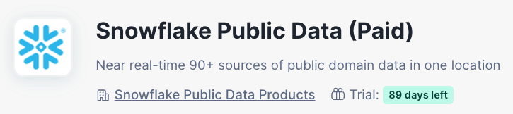

id: holly-financial-research-assistant
categories: snowflake-site:taxonomy/solution-center/certification/quickstart, snowflake-site:taxonomy/product/platform
language: en
summary: Build Holly, an AI-powered financial research assistant using Snowflake Intelligence with Cortex Agent, Cortex Analyst, and Cortex Search to analyze S&P 500 stocks, SEC filings, and earnings transcripts.
environments: web
status: Published
feedback link: <https://github.com/Snowflake-Labs/sfguides/issues>
authors: Colm Moynihan

# Holly - Financial Research Assistant with Snowflake Intelligence

## Overview
Duration: 5


**Holly** is an AI-powered financial research assistant built on Snowflake Intelligence. It enables portfolio managers, analysts, and traders to perform comprehensive stock research using natural language across structured and unstructured financial data.

### Use Case

You are a financial analyst in a hedge fund looking into AI Native Tech Stocks. You have 4 in mind: **GOOGL**, **MSFT**, **AMZN**, and **NVDA**.

Because you know NVIDIA makes 90% of the GPUs for AI, you reckon this is worth investigating further. But you want to drill down on the **unstructured data** — 10-K, 8-K, 10-Q filings, investor call transcripts, and annual reports — to get a holistic view of the security based on all the data available, not just the fundamental data which is all structured.

### What You Will Learn

- How to source financial data from Snowflake Marketplace
- How to create Cortex Search services for SEC filings and earnings transcripts
- How to create Semantic Views for Cortex Analyst
- How to build a Cortex Agent that combines multiple tools
- How to use Snowflake Intelligence for natural language financial research

### What You Will Build

A Snowflake Intelligence agent called **Holly** with:
- **Cortex Search** over SEC EDGAR filings (10-K, 10-Q, 8-K) and public company transcripts
- **Cortex Analyst** for querying stock price timeseries and S&P 500 company data
- A multi-tool **Cortex Agent** that routes queries to the right data source

### Architecture

```
          ┌──────────────────────┐
          │   Agent: Holly       │
          │  (Snowflake Intelligence)  │
          └──────────┬───────────┘
                     │
     ┌───────────────┼───────────────┐
     ▼               ▼               ▼
┌──────────┐  ┌──────────────┐  ┌──────────────┐
│  Cortex  │  │    Cortex    │  │    Cortex    │
│  Search  │  │   Analyst    │  │   Analyst    │
│ SEC/TX   │  │ Stock Prices │  │  SP500 Cos   │
└──────────┘  └──────────────┘  └──────────────┘
```

### Prerequisites

- A [Snowflake account](https://signup.snowflake.com/) with ACCOUNTADMIN access (works with **Trial Accounts**)
- Subscribe to **Snowflake Public Data (Paid)** from Marketplace (free trial available)

<!-- ------------------------ -->
## Subscribe to Marketplace Data
Duration: 3

Before running the installation, you need to subscribe to the data source that powers Holly.

1. In Snowsight, navigate to **Data Products > Marketplace**
2. Search for **"Snowflake Public Data (Paid)"**
3. Click **Get** to subscribe (free trial available)



This provides the `SNOWFLAKE_PUBLIC_DATA_PAID.PUBLIC_DATA` database which contains:
- **Stock price timeseries** — daily OHLC data for all S&P 500 companies
- **SEC EDGAR filings** — 10-K, 10-Q, 8-K filings with full text content
- **Public company transcripts** — earnings calls, investor conferences

> aside positive
> This listing has a free trial available, making it compatible with Snowflake trial accounts.

<!-- ------------------------ -->
## Create Database and Load Data
Duration: 10

Open a new SQL Worksheet in Snowsight and run the following steps.

### Set Up Context

```sql
USE ROLE ACCOUNTADMIN;
ALTER ACCOUNT SET CORTEX_ENABLED_CROSS_REGION = 'ANY_REGION';
CREATE WAREHOUSE IF NOT EXISTS SMALL_WH WITH WAREHOUSE_SIZE = '2X-LARGE' AUTO_SUSPEND = 60;
CREATE WAREHOUSE IF NOT EXISTS SMALL_IW WITH WAREHOUSE_SIZE = 'SMALL' ENABLE_QUERY_ACCELERATION = TRUE AUTO_SUSPEND = 60;
ALTER WAREHOUSE SMALL_IW RESUME IF SUSPENDED;
USE WAREHOUSE SMALL_WH;
```

### Create Database and Schemas

```sql
CREATE DATABASE IF NOT EXISTS COLM_DB;
CREATE SCHEMA IF NOT EXISTS COLM_DB.STRUCTURED;
CREATE SCHEMA IF NOT EXISTS COLM_DB.SEMI_STRUCTURED;
CREATE SCHEMA IF NOT EXISTS COLM_DB.UNSTRUCTURED;
```

### Create S&P 500 Companies Table

This inserts all 503 S&P 500 constituents (as of March 2026). You can copy the full INSERT statement from the [INSTALL.sql](assets/INSTALL.sql) file, or run the complete script directly.

```sql
CREATE OR REPLACE TABLE COLM_DB.STRUCTURED.SP500_COMPANIES (
    SYMBOL VARCHAR,
    COMPANY_NAME VARCHAR,
    SECTOR VARCHAR,
    INDUSTRY VARCHAR,
    HEADQUARTERS VARCHAR,
    DATE_ADDED DATE,
    CIK VARCHAR,
    FOUNDED VARCHAR
);

-- Load S&P 500 companies (full INSERT is in INSTALL.sql)
-- Copy the INSERT INTO statement from INSTALL.sql Step 3
```

### Create Stock Price Data

```sql
CREATE OR REPLACE TABLE COLM_DB.STRUCTURED.STOCK_PRICE_TIMESERIES
    COMMENT = 'Historical stock price data for Cortex Analyst'
AS
SELECT 
    TICKER,
    ASSET_CLASS,
    PRIMARY_EXCHANGE_CODE,
    PRIMARY_EXCHANGE_NAME,
    VARIABLE,
    VARIABLE_NAME,
    DATE,
    VALUE
FROM SNOWFLAKE_PUBLIC_DATA_PAID.PUBLIC_DATA.STOCK_PRICE_TIMESERIES
WHERE TICKER IN (SELECT SYMBOL FROM COLM_DB.STRUCTURED.SP500_COMPANIES);

ALTER TABLE COLM_DB.STRUCTURED.STOCK_PRICE_TIMESERIES SET CHANGE_TRACKING = TRUE;
ALTER TABLE COLM_DB.STRUCTURED.STOCK_PRICE_TIMESERIES CLUSTER BY (TICKER, DATE);
```

### Create SEC EDGAR Filings Data

```sql
CREATE OR REPLACE TABLE COLM_DB.SEMI_STRUCTURED.EDGAR_FILINGS
    COMMENT = 'SEC filings for Cortex Search'
AS
SELECT 
    r.COMPANY_NAME,
    r.FORM_TYPE AS ANNOUNCEMENT_TYPE,
    r.FILED_DATE,
    r.FISCAL_PERIOD,
    r.FISCAL_YEAR,
    a.ITEM_NUMBER,
    a.ITEM_TITLE,
    a.PLAINTEXT_CONTENT AS ANNOUNCEMENT_TEXT
FROM SNOWFLAKE_PUBLIC_DATA_PAID.PUBLIC_DATA.SEC_CORPORATE_REPORT_ITEM_ATTRIBUTES a
INNER JOIN SNOWFLAKE_PUBLIC_DATA_PAID.PUBLIC_DATA.SEC_CORPORATE_REPORT_INDEX r
    ON a.ADSH = r.ADSH 
INNER JOIN COLM_DB.STRUCTURED.SP500_COMPANIES s
    ON LPAD(r.CIK, 10, '0') = LPAD(s.CIK, 10, '0')
WHERE r.FILED_DATE >= '2025-01-01'
  AND r.FORM_TYPE IN ('8-K', '10-K', '10-Q');

ALTER TABLE COLM_DB.SEMI_STRUCTURED.EDGAR_FILINGS SET CHANGE_TRACKING = TRUE;
ALTER TABLE COLM_DB.SEMI_STRUCTURED.EDGAR_FILINGS CLUSTER BY (COMPANY_NAME, FILED_DATE);
```

### Create Public Transcripts Data

```sql
CREATE OR REPLACE TABLE COLM_DB.UNSTRUCTURED.PUBLIC_TRANSCRIPTS AS
SELECT 
    ROW_NUMBER() OVER (ORDER BY t.EVENT_TIMESTAMP DESC) AS TRANSCRIPT_ID,
    t.COMPANY_ID,
    t.CIK,
    t.COMPANY_NAME,
    t.PRIMARY_TICKER,
    t.FISCAL_PERIOD,
    t.FISCAL_YEAR,
    t.EVENT_TYPE,
    t.TRANSCRIPT_TYPE,
    t.TRANSCRIPT,
    t.EVENT_TIMESTAMP,
    t.CREATED_AT,
    t.UPDATED_AT
FROM SNOWFLAKE_PUBLIC_DATA_PAID.PUBLIC_DATA.COMPANY_EVENT_TRANSCRIPT_ATTRIBUTES t
INNER JOIN COLM_DB.STRUCTURED.SP500_COMPANIES s ON t.PRIMARY_TICKER = s.SYMBOL;

ALTER TABLE COLM_DB.UNSTRUCTURED.PUBLIC_TRANSCRIPTS SET CHANGE_TRACKING = TRUE;
```

<!-- ------------------------ -->
## Create Cortex Search Services
Duration: 8

Cortex Search indexes your unstructured text data so the agent can retrieve relevant content using natural language. We create two search services: one for SEC filings and one for earnings transcripts.

### Scale Up Warehouse

```sql
ALTER WAREHOUSE SMALL_WH SET WAREHOUSE_SIZE = '4X-LARGE';
```

> aside negative
> The search service indexing is the most time-consuming step. Scaling the warehouse to 4X-LARGE significantly reduces indexing time.

### SEC Filings Search

```sql
CREATE OR REPLACE CORTEX SEARCH SERVICE COLM_DB.SEMI_STRUCTURED.EDGAR_FILINGS_SEARCH
    ON ANNOUNCEMENT_TEXT
    ATTRIBUTES COMPANY_NAME, ANNOUNCEMENT_TYPE, FILED_DATE, FISCAL_PERIOD, FISCAL_YEAR, ITEM_NUMBER, ITEM_TITLE
    WAREHOUSE = SMALL_WH
    TARGET_LAG = '1 day'
AS (
    SELECT COMPANY_NAME, ANNOUNCEMENT_TYPE, FILED_DATE, FISCAL_PERIOD, FISCAL_YEAR, ITEM_NUMBER, ITEM_TITLE, ANNOUNCEMENT_TEXT
    FROM COLM_DB.SEMI_STRUCTURED.EDGAR_FILINGS
);
```

### Public Transcripts Search

```sql
CREATE OR REPLACE CORTEX SEARCH SERVICE COLM_DB.UNSTRUCTURED.PUBLIC_TRANSCRIPTS_SEARCH
    ON TRANSCRIPT_TEXT
    ATTRIBUTES COMPANY_NAME, PRIMARY_TICKER, EVENT_TYPE, FISCAL_PERIOD, FISCAL_YEAR
    WAREHOUSE = 'SMALL_WH'
    TARGET_LAG = '1 day'
    EMBEDDING_MODEL = 'snowflake-arctic-embed-l-v2.0'
AS (
    SELECT TRANSCRIPT_ID, COMPANY_ID, CIK, COMPANY_NAME, PRIMARY_TICKER, FISCAL_PERIOD, FISCAL_YEAR, EVENT_TYPE, EVENT_TIMESTAMP,
           TRANSCRIPT:text::VARCHAR AS TRANSCRIPT_TEXT
    FROM COLM_DB.UNSTRUCTURED.PUBLIC_TRANSCRIPTS
    WHERE TRANSCRIPT:text IS NOT NULL
);
```

### Scale Down Warehouse

```sql
ALTER WAREHOUSE SMALL_WH SET WAREHOUSE_SIZE = 'SMALL' AUTO_SUSPEND = 60;
```

<!-- ------------------------ -->
## Create Semantic Views
Duration: 5

Semantic Views provide the business-level data model that Cortex Analyst uses to convert natural language questions into SQL queries. We create three semantic views for stock prices, company data, and filing analytics.

### Stock Price Timeseries Semantic View

```sql
CREATE OR REPLACE SEMANTIC VIEW COLM_DB.STRUCTURED.STOCK_PRICE_TIMESERIES_SV
    TABLES (COLM_DB.STRUCTURED.STOCK_PRICE_TIMESERIES)
    FACTS (STOCK_PRICE_TIMESERIES.VALUE AS VALUE)
    DIMENSIONS (
        STOCK_PRICE_TIMESERIES.TICKER AS TICKER,
        STOCK_PRICE_TIMESERIES.ASSET_CLASS AS ASSET_CLASS,
        STOCK_PRICE_TIMESERIES.PRIMARY_EXCHANGE_CODE AS PRIMARY_EXCHANGE_CODE,
        STOCK_PRICE_TIMESERIES.PRIMARY_EXCHANGE_NAME AS PRIMARY_EXCHANGE_NAME,
        STOCK_PRICE_TIMESERIES.VARIABLE AS VARIABLE,
        STOCK_PRICE_TIMESERIES.VARIABLE_NAME AS VARIABLE_NAME,
        STOCK_PRICE_TIMESERIES.DATE AS DATE
    );
```

### S&P 500 Companies Semantic View

```sql
CREATE OR REPLACE SEMANTIC VIEW COLM_DB.STRUCTURED.SP500
    TABLES (COLM_DB.STRUCTURED.SP500_COMPANIES)
    DIMENSIONS (
        SP500_COMPANIES.SYMBOL AS SYMBOL,
        SP500_COMPANIES.COMPANY_NAME AS COMPANY_NAME,
        SP500_COMPANIES.SECTOR AS SECTOR,
        SP500_COMPANIES.INDUSTRY AS INDUSTRY,
        SP500_COMPANIES.HEADQUARTERS AS HEADQUARTERS,
        SP500_COMPANIES.DATE_ADDED AS DATE_ADDED,
        SP500_COMPANIES.CIK AS CIK,
        SP500_COMPANIES.FOUNDED AS FOUNDED
    );
```

### SEC EDGAR Filings Semantic View

This semantic view uses the YAML-based creation method for richer metadata and verified queries:

```sql
CALL SYSTEM$CREATE_SEMANTIC_VIEW_FROM_YAML(
  'COLM_DB.SEMI_STRUCTURED',
  'name: EDGAR_FILINGS_SV
description: SEC EDGAR filings for S&P 500 companies including 10-K annual reports, 10-Q quarterly reports, and 8-K current event disclosures.

tables:
  - name: EDGAR_FILINGS
    description: SEC filings containing company announcements, financial reports, and regulatory disclosures for S&P 500 companies.
    base_table:
      database: COLM_DB
      schema: SEMI_STRUCTURED
      table: EDGAR_FILINGS

    dimensions:
      - name: COMPANY_NAME
        description: Name of the company that filed the SEC report
        expr: COMPANY_NAME
        data_type: TEXT
        sample_values:
          - Apple Inc.
          - Microsoft Corporation
          - Amazon.com, Inc.

      - name: ANNOUNCEMENT_TYPE
        description: Type of SEC filing - 10-K (annual report), 10-Q (quarterly report), or 8-K (current event disclosure)
        expr: ANNOUNCEMENT_TYPE
        data_type: TEXT
        sample_values:
          - 10-K
          - 10-Q
          - 8-K

      - name: FISCAL_PERIOD
        description: Fiscal period of the filing (Q1, Q2, Q3, Q4, FY)
        expr: FISCAL_PERIOD
        data_type: TEXT
        sample_values:
          - Q1
          - Q2
          - FY

      - name: FISCAL_YEAR
        description: Fiscal year of the filing
        expr: FISCAL_YEAR
        data_type: NUMBER

      - name: ITEM_NUMBER
        description: SEC form item number identifying the specific section of the filing
        expr: ITEM_NUMBER
        data_type: TEXT

      - name: ITEM_TITLE
        description: Title of the SEC form item/section
        expr: ITEM_TITLE
        data_type: TEXT

      - name: ANNOUNCEMENT_TEXT
        description: Full text content of the SEC filing section
        expr: ANNOUNCEMENT_TEXT
        data_type: TEXT

    time_dimensions:
      - name: FILED_DATE
        description: Date the SEC filing was submitted
        expr: FILED_DATE
        data_type: DATE

verified_queries:
  - name: vqr_0
    question: How many SEC filings are there by filing type?
    sql: |
      SELECT 
        ANNOUNCEMENT_TYPE,
        COUNT(*) AS FILING_COUNT
      FROM COLM_DB.SEMI_STRUCTURED.EDGAR_FILINGS
      GROUP BY ANNOUNCEMENT_TYPE
      ORDER BY FILING_COUNT DESC

  - name: vqr_1
    question: Which companies have the most SEC filings?
    sql: |
      SELECT 
        COMPANY_NAME,
        COUNT(*) AS FILING_COUNT
      FROM COLM_DB.SEMI_STRUCTURED.EDGAR_FILINGS
      GROUP BY COMPANY_NAME
      ORDER BY FILING_COUNT DESC
      LIMIT 10

  - name: vqr_2
    question: How many filings were submitted each month?
    sql: |
      SELECT 
        DATE_TRUNC(''MONTH'', FILED_DATE) AS FILING_MONTH,
        COUNT(*) AS FILING_COUNT
      FROM COLM_DB.SEMI_STRUCTURED.EDGAR_FILINGS
      GROUP BY FILING_MONTH
      ORDER BY FILING_MONTH',
  FALSE
);
```

<!-- ------------------------ -->
## Create the Holly Agent
Duration: 5

Now we bring it all together by creating the Holly Cortex Agent that orchestrates across all the tools.

### Create Agent Database

```sql
CREATE DATABASE IF NOT EXISTS SNOWFLAKE_INTELLIGENCE;
CREATE SCHEMA IF NOT EXISTS SNOWFLAKE_INTELLIGENCE.AGENTS;
```

### Create the Agent

```sql
CREATE OR REPLACE AGENT SNOWFLAKE_INTELLIGENCE.AGENTS.HOLLY
  COMMENT = 'Financial research assistant for SEC filings, transcripts, stock prices, and company data'
  FROM SPECIFICATION $$
models:
  orchestration: claude-4-sonnet

instructions:
  orchestration: |
    You are Holly the FS Financial Agent. When a user first greets you or says hello, respond with: "Good afternoon, I am Holly the FS Financial Agent. How can I help you?"
    
    Route each query to the appropriate tool:
    
    **TRANSCRIPTS**: For earnings calls, investor conferences, or company event transcripts from S&P 500 companies, use TRANSCRIPTS_SEARCH.
    
    **HISTORICAL PRICES**: For historical stock price analysis, OHLC data, or price trends, use STOCK_PRICES.
    
    **COMPANY FUNDAMENTALS**: For S&P 500 company data (market cap, revenue growth, EBITDA, sector), use SP500_COMPANIES.
    
    **SEC FILINGS SEARCH**: For searching SEC filing content (8-K, 10-K, 10-Q) or regulatory disclosures, use SEC_FILINGS_SEARCH.
    
    **SEC FILINGS ANALYTICS**: For counting or aggregating SEC filings by company, type, date, or fiscal period, use SEC_FILINGS_ANALYST.
    
    Combine multiple tools for comprehensive research.
  response: "Provide clear, data-driven responses with source attribution. Use tables for financial data. Specify dates for stock prices. Cite filing type and date for SEC filings. Be accurate with numbers."
  sample_questions:
    - question: "Plot the share price of Microsoft, Amazon, Google and Nvidia starting 20th Feb 2025 to 20th Feb 2026"
    - question: "Are Nvidia, Microsoft, Amazon, Google in the SP500"
    - question: "What are the latest public transcripts for NVIDIA"
    - question: "Compare Nvidia's annual growth rate and Microsoft annual growth rate using the latest Annual reports using a table format for all the key metrics"
    - question: "What is the latest 10-K for Nvidia from the EDGAR Filings"
    - question: "Would you recommend buying Nvidia Stock at 195"

tools:
  - tool_spec:
      type: cortex_search
      name: TRANSCRIPTS_SEARCH
      description: "Search public company event transcripts (earnings calls, investor conferences) from S&P 500 companies."
  - tool_spec:
      type: cortex_search
      name: SEC_FILINGS_SEARCH
      description: "Search SEC EDGAR filings (10-K, 10-Q, 8-K) for company announcements and regulatory disclosures."
  - tool_spec:
      type: cortex_analyst_text_to_sql
      name: STOCK_PRICES
      description: "Query historical stock price data with daily OHLC values for price trends and analysis."
  - tool_spec:
      type: cortex_analyst_text_to_sql
      name: SP500_COMPANIES
      description: "Query S&P 500 company fundamentals: market cap, revenue growth, EBITDA, sector, industry."
  - tool_spec:
      type: cortex_analyst_text_to_sql
      name: SEC_FILINGS_ANALYST
      description: "Query SEC filing metadata and counts by company, filing type, date, or fiscal period."

tool_resources:
  TRANSCRIPTS_SEARCH:
    search_service: "COLM_DB.UNSTRUCTURED.PUBLIC_TRANSCRIPTS_SEARCH"
    max_results: 10
    columns:
      - COMPANY_NAME
      - PRIMARY_TICKER
      - EVENT_TYPE
      - FISCAL_PERIOD
      - FISCAL_YEAR
      - EVENT_TIMESTAMP
      - TRANSCRIPT_TEXT
  SEC_FILINGS_SEARCH:
    search_service: "COLM_DB.SEMI_STRUCTURED.EDGAR_FILINGS_SEARCH"
    max_results: 10
    columns:
      - COMPANY_NAME
      - ANNOUNCEMENT_TYPE
      - FILED_DATE
      - FISCAL_PERIOD
      - FISCAL_YEAR
      - ITEM_NUMBER
      - ITEM_TITLE
      - ANNOUNCEMENT_TEXT
  STOCK_PRICES:
    semantic_view: "COLM_DB.STRUCTURED.STOCK_PRICE_TIMESERIES_SV"
    execution_environment:
      type: warehouse
      warehouse: SMALL_IW
    query_timeout: 120
  SP500_COMPANIES:
    semantic_view: "COLM_DB.STRUCTURED.SP500"
    execution_environment:
      type: warehouse
      warehouse: SMALL_WH
    query_timeout: 60
  SEC_FILINGS_ANALYST:
    semantic_view: "COLM_DB.SEMI_STRUCTURED.EDGAR_FILINGS_SV"
    execution_environment:
      type: warehouse
      warehouse: SMALL_WH
    query_timeout: 60
$$;

GRANT USAGE ON AGENT SNOWFLAKE_INTELLIGENCE.AGENTS.HOLLY TO ROLE PUBLIC;
ALTER AGENT SNOWFLAKE_INTELLIGENCE.AGENTS.HOLLY SET PROFILE = '{"avatar": "robot"}';
```

<!-- ------------------------ -->
## Verify Installation
Duration: 2

Run the following queries to verify everything was created successfully:

```sql
SELECT 'SP500_COMPANIES' AS table_name, COUNT(*) AS row_count FROM COLM_DB.STRUCTURED.SP500_COMPANIES
UNION ALL SELECT 'STOCK_PRICE_TIMESERIES', COUNT(*) FROM COLM_DB.STRUCTURED.STOCK_PRICE_TIMESERIES
UNION ALL SELECT 'EDGAR_FILINGS', COUNT(*) FROM COLM_DB.SEMI_STRUCTURED.EDGAR_FILINGS
UNION ALL SELECT 'PUBLIC_TRANSCRIPTS', COUNT(*) FROM COLM_DB.UNSTRUCTURED.PUBLIC_TRANSCRIPTS;

SHOW CORTEX SEARCH SERVICES IN DATABASE COLM_DB;
SHOW SEMANTIC VIEWS IN DATABASE COLM_DB;
DESC AGENT SNOWFLAKE_INTELLIGENCE.AGENTS.HOLLY;
```

You should see:
- **SP500_COMPANIES**: ~503 rows
- **STOCK_PRICE_TIMESERIES**: varies based on date range
- **EDGAR_FILINGS**: varies based on filings available
- **PUBLIC_TRANSCRIPTS**: varies based on available transcripts
- Two Cortex Search services
- Three Semantic Views
- The Holly agent description

<!-- ------------------------ -->
## Try Holly in Snowflake Intelligence
Duration: 10

Navigate to **AI & ML > Snowflake Intelligence** in Snowsight and select **Holly**.

### Q1: Plot Share Prices

> "Plot the share price of Microsoft, Amazon, Google and Nvidia starting 20th Feb 2025 to 20th Feb 2026"

Holly uses the **STOCK_PRICES** tool (Cortex Analyst) to generate SQL and return a chart of historical prices across multiple tickers.

### Q2: S&P 500 Membership Check

> "Are Nvidia, Microsoft, Amazon, Google in the SP500"

Holly queries the **SP500_COMPANIES** tool to check membership. It automatically generates SQL from natural language.

### Q3: Latest Earnings Transcripts

> "What are the latest public transcripts for NVIDIA"

Holly uses **TRANSCRIPTS_SEARCH** (Cortex Search) to retrieve and summarize the most recent earnings call transcripts.

### Q4: SEC Filing Lookup

> "What is the latest 10-K for Nvidia from the EDGAR Filings"

Holly searches **SEC_FILINGS_SEARCH** to find and return the most recent annual report filing.

### Q5: Company Comparison

> "Compare Nvidia's annual growth rate and Microsoft annual growth rate using the latest Annual reports using a table format for all the key metrics"

Holly combines **SEC_FILINGS_SEARCH** across multiple companies to extract and compare key financial metrics in a table.

### Q6: Investment Research

> "Would you recommend buying Nvidia Stock at 195"

Holly uses **multiple tools** — pulling current price data, recent filings, and transcripts — to provide a comprehensive research summary. Note that Holly correctly avoids giving direct investment advice.

<!-- ------------------------ -->
## Cleanup
Duration: 2

To remove all Holly components, run the uninstall script:

```sql
USE ROLE ACCOUNTADMIN;
USE WAREHOUSE SMALL_WH;

DROP AGENT IF EXISTS SNOWFLAKE_INTELLIGENCE.AGENTS.HOLLY;
DROP CORTEX SEARCH SERVICE IF EXISTS COLM_DB.SEMI_STRUCTURED.EDGAR_FILINGS_SEARCH;
DROP CORTEX SEARCH SERVICE IF EXISTS COLM_DB.UNSTRUCTURED.PUBLIC_TRANSCRIPTS_SEARCH;
DROP SEMANTIC VIEW IF EXISTS COLM_DB.STRUCTURED.STOCK_PRICE_TIMESERIES_SV;
DROP SEMANTIC VIEW IF EXISTS COLM_DB.STRUCTURED.SP500;
DROP TABLE IF EXISTS COLM_DB.STRUCTURED.SP500_COMPANIES;
DROP TABLE IF EXISTS COLM_DB.STRUCTURED.STOCK_PRICE_TIMESERIES;
DROP TABLE IF EXISTS COLM_DB.SEMI_STRUCTURED.EDGAR_FILINGS;
DROP TABLE IF EXISTS COLM_DB.UNSTRUCTURED.PUBLIC_TRANSCRIPTS;
DROP SCHEMA IF EXISTS COLM_DB.STRUCTURED;
DROP SCHEMA IF EXISTS COLM_DB.SEMI_STRUCTURED;
DROP SCHEMA IF EXISTS COLM_DB.UNSTRUCTURED;
DROP DATABASE IF EXISTS COLM_DB;
```

<!-- ------------------------ -->
## Conclusion and Resources
Duration: 1

Congratulations! You have successfully built **Holly**, an AI-powered financial research assistant using Snowflake Intelligence.

### What You Learned

- How to source financial data from Snowflake Marketplace (Cybersyn)
- How to create Cortex Search services for unstructured text retrieval over SEC filings and earnings transcripts
- How to create Semantic Views that enable natural language to SQL conversion
- How to build a multi-tool Cortex Agent that intelligently routes queries
- How to use Snowflake Intelligence for comprehensive financial research

### Related Resources

- [Source Repository](https://github.com/sfc-gh-cmoynihan/holly_4_trial_accounts)
- [Snowflake Intelligence Documentation](https://docs.snowflake.com/user-guide/snowflake-cortex/snowflake-intelligence)
- [Cortex Agent Documentation](https://docs.snowflake.com/en/user-guide/snowflake-cortex/cortex-agents)
- [Cortex Analyst Documentation](https://docs.snowflake.com/en/user-guide/snowflake-cortex/cortex-analyst)
- [Cortex Search Documentation](https://docs.snowflake.com/en/user-guide/snowflake-cortex/cortex-search)
- [Snowflake Marketplace](https://app.snowflake.com/marketplace)
