authors: Matthias Nicola, Vinay Srihari
id: horizon_intra_org_sharing
summary: explore Horizon Access pillar features for intra-company sharing of data and apps
categories: Data-Sharing
environments: web
status: Published 
feedback link: https://github.com/Snowflake-Labs/sfguides/issues
tags: Summit HOL, Data Sharing, Horizon Access

# Horizon Access Pillar: Intra-Company Sharing
<!-- ------------------------ -->
## Overview 
Duration: 15

Sharing information between departments, business units and subsidiaries of a company is critical for success, particularly when there are organizational silos in place. A modern data platform must provide decentralized ownership, universal discovery, access control, federated governance, and observability. 

**Snowflake Horizon** is a unified suite of governance and discovery capabilities organized into five pillars.

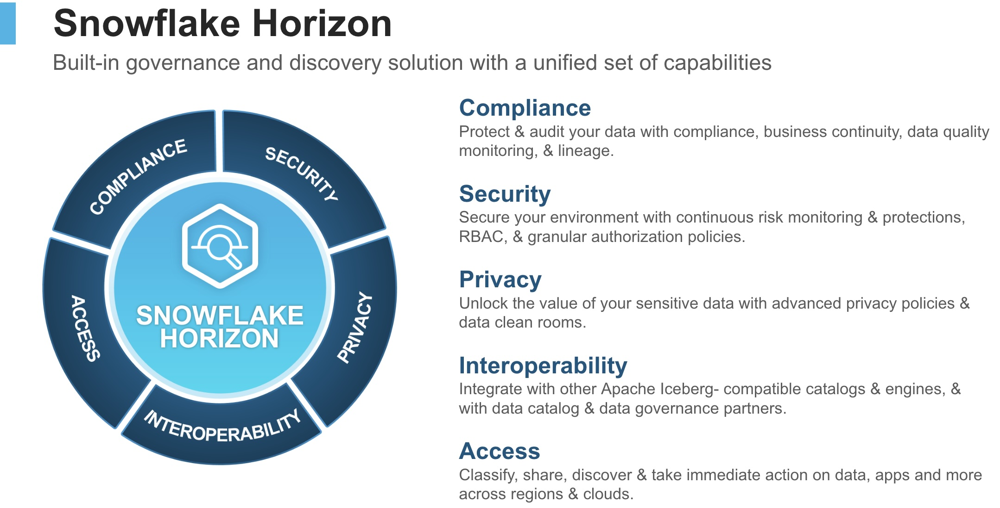

This Quickstart is focused on the <mark>Access</mark> pillar.

The objective of the Access pillar is to make it simple to share, discover, understand/build trust and access listings across any boundary, internal or external to the organization, and to make loose objects discoverable across account boundaries within an organization, supported by the tools necessary to ensure policy compliance, security, and data quality.

In this lab you will experience the latest **Snowflake Horizon Access pillar** features for sharing data and applications intra-company: organizational listings, unified search & discovery, data quality monitoring, role-based governance policies and programmatic management of data products. We will cover structured and unstructured data that is stored on-platform or on external storage.

### What You’ll Learn 
- How to blend TastyBytes Point-of-Sale and Marketplace Weather data to build analytics data products, then publish Listings targeted at accounts in your company 
- How to configure data privacy polices that are preserved in the consumer accounts that install the listings. Tag-based column masking, row-access, aggregation and projection policies will be created with database roles.
- How to setup Data Metrics Functions to monitor data quality of the shared data products
- How to share Iceberg Tables within a cloud region
- How to share a native application with Streamlit visualization
- How to share unstructured text files cross-cloud and process with Cortex LLM functions
<!--
- How to use Universal Search and Snowflake Copilot to explore data from all sources
-->

### What You’ll Need 
- Basic knowledge of SQL, Database Concepts, Snowflake [Listings](https://other-docs.snowflake.com/en/collaboration/collaboration-listings-about)
- Familiarity with [Snowsight Worksheets](https://docs.snowflake.com/en/user-guide/ui-snowsight-worksheets-gs)

### What You’ll Build 
- Analytics data products for TastyBytes, that models a global food truck network with localized menu options in 15 countries, 30 major cities and 15 core brands
- Listings comprised of metadata, data and application code, targeted at accounts in the same organization but in different cloud regions
- Governance policies based on shared role-based-access-controls that are enforced at the target account consuming the listing
- Install listings containing Iceberg Tables, then blend with local datasets to derive insights
- Exploration of all shared and local data with Universal Search and Copilot 

### Prerequisites
#### Create 3 Snowflake Trial Accounts in the same Snowflake Organization
Signup for an AWS trial account [here](https://signup.snowflake.com/)

   - Choose **AWS** as cloud provider, **Business Critical** edition, **AWS_US_WEST_2 (Oregon)** region
  - Activate account with username `horizonadmin` (has ACCOUNTADMIN, ORGADMIN roles)
  - Login and create a SQL Worksheet named _**Account Setup**_
    >
    > Note: you _can_ use an existing account that meets these requirements. Create a user named `horizonadmin` that is granted the ACCOUNTADMIN and ORGADMIN system roles.


Execute the following SQL commands in the _**Account Setup**_ worksheet to bootstrap:
    
  > ```sql
    > USE ROLE accountadmin;
    > SET my_user_var = CURRENT_USER();
    > ALTER USER identifier($my_user_var) SET DEFAULT_ROLE = accountadmin;
    > CREATE OR REPLACE WAREHOUSE compute_wh WAREHOUSE_SIZE=small INITIALLY_SUSPENDED=TRUE;
    > GRANT ALL ON WAREHOUSE compute_wh TO ROLE public;
    > CREATE DATABASE IF NOT EXISTS snowflake_sample_data FROM SHARE sfc_samples.sample_data;
    > GRANT IMPORTED PRIVILEGES ON DATABASE snowflake_sample_data TO public;
    > 
    >
    > -- Create an AWS Consumer account
    > USE ROLE orgadmin;
    > CREATE ACCOUNT horizon_lab_aws_consumer
    >   admin_name = horizonadmin
    >   admin_password = 'FILL_IN_PASSWORD'
    >   email = 'FILL_IN_EMAIL'
    >   must_change_password = false
    >   edition = business_critical
    >   region = AWS_US_WEST_2;
    > 
    > -- Create an Azure Consumer account
    > CREATE ACCOUNT horizon_lab_azure_consumer
    >   admin_name = horizonadmin
    >   admin_password = 'FILL_IN_PASSWORD'
    >   email = 'FILL_IN_EMAIL'
    >   must_change_password = false
    >   edition = business_critical
    >   region = AZURE_WESTEUROPE;
    >
    > -- Verify that all three accounts are now created. Also, get the URLs
    > -- from the column account_url to log in to your consumer accounts later
    > SHOW ORGANIZATION ACCOUNTS;
    >
    > -- Enable the ACCOUNTADMIN role on this account to enable global auto-fulfillment
    > USE ROLE orgadmin;
    > SELECT current_account_name();
    > SELECT SYSTEM$ENABLE_GLOBAL_DATA_SHARING_FOR_ACCOUNT('!FILL IN CURRENT_ACCOUNT_NAME()!');
    >
    > -- PLEASE NOTE DOWN: "orgname-accountname" is the account format needed to add a connection to the Snowflake CLI
    > SELECT current_organization_name() || '-' || current_account_name();
    > ``` 

  Login to the **HORIZON_LAB_AWS_CONSUMER** and **HORIZON_LAB_AZURE_CONSUMER** accounts as `horizonadmin` and run in a worksheet in each of the two accounts:

   > ```sql
    > USE ROLE accountadmin;
    > SET my_user_var = CURRENT_USER();
    > ALTER USER identifier($my_user_var) SET DEFAULT_ROLE = accountadmin;
    > CREATE OR REPLACE WAREHOUSE compute_wh WAREHOUSE_SIZE=medium INITIALLY_SUSPENDED=TRUE;
    > GRANT ALL ON WAREHOUSE compute_wh TO ROLE public;
    > CREATE DATABASE IF NOT EXISTS snowflake_sample_data FROM SHARE sfc_samples.sample_data;
    > GRANT IMPORTED PRIVILEGES ON DATABASE snowflake_sample_data TO public;
    > 
    > USE ROLE useradmin;
    > CREATE OR REPLACE ROLE sales_emea_role
    >      COMMENT = 'EMEA Sales role for Tasty Bytes';
    >
    > CREATE OR REPLACE ROLE sales_americas_role
    >      COMMENT = 'Americas Sales role for Tasty Bytes';
    >
    > CREATE OR REPLACE ROLE sales_apj_role
    >      COMMENT = 'APJ Sales role for Tasty Bytes';
    >
    > CREATE OR REPLACE ROLE sales_manager_role
    >      COMMENT = 'Sales Manager (all-access) role for Tasty Bytes';
    >
    > -- grant all these roles to the login user
    > GRANT ROLE sales_emea_role TO USER identifier($my_user_var);
    > GRANT ROLE sales_americas_role TO USER identifier($my_user_var);
    > GRANT ROLE sales_apj_role TO USER identifier($my_user_var);
    > GRANT ROLE sales_manager_role TO USER identifier($my_user_var);
    >
    > SHOW ROLES;
    > 
    > 
    > ```

#### Install Snowflake CLI and configure Connections to Snowflake accounts

  - Install Python (3.8 or higher): `python --version`
    - [Homebrew](https://brew.sh/) makes it simple to install python
      - `% brew install python`
      - (optional): `% sudo ln -s /usr/bin/python3 /usr/local/bin/python`
  - Install [pipx](https://pipx.pypa.io/stable/installation/)
  (MacOS)
    - `% brew install pipx`
    - `% pipx ensurepath`
    - exit and open a new Terminal so path takes effect
  - Install [Snowflake CLI](https://docs.snowflake.com/en/developer-guide/snowflake-cli-v2/installation/installation#label-snowcli-install-pipx)

  Create CLI connections to the 3 accounts using [snow connection add](https://docs.snowflake.com/en/developer-guide/snowflake-cli-v2/connecting/specify-credentials#how-to-add-credentials-using-a-sf-cli-connection-command):
  - use connection names: `horizon-aws-provider, horizon-aws-consumer, horizon-azure-consumer`
  - Snowflake CLI expects the account format <mark>orgname-accountname</mark>
    - `SELECT current_organization_name() || '-' || current_account_name();` 
  - enter password when prompted, just hit _**return**_ for the remaining prompts
  
```bash
% snow connection add -n horizon-aws-provider -a [orgname]-[provider_accountname] -u horizonadmin -r accountadmin -w compute_wh
% snow connection add -n horizon-aws-consumer -a [orgname]-horizon_lab_aws_consumer -u horizonadmin -r accountadmin -w compute_wh
% snow connection add -n horizon-azure-consumer -a [orgname]-horizon_lab_azure_consumer -u horizonadmin -r accountadmin -w compute_wh
% snow connection set-default "horizon-aws-provider"
% snow connection test --connection horizon-aws-provider
% snow connection test --connection horizon-aws-consumer
% snow connection test --connection horizon-azure-consumer

# list all connections and check default
% snow connection list

# you can also manually edit the config.toml file to remove or modify connections
% snow --info
```

<!-- ------------------------ -->
## Citations and Terms of Use
Duration: 1

Raw text data provided for this lab is an extract from the [IMDB Large Movie Review Dataset](https://ai.stanford.edu/~amaas/data/sentiment/)

Use of this dataset requires that we cite this ACL 2011 paper by Andrew Maas, et al:
@InProceedings{maas-EtAl:2011:ACL-HLT2011,
  author    = {Maas, Andrew L.  and  Daly, Raymond E.  and  Pham, Peter T.  and  Huang, Dan  and  Ng, Andrew Y.  and  Potts, Christopher},
  title     = {Learning Word Vectors for Sentiment Analysis},
  booktitle = {Proceedings of the 49th Annual Meeting of the Association for Computational Linguistics: Human Language Technologies},
  month     = {June},
  year      = {2011},
  address   = {Portland, Oregon, USA},
  publisher = {Association for Computational Linguistics},
  pages     = {142--150},
  url       = {http://www.aclweb.org/anthology/P11-1015}
}

[Weather Source LLC: frostbyte](https://app.snowflake.com/marketplace/listing/GZSOZ1LLEL/weather-source-llc-weather-source-llc-frostbyte) Marketplace listing requires accepting terms of use by the Provider and Snowflake.

<!-- ------------------------ -->
## Horizon AWS Provider Account Setup 
Duration: 10

Clone the Lab Scripts repository to your local machine with `git`:

```bash
mkdir ~/snowflakelabs
cd ~/snowflakelabs
git clone git@github.com:Snowflake-Labs/sfguide-horizon-intra-organization-sharing.git horizon-intra-org-scripts
cd horizon-intra-org-scripts
```

If you prefer not to use git, `Download ZIP` from the Lab Scripts [github site](https://github.com/Snowflake-Labs/sfguide-horizon-intra-organization-sharing)
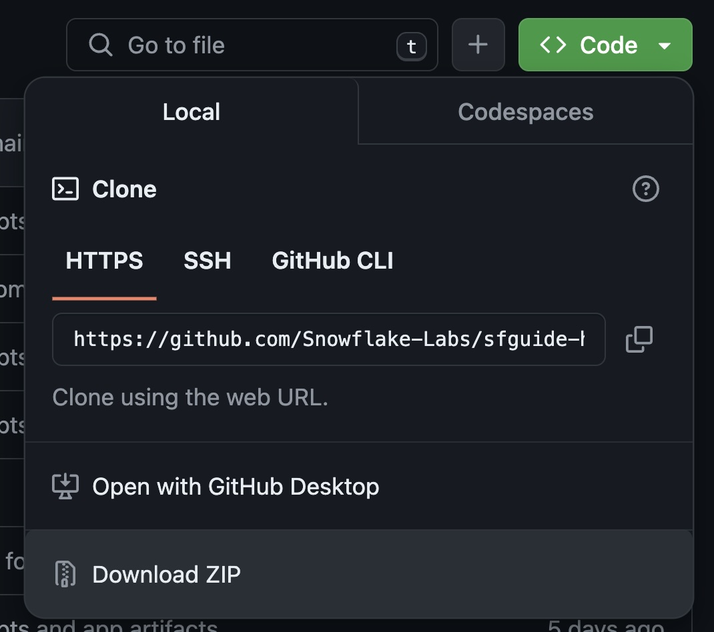

Load the SQL scripts in the `code/sql` directory into [Snowsight Worksheets](https://docs.snowflake.com/en/user-guide/ui-snowsight-worksheets-gs#create-worksheets-in-sf-web-interface) - one script per worksheet

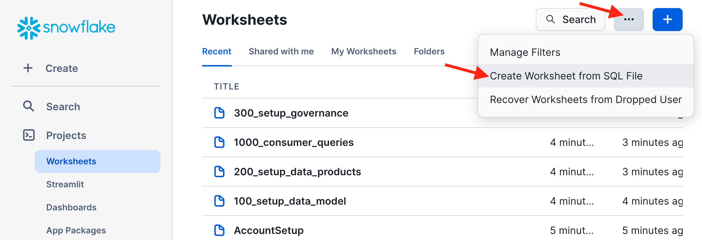

### Execute Setup SQL Scripts

1. `100_Setup_Data_Model`: create the TastyBytes foundational data model. 
[TastyBytes](https://quickstarts.snowflake.com/guide/tasty_bytes_introduction/index.html#3) is a fictitious global food truck network that operates in 30 major cities located in 15 countries with localized menu options and brands. The single `Frostbytes_Tasty_Bytes` is organized in the following schemas:
  - `RAW_CUSTOMER`: raw customer loyalty data with personally identifiable information (PII)
  - `RAW_POS`: raw point-of-sale data denormalized by orders, menu, franchise and country 
  - `HARMONIZED`: blended metrics for customers and orders
  - `ANALYTICS`: analytic data that delivers insights for aggregate trends and drill down
b
Use the __Run All__ pulldown command to run `100_Setup_Data_Model`:

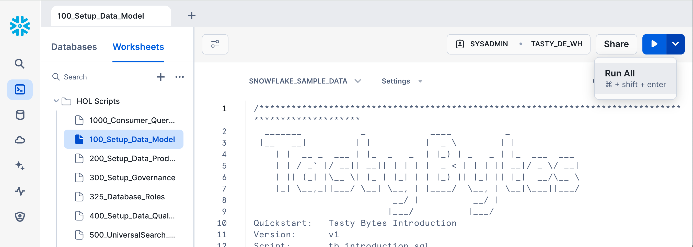

2. `200_Setup_Data_Products`: build data assets to share in a Listing.

In step 1(a) of thescript `200_Setup_Data_Products` you will acquire the <mark>Weather Source LLC</mark> listing from the Marketplace and install it as a shared database `FROSTBYTE_WEATHERSOURCE`.

```sql
-- Step 1(a) - Acquire "Weather Source LLC: frostbyte" Snowflake Marketplace Listing

/*--- 
    1. Click -> Data Products (Cloud Icon in left sidebar)
    2. Click -> Marketplace
    3. Search -> frostbyte
    4. Click -> Weather Source LLC: frostbyte
    5. Click -> Get
    6. Click -> Options
    6. Database Name -> FROSTBYTE_WEATHERSOURCE (all capital letters)
    7. "Which roles, in addition to ACCOUNTADMIN, can access this database?" -> PUBLIC
    8. Click -> Get
---*/
```

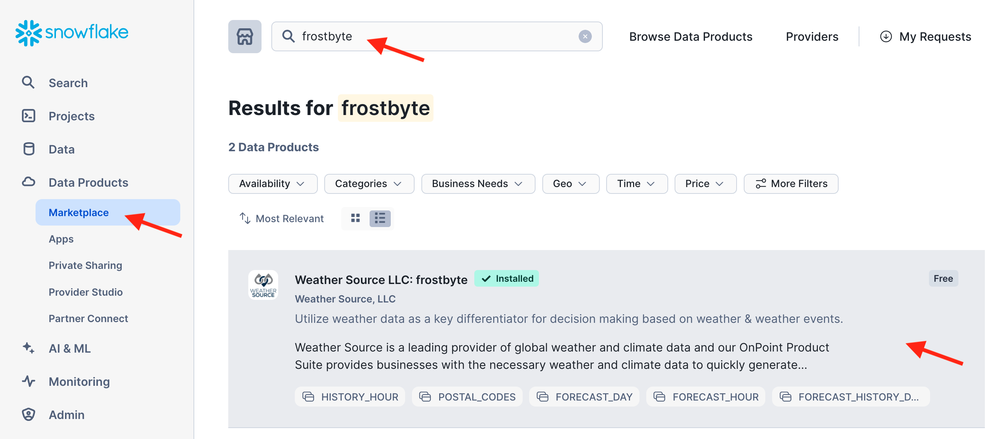

Then proceed to execute all remaining steps in this script. This will create secure views, materialized views, functions and dynamic tables in the ANALYTICS schema, and an internal stage for sharing text data. 

Check out all the new objects created in the ANALYTICS and HARMONIZED schemas in the Snowsight Object Explorer panel. You will later create a Listing to share all of these objects. 

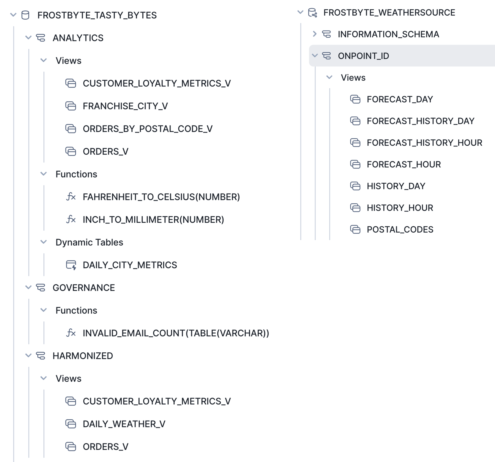


### Upload Unstructured Data into an Internal Stage

We have extracted 100 text files from the IMDB Large Movie Review dataset into the repo, that was cloned to your local machine earlier.

Now we can copy those text files into the internal stage `movie_stage` that was created by the SQL setup scripts.
Run the snow CLI commands at the root of your repo, where the `git clone` was done.

```bash
cd ~/git_repos/sfguide-horizon-intra-org
snow stage copy data/imdb_reviews @frostbyte_tasty_bytes.movie_reviews.movie_stage

# verify that there are now 100 files in the stage
snow stage list-files @frostbyte_tasty_bytes.movie_reviews.movie_stage
```

Setup is now complete!

<!-- ------------------------ -->
## Create, Publish and Install a Data Listing 
Duration: 20

In this section you will create, publish, consume, alter, and monitor a [listing](https://other-docs.snowflake.com/en/collaboration/collaboration-listings-about).
### Build and Publish a Listing in the Provider Studio UI

 1. Navigate to the Provider Studio and click the +Listing button in the top right:

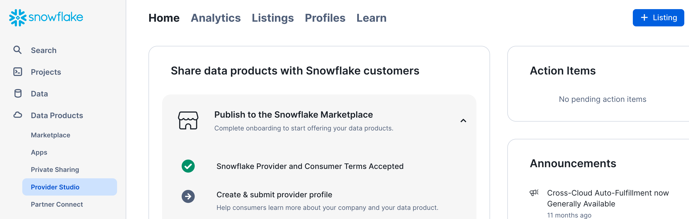

2. Give your listing a meaningful title. Then select the option that "Only Specified Consumers" can discover the listing, and that it will be a free listing. Click "Next".

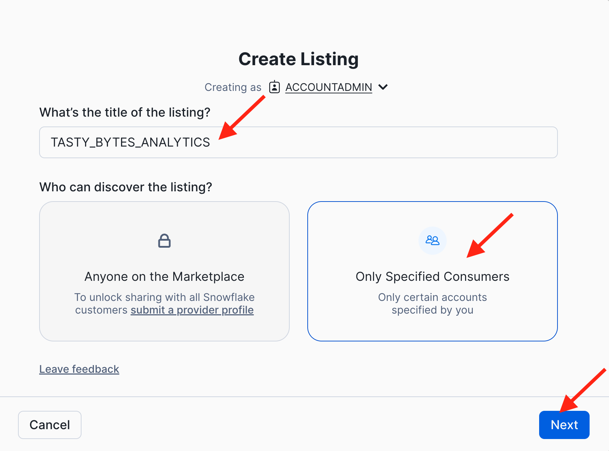

3. Click "+ Select" and add the secure functions, the dynamic table, and all the secure views in the ANALYTICS and HARMOIZED schemas to this listing. 

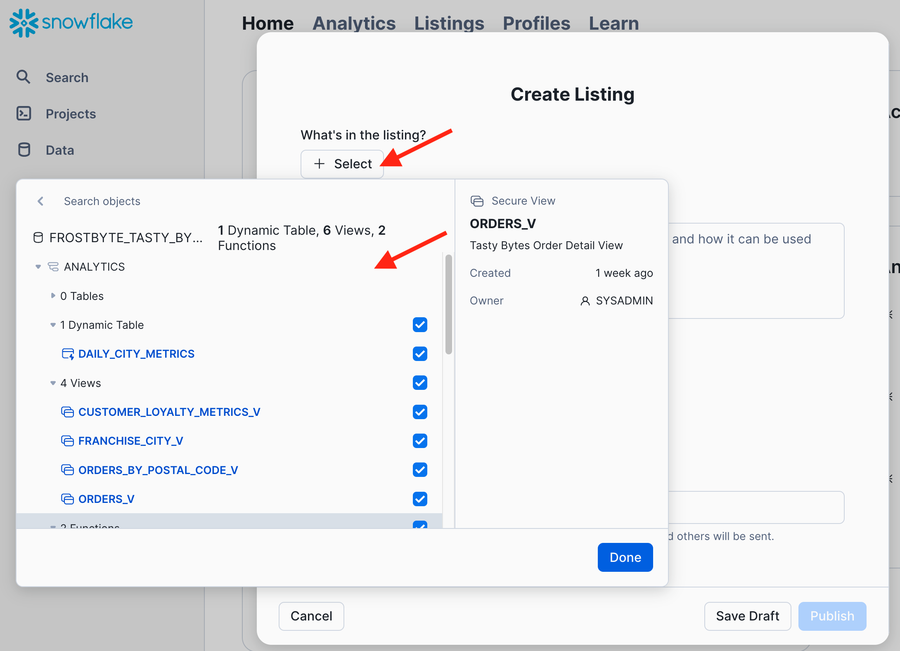

4. Continue the listing specification:
- Add a description to document your listing. 
  - For example: "This listing shares the Tasty Bytes Analytics and Harmonized data objects, including views, functions, and a dynamic table that provide a wealth of useful information."

- Add your two secondary accounts for this lab (one on AWS and one on Azure) as consumer accounts for this listing. Specify each consumer account as ```org-name.account-name```, which you can obtain as follows:
  ```sql
  select current_organization_name() ||'.'||  current_account_name();
  ```

- Further down in the same dialog, enter your email address to receive notifications about this listing. 
- Click "SAVE & ADD MORE INFORMATION" to add even more metdata to your listing.

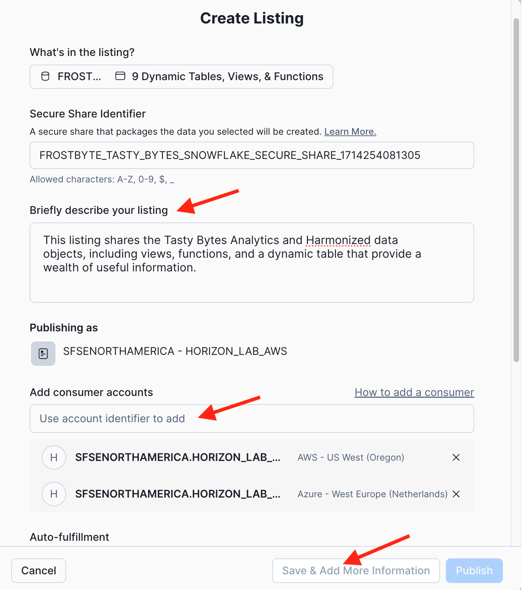

5. You are now looking at your draft listing. Scroll down and add all optional information items to your listing.

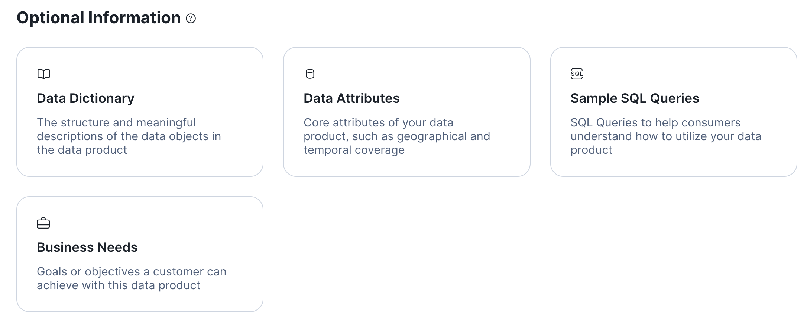

This will add additional sections to your listing. 

Click the ADD button in each of these sections to configure the data dictionary and to add business needs, sample queries, and attributes: 
- Configuring the data dictionary allows you to select "featured" objects that consumers will see first in the dictionary.
  - Select the views CUSTOMER_LOYALTY_METRICS_V and ORDERS_BY_POSTAL_CODE_V as well as the function FAHRENHEIT_TO_CELSIUS as featured objects.
- You can grab some sample queries from the script 1000_Consumer_Queries.sql
- Attributes allow you to specify service level objectives such as how often you intend to update the data product or other properties.


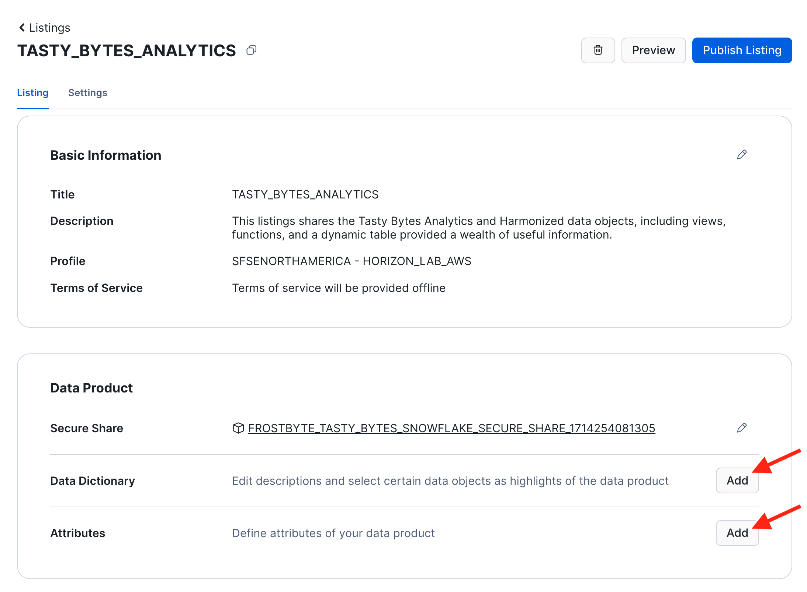

6. In your draft listing, navigate to the section "Consumer Accounts". Click the three dots on the right to update the refresh frequency of the replica that Snowflake will automatiucally create to share the data product with your Azure account. 
- For the purpose of this lab, set the replication frequency to 1 minute.


7. Publish your listing.

- You can preview your draft listing at any time. 
- When done, click the blue "Publish Listing" button in the top rigt corner. 


### Install the Listing in your Consumer Accounts


1. Switch to Consumer Account: Horizon_Lab_Azure_Consumer
- In a different tab of your web browser login to your account "horizon_lab_azure_consumer" that you created in the Azure West Europe Region.
- Use the menu in the bottom left of the UI to switch to the ACCOUNTADMIN role.
- Navigate to "Data Products" and then "Private Sharing" in the left hand menu panel.
- You will now see the listing that has been shared with this account.
- Click the listing name (not the Get button) to open and examine the listing details. For example, explore the data dictionary for the views and fucntions.

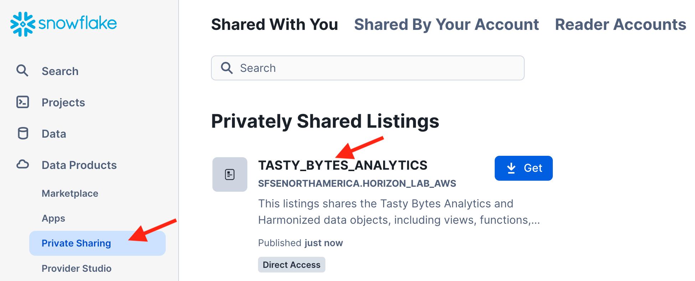

2. After reviewing the listing, click the GET button. 
- You may be asked for your name & email address if this is the first time a listing is being consumed in this Snowflake  account. Do provide this information, then go to your Email Inbox and validate the email that was sent.
- After you click the GET button Snowflake performs a one-time setup of the replication process ([auto-fulfillment](https://other-docs.snowflake.com/en/collaboration/provider-listings-auto-fulfillment)) to the local region.
- You may have to wait for several minutes for this one-time setup to complete. Click OK. We will check back later.

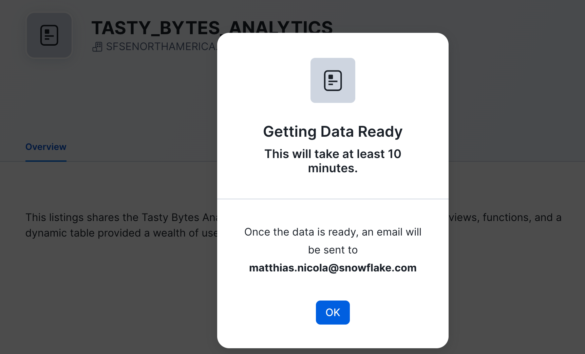

3. Switch to Consumer Account: Horizon_Lab_AWS_Consumer
- In yet another tab of your web browser login to your account "horizon_lab_aws_consumer".
- Use the menu in the bottom left to switch to the ACCOUNTADMIN role.
- Navigate to "Data Products" and then "Private Sharing".
- Click the listing name (not the Get button) to open and examine the listing details.

4. After reviewing the listing, click the GET button. 
- Again, you may be asked to provide and validate your email address.
- After you click the GET button you can immediately mount the shared data product. There is no replication setup in this case since the provider account is in the same cloud region as this consumer account.
- Under "Options" leave the local database name as is, and select the SALES_MANAGER_ROLE as an additional role to have immediate access to the data product. 
- Click GET to confirm 

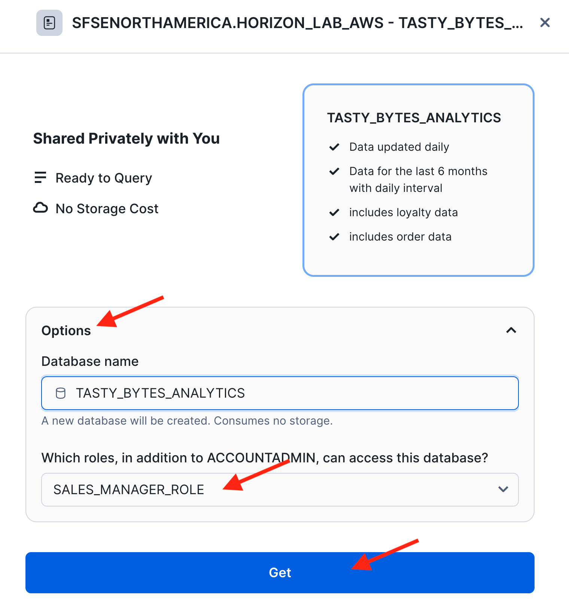

- You can now use a worksheet or the database explorer to examine the shared data as a consumer.

5. Observe live data sharing in action
- Switch to the **AWS Provider** account where you published the listing
- Insert or update some of the source data. You can use the following statement which uses [a very cool SQL feature](https://docs.snowflake.com/en/sql-reference/sql/select#label-select-cmd-examples-select-all-in-table-replace) to modify the columns produced by ```SELECT *```.  
The syntax ```SELECT * REPLACE (<expression> AS <column_name>)``` returns all columns but replaces the column ```<column_name>``` with the ```<expression>```.

```sql
-- re-insert existing data for Berlin but give it today's date as the valid date 
INSERT INTO FROSTBYTE_TASTY_BYTES.WEATHER.HISTORY_DAY
  SELECT * REPLACE  (current_date AS DATE_VALID_STD) 
  FROM FROSTBYTE_TASTY_BYTES.WEATHER.HISTORY_DAY
  WHERE city_name = 'Berlin'
  ORDER BY date_valid_std DESC;
  ```

- Switch back to your **Horizon_Lab_AWS_Consumer** account to see that the data changes are instantly visible. For example:

```sql
SELECT *
FROM tasty_bytes_analytics.HARMONIZED.DAILY_WEATHER_V
WHERE city_name = 'Berlin'
ORDER BY date_valid_std DESC;
```


## Listing Management and Monitoring
Duration: 20

### Use the Listing API to modify listing properties programmatically.

1. [SHOW LISTINGS](https://other-docs.snowflake.com/en/sql-reference/sql/show-listings) in the AWS Provider account where you published the listing.

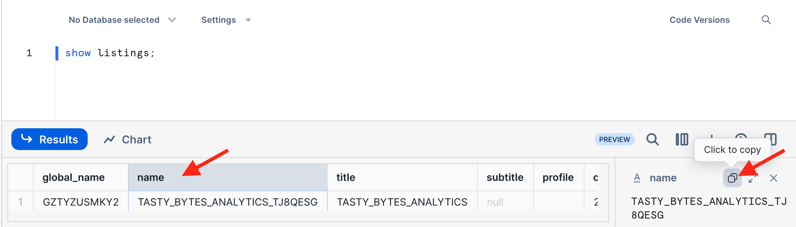

2. Copy the Snowflake object name of your listing and use it in the subsequent [DESCRIBE LISTING](https://other-docs.snowflake.com/en/sql-reference/sql/desc-listing) command.
  - Note: If that listing name contains special characters other than the underscore, then the name must be in double quotes and is case-sensitive.
3. In the result of DESCRIBE LISTING, scroll to the right to the column [MANIFEST_YAML](https://other-docs.snowflake.com/en/progaccess/listing-manifest-reference) and copy its column value. This YAML file is a complete representation of the listing and enables programmatic management of listings.

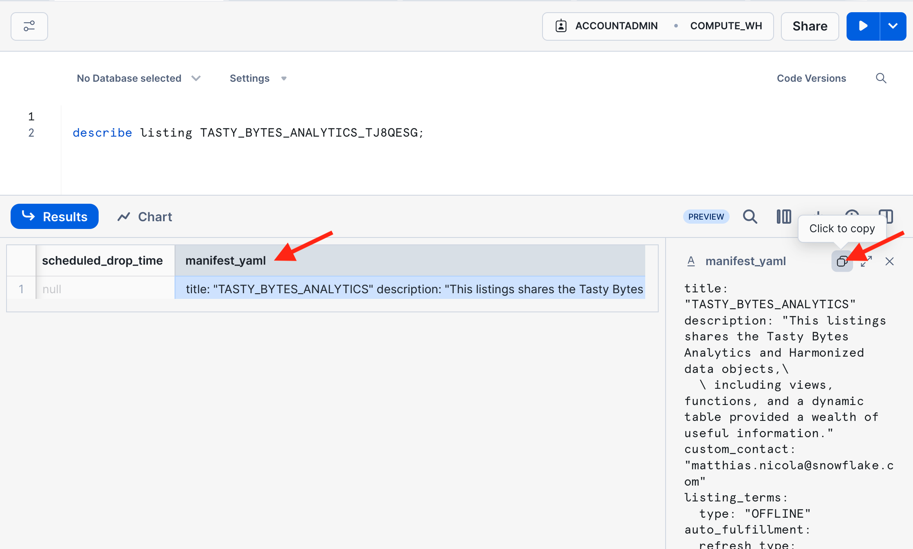

4. Paste the copied YAML into an [ALTER LISTING](https://other-docs.snowflake.com/en/sql-reference/sql/alter-listing) statement using the listing name obtained in step 2 above (Show Listing).
- Make some changes in the YAML that you can easily verify in the UI and on the consumer side. For example, update the title and the first line of the description. 
- Execute the ALTER LISTING statement.

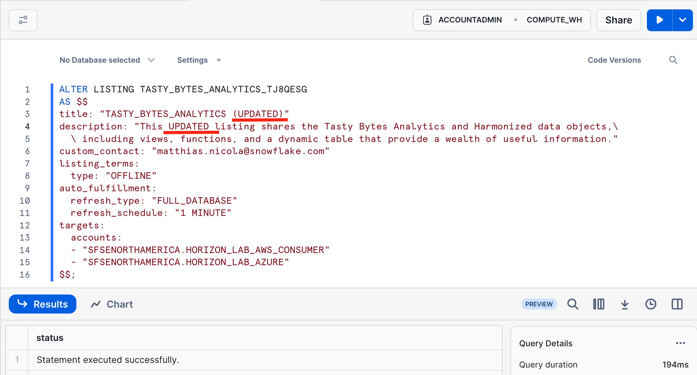

5. Verify the immediate effect of the ALTER LISTING statement
- In the provider account, navigate to the Provider Studio, select "Listings" from the horizontal menu at the top, and open your listing. 

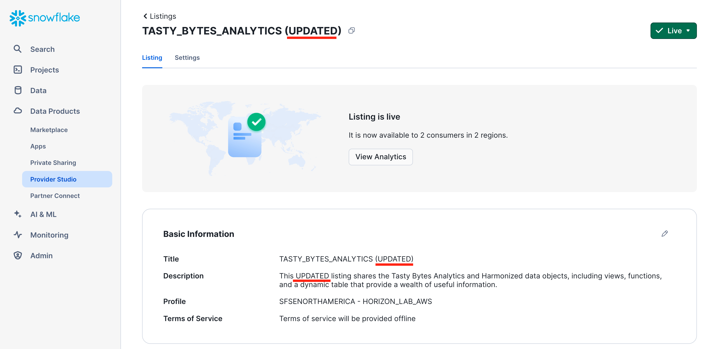

- Switch to your consumer account Horizon_Lab_AWS_Consumer.
- Navigate to "Data Products", then "Private Sharing", and open the listing page again. Refresh if needed to see the changes from the ALTER LISTING statement. 


### Monitor Auto Fulfillment status and cost

Time to revisit the second consumer account ("horizon_lab_azure_consumer") and the replication into that Azure region. By now, the one-time replication setup has been completed in the background and the data product is now ready to use.

1. Switch to the account "horizon_lab_azure_consumer" as ACCOUNTADMIN, and navigate to "Private Sharing" to open the listing that has been shared.

2. Click the GET button to mount the data product locally, as you did in the "horizon_lab_aws_consumer" account.

3. Switch to the AWS Provider account and take the following steps to monitor replication status and cost. 

4. Navigate to the "Provider Studio", select "Listings" from the horizontal menu at the top, and open your listing.

5. On the listings page, scoll down to "Consumer Account", click on the 3 dots, and select "Manage Regions & Replication"

6. Select the "Azure West Europe Region" to see the timestamp of the latest refresh to that region.

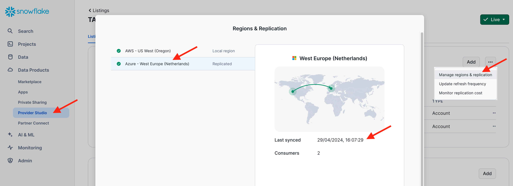

7. Go back to the Provider Studio, select "Analytics" from the horizontal menu at the top. This is where summarized and detailed statistics about the usage of the listings will be displayed eventually. There is some delay in populating these statistics, but the following screenshots give you an idea of what you will see.   

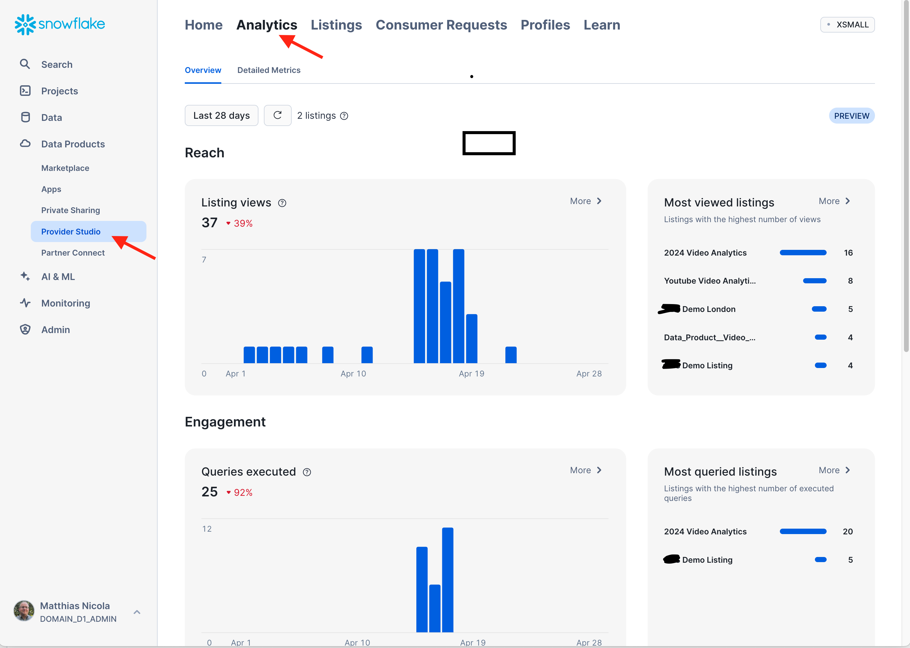

The same information as well as replication details can also be obtained from various views in the schema [SNOWFLAKE.DATA_SHARING_USAGE](https://docs.snowflake.com/en/sql-reference/data-sharing-usage) and [SNOWFLAKE.ORGANIZATION_USAGE](https://docs.snowflake.com/en/sql-reference/organization-usage):

```sql
use database SNOWFLAKE;

select * from DATA_SHARING_USAGE.LISTING_ACCESS_HISTORY;

select * from DATA_SHARING_USAGE.LISTING_AUTO_FULFILLMENT_DATABASE_STORAGE_DAILY;

select * from DATA_SHARING_USAGE.LISTING_AUTO_FULFILLMENT_REFRESH_DAILY;

select * from DATA_SHARING_USAGE.LISTING_EVENTS_DAILY;

select * from DATA_SHARING_USAGE.LISTING_TELEMETRY_DAILY;

select * from ORGANIZATION_USAGE.LISTING_AUTO_FULFILLMENT_USAGE_HISTORY;

select * from ORGANIZATION_USAGE.REPLICATION_USAGE_HISTORY:
```

8. The [replication cost](https://other-docs.snowflake.com/en/collaboration/provider-understand-cost-auto-fulfillment) can also be monitored in the UI. Navigate to the "Admin" menu in the left-hand panel, then to "Cost Management" and "Consumption". Switch the filter from "All Services" to "Cross-Cloud Auto-Fulfillment". Here is an example from a different test replicating a listing to the region Azure UK South:

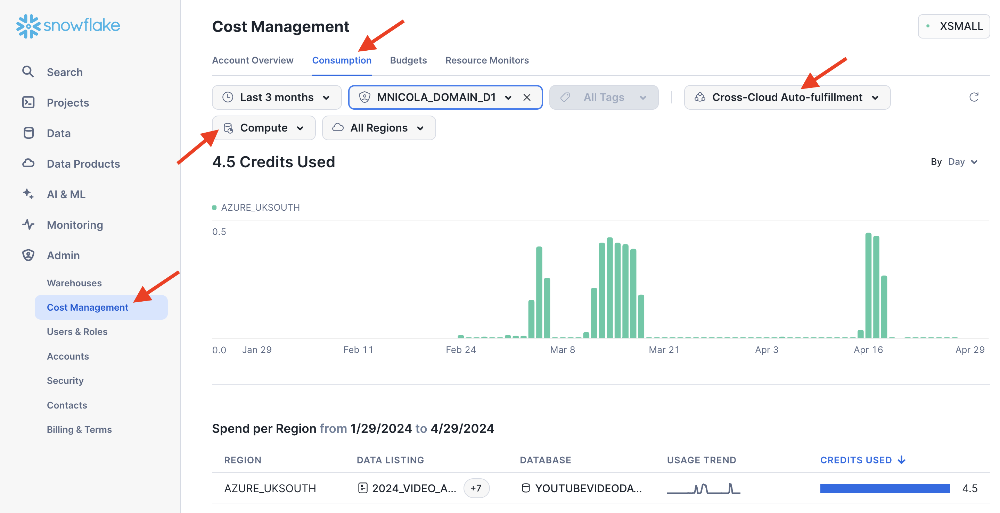

 Additional filters enable you to select a time period, pick a specific target region, or toggle between compute cost, storage cost, and data transfer volume incurred by the listing auto-fulfillment.

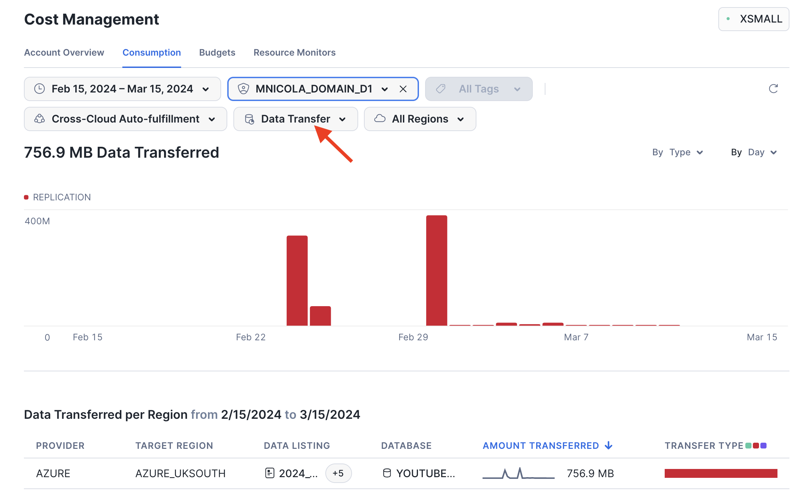

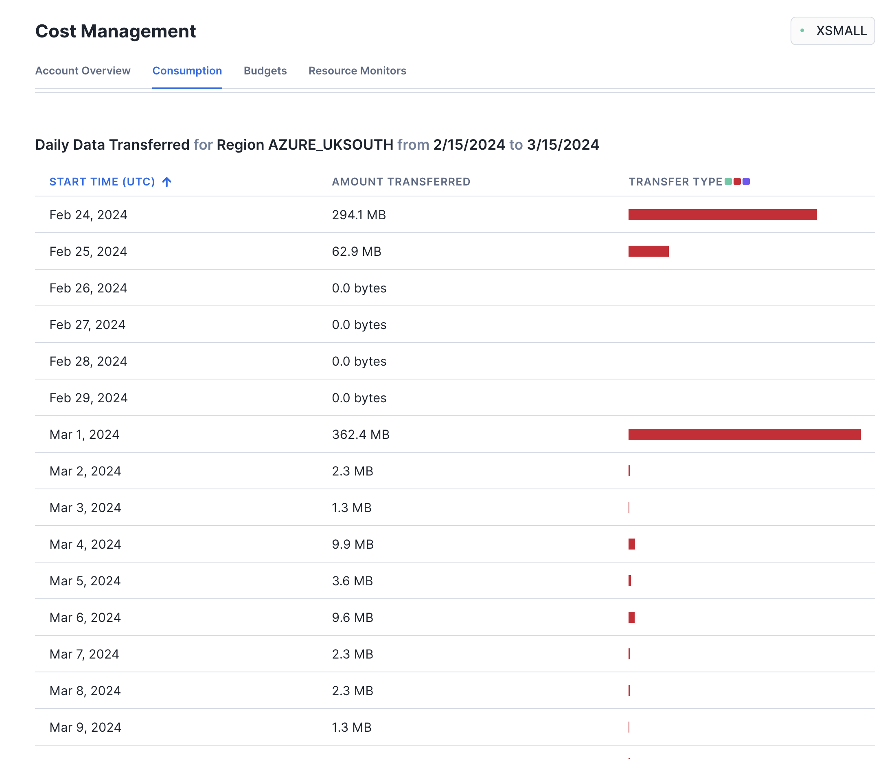


### Enable and Consume Change Tracking 

The provider of a listing can choose to enable [change tracking](https://docs.snowflake.com/en/user-guide/streams) on the some or all of the tables or views that are shared in a listing. This enables the consumer to track the data changes. Let's do that with the view DAILY_WEATHER_V: 

```sql
-- in the provider account:
ALTER VIEW FROSTBYTE_TASTY_BYTES.HARMONIZED.DAILY_WEATHER_V 
      SET CHANGE_TRACKING = TRUE;
```

The consumer can now [define a Stream](https://docs.snowflake.com/en/sql-reference/sql/create-stream) to capture the data changes in this view:

```sql
-- in the consumer account:
CREATE DATABASE tasty_bytes_local;
USE DATABASE tasty_bytes_local;

CREATE STREAM stream_daily_weather_changes ON VIEW tasty_bytes_analytics.HARMONIZED.DAILY_WEATHER_V;
```

To see the change tracking in action you can now insert, update, or delete some of the weather related data in the AWS Provider account. For example:

```sql
-- in the provider account:
INSERT INTO FROSTBYTE_TASTY_BYTES.WEATHER.HISTORY_DAY
  SELECT * REPLACE  (current_date AS DATE_VALID_STD) 
  FROM FROSTBYTE_TASTY_BYTES.WEATHER.HISTORY_DAY
  WHERE city_name = 'San Mateo'
  ORDER BY date_valid_std DESC;
  ```

Now switch to the consumer account and query the stream:

```sql
-- in the consumer account:
USE DATABASE tasty_bytes_local;

SELECT METADATA$ACTION, METADATA$ISUPDATE, * 
FROM stream_daily_weather_changes;
```


<!-- ------------------------ -->
## Protect Data with Governance Policies 
Duration: 20

This section of the lab introduces several capabilities for data providers to restrict the usage of their products by consumers.

### Cross-Account Row-Level Access Policies

Frosty the data steward is concerned that our listing that we have shared includes the view ANALYTICS.CUSTOMER_LOYALTY_METRICS_V which contains sensitive information that must not be accessible to all data consumers. He requests the following restrictions: 

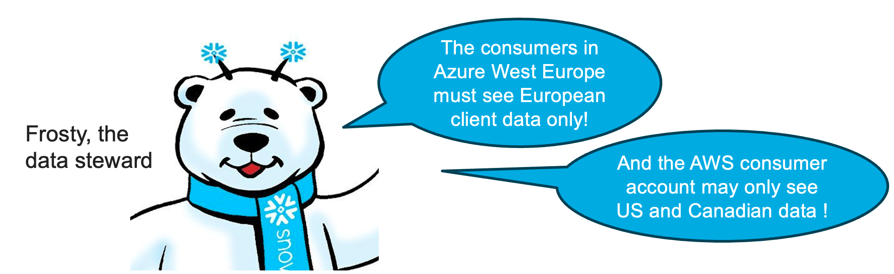

Let's implement a [row-level access policy](https://docs.snowflake.com/en/user-guide/security-row-intro) to implement the required access control. Note the usage of the context function **current_account_name()** to detect which consumer account is accessing the shared view. 

<mark>Fill in AWS Provider Account Name below</mark>

```sql
use database frostbyte_tasty_bytes;
use schema analytics;

CREATE OR REPLACE ROW ACCESS POLICY country_filter AS (country string) 
RETURNS boolean ->
  CASE
    WHEN current_account_name() IN ('HORIZON_LAB_AWS_CONSUMER') 
      AND country               IN ('United States', 'Canada') 
      THEN true
    WHEN current_account_name() IN ('HORIZON_LAB_AZURE_CONSUMER')        
      AND country               IN ('France', 'Germany', 'Poland', 'Sweden', 'Spain') 
      THEN true
    WHEN current_account_name() IN ('*** FILL IN AWS Provider Account Name ***')
      THEN true
      ELSE false
  END;
  ```

Then apply the policy to the shared view:

```sql
ALTER VIEW CUSTOMER_LOYALTY_METRICS_V ADD ROW ACCESS POLICY country_filter ON (country);
```
Now switch to the consumer account HORIZON_LAB_AWS_CONSUMER to confirm that only US and Canadian client data is visible in the view ANALYTICS.CUSTOMER_LOYALTY_METRICS_V.

After the replication interval of 1 minute you will also see that the consumer account HORIZON_LAB_AZURE_CONSUMER can only see the Eurpean clients.


###  Cross-Account Column Masking 
But, Frosty the data steward is not yet satisfied:

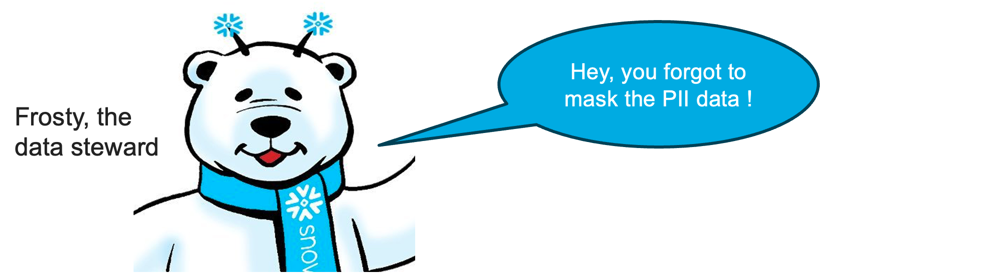

Ok, let's get to work. 

To make things easy, let's first create a tag that you can use to indicate which columns contain PII data. 

```sql
CREATE SCHEMA IF NOT EXISTS tags;

CREATE OR REPLACE TAG tags.tasty_pii
    ALLOWED_VALUES 'NAME', 'PHONE_NUMBER', 'EMAIL', 'BIRTHDAY'
    COMMENT = 'Tag for PII, allowed values are: NAME, PHONE_NUMBER, EMAIL, BIRTHDAY';
```

With the tag created, let's assign it to the relevant columns in the Customer Loyalty view:

```sql
ALTER VIEW ANALYTICS.CUSTOMER_LOYALTY_METRICS_V
    MODIFY COLUMN 
    first_name    SET TAG tags.tasty_pii = 'NAME',
    last_name     SET TAG tags.tasty_pii = 'NAME',
    phone_number  SET TAG tags.tasty_pii = 'PHONE_NUMBER',
    e_mail        SET TAG tags.tasty_pii = 'EMAIL';
```

Optionally, you can also use the UI to add or see the tags on these columns:

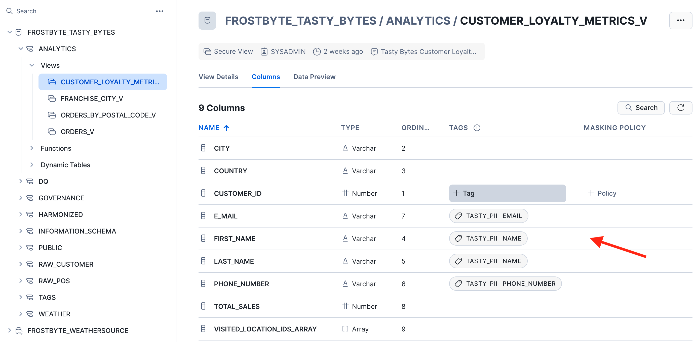

Now let's create a slightly more advanced [policy to mask the PII columns depending on their tag](https://docs.snowflake.com/en/user-guide/tag-based-masking-policies) value and the consmer account:

<mark>Fill in AWS Provider Account Name below</mark>

```sql
CREATE OR REPLACE MASKING POLICY pii_string_mask AS (value STRING) RETURNS STRING ->
  CASE
    -- two roles in the provider account have access to unmasked values 
    WHEN CURRENT_ACCOUNT_NAME() IN ('*** FILL IN AWS Provider Account Name ***') 
    AND CURRENT_ROLE()          IN ('ACCOUNTADMIN','SYSADMIN')
    THEN value

    -- For consumers in the 2nd AWS account: if a column is tagged with 
    -- TASTY_PII=PHONE_NUMBER then mask everything except the first 3 digits   
    WHEN CURRENT_ACCOUNT_NAME() IN ('HORIZON_LAB_AWS_CONSUMER') 
    AND SYSTEM$GET_TAG_ON_CURRENT_COLUMN('TAGS.TASTY_PII') = 'PHONE_NUMBER'
    THEN CONCAT(LEFT(value,3), '-***-****')
        
    -- For consumers in the Azure account: if a column is tagged with  
    -- TASTY_PII=EMAIL then mask everything before the @ sign  
    WHEN CURRENT_ACCOUNT_NAME() IN ('HORIZON_LAB_AZURE_CONSUMER') 
    AND SYSTEM$GET_TAG_ON_CURRENT_COLUMN('TAGS.TASTY_PII') = 'EMAIL'
    THEN CONCAT('**~MASKED~**','@', SPLIT_PART(value, '@', -1))
        
    -- all other cases and columns, such as first and last name, should be fully masked   
    ELSE '**~MASKED~**' 
  END;
```

Next, apply the policy to the tag so that the policy takes effect on all tages columns:

```sql
ALTER TAG tags.tasty_pii SET MASKING POLICY pii_string_mask;
```

Now switch to the consumer account HORIZON_LAB_AWS_CONSUMER and look at the view CUSTOMER_LOYALTY_METRICS_V to confirm that phone numbers are partially masked while the other PII columns are fully masked.

After the replication interval of 1 minute you will see in the account HORIZON_LAB_AZURE_CONSUMER that emails are partially masked while phone numbers and names are fully masked.  

### Database Roles - Provider Side

Just when we thought we had all the necessary governance controls in place, Frosty has a new requirement for us. 

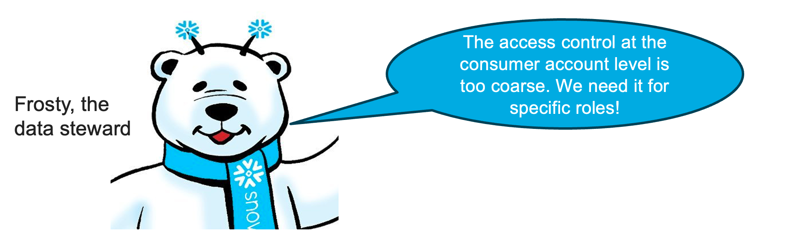

So far we have been using the context function **CURRENT_ACCOUNT_NAME()** in our governance policies to control which consumer account can see which data. Now Frosty is telling us, that this needs to be more fine-grained down to indivudal roles on the consumer side. 

We will be using roles and [database roles](https://docs.snowflake.com/en/sql-reference/sql/create-database-role) for 3 different continents. Let's check that we have the correct roles in place.

On the AWS Provider account, use **show database roles** to confirm that you have 4 database roles in place. Else create them now. 

```sql
show database roles in database FROSTBYTE_TASTY_BYTES;

USE DATABASE frostbyte_tasty_bytes;
CREATE OR REPLACE DATABASE ROLE tastybytes_emea_role;
CREATE OR REPLACE DATABASE ROLE tastybytes_americas_role;
CREATE OR REPLACE DATABASE ROLE tastybytes_apj_role;
CREATE OR REPLACE DATABASE ROLE tastybytes_manager_role;
```

We can use these roles to define more granular and role-based access control for the data consumers. First, we need to give these roles access to the providers's schema and objects that we want to govern, in this case ANALYTICS.CUSTOMER_LOYALTY_METRICS_V:

```sql
use database FROSTBYTE_TASTY_BYTES;

grant usage  on schema ANALYTICS to database role tastybytes_emea_role;
grant usage  on schema ANALYTICS to database role tastybytes_americas_role;
grant usage  on schema ANALYTICS to database role tastybytes_apj_role;
grant usage  on schema ANALYTICS to database role tastybytes_manager_role;

grant select on view ANALYTICS.CUSTOMER_LOYALTY_METRICS_V 
             to database role tastybytes_emea_role; 
grant select on view  ANALYTICS.CUSTOMER_LOYALTY_METRICS_V 
             to database role tastybytes_americas_role; 
grant select on view  ANALYTICS.CUSTOMER_LOYALTY_METRICS_V 
             to database role tastybytes_apj_role; 
grant select on view  ANALYTICS.CUSTOMER_LOYALTY_METRICS_V 
             to database role tastybytes_manager_role; 
```


Next, use the context function [**IS_DATABASE_ROLE_IN_SESSION()**](https://docs.snowflake.com/en/sql-reference/functions/is_database_role_in_session) to recreate our row-level access policy to define which role can see customer loyality data from which country.

<mark>Fill in Provider Account Name in the last WHEN clause of the policy below</mark>


```sql
use database frostbyte_tasty_bytes;
use schema analytics;

ALTER VIEW CUSTOMER_LOYALTY_METRICS_V DROP ROW ACCESS POLICY country_filter;

<mark>Fill in Provider Account Name below</mark>

CREATE OR REPLACE ROW ACCESS POLICY country_filter AS (country string) 
RETURNS boolean ->
  CASE
    -- users with the AMERICAS role can see data from the US, Canada, and Brazil
    WHEN IS_DATABASE_ROLE_IN_SESSION('TASTYBYTES_AMERICAS_ROLE') 
     AND country IN ('United States', 'Canada', 'Brazil') 
    THEN true
    -- users with the EMEA role can see data from these EMEA countries
    WHEN IS_DATABASE_ROLE_IN_SESSION('TASTYBYTES_EMEA_ROLE')         
     AND country IN ('France', 'Germany', 'Poland', 'Sweden', 
                     'Spain' , 'South Africa', 'Egypt') 
    THEN true
    -- users with the APJ role can see data from these APJ countries
    WHEN IS_DATABASE_ROLE_IN_SESSION('TASTYBYTES_APJ_ROLE')         
     AND country IN ('Japan', 'Australia', 'India', 'South Korea') 
    THEN true
    -- users with the manager role can see all data
    WHEN IS_DATABASE_ROLE_IN_SESSION('TASTYBYTES_MANAGER_ROLE')         
    THEN true
    -- the account admin in the provider account can see all data
    WHEN current_account_name() IN ('*** FILL IN AWS Provider Account Name ***') 
     AND current_role() = 'ACCOUNTADMIN'
    THEN true
    ELSE false
  END;

ALTER VIEW CUSTOMER_LOYALTY_METRICS_V 
      ADD ROW ACCESS POLICY country_filter ON (country);
```

For a larger number of roles and countries you can certainly use a mapping table from role to country so that the policy simply performs a lookup in the mapping table. 

The final step in the provider account is to share the database roles to the consumer accounts along with the data product.  This is achieved by [granting the database roles to the share](https://docs.snowflake.com/en/sql-reference/sql/grant-database-role-share):

```sql
-- Use your share name in these commands.
-- See below for hints on how to find your share name.
GRANT DATABASE ROLE tastybytes_emea_role     TO SHARE <share_name>;
GRANT DATABASE ROLE tastybytes_americas_role TO SHARE <share_name>;
GRANT DATABASE ROLE tastybytes_apj_role      TO SHARE <share_name>;
GRANT DATABASE ROLE tastybytes_manager_role  TO SHARE <share_name>;
```
Here are two options how to find the share name for your listing:

**Option 1:**

In the provider account, navigate to the Provider Studio, select "Listings" from the horizontal menu at the top, and open your listing. In the section "Data Product" you find the name of the Secure Share that bundles the shared data objects.
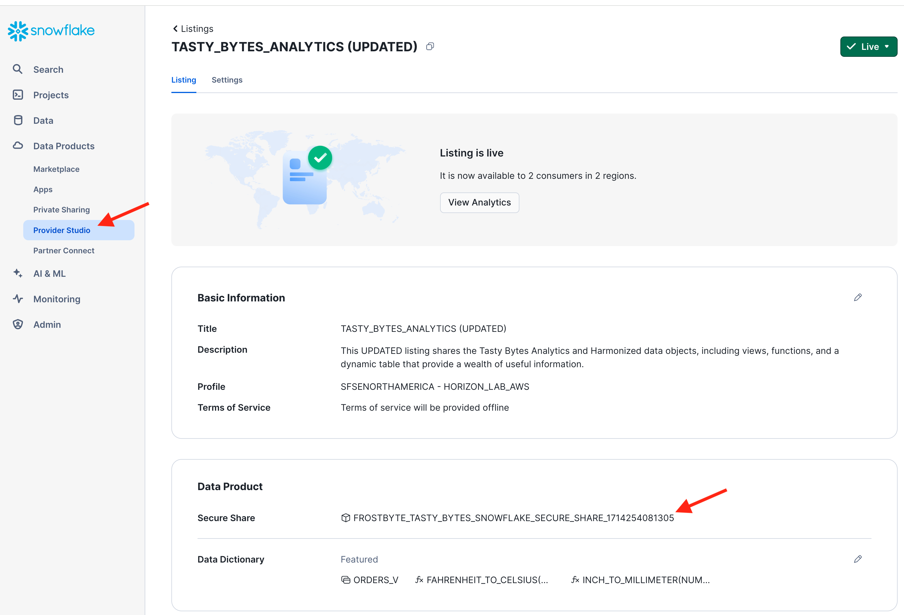


**Option 2:**

Use the SHOW SHARES command:


Copy the share name to a text file or worksheet because you will need it again later. 

### Database Roles - Consumer Side
To complete the configuration of cross-account role-based access control you need to assign the shared database roles to local account roles in the consumer roles. 

Switch to your consumer accounts.  

In each of your consumer accounts you should already have the following 4 roles that you created during the account setup. Verify that these roles are in place. Else, create them now.

```sql
SHOW ROLES LIKE 'SALES%';

CREATE OR REPLACE ROLE sales_emea_role     COMMENT = 'EMEA Sales role';
CREATE OR REPLACE ROLE sales_americas_role COMMENT = 'Americas Sales role ';
CREATE OR REPLACE ROLE sales_apj_role      COMMENT = 'APJ Sales role ';
CREATE OR REPLACE ROLE sales_manager_role  COMMENT = 'Manager (all-access) role';
```
In a real-world scenario you would now assign each of these roles to different users. For simplicity in this lab, grant all of these roles to yourself: 

```sql
SET my_user_var  = CURRENT_USER();
GRANT ROLE sales_emea_role     TO USER identifier($my_user_var);
GRANT ROLE sales_americas_role TO USER identifier($my_user_var);
GRANT ROLE sales_apj_role      TO USER identifier($my_user_var);
GRANT ROLE sales_manager_role  TO USER identifier($my_user_var);
```

And finally, grant the shared database roles to the local account roles. This connects these local consumers roles to the row-access policy that you create on the provider side. 

```sql
use database TASTY_BYTES_ANALYTICS;
grant database role tastybytes_emea_role     to role sales_emea_role; 
grant database role tastybytes_americas_role to role sales_americas_role;
grant database role tastybytes_apj_role      to role sales_apj_role; 
grant database role tastybytes_manager_role  to role sales_manager_role;
```
The following picture illustrates the use of our database roles in this data sharing scenario.

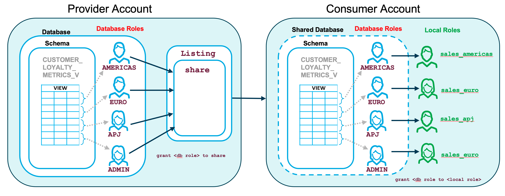

Now switch to the different local roles (sales_emea_role, sales_apj_role, etc) in each of your consumer accounts to verify that each local role can only see those rows in the CUSTOMER_LOYALTY_METRICS_V view that are permitted by the row-level access policy in the provider account.


### Aggregation and Projection Policies

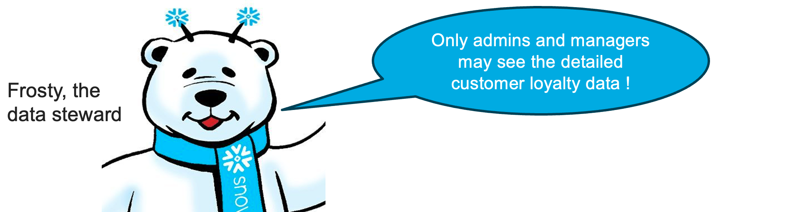

Frosty the data steward has a new requirement for us. In the consumer accounts, only admins and managers may see the detailed per-customer loyalty data. Anyone else may see aggregated data only. 

Create the following [aggregation policy](https://docs.snowflake.com/en/user-guide/aggregation-policies) to implement this requirement:

<mark>Fill in AWS Provider Account Name below</mark>

```sql
CREATE OR REPLACE AGGREGATION POLICY tasty_aggregation_policy
  AS () RETURNS AGGREGATION_CONSTRAINT ->
  CASE
      WHEN current_account_name() IN ('*** FILL IN AWS Provider Account Name ***') 
       AND current_role() = 'ACCOUNTADMIN'
      THEN NO_AGGREGATION_CONSTRAINT()

      WHEN IS_DATABASE_ROLE_IN_SESSION('TASTYBYTES_MANAGER_ROLE')
      THEN NO_AGGREGATION_CONSTRAINT()

      ELSE AGGREGATION_CONSTRAINT(MIN_GROUP_SIZE => 50) -- at least 50 rows in aggregate
    END;

ALTER VIEW analytics.CUSTOMER_LOYALTY_METRICS_V
  SET AGGREGATION POLICY tasty_aggregation_policy;
```

Now switch to your consumer account **horizon_lab_aws_consumer** to verify the effect of the aggregation policy:

```sql
use role sales_apj_role;
-- sales_apj_role gets blocked from accessing any individual records:
SELECT * FROM analytics.CUSTOMER_LOYALTY_METRICS_V;

-- sales_apj_role can execute aggregation queries:
SELECT city, count(*) as num_cust_per_city
FROM analytics.CUSTOMER_LOYALTY_METRICS_V
GROUP BY city;

-- sales_manager_role is permitted to access  individual records:
use role sales_manager_role;
SELECT * FROM analytics.CUSTOMER_LOYALTY_METRICS_V LIMIT 100;
```

Switch back to your AWS Provider account and issue the following command to deactivate the aggregation policy.

```sql
ALTER TABLE analytics.CUSTOMER_LOYALTY_METRICS_V UNSET AGGREGATION POLICY;
```

Next, let's also create a [projection policy](https://docs.snowflake.com/en/user-guide/projection-policies) that prevents the **city** column from appearing in a result set but allows its usage in predicates to the restrict a query result: 

<mark>Fill in AWS Provider Account Name below</mark>

```sql
CREATE OR REPLACE PROJECTION POLICY tasty_projection_policy
  AS () RETURNS PROJECTION_CONSTRAINT ->
  CASE
      WHEN current_account_name() IN ('*** FILL IN AWS Provider Account Name ***') 
       AND current_role() = 'ACCOUNTADMIN'
      THEN PROJECTION_CONSTRAINT(ALLOW => true)

      WHEN IS_DATABASE_ROLE_IN_SESSION('TASTYBYTES_MANAGER_ROLE')
      THEN PROJECTION_CONSTRAINT(ALLOW => true)

      ELSE PROJECTION_CONSTRAINT(ALLOW => false)
    END;

ALTER VIEW analytics.CUSTOMER_LOYALTY_METRICS_V
  MODIFY COLUMN city 
  SET PROJECTION POLICY tasty_projection_policy;
```


 Switch to your consumer account **horizon_lab_aws_consumer** again to explore the effect of the projection policy on the results or the following queries:

 ```sql
use role sales_apj_role;

SELECT *              FROM analytics.CUSTOMER_LOYALTY_METRICS_V;

SELECT * EXCLUDE city FROM analytics.CUSTOMER_LOYALTY_METRICS_V;

SELECT * EXCLUDE city 
FROM analytics.CUSTOMER_LOYALTY_METRICS_V
WHERE city IN ('Delhi','Tokyo','Seoul','Melbourne','Sydney','Mumbai');

SELECT city, count(*) as num_cust_per_city
FROM analytics.CUSTOMER_LOYALTY_METRICS_V
GROUP BY city;
```

Note that a projection policy by itself does not prevent users from detecting information about individuals. For example, the following query is permitted (and returns customer details if you remove the masking policy **pii_string_mask**):

 ```sql
SELECT * EXCLUDE city
FROM analytics.CUSTOMER_LOYALTY_METRICS_V
WHERE city = 'Melbourne' AND last_name = 'Arellano';
```


## Publish and Monitor Data Quality Metrics for Listings
Duration: 15

In this section the data provider will capture [data quality metrics](https://docs.snowflake.com/en/user-guide/data-quality-intro) and share them with the data consumers. In particular, we want to monitor the data quality in the view ANALYTICS.ORDERS_BY_POSTAL_CODE_V.

### Assign Built-in and Custom Data Quality Metrics to Shared Data

On AWS Provider account, execute the following commands to create a database where we will define any custom quality functions. 

```sql
use role accountadmin;
create or replace database tasty_bytes_quality;
use database tasty_bytes_quality;
create schema dq_functions;
```

Next, let's define how often the quality of ORDERS_BY_POSTAL_CODE_V should be checked. For a table, the quality checks can be triggered by data changes or executed on a schedule. For views, the quality metrics can (currently) be evaluated on a schedule. 

Let's set the schedule to the shortest possible interval, which is 5 minutes:

```sql
ALTER VIEW FROSTBYTE_TASTY_BYTES.ANALYTICS.ORDERS_BY_POSTAL_CODE_V
  SET DATA_METRIC_SCHEDULE = '5 MINUTE';
```

Now, let's use two of [Snowflake's built-in data quality functions](https://docs.snowflake.com/en/user-guide/data-quality-system-dmfs) to count the number of NULL valuse in the column POSTAL_CODE as well as the number of distinct cities reported in this view:

```sql
ALTER VIEW FROSTBYTE_TASTY_BYTES.ANALYTICS.ORDERS_BY_POSTAL_CODE_V
  ADD DATA METRIC FUNCTION SNOWFLAKE.CORE.NULL_COUNT ON (POSTAL_CODE);

ALTER VIEW FROSTBYTE_TASTY_BYTES.ANALYTICS.ORDERS_BY_POSTAL_CODE_V
  ADD DATA METRIC FUNCTION SNOWFLAKE.CORE.UNIQUE_COUNT ON (CITY);
```

Additionally, let's create a [custom data quality function](https://docs.snowflake.com/user-guide/data-quality-working#create-your-own-dmf) that counts the number of outliers, i.e. postal areas with an exceptionally high or low number of orders:

```sql
CREATE OR REPLACE DATA METRIC FUNCTION tasty_bytes_quality.dq_functions.postal_code_order_outliers (t TABLE  (count_order INTEGER) )
RETURNS INTEGER
AS
$$
  select count(*) 
  from t
  where count_order > 300000
     or count_order < 30
$$;
```

The owner of the object that is being monitored needs to have the privilege to execute the custom data metric function and use the database and schema where that function resides. Additional privileges are required to execute the built-in metric functions or view their results. To keep it simple, let's grant the following privileges to all users:

```sql
GRANT ALL ON FUNCTION tasty_bytes_quality.dq_functions.postal_code_order_outliers(TABLE(INTEGER)) to role public;
GRANT USAGE ON DATABASE tasty_bytes_quality              to role public;
GRANT USAGE ON SCHEMA   tasty_bytes_quality.dq_functions to role public;

GRANT EXECUTE DATA METRIC FUNCTION ON ACCOUNT            to role public;
GRANT DATABASE ROLE SNOWFLAKE.DATA_METRIC_USER           to role public;
GRANT DATABASE ROLE SNOWFLAKE.USAGE_VIEWER               to role public;
```

Now we can apply our customer quality function to the view ORDERS_BY_POSTAL_CODE_V:

```sql
ALTER VIEW FROSTBYTE_TASTY_BYTES.ANALYTICS.ORDERS_BY_POSTAL_CODE_V
  ADD DATA METRIC FUNCTION tasty_bytes_quality.dq_functions.postal_code_order_outliers 
  ON (count_order);
```

Use the following command to verify that all three quality metrics have been scheduled correctly. Any permission problems would be reflected in the column "schedule_status". Possible status values are [documented here](https://docs.snowflake.com/sql-reference/functions/data_metric_function_references#returns). 

```sql
  SELECT schedule_status, *
  FROM TABLE(
    INFORMATION_SCHEMA.DATA_METRIC_FUNCTION_REFERENCES(
      REF_ENTITY_NAME => 'FROSTBYTE_TASTY_BYTES.ANALYTICS.ORDERS_BY_POSTAL_CODE_V',
      REF_ENTITY_DOMAIN => 'VIEW'  )
  );
```  
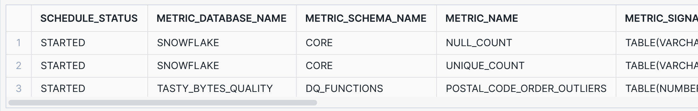

After 5 minutes you can start observing quality metrics in the [default event table](https://docs.snowflake.com/en/user-guide/data-quality-working#view-the-dmf-results) where all quality results are recorded:

  
  
<mark>Unfortuately, accessing **snowflake.local.data_quality_monitoring_results** is not yet available in Snowflake trial accounts. Skip ahead to the next section *Sharing Data quality Metrics* if you are using a trial account.</mark>

```sql
SELECT scheduled_time, measurement_time, metric_name, metric_schema,
       value, table_name, table_schema, table_database 
FROM snowflake.local.data_quality_monitoring_results  /* not yet available in trial accounts! */
ORDER BY measurement_time DESC;
```
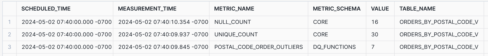

Additionally, you could define [Alerts](https://docs.snowflake.com/en/user-guide/alerts) to watch the data quality metrics and take action automatically if acceptable thresholds are exceeded. For example, if the number of outliers reported by our custom quality function exceeds a certain value an alert could copy the offending rows into an exception table for review and send an [email notification](https://docs.snowflake.com/en/user-guide/email-stored-procedures). 

  

### Sharing Data Quality Metrics
How to share quality metrics from the event table with data consumers? At the time of authoring this lab (May 2024) event tables cannot be shared in a Listing directly. Similarly, views, streams, and dynamic tables are not yet an option for sharing data quality events. 

And since Snowflake trial accounts cannot access the event table (yet!), let's setup a task that regularly inserts data quality metrics into a table for sharing: 

```sql
USE DATABASE FROSTBYTE_TASTY_BYTES;
CREATE SCHEMA FROSTBYTE_TASTY_BYTES.dq;

-- this table will hold and share 7 days worth of quality metrics:
CREATE OR REPLACE TABLE FROSTBYTE_TASTY_BYTES.dq.shared_quality_events 
  (measurement_time TIMESTAMP, 
   table_name       VARCHAR, 
   table_schema     VARCHAR, 
   table_database   VARCHAR, 
   metric_name      VARCHAR, 
   metric_schema    VARCHAR,
   value            INTEGER  );  
 

-- this task will maintain the table above:
CREATE OR REPLACE TASK FROSTBYTE_TASTY_BYTES.dq.subset_quality_events
   SCHEDULE = '3 MINUTE'
   AS BEGIN
        DELETE FROM dq.shared_quality_events
        WHERE measurement_time < current_date - 7;   

        INSERT INTO dq.shared_quality_events
           SELECT current_timestamp, 'ORDERS_BY_POSTAL_CODE_V',
                  'ANALYTICS', 'FROSTBYTE_TASTY_BYTES',
                  'NULL_COUNT', 'SNOWFLAKE.CORE',
                   SNOWFLAKE.CORE.NULL_COUNT(
                       SELECT POSTAL_CODE
                       FROM ANALYTICS.ORDERS_BY_POSTAL_CODE_V);
                       
        INSERT INTO FROSTBYTE_TASTY_BYTES.dq.shared_quality_events
           SELECT current_timestamp, 'ORDERS_BY_POSTAL_CODE_V',
                  'ANALYTICS', 'FROSTBYTE_TASTY_BYTES',
                  'UNIQUE_COUNT', 'SNOWFLAKE.CORE',
                   SNOWFLAKE.CORE.UNIQUE_COUNT(
                       SELECT city
                       FROM ANALYTICS.ORDERS_BY_POSTAL_CODE_V);               
                       
        INSERT INTO FROSTBYTE_TASTY_BYTES.dq.shared_quality_events
           SELECT current_timestamp, 'ORDERS_BY_POSTAL_CODE_V',
                  'ANALYTICS', 'FROSTBYTE_TASTY_BYTES',
                  'postal_code_order_outliers', 'dq_functions',
                   tasty_bytes_quality.dq_functions.postal_code_order_outliers(
                       SELECT count_order
                       FROM ANALYTICS.ORDERS_BY_POSTAL_CODE_V);                     
   END;

ALTER TASK subset_quality_events RESUME;
```

Now you can add the table "shared_quality_events" to the shared data product. Here are 2 options how you can so this.

**Option 1: Programmatically** 

Grant the share the necessary access to the "shared_quality_events" table. You should already have the share name from the early section on Database Roles. Else, get the share name as in the first step of option 2 below. 

```sql
GRANT USAGE ON SCHEMA FROSTBYTE_TASTY_BYTES.dq TO SHARE <share_name>;
 
GRANT SELECT ON FROSTBYTE_TASTY_BYTES.dq.shared_quality_events TO SHARE <share_name>;
```

**Option 2: In the UI** 

Take the following 3 steps in the UI:

1. In the provider account, navigate to the Provider Studio, select "Listings" from the horizontal menu at the top, and open your listing. In the section "Data Product" click on the name of the Secure Share that bundles the shared data objects.


2. You are now looking at a page detailing the underlying share. In the section "Data", click the "Edit" button:
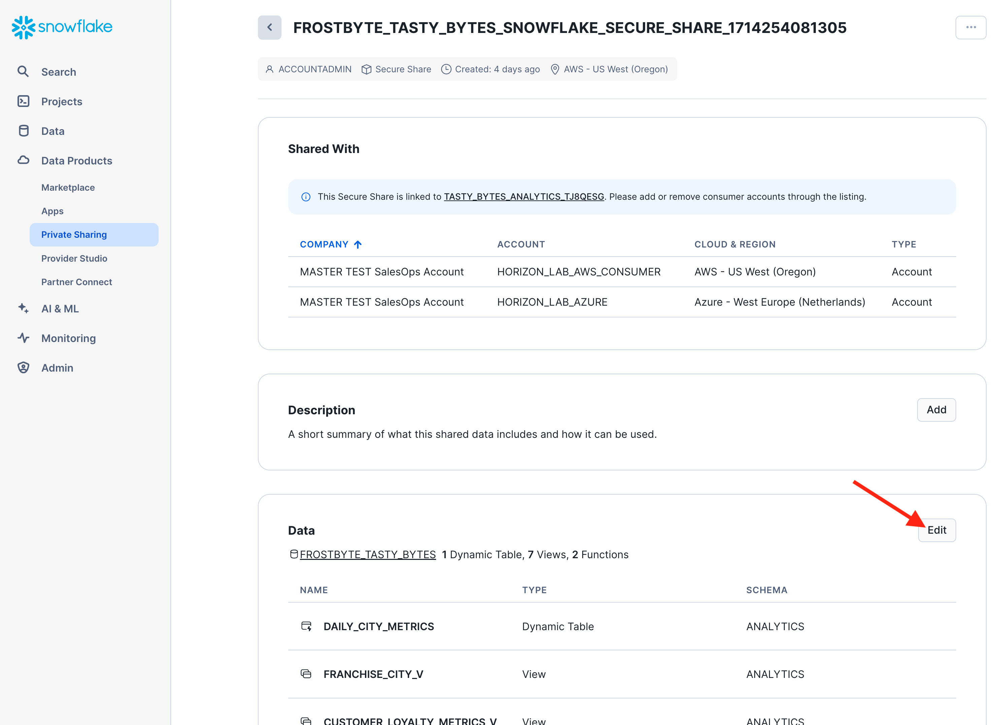

3. Now you can open the data explorer to find and select the table "dq.shared_quality_events". Click "Done" and "Save" to finalize the update of your data product. 
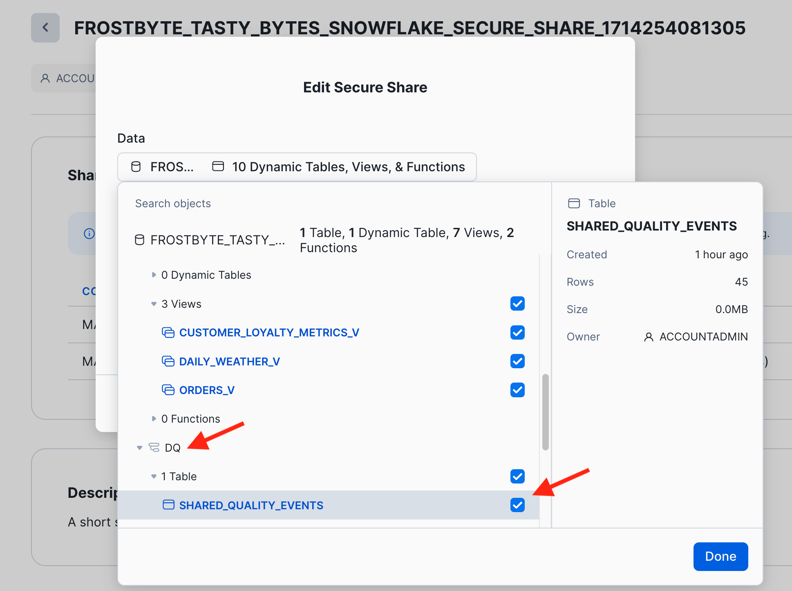

4. Switch to your consumer account "horizon_lab_aws_consumer" to verify that the data quality metrics are immediately visible as a new table in the data product. In the second consumer account "horizon_lab_azure_consumer" you will see the same after the 1 minute replication interval.

5. Go back to your provider account and suspend the task, to save credits in your trial account.
```sql
  ALTER TASK subset_quality_events SUSPEND;
  
  ALTER VIEW FROSTBYTE_TASTY_BYTES.ANALYTICS.ORDERS_BY_POSTAL_CODE_V
  UNSET DATA_METRIC_SCHEDULE;
```


<!-- ------------------------ -->
## Create, Publish and Install a Native Application Listing
Duration: 20

The [Snowflake Native Application Framework](https://docs.snowflake.com/en/developer-guide/snowflake-cli-v2/native-apps/overview) provides developers the ability to create data intensive applications that run *within* the Snowflake platform with versioning controls.
- Native Apps allow sharing of data and related business logic with other Snowflake accounts. 
- Native Apps are shared with Consumer accounts using a Listing. 
  - A listing can be free or paid, published on Marketplace or to specific accounts
- Rich visualizations can be include in the application with Streamlit.

### Native App Workflow
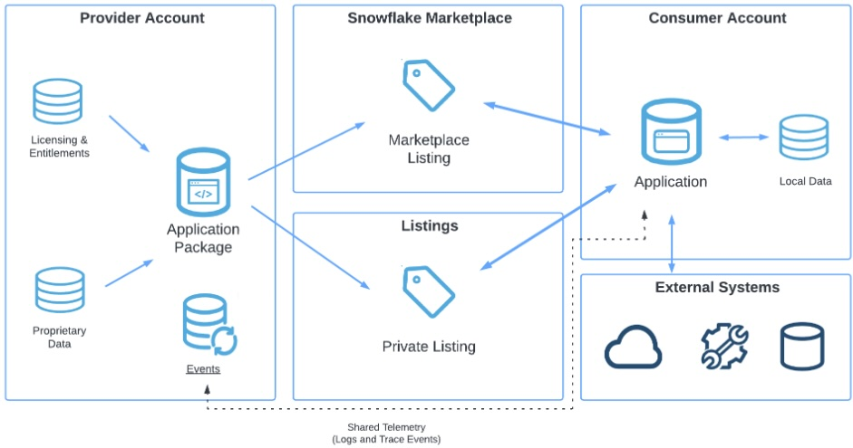

You will build a native app that visualizes Tasty Bytes food truck Sales over Time by City. 

The app will allow filtering on Year and City, while displaying the underlying raw data and associated SQL query. 
Consumer account admins responsible for installing the application will supply a country lookup table that restricts what is shown by Country using a row-access policy.

### Overview of Project Structure
Here is the directory structure of the code repository that was cloned or downloaded from GitHub earlier, relevant to `app` artifacts for the native app:

```plaintext
|-- app
|   |-- src
|       |-- libraries
|       |   |-- environment.yml
|       |   |-- frosty_bytes_sis.py
|       |   |-- procs.py
|       |   |-- udf.py
|       |-- manifest.yml
|       |-- setup_script.sql
|       |-- readme.md
|-- scripts
|   |-- setup_package_script.sql
|-- snowflake.yml
```

>`src` - stores all source code including stored procedures, user-defined functions (UDFs), streamlit application and installation script `setup_script.sql`.

>`setup_script.sql` - defines all Snowflake objects used within the application. Runs every time a user installs the application, such as when a Consumer account installs the listing.

Here is a snippet from `setup_script.sql` that shows how a row-access policy limits country sales based on consumer region and role.
```sql
-- Create Row-Access Policy to limit access by Consumer region using a local mapping table
CREATE OR REPLACE TABLE app_instance_schema.region_country_map(region STRING, country STRING);

INSERT INTO app_instance_schema.region_country_map
    VALUES  ('PUBLIC.AZURE_WESTEUROPE','Germany'),
            ('PUBLIC.AZURE_WESTEUROPE','Spain'),
            (......);

CREATE OR REPLACE ROW ACCESS POLICY app_instance_schema.country_row_policy
    AS (country STRING) RETURNS BOOLEAN -> 
    country = 'Canada' 
    OR current_role() IN ('ACCOUNTADMIN','SYSADMIN','SALES_MANAGER_ROLE')
    OR EXISTS 
    (
        SELECT 1
        FROM app_instance_schema.region_country_map map
        WHERE 1=1
        AND map.region = current_region()
        AND map.country = country
    )
COMMENT = 'Policy to limit rows returned based on region';

ALTER VIEW app_instance_schema.orders_v
  ADD ROW ACCESS POLICY app_instance_schema.country_row_policy ON (country);
```

>`manifest.yml` - defines version metadata, location of artifacts (setup script, streamlit), configuration of logging/tracing.

>`setup_package_script.sql` - shares provider data that is needed by the application, executed when the application package is deployed or upgraded.

>`snowflake.yml` - Snowflake CLI configuration file that contains native app name, location of source code directory, location of package setup script `setup_package_script.sql`

>`frosty_bytes_sis.py` - Streamlit visualization python script that accesses the shared data within the application package.

Refer to the [Getting Started with Native Apps](https://quickstarts.snowflake.com/guide/getting_started_with_native_apps/index.html?index=..%2F..index#0) Quickstart for more details.


### Create Application Package using Snowflake CLI

Now let's create the Snowflake Application Package from the project files in our repo!

Open a new terminal at the root of the repository cloned/downloaded from Github and execute the following commands:

```bash
# verify that 3 account connections exist, with AWS Provider Account as DEFAULT
snow connection list
+-------------------------------------------------------------------------------------------------------------------------------+
| connection_name        | parameters                                                                              | is_default |
|------------------------+-----------------------------------------------------------------------------------------+------------|
| horizon-aws-provider   | {'account': '***orgname-accountname***', 'user': 'horizonadmin', 'password':            | True       |
|                        | '****', 'warehouse': 'compute_wh', 'role': 'accountadmin'}                              |            |
| horizon-aws-consumer   | {'account': '**orgname**-horizon_lab_aws_consumer', 'user': 'horizonadmin',             | False      |
|                        | 'password': '****', 'warehouse': 'compute_wh', 'role': 'accountadmin'}                  |            |
| horizon-azure-consumer | {'account': '***orgname***-horizon_lab_azure_consumer', 'user': 'horizonadmin',         | False      |
|                        | 'password': '****', 'warehouse': 'compute_wh', 'role': 'accountadmin'}                  |            |
+-------------------------------------------------------------------------------------------------------------------------------+

snow app version create --skip-git-check

snow sql -q 'ALTER APPLICATION PACKAGE horizon_quickstart_package SET DEFAULT RELEASE DIRECTIVE version=V1 patch=0'
+---------------------------------------------------------+
| status                                                  |
|---------------------------------------------------------|
| Default release directive set to version 'V1', patch 0. |
+---------------------------------------------------------+
```

The `app version create` command will upload source files to a stage and create the application package.
Setting the default release version and patch is a required step before the application package can be published in a listing.
Documentation for publishing native applications is [here](https://other-docs.snowflake.com/en/native-apps/provider-publishing-app-package#workflow-for-publishing-an-application-package)

You should now see the <mark>HORIZON_QUICKSTART_PACKAGE</mark> listed under the `Databases` panel in Snowsight.

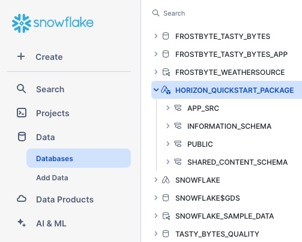

### Publish App Package as a Listing targeted at our AWS, Azure Consumer Accounts

Return to Snowsight and ensure your role is `ACCOUNTADMIN` (check and set if necessary at the bottom left corner)

Navigate to **Provider Studio** (under Data Products) and click on `+ Listing` to author a native app listing.

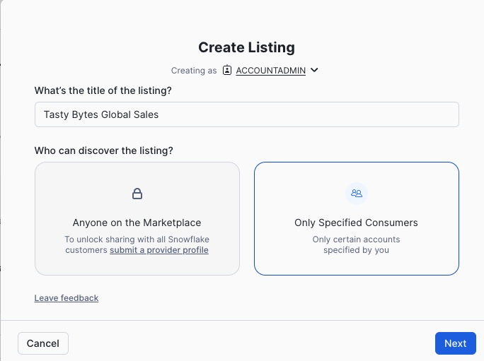

Now select the `HORIZON_QUICKSTART_PACKAGE` and fill in a brief description using the rich text editor.
You can use this text to get started, but feel free to get creative!

> _[Tasty Bytes](https://quickstarts.snowflake.com/guide/tasty_bytes_introduction/index.html#0) is a fictitious global food truck network_ 
> _that is on a mission to serve unique food options with high quality items in a safe, convenient and cost effective way._
> _In order to drive forward on their mission, Tasty Bytes is beginning to leverage the Snowflake Data Cloud._
>
> This application provides **Total Sales (USD) by Year** for selected cities in an interactive graphical visualization.
> The cities available are dependent upon the Consumer account region: only sales for regional cities are shown.
> Also displayed are the underlying raw sales data and associated SQL query.

Add 2 Consumer Accounts: `<YOUR-ORGNAME>.HORIZON_LAB_AWS_CONSUMER` and `<YOUR-ORGNAME>.HORIZON_LAB_AZURE_CONSUMER`

The addition of a consumer account in a different cloud (or region) will reveal the auto-fulfillment panel. 
Provide your email to receive notifications and **Publish**

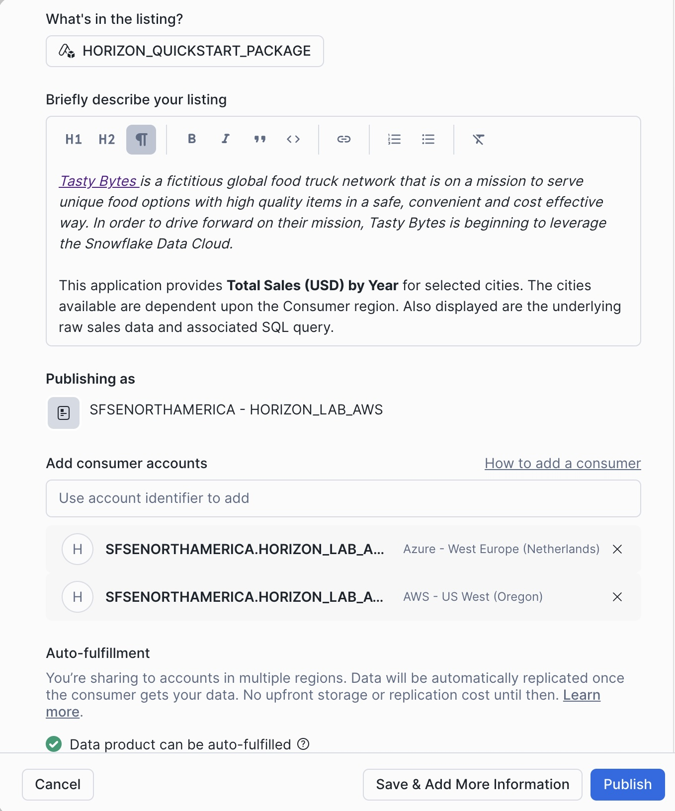

Initially the auto-fulfillment frequency is set to 1 Day, you can change it to 15 minutes after the listing is published.

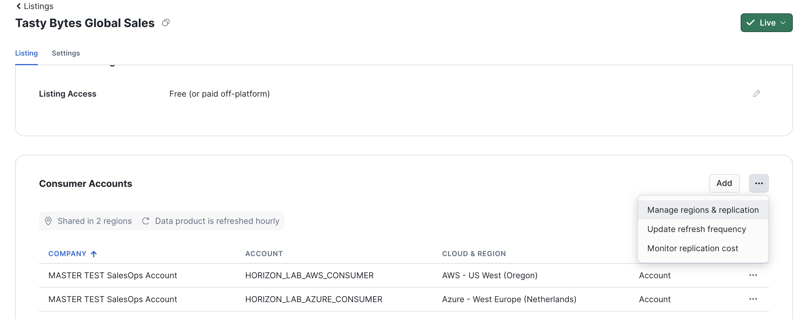


### Install the Tasty Bytes Sales App on Azure Consumer (HORIZON_LAB_AZURE_CONSUMER)

We are now at the moment of truth! 

<mark>HORIZON_LAB_AZURE_CONSUMER</mark>

With listing auto-fulfillment, replication will only be initiated from Provider AWS region to Consumer Azure region when there is a request.
Navigate to Snowsight `Data Products -> Private Sharing` to acquire the Tasty Bytes Global Sales application:

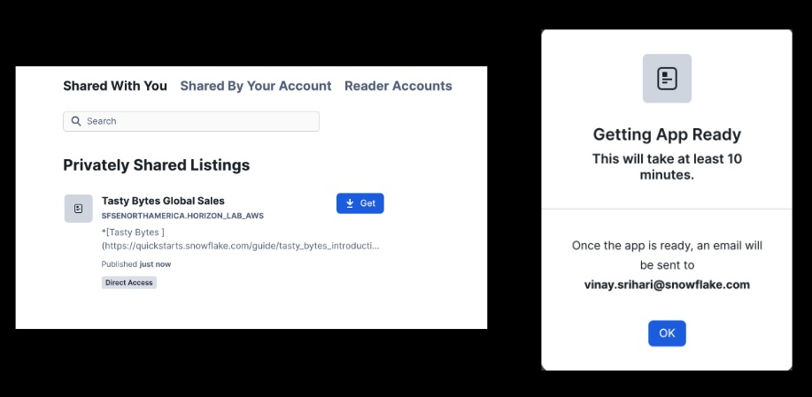

While the application objects are being delivered cross-cloud, we can now switch to the local AWS region consumer and install immediately.

<mark>HORIZON_LAB_AWS_CONSUMER</mark>

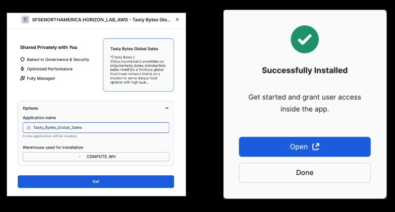

Open the application and while it is spinning up, click on the `Manage Access` button at top-right and give **PUBLIC** access.

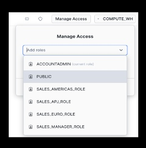

Now try adding a few cities in addition to _Vancouver_:

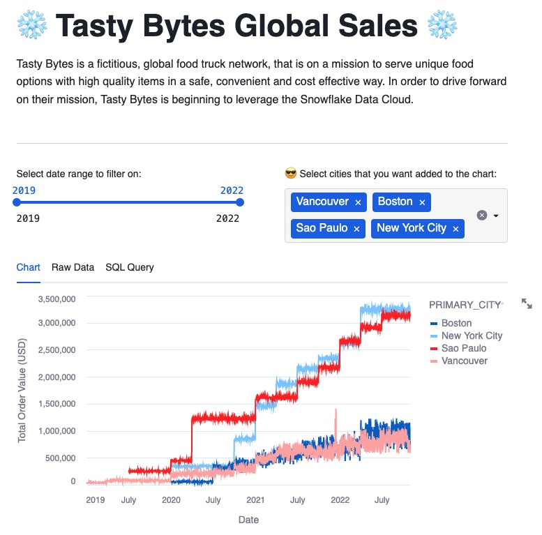

Tasty Bytes is sold in 15 countries and 30 cities worldwide.
Consider these questions and see if you can come up with convincing answers:
  1. What is the query that generates the city list in the Streamlit graph? [Hint: see `frosty_bytes_sis.py`]
  2. How many cities can be selected? If not all, why not? [Hint: see `setup_script.sql`]
  3. Try different roles [`ACCOUNTADMIN`,`SALES_MANAGER_ROLE`,`PUBLIC`] - does the city list change?

Now it is time to return to <mark>HORIZON_LAB_AZURE_CONSUMER</mark> and check if auto-fulfillment has completed...

Open the application and again while it is spinning up, click on the `Manage Access` button to give **PUBLIC** access.

Try adding a few cities in addition to _Vancouver_ as we did with the AWS US West consumer account

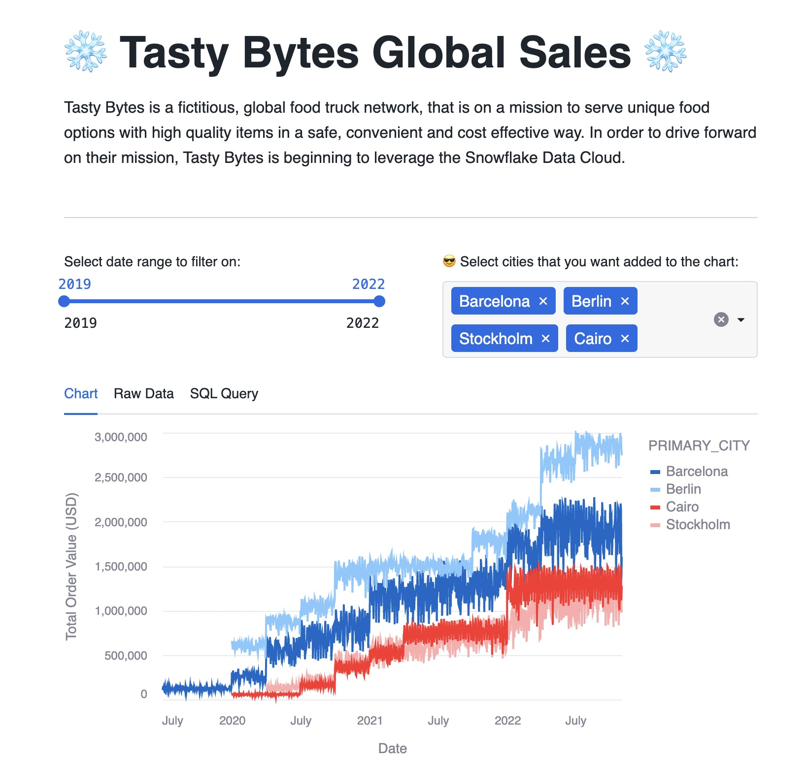

  1. Why is the country list different in the Azure West-Europe region (except Vancouver!)?
  2. Again, does it make any difference with different roles?

```
Streamlit does not currently allow role-based policies because of security concerns, so only the region mapping in the policy will apply.
```

To observe how the row-access policy evaluation of `current_role()` works in an application instance, outside of Streamlit, step through this SQL snippet in a `Worksheet` on <mark>HORIZON_LAB_AWS_CONSUMER</mark> and <mark>HORIZON_LAB_AZURE_CONSUMER</mark> accounts:

```sql
USE APPLICATION TASTY_BYTES_GLOBAL_SALES;

USE ROLE ACCOUNTADMIN;
select distinct primary_city from tasty_bytes_global_sales.app_instance_schema.orders_v;

USE ROLE SALES_AMERICAS_ROLE;
select distinct primary_city from tasty_bytes_global_sales.app_instance_schema.orders_v;

USE ROLE SALES_APJ_ROLE;
select distinct primary_city from tasty_bytes_global_sales.app_instance_schema.orders_v;

USE ROLE SALES_EMEA_ROLE;
select distinct primary_city from tasty_bytes_global_sales.app_instance_schema.orders_v;

USE ROLE SALES_MANAGER_ROLE;
select distinct primary_city from tasty_bytes_global_sales.app_instance_schema.orders_v;
```


<!-- ------------------------ -->
## Share Snowflake-Managed Iceberg Tables
Duration: 10

Iceberg tables in Snowflake combine the performance and query semantics of regular Snowflake tables with external cloud storage managed by the customer. Snowflake supports Iceberg tables that use the Apache Parquet file format.

Creating and writing data into a Snowflake Iceberg table is beyond the scope of this lab; we will focus only on the Consumer side of Iceberg table sharing.

Using the method outlined in [Getting Started with Iceberg Tables](https://quickstarts.snowflake.com/guide/getting_started_iceberg_tables/index.html?index=..%2F..index#0) Quickstart, create Iceberg Tables and policies based on what we created in the previous lab section:
- Provider AWS Account: create an Iceberg Table `ICEBERG_LAB.RAW_CUSTOMER.CUSTOMER_LOYALTY` from the `FROSTBYTE_TASTY_BYTES.RAW_CUSTOMER.CUSTOMER_LOYALTY` table.
- Provider AWS Account: create an Iceberg Table `ICEBERG_LAB.RAW_POS.ORDER_HEADER` from the `FROSTBYTE_TASTY_BYTES.RAW_POS.ORDER_HEADER` table.
- Provider AWS Account: create `ICEBERG_LAB.ANALYTICS.CUSTOMER_LOYALTY_METRICS_V` secure view, create row-access policy `ICEBERG_LAB.GOVERNANCE.CUSTOMER_COUNTRY_ROW_POLICY` and apply to `CUSTOMER_LOYALTY.COUNTRY` column. 
- Provider AWS Account: create aggregation policy `ICEBERG_LAB.GOVERNANCE.TASTY_ORDER_AGG_POLICY` and apply to `ORDER_HEADER` table.
- Provider AWS Account: create a listing called `ICEBERG_LAB_ANALYTICS`, attach the `ICEBERG_LAB` table and view objects, share with the Consumer AWS account.

<mark>On HORIZON_LAB_AWS_CONSUMER and HORIZON_LAB_AZURE_CONSUMER accounts:</mark>

In Snowsight, navigate to `Private Sharing` and install the `ICEBERG_LAB_ANALYTICS` listing that was shared by the AWS Provider.

Now run these queries and compare performance and results for Iceberg Tables with the regular tables/views we explored earlier.

```sql
--- Verify row-access policy is in effect for the Iceberg Customer_Loyalty table
USE DATABASE ICEBERG_LAB_ANALYTICS;

USE ROLE sales_manager_role;
SELECT
    clm.city,
    ROUND(SUM(clm.total_sales), 0) AS total_sales_usd
FROM analytics.customer_loyalty_metrics_v clm
GROUP BY clm.city
ORDER BY total_sales_usd DESC;

USE ROLE sales_apj_role;
SELECT
    clm.city,
    ROUND(SUM(clm.total_sales), 0) AS total_sales_usd
FROM analytics.customer_loyalty_metrics_v clm
GROUP BY clm.city
ORDER BY total_sales_usd DESC;
```

Now let us try a join between both shared Iceberg tables and observe how the policies established by the Provider are enforced.

```sql
-- Check join between two Iceberg Tables with aggregation policy
USE DATABASE ICEBERG_LAB_ANALYTICS;

-- What are the Total Order amounts in each city by Gender?
USE ROLE sales_manager_role;
SELECT 
    cl.gender,
    cl.city,
    COUNT(oh.order_id) AS count_order,
    ROUND(SUM(oh.order_amount),0) AS order_total,
    current_time()
FROM raw_pos.order_header oh
JOIN raw_customer.customer_loyalty cl
    ON oh.customer_id = cl.customer_id
GROUP BY ALL
ORDER BY order_total DESC;

USE ROLE sales_americas_role;
SELECT 
    cl.gender,
    cl.city,
    COUNT(oh.order_id) AS count_order,
    ROUND(SUM(oh.order_amount),0) AS order_total,
    current_time()
FROM raw_pos.order_header oh
JOIN raw_customer.customer_loyalty cl
    ON oh.customer_id = cl.customer_id
GROUP BY ALL
ORDER BY order_total DESC;
```

<!-- ------------------------ -->
## Share Unstructured Data within and across cloud regions
Duration: 20

We have previously staged 100 movie reviews extracted from the [IMDB Large Movie Review Dataset](https://ai.stanford.edu/~amaas/data/sentiment/).

Directory Tables are built-in Snowflake objects that provide an updated, tabular file catalog for staged data that makes it easy to search and lookup files.

```sql
USE ROLE sysadmin;
USE WAREHOUSE tasty_de_wh;
USE SCHEMA frostbyte_tasty_bytes.movie_reviews;

ALTER STAGE movie_stage refresh;
SELECT * FROM DIRECTORY(@movie_stage);
```

Snowflake offers access to unstructured data through three types of URLs based on the access policy that is required:
1. [Scoped URL](https://docs.snowflake.com/en/sql-reference/functions/build_scoped_file_url.html?_fsi=A9hUbkt2&_fsi=A9hUbkt2): encoded URL to give a user temporary access (currently 24 hours) to a file without giving access to the stage.
2. [File URL](https://docs.snowflake.com/en/sql-reference/functions/build_stage_file_url.html): requires user authentication with Snowflake and read privileges on the stage.
3. [Pre-signed URL](https://docs.snowflake.com/en/sql-reference/functions/get_presigned_url.html): pre-authenticated URL that allows download directly from a browser.

We will use **Scoped URL* to share these text files within and across cloud regions. Unlike with data and app sharing, the unstructured data will not be physically replicated cross-cloud.

On <mark>AWS Provider Account</mark> open a SQL Worksheet **Unstructured Data Vignette** and execute these commands sequentially:

```sql
USE ROLE sysadmin;
USE WAREHOUSE tasty_de_wh;
USE SCHEMA frostbyte_tasty_bytes.movie_reviews;

-- Here are the 100 review text files: click on any scoped URL to download and view
SELECT relative_path
	, build_scoped_file_url(@movie_stage, relative_path) as scoped_url
from directory(@movie_stage);

-- Snowpark Python UDF to extract review contents from each file URL
CREATE FUNCTION extract_review(file_path string)
RETURNS STRING
LANGUAGE PYTHON
RUNTIME_VERSION = '3.8'
PACKAGES = ('snowflake-snowpark-python')
HANDLER = 'parse_text_file'
AS
$$

def parse_text_file(file_path):
    from snowflake.snowpark.files import SnowflakeFile
    with SnowflakeFile.open(file_path, 'r') as f:
        lines = [ line.strip() for line in f ]
        return lines
$$
;

-- Share secure view that extracts review contents for the Consumer
CREATE OR REPLACE SECURE VIEW movie_reviews_v
    AS
SELECT relative_path as review_file_name, 
    extract_review(build_scoped_file_url(@movie_stage, relative_path)) as review_content,
    build_scoped_file_url(@movie_stage, relative_path) as scoped_url
FROM DIRECTORY(@movie_stage);

SELECT * FROM movie_reviews_v limit 10;

-- Use the SUMMARIZE and SENTIMENT in-built Cortex LLM functions to derive insights from these reviews
SELECT review_file_name, 
SNOWFLAKE.CORTEX.SUMMARIZE(review_content) as Summary, 
TO_DECIMAL(SNOWFLAKE.CORTEX.SENTIMENT(review_content),3,2) as Sentiment,
scoped_url
FROM movie_reviews_v
ORDER BY Sentiment DESC
LIMIT 10;
```

Now this secure view can be shared in a private listing targeted at `horizon_lab_aws_consumer` and `horizon_lab_azure_consumer` just as we did in earlier sections with data and apps.

Create a new listing called `IMDB Movie Reviews` in Provider Studio to publish the review files and content:
- share the `MOVIE_REVIEWS_V` view 
- add a description that includes a link to the highest grossing film of all time: [Avatar](https://www.youtube.com/watch?v=5PSNL1qE6VY) and this link that documents the reference dataset [IMDB Large Movie Review Dataset](https://ai.stanford.edu/~amaas/data/sentiment/)
- target the two Consumer accounts in AWS and Azure regions
- include the `SUMMARIZE` and `SENTIMENT` Cortex LLM queries in the Sample Queries section for Consumer use

<mark>Publishing Fails</mark> - do you understand why?

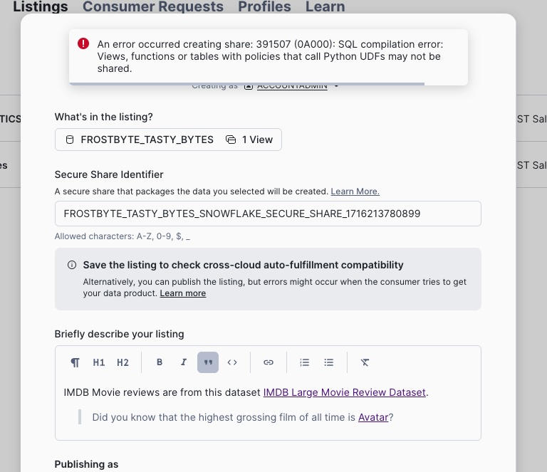

> Since the review content extraction requires a Python function, _it can only be shared in a Native App!_

Return to the `HORIZON_QUICKSTART_PACKAGE` we created in the previous section and publish an update with these unstructured data artifacts:
> 1. Modify `setup_package_script.sql`: share the `MOVIE_REVIEWS_V` view similar to how we shared `ORDERS_V` view previously.
> 2. Create a new app version V2
> 3. Set the DEFAULT RELEASE DIRECTIVE to version V2 patch 0

_Here is the [documentation](https://docs.snowflake.com/en/developer-guide/native-apps/versioning#workflow-for-upgrading-an-native-app) for App Upgrade Workflow_

That is all it takes to upgrade a native app!

On the <mark>AWS Consumer Account</mark> open a SQL Worksheet:

```sql
USE ROLE ACCOUNTADMIN;

-- install the app upgrade
ALTER APPLICATION TASTY_BYTES_GLOBAL_SALES UPGRADE;

USE APPLICATION TASTY_BYTES_GLOBAL_SALES;

SELECT * FROM app_instance_schema.movie_reviews_v limit 10;

SELECT review_file_name, 
SNOWFLAKE.CORTEX.SUMMARIZE(review_content) as Summary, 
TO_DECIMAL(SNOWFLAKE.CORTEX.SENTIMENT(review_content),3,2) as Sentiment,
scoped_url
FROM app_instance_schema.movie_reviews_v
ORDER BY Sentiment DESC
LIMIT 10; 

-- Use this query to monitor usage of AI Services
-- Note: this will only populate on a daily basis
SELECT *
  FROM snowflake.account_usage.metering_daily_history
  WHERE SERVICE_TYPE='AI_SERVICES';
```

Try the same steps on the <mark>Azure Consumer Account</mark>

> How does the refresh frequency for cross-cloud fulfillment impact the application upgrade?
> (documentation on cross-region application upgrades [here](https://docs.snowflake.com/en/developer-guide/native-apps/versioning#upgrade-an-installed-app-across-multiple-regions))

<!-- ------------------------ -->
## Conclusion & Resources
Duration: 5

Congratulations, you made it through our Horizon Access journey! You have exercised a broad range of data sharing and governance capabilities. You have worked with different types of data products including structured data, unstructured data, and native applications. And you have deployed different types of governance policies to implement data access and data privacy restrictions. 

### What you Learned
- How to blend local Point-of-Sale data with Marketplace Weather data to build analytics data products.

- How to publish data products as Listings targeted at accounts in your company 
- How to configure data access and privacy polices as a data provider to restrict data access by data consumers. 
- How to use tag-based column masking, row-access, aggregation and projection policies with database roles in a collaboration scenario.
- How to manage Listings via the Listings API.
- How to setup data quality monitoring of shared data products
- How to share Iceberg Tables within a cloud region
- How to share a native application with Streamlit visualization
- How to share unstructured text files and process with Cortex LLM functions

### Related Resources
- [Lab Source Code on Github](https://github.com/Snowflake-Labs/sfguide-horizon-intra-organization-sharing)

- [Snowflake Listings](https://other-docs.snowflake.com/en/collaboration/collaboration-listings-about) and [Managing Listings via API](https://docs.snowflake.com/en/sql-reference/commands-listings)

- [Cross-cloud Auto-Fulfillment](https://other-docs.snowflake.com/en/collaboration/provider-listings-auto-fulfillment)

- [Data Governance Policies](https://docs.snowflake.com/en/guides-overview-govern) and  [Data Privacy Policies](https://docs.snowflake.com/en/guides-overview-privacy)

- [Data Quality Metrics](https://docs.snowflake.com/en/user-guide/data-quality-intro)

- [Sharing  Data Protected by a Policy](https://docs.snowflake.com/en/user-guide/data-sharing-policy-protected-data)
- [Iceberg Tables in Snowflake](https://docs.snowflake.com/en/user-guide/tables-iceberg)
- [Best Practices publishing a Snowflake Native App](https://docs.snowflake.com/en/developer-guide/native-apps/publish-guidelines#best-practices-when-publishing-a-native-app)
- [Sharing Unstructured Data](https://docs.snowflake.com/en/user-guide/unstructured-data-sharing)