author: Chanin Nantasenamat, Liam Sosinsky, Federico Zoufaly
id: how-to-accelerate-data-warehouse-migrations-with-snowconvert-ai
summary: A comprehensive guide covering SnowConvert AI installation, configuration, and end-to-end database migration from legacy platforms to Snowflake. 
categories: featured, data-engineering, migrations, snowflake  
environments: web  
status: Published  
feedback link: https://github.com/Snowflake-Labs/sfguides/issues  
tags: SnowConvert, AI, Database Migration, Snowflake, Teradata, Oracle, SQL Server, Redshift, Data Engineering, CLI, Conversion

# How To Accelerate Data Warehouse Migrations With SnowConvert AI

## Overview


At its core, data migration is the process of moving data between locations like on-premises servers, cloud platforms, or SaaS applications. This is typically driven by key business events like modernizing legacy infrastructure, centralizing data for analytics, or preparing datasets for AI training. However, an unsuccessful migration can lead to data loss, business disruptions and compliance issues.

SnowConvert AI and Snowpark Migration Accelerator are both tools from Snowflake designed to assist in code migration, but they serve different purposes. 

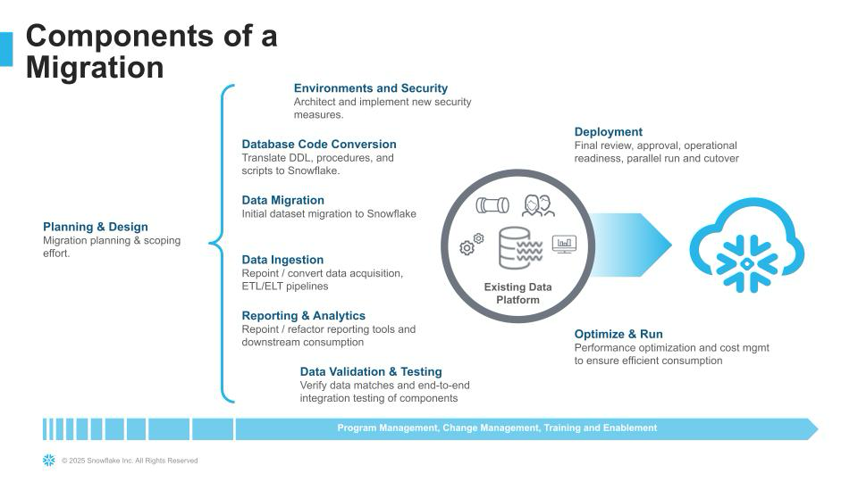

SnowConvert AI is an AI-powered solution for migrating entire data ecosystems, including code and objects, from a wide range of legacy data warehouses and BI tools (such as Teradata, Oracle, and Google BigQuery) to Snowflake. Its core function is to intelligently automate the conversion of SQL-based workloads, reducing manual effort. This guide provides a complete, end-to-end walkthrough of a SnowConvert AI migration project, from initial setup and extraction to code conversion, deployment, and final data validation.


In contrast, the [Snowpark Migration Accelerator](/en/data-cloud/snowpark/migration-accelerator/) is a specialized, free tool for migrations from Databricks or another Spark platform. Briefly, it converts existing Apache Spark codebases (in Python or Scala) to leverage the Snowpark API.

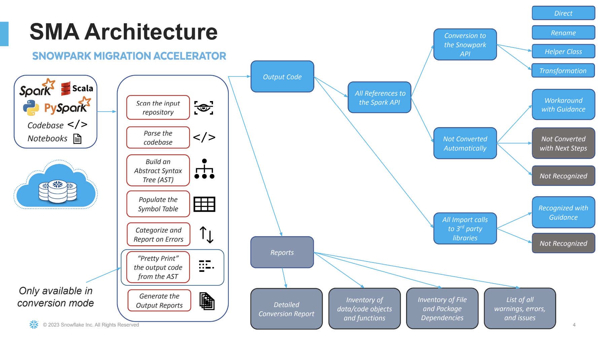

### What You'll Learn

This guide will walk you through the complete end-to-end migration process, which is broken down into four key parts:

**Part 1: Preparation and Setup**

* Setup and Installation  
* Understanding SnowConvert AI Projects

**Part 2: Code Extraction and Conversion**

* Database Object Extraction  
* Code Conversion and Assessment  
* AI Verification  
* SSIS Replatform  
* Power BI Repointing

**Part 3: Migration Execution** 

* Deployment to Snowflake  
* Data Migration  
* Data Validation

**Part 4: Post-Migration and Resources**

* Troubleshooting  
* Best Practices  
* Conclusion and Resources  
* Next Steps

### What You'll Build

By the end of this quickstart guide, you will have a complete understanding of the SnowConvert AI migration workflow and will be able to execute end-to-end database migrations from legacy platforms to Snowflake, including data extraction, code conversion, deployment, data migration, and validation.

### Prerequisites

* Valid Snowflake account with appropriate permissions  
  * Ensure your target role has the appropriate privileges. Specifically, the role needs:  
    1. The `CREATE MIGRATION` privilege at the account level. You can grant this with the following command:  
       ```SQL
       GRANT CREATE MIGRATION ON ACCOUNT TO ROLE <your_role>;
       ```
    2. The ability to create databases and objects within them. 

* Access to source database system (Teradata, Oracle, SQL Server, etc.)  
  * To prepare for the migration, verify that the role for your legacy data source has the necessary permissions. The role must have:  
    1. **Read access** to all objects you plan to migrate.  
    2. The ability to extract the **Data Definition Language (DDL)** code for these objects.  

* Company domain email address for access code generation  
* Windows 11+, macOS 13.3+, or Linux operating system  
* Minimum 4GB RAM  
* Internet connectivity for tool updates and licensing  
* Multi-factor authentication (MFA) enabled for Snowflake account

## Setup and Installation


### System Requirements

Before installing [SnowConvert AI](/en/migrate-to-the-cloud/snowconvert-ai/), ensure your system meets the minimum requirements:

**Windows:**

* Windows 11 or newer  
* Minimum 4GB RAM (8GB+ recommended)

**macOS:**

* macOS Ventura 13.3.1 or newer  
* Minimum 4GB RAM

**Linux:**

* Any modern Linux distribution  
* Minimum 4GB RAM

### Obtaining SnowConvert AI

SnowConvert AI can be downloaded from this [link.](/en/migrate-to-the-cloud/snowconvert-ai/) It's highly recommended to complete the free course "[SnowConvert AI for Conversion](https://training.snowflake.com/lmt/clmsCatalogDetails.prMain?site=sf&in_offeringId=130596852)" available at Snowflake Training, which provides both overview and hands-on technical training.

> IMPORTANT:
> - SnowConvert AI is free for all users  
> - Download Snowconvert AI from any Snowflake account via Snowsight by navigating to Ingestion/Migrations in the left-hand menu.   
> - Professional services are available for additional migration support. Learn more and contact a representative [here](/en/solutions/professional-services/). 

### Installing SnowConvert AI

**Windows Installation**

1. Download the `.exe` installer from the Snowflake portal  
2. Double-click the downloaded file to start the installation  
3. Follow the installation wizard prompts  
4. Launch SnowConvert AI from the Applications menu

**macOS Installation**

1. Download the `.dmg` file from the Snowflake portal  
2. Double-click the `.dmg` file to mount it  
3. Drag SnowConvert AI to the Applications folder  
4. Launch the application from Applications

### Understanding Access Codes

To ensure quality, access codes are required to use SnowConvert AI and are valid for 3 months. Starting with version 1.2.0, the tool automatically generates access codes and supports all source platforms with a single code. For more information on access codes, visit the [SnowConvert AI - Download and Access](https://docs.snowflake.com/en/migrations/snowconvert-docs/general/getting-started/download-and-access) page.

### Obtaining an Access Code

**Method 1: Through the Application**

1. Open SnowConvert AI  
2. Click "Get an Access Code" link on the Project Creation page 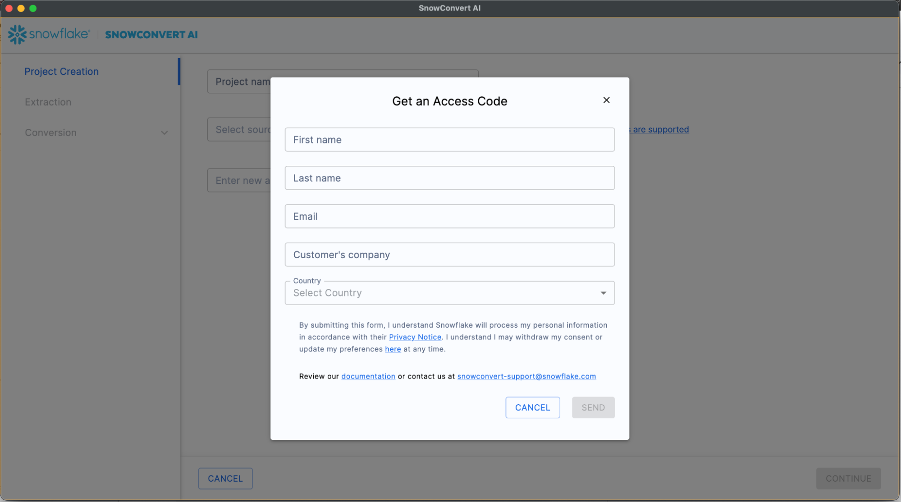  
> Note:
> If you face connectivity issues due to restrictive firewall settings, please refer to this [document](https://docs.snowflake.com/en/migrations/snowconvert-docs/general/frequently-asked-questions-faq#why-i-am-not-receiving-an-access-code) for troubleshooting guidance 
4. Fill out the required information form  
5. Submit and wait for email confirmation

**Method 2: Help Menu**

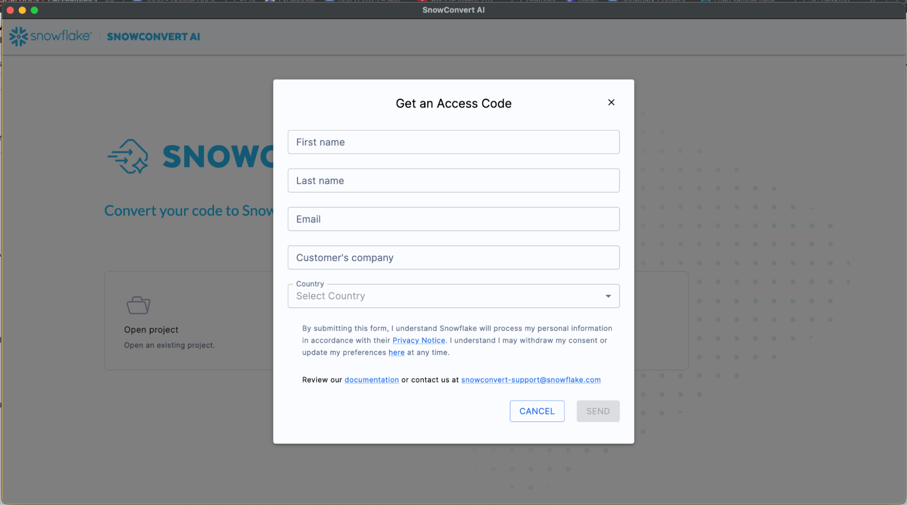

1. Launch SnowConvert AI  
2. Go to main menu bar  
3. Click "Get an access code" option  
4. Complete the form and submit

## Understanding SnowConvert AI Projects


The process begins when a user creates a new project and assigns it a name. The user then selects the source code to be migrated; in the provided example, the source is SQL Server. To utilize SnowConvert, a free access code is required, which can be requested and is sent immediately via email. A local working folder must also be set up on the user's machine for the project. In addition to code conversion, the tool offers optional features to replatform ETLs, like Informatica or SSIS, and to repoint Power BI reports to the new Snowflake database.

### What is a SnowConvert Project?

A SnowConvert AI Project (`.snowct` file) is a local file that stores:

* Source platform configuration  
* Conversion settings  
* Project status and progress  
* Assessment and conversion results

Each time you "Save & Start Assessment", SnowConvert AI creates a `.snowct` project file. The file is saved in the same folder as your input source code and it contains all project configurations and status.

Here are some of the benefits of SnowConvert AI project files:

* Resume work from where you left off  
* Maintain consistent conversion settings  
* Track progress across migration phases  
* Share project configurations with team members

### Project Setup

To initiate the migration process:

1. Launch SnowConvert AI  
2. Click "Create New Project"  
3. Select source platform (Teradata, Oracle, SQL Server, etc.)  
4. Choose input folder containing source code  
5. Select output folder for converted code  
6. Enter access code

When resuming the migration process:

* Double-click on the `.snowct` file. This will open SnowConvert AI.   
* Use "Open Project" button in the application  
* Access recent projects via File → Open Recents

## Database Object Extraction


### Extraction Overview

After the project setup, the extraction phase begins. For a source like SQL Server, SnowConvert AI can connect directly to the database catalog to extract the Data Definition Language (DDL). As an alternative, code can be accessed from a local drive or a Git repository. During the extraction, SnowConvert AI connects to the source database and pulls the definitions for objects such as tables, views, and stored procedures. Once complete, it provides a summary of all the objects that were successfully extracted, such as the number of databases, schemas, and tables.

SnowConvert AI provides direct database connectivity to extract objects from source systems, currently supporting SQL Server and Amazon Redshift.

For other sources, you will still need to extract your SQL code into .sql files. You can use database export scripts here: [https://github.com/Snowflake-Labs/SC.DDLExportScripts](https://github.com/Snowflake-Labs/SC.DDLExportScripts) 

### SQL Server Extraction

SnowConvert AI offers flexible authentication options to seamlessly integrate with your existing SQL Server environments. The platform supports two primary methods, ensuring secure and efficient access to your databases:

* **Standard SQL Server Authentication:** Uses a username and password.  
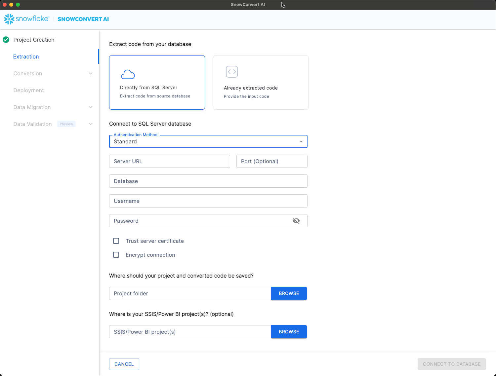  
* **Windows Authentication (Integrated Security):** Leverages the Windows user's security credentials, often preferred in enterprise environments for seamless, secure integration with existing Windows security policies.  
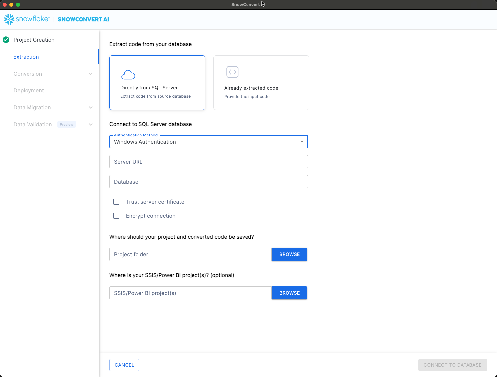

**Security Options:**

* Trust Server Certificate (required if database uses trusted certificates)  
* Encrypt Connection (required for encrypted connections)

**Extractable Objects:**

* Tables (structure and metadata)  
* Views (definitions and dependencies)  
* Functions (scalar and table-valued)  
* Stored procedures (complete logic)

### Amazon Redshift Extraction

**Authentication Methods:**

* IAM Provisioned Cluster  
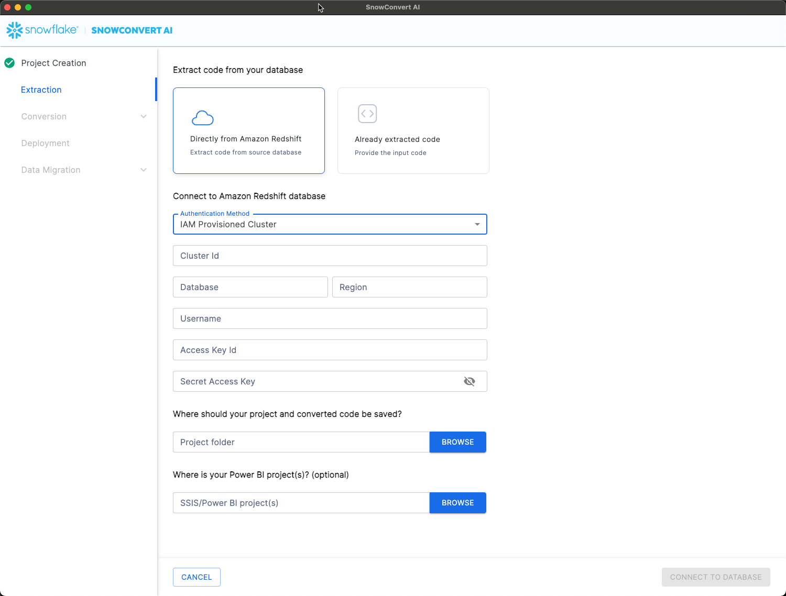  
* IAM Serverless  
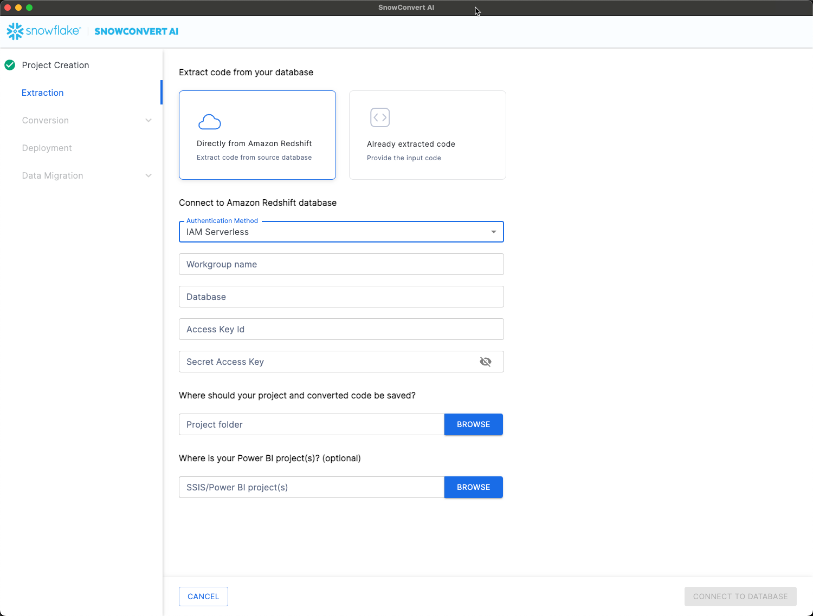  
* Standard authentication  
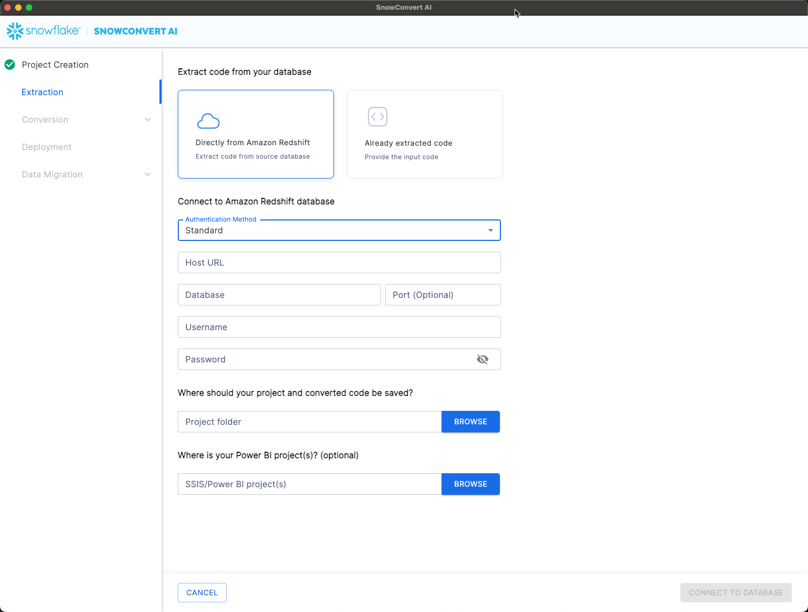

**Extractable Objects:**

* Tables  
* Views  
* Materialized views  
* Stored procedures

### Extraction Process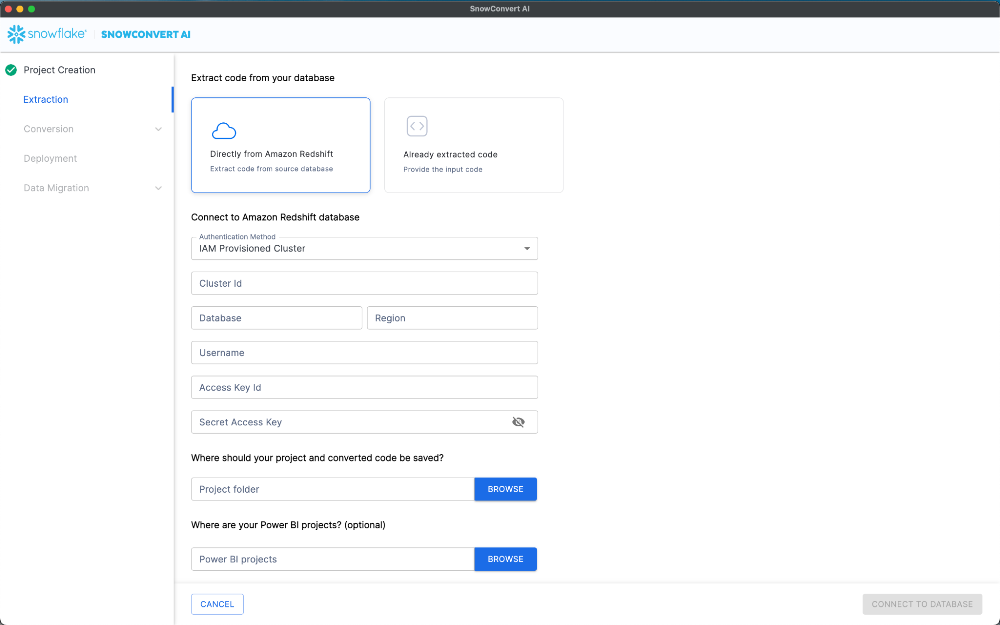

1. **Configure Connection:**  
* Select authentication method  
* Provide connection credentials  
* Configure security settings if required  
    
2. **Connect to Database:**  
* Click "Connect to Database"  
* Wait for "Connection established" notification  
* Browse available databases and schemas  
    
3. **Select Objects:**  
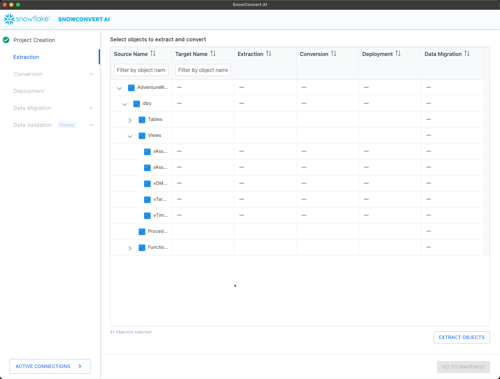  
* Expand database and schema trees  
* Select specific objects for extraction  
* Review object dependencies  
    
4. **Execute Extraction:**  
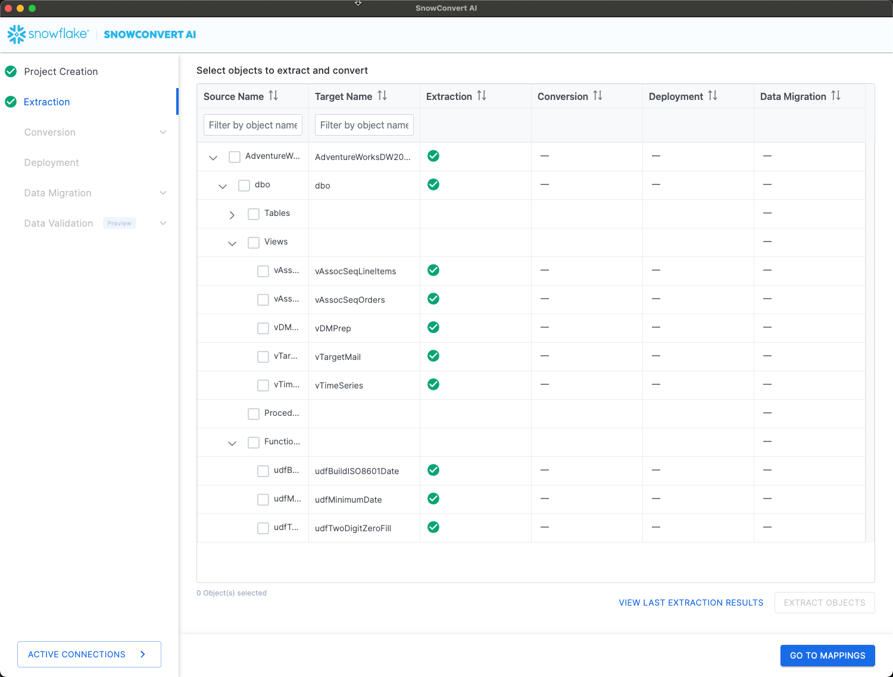  
* Click "Extract Objects"  
* Monitor extraction progress  
* Review extraction results  
    
5. **Validate Results:**  
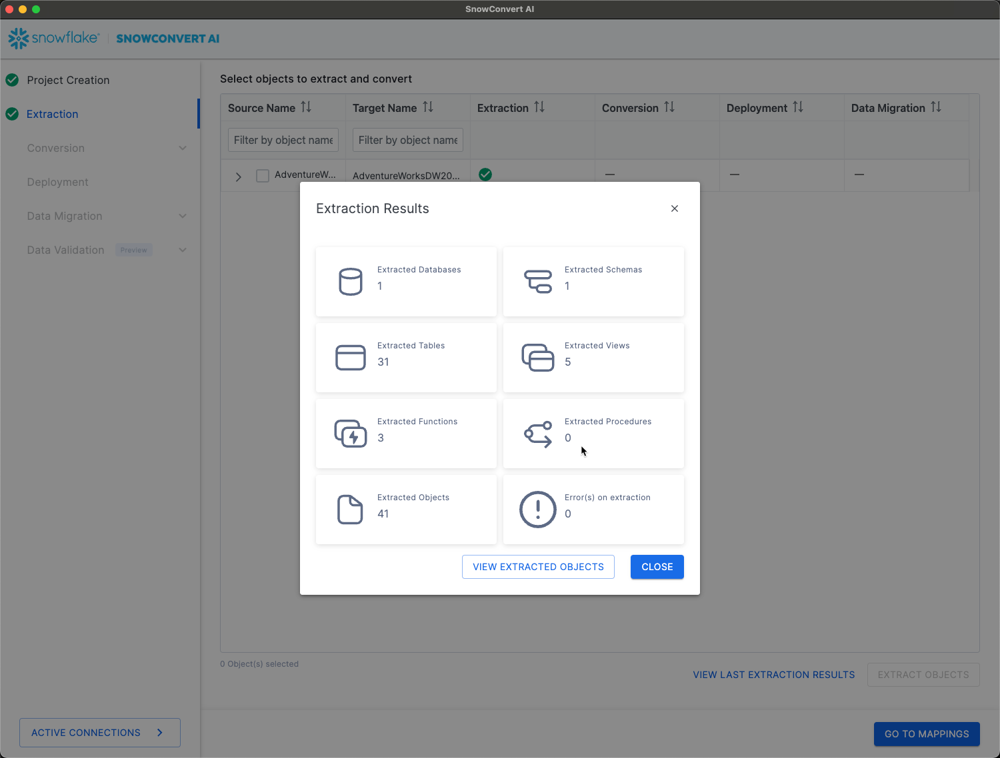  
* Click "View Last Extraction Results"  
* Confirm all required objects extracted successfully  
* Note any extraction failures or warnings

```sql
-- Example extracted object structure
-- Original SQL Server procedure
CREATE PROCEDURE GetCustomerOrders
    @CustomerID INT
AS
BEGIN
    SELECT OrderID, OrderDate, TotalAmount
    FROM Orders
    WHERE CustomerID = @CustomerID
END

-- Will be prepared for conversion to Snowflake format
```

## Code Conversion and Assessment


### Conversion Process Overview

SnowConvert AI performs both assessment and conversion in a single unified process, generating comprehensive reports and converted code simultaneously.

**Step 1: Conversion Settings**

* **Encoding:** Select appropriate character encoding (UTF-8 default)  
* **Custom Schema:** Specify target schema name if different from source  
* **Database Name:** Set custom database name for converted objects  
* **Target Language:** Choose SnowScript or JavaScript for procedures  
* **Comments:** Enable commenting of nodes with missing dependencies

**Step 2: Execute Conversion**

1. Click "Save & Start Assessment"  
2. Monitor conversion progress  
3. Review completion status  
4. Examine generated reports  
   

### Understanding Conversion Results

**Code Completeness Metric:**  
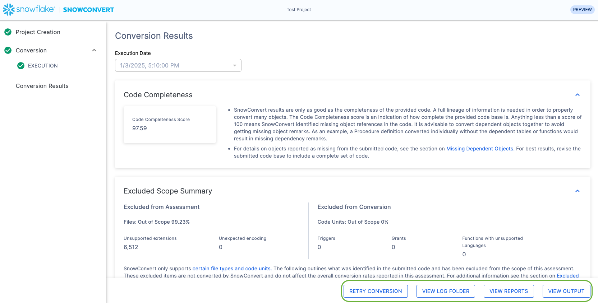

* Score below 100% indicates missing object references  
* Review dependencies before deployment  
* Address missing references in source code

**Conversion Status Indicators:**

* **Green:** Successfully converted, ready for deployment  
* **Yellow:** Functional Data Model (FDM) warnings present  
* **Red:** Equivalent Work Item (EWI) errors require attention

**Assessment Reports:**

* Conversion summary statistics  
* Object-by-object conversion status  
* Complexity analysis and recommendations  
* Migration effort estimates

```sql
-- Example conversion result
-- Original Teradata SQL
SELECT 
    customer_id,
    SUM(order_amount) as total_orders
FROM orders
WHERE order_date >= ADD_MONTHS(CURRENT_DATE, -12)
GROUP BY customer_id;

-- Converted Snowflake SQL
SELECT 
    customer_id,
    SUM(order_amount) as total_orders
FROM orders
WHERE order_date >= DATEADD(MONTH, -12, CURRENT_DATE)
GROUP BY customer_id;
```

## AI Verification


### Overview

The AI Verification step (currently in Public Preview) adds a layer of intelligence to migrations by using AI agents to automatically verify and resolve errors that occur after the deterministic conversion step (the Code Conversion step is executed by a transpiler). The AI fixes are grounded with tests over synthetically generated data. This improves accuracy, reduces manual effort, and makes migrations faster, more reliable, and more scalable. AI will attempt to execute the converted code and fix issues if it is not working.

### Step-by-Step flow

After the code conversion step customers can opt to use AI Verification to improve the quality of the converted code. If a customer is not allowed to use AI, this step can be skipped and continue to the Deployment of the converted objects ( as you can see in the image below, SKIP AI VERIFICATION button shows in the lower left corner of the screen). To continue with AI Verification we need to select which objects we want to verify.  Sometimes certain objects will be auto selected by SnowConvert AI because they are dependencies of the selected objects. So don't be scared if you select one procedure but the tool auto selects a few tables, views and even other procedures. This means all those objects are required to be able to execute the selected stored procedure.  

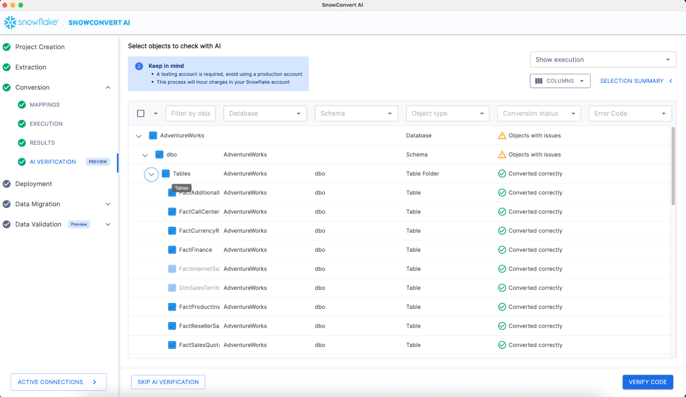

Once objects are selected, the VERIFY CODE can be clicked, which will display a special screen with a set of disclaimers. It is important to read and understand these disclaimers before proceeding. The AI will be executed in the customer Snowflake account using a Cortex Complete function. The tool will use the same Snowflake connection that was used for Source Code Extraction and that will be used for Deployment and Data Migration.

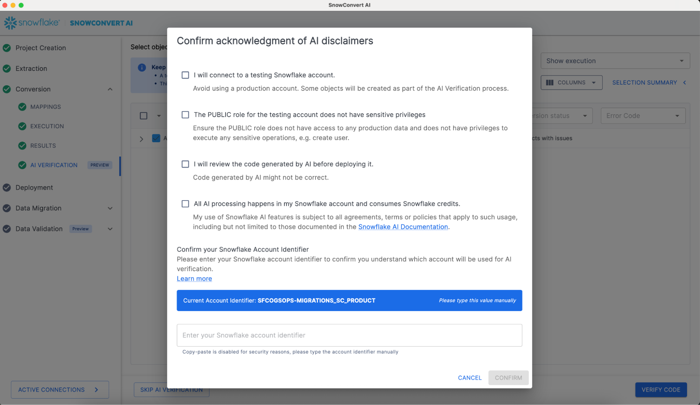

Once the user accepts all of the disclaimers, they can proceed with the actual verification. This step may take a long time as AI needs to upload files to a Snowflake stage to complete the verification process. At the end of the process, you will get a result screen similar to the image below.  
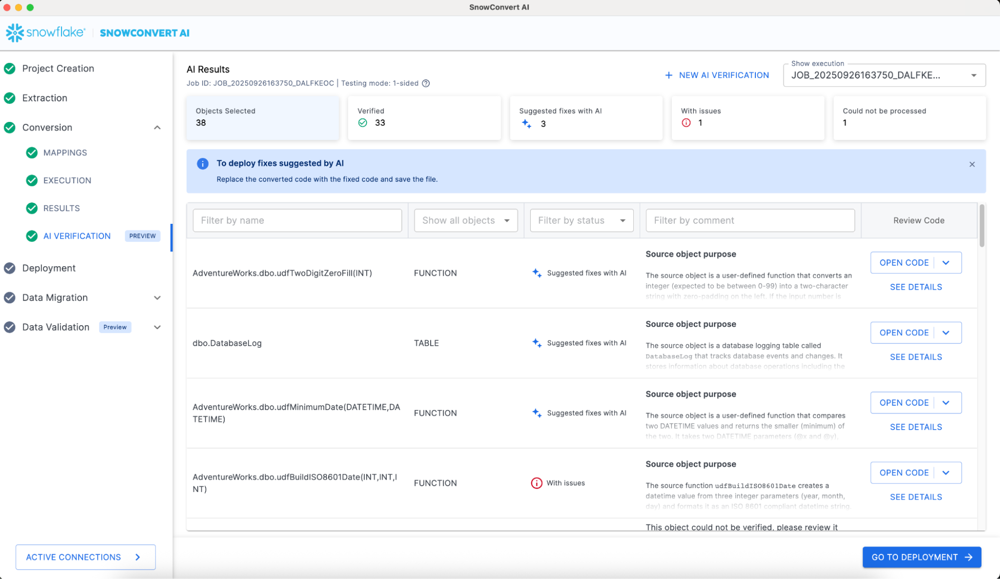

At the top of your screen, you'll find a summary of the AI Results, followed by detailed information for each validated object. To gain a deeper understanding of how the AI reviewed a specific object, click "SEE DETAILS" for that object. This will display an explanation similar to the example shown in the following image.

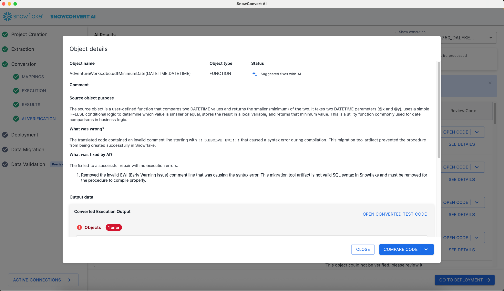

It is important to understand that the migration engineer needs to review the AI results and merge them with the initial code conversion results.

## SSIS Replatform


### Overview

SSIS Replatform is a specialized SnowConvert AI capability designed to convert SQL Server Integration Services (SSIS) `.dtsx` packages to Snowflake-native solutions. This feature transforms complex ETL workflows into modern data pipelines using Snowflake tasks, procedures, and dbt projects.

For optimal conversion results, ensure that your input includes valid `.dtsx` files and all dependent database objects (DDL scripts for tables, views, functions, and procedures referenced by the SSIS packages).

The replatform process separates SSIS packages into two components:

1. **Control Flow Orchestration:** Converted to SQL scripts with Snowflake tasks and stored procedures.  
2. **Data Flow Tasks:** Transformed into individual dbt projects for each data flow component.

### Project Setup for SSIS Replatform

1. Launch SnowConvert AI  
2. Click "Create New Project"  
3. **Important:** Select "SQL Server" as the source platform  
4. In the extraction configuration section, select "Replatform" option  
5. Enter the path to your SSIS `.dtsx` files

### DTSX Conversion Process

1. Proceed with the conversion process.  
2. SnowConvert AI analyzes all `.dtsx` files and dependencies  
3. Conversion proceeds following the standard SnowConvert AI workflow  
4. Control flow tasks converted to Snowflake stored procedures and tasks  
5. Data flow tasks converted to individual dbt projects

The converted ETL code will be available in the SnowConvert AI output folder under the `ETL` directory. An `etl_configuration` folder will also be created containing utilities and configuration files. Additionally, `ETL.Elements.NA.csv` and `ETL.Issues.NA.csv` files provide detailed information about the ETL conversion process and any issues encountered.

### Output Structure

```
output/
└── ETL/
    └── [same folder structure as input]/
        └── [Package_Name]/
            ├── Orchestration.sql
            ├── Data Flow Task 1/
            │   ├── dbt_project.yml
            │   ├── models/
            │   └── sources/
            └── [Additional Data Flow Tasks]/
```

### Understanding Conversion Results

Review the generated CSV files for detailed conversion information:

* **ETL.Elements.NA.csv:** Details about converted ETL elements  
* **ETL.Issues.NA.csv:** Issues encountered during conversion

### Deployment Process

1. Deploy Snowflake tasks and stored procedures  
2. Deploy the dbt projects in your environment  
3. Manually fix the failing components and validate model compilation and execution

## Power BI Repointing


### Overview

Power BI repointing is a SnowConvert AI feature that allows users to redefine connections from different database sources to a Snowflake valid connector. Currently, the supported sources are:

1. [SQL Server](https://docs.snowflake.com/en/migrations/snowconvert-docs/translation-references/transact/etl-bi-repointing/power-bi-transact-repointing)  
2. [Oracle](https://docs.snowflake.com/en/migrations/snowconvert-docs/translation-references/oracle/etl-bi-repointing/power-bi-oracle-repointing)  
3. [Teradata](https://docs.snowflake.com/en/migrations/snowconvert-docs/translation-references/teradata/etl-bi-repointing/power-bi-teradata-repointing)  
4. [Redshift](https://docs.snowflake.com/en/migrations/snowconvert-docs/translation-references/redshift/etl-bi-repointing/power-bi-redshift-repointing)  
5. [Azure Synapse](https://docs.snowflake.com/en/migrations/snowconvert-docs/translation-references/transact/etl-bi-repointing/power-bi-transact-repointing)  
6. [PostgreSQL](https://docs.snowflake.com/en/migrations/snowconvert-docs/translation-references/postgres/etl-bi-repointing/power-bi-postgres-repointing)

It is recommended that DDLs should be migrated with the Power BI repointing migration process, which would allow SnowConvert AI to identify objects such as tables and views.

### Power BI Repointing Set Up

1. Save your Power BI projects with .pbit extension.  
2. Open SnowConvert AI.  
3. Optionally, add your DDLs.  
4. Select the source language that you are using in your Power BI reports, i.e. SQL Server.  
5. Add your .pbit files on the Power BI repointing section.  
6. Click on the “continue to conversion” button.

### Power BI Repointing Results

1. Open your repointed Power BI report.  
2. Fill the Power BI parameters with your Snowflake account information: server link, warehouse name, and database name. (This is automatically added by SnowConvert AI).  
3. Refresh your data in your reports.   
4. Double-check results.  
5. Save your repointed report with the format you need. i.e. .pbix. 

### Assessment

To review the overall status of the repointed reports, you can review the “ETLAndBiRepointing” assessment report. This report contains the report name and a summary of the changed connectors.

## Deployment to Snowflake


### Deployment Overview

SnowConvert AI facilitates the direct deployment of converted code objects and schemas to your Snowflake environment. This process includes comprehensive dependency management and precise execution ordering, ensuring a smooth and accurate transition.

### Authentication Methods

**SSO Authentication:**

* Integrates with the organization's Single Sign-On (SSO) provider for a seamless authentication experience.  
* Supports enterprise identity management systems.

**Standard Authentication:**

* Username and password authentication  
* Requires multi-factor authentication (MFA) enabled  
* Account identifier format: `orgname-account-name`

### Pre-Deployment Validation

**Step 1: Review Conversion Status**

* Examine status indicators for each object (e.g., successful, needs review).  
* Review Converted Code: Examine the generated Snowflake SQL for key objects (e.g., procedures, functions) to confirm the logic is correctly translated before deployment.  
* Resolve any EWI (Error with Impact) errors before deployment.  
* Review FDM (Further Development Mandatory) warnings and decide if deployment is acceptable.  
* Use "Refresh Tree" to update status after code changes  

> MANDATORY:
> Resolve any EWI (Error with Impact) errors before deployment. These errors represent logic that could not be reliably converted and will cause deployment failure or runtime errors if not corrected.
> 
> **Handling EWI Errors:**   
> SnowConvert AI is designed to flag these high-impact errors, but cannot always fix them. To resolve an EWI, you must:  
> 1. **Examine the code snippet** in the SnowConvert AI interface that triggered the EWI or better yet in your preferred Source Code IDE. [Learn more](/en/developers/guides/end2endmigration/)  
> 2. **Manually modify the converted source code** to fix the issue..  
> 3. **Unit test** on the corrected file.  
>
> **Object Selection:**  
> * Select only successfully converted objects  
> * Consider deployment dependencies  
> * Group related objects for batch deployment

**Step 2: Initiate Deployment**

1. Select objects for deployment  
2. Click "Deploy" button  
3. Choose authentication method  
4. Provide Snowflake credentials

**Step 3: Authentication**

```sql
-- Example Snowflake connection details
Account: myorg-myaccount
Username: migration_user
Warehouse: MIGRATION_WH
Database: TARGET_DB
Schema: PUBLIC
Role: MIGRATION_ROLE
```

**Step 4: Execution Order** Deployment follows this automatic sequence:

1. Databases (create container structure)  
2. Schemas (organize object namespaces)  
3. Tables (establish data structures)  
4. Views (depend on table structures)  
5. Functions (provide reusable logic)  
6. Stored Procedures (may reference other objects)

**Step 5: Monitor Progress**

* Track deployment status for each object  
* Review execution logs and results  
* Address any deployment errors immediately

### Deployment Results

**Success Indicators:**

* Object created successfully in Snowflake  
* Proper dependency resolution  
* Correct object permissions applied

**Error Handling:**

* Review detailed error messages  
* Fix source code issues if needed  
* Re-run conversion if necessary  
* Retry deployment for failed objects

```sql
-- Example deployed object in Snowflake
CREATE OR REPLACE PROCEDURE get_customer_orders(customer_id INTEGER)
RETURNS STRING
LANGUAGE SNOWSCRIPT
AS
$$
BEGIN
    LET result_cursor CURSOR FOR 
        SELECT order_id, order_date, total_amount
        FROM orders
        WHERE customer_id = :customer_id;
    
    RETURN 'Procedure executed successfully';
END;
$$;
```

## Data Migration


### Data Migration Overview

SnowConvert AI provides automated data migration capabilities to transfer actual data from Teradata, Oracle, SQL Server, Amazon Redshift, Synapse, Sybase, BigQuery, Netezza, Postgres, Greenplum and Databricks SQL source tables to deployed Snowflake structures, with platform-specific optimization strategies.

For migrations from Databricks or another Spark platform, you’ll use [Snowpark Migration Accelerator](/en/data-cloud/snowpark/migration-accelerator/).

### Amazon Redshift Data Migration

**Migration Strategy:** Redshift data is migrated using S3 as an intermediary storage layer:

1. Data unloaded from Redshift to PARQUET files in S3  
2. Files copied directly from S3 to Snowflake tables  
3. Temporary files cleaned up automatically

**Prerequisites:**

1. **S3 Bucket Configuration:**  
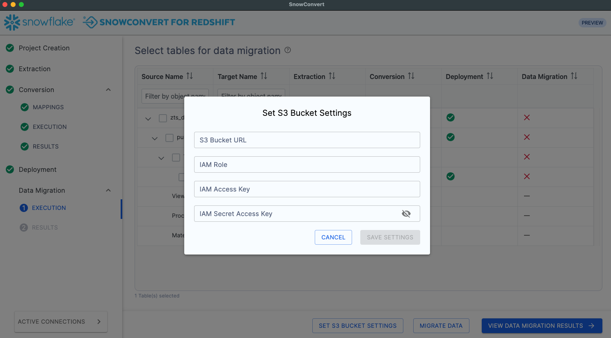
     
* Bucket in same region as Redshift cluster  
* Empty bucket path (no existing files)  
* Proper IAM permissions configured  
    
2. **IAM Role for Redshift:**

This JSON snippet defines an AWS Identity and Access Management (IAM) role specifically for Amazon Redshift, which is crucial for data migration, particularly when Redshift data is migrated using S3 as an intermediary storage layer.

```json
{
  "Version": "2012-10-17",
  "Statement": [
    {
      "Effect": "Allow",
      "Action": [
        "s3:PutObject",
        "s3:GetObject",
        "s3:GetBucketLocation",
        "s3:ListBucket"
      ],
      "Resource": [
        "arn:aws:s3:::your-bucket-name/*",
        "arn:aws:s3:::your-bucket-name"
      ]
    }
  ]
}
```

3. **IAM User for S3 Access:**

This JSON snippet defines an AWS Identity and Access Management (IAM) user policy for S3 Access. This policy outlines the permissions granted to an IAM user to interact with a specific Amazon S3 bucket.

```json
{
  "Version": "2012-10-17",
  "Statement": [
    {
      "Effect": "Allow",
      "Action": [
        "s3:PutObject",
        "s3:GetObject",
        "s3:GetObjectVersion",
        "s3:DeleteObject",
        "s3:DeleteObjectVersion",
        "s3:ListBucket",
        "s3:GetBucketLocation"
      ],
      "Resource": [
        "arn:aws:s3:::your-bucket-name/*",
        "arn:aws:s3:::your-bucket-name"
      ]
    }
  ]
}
```

**Migration Process:**

The migration process outlines the essential steps for efficiently transferring data from Redshift to Snowflake, ensuring data integrity and performance.

1. **Configure S3 Settings:**  
     
   - S3 Bucket URL (must end with "/")  
   - IAM Role ARN for data unloading  
   - Access Key ID and Secret Access Key

   

2. **Select Tables:**  
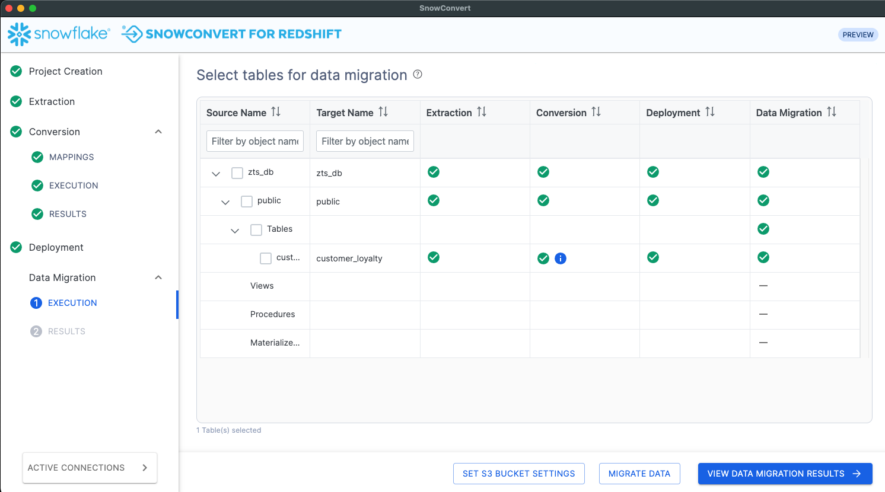  
* Choose tables for data migration  
* Review table sizes and complexity  
* Consider migration batch sizing  
    
3. **Execute Migration:**

* Monitor unload progress from Redshift  
* Track S3 file creation and validation  
* Observe copy operations to Snowflake  
    
4. **Validate Results:**  
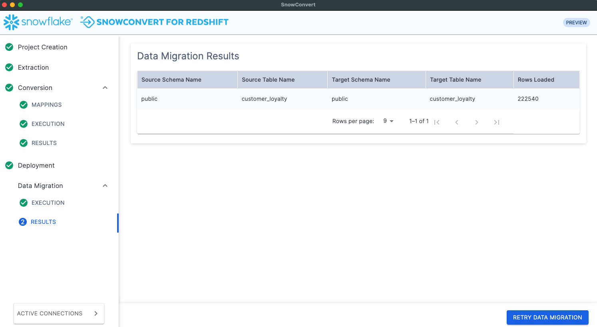  
* Compare row counts between source and target  
* Verify data integrity and completeness  
* Review migration timing and performance

### SQL Server Data Migration

**Migration Strategy:** Direct data transfer using optimized connection protocols:

* Bulk data extraction from SQL Server  
* Streaming transfer to Snowflake tables  
* Real-time progress monitoring

**Prerequisites:**

* Valid SQL Server connection with read permissions  
* Network connectivity to both systems  
* Sufficient bandwidth for data transfer

**Migration Process:**

1. **Verify Connections:**  
* Test source SQL Server connectivity  
* Confirm Snowflake authentication  
* Validate table structures match  
    
2. **Select Tables:**  
* Choose tables for migration  
* Review dependencies and foreign keys  
* Plan migration order if needed

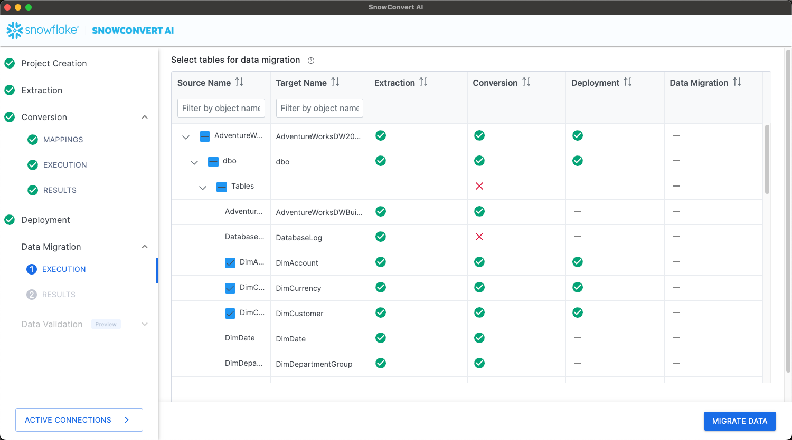

3. **Execute Transfer:**  
* Start data migration process  
* Monitor transfer progress and speed  
* Handle any connection or timeout issues  
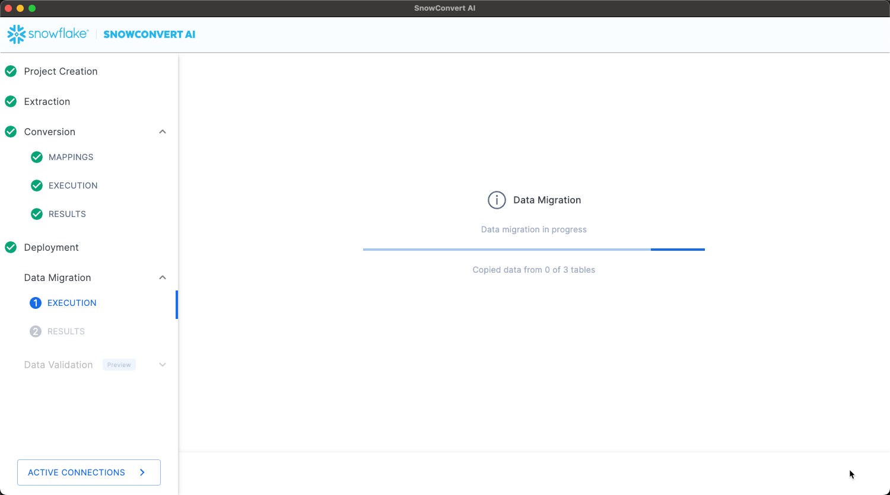


4. **Validate Migration:**  
* Compare row counts automatically  
* Review data type conversions  
* Verify constraint compliance  
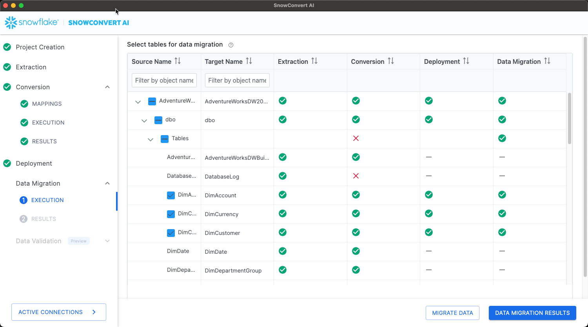

## Data Validation


### Validation Overview

SnowConvert AI provides comprehensive data validation to ensure migration accuracy through schema validation and metrics validation, giving you confidence in your migrated data.

### Validation Prerequisites

**Python Requirements:**

- Python version ≥ 3.9 and < 3.13  
- Python available in system PATH  
- Virtual environment support

```shell
# Verify Python installation
python --version

# Expected output format: Python 3.x.x
```

### Validation Modes

**Schema Validations:** Verifies structural integrity of migrated tables:

- Table names match exactly  
- Column names preserved correctly  
- Ordinal positions maintained  
- Data types converted appropriately  
- Character lengths preserved  
- Numeric precision and scale maintained  
- Row counts match between source and target

**Metrics Validations:** Compares aggregate data metrics between source and target:

- Minimum and maximum values  
- Average calculations  
- Null value counts  
- Distinct value counts  
- Standard deviation  
- Variance calculations  
- Custom business metrics

### Validation Process

**Prerequisites:** Data validation requires Python ≥ 3.10 or < 3.13 to be installed and available in your PATH. To verify that Python is available in your PATH, run  `python --version` in your terminal (or Command Prompt on Windows). Download Python [here](https://www.python.org/downloads/). 

**Step 1: Environment Setup**

1. Data migration completion required  
2. Python environment validation  
3. Virtual environment creation  
4. Dependency installation

**Step 2: Validation Execution**  
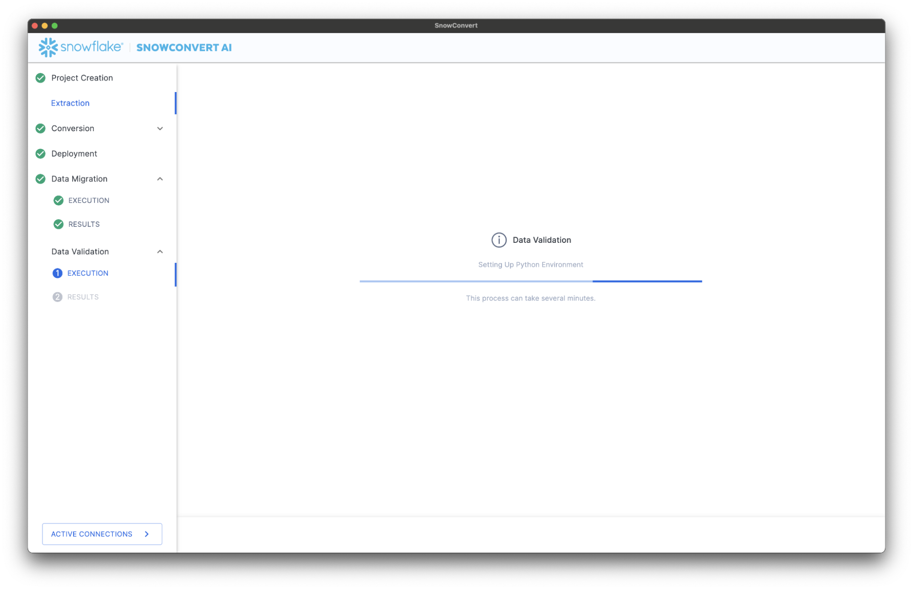

1. Click "Validate Data" in the migration interface  
2. System checks Python availability  
3. Sets up isolated validation environment  
4. Executes both schema and metrics validations

**Step 3: Results Analysis** Validation results are categorized into three levels:

| Category | Description | Action Required |
| :---- | :---- | :---- |
| **Pass** | Values match exactly | No action needed |
| **Warning** | Minor differences (e.g., higher precision) | Reconcile data by: Applying transformation  Changing the ingestion process |
| **Fail** | Values don't match | Investigation required |

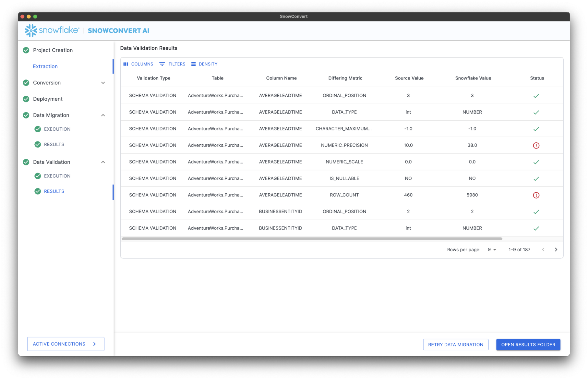

### Validation Reports

**Summary Table:**

* High-level validation status per table  
* Quick identification of issues  
* Overall migration success metrics

**Detailed CSV Reports:**

* Column-by-column validation results  
* Specific discrepancy details  
* Sharable with stakeholders  
* Suitable for audit trails

**Report Structure:**

```
table_name,column_name,validation_type,source_value,target_value,status,notes
customers,customer_id,row_count,10000,10000,PASS,Counts match
orders,order_total,avg,156.78,156.78,PASS,Averages match
products,price,max,999.99,999.99,PASS,Maximum values match
```

## Troubleshooting


### Common Installation Issues

**Permission Problems:**

- **macOS .config issues:** Ensure .config is a directory, not a file  
- **Windows AppData access:** Verify Snowflake Inc folder permissions  
- **Linux installation:** May require sudo for system-wide installation

**Network Connectivity:**

- **Firewall blocking updates:** Whitelist `sctoolsartifacts.blob.core.windows.net`  
- **Access code generation:** Ensure access to `https://snowconvert.snowflake.com/licensing`  
- **License validation:** Check connectivity to licensing APIs

**Version Management:**

- SnowConvert AI updates automatically when you launch it with an internet connection, but you can manually check for updates through the application's menu. If an update is available, the system will prompt you to download and install it. To verify the update is complete, you can check again in the menu to see the new version.   
- If facing any issues during the update, please uninstall previous versions and relaunch.

### Performance Optimization

**Large Dataset Migration:**

- Plan migrations during off-peak hours  
- Use incremental migration strategies for very large tables  
- Monitor system resources during migration  
- Consider table partitioning for optimal performance

**Resource Management:**

- Ensure adequate memory (8GB+ recommended for large projects)  
- Monitor disk space for temporary files  
- Use SSD storage for better I/O performance  
- Close unnecessary applications during migration

### Security Considerations

**Access Control:**

- Use principle of least privilege for database connections  
- Enable MFA on all Snowflake accounts  
- Regularly rotate access codes and credentials  
- Audit migration activities and access logs

**Data Protection:**

- Encrypt sensitive data during transit  
- Use secure connection protocols (SSL/TLS)  
- Implement proper backup strategies  
- Maintain audit trails for compliance

```sql
-- Example security configuration
-- Grant minimal required permissions
GRANT USAGE ON WAREHOUSE migration_wh TO ROLE migration_role;
GRANT CREATE TABLE ON SCHEMA target_db.public TO ROLE migration_role;
GRANT INSERT, SELECT ON ALL TABLES IN SCHEMA target_db.public TO ROLE migration_role;
```

### Monitoring and Alerting

**Migration Monitoring:**

- Track conversion success rates by object type  
- Monitor data migration progress and timing  
- Set up alerts for migration failures  
- Document migration performance baselines

**Post-Migration Monitoring:**

- Validate application connectivity to new environment  
- Monitor query performance in Snowflake  
- Track user adoption and satisfaction  
- Plan for ongoing maintenance and optimization

> IMPORTANT:
> - Always test conversions in development environments first  
> - Maintain detailed migration documentation for future reference  
> - Plan rollback strategies for critical production migrations  
> - Engage Snowflake Professional Services for complex migrations

## Best Practices


Adhering to best practices is crucial for a successful and efficient migration to Snowflake. This section outlines key considerations across SSIS replatforming, general migration strategies, data validation, and code conversion, providing guidance to optimize performance, ensure data integrity, and streamline the overall process.

### SSIS Replatform

* Document SSIS package dependencies and custom components.  
* Review `ETL.Elements.NA.csv` and `ETL.Issues.NA.csv` for conversion details.

### Migration

**Performance Optimization:**

- Migrate large tables during off-peak hours  
- Use parallel migration for multiple small tables  
- Monitor network bandwidth utilization  
- Consider table partitioning for very large datasets

**Error Handling:**

- Implement retry logic for transient failures  
- Log detailed error information for troubleshooting  
- Maintain rollback capabilities where possible  
- Validate partial migrations before continuing

**Data Integrity Checks:**

```sql
-- Example validation query
-- Compare row counts between source and target
SELECT 
    'Source Count' as source,
    COUNT(*) as row_count 
FROM source_database.schema.table_name
UNION ALL
SELECT 
    'Target Count' as source,
    COUNT(*) as row_count 
FROM target_database.schema.table_name;
```
> NOTE:
> Should you require additional help resolving errors and ensuring data integrity, please email [snowconvert-info@snowflake.com](mailto:snowconvert-info@snowflake.com)

### Validation

**Pre-Validation Checklist:**

* Ensure data stability during validation (no updates)  
* Complete all migration steps before validation  
* Have sufficient system resources available  
* Plan validation during maintenance windows

**Interpreting Results:**

* Focus on FAIL status items first  
* Investigate WARNING items for business impact  
* Document any acceptable discrepancies  
* Rerun validation after fixes

**Common Issues and Solutions:**

| Issue | Cause | Solution |
| :---- | :---- | :---- |
| Row count mismatch | Incomplete migration | Re-run data migration |
| Precision differences | Data type conversion | Verify acceptable business impact |
| Date format variations | Timezone or format changes | Standardize date handling |
| Null handling differences | Platform-specific null behavior | Update conversion rules |

```py
# Example validation check (conceptual)
def validate_table_metrics(source_table, target_table):
    validations = {
        'row_count': compare_row_counts(source_table, target_table),
        'column_stats': compare_column_statistics(source_table, target_table),
        'data_types': validate_schema_compatibility(source_table, target_table)
    }
    return validations
```

### Conversion

**Code Preparation:**

- Clean up source code before conversion  
- Remove commented-out legacy code  
- Ensure consistent encoding across all files  
- Document complex business logic

**Project Organization:**

- Use meaningful project names and descriptions  
- Organize source code in logical folder structures  
- Maintain backup copies of original source code  
- Document custom conversion settings

**Quality Assurance:**

- Review conversion reports thoroughly  
- Test converted code in development environment  
- Address EWI errors before deployment  
- Validate complex business logic manually

## Conclusion And Resources


This guide has walked you through the complete lifecycle of data warehouse migration using SnowConvert AI, from initial setup and configuration to advanced topics like SSIS replatforming and AI verification. You are now equipped to confidently accelerate your migration projects, ensuring accuracy and efficiency as you transition to Snowflake's powerful platform.

### What You Learned

* **Installation and Setup:** Successfully installed SnowConvert AI across different operating systems  
* **Access Management:** Obtained and managed access codes for tool activation and learned troubleshooting techniques for licensing issues  
* **End-to-End Migration:** Executed complete database migrations including extraction, conversion, deployment, data migration, and validation  
* **Best Practices:** Applied security, performance, and quality assurance practices for successful enterprise-grade migrations  
* **Troubleshooting:** Identified and resolved common issues related to installation, conversion, and deployment processes

### Related Resources

**Articles:**

* [SnowConvert AI for Conversion Training Course](https://training.snowflake.com/lmt/!clmsLink.dt?site=sf&region=us&lang=en-us&type=O&id=130596852) - Comprehensive hands-on training  
* [What is Data Migration? Types, Strategy & Best Practices](/en/fundamentals/what-is-data-migration/) - Learn what data migration is, including types, strategies, best practices and data migration solutions for smooth data transfer and management.  
* [Best Practices for Migrating Historical Data to Snowflake](/en/blog/best-practices-for-migrating-historical-data-to-snowflake/) - Best practices for extracting, transferring, uploading, and validating data when migrating to Snowflake.  
* [9 Best Practices for Transitioning From On-Premises to Cloud with Snowflake](/en/blog/best-practices-transitioning-on-premises-to-cloud/) - This article provides nine best practices for a smooth and efficient transition from on-premises data systems to Snowflake's cloud data platform.

**Documentation:**

- [SnowConvert AI Documentation](https://docs.snowflake.com/en/migrations/snowconvert-docs/overview): Complete technical reference  
- [SnowConvert AI Release Notes](https://docs.snowflake.com/en/migrations/snowconvert-docs/general/release-notes/release-notes/README): Recent release notes

### Next Steps


Now that you have successfully migrated your data warehouse to Snowflake using SnowConvert AI, consider these next steps to fully leverage the power of the Snowflake Data Cloud:

* **Explore Advanced Snowflake Features:** Dive deeper into Snowflake's capabilities, such as advanced analytics with [Snowpark](/en/product/features/snowpark/), data sharing with other organizations, and building data applications directly on Snowflake.  
* **Integrate with BI Tools:** Connect your newly migrated Snowflake data to your existing or new [Business Intelligence (BI) tools](https://docs.snowflake.com/en/user-guide/ecosystem-bi) (e.g., Power BI, Tableau, Looker) to create insightful dashboards and reports.  
* **Optimize Performance and Cost:** Continuously monitor your Snowflake usage to [optimize performance and costs](https://docs.snowflake.com/en/guides-overview-performance).  
* **Implement Data Governance and Security:** Establish robust [data governance](https://docs.snowflake.com/en/guides-overview-govern) policies and enhance security measures within Snowflake using features like row-access policies, column-level security, and data masking.  
* **Automate Data Pipelines:** Transition to automated data ingestion and transformation pipelines using Snowflake features like [Openflow](/en/product/features/openflow/) and [Snowpipe](https://docs.snowflake.com/en/user-guide/data-load-snowpipe-intro).  
* **Leverage AI/ML Capabilities:** Integrate Snowflake with other cloud services and tools for [machine learning](https://docs.snowflake.com/en/developer-guide/snowflake-ml/overview) and data science.   
* **Application development:** [Native Apps](/en/product/features/native-apps/) and [Streamlit](https://docs.snowflake.com/en/developer-guide/streamlit/about-streamlit) Apps for building interactive data apps.   
* **Stay Updated with Snowflake Innovations:** Regularly check Snowflake's release notes, documentation, and community forums to stay informed about new features and best practices.
