author: Dan Lee, Alix Thoi
id: how-to-resolve-data-with-fullcontact-and-snowflake
categories: snowflake-site:taxonomy/solution-center/certification/quickstart, snowflake-site:taxonomy/solution-center/certification/partner-solution, snowflake-site:taxonomy/solution-center/includes/architecture, snowflake-site:taxonomy/product/applications-and-collaboration
language: en
summary: This is a sample Snowflake Guide 
environments: web
status: Published
feedback link: <https://github.com/Snowflake-Labs/sfguides/issues>


# How To Resolve Data with FullContact and Snowflake
<!---------------------------->

## Overview
As Snowflake is used more and more frequently as the central data warehouse users often find themselves with duplicate copies of customer information in different tables. 
This guide shows how to use the FullContact for Snowflake Native Application to unify different pieces of customer data using the FullContact PersonID to have a single, accurate view of how the customer is engaging with your brand.

With your install we will provide you some synthetic data that will join to our Identity Graph to allow you to test out the application.  By the end of the walkthrough, we're going to show you how several profiles of a fictional customer named Willow Underwood, will now be able to be merged into a single record of that customer.
To see a more in depth example with other sample datasets, make sure to check out the YouTube product walkthrough that is a companion to this guide.

### What You'll Learn 
- How to install the FullContact for Snowflake Native Application 
- How to configure and set up the FullContact for Snowflake Native Application 
- How to use the FullContact for Snowflake Native Application to unify and dedeuplicate multiple sources of customer data

### What You’ll Need
- Familiarity with Snowflake SQL
- Agreed to the [Snowflake Consumer Terms of Service](<https://other-docs.snowflake.com/en/collaboration/consumer-becoming>) for the Marketplace
- [Snowflake Account](https://signup.snowflake.com/?utm_source=snowflake-devrel&utm_medium=developer-guides&utm_cta=developer-guides) with `ACCOUNTADMIN` role
- [FullContact Trial Account](https://platform.fullcontact.com/register/offer/snowresolve)

### What You’ll Build
- A unified customer dataset

<!---------------------------->
## Install the FullContact for Snowflake App


The FullContact for Snowflake Native App is available in the Snowflake Marketplace

1) Visit the ["Marketplace" section of Snowsight](https://app.snowflake.com/marketplace) from your Snowflake Account

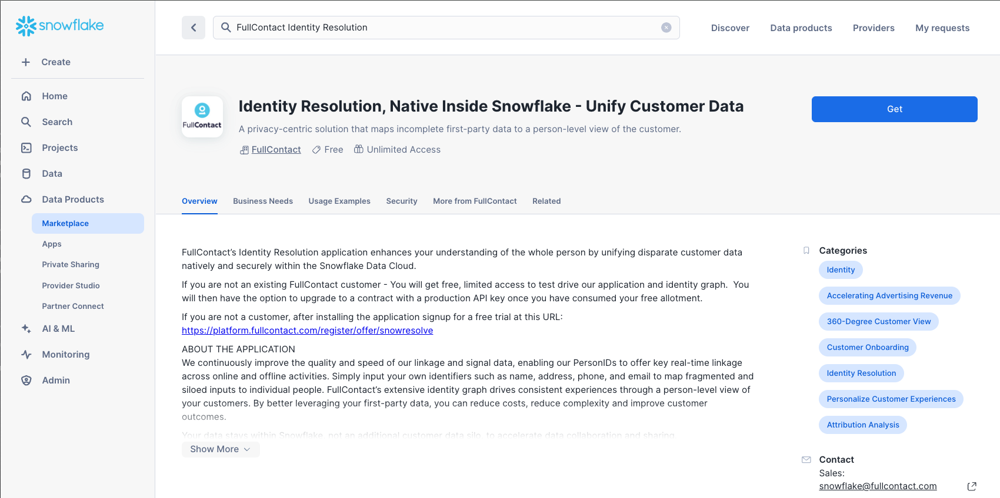

2) Search for `FullContact Identity Resolution` to find our Identity Resolution application.

3) Click the *Get* button to start installing the application

4) Choose the warehouse to use to run the install scripts (an XS warehouse works fine).

5) Expand the Options dropdown, where you are able to name the application anything you would like.  We have named the app `FC_NATIVE_APP`.  This is the app name we use in the SQL queries we provide post installation of the application in a Snowsight worksheet to help you complete the installation.  

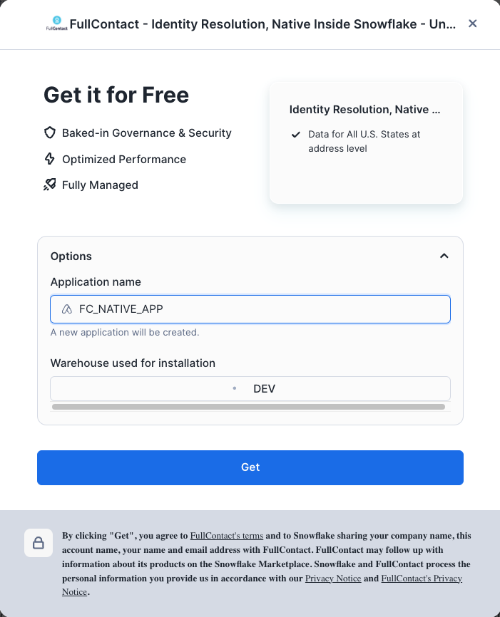

6) Click the *Get* button to install the application. 

7) A modal will display to give you the option to view your apps. The installation typically completes within 1-2 minutes.

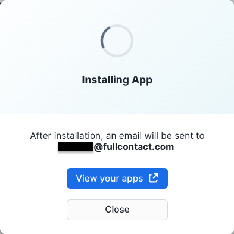

8) Once installation is complete, you will see a confirmation modal with an option to *Configure* the app. This will navigate you to the main landing page of the app where you can begin configuration.  

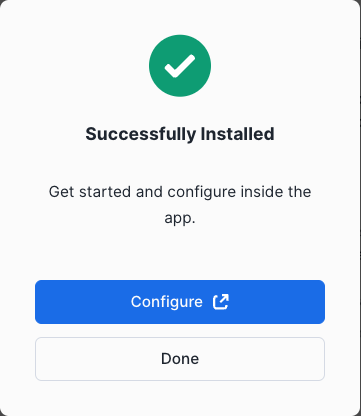

<!---------------------------->
## Complete configuration of FullContact App


Once installed, there are a few more configuration steps that need to be completed before the FullContact for Snowflake application can function. 
On the main app page, click the *CONFIG* tab on the top nav bar to complete these steps.


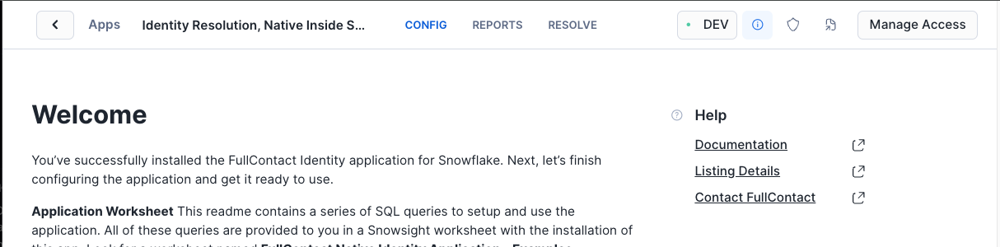

1) Create and grant access to API INTEGRATION by clicking the *Create New FC API Integration* button. 
   When the API integration modal appears, click *Allow* to start the creation process.
   If your use case requires manual creation of an API integration, click the *STEP 1 - Set FC API Integration* link on the left side menu for detailed instructions.
   If you are reinstalling the app and already have an `FC_API_INTEGRATION` from the previous install you may click the *Set Existing FC API Integration* button and select it from the resulting API integration modal.

> The `API INTEGRATION` is used to check your license key, allowed usage, and report usage summary counts back to FullContact. The app executes natively which means your raw data never leaves Snowflake. We do track aggregate data about your usage against your contract, that data is sent to our backend systems outside of Snowflake.

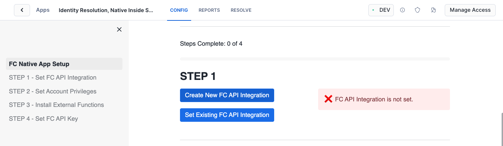
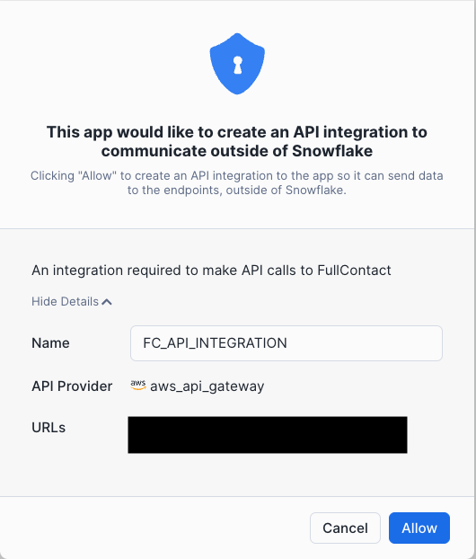


2) Allow application to create a dedicated database for input/output tables by first clicking the *Set Account Privileges* button then clicking *Grant Privileges* when the privilege modal is displayed. 
   Again, manual execution instructions for this step can be found by clicking the respective link on left side menu.

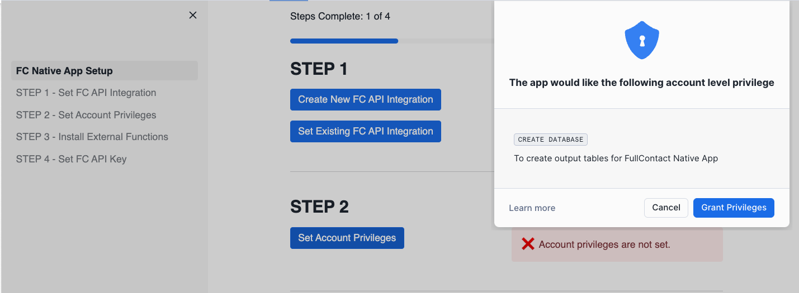

3) Install all External Functions required to run the application by clicking the *Install External Functions* button.

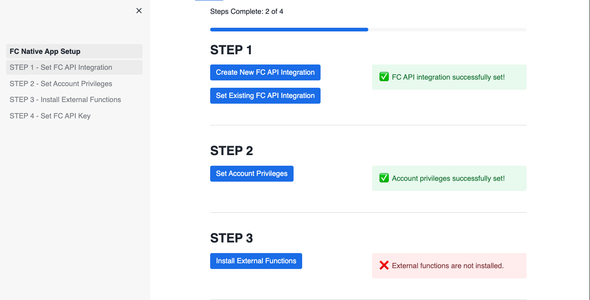

4) The final configuration step requires the creation of a FullContact account and API Key, which is covered in the next section. 


<!-- ------------------------ -->
## Creating a FullContact account and API key


In order to use the FullContact for Snowflake Application you need a license (API) key. You will generate this key in the FullContact platform, which is outside of Snowflake. Follow these instructions to get your free API Key, you will need this key for the next steps in this guide.

1) Visit the [FullContact for Snowflake Offer Page](https://platform.fullcontact.com/register/offer/snowresolve)


2) Enter your business email address and click "Create Account". Once complete you should see a page directing you to check your email.

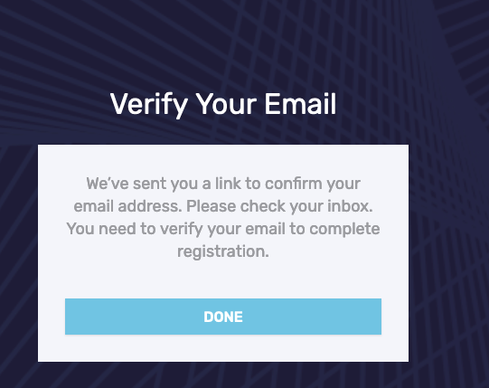

3) Check your email to find a "Welcome to FullContact" email. Click the "Verify This Email Address" button to setup your initial password

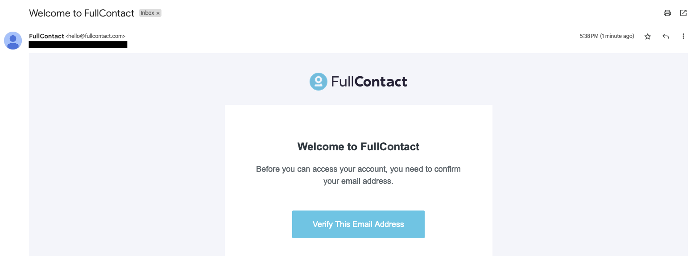

4) Choose your new Password and complete the short "Tell Us About Your Business Form"

5) Once the form is complete you will be logged into the FullContact Platform. Navigate to *Settings > API Keys*.

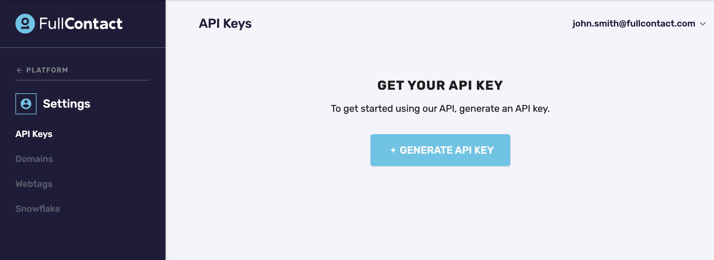

6) Click the "+ Generate API Key" button, verify your phone number via SMS then name your key (we used `Snowflake Key` in this example)

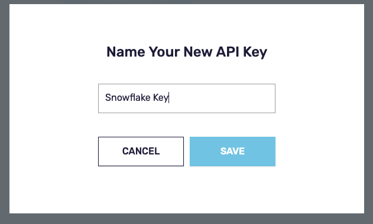

7) Click the copy button to copy the value of the key into a secure location for the next step (a notepad or file would work)

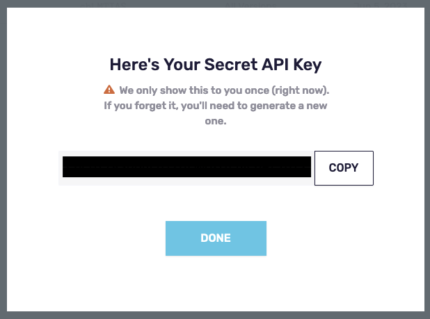

8) Return to the *CONFIG* tab of the FullContact Native app in Snowflake and paste your API key to complete the final configuration step. 

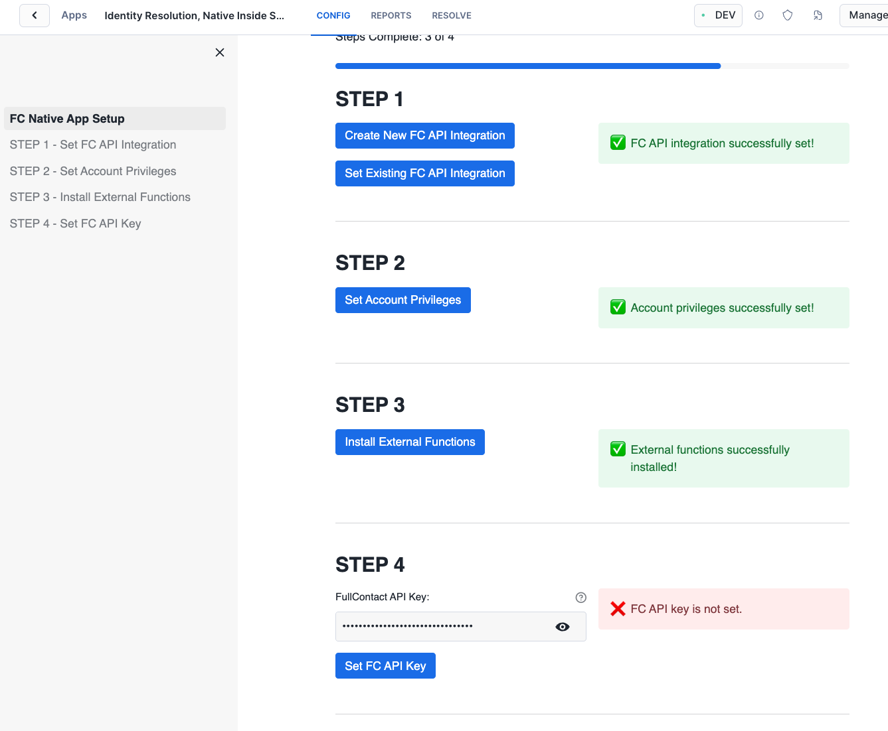

<!-- ------------------------ -->
## Prepping the Input Data


Before we can run Resolve to unify the sample customer data we need to create a semantic view to help the FullContact application understand how to interpret the different columns in the input data.
Because the demo input data is owned by the app, additional grants are not required.
When using your own input data instead of our demo data, you will need to first grant the app access to your input table as shown below.

1) Grant the app access to your raw input table. If you are using the demo data, you can skip this step.
```sql
GRANT USAGE ON DATABASE YOUR_DB_NAME TO APPLICATION FC_NATIVE_APP;
GRANT USAGE ON SCHEMA YOUR_SCHEMA_NAME.YOUR_INPUT_TABLE_NAME TO APPLICATION FC_NATIVE_APP;
GRANT SELECT, UPDATE ON TABLE YOUR_DB_NAME.YOUR_SCHEMA_NAME.YOUR_INPUT_TABLE_NAME TO APPLICATION FC_NATIVE_APP;
```

2) Whether you use the demo input table or your own. You will need to create a new view for your input data.
   Create a new database and schema for the view you are about to create (if one does not exist already).
   For this guide, we will create a new db and schema called `FC_QUICKSTART.INPUT` for our new view.

```sql
CREATE DATABASE FC_QUICKSTART;
CREATE SCHEMA FC_QUICKSTART.INPUT;
```

2) Once the app can read your raw input table, create the Semantic Input View for your input table by calling the `GET_SQL_CREATE_INPUT_VIEW` procedure on a Snowflake worksheet.
```sql
CALL FC_NATIVE_APP.APP_SCHEMA.GET_SQL_CREATE_INPUT_VIEW(
        'FC_NATIVE_APP.SAMPLE_DATA.CUST_JOURNEY_PURCHASE_DEMO', -- input table (fully qualified name)
        'FC_QUICKSTART.INPUT.CUST_JOURNEY_PURCHASE_DEMO_VIEW', -- input view to create (fully qualified name)
        'RECORD_ID'); -- primary key of your raw input table
```

3) Copy the results of the previous procedure and run it on a Snowflake worksheet to create the actual view and apply grants required by our app to read the new view.

```sql
-- This view create statement contains predicted aliases for columns based on data in each column.
-- Please review the statement and modify it as needed before using it as input to the RESOLVE stored procedure.
-- Accepted column names for the RESOLVE stored procedure can be found in the documentation linked below.
-- https://docs.fullcontact.com/docs/snowflake-native-resolve
CREATE OR REPLACE VIEW FC_QUICKSTART.INPUT.CUST_JOURNEY_PURCHASE_DEMO_VIEW AS SELECT
	RECORD_ID AS RECORD_ID,
	FIRST_NAME,
	LAST_NAME,
	PHONE_NUMBER,
	CITY,
	PURCHASE_CHANNEL,
	ZIP_CODE,
	ADDRESS_LINE_1,
	ADDRESS_LINE_2,
	CUSTOMER_NUMBER,
	LIFETIME_VALUE,
	EMAIL_1,
	STATE
FROM FC_NATIVE_APP.SAMPLE_DATA.CUST_JOURNEY_PURCHASE_DEMO;
GRANT USAGE ON DATABASE FC_QUICKSTART TO APPLICATION FC_NATIVE_APP;
GRANT USAGE ON SCHEMA FC_QUICKSTART.INPUT TO APPLICATION FC_NATIVE_APP;
GRANT SELECT ON VIEW FC_QUICKSTART.INPUT.CUST_JOURNEY_PURCHASE_DEMO_VIEW TO APPLICATION FC_NATIVE_APP;
```
At this point you should have your semantic view `FC_QUICKSTART.INPUT.CUST_JOURNEY_PURCHASE_DEMO_VIEW` created.

<!-- ------------------------ -->
## Running the Resolve SPROC to Assign PersonIDs


These steps are where the magic happens.

We provide some sample data with the application install that you can use for this initial test. Copy, paste and run the following SQL to take the sample data and run it through the FullContact Resolve process (which standardizes it and joins it to the FullContact Identity Graph) and assign Person IDs (PIDs)

1) Call the `RESOLVE` procedure to resolve and assign PersonIds to the input data. 
```sql
-- Call the RESOLVE SPROC to resolve and assign PIDs to sample data
CALL FC_NATIVE_APP.APP_SCHEMA.RESOLVE(
'FC_QUICKSTART.INPUT.CUST_JOURNEY_PURCHASE_DEMO_VIEW',    	-- semantic input view (fully qualified name)
'CUST_JOURNEY_PURCHASE_DEMO_RESULTS');                          -- output table name (table name only)
```

2) The results will land in separate IO database created by our app.
   The procedure will append `_IO` to the name you supplied for our native app (in our case `FC_NATIVE_APP`) to create the IO database.
   All resolve runs will output to the schema `RESOLVE_OUT` in this IO database.
   Consequently, the resulting output table for this demo can be found at `FC_NATIVE_APP_IO.RESOLVE_OUT.CUST_JOURNEY_PURCHASE_DEMO_RESULTS`.

2) View the results, making note of the PIDs column.

```sql
SELECT * FROM FC_NATIVE_APP_IO.RESOLVE_OUT.CUST_JOURNEY_PURCHASE_DEMO_RESULTS LIMIT 10;
```

3) For each resolve call, you can view some summary metrics on how your records were resolved.

```sql
SELECT * FROM FC_NATIVE_APP.METRICS.FC_RESOLVE_METRICS;
```

4) Note how the different versions of Willow were all consolidated into the same PersonID

```sql
SELECT * FROM FC_NATIVE_APP_IO.RESOLVE_OUT.CUST_JOURNEY_PURCHASE_DEMO_RESULTS WHERE first_name = 'Willow';
```

<!-- ------------------------ -->
## Conclusion And Resources


By following this guide you learned how to use the FullContact for Snowflake application to unify disparate customer data through the Fullcontact PersonID. This application reads, standardizes and joins your dataset to the FullContact Identity Graph all without your data leaving the confines of Snowflake or being shared with FullContact.

If you want to learn more about FullContact for Snowflake check out the [official documentation](https://docs.fullcontact.com/docs/snowflake-integration) or [contact an expert](https://www.fullcontact.com/contact/) to learn more about the different products FullContact offers and how it can help you better connect to your customers.

### What We've Covered
- Installing and setting up the FullContact for Snowflake App
- Creating a FullContact account and API key
- Running the FullContact for Snowflake App on sample customer data to unify and deduplicate disparate datasets

### Resources
- [Reference Architecture](/content/dam/snowflake-site/developers/2024/10/V2-FullContact-Solution-Architecture-Sept-2024.pdf)
- [Read the Blog](https://medium.com/snowflake/unifying-customer-data-with-fullcontact-for-snowflake-b355a4970c74)
- [Watch the Demo](https://youtu.be/Ft8FT-ngffc?si=9vcJAG2T3S-wTqNu)
  


 
