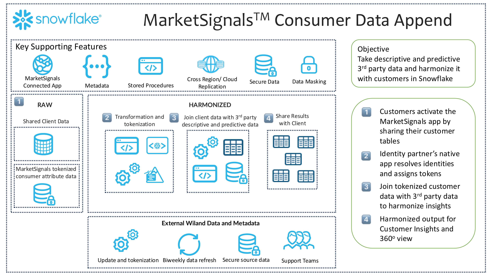

author: Wiland Inc.
id: how_to_append_data_to_your_audience_with_wiland
summary: How to append data to your customer file with MarketSignals&trade;
categories: data-sharing
environments: web
status: Published 
feedback link: https://github.com/Snowflake-Labs/sfguides/issues
tags: Data Append, Data Enhancement, Consumer Data, Machine Learning, MarketSignals, Wiland, Data Sharing

# How to append data to your customer file with MarketSignals&trade;
<!-- ------------------------ -->
## Overview
Duration: 4

By completing this QuickStart guide, you will gain the ability to harmonize the basic PII in your customer database on Snowflake with any of thousands of the **MarketSignals&trade;** data append consumer attributes using the **MarketSignals&trade;** application.

Seamlessly integrate **MarketSignals&trade;** data into your Snowflake customer database architecture through efficient workflows providing you with secure access without moving your data.

### What is MarketSignals Consumer Data Append?

**MarketSignals** consumer data append is a connected Snowflake app that uses Snowflake secure data shares to join individual consumer level attributes to your customer file on Snowflake and provide you with data you need for a rich understanding of your customers.

Working from a catalog of over 3,000 data elements you can choose between demographics, lifestyles and interest indicators, purchase propensities, brand, affinities, and purchase transaction data, and more.

**MarketSignals** completes your understanding of your customer’s needs, desires, and aspirations. By augmenting your first-party data with Wiland’s characteristics, interests, lifestyles, total spending activity, and purchase intent insights &mdash; information your brand could never obtain on its own &mdash; you can create a more complete picture of your customers and prospects.

### What You’ll Learn

New facts regarding the demographic and psychographic segments present among your customers, like:

- Who owns multiple properties, who lives in urban, suburban, or rural environments, and who invests in property themselves?
- What age, income, gender, occupation, and other demographic segments are prominent in your database?
- Which customers enjoy outdoor activities? Which prefer the ballet? Which attend plays or like to read books?

The top purchases your customers make with others, as well as their top purchase propensities and brand allegiances.

The financial strength of your customers, from income and net worth to home value and property characteristics.

And many more descriptive data elements and predictive analytics.

### What You Will Build

An enhanced customer table view with rows containing the individual PII you shared and new columns containing each **MarketSignals** data element you licensed.

### Prerequisites

- A non-trial Snowflake account.
- Table in Snowflake with customer information, containing the following columns:
  - Unique record identifier
  - Customer Name
  - Address and/or Email

## Conclusion & Resources
Duration: 1

Congratulations, you have successfully completed this Getting Started with **MarketSignals&trade;** data append quickstart guide.

### What You Learned

- The vast number of and types of consumer attributes available through the [**MarketSignals** National Consumer File](https://app.snowflake.com/marketplace/listing/GZTYZ62JF08/wiland-inc-wiland-viewtm-national-consumer-file?search=wiland)
- How to use the **MarketSignals** data append connected app to join those attributes to your customer data on Snowflake
- How you can use the **MarketSignals** data to uncover critical insights about your customers Resources

### Related Resources

- [**MarketSignals** Snowflake Marketplace Listing](https://app.snowflake.com/marketplace/listing/GZTYZ62JF08/wiland-inc-wiland-viewtm-national-consumer-file?search=wiland)
- [**Lean more about Wiland MarketSignals**](https://wiland.com/data/ "Superior Enhancement Data for Improved Marketing ROI") 
