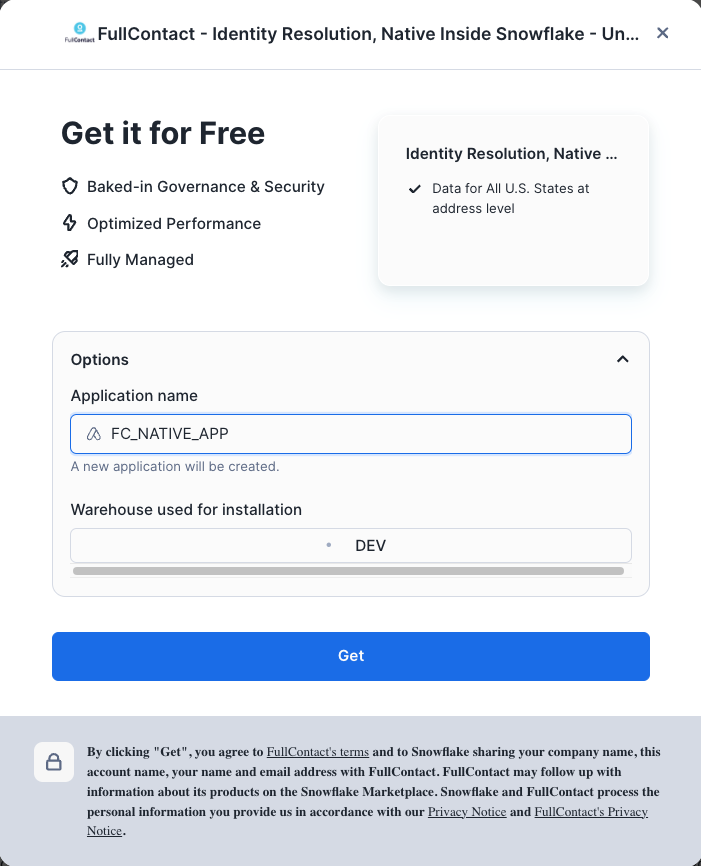
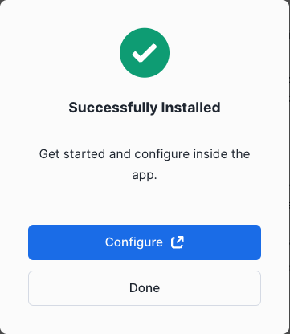
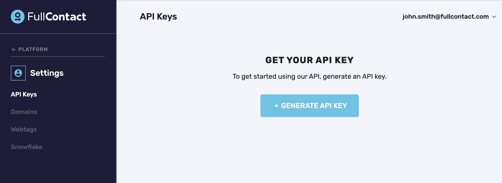

author: Alix Thoi
id: how_to_resolve_data_with_fullcontact_and_snowflake
summary: This is a sample Snowflake Guide
categories: Getting-Started
environments: web
status: Published 
feedback link: https://github.com/Snowflake-Labs/sfguides/issues
tags: Getting Started, Data Science, Data Engineering, Twitter 

# How To Resolve Data with FullContact and Snowflake
<!-- ------------------------ -->
Duration: 1

## Overview 
As Snowflake is used more and more frequently as the central datawarehouse users often find themselves with duplicate copies of customer information in different tables. This guide shows how to use the FullContact for Snowflake Native Application to unify different pieces of customer data using the FullContact PersonID to have a single, accurate view of how the customer is engaging with your brand.

With your install we will provide you some synthetic data that will join to our Identity Graph to allow you to test out the application.  By the end of the walkthrough, we're going to show you how several profiles of a fictional customer named Willow Underwood, will now be able to be merged into a single record of that customer.
To see a more in depth example with other sample datasets, make sure to check out the YouTube product walkthrough that is a companion to this guide.

### Prerequisites
- A Snowflake Account that you have `ACCOUNTADMIN`
- Familiarity with Snowflake SQL
- Agreed to the [Snowflake Consumer Terms of Service](<https://other-docs.snowflake.com/en/collaboration/consumer-becoming>) for the Marketplace

### What You’ll Learn 
- How to install the FullContact for Snowflake Native Application
- How to configure and setup the FullContact for Snowflake Native Application
- How to use the FullContact for Snowflake Native Application to unify and dedeuplicate multiple sources of customer data

### What You’ll Need 
- [Snowflake Account](https://signup.snowflake.com/) with `ACCOUNTADMIN` access
- [FullContact Trial Account](https://platform.fullcontact.com/register/offer/snowresolve)

### What You’ll Build 
- A unified customer dataset 

<!-- ------------------------ -->
## Install the FullContact for Snowflake App
Duration: 1

The FullContact for Snowflake Native App is available in the Snowflake Marketplace

1) Visit the ["Apps" section of Snowsight](https://app.snowflake.com) from your Snowflake Account 


2) Under the "Recently Shared with You" section, click the "Get" button next to the FullContact Native Identity Application

3) Choose the warehouse to use to run the install scripts (an XS warehouse works fine). 

4) Expand the Options dropdown, where you are able to name the application anything you would like.  We have named the app "FC_NATIVE_APP".  This is the app name we use in the SQL queries we provide post installation of the application in a Snowsight worksheet to help you complete the installation.  



5) Click the Get button to install the application.  The Get button will be deactivated while installing.  There is not currently a loader that displays to give a sense for how the installation is progressing - the installers typically complete within 1-2 minutes.   

6) Once installation is complete, you will see a confirmation modal.  



7) Click the **Open** button, which will open a worksheet pre-populated with the queries you will need to complete the installation.

<!-- ------------------------ -->
## Complete configuration of FullContact App
Once installed there are a few more steps that need to be completed before the FullContact for Snowflake application can function. Follow these instructions by pasting and running the following SQL in a new SQL worksheet.

1) Create and grant access to API INTEGRATION

> aside positive
> 
>  The `API INTEGRATION` is used to check your license key, allowed usage, and report usage summary counts back to FullContact. Your raw data never leaves Snowflake as the app executes natively and FullContact will not have access to your raw data unless you decide to share it with us using a normal secure share.

```sql
CREATE API INTEGRATION IF NOT EXISTS FC_API_INT_FULLCONTACT_IDENTITY_SOLUTIONS
    API_PROVIDER = aws_api_gateway
    API_AWS_ROLE_ARN = 'arn:aws:iam::966965295085:role/cx-blizzard-snowflake'
    API_ALLOWED_PREFIXES = ('https://um58694ui8.execute-api.us-east-1.amazonaws.com/blizzard-default/v3')
    ENABLED = true;

-- Grant access to allow a specific user or role to use this application
GRANT USAGE ON INTEGRATION FC_API_INT_FULLCONTACT_IDENTITY_SOLUTIONS TO APPLICATION FC_NATIVE_APP;
GRANT APPLICATION ROLE FC_NATIVE_APP.FC_USER TO ROLE ACCOUNTADMIN;
```

2) Install and define the `EXTERNAL FUNCTIONS` that the application needs to run. 

```sql
-- Install the EFs (external functions) that the app needs to run:
-- install EFs
CALL FC_NATIVE_APP.APP_SCHEMA.CREATE_EF_GET_DATAPACKS('FC_API_INT_FULLCONTACT_IDENTITY_SOLUTIONS');
CALL FC_NATIVE_APP.APP_SCHEMA.CREATE_EF_GET_OAUTH_GROUP_LIST('FC_API_INT_FULLCONTACT_IDENTITY_SOLUTIONS');
CALL FC_NATIVE_APP.APP_SCHEMA.CREATE_EF_GET_OAUTH_GROUP_MEMBER_LIST('FC_API_INT_FULLCONTACT_IDENTITY_SOLUTIONS');
CALL FC_NATIVE_APP.APP_SCHEMA.CREATE_EF_GET_PRODUCT_USAGE('FC_API_INT_FULLCONTACT_IDENTITY_SOLUTIONS');
CALL FC_NATIVE_APP.APP_SCHEMA.CREATE_EF_PUT_USAGE('FC_API_INT_FULLCONTACT_IDENTITY_SOLUTIONS');
```


<!-- ------------------------ -->
## Creating a FullContact account and API key
Duration: 2

In order to use the FullContact for Snowflake Application you need a license (API) key. Follow these instructions to get one for free and use the generated key in the next sections.

1) Visit the [FullContact for Snowflake Offer Page](https://platform.fullcontact.com/register/offer/snowresolve)


2) Enter your business email address and click "Create Account". Once complete you should see a page directing you to check your email.


3) Check your email to find a "Welcome to FullContact" email. Click the "Verify This Email Address" button to setup your initial password


4) Choose your new Password and complete the short "Tell Us About Your Business Form"

5) Once the form is complete you will be logged into the FullContact Platform. Click the "API Keys" menu option on the left hand side.



6) Click the "+ Generate API Key" button, verify your phone number via SMS then name your key (we used `Snowflake Key` in this example)


7) Click the copy button to copy the value of the key into a secure location for the next step (a notepad or file would work)


<!-- ------------------------ -->
## Prepping the Input Data
Duration: 1

Before we can run Resolve to unify the sample customer data we need to setup a database and schema to hold the output tables and need to create a SEMANTIC VIEW to help the FullContact application understand how to interpret the different columns in the data. 

Follow the steps below and copy and paste the SQL to your SQL Worksheet.

1) Create output schema

```sql
CREATE DATABASE FC_QUICKSTART;
CREATE SCHEMA FC_QUICKSTART.OUTPUT;

GRANT USAGE ON DATABASE FC_QUICKSTART TO APPLICATION FC_NATIVE_APP;
GRANT USAGE ON SCHEMA FC_QUICKSTART.OUTPUT TO APPLICATION FC_NATIVE_APP;
```

2) Create the Semantic Input view. Run the following stored procedure. It will scan the sample input dataset and output additional SQL that you will need to copy/paste/run into your worksheet. 

```sql
CALL FC_NATIVE_APP.APP_SCHEMA.CREATE_INPUT_VIEW(
'FC_NATIVE_APP.SAMPLE_DATA.CUST_JOURNEY_PURCHASE_DEMO', -- input table name
'FC_QUICKSTART.OUTPUT.CUST_JOURNEY_PURCHASE_SEMANTIC',  -- output view name
'RECORD_ID',                                              -- name of column to treat as RECORD_ID
['HEM', 'MAID']);                                       -- type of data we plan on enriching with
```

3) Copy the results of the previous SPROC and run it (it should be something similar to the below)

```sql
-- This view create statement contains predicted aliases for columns based on data in each column.
-- Please review the statement and modify it as needed before using it as input to the RESOLVE stored procedure.
-- Accepted column names for the RESOLVE stored procedure can be found in the documentation.
CREATE OR REPLACE VIEW FC_QUICKSTART.OUTPUT.CUST_JOURNEY_PURCHASE_SEMANTIC AS SELECT
	EMAIL_1 AS RECORD_ID,
	FIRST_NAME,
	LAST_NAME,
	RECORD_ID,
	CITY,
	PURCHASE_CHANNEL,
	ZIP_CODE,
	ADDRESS_LINE_1,
	PHONE_NUMBER,
	ADDRESS_LINE_2,
	CUSTOMER_NUMBER,
	LIFETIME_VALUE,
	EMAIL_1,
	STATE
FROM FC_NATIVE_APP.SAMPLE_DATA.CUST_JOURNEY_PURCHASE_DEMO;
GRANT USAGE ON DATABASE FC_QUICKSTART TO APPLICATION FC_NATIVE_APP;
GRANT USAGE ON SCHEMA FC_QUICKSTART.OUTPUT TO APPLICATION FC_NATIVE_APP;
GRANT SELECT ON VIEW FC_QUICKSTART.OUTPUT.CUST_JOURNEY_PURCHASE_SEMANTIC TO APPLICATION FC_NATIVE_APP;

CREATE OR REPLACE TABLE FC_QUICKSTART.OUTPUT.CUST_JOURNEY_PURCHASE_SEMANTIC_RESOLVE_RESULTS LIKE FC_QUICKSTART.OUTPUT.CUST_JOURNEY_PURCHASE_SEMANTIC;
ALTER TABLE FC_QUICKSTART.OUTPUT.CUST_JOURNEY_PURCHASE_SEMANTIC_RESOLVE_RESULTS ADD COLUMN PIDS ARRAY;
ALTER TABLE FC_QUICKSTART.OUTPUT.CUST_JOURNEY_PURCHASE_SEMANTIC_RESOLVE_RESULTS ADD COLUMN RESOLVE_RUN_ID VARCHAR;
GRANT USAGE ON DATABASE FC_QUICKSTART TO APPLICATION FC_NATIVE_APP;
GRANT USAGE ON SCHEMA FC_QUICKSTART.OUTPUT TO APPLICATION FC_NATIVE_APP;
GRANT SELECT ON TABLE FC_QUICKSTART.OUTPUT.CUST_JOURNEY_PURCHASE_SEMANTIC_RESOLVE_RESULTS TO APPLICATION FC_NATIVE_APP;
GRANT INSERT ON TABLE FC_QUICKSTART.OUTPUT.CUST_JOURNEY_PURCHASE_SEMANTIC_RESOLVE_RESULTS TO APPLICATION FC_NATIVE_APP;
GRANT DELETE ON TABLE FC_QUICKSTART.OUTPUT.CUST_JOURNEY_PURCHASE_SEMANTIC_RESOLVE_RESULTS TO APPLICATION FC_NATIVE_APP;

CREATE OR REPLACE TABLE FC_QUICKSTART.OUTPUT.CUST_JOURNEY_PURCHASE_SEMANTIC_RESOLVE_RESULTS_ENRICH_RESULTS LIKE FC_QUICKSTART.OUTPUT.CUST_JOURNEY_PURCHASE_SEMANTIC_RESOLVE_RESULTS;
ALTER TABLE FC_QUICKSTART.OUTPUT.CUST_JOURNEY_PURCHASE_SEMANTIC_RESOLVE_RESULTS_ENRICH_RESULTS ADD COLUMN PID VARCHAR;
ALTER TABLE FC_QUICKSTART.OUTPUT.CUST_JOURNEY_PURCHASE_SEMANTIC_RESOLVE_RESULTS_ENRICH_RESULTS ADD COLUMN ENRICH_RUN_ID VARCHAR;
ALTER TABLE FC_QUICKSTART.OUTPUT.CUST_JOURNEY_PURCHASE_SEMANTIC_RESOLVE_RESULTS_ENRICH_RESULTS ADD COLUMN EMAILS VARIANT;
ALTER TABLE FC_QUICKSTART.OUTPUT.CUST_JOURNEY_PURCHASE_SEMANTIC_RESOLVE_RESULTS_ENRICH_RESULTS ADD COLUMN MAIDS VARIANT;

GRANT USAGE ON DATABASE FC_QUICKSTART TO APPLICATION FC_NATIVE_APP;
GRANT USAGE ON SCHEMA FC_QUICKSTART.OUTPUT TO APPLICATION FC_NATIVE_APP;
GRANT SELECT ON TABLE FC_QUICKSTART.OUTPUT.CUST_JOURNEY_PURCHASE_SEMANTIC_RESOLVE_RESULTS_ENRICH_RESULTS TO APPLICATION FC_NATIVE_APP;
GRANT INSERT ON TABLE FC_QUICKSTART.OUTPUT.CUST_JOURNEY_PURCHASE_SEMANTIC_RESOLVE_RESULTS_ENRICH_RESULTS TO APPLICATION FC_NATIVE_APP;
GRANT DELETE ON TABLE FC_QUICKSTART.OUTPUT.CUST_JOURNEY_PURCHASE_SEMANTIC_RESOLVE_RESULTS_ENRICH_RESULTS TO APPLICATION FC_NATIVE_APP;
```

At this point you should have your SEMANTIC view `FC_QUICKSTART.OUTPUT.CUST_JOURNEY_PURCHASE_SEMANTIC` created as well as two empty output tables that will be populated in the next step: `FC_QUICKSTART.OUTPUT.CUST_JOURNEY_PURCHASE_SEMANTIC_RESOLVE_RESULTS` and `FC_QUICKSTART.OUTPUT.CUST_JOURNEY_PURCHASE_SEMANTIC_RESOLVE_RESULTS_ENRICH_RESULTS`


<!-- ------------------------ -->
## Running the Resolve SPROC to Assign PersonIDs
Duration: 1

These steps are where the magic happens.

We provide some sample data with the application install that you can use for this initial test. Copy, paste and run the following SQL to take the sample data and run it through the FullContact Resolve process (which standardizes it and joins it to the FullContact Identity Graph) and assign Person IDs (PIDs)

1) Run the `RESOLVE_WITH_API_KEY` SPROC (replace the `REPLACEWITHYOURAPIKEY` string below with the API you created in the FullContact platform in the previous step)

```sql
-- Call the RESOLVE SPROC to resolve and assign PIDs to sample data
CALL FC_NATIVE_APP.APP_SCHEMA.RESOLVE_WITH_API_KEY(
'FC_QUICKSTART.OUTPUT.CUST_JOURNEY_PURCHASE_SEMANTIC',                -- input view
'REPLACEWITHYOURAPIKEY',                                              -- api key
'FC_QUICKSTART.OUTPUT.CUST_JOURNEY_PURCHASE_SEMANTIC_RESOLVE_RESULTS' -- output table
);
```

2) View the results, making note of the PIDs column.

```sql
SELECT * FROM FC_QUICKSTART.OUTPUT.CUST_JOURNEY_PURCHASE_SEMANTIC_RESOLVE_RESULTS LIMIT 10;

```

3) For each call, you can view some summary metrics on how your records were resolved.

```sql
SELECT * FROM FC_NATIVE_APP.METRICS.FC_RESOLVE_METRICS;
```

4) Note how the different versions of Willow were all consolidated into the same PersonID

```sql
SELECT * FROM FC_QUICKSTART.OUTPUT.CUST_JOURNEY_PURCHASE_SEMANTIC_RESOLVE_RESULTS WHERE first_name = 'Willow';
```

<!-- ------------------------ -->
## Conclusion
Duration: 1

By following this guide you learned how to use the FullContact for Snowflake application to unify disparate customer data through the Fullcontact PersonID. This application reads, standardizes and joins your dataset to the FullContact Identity Graph all without your data leaving the confines of Snowflake or being shared with FullContact.

If you want to learn more about FullContact for Snowflake check out the [official documentation](https://docs.fullcontact.com/docs/snowflake-integration) or [contact an expert](https://www.fullcontact.com/contact/) to learn more about the different products FullContact offers and how it can help you better connect to your customers.

### What we've covered
- Installing and setting up the FullContact for Snowflake App
- Creating a FullContact account and API key
- Running the FullContact for Snowflake App on sample customer data to unify and deduplicate disparate datasets