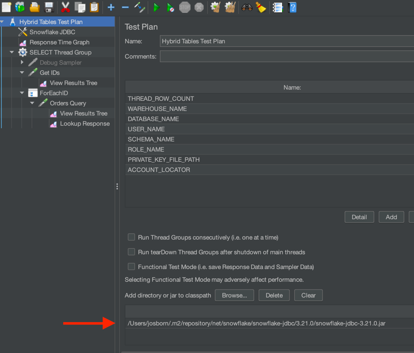
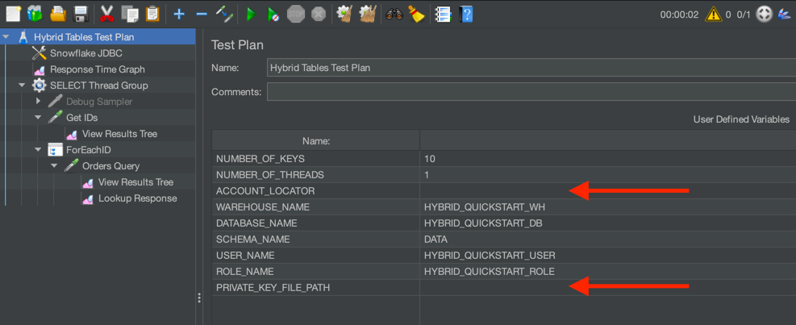
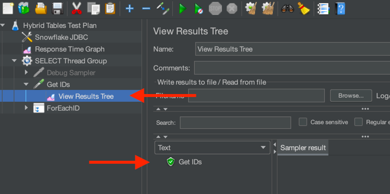
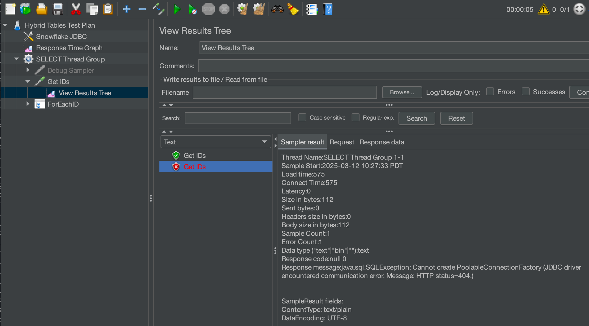
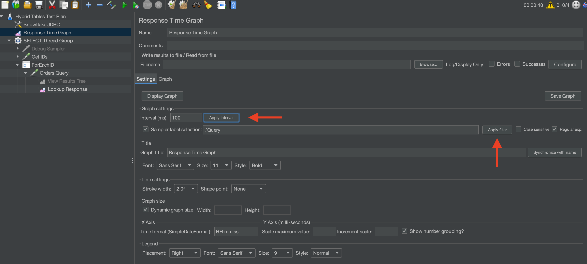

author: Jon Osborn
id: hybrid-tables-jmeter-performance-testing
categories: snowflake-site:taxonomy/solution-center/certification/quickstart, snowflake-site:taxonomy/product/data-engineering
language: en
summary: Execute a simple performance test to evaluate hybrid tables. 
environments: web
status: Published 
feedback link: https://github.com/Snowflake-Labs/sfguides/issues

# Hybrid Table Performance Testing with JMeter
<!-- ------------------------ -->
## Overview 

This guide will introduce you to performance testing Snowflake hybrid tables using [JMeter](https://jmeter.apache.org/).
Hybrid tables provide high concurrency and lower latency than standard Snowflake tables. If
your use case is response time sensitive, this guide will help you understand the 
best practices associated with performance testing hybrid tables.

This quickstart assumes you have executed the [Getting Started with Hybrid Tables](/en/developers/guides/getting-started-with-hybrid-tables/)
lesson.

While you will be using JMeter for this quickstart, this guide is not a comprehensive JMeter tutorial. The basics
will be covered to get you started.

### Prerequisites

- Installed and running [JMeter](https://jmeter.apache.org/)
- Open SSL installed (to generate a key pair)

### What You’ll Learn

- How to create a user for external testing using key authentication
- How to configure JMeter to connect to Snowflake
- How to create basic hybrid tables for performance testing

### What You’ll Need 

- A Snowflake account - hybrid tables are not supported in trial accounts
- JMeter installed and operational
- The Snowflake JDBC Driver
- A shell terminal application
- ``openssl`` installed (to generate a key)
- About 20 minutes

### What You’ll Build 

- A hybrid table performance test using JMeter

Proceed to the next step to create Snowflake objects.

<!-- ------------------------ -->
## Create Snowflake Database

You will need a user and role configured in Snowflake for this test. The user
must use key based authentication so MFA is not required. 

Let's create the basic objects. Open Snowsight and run the following script:

```sql
USE ROLE ACCOUNTADMIN;
-- Create role HYBRID_QUICKSTART_ROLE
CREATE OR REPLACE ROLE HYBRID_QUICKSTART_ROLE;
GRANT ROLE HYBRID_QUICKSTART_ROLE TO ROLE ACCOUNTADMIN ;

-- Create HYBRID_QUICKSTART_WH warehouse
CREATE OR REPLACE WAREHOUSE HYBRID_QUICKSTART_WH WAREHOUSE_SIZE = XSMALL, AUTO_SUSPEND = 300, AUTO_RESUME = TRUE;
GRANT OWNERSHIP ON WAREHOUSE HYBRID_QUICKSTART_WH TO ROLE HYBRID_QUICKSTART_ROLE;
GRANT CREATE DATABASE ON ACCOUNT TO ROLE HYBRID_QUICKSTART_ROLE;

-- Use role and create HYBRID_QUICKSTART_DB database and schema.
CREATE OR REPLACE DATABASE HYBRID_QUICKSTART_DB;
GRANT OWNERSHIP ON DATABASE HYBRID_QUICKSTART_DB TO ROLE HYBRID_QUICKSTART_ROLE;
CREATE OR REPLACE SCHEMA DATA;
GRANT OWNERSHIP ON SCHEMA HYBRID_QUICKSTART_DB.DATA TO ROLE HYBRID_QUICKSTART_ROLE;

-- Use role
USE ROLE HYBRID_QUICKSTART_ROLE;

-- Set step context use HYBRID_DB_USER_(USER_NUMBER) database and DATA schema
USE DATABASE HYBRID_QUICKSTART_DB;
USE SCHEMA DATA;
```

Next, we will create our table for testing.

<!-- ------------------------ -->
## Create the Hybrid Table

For this quickstart, we will create a very generic hybrid table and generate synthetic
data to use for testing. In this way, you can customize the table and testing
to closely match your scenario.

Create our basic table and insert synthetic data:
```sql
USE ROLE HYBRID_QUICKSTART_ROLE;
USE SCHEMA HYBRID_QUICKSTART_DB.DATA;
    
CREATE OR REPLACE HYBRID TABLE ICECREAM_ORDERS (
       ID NUMBER(38,0) NOT NULL AUTOINCREMENT START 1 INCREMENT 1 ORDER,
       STORE_ID NUMBER(38,0) NOT NULL,
       FLAVOR VARCHAR(20) NOT NULL,
       ORDER_TS TIMESTAMP_NTZ(9),
       NUM_SCOOPS NUMBER(38,0),
       PRIMARY KEY (ID)
);
-- Use INSERT INTO... method because the ID is autoincremented
INSERT INTO ICECREAM_ORDERS (STORE_ID, FLAVOR, ORDER_TS, NUM_SCOOPS)
SELECT
  UNIFORM(1, 10, RANDOM()),
  ARRAY_CONSTRUCT('CHOCOLATE', 'VANILLA', 'STRAWBERRY', 'LEMON')[UNIFORM(0, 3, RANDOM())],
  DATEADD(SECOND, UNIFORM(0, 86400, RANDOM()), DATEADD(DAY, UNIFORM(-90, 0, RANDOM()), CURRENT_DATE())),
  UNIFORM(1, 3, RANDOM())
FROM TABLE(GENERATOR(ROWCOUNT => 10000))
-- Feel free to change the ROWCOUNT as needed
;

```
Check that we created something useful:
```sql
SELECT *
FROM ICECREAM_ORDERS
LIMIT 10;
```
Next, we will create our user that will execute the test.

<!-- ------------------------ -->
## Create the Performance Testing User

For the test scenario, the user will need to authenticate without the need for MFA. We do this in
Snowflake with [key-pair authentication](https://docs.snowflake.com/en/user-guide/key-pair-auth). This
documentation provides additional details that are not proided here.

If you have a private key from a previous quickstart, skip to generating the public key.

We need to generate a private key and a paired public key. The public key will be added to the 
Snowflake user's profile and used to authenticate the connection.

Create a local directory to hold our testing artifacts. It can be any directory you like.
```shell
mkdir -p ~/snowflake-quickstart/hybrid-performance
cd ~/snowflake-quickstart/hybrid-performance
```

Create a private key:
```shell
openssl genrsa 2048 | openssl pkcs8 -topk8 -inform PEM -out rsa_key.p8 -nocrypt
```

Create a public key:
```shell
# change to a directory for purposes of testing
openssl rsa -in rsa_key.p8 -pubout -out rsa_key.pub
```
We will use the public key text in the next step.

For the user to connect wihtout a password, we need to configure the public key. Copy the public key
from ``rsa_key.pub`` and paste it into the following SQL.

```sql
USE ROLE ACCOUNTADMIN;

CREATE OR REPLACE USER HYBRID_QUICKSTART_USER DEFAULT_ROLE = HYBRID_QUICKSTART_ROLE;
-- Copy the key text from the rsa_key.pub file created in the previous script
ALTER USER HYBRID_QUICKSTART_USER SET RSA_PUBLIC_KEY='MIIBIjANBgkqh...<replace with your key>';

-- Finally, grant the role to the user
GRANT ROLE HYBRID_QUICKSTART_ROLE TO USER HYBRID_QUICKSTART_USER;
```

We created the tables using the ``HYBRID_QUICKSTART_ROLE`` so this new user will be able to see
the tables and do the performance testing.

<!-- ------------------------ -->
## Download and Configure the JMeter Script

For this part of the testing, you will:
* Download the JMeter script
* Add the JDBC Driver
* Customize the JDBC Connection
* Test that the script connects to your Snowflake instance


### Download the JMeter Script
Download the script from [this git repository link](https://github.com/Snowflake-Labs/sfguide-getting-started-with-hybrid-tables-performance-testing/blob/main/assets/Snowflake%20Hybrid%20Tables.jmx). 
Start the JMeter software and open the downloaded script ``File->Open``. The script is configured to do a very simple test against
the table we have already created:

- Connect to Snowflake using the configuration we supply
- Use a [sampling query](https://docs.snowflake.com/en/sql-reference/constructs/sample) to select 
  random keys from the target table
```sql
SELECT ID FROM ICECREAM_ORDERS SAMPLE (${NUMBER_OF_KEYS} ROWS);
```
- Enumerate the keys with a configurable number of threads to test throughput and latency.
```sql
SELECT * FROM ICECREAM_ORDERS WHERE ID = ?
```
**Note:** A hybrid table best practice is to use prepared statements with bound parameters. This method maximizes
query re-use, minimizes compile time, and generates more useful [AGGREGATE_QUERY_HISTORY](https://docs.snowflake.com/en/sql-reference/account-usage/aggregate_query_history).

### Configure the JDBC Driver
JMeter will connect to Snowflake using JDBC. Snowflake provides a java driver for this type of connection. Follow
these steps to connect JMeter with your Snowflake instance.

1. Download the Standard JDBC Driver jar [using these instructions](https://docs.snowflake.com/en/developer-guide/jdbc/jdbc-download#download-a-standard-driver).
1. Start JMeter 
    - If you installed jmeter using homebrew on a mac, the start script hard codes the `JAVA_HOME` environment variable.
      If you need or want to change the java version, you will likely need to run your own
      start script.
1. Add the jar to the class list in the JMeter configuration like this:



### Customize the JDBC Connection
Most of the user defined variables will be setup to match the work you have already done. You will need to 
add your `Account Identifier` ([details here](https://docs.snowflake.com/en/user-guide/admin-account-identifier)), 
and add the fully qualified path to your private key file. The private key file is used to authenticate the user.



### Test the Connection
With just a single thread and a few records, let's check that JMeter is connecting to Snowflake. In the
User Defined Variables, set `NUMBER_OF_KEYS` = 10 and `NUMBER_OF_THREADS` = 1. 

Click the green arrow in the tool bar or press Command+R to run a test. The test will run and then automatically
stop.

If successful, JMeter will sample 10 keys from the hybrid table and use a single thread to query the records. Check in the 
`View Results Tree` section on the left to see if the `Get IDs` request was successful:



A failed connection would look something like:



If the connection fails, clicking the failure will show you the nature of the error. Most failures are due to:
- Incorrect account locator
- Private key file path not found
- Public key not loaded or incorrect for the Snowflake user

If your script successfully connected to Snowflake and queried for a few records, congratulations! You
are ready for a longer test.

<!-- ------------------------ -->
## Run a Full Test

Change the configuration to make 250 requests from 4 threads. 
- `NUMBER_OF_KEYS` = 250
- `NUMBER_OF_THREADS` = 4

Start a test. You can view the performance graph output by selecting `Response Time Graph`. Click
the `Apply interval` and `Apply filter` buttons before you visualize the graph:



Now you can adjust the number of keys and threads up to the limit of your particular machine.

Congratulations! You've executed a simple JMeter performance test for your hybrid table.
Explore JMeter graphing and data capabilities to visualize the performance.

## Conclusion and Resources

### Conclusion
Performance testing hybrid tables can be simple and easy. The method presented here can be expanded
and adapted for many hybrid tables testing scenarios.

Finally, this tutorial configures and uses JMeter with a user interface. The JMeter
user interface will slow the performance testing. If you require maximum performance from JMeter,
follow these additional steps:
- Create a virtual machine in your cloud provider within the same region as your Snowflake instance
- Load JMeter onto the virtual machine
- Disable logging and unnecessary components in the performance test
- Run JMeter in a [headless, non-gui mode](https://jmeter.apache.org/usermanual/get-started.html#non_gui)


### What You Learned
1. How to create a basic hybrid table
1. How to configure a Snowflake user with key-pair authentication
1. How to set up JMeter for a basic load test
1. How to run a basic load test

### Resources
- [Snowflake hybrid tables](https://docs.snowflake.com/en/user-guide/tables-hybrid)
- [Key-pair authentication](https://docs.snowflake.com/en/user-guide/key-pair-auth)
- [AGGREGATE_QUERY_HISTORY](https://docs.snowflake.com/en/sql-reference/account-usage/aggregate_query_history)
- [JMeter](https://jmeter.apache.org/)
