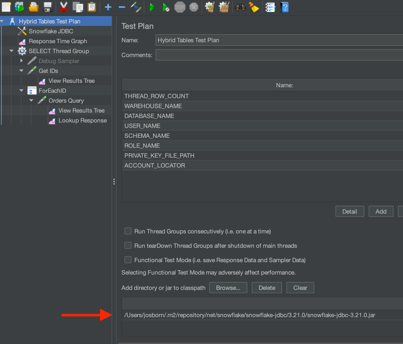
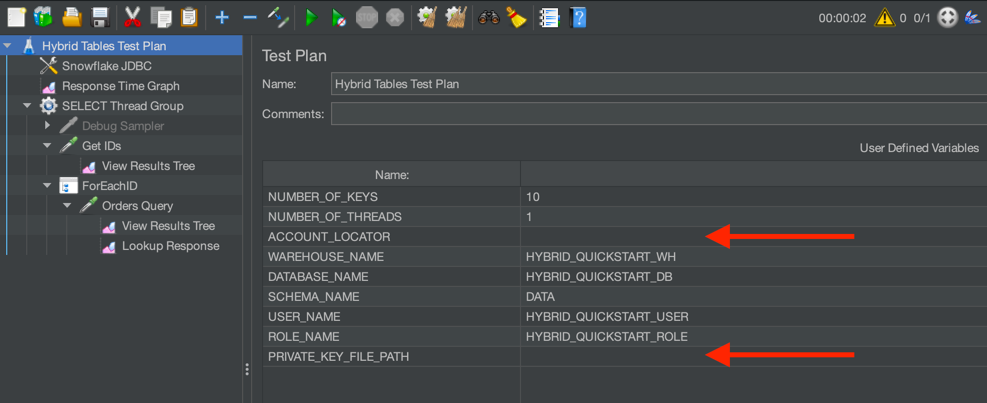
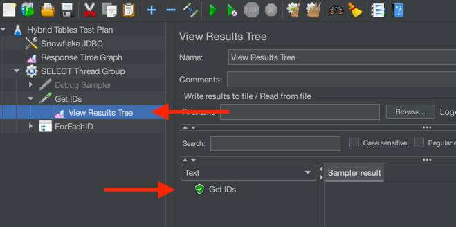
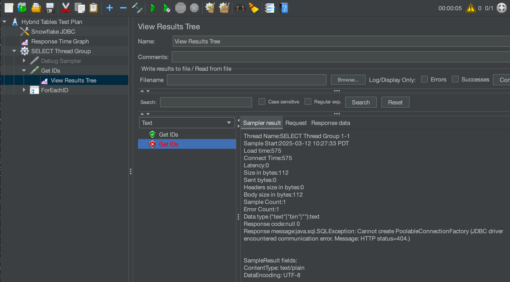
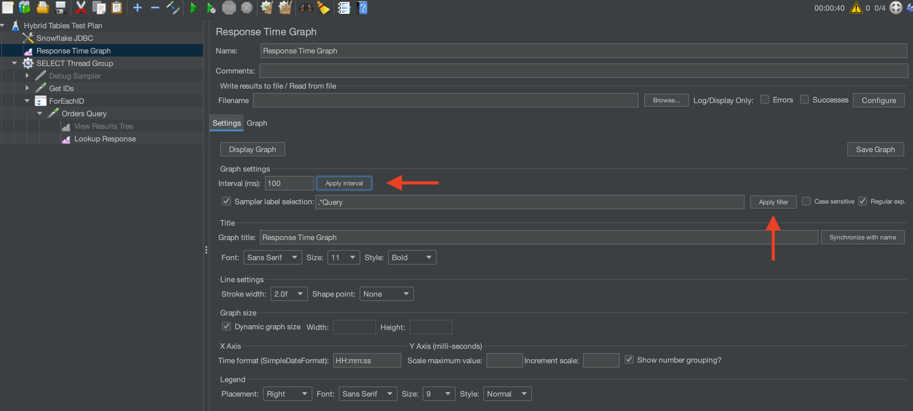

author: Jon Osborn
id: hybrid-tables-jmeter-performance-testing
categories: snowflake-site:taxonomy/solution-center/certification/quickstart, snowflake-site:taxonomy/product/data-engineering, snowflake-site:taxonomy/snowflake-feature/hybrid-tables
language: en
summary: Execute a simple performance test to evaluate hybrid tables. 
environments: web
status: Published 
feedback link: https://github.com/Snowflake-Labs/sfguides/issues

# Hybrid Table Performance Testing with JMeter
<!-- ------------------------ -->
## Overview 

This guide will introduce you to performance testing Snowflake hybrid tables using [JMeter](https://jmeter.apache.org/).
Hybrid tables provide high concurrency and lower latency than standard Snowflake tables. If
your use case is response time sensitive, this guide will help you understand the 
best practices associated with performance testing hybrid tables.

This quickstart assumes you have executed the [Getting Started with Hybrid Tables](/en/developers/guides/getting-started-with-hybrid-tables/)
lesson.

While you will be using JMeter for this quickstart, this guide is not a comprehensive JMeter tutorial. The basics
will be covered to get you started.

### Prerequisites

- Installed and running [JMeter](https://jmeter.apache.org/)
- Open SSL installed (to generate a key pair)

### What You’ll Learn

- How to create a user for external testing using key authentication
- How to configure JMeter to connect to Snowflake
- How to create basic hybrid tables for performance testing
- How to drive a multi-statement transaction with an Inline Stored Procedure
- How to measure latency and throughput from Snowflake's own telemetry rather than the client
- How to assert that a failed transaction rolls back, without polluting your performance numbers

### What You’ll Need 

- A Snowflake account - hybrid tables are not supported in trial accounts
- JMeter installed and operational
- The Snowflake JDBC Driver
- A shell terminal application
- ``openssl`` installed (to generate a key)
- About 20 minutes

### What You’ll Build 

- A hybrid table performance test using JMeter

Proceed to the next step to create Snowflake objects.

<!-- ------------------------ -->
## Create Snowflake Database

You will need a user and role configured in Snowflake for this test. The user
must use key based authentication so MFA is not required. 

Let's create the basic objects. Open Snowsight and run the following script:

```sql
USE ROLE ACCOUNTADMIN;
-- Create role HYBRID_QUICKSTART_ROLE
CREATE OR REPLACE ROLE HYBRID_QUICKSTART_ROLE;
GRANT ROLE HYBRID_QUICKSTART_ROLE TO ROLE ACCOUNTADMIN ;

-- Create HYBRID_QUICKSTART_WH warehouse
CREATE OR REPLACE WAREHOUSE HYBRID_QUICKSTART_WH WAREHOUSE_SIZE = XSMALL, AUTO_SUSPEND = 300, AUTO_RESUME = TRUE;
GRANT OWNERSHIP ON WAREHOUSE HYBRID_QUICKSTART_WH TO ROLE HYBRID_QUICKSTART_ROLE;
GRANT CREATE DATABASE ON ACCOUNT TO ROLE HYBRID_QUICKSTART_ROLE;

-- Use role and create HYBRID_QUICKSTART_DB database and schema.
CREATE OR REPLACE DATABASE HYBRID_QUICKSTART_DB;
GRANT OWNERSHIP ON DATABASE HYBRID_QUICKSTART_DB TO ROLE HYBRID_QUICKSTART_ROLE;
CREATE OR REPLACE SCHEMA DATA;
GRANT OWNERSHIP ON SCHEMA HYBRID_QUICKSTART_DB.DATA TO ROLE HYBRID_QUICKSTART_ROLE;

-- Use role
USE ROLE HYBRID_QUICKSTART_ROLE;

-- Set step context use HYBRID_DB_USER_(USER_NUMBER) database and DATA schema
USE DATABASE HYBRID_QUICKSTART_DB;
USE SCHEMA DATA;
```

Next, we will create our table for testing.

<!-- ------------------------ -->
## Create the Hybrid Table

For this quickstart, we will create a very generic hybrid table and generate synthetic
data to use for testing. In this way, you can customize the table and testing
to closely match your scenario.

Create our basic table and insert synthetic data:
```sql
USE ROLE HYBRID_QUICKSTART_ROLE;
USE SCHEMA HYBRID_QUICKSTART_DB.DATA;
    
CREATE OR REPLACE HYBRID TABLE ICECREAM_ORDERS (
       ID NUMBER(38,0) NOT NULL AUTOINCREMENT START 1 INCREMENT 1 ORDER,
       STORE_ID NUMBER(38,0) NOT NULL,
       FLAVOR VARCHAR(20) NOT NULL,
       ORDER_TS TIMESTAMP_NTZ(9),
       NUM_SCOOPS NUMBER(38,0),
       PRIMARY KEY (ID)
);
-- Use INSERT INTO... method because the ID is autoincremented
INSERT INTO ICECREAM_ORDERS (STORE_ID, FLAVOR, ORDER_TS, NUM_SCOOPS)
SELECT
  UNIFORM(1, 10, RANDOM()),
  ARRAY_CONSTRUCT('CHOCOLATE', 'VANILLA', 'STRAWBERRY', 'LEMON')[UNIFORM(0, 3, RANDOM())],
  DATEADD(SECOND, UNIFORM(0, 86400, RANDOM()), DATEADD(DAY, UNIFORM(-90, 0, RANDOM()), CURRENT_DATE())),
  UNIFORM(1, 3, RANDOM())
FROM TABLE(GENERATOR(ROWCOUNT => 10000))
-- Feel free to change the ROWCOUNT as needed
;

```
Check that we created something useful:
```sql
SELECT *
FROM ICECREAM_ORDERS
LIMIT 10;
```

### Add a Table and Procedure for the Transaction Test

A point lookup exercises one statement. To measure a *transaction* we need a unit of work that
touches more than one table, so add an audit table and an Inline Stored Procedure that writes to
both atomically.

The audit table carries a `CHECK` constraint. That is what the invalid-input test will violate
later, and it gives the rollback assertion something deterministic to detect. On a hybrid table a
`CHECK` constraint must be declared when the table is created; it cannot be added afterwards with
`ALTER TABLE`.

```sql
USE ROLE HYBRID_QUICKSTART_ROLE;
USE SCHEMA HYBRID_QUICKSTART_DB.DATA;

CREATE OR REPLACE HYBRID TABLE ICECREAM_ORDER_AUDIT (
       ID          NUMBER(38,0) NOT NULL AUTOINCREMENT START 1 INCREMENT 1 ORDER,
       ORDER_ID    NUMBER(38,0) NOT NULL,
       NEW_SCOOPS  NUMBER(38,0),
       CHANGED_AT  TIMESTAMP_NTZ(9) NOT NULL,
       PRIMARY KEY (ID),
       FOREIGN KEY (ORDER_ID) REFERENCES ICECREAM_ORDERS(ID),
       CONSTRAINT chk_new_scoops_positive CHECK (NEW_SCOOPS > 0)
);
```

The `ID` column auto-increments so the load generator never has to invent unique keys across
threads.

Now the procedure. An [Inline Stored Procedure](https://docs.snowflake.com/en/user-guide/hybrid-tables-inline-stored-procedures)
compiles its body as a single unit and runs it as one atomic transaction, so `BEGIN TRANSACTION`
and `COMMIT` are neither needed nor allowed inside it.

```sql
CREATE OR REPLACE INLINE PROCEDURE update_scoops(
    p_order_id   NUMBER,
    p_new_scoops NUMBER,
    p_changed_at TIMESTAMP_NTZ
)
RETURNS VARCHAR
LANGUAGE SQL
AS
$$
BEGIN ATOMIC
    INSERT INTO ICECREAM_ORDER_AUDIT (ORDER_ID, NEW_SCOOPS, CHANGED_AT)
    VALUES (:p_order_id, :p_new_scoops, :p_changed_at);

    UPDATE ICECREAM_ORDERS SET NUM_SCOOPS = :p_new_scoops WHERE ID = :p_order_id;

    RETURN 'ok';
END;
$$;
```

Two details in that body are worth noting before you drive it from JMeter:

- The timestamp is an argument. `CURRENT_TIMESTAMP()` is not available inside an Inline Stored
  Procedure, so any value the statements need has to come from the caller.
- The bind variables appear bare in the `VALUES` clause. An Inline Stored Procedure cannot iterate
  and cannot use `INSERT ... SELECT` with bind variables, so a fixed set of parameters per call is
  the shape to aim for.

Confirm the transaction works before adding load:

```sql
CALL update_scoops(1, 3, '2026-01-01 12:00:00'::TIMESTAMP_NTZ);

SELECT NUM_SCOOPS FROM ICECREAM_ORDERS WHERE ID = 1;
SELECT COUNT(*) FROM ICECREAM_ORDER_AUDIT;
```

Next, we will create our user that will execute the test.

<!-- ------------------------ -->
## Create the Performance Testing User

For the test scenario, the user will need to authenticate without the need for MFA. We do this in
Snowflake with [key-pair authentication](https://docs.snowflake.com/en/user-guide/key-pair-auth). This
documentation provides additional details that are not proided here.

If you have a private key from a previous quickstart, skip to generating the public key.

We need to generate a private key and a paired public key. The public key will be added to the 
Snowflake user's profile and used to authenticate the connection.

Create a local directory to hold our testing artifacts. It can be any directory you like.
```shell
mkdir -p ~/snowflake-quickstart/hybrid-performance
cd ~/snowflake-quickstart/hybrid-performance
```

Create a private key:
```shell
openssl genrsa 2048 | openssl pkcs8 -topk8 -inform PEM -out rsa_key.p8 -nocrypt
```

Create a public key:
```shell
# change to a directory for purposes of testing
openssl rsa -in rsa_key.p8 -pubout -out rsa_key.pub
```
We will use the public key text in the next step.

For the user to connect wihtout a password, we need to configure the public key. Copy the public key
from ``rsa_key.pub`` and paste it into the following SQL.

```sql
USE ROLE ACCOUNTADMIN;

CREATE OR REPLACE USER HYBRID_QUICKSTART_USER DEFAULT_ROLE = HYBRID_QUICKSTART_ROLE;
-- Copy the key text from the rsa_key.pub file created in the previous script
ALTER USER HYBRID_QUICKSTART_USER SET RSA_PUBLIC_KEY='MIIBIjANBgkqh...<replace with your key>';

-- Finally, grant the role to the user
GRANT ROLE HYBRID_QUICKSTART_ROLE TO USER HYBRID_QUICKSTART_USER;
```

We created the tables using the ``HYBRID_QUICKSTART_ROLE`` so this new user will be able to see
the tables and do the performance testing.

<!-- ------------------------ -->
## Download and Configure the JMeter Script

For this part of the testing, you will:
* Download the JMeter script
* Add the JDBC Driver
* Customize the JDBC Connection
* Test that the script connects to your Snowflake instance


### Download the JMeter Script
Download the script from [this git repository link](https://github.com/Snowflake-Labs/sfguide-getting-started-with-hybrid-tables-performance-testing/blob/main/assets/Snowflake%20Hybrid%20Tables.jmx). 
Start the JMeter software and open the downloaded script ``File->Open``. The script contains three thread groups. Two are measured workloads and one is a correctness check that is shipped disabled:

**SELECT Thread Group** — the point-lookup workload:

- Connect to Snowflake using the configuration we supply
- Use a [sampling query](https://docs.snowflake.com/en/sql-reference/constructs/sample) to select 
  random keys from the target table
```sql
SELECT ID FROM ICECREAM_ORDERS SAMPLE (${NUMBER_OF_KEYS} ROWS);
```
- Enumerate the keys with a configurable number of threads to test throughput and latency.
```sql
SELECT * FROM ICECREAM_ORDERS WHERE ID = ?
```

**TRANSACTION Thread Group** — a multi-statement unit of work, described in *Add a Transaction Workload* below.

**INVALID INPUT Thread Group** — deliberately failing calls used to prove rollback. It is shipped **disabled**, because the `Response Time Graph` listener sits at test plan level and would otherwise fold those failures into your latency numbers. See *Assert Transaction Rollback*.

**Note:** A hybrid table best practice is to use prepared statements with bound parameters. This method maximizes
query re-use, minimizes compile time, and generates more useful [AGGREGATE_QUERY_HISTORY](https://docs.snowflake.com/en/sql-reference/account-usage/aggregate_query_history).

Each thread group uses its own JDBC connection so it can carry its own `QUERY_TAG`, set with an `initQuery` on the connection configuration. That tag is what lets you separate the workloads in Snowflake's telemetry later.

### Configure the JDBC Driver
JMeter will connect to Snowflake using JDBC. Snowflake provides a java driver for this type of connection. Follow
these steps to connect JMeter with your Snowflake instance.

1. Download the Standard JDBC Driver jar [using these instructions](https://docs.snowflake.com/en/developer-guide/jdbc/jdbc-download#download-a-standard-driver).
1. Start JMeter 
    - If you installed jmeter using homebrew on a mac, the start script hard codes the `JAVA_HOME` environment variable.
      If you need or want to change the java version, you will likely need to run your own
      start script.
    - On newer JDKs the driver's Arrow dependency needs an additional JVM option. Without it every
      sampler fails immediately with `ExceptionInInitializerError` and a message about `MemoryUtil`.
      Set it before starting JMeter:
      ```
      export JVM_ARGS="--add-opens=java.base/java.nio=org.apache.arrow.memory.core,ALL-UNNAMED"
      ```
1. Add the jar to the class list in the JMeter configuration like this:



### Customize the JDBC Connection
Most of the user defined variables will be setup to match the work you have already done. You will need to 
add your `Account Identifier` ([details here](https://docs.snowflake.com/en/user-guide/admin-account-identifier)), 
and add the fully qualified path to your private key file. The private key file is used to authenticate the user.



### Test the Connection
With just a single thread and a few records, let's check that JMeter is connecting to Snowflake. In the
User Defined Variables, set `NUMBER_OF_KEYS` = 10 and `NUMBER_OF_THREADS` = 1. 

Click the green arrow in the tool bar or press Command+R to run a test. The test will run and then automatically
stop.

If successful, JMeter will sample 10 keys from the hybrid table and use a single thread to query the records. Check in the 
`View Results Tree` section on the left to see if the `Get IDs` request was successful:



A failed connection would look something like:



If the connection fails, clicking the failure will show you the nature of the error. Most failures are due to:
- Incorrect account locator
- Private key file path not found
- Public key not loaded or incorrect for the Snowflake user

If your script successfully connected to Snowflake and queried for a few records, congratulations! You
are ready for a longer test.

<!-- ------------------------ -->
## Run a Full Test

Change the configuration to make 250 requests from 4 threads. 
- `NUMBER_OF_KEYS` = 250
- `NUMBER_OF_THREADS` = 4

Start a test. You can view the performance graph output by selecting `Response Time Graph`. Click
the `Apply interval` and `Apply filter` buttons before you visualize the graph:



Now you can adjust the number of keys and threads up to the limit of your particular machine.

Congratulations! You've executed a simple JMeter performance test for your hybrid table.
Explore JMeter graphing and data capabilities to visualize the performance.

<!-- ------------------------ -->
## Add a Transaction Workload

The point lookup measures a single read. The `TRANSACTION Thread Group` measures a unit of work
that writes to two tables in one round trip by calling the Inline Stored Procedure you created
earlier.

It works the same way as the SELECT group: sample a set of order keys, then iterate over them.
The difference is the sampler, which uses JMeter's `Callable Statement` query type with bound
parameters:

```sql
CALL update_scoops(?, ?, ?)
```

The arguments are `${TXN_ID}`, a random scoop count, and a timestamp supplied by JMeter, typed
`INTEGER,INTEGER,TIMESTAMP`. Passing the timestamp from the caller is required, since the
procedure cannot call `CURRENT_TIMESTAMP()` itself.

Set `NUMBER_OF_TXNS` and `NUMBER_OF_TXN_THREADS` in the User Defined Variables, then run the test.
Both workloads execute in the same run and are reported separately in `View Results Tree`.

> **Note:** The JDBC connection configuration sets `autocommit` to true, which this workload
> requires. An Inline Stored Procedure cannot be called inside an open transaction.

A transaction call does more work than a point lookup, so expect its response times to be higher.
Compare the two workloads against each other rather than against an absolute target, and let the
test run for a while before drawing conclusions: early calls in a run include compilation work
that later calls amortize.

<!-- ------------------------ -->
## Assert Transaction Rollback

Throughput only matters if the writes are correct. The `INVALID INPUT Thread Group` proves that a
failed transaction leaves nothing behind.

It calls the same procedure with a scoop count of `0`, which violates the
`chk_new_scoops_positive` constraint on the audit table. The `INSERT` fails, and because the
procedure body is one atomic unit, the `UPDATE` that ran before it is rolled back too.

The group contains three elements:

- **Pick An Order** records an order's current scoop count into `INVALID_ORDER_ID_1` and
  `SCOOPS_BEFORE_1`. JMeter exposes JDBC result columns with a `_1` suffix for the first row.
- **Invalid Scoops Call** makes the failing call. A Response Assertion checks the *response code*
  for `1185`. JMeter reports the SQLSTATE and the vendor error code together, as `23514 1185`, so
  asserting on the error number is more durable than matching the constraint name, which you may
  rename.
- **Verify No Partial Write** re-reads the order and compares it to the recorded value, returning
  `ROLLBACK_OK` when it is unchanged. A second assertion checks for that string.

This group is shipped **disabled**. Enable it, run it to confirm both assertions pass, then
disable it again before measuring. The `Response Time Graph` listener sits at test plan level, so
anything this group does would otherwise be counted in your latency and throughput figures. With
the group disabled a measurement run reports no errors at all, which is what you want when the
numbers have to be trustworthy.

<!-- ------------------------ -->
## Measure From Snowflake's Telemetry

JMeter reports what the client observed, which includes network round trips, JDBC overhead, and
whatever else your machine was doing. That is useful as a sanity check, and the guide's own
advice about running headless on a VM in the same region exists precisely because the client
distorts the measurement.

For the numbers you actually report, use Snowflake's telemetry. Each thread group tags its own
connection, so the workloads can be separated after the fact:

| Thread group | `QUERY_TAG` |
| --- | --- |
| SELECT | `ht_qs_select` |
| TRANSACTION | `ht_qs_txn` |
| INVALID INPUT | `ht_qs_invalid` |

[AGGREGATE_QUERY_HISTORY](https://docs.snowflake.com/en/sql-reference/account-usage/aggregate_query_history)
is the right view for this. Its timing columns are objects that carry a full distribution, so you
get percentiles without computing them, and it counts every execution.

```sql
USE ROLE ACCOUNTADMIN;

SELECT QUERY_TAG,
       QUERY_TYPE,
       CALLS,
       EXECUTION_TIME:median::NUMBER     AS exec_p50_ms,
       EXECUTION_TIME:p90::NUMBER        AS exec_p90_ms,
       EXECUTION_TIME:p99::NUMBER        AS exec_p99_ms,
       COMPILATION_TIME:median::NUMBER   AS compile_p50_ms,
       TOTAL_ELAPSED_TIME:median::NUMBER AS total_p50_ms,
       HYBRID_TABLE_REQUESTS_THROTTLED_COUNT AS throttled,
       INTERVAL_START_TIME
FROM SNOWFLAKE.ACCOUNT_USAGE.AGGREGATE_QUERY_HISTORY
WHERE QUERY_TAG IN ('ht_qs_select','ht_qs_txn')
ORDER BY INTERVAL_START_TIME, QUERY_TAG;
```

`CALLS` gives you throughput per one-minute interval, and the percentile fields give you latency
as the server measured it. `HYBRID_TABLE_REQUESTS_THROTTLED_COUNT` is worth watching as you raise
the thread count: a non-zero value means you are pushing past what the row store will admit, and
the latency numbers should be read in that light.

Compare `COMPILATION_TIME` against `EXECUTION_TIME`. If compilation is a large share of the total,
the run has not reached steady state yet, or your statements are not being reused. This is where
bound parameters pay off.

> **Note:** `AGGREGATE_QUERY_HISTORY` is an `ACCOUNT_USAGE` view, so it lags real time. Expect to
> wait roughly fifteen minutes after a run before the interval you care about appears. Snowflake
> also does not record every fast query individually in `QUERY_HISTORY`, so prefer
> `AGGREGATE_QUERY_HISTORY` for high-frequency workloads like these; a `QUERY_HISTORY` sample will
> undercount your calls and skew toward the slower ones.

<!-- ------------------------ -->
## Conclusion and Resources

### Conclusion
Performance testing hybrid tables can be simple and easy. The method presented here can be expanded
and adapted for many hybrid tables testing scenarios.

Finally, this tutorial configures and uses JMeter with a user interface. The JMeter
user interface will slow the performance testing. If you require maximum performance from JMeter,
follow these additional steps:
- Create a virtual machine in your cloud provider within the same region as your Snowflake instance
- Load JMeter onto the virtual machine
- Disable logging and unnecessary components in the performance test
- Run JMeter in a [headless, non-gui mode](https://jmeter.apache.org/usermanual/get-started.html#non_gui)

When you are finished, remember to remove what this quickstart created. It builds a database, a
warehouse, a role, and a user, and none of them are dropped for you. The test user in particular
holds a key pair, so clean it up rather than leaving it in the account.


### What You Learned
1. How to create a basic hybrid table
1. How to configure a Snowflake user with key-pair authentication
1. How to set up JMeter for a basic load test
1. How to run a basic load test
1. How to drive a multi-statement transaction with an Inline Stored Procedure
1. How to assert that a failed transaction rolls back, and keep those failures out of your measurements
1. How to measure latency and throughput from `AGGREGATE_QUERY_HISTORY` instead of the client

### Resources
- [Snowflake hybrid tables](https://docs.snowflake.com/en/user-guide/tables-hybrid)
- [Key-pair authentication](https://docs.snowflake.com/en/user-guide/key-pair-auth)
- [AGGREGATE_QUERY_HISTORY](https://docs.snowflake.com/en/sql-reference/account-usage/aggregate_query_history)
- [Inline Stored Procedures](https://docs.snowflake.com/en/user-guide/hybrid-tables-inline-stored-procedures)
- [CHECK constraints](https://docs.snowflake.com/en/sql-reference/constraints-overview)
- [JMeter](https://jmeter.apache.org/)
