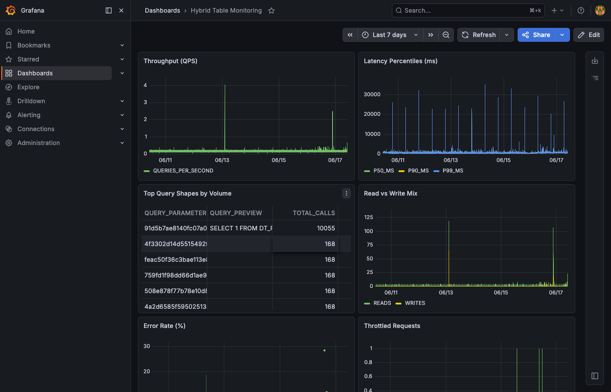
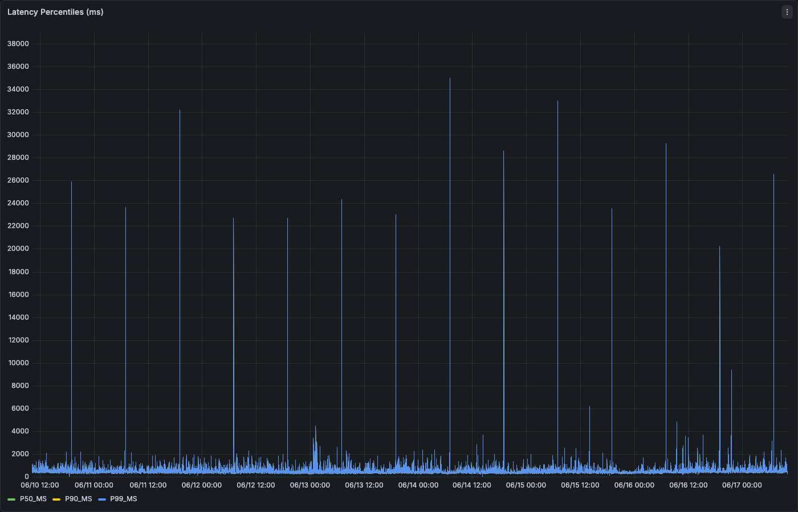
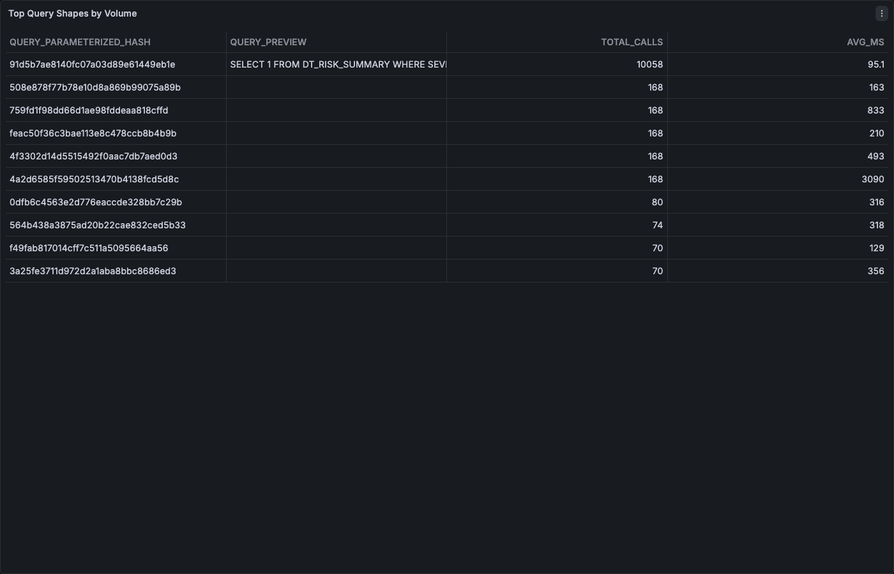
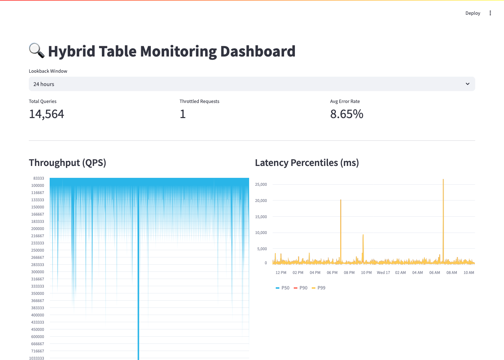
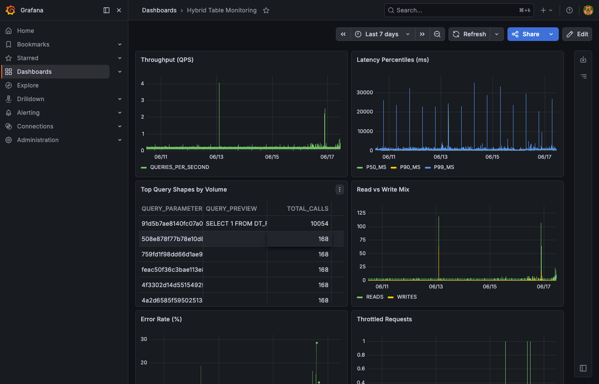
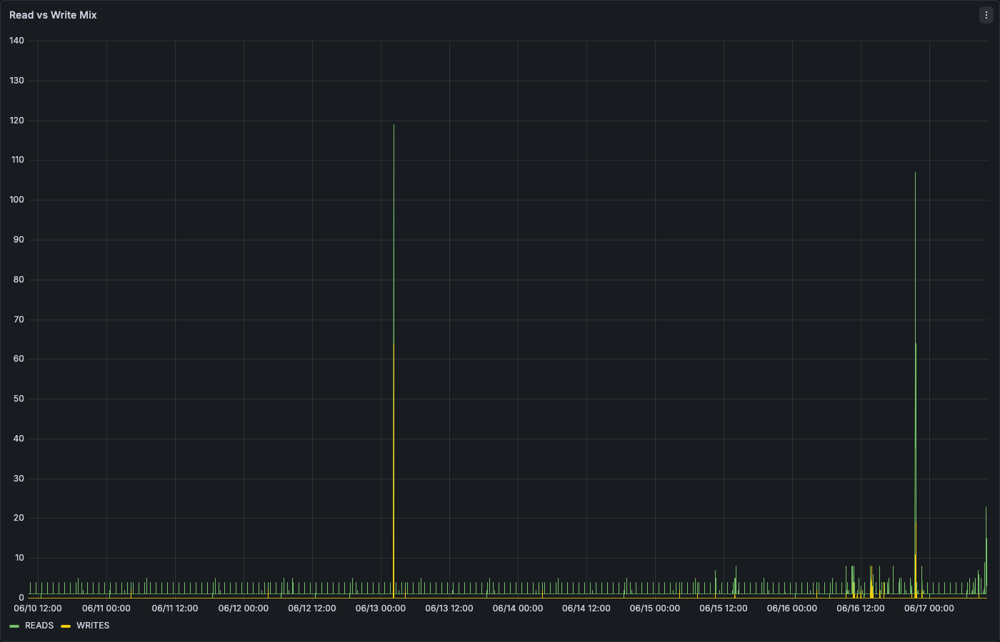

author: Adam Timm
id: hybrid-tables-monitoring-observability
categories: snowflake-site:taxonomy/solution-center/certification/quickstart, snowflake-site:taxonomy/product/data-engineering
language: en
summary: Learn how to monitor Hybrid Table workloads using AGGREGATE_QUERY_HISTORY, track credits and storage, build latency dashboards, set up multi-signal alerts, export metrics to external observability tools, and build custom monitoring apps.
environments: web
status: Published
feedback link: https://github.com/Snowflake-Labs/sfguides/issues

<!--
keywords: hybrid table, monitoring, observability, AGGREGATE_QUERY_HISTORY, latency, p99, throttling, credits, storage, quota, alert, dashboard, Datadog, Grafana, Streamlit, Native App, Unistore, OLTP
related_concepts: AGGREGATE_QUERY_HISTORY, HYBRID_TABLE_USAGE_HISTORY, TABLE_STORAGE_METRICS, query_parameterized_hash, hybrid_table_requests_throttled_count, CREATE ALERT, METERING_HISTORY
prerequisite_guides: getting-started-with-hybrid-tables
skill_level: intermediate
estimated_time_minutes: 45
snowflake_features: hybrid_tables, alerts, aggregate_query_history, account_usage
-->

# Monitoring and Observability for Hybrid Tables
<!-- ------------------------ -->
## Overview

> **Note on Production Workloads:** The monitoring queries in this guide use `SNOWFLAKE.ACCOUNT_USAGE` views which have up to 3 hours of latency. For real-time diagnosis of individual queries, use Query Profile in Snowsight.

Hybrid Table workloads are invisible to traditional Snowflake monitoring. Queries completing in under one second do not appear in `QUERY_HISTORY`, and standard dashboards built on that view will show zero activity even while thousands of operations per second are executing successfully.

This guide builds a complete observability stack for Hybrid Table workloads:

1. Understanding the monitoring gap and where to find HT telemetry
2. Extracting latency percentiles, throughput, and error rates from AGGREGATE_QUERY_HISTORY
3. Building monitoring dashboards for ongoing visibility
4. Tracking credits and storage against quotas
5. Creating multi-signal alerts (throttling, latency regression, error spikes)
6. Building custom monitoring apps (Streamlit, Snowflake Native Apps, OpenTelemetry)
7. Exporting metrics to external tools (Datadog, Grafana, Prometheus)

### What You Will Learn

- Why `QUERY_HISTORY` misses most HT activity and what to use instead
- How to read OBJECT-typed columns (avg, median, p90, p99, max) in AGGREGATE_QUERY_HISTORY
- How to build monitoring dashboards with latency trends and throughput
- How to track HT credit consumption and storage against the 2 TB per-database quota
- How to create alerts for throttling, latency regression, and error spikes
- How to export HT metrics to external observability platforms
- How to build custom monitoring dashboards with Streamlit in Snowflake

### Prerequisites

- A Snowflake paid account in an AWS or Azure commercial region
- Familiarity with [Hybrid Tables](https://docs.snowflake.com/en/user-guide/tables-hybrid) and basic SQL
- ACCOUNTADMIN role (used in this guide for simplicity) or any role with access to `SNOWFLAKE.ACCOUNT_USAGE` views and the ability to create alerts
- An existing Hybrid Table workload with some query activity (or run the setup below to simulate one)

> **Note on Roles:** This quickstart uses ACCOUNTADMIN for simplicity. In production, grant `IMPORTED PRIVILEGES` on the `SNOWFLAKE` database to a custom role and use that instead. Any role with access to `SNOWFLAKE.ACCOUNT_USAGE` views can run the monitoring queries.

<!-- ------------------------ -->
## Setup

```sql
USE ROLE ACCOUNTADMIN;

CREATE OR REPLACE ROLE HT_MON_QS_ROLE;
GRANT ROLE HT_MON_QS_ROLE TO ROLE ACCOUNTADMIN;

CREATE OR REPLACE WAREHOUSE HT_MON_QS_WH
  WAREHOUSE_SIZE = XSMALL
  AUTO_SUSPEND = 300
  AUTO_RESUME = TRUE;
GRANT OWNERSHIP ON WAREHOUSE HT_MON_QS_WH TO ROLE HT_MON_QS_ROLE;

CREATE OR REPLACE DATABASE HT_MON_QS_DB;
GRANT OWNERSHIP ON DATABASE HT_MON_QS_DB TO ROLE HT_MON_QS_ROLE;

USE ROLE HT_MON_QS_ROLE;
CREATE OR REPLACE SCHEMA HT_MON_QS_DB.DATA;
USE WAREHOUSE HT_MON_QS_WH;
USE DATABASE HT_MON_QS_DB;
USE SCHEMA DATA;
```

### Create a Sample Workload Table

```sql
CREATE OR REPLACE HYBRID TABLE session_state (
    session_id   VARCHAR(36)    NOT NULL,
    user_id      NUMBER         NOT NULL,
    device_type  VARCHAR(20)    NOT NULL,
    last_active  TIMESTAMP_NTZ  NOT NULL,
    payload      VARIANT,
    PRIMARY KEY (session_id)
);

CREATE INDEX idx_session_user ON session_state (user_id);
```

### Generate Sample Data

```sql
INSERT INTO session_state
SELECT
    UUID_STRING() AS session_id,
    UNIFORM(1, 10000, RANDOM()) AS user_id,
    ARRAY_CONSTRUCT('mobile','desktop','tablet')[UNIFORM(0,2,RANDOM())]::VARCHAR AS device_type,
    DATEADD(MINUTE, -UNIFORM(1, 1440, RANDOM()), CURRENT_TIMESTAMP())::TIMESTAMP_NTZ AS last_active,
    OBJECT_CONSTRUCT('ip', '10.0.' || UNIFORM(0,255,RANDOM())::VARCHAR || '.' || UNIFORM(0,255,RANDOM())::VARCHAR) AS payload
FROM TABLE(GENERATOR(ROWCOUNT => 50000));
```

### Simulate Workload Activity

Run several queries to generate telemetry in AGGREGATE_QUERY_HISTORY (visible after up to 3 hours):

```sql
SELECT * FROM session_state WHERE session_id = (SELECT session_id FROM session_state LIMIT 1);
SELECT * FROM session_state WHERE user_id = 42;
UPDATE session_state SET last_active = CURRENT_TIMESTAMP()::TIMESTAMP_NTZ WHERE session_id = (SELECT session_id FROM session_state LIMIT 1);
DELETE FROM session_state WHERE last_active < DATEADD(DAY, -1, CURRENT_TIMESTAMP())::TIMESTAMP_NTZ;
```

> **Note:** AGGREGATE_QUERY_HISTORY has up to 3 hours of latency. If you are running this guide for the first time, you may need to wait before the monitoring queries return data. The SQL patterns are valid regardless — apply them to your own existing HT workloads for immediate results.

<!-- ------------------------ -->
## Step 1: The Monitoring Gap

### Why QUERY_HISTORY Misses Hybrid Table Activity

```sql
USE ROLE ACCOUNTADMIN;

SELECT COUNT(*) AS queries_in_history
FROM SNOWFLAKE.ACCOUNT_USAGE.QUERY_HISTORY
WHERE start_time > DATEADD(DAY, -1, CURRENT_TIMESTAMP())
  AND total_elapsed_time < 1000
  AND query_type IN ('SELECT', 'INSERT', 'UPDATE', 'DELETE', 'MERGE');
```

Standard `QUERY_HISTORY` captures individual query executions — but queries completing in under ~1 second are often excluded or sampled. For OLTP workloads executing thousands of sub-second operations per minute, this creates a blind spot.

### Where HT Telemetry Lives

| View | What It Shows | Latency | Granularity |
|------|--------------|---------|-------------|
| `AGGREGATE_QUERY_HISTORY` | All queries (including sub-second), aggregated per minute per query shape | Up to 3 hours | 1-minute windows |
| `HYBRID_TABLE_USAGE_HISTORY` | Credits consumed by HT background operations | Up to 3 hours | Per-table, hourly |
| `TABLE_STORAGE_METRICS` | Storage bytes per table (active, time travel, failsafe) | Up to 3 hours | Per-table |
| `METERING_HISTORY` | Overall warehouse credits (includes HT query compute) | Up to 3 hours | Per-warehouse, hourly |
| Query Profile (Snowsight) | Real-time single-query diagnosis | Immediate | Per-query |

### The Key View: AGGREGATE_QUERY_HISTORY

This view captures **every** query regardless of duration, aggregated into 1-minute intervals grouped by `query_parameterized_hash`. Each row represents all executions of a specific query shape within a 1-minute window.

```sql
SELECT
    interval_start_time,
    query_parameterized_hash,
    query_text,
    calls,
    total_elapsed_time,
    hybrid_table_requests_throttled_count
FROM SNOWFLAKE.ACCOUNT_USAGE.AGGREGATE_QUERY_HISTORY
WHERE interval_start_time > DATEADD(DAY, -1, CURRENT_TIMESTAMP())
ORDER BY interval_start_time DESC
LIMIT 5;
```

<!-- ------------------------ -->
## Step 2: Reading AGGREGATE_QUERY_HISTORY

### Understanding OBJECT-Typed Columns

Most numeric columns in AGGREGATE_QUERY_HISTORY are **OBJECT** typed, containing statistical aggregates:

```json
{
  "avg": 23.5,
  "count": 150,
  "max": 89.0,
  "min": 12.0,
  "median": 21.0,
  "p90": 45.0,
  "p99": 78.0,
  "p99.9": 85.0,
  "sum": 3525.0
}
```

Extract specific percentiles using the `:` operator:

```sql
SELECT
    interval_start_time,
    query_parameterized_hash,
    ANY_VALUE(query_text) AS sample_query,
    SUM(calls) AS total_calls,
    AVG(total_elapsed_time:"avg"::FLOAT) AS avg_latency_ms,
    MAX(total_elapsed_time:"median"::FLOAT) AS p50_latency_ms,
    MAX(total_elapsed_time:"p90"::FLOAT) AS p90_latency_ms,
    MAX(total_elapsed_time:"p99"::FLOAT) AS p99_latency_ms,
    MAX(total_elapsed_time:"max"::FLOAT) AS max_latency_ms
FROM SNOWFLAKE.ACCOUNT_USAGE.AGGREGATE_QUERY_HISTORY
WHERE interval_start_time > DATEADD(HOUR, -6, CURRENT_TIMESTAMP())
GROUP BY interval_start_time, query_parameterized_hash
ORDER BY total_calls DESC
LIMIT 20;
```

### Compilation vs Execution Time Split

For HT workloads, high compilation time relative to execution time indicates plan cache misses:

```sql
SELECT
    query_parameterized_hash,
    ANY_VALUE(query_text) AS sample_query,
    SUM(calls) AS total_calls,
    AVG(compilation_time:"avg"::FLOAT) AS avg_compile_ms,
    AVG(execution_time:"avg"::FLOAT) AS avg_exec_ms,
    ROUND(AVG(compilation_time:"avg"::FLOAT) /
      NULLIF(AVG(total_elapsed_time:"avg"::FLOAT), 0) * 100, 1) AS compile_pct
FROM SNOWFLAKE.ACCOUNT_USAGE.AGGREGATE_QUERY_HISTORY
WHERE interval_start_time > DATEADD(DAY, -1, CURRENT_TIMESTAMP())
  AND calls > 10
GROUP BY query_parameterized_hash
HAVING AVG(compilation_time:"avg"::FLOAT) > 50
ORDER BY compile_pct DESC
LIMIT 10;
```

> **Interpretation:** If `compile_pct` is above 50%, the query is spending more time compiling than executing. This usually means plan cache is not being utilized — check that you are using bound variables and consistent schema qualification. See [Write Optimization](https://www.snowflake.com/en/developers/guides/hybrid-tables-write-optimization/) for details.

### Error Analysis

The `ERRORS` column is an ARRAY of error objects. Query shapes with recurring errors:

```sql
SELECT
    query_parameterized_hash,
    ANY_VALUE(query_text) AS sample_query,
    SUM(calls) AS total_calls,
    SUM(ARRAY_SIZE(errors)) AS total_errors,
    ROUND(SUM(ARRAY_SIZE(errors)) / NULLIF(SUM(calls), 0) * 100, 2) AS error_rate_pct
FROM SNOWFLAKE.ACCOUNT_USAGE.AGGREGATE_QUERY_HISTORY
WHERE interval_start_time > DATEADD(DAY, -1, CURRENT_TIMESTAMP())
  AND ARRAY_SIZE(errors) > 0
GROUP BY query_parameterized_hash
ORDER BY total_errors DESC
LIMIT 10;
```

### Throttling Detection

When HT request throughput exceeds the database-level quota (~16K ops/sec), requests are throttled:

```sql
SELECT
    interval_start_time,
    SUM(calls) AS total_calls,
    SUM(hybrid_table_requests_throttled_count) AS throttled_count,
    ROUND(SUM(hybrid_table_requests_throttled_count) / NULLIF(SUM(calls), 0) * 100, 2) AS throttle_pct
FROM SNOWFLAKE.ACCOUNT_USAGE.AGGREGATE_QUERY_HISTORY
WHERE interval_start_time > DATEADD(HOUR, -24, CURRENT_TIMESTAMP())
GROUP BY interval_start_time
HAVING throttled_count > 0
ORDER BY interval_start_time DESC;
```

<!-- ------------------------ -->
## Step 3: Monitoring Dashboard Queries

These queries can be used in any visualization tool: Streamlit in Snowflake (see Step 6), Grafana (see Step 7), or any BI tool connected to your account.

### Tile 1: Throughput Over Time (QPS)

```sql
SELECT
    interval_start_time AS ts,
    SUM(calls) / 60.0 AS queries_per_second
FROM SNOWFLAKE.ACCOUNT_USAGE.AGGREGATE_QUERY_HISTORY
WHERE interval_start_time > DATEADD(HOUR, -24, CURRENT_TIMESTAMP())
  AND database_name = 'HT_MON_QS_DB'
GROUP BY interval_start_time
ORDER BY ts;
```

### Tile 2: Latency Percentiles Over Time

```sql
SELECT
    interval_start_time AS ts,
    AVG(total_elapsed_time:"median"::FLOAT) AS p50_ms,
    AVG(total_elapsed_time:"p90"::FLOAT) AS p90_ms,
    AVG(total_elapsed_time:"p99"::FLOAT) AS p99_ms
FROM SNOWFLAKE.ACCOUNT_USAGE.AGGREGATE_QUERY_HISTORY
WHERE interval_start_time > DATEADD(HOUR, -24, CURRENT_TIMESTAMP())
  AND database_name = 'HT_MON_QS_DB'
  AND query_type IN ('SELECT', 'INSERT', 'UPDATE', 'DELETE', 'MERGE')
GROUP BY interval_start_time
ORDER BY ts;
```

### Tile 3: Top 10 Query Shapes by Volume

```sql
SELECT
    query_parameterized_hash,
    ANY_VALUE(LEFT(query_text, 80)) AS query_preview,
    SUM(calls) AS total_calls,
    AVG(total_elapsed_time:"avg"::FLOAT) AS avg_ms,
    MAX(total_elapsed_time:"p99"::FLOAT) AS p99_ms
FROM SNOWFLAKE.ACCOUNT_USAGE.AGGREGATE_QUERY_HISTORY
WHERE interval_start_time > DATEADD(DAY, -1, CURRENT_TIMESTAMP())
  AND database_name = 'HT_MON_QS_DB'
GROUP BY query_parameterized_hash
ORDER BY total_calls DESC
LIMIT 10;
```

### Tile 4: Read vs Write Mix

```sql
SELECT
    interval_start_time AS ts,
    SUM(CASE WHEN query_type = 'SELECT' THEN calls ELSE 0 END) AS reads,
    SUM(CASE WHEN query_type IN ('INSERT','UPDATE','DELETE','MERGE') THEN calls ELSE 0 END) AS writes
FROM SNOWFLAKE.ACCOUNT_USAGE.AGGREGATE_QUERY_HISTORY
WHERE interval_start_time > DATEADD(HOUR, -24, CURRENT_TIMESTAMP())
  AND database_name = 'HT_MON_QS_DB'
GROUP BY interval_start_time
ORDER BY ts;
```

### Tile 5: Error Rate Over Time

```sql
SELECT
    interval_start_time AS ts,
    SUM(calls) AS total_calls,
    SUM(ARRAY_SIZE(errors)) AS total_errors,
    ROUND(SUM(ARRAY_SIZE(errors)) / NULLIF(SUM(calls), 0) * 100, 2) AS error_rate_pct
FROM SNOWFLAKE.ACCOUNT_USAGE.AGGREGATE_QUERY_HISTORY
WHERE interval_start_time > DATEADD(HOUR, -24, CURRENT_TIMESTAMP())
  AND database_name = 'HT_MON_QS_DB'
GROUP BY interval_start_time
ORDER BY ts;
```

### Tile 6: Throttle Events

```sql
SELECT
    interval_start_time AS ts,
    SUM(hybrid_table_requests_throttled_count) AS throttled_requests
FROM SNOWFLAKE.ACCOUNT_USAGE.AGGREGATE_QUERY_HISTORY
WHERE interval_start_time > DATEADD(HOUR, -24, CURRENT_TIMESTAMP())
  AND database_name = 'HT_MON_QS_DB'
  AND hybrid_table_requests_throttled_count > 0
GROUP BY interval_start_time
ORDER BY ts;
```

Here is an example of these queries visualized in Grafana (connected to `AGGREGATE_QUERY_HISTORY`):



The latency percentiles panel shows p99 spikes that may indicate cold cache hits or lock contention:



The top query shapes table identifies which parameterized queries dominate your workload:



<!-- ------------------------ -->
## Step 4: Credit and Storage Monitoring

### HT Background Credits (HYBRID_TABLE_USAGE_HISTORY)

Hybrid Tables consume credits for background operations (compaction, index maintenance) separate from query execution credits:

```sql
SELECT
    object_name AS table_name,
    DATE_TRUNC('DAY', start_time) AS day,
    SUM(credits_used) AS daily_credits
FROM SNOWFLAKE.ACCOUNT_USAGE.HYBRID_TABLE_USAGE_HISTORY
WHERE start_time > DATEADD(DAY, -30, CURRENT_TIMESTAMP())
GROUP BY object_name, DATE_TRUNC('DAY', start_time)
ORDER BY day DESC, daily_credits DESC;
```

### Storage Per Table (TABLE_STORAGE_METRICS)

Track storage growth to stay within the 2 TB per-database quota:

```sql
SELECT
    table_catalog AS database_name,
    table_schema,
    table_name,
    ROUND(active_bytes / POWER(1024, 3), 3) AS active_gb,
    ROUND(time_travel_bytes / POWER(1024, 3), 3) AS time_travel_gb,
    ROUND(failsafe_bytes / POWER(1024, 3), 3) AS failsafe_gb,
    ROUND((active_bytes + time_travel_bytes + failsafe_bytes) / POWER(1024, 3), 3) AS total_gb
FROM SNOWFLAKE.ACCOUNT_USAGE.TABLE_STORAGE_METRICS
WHERE table_catalog = 'HT_MON_QS_DB'
  AND deleted IS NULL
ORDER BY active_bytes DESC;
```

### Database-Level Quota Tracking

```sql
SELECT
    table_catalog AS database_name,
    ROUND(SUM(active_bytes) / POWER(1024, 4), 4) AS active_tb,
    ROUND(2.0 - SUM(active_bytes) / POWER(1024, 4), 4) AS remaining_tb,
    ROUND(SUM(active_bytes) / POWER(1024, 4) / 2.0 * 100, 1) AS quota_used_pct
FROM SNOWFLAKE.ACCOUNT_USAGE.TABLE_STORAGE_METRICS
WHERE table_catalog = 'HT_MON_QS_DB'
  AND deleted IS NULL
GROUP BY table_catalog;
```

> **Quota Reference:** Each database has a 2 TB limit for Hybrid Table storage. If `quota_used_pct` exceeds 80%, plan for data tiering or archival. See [Operations Patterns](https://www.snowflake.com/en/developers/guides/hybrid-tables-operations-patterns/) for hot/cold tiering strategies.

### Warehouse Credit Consumption (Query Compute)

```sql
SELECT
    warehouse_name,
    DATE_TRUNC('DAY', start_time) AS day,
    SUM(credits_used) AS query_credits
FROM SNOWFLAKE.ACCOUNT_USAGE.WAREHOUSE_METERING_HISTORY
WHERE start_time > DATEADD(DAY, -30, CURRENT_TIMESTAMP())
  AND warehouse_name ILIKE '%HT%'
GROUP BY warehouse_name, DATE_TRUNC('DAY', start_time)
ORDER BY day DESC;
```

<!-- ------------------------ -->
## Step 5: Alerting Framework

### Alert Infrastructure

```sql
USE ROLE HT_MON_QS_ROLE;

CREATE OR REPLACE TABLE HT_MON_QS_DB.DATA.alert_log (
    alert_ts    TIMESTAMP_NTZ DEFAULT CURRENT_TIMESTAMP(),
    alert_type  VARCHAR(50),
    severity    VARCHAR(20),
    message     VARCHAR(2000),
    metric_value FLOAT
);
```

### Alert 1: Throttling Spike

Fires when more than 100 requests are throttled in a 10-minute window:

```sql
USE ROLE ACCOUNTADMIN;

CREATE OR REPLACE ALERT ht_throttle_alert
  WAREHOUSE = HT_MON_QS_WH
  SCHEDULE = '5 MINUTE'
  IF( EXISTS(
    SELECT 1
    FROM SNOWFLAKE.ACCOUNT_USAGE.AGGREGATE_QUERY_HISTORY
    WHERE hybrid_table_requests_throttled_count > 100
      AND interval_start_time > DATEADD(MINUTE, -10, CURRENT_TIMESTAMP())
  ))
  THEN
    INSERT INTO HT_MON_QS_DB.DATA.alert_log (alert_type, severity, message, metric_value)
    SELECT 'THROTTLE', 'HIGH',
      'Throttling detected: ' || SUM(hybrid_table_requests_throttled_count)::VARCHAR || ' throttled requests in last 10 min',
      SUM(hybrid_table_requests_throttled_count)
    FROM SNOWFLAKE.ACCOUNT_USAGE.AGGREGATE_QUERY_HISTORY
    WHERE hybrid_table_requests_throttled_count > 0
      AND interval_start_time > DATEADD(MINUTE, -10, CURRENT_TIMESTAMP());

ALTER ALERT ht_throttle_alert RESUME;
```

### Alert 2: Latency Regression

Fires when p99 latency exceeds 500ms (adjust threshold for your SLA):

```sql
CREATE OR REPLACE ALERT ht_latency_alert
  WAREHOUSE = HT_MON_QS_WH
  SCHEDULE = '5 MINUTE'
  IF( EXISTS(
    SELECT 1
    FROM SNOWFLAKE.ACCOUNT_USAGE.AGGREGATE_QUERY_HISTORY
    WHERE total_elapsed_time:"p99"::FLOAT > 500
      AND calls > 5
      AND interval_start_time > DATEADD(MINUTE, -10, CURRENT_TIMESTAMP())
      AND database_name = 'HT_MON_QS_DB'
      AND query_type IN ('SELECT', 'INSERT', 'UPDATE', 'DELETE')
  ))
  THEN
    INSERT INTO HT_MON_QS_DB.DATA.alert_log (alert_type, severity, message, metric_value)
    SELECT 'LATENCY_REGRESSION', 'MEDIUM',
      'p99 latency exceeded 500ms for hash ' || query_parameterized_hash || ': ' || ROUND(total_elapsed_time:"p99"::FLOAT, 1)::VARCHAR || 'ms',
      total_elapsed_time:"p99"::FLOAT
    FROM SNOWFLAKE.ACCOUNT_USAGE.AGGREGATE_QUERY_HISTORY
    WHERE total_elapsed_time:"p99"::FLOAT > 500
      AND calls > 5
      AND interval_start_time > DATEADD(MINUTE, -10, CURRENT_TIMESTAMP())
      AND database_name = 'HT_MON_QS_DB'
    ORDER BY total_elapsed_time:"p99"::FLOAT DESC
    LIMIT 1;

ALTER ALERT ht_latency_alert RESUME;
```

### Alert 3: Error Spike

Fires when error rate exceeds 5% of total calls:

```sql
CREATE OR REPLACE ALERT ht_error_alert
  WAREHOUSE = HT_MON_QS_WH
  SCHEDULE = '5 MINUTE'
  IF( EXISTS(
    SELECT 1
    FROM (
      SELECT
        SUM(calls) AS total_calls,
        SUM(ARRAY_SIZE(errors)) AS total_errors
      FROM SNOWFLAKE.ACCOUNT_USAGE.AGGREGATE_QUERY_HISTORY
      WHERE interval_start_time > DATEADD(MINUTE, -10, CURRENT_TIMESTAMP())
        AND database_name = 'HT_MON_QS_DB'
    )
    WHERE total_errors > 0
      AND total_errors::FLOAT / NULLIF(total_calls, 0) > 0.05
  ))
  THEN
    INSERT INTO HT_MON_QS_DB.DATA.alert_log (alert_type, severity, message, metric_value)
    SELECT 'ERROR_SPIKE', 'HIGH',
      'Error rate exceeded 5%: ' || SUM(ARRAY_SIZE(errors))::VARCHAR || ' errors out of ' || SUM(calls)::VARCHAR || ' calls',
      ROUND(SUM(ARRAY_SIZE(errors))::FLOAT / NULLIF(SUM(calls), 0) * 100, 2)
    FROM SNOWFLAKE.ACCOUNT_USAGE.AGGREGATE_QUERY_HISTORY
    WHERE interval_start_time > DATEADD(MINUTE, -10, CURRENT_TIMESTAMP())
      AND database_name = 'HT_MON_QS_DB';

ALTER ALERT ht_error_alert RESUME;
```

### Alert 4: Storage Quota Warning

Fires when database storage exceeds 80% of the 2 TB quota:

```sql
CREATE OR REPLACE ALERT ht_storage_alert
  WAREHOUSE = HT_MON_QS_WH
  SCHEDULE = 'USING CRON 0 */6 * * * UTC'
  IF( EXISTS(
    SELECT 1
    FROM (
      SELECT SUM(active_bytes) / POWER(1024, 4) AS active_tb
      FROM SNOWFLAKE.ACCOUNT_USAGE.TABLE_STORAGE_METRICS
      WHERE table_catalog = 'HT_MON_QS_DB'
        AND deleted IS NULL
    )
    WHERE active_tb > 1.6
  ))
  THEN
    INSERT INTO HT_MON_QS_DB.DATA.alert_log (alert_type, severity, message, metric_value)
    SELECT 'STORAGE_QUOTA', 'HIGH',
      'HT database storage at ' || ROUND(SUM(active_bytes) / POWER(1024, 4) * 100 / 2.0, 1)::VARCHAR || '% of 2TB quota',
      SUM(active_bytes) / POWER(1024, 4)
    FROM SNOWFLAKE.ACCOUNT_USAGE.TABLE_STORAGE_METRICS
    WHERE table_catalog = 'HT_MON_QS_DB'
      AND deleted IS NULL;

ALTER ALERT ht_storage_alert RESUME;
```

### Review Alerts

```sql
SHOW ALERTS;
SELECT * FROM HT_MON_QS_DB.DATA.alert_log ORDER BY alert_ts DESC LIMIT 20;
```

<!-- ------------------------ -->
## Step 6: Custom Dashboards and Observability Apps
Duration: 10

Build custom monitoring experiences using Snowflake-native application frameworks — no external infrastructure required.

### Option A: Streamlit in Snowflake

Build an interactive monitoring dashboard that runs entirely within your Snowflake account.



```python
import streamlit as st
from snowflake.snowpark.context import get_active_session

session = get_active_session()

st.set_page_config(page_title="Hybrid Table Monitor", layout="wide")
st.title("🔍 Hybrid Table Monitoring Dashboard")

lookback = st.selectbox("Lookback Window", ["6 hours", "24 hours", "7 days"], index=1)
hours_map = {"6 hours": 6, "24 hours": 24, "7 days": 168}
hours = hours_map[lookback]

qps_df = session.sql(f"""
    SELECT interval_start_time AS ts,
           SUM(calls) / 60.0 AS qps
    FROM SNOWFLAKE.ACCOUNT_USAGE.AGGREGATE_QUERY_HISTORY
    WHERE interval_start_time > DATEADD(HOUR, -{hours}, CURRENT_TIMESTAMP())
    GROUP BY interval_start_time ORDER BY ts
""").to_pandas()

latency_df = session.sql(f"""
    SELECT interval_start_time AS ts,
           AVG(total_elapsed_time:"median"::FLOAT) AS p50_ms,
           AVG(total_elapsed_time:"p90"::FLOAT) AS p90_ms,
           AVG(total_elapsed_time:"p99"::FLOAT) AS p99_ms
    FROM SNOWFLAKE.ACCOUNT_USAGE.AGGREGATE_QUERY_HISTORY
    WHERE interval_start_time > DATEADD(HOUR, -{hours}, CURRENT_TIMESTAMP())
      AND calls > 0
    GROUP BY interval_start_time ORDER BY ts
""").to_pandas()

throttle_df = session.sql(f"""
    SELECT SUM(hybrid_table_requests_throttled_count) AS throttled
    FROM SNOWFLAKE.ACCOUNT_USAGE.AGGREGATE_QUERY_HISTORY
    WHERE interval_start_time > DATEADD(HOUR, -{hours}, CURRENT_TIMESTAMP())
""").to_pandas()

m1, m2, m3 = st.columns(3)
with m1:
    total = int(qps_df["QPS"].sum() * 60) if not qps_df.empty else 0
    st.metric("Total Queries", f"{total:,}")
with m2:
    throttled = int(throttle_df["THROTTLED"].iloc[0] or 0)
    st.metric("Throttled Requests", f"{throttled:,}")
with m3:
    st.metric("Avg Error Rate", "—")

col1, col2 = st.columns(2)
with col1:
    st.subheader("Throughput (QPS)")
    st.area_chart(qps_df.set_index("TS")["QPS"])
with col2:
    st.subheader("Latency Percentiles (ms)")
    st.line_chart(latency_df.set_index("TS")[["P50_MS", "P90_MS", "P99_MS"]])
```

Deploy this as a Streamlit in Snowflake app for a zero-infrastructure monitoring solution that your team can access from the Snowsight UI.

> **Note on OBJECT accessor syntax:** When accessing keys inside OBJECT columns like `total_elapsed_time`, use double-quote notation (`total_elapsed_time:"median"::FLOAT`) or bracket notation (`total_elapsed_time['median']::FLOAT`). Single-quote notation may fail in some connectors.

### Option B: Snowflake Apps (Snowflake Native App Framework)

For a packaged, shareable monitoring experience, build a [Snowflake Native App](https://docs.snowflake.com/en/developer-guide/native-apps/native-apps-about) that:

- Bundles the dashboard SQL, alerts, and tasks into a single installable package
- Can be shared across accounts (e.g., from a central platform team to application teams)
- Includes Streamlit pages for visualization and a setup wizard for configuring database filters

This approach works well when you want to standardize HT monitoring across multiple teams or accounts.

### Option C: OpenTelemetry Export

For teams already invested in OpenTelemetry, export HT metrics as OTLP data:

1. **Snowflake Task** exports metrics to a stage on a schedule (e.g., every 5 minutes)
2. **OpenTelemetry Collector** with the `filereceiver` reads staged JSON files
3. **Your OTLP backend** (Jaeger, Honeycomb, Grafana Tempo) receives the traces/metrics

This integrates HT monitoring into your existing distributed tracing infrastructure alongside application-level spans.

### Choosing the Right Approach

| Approach | Best For | Pros | Cons |
|----------|----------|------|------|
| **Snowflake Worksheets** | Quick ad-hoc queries | Zero config, native | No persistent dashboards |
| **Streamlit in Snowflake** | Custom team dashboards | Rich interactivity, runs in SF | Requires SiS entitlement |
| **Snowflake Native App** | Multi-account standardization | Shareable, versioned | More setup complexity |
| **Grafana/Datadog** | Unified observability stack | Correlate with app metrics | External dependency |
| **OTLP Export** | Distributed tracing teams | Fits existing pipelines | Custom integration work |

<!-- ------------------------ -->
## Step 7: External Observability Integration

For teams using Datadog, Grafana, or Prometheus, export HT metrics from Snowflake on a schedule.

### Datadog Integration

With the [Snowflake Datadog integration](https://docs.datadoghq.com/integrations/snowflake/), you can query `AGGREGATE_QUERY_HISTORY` directly. Configure a custom query in the integration YAML:

```yaml
# Example Datadog custom query (datadog-agent snowflake.d/conf.yaml)
custom_queries:
  - query: >
      SELECT
        SUM(calls) / 60.0 AS qps,
        AVG(total_elapsed_time:"p99"::FLOAT) AS p99_ms,
        SUM(hybrid_table_requests_throttled_count) AS throttled
      FROM SNOWFLAKE.ACCOUNT_USAGE.AGGREGATE_QUERY_HISTORY
      WHERE interval_start_time > DATEADD(MINUTE, -5, CURRENT_TIMESTAMP())
        AND database_name = 'YOUR_HT_DATABASE'
    columns:
      - name: snowflake.hybrid_table.qps
        type: gauge
      - name: snowflake.hybrid_table.p99_ms
        type: gauge
      - name: snowflake.hybrid_table.throttled
        type: count
    tags:
      - service:hybrid-tables
```

### Grafana Integration

Use the [Michelin Snowflake Grafana data source plugin](https://github.com/michelin/snowflake-grafana-datasource) (open-source, community-supported) to query `AGGREGATE_QUERY_HISTORY` directly. Configure the data source with your account identifier, warehouse, and credentials, then build panels using the same SQL from Step 3.

> **Note:** The official Grafana Snowflake plugin requires a Grafana Enterprise license. The Michelin community plugin is free and supports password, key-pair, and OAuth authentication.





<!-- ------------------------ -->
## Monitoring Playbook

When alerts fire, use this decision tree:

| Alert | First Response | Root Cause Investigation |
|-------|---------------|------------------------|
| **THROTTLE** | Check if workload has spiked vs normal | Review `calls` by `query_parameterized_hash` — one runaway loop? Distribute across databases if sustained. |
| **LATENCY_REGRESSION** | Check compilation_time vs execution_time | High compile_time → plan cache miss (bound variables, schema qualification). High exec_time → check Query Profile for full table scans or lock contention. |
| **ERROR_SPIKE** | Inspect error array contents | Common: PK violations (duplicate inserts), lock timeouts (contention), quota exceeded. |
| **STORAGE_QUOTA** | Check per-table storage | Archive cold data to standard table (see [Operations Patterns](https://www.snowflake.com/en/developers/guides/hybrid-tables-operations-patterns/)). |

### Useful Diagnostic Queries

**Find the noisiest query shape:**

```sql
SELECT
    query_parameterized_hash,
    ANY_VALUE(query_text) AS query_sample,
    SUM(calls) AS total_calls,
    AVG(total_elapsed_time:"avg"::FLOAT) AS avg_ms
FROM SNOWFLAKE.ACCOUNT_USAGE.AGGREGATE_QUERY_HISTORY
WHERE interval_start_time > DATEADD(HOUR, -1, CURRENT_TIMESTAMP())
GROUP BY query_parameterized_hash
ORDER BY total_calls DESC
LIMIT 5;
```

**Find queries with high tail latency (p99/median ratio > 5x):**

```sql
SELECT
    query_parameterized_hash,
    ANY_VALUE(LEFT(query_text, 100)) AS query_sample,
    SUM(calls) AS total_calls,
    AVG(total_elapsed_time:"median"::FLOAT) AS p50_ms,
    AVG(total_elapsed_time:"p99"::FLOAT) AS p99_ms,
    ROUND(AVG(total_elapsed_time:"p99"::FLOAT) / NULLIF(AVG(total_elapsed_time:"median"::FLOAT), 0), 1) AS tail_ratio
FROM SNOWFLAKE.ACCOUNT_USAGE.AGGREGATE_QUERY_HISTORY
WHERE interval_start_time > DATEADD(HOUR, -6, CURRENT_TIMESTAMP())
  AND calls > 10
GROUP BY query_parameterized_hash
HAVING tail_ratio > 5
ORDER BY tail_ratio DESC
LIMIT 10;
```

> **High tail ratio** means inconsistent performance. Common causes: some lookups hit compacted data (fast) while others hit recently written data (slower), or intermittent lock contention from concurrent writes.

<!-- ------------------------ -->
## Get Started Faster with Cortex Code
Duration: 1

Use these prompts in [Cortex Code](https://docs.snowflake.com/en/user-guide/cortex-code/cortex-code) to apply this guide to your own workload:

> "Run an AGGREGATE_QUERY_HISTORY analysis for my Hybrid Table workload over the past 7 days. Identify my top 3 performance issues and provide specific remediation steps."

> "I have a Hybrid Table called [TABLE_NAME]. Adapt the 6 monitoring dashboard queries from the HT Monitoring quickstart to my schema and return ready-to-run SQL."

> "My Hybrid Table queries have high compilation time. Diagnose the root cause and rewrite the top offending queries to use bound variables."

<!-- ------------------------ -->
## Cleanup

```sql
USE ROLE ACCOUNTADMIN;
ALTER ALERT IF EXISTS ht_throttle_alert SUSPEND;
ALTER ALERT IF EXISTS ht_latency_alert SUSPEND;
ALTER ALERT IF EXISTS ht_error_alert SUSPEND;
ALTER ALERT IF EXISTS ht_storage_alert SUSPEND;
DROP ALERT IF EXISTS ht_throttle_alert;
DROP ALERT IF EXISTS ht_latency_alert;
DROP ALERT IF EXISTS ht_error_alert;
DROP ALERT IF EXISTS ht_storage_alert;
DROP DATABASE IF EXISTS HT_MON_QS_DB;
DROP WAREHOUSE IF EXISTS HT_MON_QS_WH;
DROP ROLE IF EXISTS HT_MON_QS_ROLE;
```

<!-- ------------------------ -->
## Conclusion and Resources

You can now:

- Find HT telemetry in AGGREGATE_QUERY_HISTORY (not QUERY_HISTORY)
- Extract latency percentiles (median, p90, p99) from OBJECT-typed columns
- Build dashboards with throughput, latency, read/write mix, and error rate tiles
- Track HT credit consumption and storage against the 2 TB quota
- Create multi-signal alerts (throttle, latency, errors, storage)
- Export metrics to external observability platforms (Datadog, Grafana)
- Build custom monitoring apps with Streamlit in Snowflake or Snowflake Native Apps

> **Need help with your Hybrid Table architecture?** Book a 30-minute session with our specialist team to discuss your use case, review your schema design, or troubleshoot performance: [Schedule a session](https://calendar.app.google/cGfVnKFe7xbeDqDo8)

### Related Resources

- [Hybrid Tables Best Practices](https://docs.snowflake.com/en/user-guide/tables-hybrid-best-practices)
- [AGGREGATE_QUERY_HISTORY Documentation](https://docs.snowflake.com/en/sql-reference/account-usage/aggregate_query_history)
- [Optimizing Writes to Hybrid Tables](https://www.snowflake.com/en/developers/guides/hybrid-tables-write-optimization/)
- [Operations Patterns for Hybrid Tables](https://www.snowflake.com/en/developers/guides/hybrid-tables-operations-patterns/)
- [Secondary Index Design for Hybrid Tables](https://www.snowflake.com/en/developers/guides/hybrid-tables-secondary-index-design/)
- [Snowflake Alerts Documentation](https://docs.snowflake.com/en/user-guide/alerts)
- [Streamlit in Snowflake](https://docs.snowflake.com/en/developer-guide/streamlit/about-streamlit)
- [Snowflake Native App Framework](https://docs.snowflake.com/en/developer-guide/native-apps/native-apps-about)
- [Michelin Snowflake Grafana Plugin](https://github.com/michelin/snowflake-grafana-datasource)
