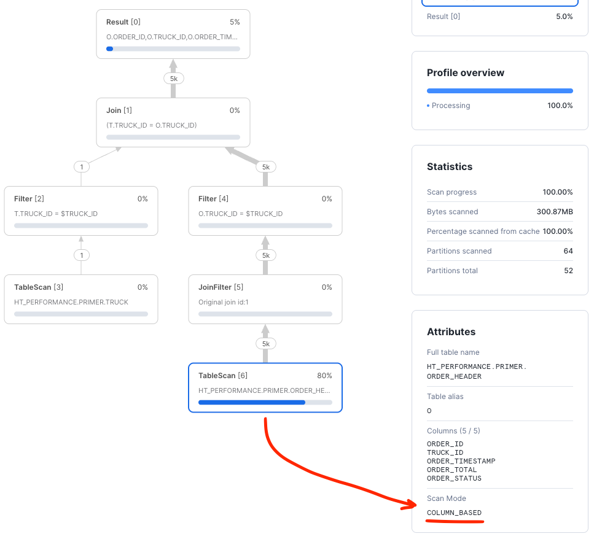
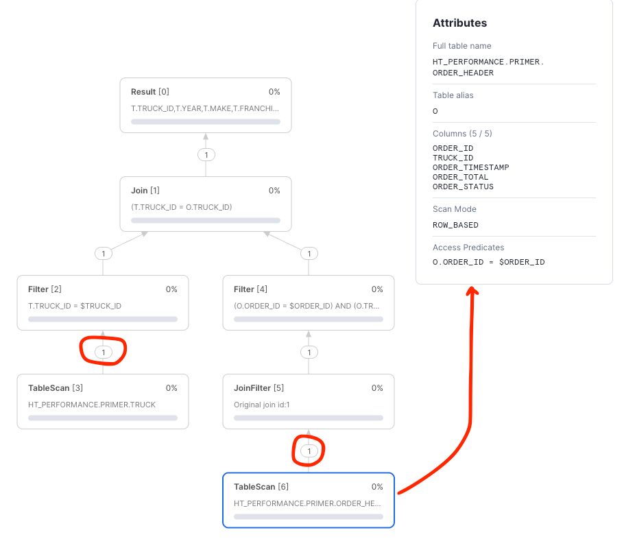
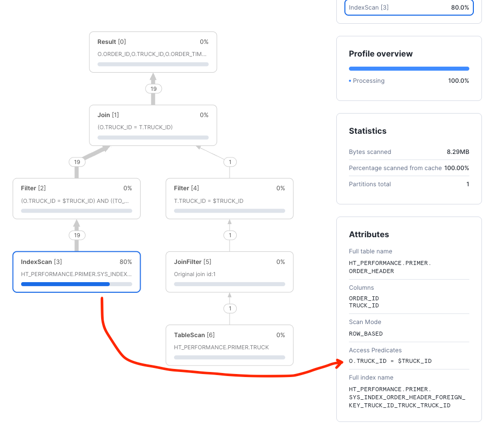

author: Jon Osborn
id: hybrid_tables_performance_optimization_primer
summary: Follow this primer to learn about basic hybrid table performance optimization techniques
categories: Getting-Started, Hybrid Tables, Unistore
environments: web
status: Published 
feedback link: https://github.com/Snowflake-Labs/sfguides/issues
tags: Getting Started, Data Engineering, Hybrid Tables, Unistore

# Hybrid Tables Performance Optimization Primer
<!-- ------------------------ -->
## Overview 
Duration: 5

### Hybrid Tables

A [hybrid table](https://docs.snowflake.com/en/user-guide/tables-hybrid) is a Snowflake table type that is optimized for hybrid transactional and operational workloads that require low latency and high throughput on small random point reads and writes. A hybrid table supports unique and referential integrity constraint enforcement that is critical for transactional workloads. You can use a hybrid table along with other Snowflake tables and features to power [Unistore workloads](https://www.snowflake.com/en/data-cloud/workloads/unistore/) that bring transactional and analytical data together in a single platform.

Use cases that may benefit from hybrid tables include:

- Applications requiring INSERT/UPDATE/DELETE concurrency matched with SELECT performance
- Usage requiring low-latency, high concurrency INSERT/UPDATE like log tables, metadata tracking, or status information
- Low latency responses for highly selective record retrieval over very large data sets

### Architecture

Hybrid tables are integrated seamlessly into the existing Snowflake architecture. Customers connect to the same Snowflake database service. Queries are compiled and optimized in the cloud services layer and executed in the same query engine in virtual warehouses. This provides several key benefits:

- Snowflake platform features, such as data governance, work with hybrid tables out of the box.
- You can run hybrid workloads mixing operational and analytical queries.
- You can join hybrid tables with other Snowflake tables and the query executes natively and efficiently in the same query engine. No federation is required.
- You can execute an atomic transaction across hybrid tables and other Snowflake tables. There is no need to orchestrate your own two-phase commit.


Hybrid tables leverage a row store as the primary data store to provide excellent operational query performance. When you write to a hybrid table, the data is written directly into the rowstore. Data is asynchronously copied into object storage in order to provide better performance and workload isolation for large scans without impacting your ongoing operational workloads. Some data may also be cached in columnar format on your warehouse in order to provide better performance on analytical queries. You simply execute SQL statements against the logical hybrid table and Snowflake’s query optimizer decides where to read data from in order to provide the best performance. You get one consistent view of your data without needing to worry about the underlying infrastructure.


### What You Will Learn 

- How to design hybrid tables and access patterns that achieve high performance
- How to analyze queries using Snowsight
- How to adjust queries to improve performance
- How hybrid table unique characteristics like Indexes, primary keys, unique and foreign keys affect performance

### Prerequisites

- Familiarity with the Snowflake's Snowsight interface
- Familiarity with SQL
- Snowflake non-trial account with Hybrid Tables enabled
- A database and/or schema within which you have permissions to create tables


### Process
- We will be creating three tables that represent a data model. Following the trucking example from the [Getting Started with Hybrid Tables](https://quickstarts.snowflake.com/guide/getting_started_with_hybrid_tables/index.html#0) quickstart, we will use TRUCK and ORDER_HEADER tables to represent our data.
- Create and work with TRUCK table to understand primary keys, secondary indexes, and accompanying query patterns
- Build on TRUCK with ORDER_HEADER to work with foreign key relationships
- Add a secondary index to find orders for trucks based on order date

## Setup

Duration: 5

We will use table structures populated with synthetic data to create scenarios We will initially
create scenarios that do not perform well. Following the guide, you will then adjust the query and/or the 
table structure to create an optimal query.

>aside positive
> **NOTE:** Queries executed from Snowsight support an interactive development experience with rich statistics and metadata, 
> such as runtime statistics about all query operators in the query profile. Queries executed in Snowsight 
> will not perform with the lowest possible latency. Lowest latency is 
> achieved via queries issued from a _code-based driver connection_ to Snowflake. Please review our [best practices](https://docs.snowflake.com/en/user-guide/tables-hybrid-best-practices)
> and [performance testing](https://docs.snowflake.com/en/user-guide/tables-hybrid-test) guides for more information.
>


### Creating an Environment

Create a worksheet and establish a database and schema to do the work. We are doing exploration work here
so make sure you are using a role that has permissions to create tables and view query profiles.

```sql
-- CUSTOMIZE AS NEEDED
-- CREATE OR REPLACE DATABASE HT_PERFORMANCE;
-- CREATE OR REPLACE SCHEMA HT_PERFORMANCE.PRIMER;

-- CREATE OR REPLACE WAREHOUSE HT_PERFORMANCE_WAREHOUSE WITH WAREHOUSE_SIZE=XSMALL;
    
-- THE PRIMER WILL USE THIS SCHEMA FOR THE REMAINDER OF THE LEARNING
-- CUSTOMIZE AS NEEDED
USE SCHEMA HT_PERFORMANCE.PRIMER;
USE WAREHOUSE HT_PERFORMANCE_WAREHOUSE;
```

Now, let's explore primary keys and secondary indexes

## Explore primary key and secondary indexes

Duration: 10

Primary keys are a required configuration for a hybrid table. The key establishes the rules for row uniqueness
as well as the sort order for how data is written to the row storage. See [primary key documentation](https://docs.snowflake.com/en/sql-reference/sql/create-hybrid-table#required-parameters) for more details.

Secondary Indexes provide fast access to query patterns that may not be able to use the primary key.

### What we will cover
- Creating a hybrid table with test data
- Primary Key setup and analysis
- Secondary index setup and analysis


### Create the TRUCKS hybrid table
Create and populate a simple hybrid table. This table is similar to the table used in the getting started with hybrid tables guide but is 
simplified for brevity. This quickstart will use similar queries for the remainder of the work:
```sql
--- CREATE LOTS OF TRUCKS WITH RANDOM YEARS, MAKES, FRANCHISE AND EMAILS.
CREATE OR REPLACE HYBRID TABLE TRUCK (
    TRUCK_ID NUMBER(38,0) NOT NULL,
    YEAR NUMBER(38,0) NOT NULL,
    MAKE VARCHAR(250) NOT NULL,
    FRANCHISE_ID NUMBER(38,0) NOT NULL,
    TRUCK_EMAIL VARCHAR NOT NULL,
    PRIMARY KEY (TRUCK_ID) 
)
AS SELECT
    SEQ4(),
    UNIFORM(1970, 2025, RANDOM()),
    ARRAY_CONSTRUCT( 'Freightliner', 'Peterbilt', 'Kenworth', 'Volvo Trucks', 'Mack', 'International (Navistar)', 'Western Star')[UNIFORM(0,6, RANDOM())],
    UNIFORM(1, 250, RANDOM()),
    RANDSTR(8, RANDOM()) || '@sf-quickstart'
FROM TABLE(GENERATOR(ROWCOUNT => 1000000)) -- WE NEED ENOUGH RECORDS FOR REASONABLE TESTING OTHERWISE EVERYTHING IS IN-MEMORY
;
-- SEE WHAT THE RESULTS LOOK LIKE
SELECT * FROM TRUCK LIMIT 10;
```

### Query the table with the primary key
Primary keys are a highly performant way to query hybrid tables. Let's look at a query profile of what querying using the primary key looks like.
```sql
-- SELECT AND SET A RANDOM TRUCK_ID TO SESSION VARIABLE FOR CONVENIENCE
SET TRUCK_ID = (SELECT TRUCK_ID FROM TRUCK SAMPLE(1 ROWS));

SELECT *
FROM TRUCK
WHERE TRUCK_ID = $TRUCK_ID;
```
Now, click on the resulting query id (QID) on the Snowsight console. A new tab will open, and you will be presented with a screen that looks like this:


The screen gives you basic information about the query.

>aside positive
> **NOTE:** As this query was executed on Snowsight, compile and execution times will be longer than connected driver based queries.
> Review [hybrid table best practices](https://docs.snowflake.com/en/user-guide/tables-hybrid-best-practices) to learn more.
>

Clicking on the "Query Profile" button:


will lead you to a screen showing you the visual representation of how the query planner decided
to execute the query:


This is the primary screen we will be using for query analysis.

### Analyze the query profile output
Now that you understand how to get to the query profile screen, let's discover how this query was executed. Once we understand how the query planner decided
to execute the query, we can understand how to implement any changes in the query that will improve performance.

Clicking on the bottom "TableScan" node will focus our attention on what happened in the data access.

In this example we can see that:
- The Access Predicate was indeed the primary key `TRUCK.TRUCK_ID`
- The Scan Mode was `ROW_BASED`
- Exactly one record was retrieved from storage by the scan, exactly matching the truck ID.

`ROW_BASED` scans means that the query directly accessed the row store and did not use the backing object store to produce the results. 
For selective predicates against the primary key, `ROW_BASED` access indicates that the primary key index was used to 
push down the predicate and is the fastest and most efficient way to execute the query.


### Query the table with `COLUMN_BASED` access (no key)
Instead of querying the table using the primary key, let's query the table using a column that is **not** indexed and see what
the resulting query plan looks like.
```sql
SET EMAIL = (SELECT ANY_VALUE(TRUCK_EMAIL) FROM TRUCK);
    
SELECT *
FROM TRUCK
WHERE TRUE
    AND TRUCK_EMAIL = $EMAIL;
```
We can see from the query profile screen that the query plan looks far different. Much time is spent on the table scan and it
is the most expensive node in the plan:


Looking at the "TableScan" node, we can clearly see that the scan was `COLUMN_BASED` and processed many partitions with lots of data. 
The optimizer was not able to push down any access predicates against an index.

### Add a secondary index
Clearly, the above query is not optimal. A secondary index can help the query run faster. Let's create a secondary index
and use it to explore the query improvement:
```sql
CREATE OR REPLACE HYBRID TABLE TRUCK (
    TRUCK_ID NUMBER(38,0) NOT NULL,
    YEAR NUMBER(38,0) NOT NULL,
    MAKE VARCHAR(250) NOT NULL,
    FRANCHISE_ID NUMBER(38,0) NOT NULL,
    TRUCK_EMAIL VARCHAR NOT NULL UNIQUE,
    PRIMARY KEY (TRUCK_ID),
    INDEX IDX_TRUCK_EMAIL (TRUCK_EMAIL)
)
AS SELECT
    SEQ4(),
    UNIFORM(1970, 2025, RANDOM()),
    ARRAY_CONSTRUCT( 'Freightliner', 'Peterbilt', 'Kenworth', 'Volvo Trucks', 'Mack', 'International (Navistar)', 'Western Star')[UNIFORM(0,6, RANDOM())],
    UNIFORM(1, 250, RANDOM()),
    RANDSTR(8, RANDOM()) || '@sf-quickstart'
FROM TABLE(GENERATOR(ROWCOUNT => 1000000)) -- WE NEED ENOUGH RECORDS FOR REASONABLE TESTING OTHERWISE EVERYTHING IS IN-MEMORY
;
-- SEE WHAT THE RESULTS LOOK LIKE
SELECT * FROM TRUCK LIMIT 10;
```
Once the table is created we can re-run the query and show that it is using the newly created index:
```sql
SET EMAIL = (SELECT ANY_VALUE(TRUCK_EMAIL) FROM TRUCK);

SELECT *
FROM TRUCK
WHERE TRUE
  AND TRUCK_EMAIL = $EMAIL;
```

Using the index results in a much better query plan that uses the index we created:


### Add a UNIQUE constraint
Hybrid tables includes capability to add and enforce UNIQUE constraints to a column. Creating a constraint also creates an index
so let's explore a multi-column constraint. Recreate the table adding the UNIQUE constraint:

```sql
CREATE OR REPLACE HYBRID TABLE TRUCK (
    TRUCK_ID NUMBER(38,0) NOT NULL,
    YEAR NUMBER(38,0) NOT NULL,
    MAKE VARCHAR(250) NOT NULL,
    FRANCHISE_ID NUMBER(38,0) NOT NULL,
    TRUCK_EMAIL VARCHAR NOT NULL,
    PRIMARY KEY (TRUCK_ID),
    INDEX IDX_TRUCK_EMAIL (TRUCK_EMAIL),
    CONSTRAINT UNIQUE_TRUCK_EMAIL UNIQUE (FRANCHISE_ID, TRUCK_EMAIL)
)
AS SELECT
    SEQ4(),
    UNIFORM(1970, 2025, RANDOM()),
    ARRAY_CONSTRUCT( 'Freightliner', 'Peterbilt', 'Kenworth', 'Volvo Trucks', 'Mack', 'International (Navistar)', 'Western Star')[UNIFORM(0,6, RANDOM())],
    UNIFORM(1, 250, RANDOM()),
    RANDSTR(8, RANDOM()) || '@sf-quickstart'
FROM TABLE(GENERATOR(ROWCOUNT => 1000000)) -- WE NEED ENOUGH RECORDS FOR REASONABLE TESTING OTHERWISE EVERYTHING IS IN-MEMORY
;
-- SEE WHAT THE RESULTS LOOK LIKE
SELECT * FROM TRUCK LIMIT 10;
```

The UNIQUE constraint automatically builds an index that can be used in a query predicate. Let's find a truck by `FRANCHISE_ID` and `TRUCK_EMAIL`:

```sql
SET (FRANCHISE, EMAIL) = (SELECT FRANCHISE_ID, TRUCK_EMAIL FROM TRUCK SAMPLE (1 ROWS));
    
SELECT *
FROM TRUCK
WHERE TRUE
    AND FRANCHISE_ID = $FRANCHISE
    AND TRUCK_EMAIL = $EMAIL
;
```


This particular index likely has good cardinality such that using just the first column of the index will also produce a solid query plan.
While more time is spent returning the results, the partial index is still used to efficiently fetch data from storage:
```sql
SELECT *
FROM TRUCK
WHERE TRUE
  AND FRANCHISE_ID = $FRANCHISE
  -- AND TRUCK_EMAIL = $EMAIL
;
```


>aside positive
> **NOTE:** Both primary keys and other indexes should be accessed using their configured columns from left to right.
> _Skipping_ a column will force the query planner to only use the columns referenced in the predicate before the
> skipped column. See [best practices](https://docs.snowflake.com/en/user-guide/tables-hybrid-best-practices) for further details.
>

Next, we will cover foreign keys.

## Explore foreign keys
RDBMS data models use foreign keys to establish relationships between tables. All kinds of models take advantage of the relationships to keep
data from becoming corrupted or otherwise orphaned from a definition. We call the relationship between the primary key
of the reference table and the usage of the key in another table a **foreign key**.

### Setup
We will use a `TRUCK` and `ORDER_HEADER` relationship to create a foreign key relationship. Let's create the tables and
explore how the query plan looks with and without a foreign key.

Let's reuse the `TRUCK` table and create orders for each truck.

```sql
--- CREATE ORDERS FOR EACH TRUCK
CREATE OR REPLACE HYBRID TABLE ORDER_HEADER (
	ORDER_ID NUMBER(38,0) NOT NULL,
	TRUCK_ID NUMBER(38,0) NOT NULL,
    ORDER_TIMESTAMP TIMESTAMP_NTZ NOT NULL,
	ORDER_TOTAL NUMBER(38,2),
	ORDER_STATUS VARCHAR(200) DEFAULT 'INQUEUE',
	PRIMARY KEY (ORDER_ID)
) AS
SELECT
    SEQ4(),
    T.TRUCK_ID,
    DATEADD('seconds', UNIFORM(-1*60*60*24*365, -1*60*60, RANDOM()), CURRENT_TIMESTAMP()), -- SPREAD RANDOM ORDER IDS OUT
    UNIFORM(200.0, 25000.0, RANDOM()),
    ARRAY_CONSTRUCT('DELIVERED', 'INQUEUE', 'LOADING', 'EN-ROUTE')[UNIFORM(0,3, RANDOM())],
FROM TABLE(GENERATOR(ROWCOUNT => 5000))
CROSS JOIN (SELECT TRUCK_ID FROM TRUCK SAMPLE (1000 ROWS)) T    -- ASSIGN ORDERS TO EVERY TRUCK = # TRUCKS X # ORDERS PER TRUCK
;

-- SEE WHAT THE RESULTS LOOK LIKE
SELECT * FROM ORDER_HEADER LIMIT 10;
```
A basic query we would likely use is a query that selects a truck with all the order header records. While this is a 
quite a few records, we can see how the foreign key helps load only the data that is required.


```sql
-- SELECT A SPECIFIC ORDER
SET ORDER_ID = (SELECT ANY_VALUE(ORDER_ID) FROM ORDER_HEADER);

SELECT *
FROM ORDER_HEADER O
WHERE TRUE
  AND O.ORDER_ID = $ORDER_ID
;
```
As expected, this query is fast and uses the `PRIMARY KEY`. Checkout the query plan to verify this.

A more interesting query would be to retrieve all the orders for a specific truck and include the truck details.
```sql
-- CAPTURE A TRUCK_ID IN A SESSION VARIABLE TO USE
SET TRUCK_ID = (SELECT ANY_VALUE(TRUCK_ID) FROM ORDER_HEADER);
    
-- SELECT ORDERS FOR A PARTICULAR TRUCK
SELECT *
FROM ORDER_HEADER O 
INNER JOIN TRUCK T ON T.TRUCK_ID=O.TRUCK_ID
WHERE TRUE
    AND O.TRUCK_ID = $TRUCK_ID
;
```
This query plan will include table scans of both the `ORDER_HEADER` and `TRUCK`. There are no indexes or relationships that can help
the query optimizer build a fast execution plan so the query executes in `COLUMN_MODE` against the object store.



Let's relate `ORDER_HEADER` and `TRUCK` tables with a `FOREIGN KEY` and see how this affects the query plan. Rebuild the table with a 
`FOREIGN KEY`:

```sql
--- CREATE ORDERS FOR EACH TRUCK
CREATE OR REPLACE HYBRID TABLE ORDER_HEADER (
    ORDER_ID NUMBER(38,0) NOT NULL,
    TRUCK_ID NUMBER(38,0) NOT NULL,
    ORDER_TIMESTAMP TIMESTAMP_NTZ NOT NULL,
    ORDER_TOTAL NUMBER(38,2),
    ORDER_STATUS VARCHAR(200) DEFAULT 'INQUEUE',  -- USE DEFAULT VALUE
    PRIMARY KEY (ORDER_ID),
    FOREIGN KEY (TRUCK_ID) REFERENCES TRUCK(TRUCK_ID)  -- REFER TO THE TRUCK TABLE FOR TRUCK_ID
);
INSERT INTO ORDER_HEADER (ORDER_ID, TRUCK_ID, ORDER_TIMESTAMP, ORDER_TOTAL)
SELECT
    SEQ4(),
    T.TRUCK_ID,
    DATEADD('seconds', UNIFORM(-1*60*60*24*365, -1*60*60, RANDOM()), CURRENT_TIMESTAMP()), -- SPREAD RANDOM ORDER IDS OUT
    UNIFORM(200.0, 25000.0, RANDOM()),
FROM TABLE(GENERATOR(ROWCOUNT => 5000))
CROSS JOIN (SELECT TRUCK_ID FROM TRUCK SAMPLE (1000 ROWS)) T    -- ASSIGN ORDERS TO EVERY TRUCK = # TRUCKS X # ORDERS PER TRUCK
;

-- SEE WHAT THE RESULTS LOOK LIKE
SELECT * FROM ORDER_HEADER LIMIT 10;
```
>aside positive
> **NOTE:** Adding a foreign key to the table requires us to use a CREATE then INSERT method. This is so the key can be
> evaluated as records are inserted.
>


Re-run the query looking for all the truck orders:
```sql
-- CAPTURE A TRUCK_ID IN A SESSION VARIABLE TO USE
SET TRUCK_ID = (SELECT ANY_VALUE(TRUCK_ID) FROM ORDER_HEADER);
    
-- SELECT ORDERS FOR A PARTICULAR TRUCK
SELECT *
FROM ORDER_HEADER O 
INNER JOIN TRUCK T ON T.TRUCK_ID=O.TRUCK_ID
WHERE TRUE
    AND O.TRUCK_ID = $TRUCK_ID
;
```
The query plan shows that the `FOREIGN KEY` was used to push the `TRUCK_ID` into a filter condition, speeding up the query.


Another query might be one that pulls a specific order for a specific truck:
```sql
SET (TRUCK_ID, ORDER_ID) = (SELECT ANY_VALUE(TRUCK_ID), ANY_VALUE(ORDER_ID) FROM ORDER_HEADER);

SELECT *
FROM TRUCK T
INNER JOIN ORDER_HEADER O ON T.TRUCK_ID=O.TRUCK_ID
WHERE TRUE
    AND T.TRUCK_ID = $TRUCK_ID
    AND O.ORDER_ID = $ORDER_ID
;

```
Unsurprisingly, the query plan shows both primary keys in use loading only a single record
from each table.



Next, we will explore how secondary indexes help queries that do not use primary keys.

## Explore joins with secondary indexes
A common query pattern is to join two tables using foreign keys and filter one of them with another pattern. For example,
this query is fetching orders over the last few days for a specific truck:

```sql
SELECT *
FROM ORDER_HEADER O
INNER JOIN TRUCK T ON T.TRUCK_ID=O.TRUCK_ID
WHERE TRUE
    AND O.ORDER_TIMESTAMP > DATEADD('days', -2, CURRENT_TIMESTAMP()) :: TIMESTAMP_NTZ  -- NOTE THE CAST
    AND T.TRUCK_ID = $TRUCK_ID
;
```
The `TRUCK_ID` will be used as a primary key filter on `TRUCK` and a foreign key filter on `ORDER_HEADER`. The timestamp filter
will be applied after data was fetched from hybrid table object store. From the query profile, we can see that only the
`TRUCK_ID` was used as an access predicate. The `ORDER_TIMESTAMP` filtering was completed after data was fetched.



As this is a common access path for our application, a secondary index will increase performance. Let's add the secondary
index to the table. There is a foreign key that will be used to push `TRUCK_ID` down from `TRUCK`, so we will take
advantage of that by creating the index as `(TRUCK_ID, ORDER_TIMESTAMP )`:

```sql
--- CREATE ORDERS FOR EACH TRUCK
CREATE OR REPLACE HYBRID TABLE ORDER_HEADER (
    ORDER_ID NUMBER(38,0) NOT NULL,
    TRUCK_ID NUMBER(38,0) NOT NULL,
    ORDER_TIMESTAMP TIMESTAMP_NTZ NOT NULL,
    ORDER_TOTAL NUMBER(38,2),
    ORDER_STATUS VARCHAR(200) DEFAULT 'INQUEUE',  -- USE DEFAULT VALUE
    PRIMARY KEY (ORDER_ID),
    FOREIGN KEY (TRUCK_ID) REFERENCES TRUCK(TRUCK_ID),  -- REFER TO THE TRUCK TABLE FOR TRUCK_ID
    INDEX IDX_TRUCK_TIMESTAMPS (TRUCK_ID, ORDER_TIMESTAMP )  -- ADD THE SECONDARY INDEX FOR ORDER_TIMESTAMP
);
INSERT INTO ORDER_HEADER (ORDER_ID, TRUCK_ID, ORDER_TIMESTAMP, ORDER_TOTAL)
SELECT
    SEQ4(),
    T.TRUCK_ID,
    DATEADD('seconds', UNIFORM(-1*60*60*24*365, -1*60*60, RANDOM()), CURRENT_TIMESTAMP()), -- SPREAD RANDOM ORDER IDS OUT
    UNIFORM(200.0, 25000.0, RANDOM()),
FROM TABLE(GENERATOR(ROWCOUNT => 5000))
CROSS JOIN (SELECT TRUCK_ID FROM TRUCK SAMPLE (1000 ROWS)) T    -- ASSIGN ORDERS TO EVERY TRUCK = # TRUCKS X # ORDERS PER TRUCK
;

-- SEE WHAT THE RESULTS LOOK LIKE
SELECT * FROM ORDER_HEADER LIMIT 10;
```

>aside positive
> **NOTE:** We followed best practices and added the secondary index when we created the table. Indexes created in this
> way will be `ACTIVE` as soon as the table is created. If a secondary indexes is added
> after the table is created, the index must be in `ACTIVE` status before it will be used in a query. Check the status
> using these types of queries (including using the [Snowflake Flow Operator](https://docs.snowflake.com/en/sql-reference/operators-flow))
> ```sql
> -- SEE ALL INDEXES IN THE CURRENT SCHEMA
> SHOW INDEXES;
> -- OR SEE SPECIFIC STATUS FOR INDEXES ON A PARTICULAR TABLE
> SHOW INDEXES ->>
>     SELECT "name", "status", "columns" FROM $1 WHERE "table" = 'ORDER_HEADER';
> ```

Once the index is `ACTIVE`, we can use it in a query:

```sql
SET TRUCKID = (SELECT ANY_VALUE(TRUCK_ID) FROM ORDER_HEADER);

SELECT *
FROM ORDER_HEADER O
INNER JOIN TRUCK T ON T.TRUCK_ID=O.TRUCK_ID
WHERE TRUE
    AND O.ORDER_TIMESTAMP > DATEADD('days', -1, CURRENT_TIMESTAMP()) :: TIMESTAMP_NTZ
    AND T.TRUCK_ID = $TRUCKID
;
```
We can clearly see that the index has enabled the query optimizer to load data from disk in a filtered way, saving time and speeding
the query. Checking the Access Predicates, both columns are used to fetch data from storage.


>aside positive
> **NOTE:** Looking at the query in detail, you will notice that there is a cast to `TIMESTAMP_NTZ` for the `ORDER_TIMESTAMP`
> predicate value. All types of timestamps are supported by hybrid tables, however, columns used in primary keys
> or indexes are only supported as `TIMESTAMP_NTZ`. As an exercise, try the query without the cast and inspect
> the result.
> 

Next, we will summarize best practices.

## Summarize best practices
Hybrid table performance benefits from following best practices that extract the best performance and higest value
from this Snowflake feature.
1. Use a `PRIMARY KEY`, built from business columns, to drive the highest performance.
1. Implement `FOREIGN KEYS` when joining hybrid tables.
1. Write queries that use keys and indexes to keep queries in `ROW_BASED` mode.
1. Use Snowsight query plans to verify optimal query plans and troubleshoot performance issues.
1. Pay close attention to data types, join criteria, and index utilization.
1. Follow Snowflake [hybrid table best practices](https://docs.snowflake.com/en/user-guide/tables-hybrid-best-practices).


## What You Learned

Having completed this quickstart you have successfully
- Created hybrid tables with primary keys
- Wrote and learned how to analyze a query profile
- Learned how to use secondary indexes and constraints
- Created a child table using foreign keys referencing a parent table
- Joined tables and worked with secondary indexes to maximize performance 
- Utilized secondary indexes to speed query performance across non-primary key columns


### Related Resources:
- [Snowflake Unistore Landing Page](https://www.snowflake.com/en/data-cloud/workloads/unistore/)
- [Snowflake Documentation for Hybrid Tables](https://docs.snowflake.com/en/user-guide/tables-hybrid)
- [Hybrid Table Best Practices](https://docs.snowflake.com/en/user-guide/tables-hybrid-best-practices)
- [Hybrid Table Performance Testing Quickstart](https://quickstarts.snowflake.com/guide/hybrid-tables-jmeter-performance-testing/index.html#0)
- [Simplify Application Development Hybrid Tables Blog](https://www.snowflake.com/blog/simplify-application-development-hybrid-tables)
