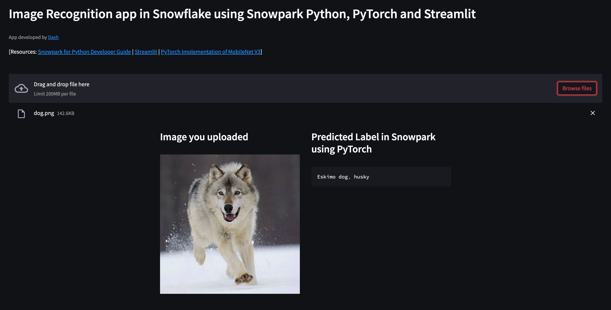
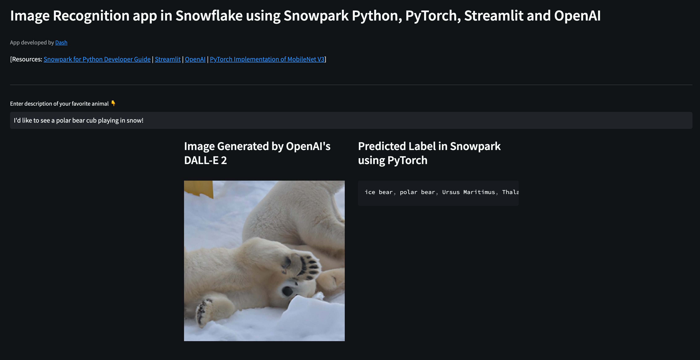

id: image_recognition_snowpark_pytorch_streamlit_openai
summary: This guide provides the instructions for writing image recognition applications in Snowflake using Snowpark for Python, PyTorch, Streamlit and OpenAI.
categories: data-science-&-ml,app-development,solution-examples
environments: web
status: Published
feedback link: <https://github.com/Snowflake-Labs/sfguides/issues>
tags: Getting Started, Snowpark Python, Streamlit, PyTorch, OpenAI
authors: Dash Desai

# A Image Recognition App in Snowflake using Snowpark Python, PyTorch, Streamlit and OpenAI
<!-- ------------------------ -->
## Overview

Duration: 2

In this guide, we will review how to build image recognition applications in Snowflake using Snowpark for Python, PyTorch, Streamlit and OpenAI's DALL-E 2 -- "*a new AI system that can create realistic images and art from a description in natural language*".

First things first though for those that are new to some of these technologies.

### What is Snowpark?

It allows developers to query data and write data applications in languages other than SQL using a set of APIs and DataFrame-style programming constructs in Python, Java, and Scala. These applications run on and take advantage of the same distributed computation on Snowflake's elastic engine as your SQL workloads. Learn more about [Snowpark](https://www.snowflake.com/snowpark/).

### What is Streamlit?

Streamlit is a pure-Python [open source](https://github.com/streamlit/streamlit) application framework that enables developers to quickly and easily write, share, and deploy data applications. Learn more about [Streamlit](https://streamlit.io/).

### What is PyTorch?

It is one of the most popular [open source](https://github.com/pytorch/pytorch) machine learning frameworks that also happens to be pre-installed and available for developers to use in Snowpark via [Snowflake Anaconda](https://snowpark-python-packages.streamlit.app/) channel. This means that you can load pre-trained PyTorch models in Snowpark for Python without having to manually install the library and manage all its dependencies.

### OpenAI and DALL-E 2

Learn more about [OpenAI](https://openai.com/) and [DALL-E 2](https://openai.com/dall-e-2/).

### What You’ll Build

Two web-based image recognition applications in Streamlit. These applications call Snowpark for Python User-Defined Function (UDF) that uses PyTorch for image recognition.

1. The first application let's the user **upload an image**.
2. The second application uses OpenAI's DALL-E 2 to **generate an image** based on user input in text/natural language format.

#### IMP: In both applications, the Snowpark for Python UDF that uses PyTorch for image recognition running in Snowflake is exactly the same. Which is awesome!

### What You’ll Learn

- How to work with Snowpark for Python APIs
- How to use pre-trained models for image recognition using PyTorch in Snowpark
- How to create Snowpark Python UDF and deploy it in Snowflake
- How to call Snowpark for Python UDF in Streamlit
- How to run Streamlit applications

### Prerequisites

- A [Snowflake account](https://signup.snowflake.com/)
  - Login to your Snowflake account with the admin credentials that were created with the account in one browser tab (a role with ORGADMIN privileges). Keep this tab open during the session.
    - Click on the **Billing** on the left side panel
    - Click on **Terms and Billing**
    - Read and accept terms to continue
  - Create a [Warehouse](https://docs.snowflake.com/en/sql-reference/sql/create-warehouse.html), a [Database](https://docs.snowflake.com/en/sql-reference/sql/create-database.html) and a [Schema](https://docs.snowflake.com/en/sql-reference/sql/create-schema.html)
- (***Optionally***) [OpenAI account](https://beta.openai.com/overview) for creating the second application. Once the account is created, you will need to generate an [OpenAI API key](https://beta.openai.com/account/api-keys) to use in the application. *Note: At the time of writing this guide, creating a new OpenAI account granted you $18.00 credit which is plenty for this application.*

<!-- ------------------------ -->
## Streamlit Applications

Duration: 5

Now let's review the two image recognition applications you'll build in Streamlit.

### Application 1 - Upload an image

This application uses Streamlit's [*st.file_uploader()*](https://docs.streamlit.io/library/api-reference/widgets/st.file_uploader) to allow the user to upload an image file. Once the file is uploaded successfully, the following code snippet converts image data from base64 to hex and stores it in a Snowflake table using a very handy Snowpark API [*session.write_pandas()*](https://docs.snowflake.com/en/developer-guide/snowpark/reference/python/api/snowflake.snowpark.Session.write_pandas.html).

Here's the code snippet:

```python
uploaded_file = st.file_uploader("Choose an image file", accept_multiple_files=False, label_visibility='hidden')
if uploaded_file is not None:
  # Convert image base64 string into hex 
  bytes_data_in_hex = uploaded_file.getvalue().hex()

  # Generate new image file name
  file_name = 'img_' + str(uuid.uuid4())

  # Write image data in Snowflake table
  df = pd.DataFrame({"FILE_NAME": [file_name], "IMAGE_BYTES": [bytes_data_in_hex]})
  session.write_pandas(df, "IMAGES")
```

### Application 2 - OpenAI generated image

This application uses OpenAI's API [*openai.Image.create()*](https://beta.openai.com/docs/guides/images/generations) to generate images based on the description provided by the user in the form of text/natural language - in real-time! Then, similar to the first application, the generated image data is converted from base64 into hex and that image data is stored in a Snowflake table using a very handy Snowpark API *session.write_pandas()*.

Here's the code snippet:

```python
# Retrieve OpenAI key from environment variable
openai.api_key = os.getenv("OPENAI_API_KEY")

# Add text box for entering text
text_input = st.text_input("Enter description of your favorite animal 👇")
if text_input:
   response = openai.Image.create(
      prompt=text_input,
      n=1,
      size="512x512",
      response_format="b64_json"
   )

  # Convert image base64 string into hex
  image_bytes = response['data'][0]['b64_json']
  bytes_data_in_hex = base64.b64decode(image_bytes).hex()

  # Generate new image file name
  file_name = 'img_' + str(uuid.uuid4())

  # Decode base64 image data and generate image file that can be used to display on screen 
  decoded_data = base64.b64decode((image_bytes))
  with open(file_name, 'wb') as f:
    f.write(decoded_data)

  # Write image data in Snowflake table
  df = pd.DataFrame({"FILE_NAME": [file_name], "IMAGE_BYTES": [bytes_data_in_hex]})
  session.write_pandas(df, "IMAGES")
```

Notes:

- It's assumed that you've stored your OpenAI API key in an environment variable named ***OPENAI_API_KEY***. If not, change the code accordingly before running the app.
- The reason behind writing the image file locally is so that the generated image (by OpenAI) can be displayed in the browser. (Note that the image file is deleted after it's displayed.)

### In Both Applications

- Streamlit's *st.set_page_config(), st.header(), st.caption(), st.columns() and st.container()* are used to organize and display various components of the application.
- For simplicity, the hex image data is stored in String format in a Snowflake table.
- The Snowpark for Python UDF *image_recognition_using_bytes()* that uses PyTorch for image recognition running in Snowflake is the same and is invoked as shown below.

```python
# Call Snowpark User-Defined Function to predict image label
predicted_label = session.sql(f"SELECT image_recognition_using_bytes(image_bytes) as PREDICTED_LABEL from IMAGES where FILE_NAME = '{file_name}'").to_pandas().iloc[0,0]
```

- In the above code snippet, the Snowpark for Python UDF *image_recognition_using_bytes()* is passed the contents of the column *image_bytes* where the column *FILE_NAME* matches the name of the image file generated using uuid.

<!-- ------------------------ -->
## Snowpark for Python and PyTorch

Duration: 10

For this particular application, we will be using [PyTorch implementation of MobileNet V3](https://github.com/d-li14/mobilenetv3.pytorch).

*Note: A huge thank you to the [authors](https://github.com/d-li14/mobilenetv3.pytorch#citation) for the research and making the pre-trained models available under [MIT License](https://github.com/d-li14/mobilenetv3.pytorch/blob/master/LICENSE).*

Ok, so once we have access to the pre-trained model files, we need to upload them onto Snowflake (internal) stage using Snowpark API [*session.file.put()*](https://docs.snowflake.com/en/developer-guide/snowpark/reference/python/api/snowflake.snowpark.FileOperation.put.html#snowflake.snowpark.FileOperation.put) so that they can be added as dependencies on the Snowpark for Python UDF for inference.

Here's the code snippet:

```python
session.file.put('imagenet1000_clsidx_to_labels.txt','@dash_files',overwrite=True,auto_compress=False)
session.file.put('mobilenetv3.py','@dash_files',overwrite=True,auto_compress=False)
session.file.put('mobilenetv3-large-1cd25616.pth','@dash_files',overwrite=True,auto_compress=False)
```

And here's the Snowpark for Python UDF code that uses the pre-trained model for image recognition in ***both applications***.

```python
# Add model files as dependencies on the UDF
session.add_import('@dash_files/imagenet1000_clsidx_to_labels.txt')
session.add_import('@dash_files/mobilenetv3.py')
session.add_import('@dash_files/mobilenetv3-large-1cd25616.pth')

# Add Python packages from Snowflke Anaconda channel
session.add_packages('snowflake-snowpark-python','torchvision','joblib','cachetools')

@cachetools.cached(cache={})
def load_class_mapping(filename):
  with open(filename, "r") as f:
   return f.read()

@cachetools.cached(cache={})
def load_model():
  import sys
  import torch
  from torchvision import models, transforms
  import ast
  from mobilenetv3 import mobilenetv3_large

  IMPORT_DIRECTORY_NAME = "snowflake_import_directory"
  import_dir = sys._xoptions[IMPORT_DIRECTORY_NAME]

  model_file = import_dir + 'mobilenetv3-large-1cd25616.pth'
  imgnet_class_mapping_file = import_dir + 'imagenet1000_clsidx_to_labels.txt'

  IMAGENET_DEFAULT_MEAN, IMAGENET_DEFAULT_STD = ((0.485, 0.456, 0.406), (0.229, 0.224, 0.225))

  transform = transforms.Compose([
      transforms.Resize(256, interpolation=transforms.InterpolationMode.BICUBIC),
      transforms.CenterCrop(224),
      transforms.ToTensor(),
      transforms.Normalize(IMAGENET_DEFAULT_MEAN, IMAGENET_DEFAULT_STD)
  ])

  # Load the Imagenet {class: label} mapping
  cls_idx = load_class_mapping(imgnet_class_mapping_file)
  cls_idx = ast.literal_eval(cls_idx)

  # Load pretrained image recognition model
  model = mobilenetv3_large()
  model.load_state_dict(torch.load(model_file))

  # Configure pretrained model for inference
  model.eval().requires_grad_(False)
  return model, transform, cls_idx

def load_image(image_bytes_in_str):
  import os
  image_file = '/tmp/' + str(os.getpid())
  image_bytes_in_hex = bytes.fromhex(image_bytes_in_str)

  with open(image_file, 'wb') as f:
    f.write(image_bytes_in_hex)
  return open(image_file, 'rb')

@udf(name='image_recognition_using_bytes',session=session,replace=True,is_permanent=True,stage_location='@dash_files')
def image_recognition_using_bytes(image_bytes_in_str: str) -> str:
  import sys
  import torch
  from PIL import Image
  import os

  model, transform, cls_idx = load_model()
  img = Image.open(load_image(image_bytes_in_str))
  img = transform(img).unsqueeze(0)

  # Get model output and human text prediction
  logits = model(img)

  outp = torch.nn.functional.softmax(logits, dim=1)
  _, idx = torch.topk(outp, 1)
  idx.squeeze_()
  predicted_label = cls_idx[idx.item()]
  return f"{predicted_label}"
```

Notes:

- There are two ways to deploy Python functions as UDFs in Snowpark so that they're executed in Snowflake. One is to use [*@udf decorator*](https://docs.snowflake.com/en/developer-guide/snowpark/reference/python/api/snowflake.snowpark.functions.udf.html#snowflake.snowpark.functions.udf) as shown above in image_recognition_using_bytes() and the other is to use [register()](https://docs.snowflake.com/en/developer-guide/snowpark/reference/python/api/snowflake.snowpark.udf.UDFRegistration.register.html#snowflake.snowpark.udf.UDFRegistration.register).
- Because functions *load_class_mapping(), load_image()*, and *load_model()* are global objects, they're also serialized and available in *image_recognition_using_bytes()* UDF.

<!-- ------------------------ -->
## Setup Environment

Duration: 5

In order to build and run the applications, setup your environment as described below.

- Clone [GitHub repository](https://github.com/Snowflake-Labs/sfguide-snowpark-pytorch-streamlit-openai-image-rec) and browse to the app folder *sfguide-snowpark-pytorch-streamlit-openai-image-rec*

- Download the miniconda installer from [https://conda.io/miniconda.html](https://conda.io/miniconda.html). *(OR, you may use any other Python environment with Python 3.8)*.

- From the app folder, create conda environment. Then activate conda environment and install Snowpark for Python and other libraries including Streamlit. *Note: You can skip installing openai if you're not going to run the second application.*

```python
conda create --name snowpark-img-rec -c https://repo.anaconda.com/pkgs/snowflake python=3.8
conda activate snowpark-img-rec
conda install -c https://repo.anaconda.com/pkgs/snowflake snowflake-snowpark-python pandas notebook cachetools
pip install streamlit
pip install uuid
pip install openai
```

*Note: The versions at the time of writing this -- snowflake-snowpark-python 1.0.0, streamlit 1.16.0, openai 0.26.0.*

- Update [connection.json](https://github.com/Snowflake-Labs/sfguide-snowpark-pytorch-streamlit-openai-image-rec/blob/main/connection.json) with your Snowflake account details and credentials. *Note: For the account parameter, specify your [account identifier](https://docs.snowflake.com/en/user-guide/admin-account-identifier.html) and do not include the snowflakecomputing.com domain name. Snowflake automatically appends this when creating the connection.*

- In your Snowflake account, create a Snowflake table and internal stage by running the following commands in Snowsight. The table will store the image data and the stage is for storing serialized Snowpark Python UDF code. *Note: It's assumed that you've already created a warehouse, a database and a schema in your Snowflake account.*

```sql
create or replace table images (file_name string, image_bytes string);
create or replace stage dash_files;
```

<!-- ------------------------ -->
## Build and Run Applications

Duration: 5

Once you have satisfied the prerequisites and set up your environment as described, running the two applications is pretty straightforward.

- In your favorite IDE such as Jupyter Notebook or VS Code, set the Python kernel to **snowpark-img-rec** (the name of the conda environment created in the previous step) and then run through the cells in [Snowpark_PyTorch_Image_Rec.ipynb](https://github.com/Snowflake-Labs/sfguide-snowpark-pytorch-streamlit-openai-image-rec/blob/main/Snowpark_PyTorch_Image_Rec.ipynb).

- Once every cell runs without any errors, you can check the contents of the Snowflake stage to make sure the model files and the UDF exists by running the following command in Snowsight. *Note: Replace the name of the stage with the one you created.*

```sql
list @dash_files;
```

### Application 1 - Upload image

- In a terminal window, execute the following command from the app folder *sfguide-snowpark-pytorch-streamlit-openai-image-rec* to run Streamlit application [Snowpark_PyTorch_Streamlit_Upload_Image_Rec.py](https://github.com/Snowflake-Labs/sfguide-snowpark-pytorch-streamlit-openai-image-rec/blob/main/Snowpark_PyTorch_Streamlit_Upload_Image_Rec.py)

```shell
streamlit run Snowpark_PyTorch_Streamlit_Upload_Image_Rec.py
```

- If all goes well, you should see a browser window open with the app loaded. Then, after uploading an image of your favorite animal by clicking on **Browse files** button, you should see something similar to this...



### Application 2 - Generate images using OpenAI

- In a terminal window, execute the following command from the app folder *sfguide-snowpark-pytorch-streamlit-openai-image-rec* to run Streamlit application [Snowpark_PyTorch_Streamlit_OpenAI_Image_Rec.py](https://github.com/Snowflake-Labs/sfguide-snowpark-pytorch-streamlit-openai-image-rec/blob/main/Snowpark_PyTorch_Streamlit_OpenAI_Image_Rec.py)

```shell
streamlit run Snowpark_PyTorch_Streamlit_OpenAI_Image_Rec.py
```

- If all goes well, you should see a browser window open with the app loaded. Then, enter text like so "**I'd like to see a polar bear cub playing in snow!**" and you should see something similar to this...



<!-- ------------------------ -->
## Conclusion And Resources

Duration: 1

Congratulations! You've successfully created image recognition applications in Snowflake using Snowpark for Python, PyTorch, Streamlit and OpenAI.

### What You Learned

- How to work with Snowpark for Python APIs
- How to use pre-trained models for image recognition using PyTorch in Snowpark
- How to create Snowpark Python UDF and deploy it in Snowflake
- How to call Snowpark for Python UDF in Streamlit
- How to run Streamlit applications

### Related Resources

- [Full demo on Snowflake Demo Hub](https://developers.snowflake.com/demos/image-recognition-with-snowflake/)
- [Source Code on GitHub](https://github.com/Snowflake-Labs/sfguide-snowpark-pytorch-streamlit-openai-image-rec)
- [Machine Learning with Snowpark for Python](https://quickstarts.snowflake.com/guide/getting_started_snowpark_machine_learning/index.html)
- [Snowpark for Python Demos](https://github.com/Snowflake-Labs/snowpark-python-demos/blob/main/README.md)
- [Snowpark for Python Developer Guide](https://docs.snowflake.com/en/developer-guide/snowpark/python/index.html)
- [Snowpark for Python API Reference](https://docs.snowflake.com/en/developer-guide/snowpark/reference/python/index.html)
- [Streamlit Docs](https://docs.streamlit.io/)
