author: Ilya Sudakov
id: improvado
summary: Getting Started guide to show how users can use Improvado Composable “Agentic” Data Platform with Snowflake
categories: Getting-Started,partner-integrations,marketing
environments: web
status: Archived
feedback link: https://github.com/Snowflake-Labs/sfguides/issues
tags: Getting Started

# Improvado Composable “Agentic” Data Platform with Snowflake
<!-- ------------------------ -->
## Introduction
Duration: 2

This guide will show you how to connect your Snowflake AI Data Cloud to Improvado platform, manage user & data access, and understand how AI Agent uses your Snowflake data for analytics & marketing data governance.

### Improvado Platform Overview

Improvado is an AI-powered composable marketing analytics & intelligence platform that provides secure and efficient data integration with Snowflake.

Improvado platform is comprised of two main components: **Data Platform** and **AI Agent**. 

Improvado's core product focuses on providing robust Extract, Load, Transform (ELT) capabilities. It supports over 500 data sources for seamless data extraction and load. 

On top of the core platform, the AI Agent enhances the value of your data by providing advanced analytics and governance capabilities. Our AI Agent offers several advanced features:

- **Campaign Intelligence**: Offers deep insights and analytics on campaign performance to help marketers optimize their strategies and outcomes.
- **Automated Data Analysis**: The AI Agent enables automatic analysis of your Snowflake data, ensuring that all data points are accurately processed and interpreted.
- **Snowflake Metadata**: By generating comprehensive metadata, the AI Agent provides valuable context to your data, enhancing its usability for analytics and reporting.
- **Marketing Data Governance**: Leverages advanced data profiling to ensure high data quality and compliance with marketing data governance workflows.
- **Action Pulse**: Provides actionable insights on your marketing data, helping you make informed decisions and improve performance.
- **Data Activation**: Transforms and routes data back into operational tools for activation, enabling data-driven actions across your marketing stack.

This layered approach ensures that Improvado not only integrates and processes data effectively but also enriches it with insights and governance for better decision-making.

The following diagram illustrates the overview of Improvado platform capabilities:

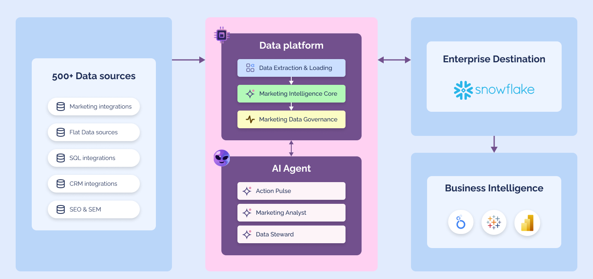 

Additionally, Improvado offers a custom Marketing Data Governance solution to ensure compliance with marketing guidelines, maintaining high data quality and consistency.

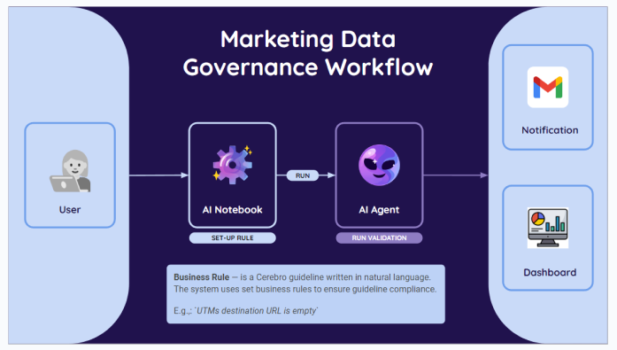

### Prerequisites
- A [Snowflake](https://signup.snowflake.com/) Account
- Access to an Improvado instance. Please reach out to our Sales and [Book a demo](https://improvado.io/register/talk-to-an-expert)

### What you’ll learn
- How to connect Snowflake to Improvado 
- How to ensure privacy of your data within Improvado platform
- How AI Agent uses metadata to provide accurate & useful insights

<!-- ------------------------ -->
## Connect Snowflake to Improvado
Duration: 4

In this step, we’ll learn how to connect your Snowflake schema to Improvado. Improvado integrates with Snowflake using a native Python Connector, ensuring efficient data transfers and fast updates.

### Connecting a Data source
Connecting a Data source in Improvado enables you to extract data and then load it into your analytics and reporting frameworks. Improvado offers 500+ integrations with Marketing, eCommerce, CRM, Flat Data, SEO & SEM, and many other providers.

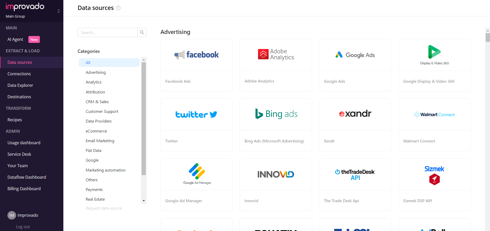 

Follow these simple steps to connect a data source:
Go to the Data sources page and select a necessary Data source to extract your data
Enter required credentials or authorize using OAuth (depending on Data source API capabilities)
Then, you’ll be redirected to the Connection Details page, where you can set up data extraction.
### Step 1. Database permissions
Now you’ll need to grant the following permissions to your Snowflake database schema:
- `CREATE`
- `ALTER TABLE`
- `DELETE`
- `INSERT`

### Step 2. Select a destination
Log in to the Improvado platform and navigate to the Destinations page from the left-hand side menu. This page is a catalog of all the available destinations for data loading.

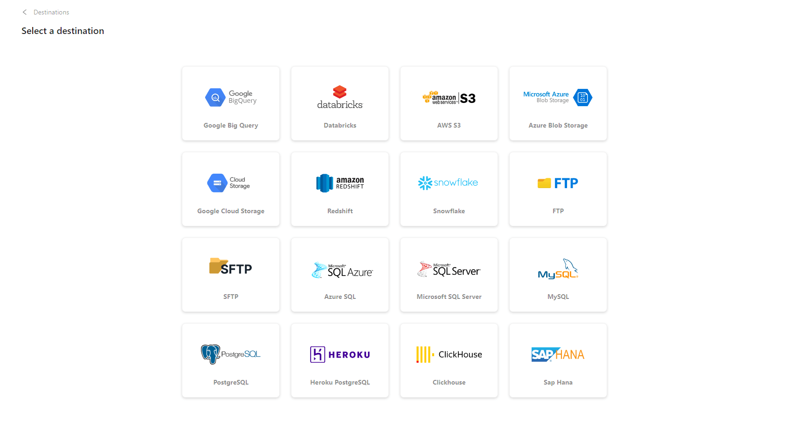

Click on the **Snowflake** tile.

### Step 3. Complete configuration
On the Snowflake connection page, fill in the following fields:
1. Enter a name for your Destination connection in the **Title**.
2. Enter the **Account**.
3. Enter the **User Name**.
4. Enter the **Password**.
5. Enter the **Database Name**.
6. Enter the **Warehouse**.
7. Specify the **Schema** of your database.
8. Enter the **Role**.
   - The `SYSADMIN` role should be granted to the specified user. Make sure you’re using a non-public role because it doesn’t have enough permissions for the load process.
9. Select the necessary **Use static IP** option from the dropdown.

### AI Agent and your Snowflake data
After successfully connecting your Snowflake database, Improvado AI Agent will automatically analyze data in your Snowflake storage and generate metadata for accurate analytics reports and consistent Marketing Data Governance workflows.
### How to access your data using Snowsight
1. Sign in to your [Snowflake](https://app.snowflake.com/) account.

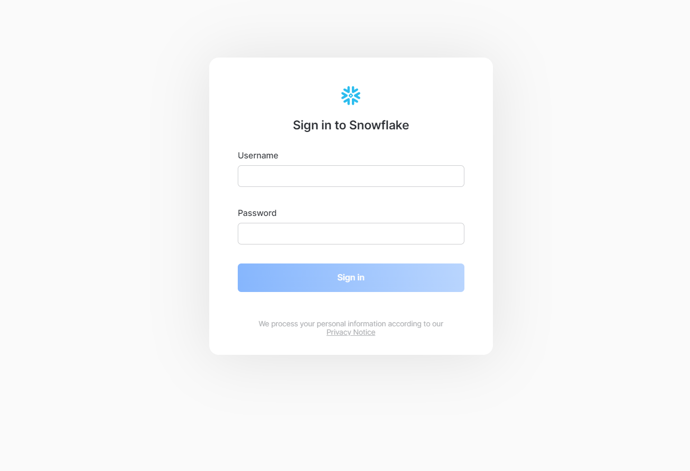

2. Go to the Databases tab to see a full list of databases in your Snowflake instance.

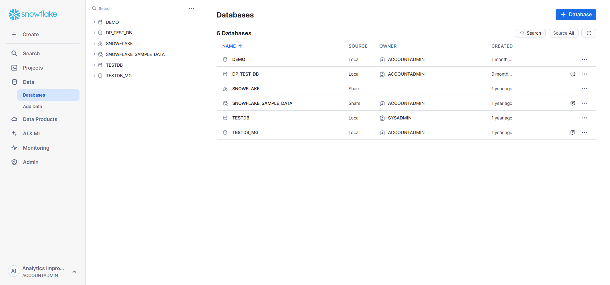

3. Select the necessary schema to where you’ve setup Data Load to see a list of its tables. 

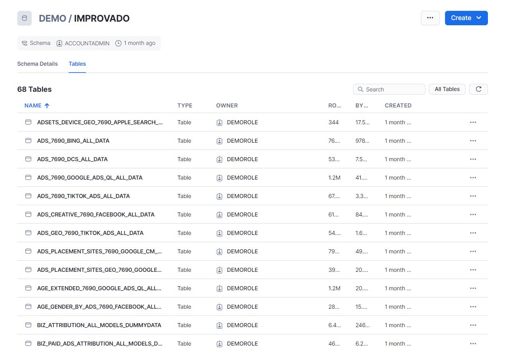

4. To query your data, you’ll need to create a new SQL Worksheet. First, go to the Projects > Worksheets page. Click the Plus button and select SQL Worksheet from the dropdown. 

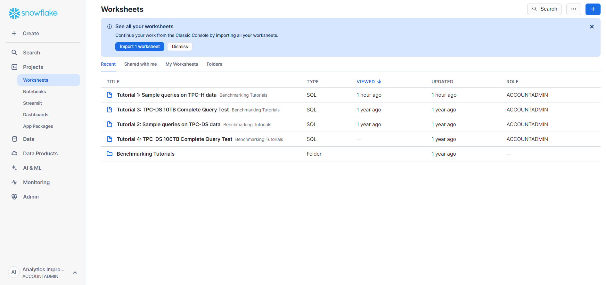

5. Here you can select the necessary table that you want to query using SQL and see its structure.

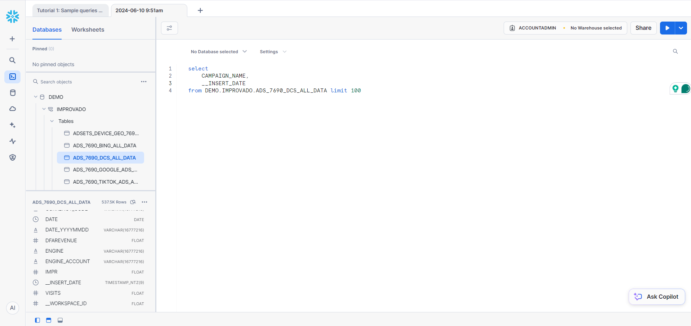

6. Check the data loaded to this table in the Results view or create a Chart to help you visualize it.

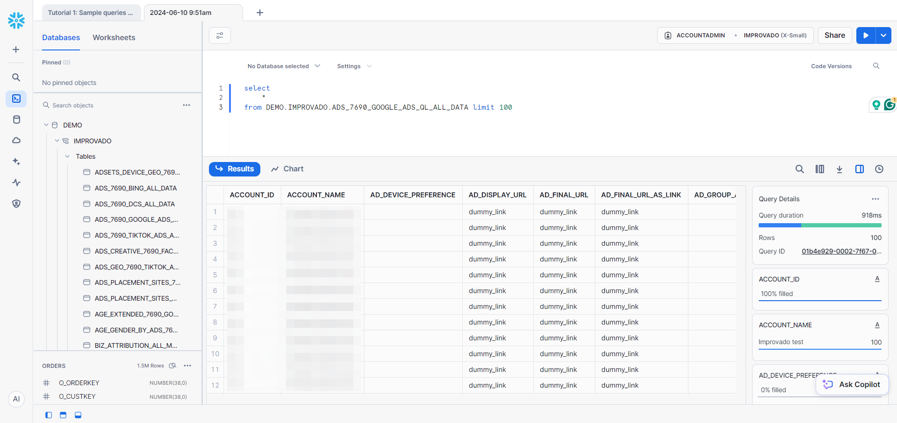

<!-- ------------------------ -->
## Data Privacy
Duration: 2

In this step, we will learn about Data Privacy policies and rules within Improvado & Snowflake.

Improvado AI Agent is compatible with any Row Access Policies you’ve set up in Snowflake. Improvado enforces data governance policies such as access controls and quality standards right from the metadata level. This ensures that your data governance workflows are consistent and reliable.

You can check Improvado’s [Privacy Policy](https://improvado.io/company-legal/privacy-policy) for more details.

### User access management in Improvado
We also provide tools to manage user access within the Improvado platform.

Workspaces allow for access management and control within a single Improvado instance. This is especially helpful if you want to separate data by specific Products or Client accounts, ensuring a structured and simplified experience.

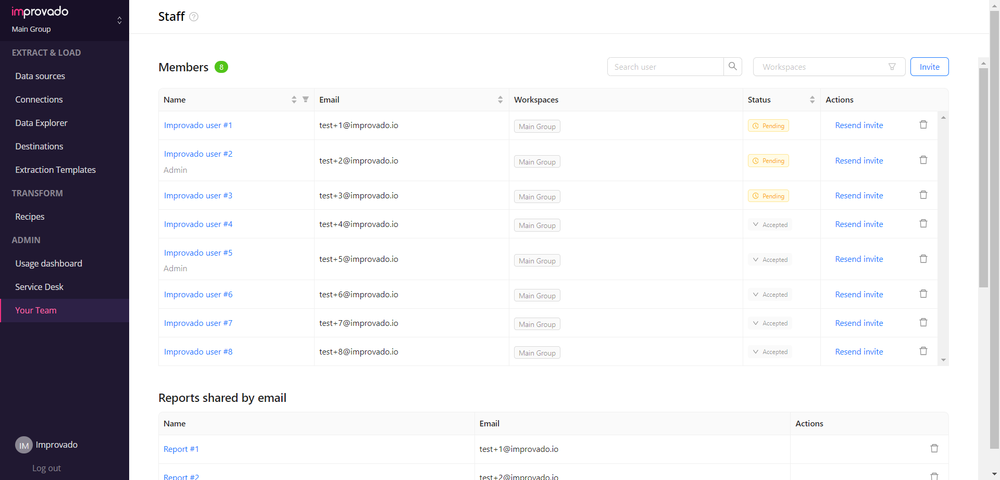

<!-- ------------------------ -->
## Data Access and Consumption
Duration: 2

The AI Agent automatically scans and collects metadata for each table, column and row values in your Snowflake storage. This step is crucial as it enables the AI Agent to understand the structure and relationships within your database.

Improvado’s integration with Snowflake ensures that your analytics, machine learning, and ETL services are all connected within a unified platform. This integration simplifies the data management process and enhances the overall efficiency of your data workflows.

By leveraging these capabilities, Improvado facilitates efficient data access and consumption, providing you with the tools necessary to extract valuable insights and maintain robust data governance practices.

### Billing dashboard
Improvado Billing Dashboard offers an in-depth analysis of your data usage, providing crucial segmented insights into extracted rows over your usage period. It also includes interactive features, enhancing your ability to examine and understand the data in a more dynamic and effective manner.

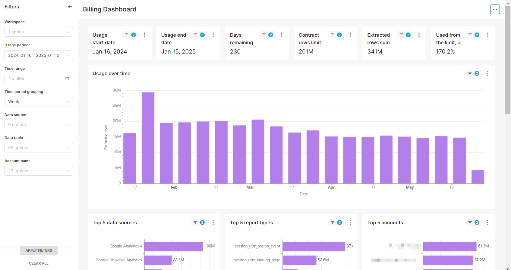

<!-- ------------------------ -->
## Conclusion And Resources
Duration: 1

In this guide, we learned how to connect your Snowflake data to Improvado for analytics & governance.

Improvado provides significant value to Snowflake users and allows you to:
- Better organize your Data Warehouse
- Enable Data Governance for your marketing data
- Manage your PII within Snowflake
- Get an insight into your Snowflake data
- Scale to the needs of your enterprise

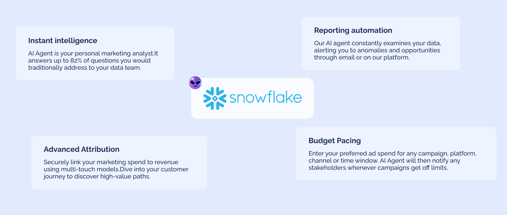

### Learn more
- You can learn more about Improvado on [official website](https://improvado.io)
- Read about Snowflake partnership with Improvado at [Improvado-Snowflake Partnership](https://improvado.io/blog)
