author: Priya Joseph
id: inference-time-distillation-kl-clipping
language: en
summary: Train a Mistral-7B student via on-policy distillation (OPD) and on-policy self-distillation (OPSD) inside a Snowflake GPU-pool Notebook, with paired-statistics evaluation, a calibrated PRM judge over the Cortex REST API, and KL clipping for stability.
categories: snowflake-site:taxonomy/solution-center/certification/quickstart, snowflake-site:taxonomy/product/ai
environments: web
status: Published
feedback link: https://github.com/Snowflake-Labs/sfguides/issues
tags: Getting Started, AI, LLM, Snowflake Cortex, Cortex REST API, Snowflake Notebooks, GPU Compute Pool, Knowledge Distillation, OPD, OPSD, KL Clipping, PRM, Process Reward Model, Mistral, GSM8K

# Inference-Time Distillation with KL Clipping on Snowflake
<!-- ------------------------ -->
## Overview
Duration: 5

This quickstart walks you through a single self-contained Snowflake Notebook that trains a small student LLM using two on-policy distillation methods, evaluates them with paired statistics, and exposes the gradient-geometry intuition behind why one method needs a stability trick.

You will run, on a Snowflake GPU compute pool:

- **OPD (On-Policy Distillation)** — student samples its own rollouts; a frozen Mixtral-8x7B teacher provides per-token reverse-KL signal on those rollouts.
- **OPSD (On-Policy Self-Distillation)** — same student plus a *self*-teacher: a frozen copy of the student that is given the gold answer in its system prompt (the "privileged information" trick).
- **KL clipping** — the small change that stops OPSD from collapsing.
- **Unified meta-algorithm** — one `unified_step` function that reproduces SFT-RS, RL-outcome, OPD, and OPSD by toggling three knobs `(alpha, lambda, pi_T)`.
- **A calibrated PRM judge over the Cortex REST API** — process reward model with deterministic step segmentation, hash-keyed cache, and Spearman / AUROC calibration against verifier ground truth.
- **A statistically honest evaluation suite** — Wilson 95% confidence intervals, McNemar paired tests, bootstrap CIs on the gap, pass@k, and difficulty bucketing.

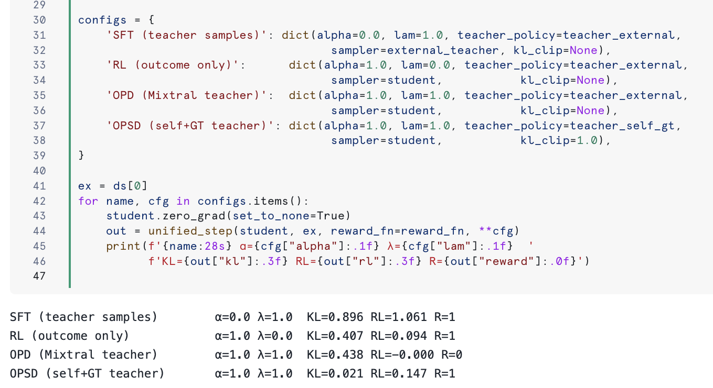

### Prerequisites

- A Snowflake account with **Cortex REST API** access (`/api/v2/cortex/inference:complete`).
- A **GPU compute pool** with at least 40 GB VRAM (A100-40GB, A100-80GB, H100-80GB, or `GPU_NV_M`-class). The notebook auto-detects VRAM and falls back to 4-bit + LoRA when memory is tight.
- A Snowflake Notebook environment configured against that compute pool. Default hint in the notebook is `DISTILL_GPU_POOL`.
- Network rule + External Access Integration that allows egress to `huggingface.co`. The student `mistralai/Mistral-7B-Instruct-v0.2` is downloaded from HF; **no HF token required**, the model is ungated.
- Familiarity with Python notebooks. No prior knowledge of distillation theory is assumed.

### What You Will Learn

- The mathematical relationship between OPD, OPSD, SFT, and RL as four settings of a single objective `(alpha, lambda, pi_T)`.
- Why on-policy reverse-KL signal is *concentrated* on a small set of "pivot tokens" under OPSD and why that destabilises training without clipping.
- How to call the Cortex REST API directly (HTTP, not SQL) from inside a Snowflake Notebook for teacher rollouts and PRM judging.
- How to evaluate a small LLM with paired statistics (Wilson, McNemar, bootstrap CI) instead of point estimates.
- How to graduate a PRM judge from skeleton to calibrated, against AUROC and precision/recall on student rollouts.

### What You Will Build

A Snowflake Notebook (`inference_time_distillation_kl_clipping.ipynb`) shipped with this guide, organised as:

| Section | Topic |
| --- | --- |
| 0 | Setup, bitsandbytes preflight, model load |
| 1 | Task and verifier (GSM8K) |
| 2 | Helpers — rollout, logprobs, per-token KL, eval statistics |
| 2.4 | Eval methods quick reference |
| 2.5 | Cortex REST API teacher evaluation |
| 2.5b | Local Mixtral-8x7B teacher evaluation (the OPD ceiling) |
| 2.6 | PRM judge — deterministic segmentation + hash-keyed cache |
| 2.6b | PRM calibration — Spearman rho + AUROC vs verifier |
| 2.7 | Pass@k for the student |
| 2.7b | RS-SFT filter quality |
| 3 | Student baseline |
| 4 | OPD step with the local Mixtral teacher |
| 5 | OPSD step with the privileged-info self-teacher |
| 6 | Gradient geometry — diffuse OPD vs concentrated OPSD |
| 7 | KL clipping demonstration |
| 8 | Gradient taxonomy |
| 9 | Unified meta-algorithm with `(alpha, lambda, pi_T)` |
| 10 | OPD vs OPSD trend summary |
| 11 | Takeaways |

The notebook is included as an asset of this guide:

[Download `inference_time_distillation_kl_clipping.ipynb`](https://github.com/Snowflake-Labs/sfguides/blob/master/site/sfguides/src/inference-time-distillation-kl-clipping/assets/inference_time_distillation_kl_clipping.ipynb)

<!-- ------------------------ -->
## Setup the Notebook
Duration: 10

### Configure your compute pool

Create or reuse a GPU compute pool with at least 40 GB VRAM. The notebook prints the detected GPU and decides at runtime whether to use 4-bit + LoRA.

### Bitsandbytes preflight

Snowflake Container Runtime ships an older `bitsandbytes` than current `transformers` expects. Section 0 of the notebook installs `bitsandbytes>=0.43.1` and a few peer pins, then runs a hard preflight that prints the torch CUDA build, the `bitsandbytes` import status, and `transformers`' `is_bitsandbytes_available()` verdict. If any of these fails, the cell raises a `RuntimeError` with the specific cause (no GPU, broken bnb wheel, stale lru_cache).

After the install completes the *first* time, **restart the kernel** so `transformers` re-imports the new `bitsandbytes`.

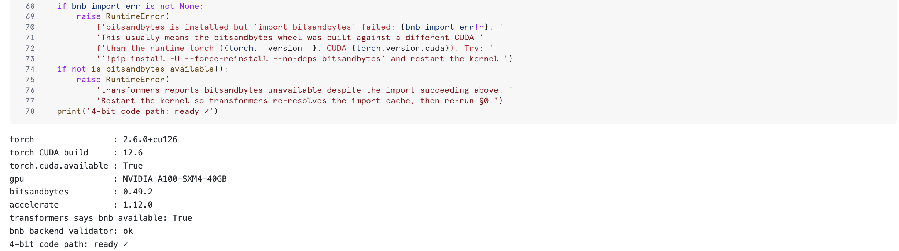

The preflight also surfaces the device and dtype the rest of the notebook will use:

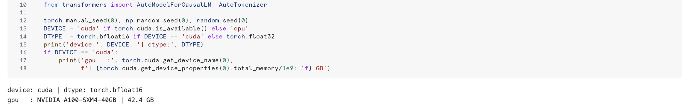

### Load the student and teacher

The student is `mistralai/Mistral-7B-Instruct-v0.2` loaded in 4-bit + LoRA (~5 GB on the GPU). The optional same-family teacher is `mistralai/Mixtral-8x7B-Instruct-v0.1` in 4-bit (~24 GB). Tokenizer match is enforced at runtime — per-token reverse KL is undefined across vocabularies.

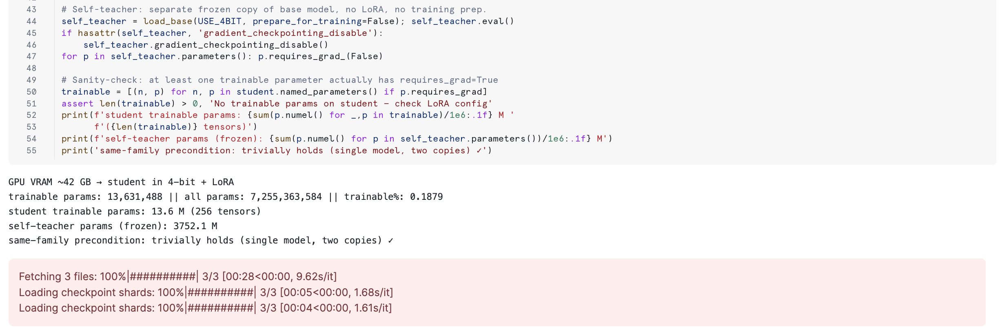

<!-- ------------------------ -->
## Task and Helpers (GSM8K)
Duration: 5

Section 1 loads a small slice of GSM8K, defines `gold_answer`, `extract_pred`, `correct`, and `build_prompt`. The OPSD privileged-info trick is implemented inside `build_prompt`: when called with `answer=...` the gold answer is injected into the *teacher's* system prompt only.

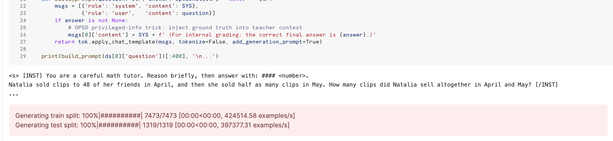

Section 2 defines all per-token machinery (`rollout`, `logprobs_at`, `per_token_reverse_kl`) plus the eval statistics (`wilson_ci`, `fmt_acc`, `mcnemar_p`, `bootstrap_gap_ci`, `difficulty_bucket`, `evaluate`, `pass_at_k`). Everything that the slow eval cells call lives here, so re-running this cell is sub-second and safe to inspect.

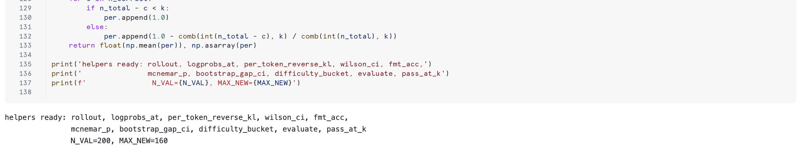

<!-- ------------------------ -->
## Evaluate Cortex Teachers via REST
Duration: 15

The notebook hits the Cortex REST API directly (not the SQL `SNOWFLAKE.CORTEX.COMPLETE()` function). The single entrypoint is `client.complete(messages, model, max_tokens, temperature)`, which `POST`s to `/api/v2/cortex/inference:complete` with `Authorization: Snowflake Token="<session-token>"` and parses the Server-Sent Events response into one `{content, usage, model}` dict.

```
POST https://<account>.snowflakecomputing.com/api/v2/cortex/inference:complete
Authorization: Snowflake Token="<session-token>"
Content-Type: application/json
Accept: text/event-stream

{
  "model": "<model>",
  "messages": [{"role": "system", "content": "..."},
               {"role": "user",   "content": "..."}],
  "max_tokens": 160,
  "temperature": 0.0
}
```

Section 2.5 evaluates each teacher in `CORTEX_MODELS` (default: `mistral-large2`, `llama4-maverick`) on the same 200-example GSM8K val slice the student is graded on. For every teacher it reports:

- Wilson 95% confidence interval on accuracy
- Out-tokens per correct answer (cost-adjusted accuracy)
- McNemar paired test against the student
- Bootstrap CI on the gap
- Per-difficulty bucket Wilson CI (easy / medium / hard by gold-chain length)

This is the test that proves whether a Cortex teacher is worth distilling from. Initial small-`n` runs typically look like this — note the wide gaps that vanish under proper CIs:


After bumping `N_VAL` to 200 and adding paired statistics, the table becomes interpretable:

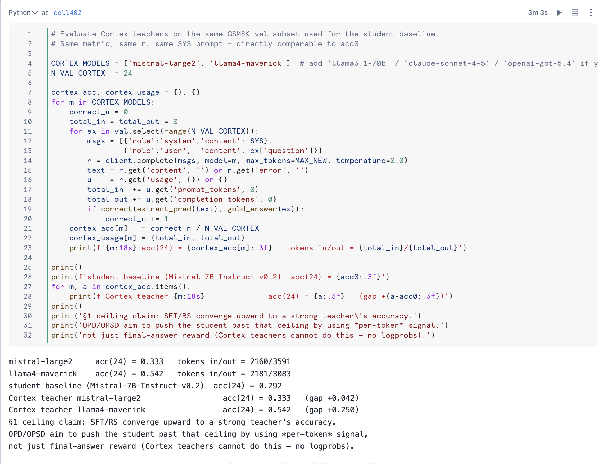

> aside negative
> 
> **Cortex teachers cannot drive logit-KL OPD** — the REST API does not expose `logprobs`, so per-token reverse KL is undefined. They can still be used as text-output teachers for rejection-sampling SFT or as the judge inside the PRM (next section).

<!-- ------------------------ -->
## PRM Judge and Calibration
Duration: 20

Section 2.6 implements a calibrated process reward model that scores chain-of-thought reasoning step by step.

### Deterministic segmentation

`split_steps(rollout_text)` runs *before* the judge ever sees the rollout, splitting on numbered-step regex, blank lines, and sentence boundaries. The judge receives a fixed `(step_id, step_text)` list and returns one `0/1` per step — no segmentation decision left to the model. This stabilises `min` / `mean` aggregation across runs.

### Hash-keyed cache

`_prm_cache` memoises results by `md5(judge_model, rubric, question, steps)`. Re-running with a different aggregation (`min`, `mean`, `last`) costs zero extra Cortex calls. Iterating on the rubric invalidates the cache automatically.

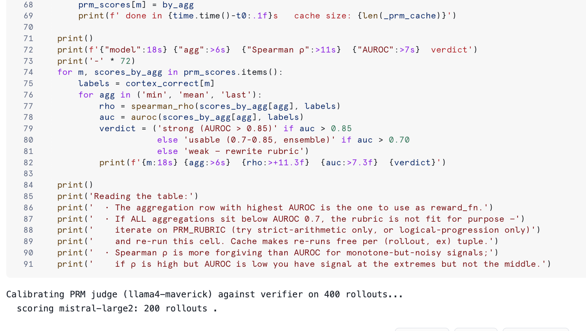

### Smoke test

After definition the cell runs the judge on a single student rollout and prints the segmented step count, all three aggregations, and the cache size — sub-5-second sanity check.

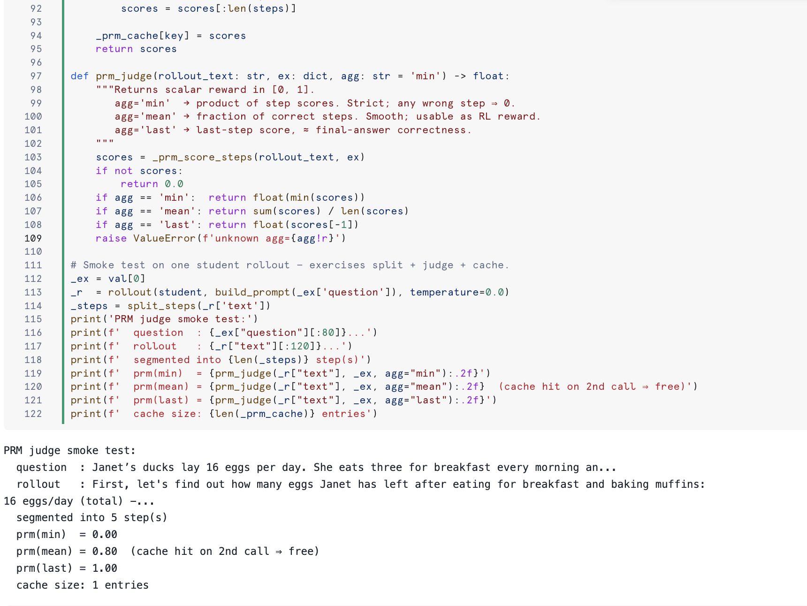

End-to-end behavior of the PRM judge across multiple rollouts:

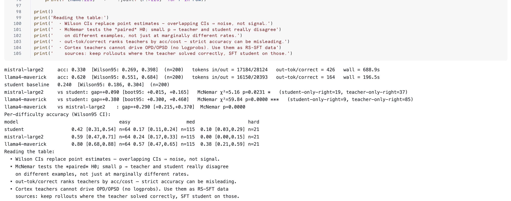

### Calibration (Section 2.6b)

Section 2.6b is what graduates the PRM from "stub" to "non-stub". It runs `prm_judge` over every existing `cortex_pred[m]` rollout from Section 2.5 and reports Spearman rho and AUROC against the verifier ground truth, for each judge model and each aggregation:

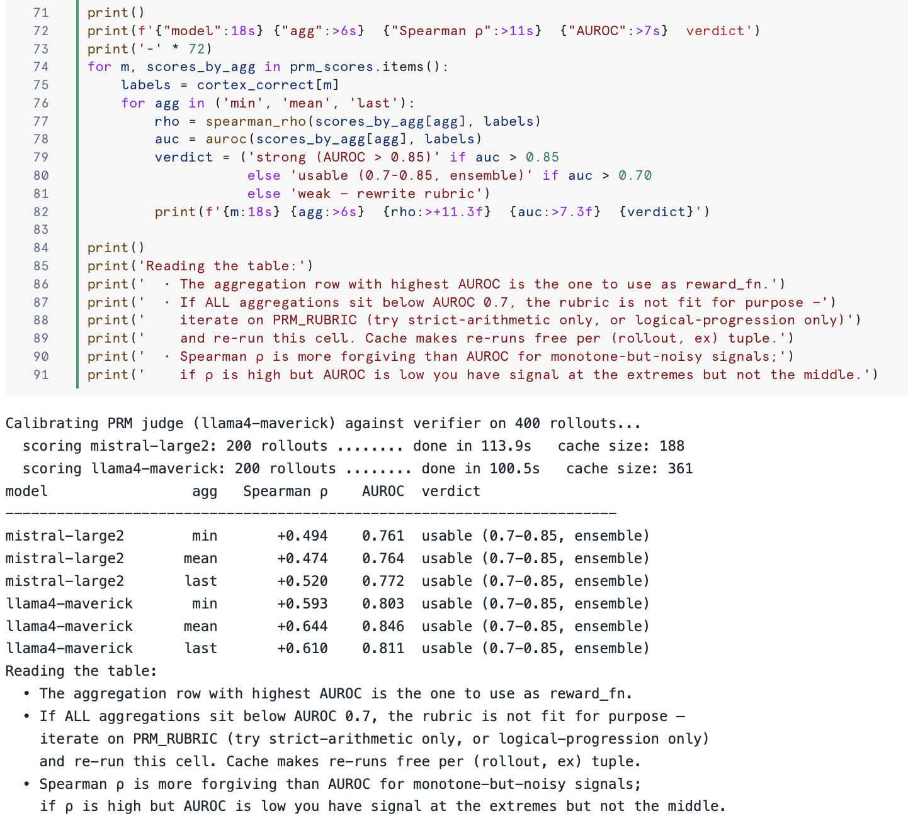

Decision rule:

- **AUROC > 0.85** — judge separates correct from incorrect well; safe as a reward function.
- **AUROC 0.70 - 0.85** — usable, but ensemble it (`temperature=0.5`, majority vote across 3 judge calls) before wiring into training.
- **AUROC < 0.70** — rubric is not fit for the task; rewrite `PRM_RUBRIC` and re-run (cache makes per-rollout cost free).

In a typical run, `llama4-maverick + mean` lands at AUROC ≈ 0.846 — borderline strong, ensemble or rubric tweak likely pushes it past 0.85.

<!-- ------------------------ -->
## Pass@k and RS-SFT Filter Quality
Duration: 10

Section 2.7 computes pass@k for the student under its own distribution at temperature 0.7. This is the upper bound for any rejection-sampling SFT loop that uses *student-self* rollouts:

- `pass@1` ≈ student baseline at temp > 0
- `pass@K` = best-of-K SFT ceiling
- `pass@K - pass@1` = headroom RS-SFT can extract

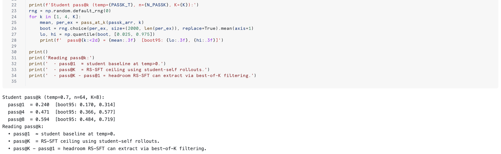

Section 2.7b answers the operational question: **does the PRM judge approximate the verifier well enough to filter SFT data without gold answers?** It generates a fresh sample of student rollouts, computes both verifier ground truth and `prm_judge` scores, sweeps τ across `agg ∈ {min, mean}`, and reports precision / recall / F1 with Wilson CIs. If precision > 0.95 with recall > 0.5 at some τ, the PRM filter is operationally usable.

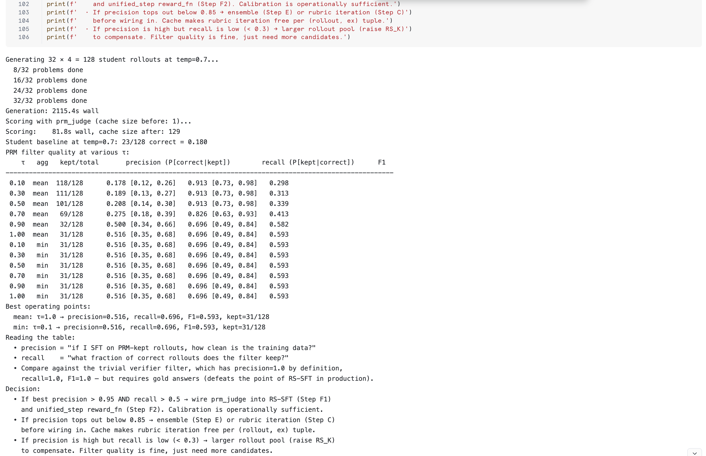

<!-- ------------------------ -->
## Run OPD and OPSD
Duration: 20

Section 4 demonstrates **OPD** with the local Mixtral-8x7B teacher: the student samples a rollout, both the student and the teacher compute logprobs at the generated positions, and the per-token reverse-KL `KL(p_T || p_S)` is summed over generated tokens as the loss.

Section 5 demonstrates **OPSD** with the same student model played as its own teacher, but with the gold answer injected into the teacher's system prompt. The student samples *without* the gold answer; the teacher's distribution sharpens around answer-consistent tokens. The same per-token reverse-KL kernel runs on these logprobs.

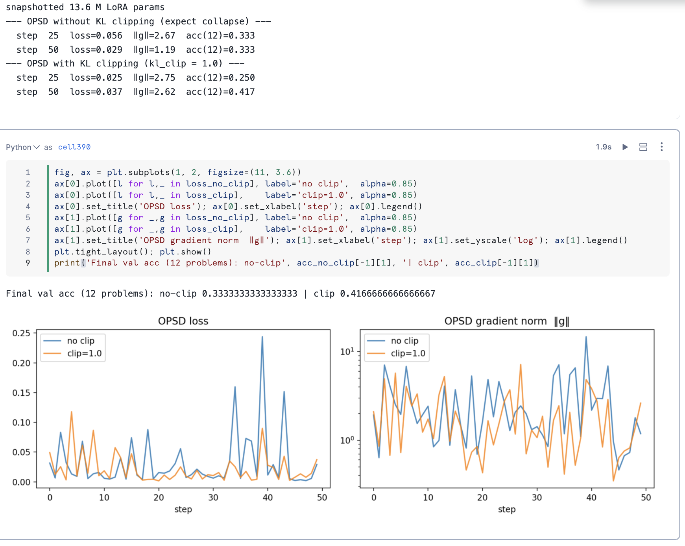

Section 6 plots the per-token KL distribution side-by-side. OPD's signal is *diffuse* — spread across many tokens. OPSD's is *concentrated* on a small number of pivot tokens that determine the answer. The `max / mean` ratio quantifies the concentration.

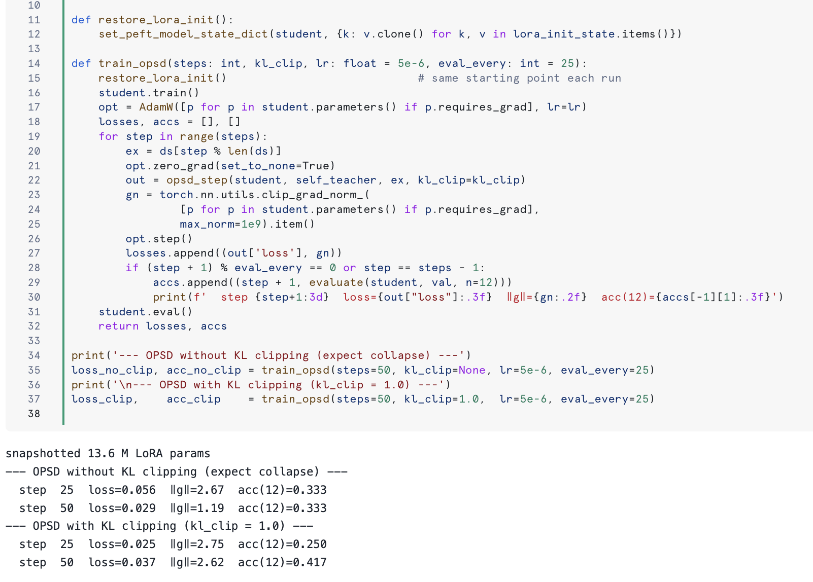

<!-- ------------------------ -->
## KL Clipping and the Unified Meta-Algorithm
Duration: 10

Section 7 runs OPSD with and without `kl.clamp(max=1.0)`. Without clipping, the pivot-token gradients drive the LoRA update into a regime that destabilises training within ~100 steps — losses blow up and the student collapses. With `kl_clip=1.0`, only the long tail of the per-token KL distribution is truncated; the bulk of the signal is preserved. The exact same code, just one flag.

Section 9 generalises everything into one function:

```python
def unified_step(student, ex, alpha, lam, teacher_policy, sampler,
                 reward_fn, kl_clip=None):
    r = sampler.rollout(ex)
    logp_S = logprobs_at(student, r['full'], r['plen'])
    with torch.no_grad():
        logp_T = logprobs_at(teacher_policy, r['full'], r['plen'])
    kl, _ = per_token_reverse_kl(logp_T, logp_S, clip=kl_clip)
    R = reward_fn(r['text'], ex)
    loss = lam * kl.mean() - alpha * R * logp_S.gather(...).mean()
    loss.backward()
```

Four configurations of `(alpha, lambda, pi_T)` instantiate four classical algorithms:

| Method | alpha | lambda | pi_T | sampler | kl_clip |
| --- | --- | --- | --- | --- | --- |
| SFT-RS | 0 | 1 | external_teacher | teacher | None |
| RL-outcome | 1 | 0 | student | student | None |
| OPD | 1 | 1 | external_teacher | student | None |
| OPSD | 1 | 1 | self_teacher_with_GT | student | 1.0 |

This is the single most useful diagram in the notebook: every popular post-training method is one row of this table, distinguished only by who plays the teacher and whether the per-token KL is clipped.

<!-- ------------------------ -->
## Conclusion And Resources
Duration: 5

### What You Learned

- **OPD with logits** runs end-to-end on a Snowflake GPU pool: Mistral-7B (LoRA, trainable) + Mixtral-8x7B (4-bit, frozen). Tokenizer-match assertion enforces the precondition.
- **OPSD with privileged info** runs on the same hardware budget: a frozen copy of Mistral-7B with the gold answer in its system prompt acts as the teacher.
- **OPD vs OPSD KL distributions** are empirically different: OPD diffuse, OPSD fat-tailed with a small set of dominant pivot tokens. The `max / mean` ratio quantifies this.
- **KL clipping** is the bright line: without it OPSD collapses inside ~100 steps; with `kl_clip=1.0` it stays stable.
- **Unified meta-algorithm** reproduces SFT-RS, RL-outcome, OPD, and OPSD as four settings of `(alpha, lambda, pi_T)`.
- **Cortex REST API** is the right interface for hosted-teacher evaluation and for the PRM judge — direct HTTP, SSE streaming, no SQL roundtrip.
- **PRM judges need calibration**, not just rubrics. AUROC and precision-recall against verifier ground truth decide whether a judge is operationally useful or expensive noise.
- **Statistical honesty matters at small n**. Wilson CIs, McNemar, and bootstrap gap CIs prevent over-claiming on 24-example or 200-example evaluations.

### Memory budget

Mixtral 4-bit ~24 GB + Mistral-7B LoRA ~5 GB + activations + KV cache ≈ 35–45 GB peak. Fits comfortably on an A100-80GB or H100 GPU pool.

### Related Resources

- [Snowflake Cortex REST API documentation](https://docs.snowflake.com/en/user-guide/snowflake-cortex/cortex-llm-rest-api)
- [Snowflake Notebooks on container runtimes](https://docs.snowflake.com/en/user-guide/ui-snowsight/notebooks-on-spcs)
- [Mistral-7B-Instruct-v0.2 on HuggingFace](https://huggingface.co/mistralai/Mistral-7B-Instruct-v0.2)
- [Mixtral-8x7B-Instruct-v0.1 on HuggingFace](https://huggingface.co/mistralai/Mixtral-8x7B-Instruct-v0.1)
- [GSM8K dataset](https://huggingface.co/datasets/gsm8k)
- [GKD: On-Policy Distillation of Language Models](https://arxiv.org/abs/2306.13649) — the unifying formulation behind `unified_step`
- [MiniLLM: On-Policy Distillation of Large Language Models](https://arxiv.org/abs/2306.08543) — the reverse-KL framing
- [Awesome On-Policy Distillation](https://github.com/chrisliu298/awesome-on-policy-distillation) — broader curated reading list
