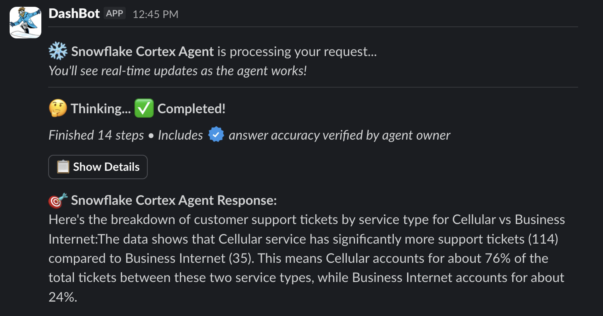
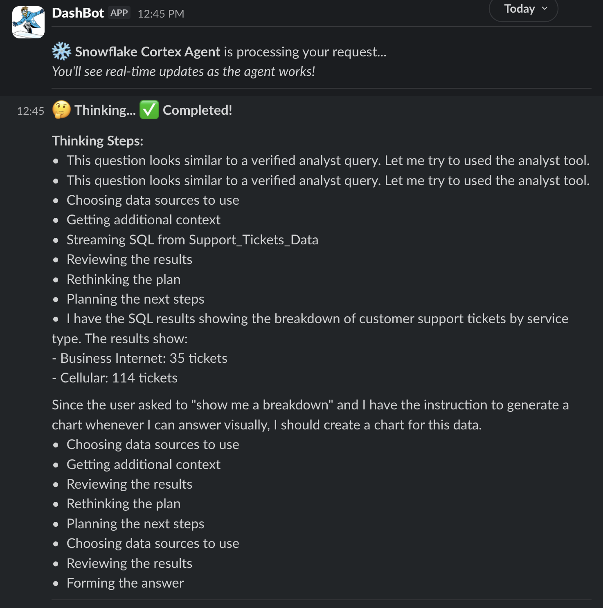
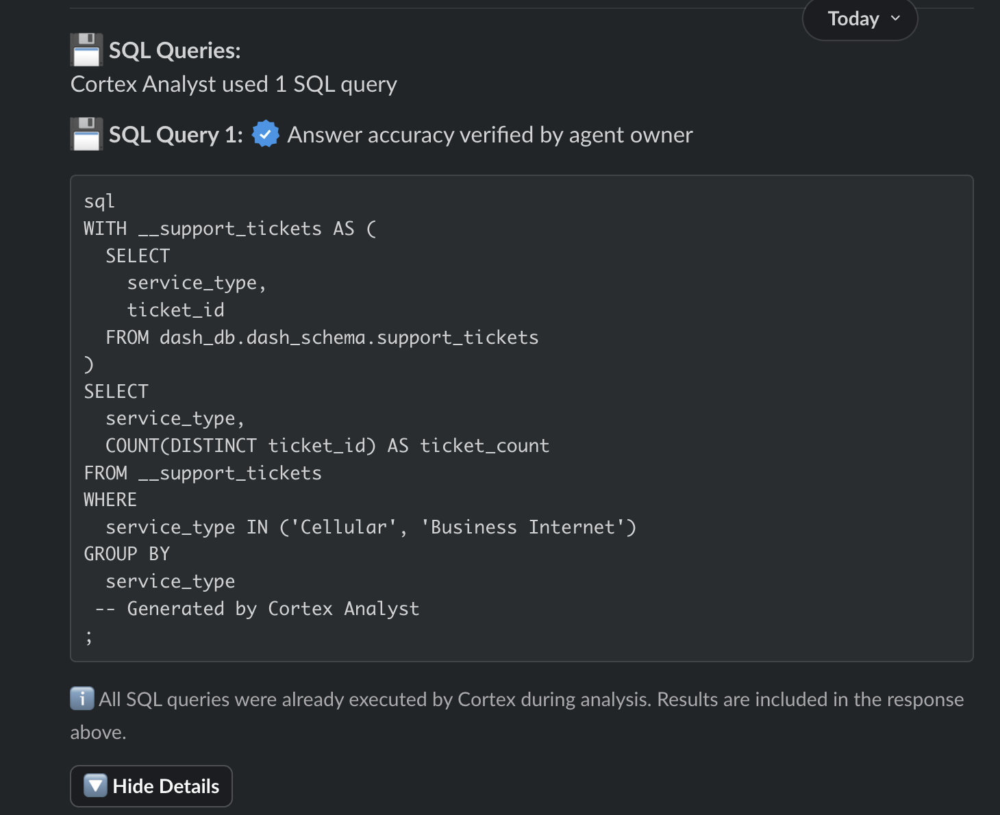
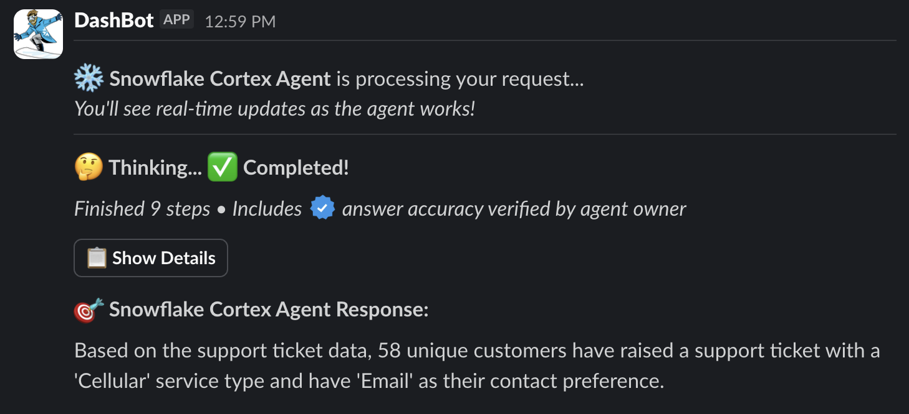
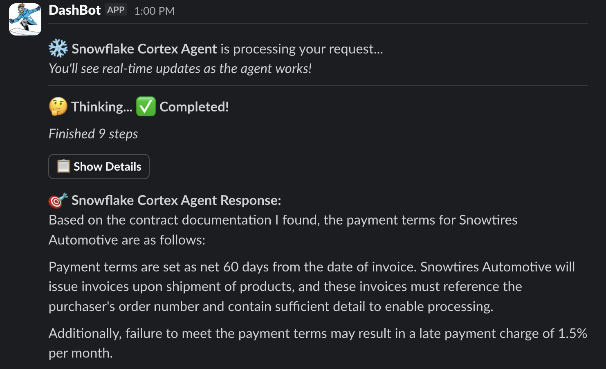
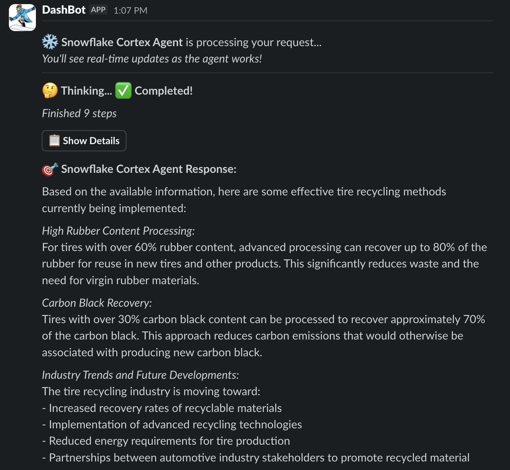

id: integrate-snowflake-cortex-agents-with-slack
categories: snowflake-site:taxonomy/solution-center/certification/quickstart, snowflake-site:taxonomy/product/ai, snowflake-site:taxonomy/product/applications-and-collaboration, snowflake-site:taxonomy/snowflake-feature/ingestion/conversational-assistants
language: en
summary: This guide outlines the process for integrating Snowflake Cortex Agents with Slack. 
environments: web
status: Published
feedback link: <https://github.com/Snowflake-Labs/sfguides/issues>
authors: Dash Desai


# Getting Started with Cortex Agents and Slack
<!-- ------------------------ -->

## Overview


Business users have typically relied on BI dashboards and reports for data insights, but these tools often lack flexibility, requiring users to wait on busy data analysts for updates. Cortex Agents addresses this with a natural language interface allowing organizations to develop conversational applications. By connecting them to Slack, you enable business users to query data in natural language and get accurate answers in near real time, all within the flow of their conversation.

In this guide, we will see how to integrate Cortex Agents directly into your Slack workspace.

### Why Cortex Agents?

Cortex Agents simplify AI-powered data interactions via a REST API, combining hybrid search and accurate SQL generation. They streamline workflows by managing context retrieval, natural language to SQL conversion, and LLM orchestration. Response quality is enhanced with in-line citations, answer abstention, and multi-message context handling. Developers benefit from a single API call integration, real-time streamed responses, and reduced latency for optimized applications. 

Learn more about [Cortex Agents](https://docs.snowflake.com/en/user-guide/snowflake-cortex/cortex-agents).

### Why Slack?

Slack is a communication and collaboration platform designed to streamline workplace interactions. It allows teams to organize conversations by channels, send direct messages, share files, and integrate with other tools for a seamless workflow. Slack also supports the deployment of bots and apps, making it a hub for productivity, quick information sharing, and team alignment across projects.

Learn more about [Slack](https://slack.com/).

### Prerequisites

* A Snowflake account in one of these [regions](https://docs.snowflake.com/en/user-guide/snowflake-cortex/aisql#label-cortex-llm-availability). If you do not have an account, register for a [free trial](https://signup.snowflake.com/?utm_source=snowflake-devrel&utm_medium=developer-guides&utm_cta=developer-guides).
* A Slack account with access to a workspace where you can install applications. **NOTE**: Slack recommends using a workspace where you won’t disrupt real work getting done — [you can create a new one for free](https://slack.com/get-started#create).
* [Python version >= 3.8, < 3.13](https://www.python.org/downloads/)

### What You Will Learn

* How to setup Slack application
* How to setup Cortex Analyst
* How to setup Cortex Search 
* How to setup Cortex Agent with Cortex Analyst and Cortex Search tools
* How to use Cortex Agents REST API and integrate it with Slack

### What You Will Build

Cortex Agents integrated with Slack

## Setup Slack
<!-- ------------------------ -->


Follow instructions in this [step-by-step guide](https://docs.slack.dev/tools/bolt-python/building-an-app) to create and set up your barebones Slack application in Python. 

**NOTE**: You may skip the section titled “[Sending and responding to actions](https://tools.slack.dev/bolt-python/getting-started/#sending-and-responding-to-actions)” as it's not required for this quickstart's functionality.

We now created a new Slack application, set up our local environment, and developed an application that listens and responds to messages from a Slack workspace. Before proceeding, please make sure you have the boilerplate Slack application running as shown in the above guide.

```python
@app.message("hello")  
def message_hello(message, say):  
  # say() sends a message to the channel where the event was triggered  
  say(f"Hey there <@{message['user']}>!")  
  
# Start your app  
if __name__ == "__main__":  
  SocketModeHandler(app, os.environ["SLACK_APP_TOKEN"]).start()
```

## Setup Snowflake
<!-- ------------------------ -->


**Step 1:** Clone the [GitHub repository](https://github.com/Snowflake-Labs/sfguide-integrate-snowflake-cortex-agents-with-slack).

**Step 2:** In Snowsight, [create a SQL Worksheet](https://docs.snowflake.com/en/user-guide/ui-snowsight-worksheets-gs?_fsi=THrZMtDg,%20THrZMtDg&_fsi=THrZMtDg,%20THrZMtDg#create-worksheets-from-a-sql-file) and open [setup.sql](https://github.com/Snowflake-Labs/sfguide-integrate-snowflake-cortex-agents-with-slack/blob/main/setup.sql) to execute all statements in order from top to bottom. This creates the database, schema, and tables. It also loads data from AWS S3 and creates Snowflake managed internal stages to store the semantic model specification file and PDF documents.

> NOTE: At this point, switch your user role in Snowsight to **SNOWFLAKE_INTELLIGENCE_ADMIN**.

**Step 3:** Use [Snowsight](https://docs.snowflake.com/en/user-guide/data-load-local-file-system-stage-ui#upload-files-onto-a-named-internal-stage) to upload [the semantic model specification file](https://github.com/Snowflake-Labs/sfguide-integrate-snowflake-cortex-agents-with-slack/blob/main/support_tickets_semantic_model.yaml) to the **DASH_AGENT_SLACK.DATA.SEMANTIC_MODELS** stage.

**Step 4:** Use [Snowsight](https://docs.snowflake.com/en/user-guide/data-load-local-file-system-stage-ui#upload-files-onto-a-named-internal-stage) to upload [PDF documents](https://github.com/Snowflake-Labs/sfguide-integrate-snowflake-cortex-agents-with-slack/tree/main/data) to the **DASH_AGENT_SLACK.DATA.PDFS** stage.

**Step 5:** In Snowsight, [create a SQL Worksheet](https://docs.snowflake.com/en/user-guide/ui-snowsight-worksheets-gs?_fsi=THrZMtDg,%20THrZMtDg&_fsi=THrZMtDg,%20THrZMtDg#create-worksheets-from-a-sql-file) and open [cortex_search_service.sql](https://github.com/Snowflake-Labs/sfguide-integrate-snowflake-cortex-agents-with-slack/blob/main/cortex_search_service.sql) to execute all statements in order from top to bottom. This is to create a Cortex Search service for getting insights from the PDF documents. It will index the PDF documents, turning them into a fast, searchable knowledge base for the Agent.

**Step 6:** Create [Programmatic Access Token (PAT)](https://docs.snowflake.com/en/user-guide/programmatic-access-tokens) for **SNOWFLAKE_INTELLIGENCE_ADMIN** role and make a local copy of it. (You should note it down as you will need to paste it later in the .env file).

> IMPORTANT: If you use different names for objects created in this section, be sure to update the corresponding scripts and code in the following sections accordingly.

## Setup Environment
<!-- ------------------------ -->


**Step 1:** Change or browse to the cloned repository folder **_sfguide-integrate-snowflake-cortex-agents-with-slack_** on your local machine and open the contents of the folder in your favorite integrated development environment (IDE) — like [Visual Studio Code](https://code.visualstudio.com/).

**Step 2:** In the same cloned repository folder, create a new file **.env** and set the following environment variables with your own unique inputs:

```bash 
ACCOUNT='<your-account-identifier>'
HOST='<your-account-identifier>.snowflakecomputing.com'
DEMO_USER='<your-user-name>'
PAT='<your-personal-access-token>'
AGENT_ENDPOINT='https://<your-org>-<your-account>.snowflakecomputing.com/api/v2/databases/snowflake_intelligence/schemas/agents/agents/support_ai:run'
SLACK_APP_TOKEN='<your-slack-app-token>'
SLACK_BOT_TOKEN='<your-slack-bot-token>'

#Do Not Modify
WAREHOUSE='dash_agent_wh'
DEMO_USER_ROLE='snowflake_intelligence_admin'
```

**Step 3:** In a terminal window, browse to the same cloned repository folder **_sfguide-integrate-snowflake-cortex-agents-with-slack_** and run the following commands. This will a create Python environment and install the Python packages and dependencies required for the application.

```bash
python3 -m venv .venv  
source .venv/bin/activate  
pip install -r requirements.txt
```

**Step 4:** Browse to your **Slack App** >> navigate to **OAuth & Permissions** on the left >> scroll down to **Scopes**, and then add `files:write` by clicking on **Add an OAuth Scope** button. This is required by the app to generate, save, and display chart image files.


## Setup Agent
<!-- ------------------------ -->


This phase creates the Support_AI agent. An agent is an intelligent entity within Snowflake Intelligence that acts on behalf of the user. Agents are configured with specific tools and orchestration logic to answer questions and perform tasks on top of your data. 

Note that you can create multiple agents for various use cases and/or business teams in your organization. 

> NOTE: At this point, switch your user role in Snowsight to **SNOWFLAKE_INTELLIGENCE_ADMIN**.

### Create Agent

* In Snowsight, on the left hand navigation menu, select <a href="https://app.snowflake.com/_deeplink/#/agents?utm_source=snowflake-devrel&utm_medium=developer-guides&utm_campaign=-us-en-all&utm_content=app-getting-started-with-agents-slack&utm_cta=developer-guides-deeplink" class="_deeplink">**AI & ML** >> **Agents**</a> 
* On the top right, click on **Create agent**
     - Schema: **SNOWFLAKE_INTELLIGENCE.AGENTS**
     - Select **Create this agent for Snowflake Intelligence**
     - Agent object name: Support_AI
     - Display name: Support//AI
* Select the newly created **Support_AI** agent and click on **Edit** on the top right corner and make the following updates.

### Add Instructions

Add the following starter questions under **Example questions**:

- Can you show me a breakdown of customer support tickets by service type cellular vs business internet?
- How many unique customers have raised a support ticket with a 'Cellular' service type and have 'Email' as their contact preference?
- What are the payment terms for Snowtires?

### Add Tools

Tools are the capabilities an agent can use to accomplish a task. Think of them as the agent's skillset and note that you can add one or more of each of the following tools.

* Tools
  - **Cortex Analyst**
    - Click on **+ Add**
        - Name: Support_Tickets_Data
        - Add: Semantic model file **DASH_AGENT_SLACK.DATA.SEMANTIC_MODELS** >> **support_tickets_semantic_model.yaml**
        - Warehouse: **DASH_AGENT_WH**
        - Query timeout (seconds): 60
        - Description: *This dataset contains information about customer support tickets for phone services. You can analyze customer interactions, including who submitted tickets, their contact preferences, what type of phone service they have, and what requests or feedback they provided. This allows you to understand customer service patterns, analyze different types of service requests, and examine customer communication preferences.*

  - **Cortex Search Services**
    - Click on **+ Add**
        - Name: Docs
        - Search service: **DASH_AGENT_SLACK.DATA** >> **VEHICLES_INFO**
        - ID column: RELATIVE_PATH
        - Title column: TITLE

* Access: SNOWFLAKE_INTELLIGENCE_ADMIN

> NOTE: On the top right corner, click on **Save** to save the newly updated **Support_AI** agent.

## Test Agent
<!-- ------------------------ -->


Before proceeding, make sure you [test](https://github.com/Snowflake-Labs/sfguide-integrate-snowflake-cortex-agents-with-slack/blob/main/test.py) that the Cortex Agents API endpoint and other env variables in the **.env** file have been set correctly.

Browse to the cloned repository folder in your integrated development environment and run `python test.py` in a terminal window.

If you see the output as shown below, then you're good to go.

```bash
======================================================================
🎯 FINAL API RESPONSE:
======================================================================
Here's the breakdown of customer support tickets by service type for Cellular vs Business Internet:The data shows that Cellular service has significantly more support tickets (114) compared to Business Internet (35). This means Cellular accounts for about 76% of the tickets between these two service types, while Business Internet accounts for about 24%.
======================================================================

💾 EXTRACTED 1 SQL QUERIES:
======================================================================

📋 Query 1:
----------------------------------------
WITH __support_tickets AS (
  SELECT
    service_type,
    ticket_id
  FROM dash_db.dash_schema.support_tickets
)
SELECT
  service_type,
  COUNT(DISTINCT ticket_id) AS ticket_count
FROM __support_tickets
WHERE
  service_type IN ('Cellular', 'Business Internet')
GROUP BY
  service_type
 -- Generated by Cortex Analyst
;
----------------------------------------

✅ CORTEX EXECUTION COMPLETE
==================================================

Test completed.
```

If you encounter any errors, please double check all values set in the **.env** file. Common errors are related to ACCOUNT, HOST, AGENT_ENDPOINT and how PAT (Programmatic Access Token) is generated.  

If you get this error **Caused by SSLError(SSLCertVerificationError(1, “[SSL: CERTIFICATE_VERIFY_FAILED] certificate verify failed: Hostname mismatch, certificate is not valid...**, then try adding **locator.region** to **your-account-identifier**. For additional instructions and help, refer to the [documentation](https://docs.snowflake.com/en/user-guide/admin-account-identifier).

> IMPORTANT: Before proceeding, please make sure you have successfully tested everything as described above.

## Run Application
<!-- ------------------------ -->


Browse to the cloned repository folder ***sfguide-integrate-snowflake-cortex-agents-with-slack*** in a terminal window where you executed the commands in the previous section and start the application by running the following command.

```bash
./slack_bot
```

If all goes well, you should see the following output on the command line. This indicates that the application is listening for Slack activity and connected to Snowflake.

```bash
🔗 Attempting Snowflake connection with PAT authentication...
   ✅ PAT authentication successful! Snowflake version: 9.26.0
🚀 Initialization complete
⚡️ Bolt app is running!
```

Assuming your app is running without any errors, head over to your Slack channel you set up in the **Setup Slack** section and ask the following questions.

### Q. *Can you show me a breakdown of customer support tickets by service type cellular vs business internet?*

In a few moments, you should see the following response:



Now click on the **Show Details** button you should see the planning and thinking steps including the verified SQL query that was executed.





Now let’s ask this question.

### Q. *How many unique customers have raised a support ticket with a 'Cellular' service type and have 'Email' as their contact preference?*

In a few moments, you should see the following response:



> NOTE: Feel free to click on the **Show Details** button to see the planning and thinking steps.

### Q. *What are the payment terms for Snowtires?*

In a few moments, you should see the following response:



NOTE: Feel free to click on the **Show Details** button to see the planning and thinking steps.

### *What's the latest, most effective way to recycle rubber tires?*

In a few moments, you should see the following response:



NOTE: Feel free to click on the **Show Details** button to see the planning and thinking steps.

## Conclusion And Resources
<!-- ------------------------ -->


Congratulations! You've successfully integrated Cortex Agents with Slack.

### What You Learned

* How to setup Slack application
* How to setup Cortex Analyst
* How to setup Cortex Search 
* How to setup Cortex Agent with Cortex Analyst and Cortex Search tools
* How to use Cortex Agents REST API and integrate it with Slack

### Related Resources

  * [GitHub repository](https://github.com/Snowflake-Labs/sfguide-integrate-snowflake-cortex-agents-with-slack)
  * [Cortex Agents](https://docs.snowflake.com/en/user-guide/snowflake-cortex/cortex-agents)
  * [Cortex Analyst](https://docs.snowflake.com/en/user-guide/snowflake-cortex/cortex-analyst)
  * [Cortex Search](https://docs.snowflake.com/en/user-guide/snowflake-cortex/cortex-search/cortex-search-overview)

