id: integrate-snowflake-cortex-agents-with-zoom
categories: snowflake-site:taxonomy/solution-center/certification/quickstart, snowflake-site:taxonomy/product/ai, snowflake-site:taxonomy/product/applications-and-collaboration, snowflake-site:taxonomy/snowflake-feature/ingestion/conversational-assistants
language: en
summary: This guide outlines the process for integrating Snowflake Cortex Agents with Zoom Team Chat. 
environments: web
status: Published
feedback link: <https://github.com/Snowflake-Labs/sfguides/issues>
authors: Dash Desai


# Getting Started with Cortex Agents and Zoom
<!-- ------------------------ -->

## Overview


Cortex Agents simplify AI-powered data interactions via a REST API, combining hybrid search and accurate SQL generation. They streamline workflows by managing context retrieval, natural language to SQL conversion, and LLM orchestration. Response quality is enhanced with in-line citations, answer abstention, and multi-message context handling. Developers benefit from a single API call integration, real-time streamed responses, and reduced latency for optimized applications.

*Note: Cortex Agents is in Public Preview as of 04/25/2025.*

### Why Cortex Agents?

Business users have typically relied on BI dashboards and reports for data
insights, but these tools often lack flexibility, requiring users to wait on
busy data analysts for updates. Cortex Agents addresses this with a natural
language interface allowing organizations to develop conversational applications. This enables business
users to query data in natural language and get accurate answers in near real
time. 

Under the hood it is a stateless REST API that unifies Cortex Search’s hybrid search and Cortex Analyst’s SQL generation (with 90%+ accuracy). It streamlines complex workflows by handling context retrieval, converting natural language to SQL via semantic models, and managing LLM orchestration and prompts. Enhanced with in-line citations, answer abstention for irrelevant queries, and multi-message conversation context management, it offers single API call integration, real-time streamed responses, and reduced latency. Together, these capabilities allow you to search sales conversations, translate text into SQL for analytical queries, and blend structured and unstructured data for natural language interactions.

Learn more about [Cortex Agents](https://docs.snowflake.com/en/user-guide/snowflake-cortex/cortex-agents), [Cortex Analyst](https://docs.snowflake.com/en/user-guide/snowflake-cortex/cortex-analyst), and [Cortex Search](https://docs.snowflake.com/en/user-guide/snowflake-cortex/cortex-search/cortex-search-overview).

### Why Zoom?

Zoom isn’t just for video calls anymore. It’s a modern, flexible collaboration platform that brings together video, voice, chat, and integrations under one roof. It is a communication platform designed to streamline
workplace interactions and allows teams to organize conversations by channels, send direct messages, share files, and integrate with other tools for a seamless workflow. Zoom Team Chat goes beyond basic messaging. It’s your interactive workspace and a powerful platform for bots and automation.

### Prerequisites

* A Snowflake account in one of these [regions](https://docs.snowflake.com/user-guide/snowflake-cortex/cortex-agents?_fsi=THrZMtDg,%20THrZMtDg&_fsi=THrZMtDg,%20THrZMtDg#region-availability) and also where [PARSE_DOCUMENT](https://docs.snowflake.com/en/user-guide/snowflake-cortex/parse-document#label-parse-document-regional-availability) is available. If you do not have one you can register for a [free trial account](https://signup.snowflake.com/?utm_source=snowflake-devrel&utm_medium=developer-guides&utm_cta=developer-guides).
* A [Zoom Account](https://www.zoom.com/) with access to Zoom App Marketplace. 
    * **NOTE**: You can create a **free Basic account** for getting through this guide.
* Zoom Workspace installed locally. (You should be able to download it after you log into your Zoom account.)
    * **NOTE**: Zoom Team Chat does not currently work with the Zoom web client.
* [ngrok](https://ngrok.com/) or a similar API gateway to route requests from Zoom to a web server running locally.
    * On a Mac, run `brew install --cask ngrok`
    * Install your auth token. To learn more, [click here](https://dashboard.ngrok.com/get-started/your-authtoken)
    * Run `ngrok config add-authtoken <YOUR_AUTH_TOKEN>`

### What You Will Learn

* How to setup Cortex Analyst
* How to setup Cortext Search 
* How to use Cortex Agents and Cortex Inference REST APIs and integrate it in Zoom Team Chat

### What You Will Build

A conversational interface using Cortex Agents and Cortex Inference REST APIs integrated in Zoom Team Chat.

## Setup Snowflake
<!-- ------------------------ -->


### Step 1
Clone the [GitHub repo](https://github.com/Snowflake-Labs/sfguide-integrate-snowflake-cortex-agents-with-zoom).

### Step 2
In Snowsight, [create a SQL Worksheet](https://docs.snowflake.com/en/user-guide/ui-snowsight-worksheets-gs?_fsi=THrZMtDg,%20THrZMtDg&_fsi=THrZMtDg,%20THrZMtDg#create-worksheets-from-a-sql-file) and open [setup.sql](https://github.com/Snowflake-Labs/sfguide-integrate-snowflake-cortex-agents-with-zoom/blob/main/setup.sql) to **execute all statements** in order from top to bottom. This is to create a database, schema, and tables **SUPPORT_TICKETS** and **SUPPLY_CHAIN** with data loaded from AWS S3 for both tables. And also to create Snowflake managed internal stages for storing the semantic model specification files and PDF documents.

### Step 3
Use [Snowsight](https://docs.snowflake.com/en/user-guide/data-load-local-file-system-stage-ui#upload-files-onto-a-named-internal-stage) to **upload** [the **support tickets** semantic model spec file](https://github.com/Snowflake-Labs/sfguide-integrate-snowflake-cortex-agents-with-zoom/blob/main/support_tickets_semantic_model.yaml) and [the **supply chain** semantic model spec file](https://github.com/Snowflake-Labs/sfguide-integrate-snowflake-cortex-agents-with-zoom/blob/main/supply_chain_semantic_model.yaml) to the **DASH_SEMANTIC_MODELS** stage.

### Step 4
Use [Snowsight](https://docs.snowflake.com/en/user-guide/data-load-local-file-system-stage-ui#upload-files-onto-a-named-internal-stage) to **upload six** [PDF documents](https://github.com/Snowflake-Labs/sfguide-integrate-snowflake-cortex-agents-with-zoom/tree/main/data) to the **DASH_PDFS** stage.

### Step 5
In Snowsight, [create a SQL Worksheet](https://docs.snowflake.com/en/user-guide/ui-snowsight-worksheets-gs?_fsi=THrZMtDg,%20THrZMtDg&_fsi=THrZMtDg,%20THrZMtDg#create-worksheets-from-a-sql-file) and open [cortex_search_service.sql](https://github.com/Snowflake-Labs/sfguide-integrate-snowflake-cortex-agents-with-zoom/blob/main/cortex_search_service.sql) to **execute all statements** in order from top to bottom. This is to create a Cortex Search service for getting insights from the PDF documents. *NOTE: [PARSE_DOCUMENT](https://docs.snowflake.com/en/user-guide/snowflake-cortex/parse-document#label-parse-document-regional-availability) is in Public Preview as of 04/23/2025.*

### Step 6
Configure [key-pair authentication](https://docs.snowflake.com/user-guide/key-pair-auth#configuring-key-pair-authentication) and assign the public key to your user in Snowflake and store/save/copy the private key file (**_.p8_**) in your cloned app folder.

> 
> IMPORTANT: If you use different names for objects created in the above steps, be sure to update scripts and code in the following sections accordingly.

## Setup Zoom
<!-- ------------------------ -->


### Step 1

Signin and start your Zoom Workplace running locally.

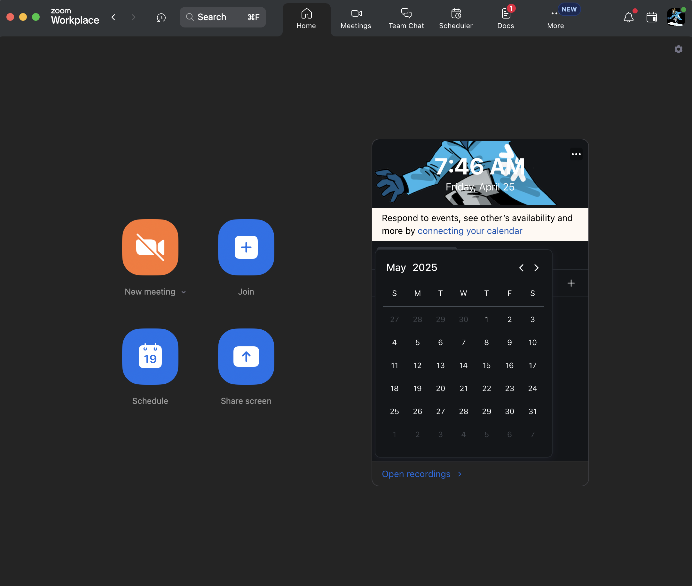

### Step 2
In a terminal window, browse to the cloned repo *sfguide-integrate-snowflake-cortex-agents-with-zoom* folder and run the following commands to create Python environment and install the Python packages and dependencies required for the application.

```bash
python3 -m venv zoomenv
source zoomenv/bin/activate
pip install -r requirements.txt
```

### Step 3
In the same folder, create a `.env` file and add these variables. 

* **NOTE**: Instructions on setting the values will follow so keep this file open/handy.

```bash
ZOOM_ACCOUNT_ID = ""
ZOOM_CLIENT_ID = ""
ZOOM_CLIENT_SECRET = ""
ZOOM_REDIRECT_URI = ""
ZOOM_BOT_JID = ""
SNOWFLAKE_DEMO_USER=""
SNOWFLAKE_ACCOUNT="<your-account-identifier>"
SNOWFLAKE_AGENT_ENDPOINT='https://<your-org>-<your-account>.snowflakecomputing.com/api/v2/cortex/agent:run'
SNOWFLAKE_INFERENCE_ENDPOINT='https://<your-org>-<your-account>.snowflakecomputing.com/api/v2/cortex/inference:complete'

# Only change these values if you used different names than provided in this guide
SUPPORT_SEMANTIC_MODEL='@dash_db.dash_schema.semantic_models/support_tickets_semantic_model.yaml'
SUPPLY_CHAIN_SEMANTIC_MODEL='@dash_db.dash_schema.semantic_models/supply_chain_semantic_model.yaml'
VEHICLE_SEARCH_SERVICE='dash_db.dash_schema.vehicles_info'

# Should not change these values
ZOOM_TOKEN_URL = "https://zoom.us/oauth/token"
ZOOM_CHAT_URL = "https://api.zoom.us/v2/im/chat/messages" 
MODEL = 'claude-4-sonnet'
RSA_PRIVATE_KEY_PATH='rsa_key.p8'
```

### Step 4
In a new terminal window, run `ngrok http 5000`. 

* Before proceeding, make sure it's running and the output should something like the following with a forwarding URL like so `https://9b51-2601-646-8f02-2670-ddd6-ee13-476-441f.ngrok-free.app`

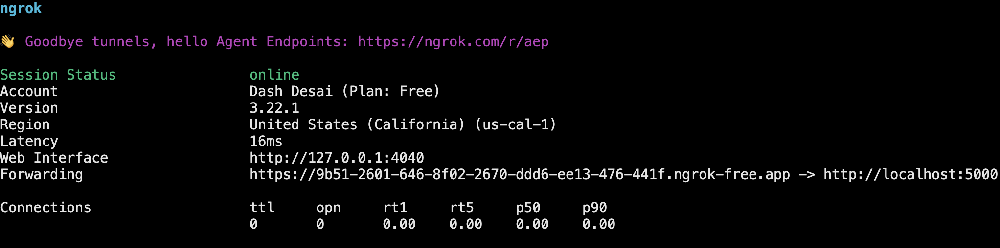

* Copy the forwarding URL and set it for **ZOOM_REDIRECT_URI** in your `.env` file

> 
> NOTE: It is important to keep `ngork` running all the way through until you are done implementing this guide. If for some reason you need to restart `ngork`, you will need to update the forwarding URL in **sub-steps 3, 7, 8** in this section and also **ZOOM_REDIRECT_URI** in your `.env` file.

### Step 5
Log into your [Zoom account](https://www.zoom.com/) on the web.

### Step 6
On the left nav, click on **Admin** >> **App Marketplace**. This should open **Zoom App Marketplace** for your account.

### Step 7
On the top-right, click on **Develop** >> **Build App** and select **General App**

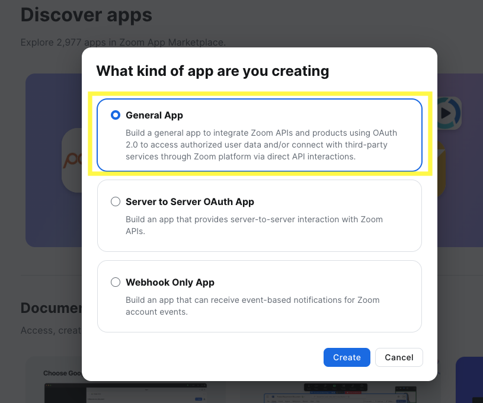

### Step 8
On the left nav, click on **Basic Information** 

* Copy **Client ID** and **Client Secret** and set them for **ZOOM_CLIENT_ID** and **ZOOM_CLIENT_SECRET** in your `.env` file and for **OAuth Redirect URL** set it to the same value as **ZOOM_REDIRECT_URI** as in step 3 above.

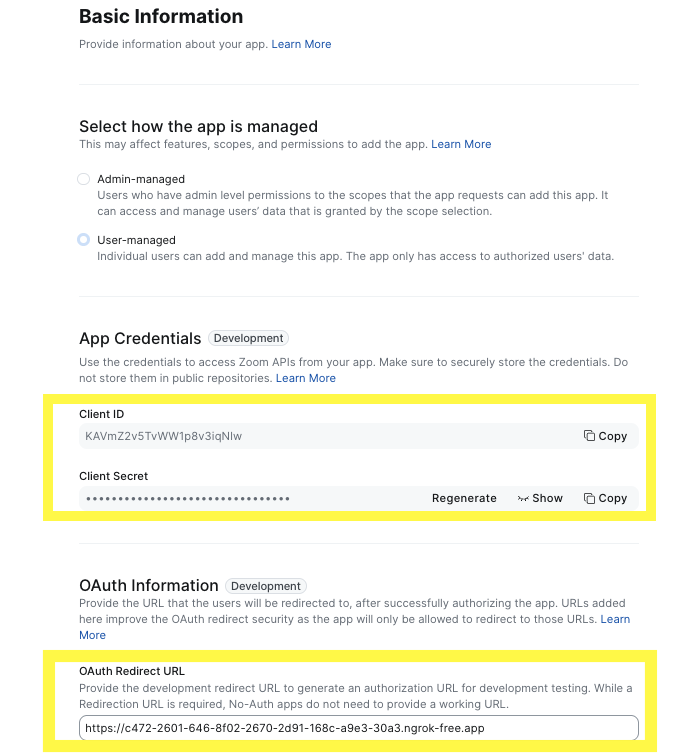

### Step 9
On the left nav, click on **Features** >> **Surface** 

* Select **Team Chat** under "**Select where to use your app**"

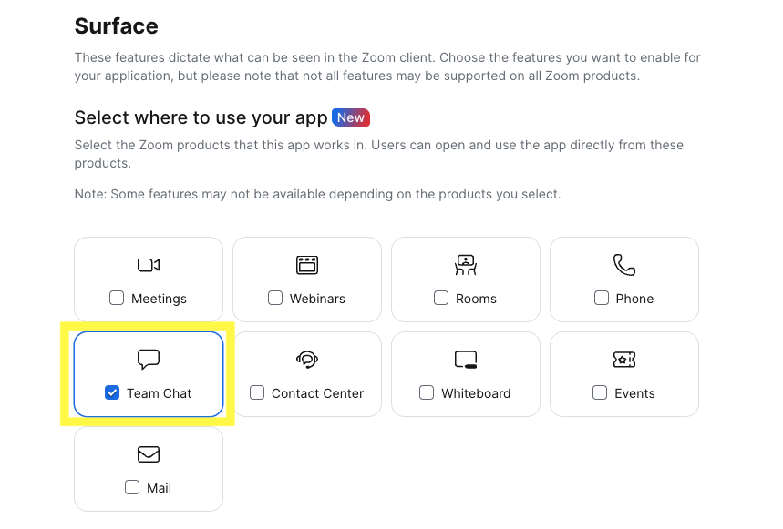

* Scroll down and select/turn ON **Team Chat Subscription**

* Copy **Bot JID** and set it for **ZOOM_BOT_JID** in your `.env` file

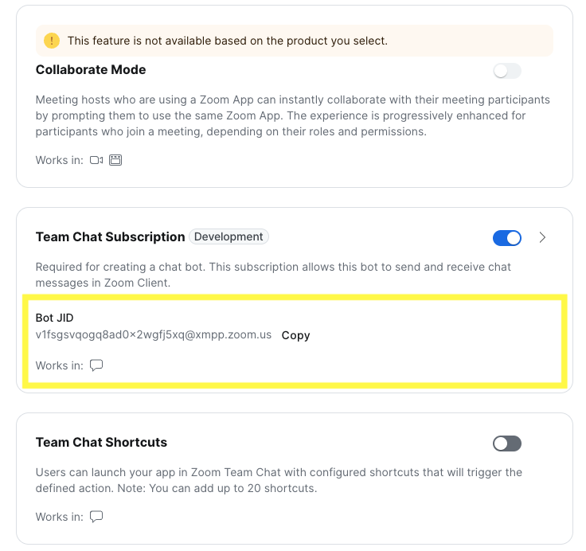

* Click on the dropdown to expand the **Team Chat Subscription** view and set **Bot Endpoint URL** to the same value as **ZOOM_REDIRECT_URI** as in step 3 above and add `/askcortex` suffix.

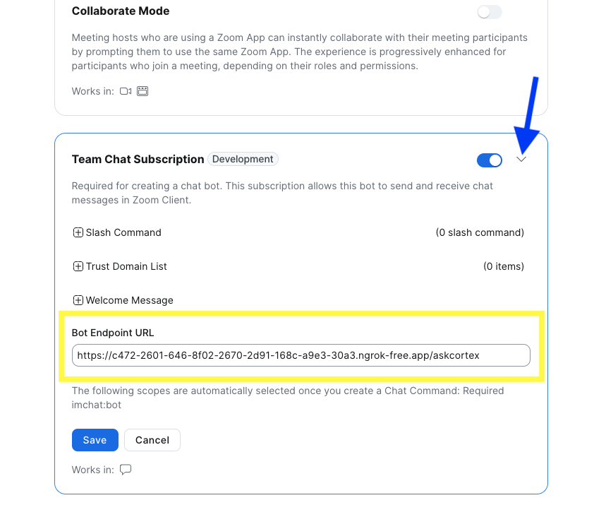

* Click on **Save** button.

### Step 10
On the left nav, click on **Scopes** and add/enable the following scopes:

* imchat:userapp
* app:channel_content:write
* team_chat:write:user_message
* team_chat:write:message_files
* team_chat:write:files
* marketplace:write:notifications
* team_chat:write:user_channel
* team_chat:update:user_channel
* team_chat:delete:user_channel
* team_chat:read:list_user_sessions
* team_chat:read:list_user_messages
* team_chat:read:user_message

## Run Application
<!-- ------------------------ -->


Before proceeding, it is important to make sure that `ngork` is still running. If for some reason you need to restart it, you will need to update the forwarding URL as described in sub-steps 3, 7, 8 in "**Setup Application**" and also **ZOOM_REDIRECT_URI** in your `.env` file.

### Step 1
In the same cloned repo *sfguide-integrate-snowflake-cortex-agents-with-zoom* folder, open a new terminal window and run the following command to start the application.

```bash
./zoom_bot.sh
```

> 
> NOTE: If you get this error `Caused by SSLError(SSLCertVerificationError(1, "[SSL: CERTIFICATE_VERIFY_FAILED] certificate verify failed: Hostname mismatch, certificate is not valid...,` try adding *<locator.region>* to SNOWFLAKE_ACCOUNT in your `.env` file. For additional instructions and help, refer to the [documentation](https://docs.snowflake.com/en/user-guide/admin-account-identifier).

### Step 2
In your Zoom account on the web, navigate back to **Admin** >> **App Marketplace** >> **Zoom App Marketplace** and on the left nav, click on **Add your app** >> **Local Test** >> **Add App Now**

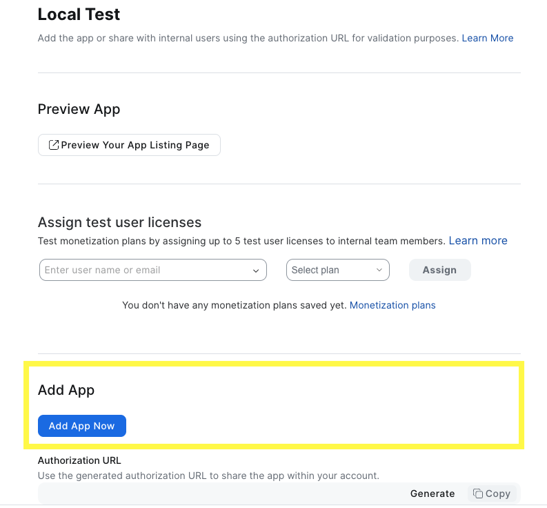

If all goes well, you should see the following popup 

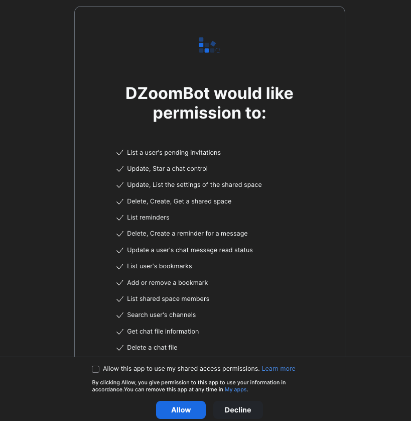

And, clicking on **Allow** should add it to Zoom Workspace running locally,

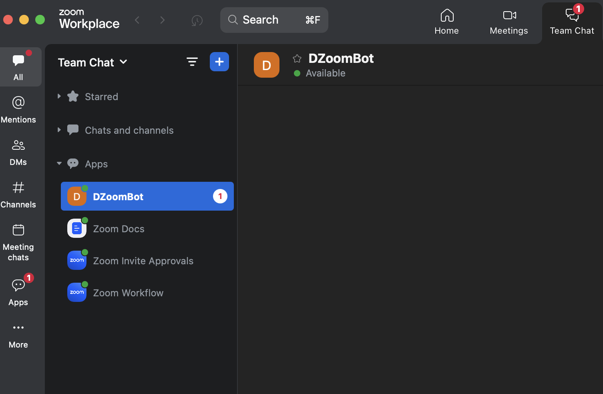

## Get Insights
<!-- ------------------------ -->


### Structured Data

#### Support Tickets

These questions are automatically routed to Cortex Analyst >> SUPPORT_SEMANTIC_MODEL to get insights from SUPPORT_TICKETS table.

**Question:** *Can you show me a breakdown of customer support tickets by service type cellular vs business internet?*

**Question:** *How many unique customers have raised a support ticket with a ‘Cellular’ service type and have ‘Email’ as their contact preference?*

If all goes well, you should see responses similar to the following:

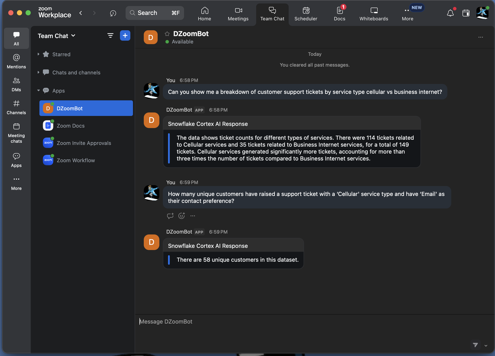

#### Supply Chain

These questions are automatically routed to Cortex Analyst >> SUPPLY_CHAIN_SEMANTIC_MODEL to get insights from SUPPLY_CHAIN table.

**Question:** *What is the average shipping time for tires from Snowtires Automotive compared to average of our other suppliers?*

**Question:** *What about TirePro?*

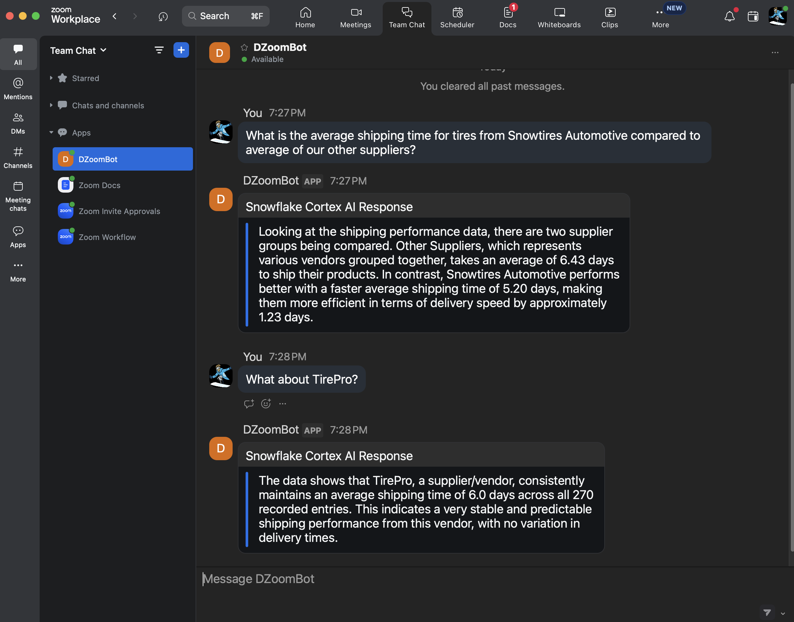

### Unstructured Data

These questions are automatically routed to Cortex Search >> VEHICLE_SEARCH_SERVICE to get insights from the PDFs.

**Question:** *What are the payment terms for Snowtires?*

**Question:** *What's the latest, most effective way to recycle rubber tires?*

If all goes well, you should see responses similar to the following:

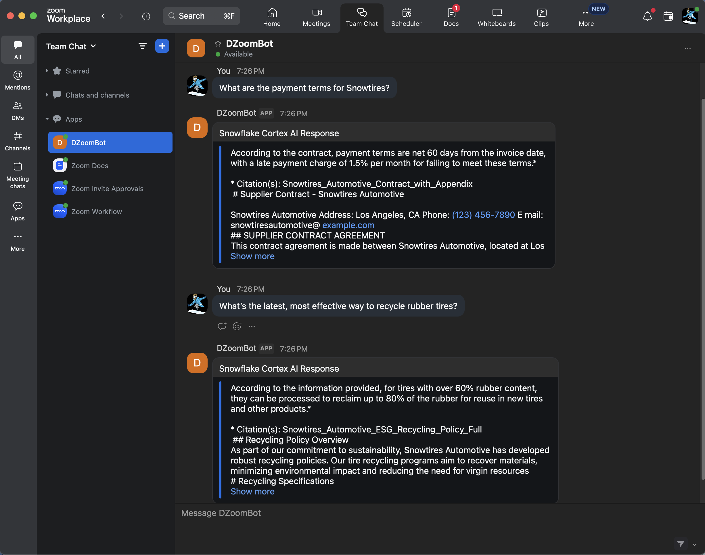


## Code Walkthrough
<!-- ------------------------ -->


As you may have noticed, the main application code is in [app.py](https://github.com/Snowflake-Labs/sfguide-integrate-snowflake-cortex-agents-with-zoom/blob/main/app.py) and the Snowflake Cortex AI code is in [cortex_chat.py](https://github.com/Snowflake-Labs/sfguide-integrate-snowflake-cortex-agents-with-zoom/blob/main/cortex_chat.py).

Here are some things you should make a note of in case you’d like to extend or modify the application.

#### app.py

**init()**

A secure connection to Snowflake is established and an instance of CortexChat is created.

**@app.route('/', methods=['GET'])**

Redirect route that Zoom uses to generate an authorization URL for development and testing purposes.

**@app.route('/askcortex', methods=['POST'])**

Endpoint that sends and receives messages to/from Zoom Team Chat. It calls these methods:

* `CORTEX_APP.chat(prompt)` to get response from Snowflake Cortex Agents
* `parse_agent_response(response)` to parse the Snowflake Cortex Agents response
* `send_chat_message(user_jid, to_jid, agent_response)` to send the parsed response to Zoom Team Chat 

**parse_agent_response()**

Parses response return by Snowflake Cortex Agents. If the response includes a SQL, in case of structured data, it executes the SQL and then calls `CORTEX_APP.data_to_answer(df.to_string())` to translate the dataframe into natural language.

#### cortex_chat.py

**_retrieve_response()**

Notice that we've set up and provided two semantic models to the Cortex Agents REST API via `tool_spec > type: "cortex_analyst_text_to_sql"`; one to extract insights from **SUPPORT_TICKETS** and another one from **SUPPLY_CHAIN** structured data sources. Similarly, you may set up additional semantic models as well as multiple search services via `tool_spec > type: "cortex_search"`.

**data_to_answer()**

Translates the dataframe into natural language. This is done using Snowflake Cortex Inference API with prompt `Extract and explain the data in the following dataframe in natural language. Only output the explanation and nothing else.`

## Conclusion And Resources
<!-- ------------------------ -->


Congratulations! You've sucessfully integrated Snowflake Cortex AI in Zoom. I hope you found this guide both educational and inspiring.

### What You Learned

* How to setup Cortex Analyst
* How to setup Cortext Search 
* How to use Cortex Agents and Cortex Inference REST APIs and integrate it in Zoom Team Chat

### Related Resources

* [GitHub repo](https://github.com/Snowflake-Labs/sfguide-integrate-snowflake-cortex-agents-with-zoom)
* [Cortex Agents](https://docs.snowflake.com/en/user-guide/snowflake-cortex/cortex-agents)
* [Cortex Analyst](https://docs.snowflake.com/en/user-guide/snowflake-cortex/cortex-analyst)
* [Cortex Search](https://docs.snowflake.com/en/user-guide/snowflake-cortex/cortex-search/cortex-search-overview)
* [Cortex Inference](https://docs.snowflake.com/en/user-guide/snowflake-cortex/cortex-llm-rest-api)

