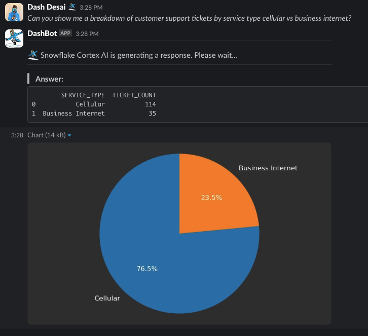
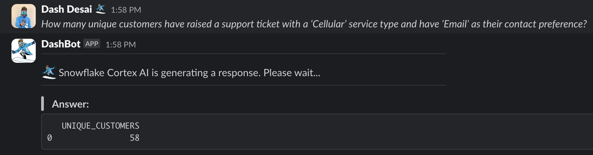
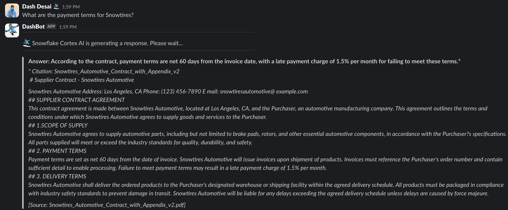
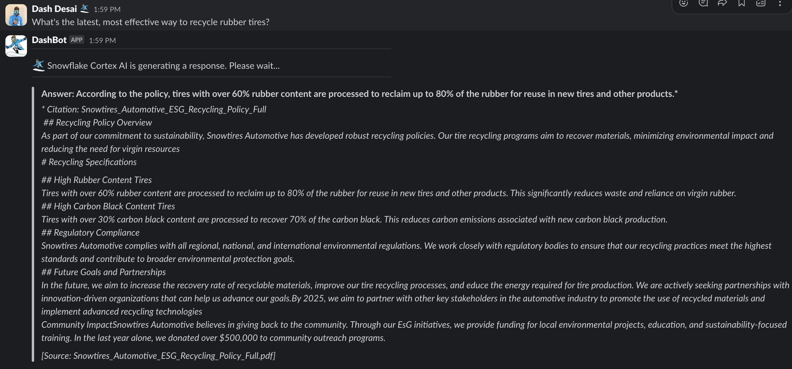

id: integrate_snowflake_cortex_agents_with_slack
summary: This guide outlines the process for integrating Snowflake Cortex Agents with Slack.
environments: web
status: Published
feedback link: <https://github.com/Snowflake-Labs/sfguides/issues>
tags: Getting Started, Snowpark Python, Data-Science-&-Ai, Featured
authors: Dash Desai

# Getting Started with Cortex Agents and Slack
<!-- ------------------------ -->

## Overview

Duration: 5

Cortex Agents simplify AI-powered data interactions via a REST API, combining hybrid search and accurate SQL generation. They streamline workflows by managing context retrieval, natural language to SQL conversion, and LLM orchestration. Response quality is enhanced with in-line citations, answer abstention, and multi-message context handling. Developers benefit from a single API call integration, real-time streamed responses, and reduced latency for optimized applications.

In this guide, we will see how to integrate the Cortex Agents (*in Public Preview as of 01/12/2025*) with Slack.

### Why Cortex Agents?

Business users have typically relied on BI dashboards and reports for data
insights, but these tools often lack flexibility, requiring users to wait on
busy data analysts for updates. Cortex Agents addresses this with a natural
language interface allowing organizations to develop conversational applications. This enables business
users to query data in natural language and get accurate answers in near real
time. 

Learn more about [Cortex Agents](https://docs.snowflake.com/user-guide/snowflake-cortex/cortex-agents?_fsi=THrZMtDg,%20THrZMtDg&_fsi=THrZMtDg,%20THrZMtDg).

### Why Slack?

Slack is a communication and collaboration platform designed to streamline
workplace interactions. It allows teams to organize conversations by channels,
send direct messages, share files, and integrate with other tools for a
seamless workflow. Slack also supports the deployment of bots and apps, making
it a hub for productivity, quick information sharing, and team alignment
across projects.

### Prerequisites

* A Snowflake account in one of these [regions](https://docs.snowflake.com/user-guide/snowflake-cortex/cortex-agents?_fsi=THrZMtDg,%20THrZMtDg&_fsi=THrZMtDg,%20THrZMtDg#availability) and also where [PARSE_DOCUMENT](https://docs.snowflake.com/en/user-guide/snowflake-cortex/parse-document#label-parse-document-regional-availability) is available. If you do not have one you can register for a [free trial account](https://signup.snowflake.com/?utm_cta=quickstarts_).
* A Slack account with access to a workspace where you can install applications. **_NOTE_** _: Slack recommends using a workspace where you won’t disrupt real work getting done —_[ _you can create a new one for free_](https://slack.com/get-started#create) _._
* Python version >= 3.8, < 3.13

### What You Will Learn

* How to setup Slack application
* How to setup Cortex Analyst
* How to setup Cortext Search 
* How to use Cortex Agents REST API and integrate it with Slack

### What You Will Build

Cortex Agents integrated with Slack

## Setup Slack
<!-- ------------------------ -->

Duration: 10

Follow instructions in this [step-by-step guide](https://tools.slack.dev/bolt-python/getting-started/) to create and set up your barebones Slack application in Python. 

***NOTE: You may skip the section titled “[Sending and responding to actions](https://tools.slack.dev/bolt-python/getting-started/#sending-and-responding-to-actions)” because we won’t be using that in our application.***

Before proceeding, please make sure you have the boilerplate Slack application running as shown in the above guide.

```python
@app.message("hello")  
def message_hello(message, say):  
  # say() sends a message to the channel where the event was triggered  
  say(f"Hey there <@{message['user']}>!")  
  
# Start your app  
if __name__ == "__main__":  
  SocketModeHandler(app, os.environ["SLACK_APP_TOKEN"]).start()
```

## Setup Snowflake
<!-- ------------------------ -->

Duration: 10

**Step 1:** Clone the [GitHub repo](https://github.com/Snowflake-Labs/sfguide-integrate-snowflake-cortex-agents-with-slack).

**Step 2:** In Snowsight, [create a SQL Worksheet](https://docs.snowflake.com/en/user-guide/ui-snowsight-worksheets-gs?_fsi=THrZMtDg,%20THrZMtDg&_fsi=THrZMtDg,%20THrZMtDg#create-worksheets-from-a-sql-file) and open [setup.sql](https://github.com/Snowflake-Labs/sfguide-integrate-snowflake-cortex-agents-with-slack/blob/main/setup.sql) to execute all statements in order from top to bottom. This is to to create a database, schema, and table **SUPPORT_TICKETS** with data loaded from AWS S3. And also to create Snowflake managed internal stages for store the semantic model specification file and PDF documents.

**Step 3:** Use [Snowsight](https://docs.snowflake.com/en/user-guide/data-load-local-file-system-stage-ui#upload-files-onto-a-named-internal-stage) to upload [the semantic model spec file](https://github.com/Snowflake-Labs/sfguide-integrate-snowflake-cortex-agents-with-slack/blob/main/support_tickets_semantic_model.yaml) to the **DASH_SEMANTIC_MODELS** stage.

**Step 4:** Use [Snowsight](https://docs.snowflake.com/en/user-guide/data-load-local-file-system-stage-ui#upload-files-onto-a-named-internal-stage) to upload [PDF documents](https://github.com/Snowflake-Labs/sfguide-integrate-snowflake-cortex-agents-with-slack/tree/main/data) to the **DASH_PDFS** stage.

**Step 5:** In Snowsight, [create a SQL Worksheet](https://docs.snowflake.com/en/user-guide/ui-snowsight-worksheets-gs?_fsi=THrZMtDg,%20THrZMtDg&_fsi=THrZMtDg,%20THrZMtDg#create-worksheets-from-a-sql-file) and open [cortex_search_service.sql](https://github.com/Snowflake-Labs/sfguide-integrate-snowflake-cortex-agents-with-slack/blob/main/cortex_search_service.sql) to execute all statements in order from top to bottom. This is to create a Cortex Search service for getting insights from the PDF documents. *NOTE: [PARSE_DOCUMENT](https://docs.snowflake.com/en/user-guide/snowflake-cortex/parse-document#label-parse-document-regional-availability) is in Public Preview as of 01/12/2025.*

**Step 6:** Configure [key-pair authentication](https://docs.snowflake.com/user-guide/key-pair-auth#configuring-key-pair-authentication) and assign the public key to your user in Snowflake and store/save/copy the private key file (**_.p8_**) in your cloned app folder.

> aside negative
> IMPORTANT: If you use different names for objects created in this section, be sure to update scripts and code in the following sections accordingly.

## Setup Application
<!-- ------------------------ -->

Duration: 5

**Step 1:** Change or browse to the cloned repo folder **_sfguide-integrate-snowflake-cortex-agents-with-slack_** on your local machine and open the contents of the folder in your favorite IDE — like VS Code.

**Step 2:** In the same folder, create a new file **.env** and set the following environment variables:

```bash 
DEMO_DATABASE='DASH_DB'
DEMO_SCHEMA='DASH_SCHEMA'
WAREHOUSE='DASH_S'
DEMO_USER='<your-user-name>'
DEMO_USER_ROLE='<your-user-role>'
SEMANTIC_MODEL='@DASH_DB.DASH_SCHEMA.DASH_SEMANTIC_MODELS/support_tickets_semantic_model.yaml'
SEARCH_SERVICE='DASH_DB.DASH_SCHEMA.vehicles_info'
ACCOUNT='<your-account-identifier>'
HOST='<your-account-identifier>.snowflakecomputing.com'
AGENT_ENDPOINT='https://<your-org>-<your-account>.snowflakecomputing.com/api/v2/cortex/agent:run'
SLACK_APP_TOKEN='<your-slack-app-token>'
SLACK_BOT_TOKEN='<your-slack-bot-token>'
      
# You may NOT edit below values  
RSA_PRIVATE_KEY_PATH='rsa_key.p8'
MODEL = 'claude-3-5-sonnet'
```

> aside negative
> NOTE: If you get this error *Caused by SSLError(SSLCertVerificationError(1, “[SSL: CERTIFICATE_VERIFY_FAILED] certificate verify failed: Hostname mismatch, certificate is not valid...*, try adding *<locator.region>*. For additional instructions and help with setting **your-account-identifier**, refer to the [documentation](https://docs.snowflake.com/en/user-guide/admin-account-identifier).

**Step 3:** In a terminal window, browse to the same cloned folder **_sfguide-integrate-snowflake-cortex-agents-with-slack_** and run the following commands to create Python environment and install the Python packages and dependencies required for the application.

```bash
python3 -m venv .venv  
source .venv/bin/activate  
pip install -r requirements.txt
```

**Step 4:** Browse to your **Slack App** >> navigate to **OAuth & Permissions** on the left >> scroll down to **Scopes**, and then add `files:write` by clicking on **Add an OAuth Scope** button. This is required by the app to generate, save, and display chart image files.

## Run Application
<!-- ------------------------ -->

Duration: 4

Browse to the cloned repo folder ***sfguide-integrate-snowflake-cortex-agents-with-slack*** in a terminal window where you executed the commands in the previous section and start the application by running the following command.

```bash
./slack_bot
```

If all goes well, you should see the following output on the command line.

```bash
⚡️ Bolt app is running!
```

### Common Errors

When you run the application as instructed, you may run into some of these common issues.

```bash
Error: Caused by SSLError(SSLCertVerificationError(1, “[SSL: CERTIFICATE_VERIFY_FAILED] certificate verify failed: Hostname mismatch, certificate is not valid...
```

```bash
Error: snowflake.connector.errors.InterfaceError: 250003 (08001): 404 Not Found: post https://xxxxx.snowflakecomputing.com:443/session/v1/login-request?request_id=b4e367d4-d8ac-48d3-8e44-96f42defa9c5&request_guid=4f63e07c-e42c-43b8-8f79-f6c577ee0d0e
```

> aside negative
> NOTE: If you get the above errors, make sure the ACCOUNT and HOST variables in the **_.env_** file are set correctly. For additional instructions and help, refer to the [documentation](https://docs.snowflake.com/en/user-guide/admin-account-identifier).

## Slack It To Me
<!-- ------------------------ -->

Duration: 5

Assuming your app is running without any errors, head over to your Slack channel/app you set up in the **Setup Slack** section and ask the following questions.

### Cortex Analyst: Structured Data

**Question:** *Can you show me a breakdown of customer support tickets by service type cellular vs business internet?*

In a few moments, you should see the following response:



Now let’s ask this question.

**Question:** *How many unique customers have raised a support ticket with a ‘Cellular’ service type and have ‘Email’ as their contact preference?*

In a few moments, you should see the following response:



### Cortex Search: Unstructured Data

**Question:** *What are the payment terms for Snowtires?*

In a few moments, you should see the following response:



Now let’s ask this question.

**Question:** *What's the latest, most effective way to recycle rubber tires?*

In a few moments, you should see the following response:



As you can see, now (business) users can directly get answers to their questions written in natural language using the Slack app.

### Code Walkthrough

As you may have noticed, the main application code is in [app.py](https://github.com/Snowflake-Labs/sfguide-integrate-snowflake-cortex-agents-with-slack/blob/main/app.py) and the Cortex agent REST API code is in [cortex_chat.py](https://github.com/Snowflake-Labs/sfguide-integrate-snowflake-cortex-agents-with-slack/blob/main/cortex_chat.py).

Here are some things you should make a note of in case you’d like to extend or modify the application.

**init()**

In this method, a secure connection to Snowflake is established and an instance of **CortexChat** is created. This CortexChat instance is initialized with AGENT_ENDPOINT, SEARCH_SERVICE, SEMANTIC_MODEL, MODEL, and a Java Web Token (JWT). 

**handle_message_events()**

This method is decorated with `@app.event("message")` and is invoked when you type a question in Slack. After displaying the initial message, it calls **ask_agent()** passing it the question in variable `prompt`. Then it calls **display_agent_response()** passing it the response from 

**ask_agent()**

This method is called from **handle_message_events**. It use the instance of **CortexChat** to call **chat()** method. This methods internally calls **_retrieve_response()**, **_parse_response()** and other methods to retrieve and parse the Cortex Agent response. 

**display_agent_response()**

This method is called from **handle_message_events.** It takes the response from **ask_agent()** and sends the formatted output to Slack.

NOTE: The response from Cortex Agents REST API includes the SQL query that is generated based on the natural language prompt/question passed in as input. This SQL query is executed in the application (*line 125 in app.py*) to display the results in Slack.

**plot_chart()**

This method takes a Pandas DataFrame as an input and dynamically generates a pie chart. 

NOTE: While the code to generate the chart is very specific to the data used in this example, the flow/logic is broadly applicable.

* A chart is generated based on the data
* The chart image is saved locally — *line 237 in app.py*
* The image file is securely uploaded to Slack using Slack APIs [getUploadURLExternal](https://api.slack.com/methods/files.getUploadURLExternal) and [completeUploadExternal](https://api.slack.com/methods/files.completeUploadExternal)
* The permalink provided by Slack is used to access / display the image — *line 176 in app.py*

## Conclusion And Resources
<!-- ------------------------ -->

Duration: 1

Congratulations! You've sucessfully integrated Cortex Agents with Slack. I hope you found this guide both educational and inspiring.

### What You Learned

* How to setup Slack application
* How to setup Cortex Analyst
* How to setup Cortext Search 
* How to use Cortex Agents REST API and integrate it with Slack

### Related Resources

  * [GitHub repo](https://github.com/Snowflake-Labs/sfguide-integrate-snowflake-cortex-agents-with-slack)
  * [Cortex Agents](https://docs.snowflake.com/en/user-guide/snowflake-cortex/cortex-agents)
  * [Cortex Analyst](https://docs.snowflake.com/en/user-guide/snowflake-cortex/cortex-analyst)
  * [Cortex Search](https://docs.snowflake.com/en/user-guide/snowflake-cortex/cortex-search/cortex-search-overview)

