author: Security Field CTO Team
id: integrating_fluentd_with_snowflake
summary: Walkthrough of using Fluentd to send system event logs to Snowflake as a part of a SIEM or log storage solution
categories: cybersecurity
environments: web
status: Published 
feedback link: https://github.com/Snowflake-Labs/sfguides/issues
tags: SIEM, Data Governance

# Integrating Fluentd With Snowflake
<!-- ------------------------ -->
## Overview 
Duration: 1

This Quickstart shows how to use Fluentd to send system event logs to Snowflake for use as a SIEM or log storage. Fluentd is open-source software that parses event logs, application logs, and clickstreams, converts the semi- or un-structured data to structured data, and stores the structured data in an S3 bucket.
For details about Fluentd, see: [https://www.fluentd.org/](https://www.fluentd.org/)

This Quickstart provides the configuration steps needed to successfully set up this integration. We use Apache HTTP Server to generate access log files and upload them as gzip files to the S3 external stage. Next, we set up Snowpipe to retrieve the gzip files from the external stage. Finally we use Snowsight to visualize log events.

> aside positive 
>
> Note: There is not currently a plug-in that Fluentd can use to directly connect to the Snowflake internal stage, so Fluentd puts processed data in the Snowflake external stage where Snowpipe auto-ingests it.


### What You’ll Learn 
- How to deploy Apache2 on a target server (Amazon Linux)
- How to deploy the Fluentd agent (td-agent) on a target server
- How to set up an external stage on Snowflake
- How to set up Snowpipe to retrieve data from the external stage

### Prerequisites
Prior to starting you should:
- Create a Snowflake Account
- Configure AWS VPC settings, like subnet / security rules
- Deploy the bastion host on the AWS VPC
- Deploy the S3 bucket, create an IAM role, and get the access key and secret key


### Fluentd + Snowflake Integration Architecture
 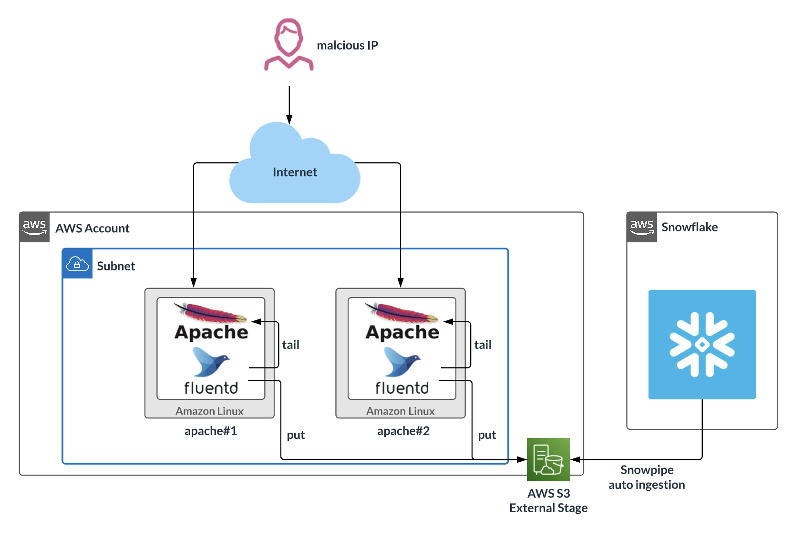

> aside positive 
>
> Note: In this scenario, the Apache server instances are internet-facing, so anyone can access it

### References
- [Configuring Secure Access to Amazon S3 (Snowflake Product Documentation)](https://docs.snowflake.com/en/user-guide/data-load-s3-config.html)
- [Creating a New S3 Event Notification to Automate Snowpipe (Snowflake Product Documentation)](https://docs.snowflake.com/en/user-guide/data-load-snowpipe-auto-s3.html#option-1-creating-a-new-s3-event-notification-to-automate-snowpipe)
- [CIS Apache HTTP Server Benchmarks](https://www.cisecurity.org/benchmark/apache_http_server)
- [CVE Records for Apache HTTP Server](https://cve.mitre.org/cgi-bin/cvekey.cgi?keyword=Apache%20HTTP%20server)
- [https://docs.hunters.ai/wiki/fluentd](https://docs.hunters.ai/wiki/fluentd)

<!-- ------------------------ -->
## Deploy Apache2 on the target server (Amazon Linux)
Duration: 2

After deploying Amazon Linux from the official AWS AMI, log in to Linux:

* **Username:** ec2-user
* **Key-pair:** Use the key-pair file that was created for this instance 

Ensure that the security group configuration only has the necessary ports open.

Install Apache2, start the service, and set up auto-run:

``` bash
sudo yum update
sudo yum -y install httpd
sudo systemctl start httpd.service
sudo systemctl enable httpd.service
```

Create a test web page:

``` bash
sudo sh -c 'echo "hello world" > /var/www/html/index.html'
```

Open a browser and enter the target server's IP address in the address bar. You should see a page similar to the following with the text "hello world!!"

 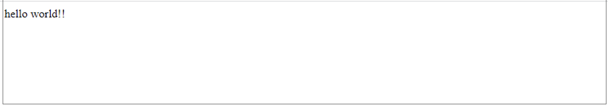

Run the following command to verify that the access log shows recent access:
``` bash
 sudo cat /var/log/httpd/access_log
 ```

---


<!-- ------------------------ -->
## Deploy the Fluentd agent (td-agent) on the target server
Duration: 2

Install Fluentd, start the service, and set up auto-run:
``` bash
curl -L https://toolbelt.treasuredata.com/sh/install-amazon2-td-agent4.sh | sh
sudo systemctl start td-agent.service
```

Change the permissions for the `httpd` file and folder to allow Fluentd to retrieve access logs:
``` bash
sudo chmod o+rx /var/log/httpd/
sudo chmod o+rx /var/log/httpd/*
```


Create a buffer folder to upload data to S3:
``` bash
sudo mkdir /var/log/td-agent/s3
sudo chown td-agent:td-agent /var/log/td-agent/s3
```


Open the Fluentd configuration file:
``` bash
sudo vi /etc/td-agent/td-agent.conf
```

Paste the following command into the file and update the S3 bucket information:
```xml
<source>
  @type tail
  path /var/log/httpd/access_log
  pos_file /var/log/td-agent/apache2.access_log.pos
  <parse>
    @type apache2
  </parse>
  tag s3.apache.access
</source>
<match s3.*.*>
  @type s3
  aws_key_id [AWS Access Key]
  aws_sec_key [AWS Secret key]
  s3_bucket [S3 Bucket Name, Ex:masaya-s3-northeast-1-external-stage]
  path logs/

  <buffer>
    @type file
    path /var/log/td-agent/s3
    timekey 60  # 1 min
    timekey_wait 1m
    chunk_limit_size 256m
  </buffer>

  time_slice_format %Y%m%d%H
</match>
```

Reboot Fluentd:
``` bash
sudo service td-agent restart
```


Confirm that the Apache access logs were uploaded to S3 as gzip files. This may take a few minutes.

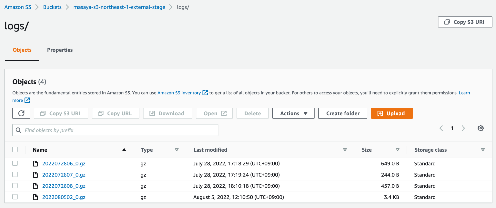

The data should look similar to the following (CSV, tabs are the delimiters):
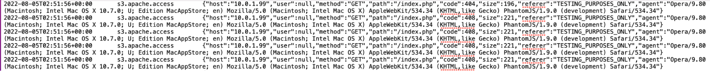


<!-- ------------------------ -->
## Set up the external stage on Snowflake
Duration: 2

Use an IAM role that can retrieve data from S3 to create a storage integration.
To get the `STORAGE_AWS_ROLE_ARN`, see [Configuring Secure Access to Amazon S3](https://docs.snowflake.com/en/user-guide/data-load-s3-config.html) and complete the steps.

```bash
use role accountadmin;
create STORAGE INTEGRATION s3_int_fluentd
  TYPE = EXTERNAL_STAGE
  STORAGE_PROVIDER = S3
  ENABLED = TRUE
  STORAGE_AWS_ROLE_ARN = 'arn:aws:iam::xx:role/[RoleName]'
  STORAGE_ALLOWED_LOCATIONS = ('s3://masaya-s3-northeast-1-external-stage/logs/')
;

DESC INTEGRATION s3_int_fluentd;
```

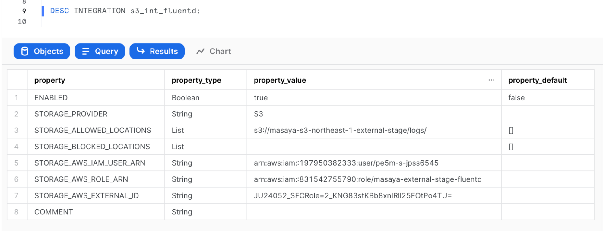


Create the external stage:
```
create stage fluentd_stage
  url = 's3://[BUCKET_NAME]/logs/'
  storage_integration = s3_int_fluentd
;
```

Verify that Snowflake can list S3 files:
```
list @fluentd_stage;
```

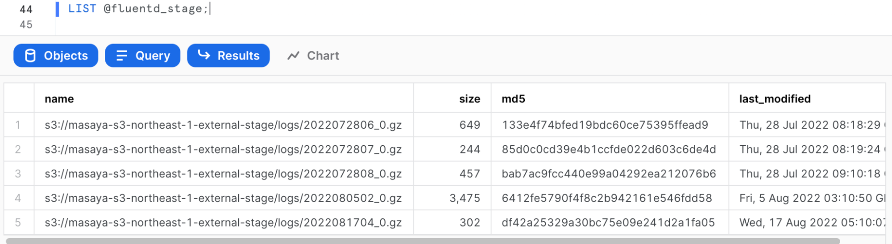


Create the file format (Fluentd’s delimiter is the tab = \t):
```
create or replace file format fluentd_format
  type = csv
  field_delimiter = '\t'  
  compression=gzip
;
```

Create a table:
```
create table public.logs(
  time DATETIME,
  tag STRING,
  record VARIANT
);
```

Test the injection from the external stage:
```
copy into public.logs
  from @fluentd_stage
  file_format = (format_name = fluentd_format);
```


Select the data:
```
select * from public.logs;
```

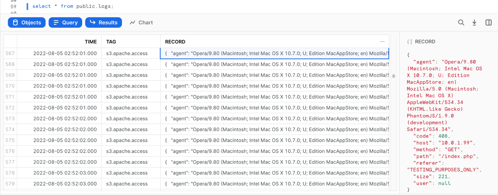

The parsed log should be stored as JSON in the “RECORD” column.


<!-- ------------------------ -->
## Set up Snowpipe to retrieve data from the External Stage
Duration: 2

Configure Snowflake Snowpipe:
```sql
create pipe fluentd.public.mypipe auto_ingest=true as
  copy into fluentd.public.logs
  from @fluentd.public.fluentd_stage
  file_format = fluentd.public.fluentd_format
;
```

Run `show pipes` to retrieve the SQS queue ARN:

``` sql
show pipes;
```

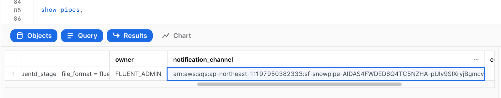


Set up the S3 bucket by following these steps: [Enabling and configuring event notifications using the Amazon S3 console](https://docs.aws.amazon.com/AmazonS3/latest/userguide/enable-event-notifications.html).
Choose **Target Bucket** > **Open property**. Select **Create Event notification**.

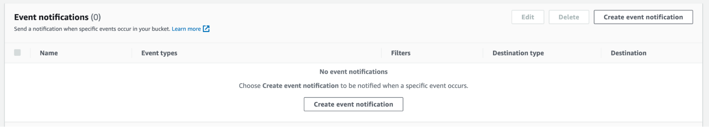

Complete the form:
- **Name**: Type a name for the event notification (_e.g._ Auto-ingest Snowflake)
- **Prefix** (Optional): Specify a Prefix value to only receive notifications when files are added to a specific folder (for example, logs/)
- **Event types**: Select the option for **ObjectCreate (All)**
- **Send to**: Select **SQS Queue** 
- **SQS**: Select **Add SQS queue ARN**
- **SQS queue ARN**: Paste the SQS queue name from the SHOW PIPES output

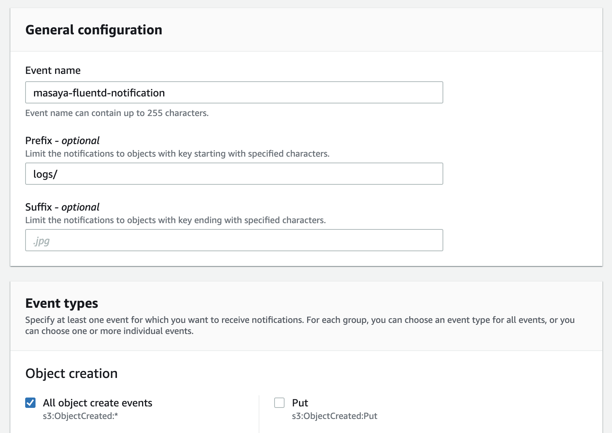


The event notification has been created:

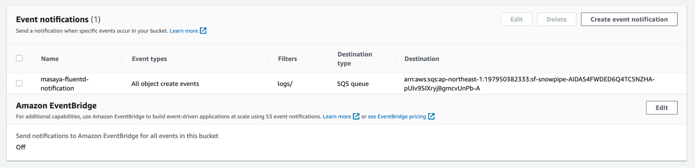


Refresh Snowpipe to retrieve any unloaded files, then un the `select` command to load unloaded data:

``` sql
alter pipe mypipe refresh;
select * from public.logs;
```

After awhile, data may be injected automatically:

``` sql
select * from public.logs order by TIME DESC;
```

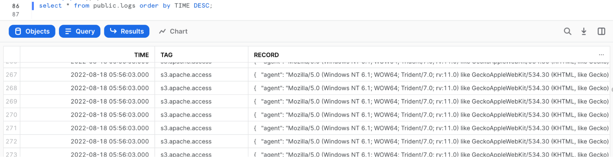


To verify that Snowpipe worked properly, run the following:

``` sql
use role accountadmin;
select *
  from table(snowflake.information_schema.pipe_usage_history(
    date_range_start=>dateadd('day',-14,current_date()),
    date_range_end=>current_date(),
    pipe_name=>'fluentd.public.mypipe'));
```

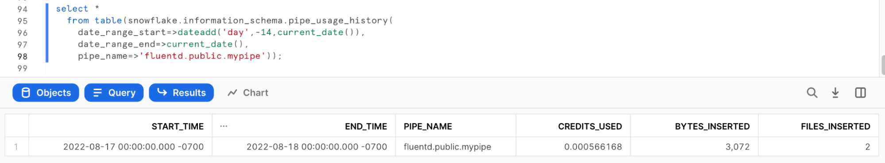


<!-- ------------------------ -->
## Set up Snowsight to visualize log events
Duration: 1

Since parsed logs are stored as JSON in the `RECORD` column, you can set up Snowsight to visualize log events.

**Example 1:** To make a Snowsight dashboard, paste the following code:
``` sql
SELECT
    time,
    RECORD:agent,
    RECORD:code,
    RECORD:host,
    RECORD:method,
    RECORD:path,
    RECORD:referer,
    RECORD:size,
    RECORD:user
FROM
    fluentd.public.logs
WHERE time > (select dateadd(day, -1, getdate()));
;
```

**Example 2:** TIME count = Bar, TIME none = X-Axis

Web Server Access History per Hour
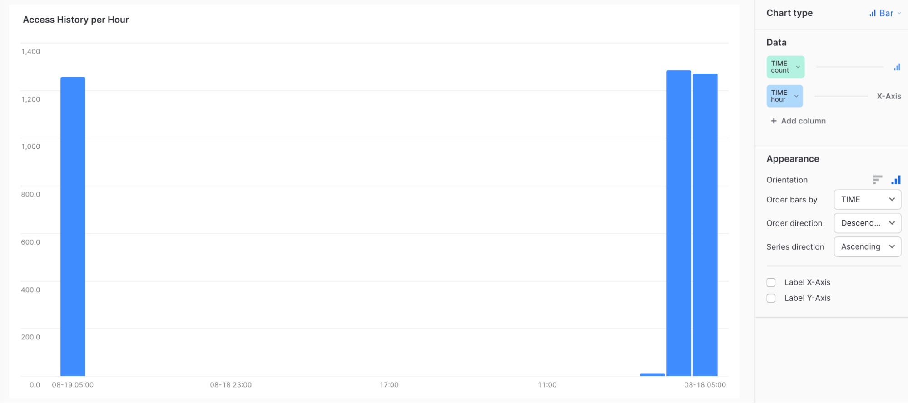

**Example 3:** TIME count = Bar, RECORD:HOST none = X-Axis
Source IP List

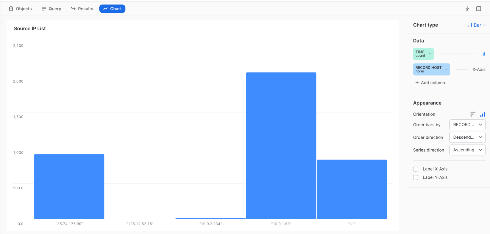


**Example 4:** TIME count = Bar, RECORD:HOST none = Series, RECORD:CODE none = X-Axis
Response Code & Source IP

**Example 5:** Code 408 is connection time out = maybe DDOS or CPU shortage.

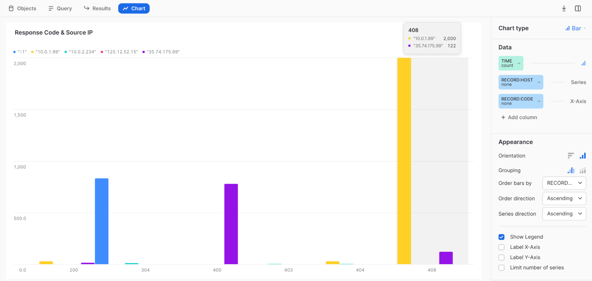