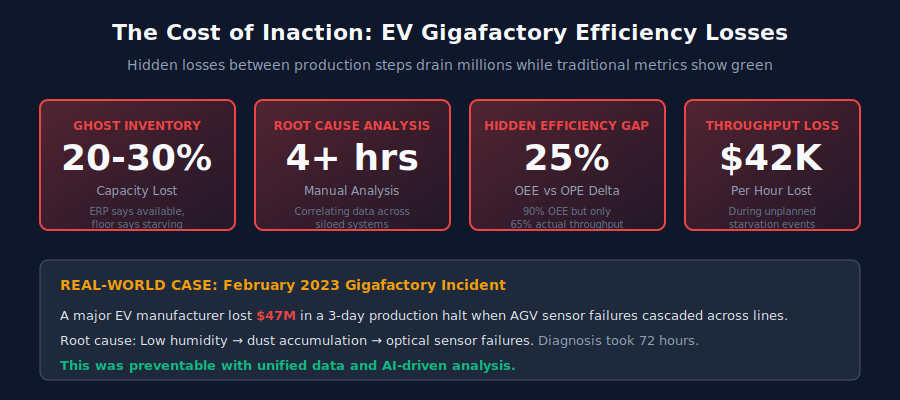
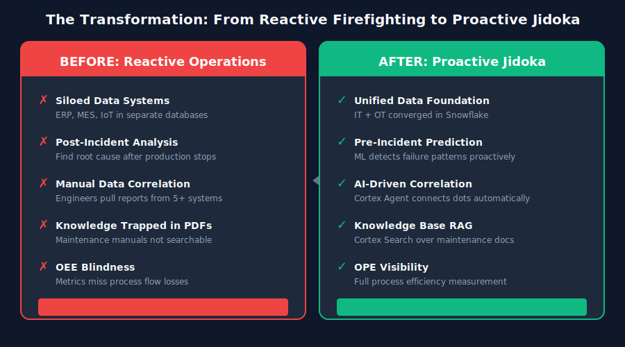
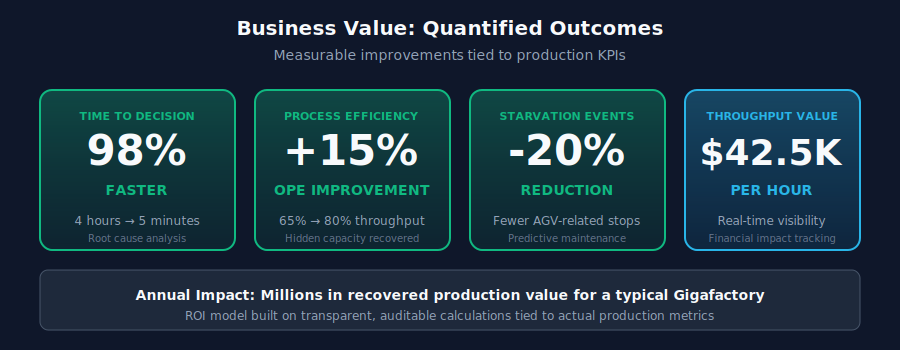
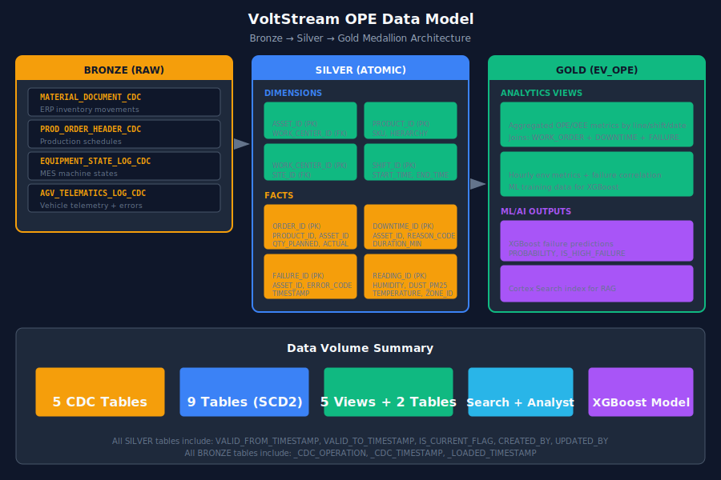
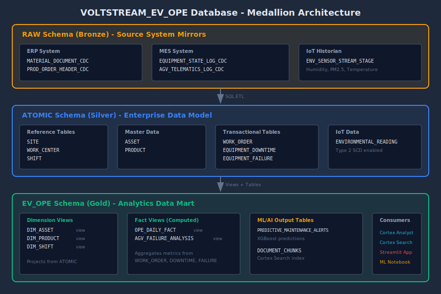
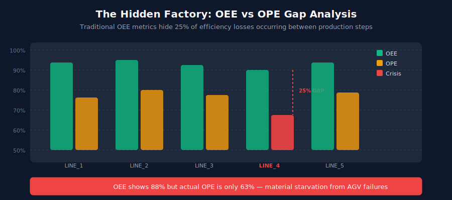
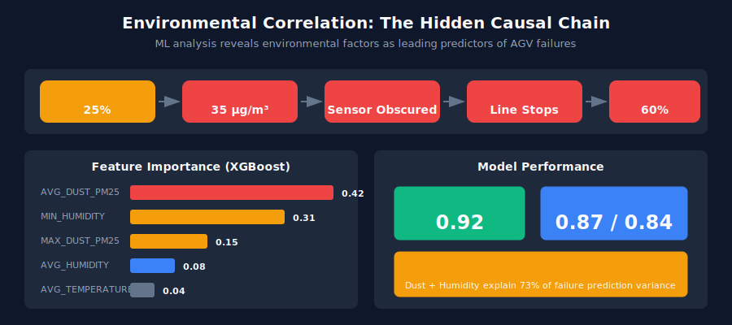
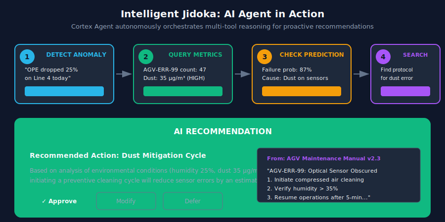
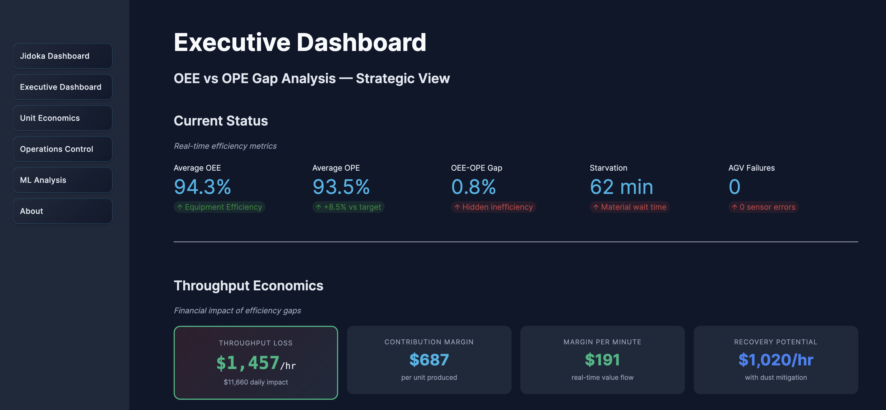

author: Tripp Smith, Dureti Shemsi
id: intelligent-jidoka-system-for-ev-manufacturing
language: en
summary: AI-powered Overall Process Efficiency platform for EV Gigafactory manufacturing, built on Snowflake Cortex with predictive maintenance, natural language analytics, and autonomous Jidoka intelligence
categories: snowflake-site:taxonomy/product/ai, snowflake-site:taxonomy/product/analytics, snowflake-site:taxonomy/snowflake-feature/applied-analytics, snowflake-site:taxonomy/snowflake-feature/cortex-llm-functions, snowflake-site:taxonomy/snowflake-feature/cortex-analyst, snowflake-site:taxonomy/snowflake-feature/cortex-search, snowflake-site:taxonomy/snowflake-feature/snowflake-intelligence, snowflake-site:taxonomy/snowflake-feature/model-development, snowflake-site:taxonomy/snowflake-feature/unstructured-data-analysis, snowflake-site:taxonomy/snowflake-feature/snowpark, snowflake-site:taxonomy/industry/manufacturing, snowflake-site:taxonomy/solution-center/certification/certified-solution
environments: web
status: Published
feedback link: https://github.com/Snowflake-Labs/sfguides/issues
fork repo link: https://github.com/Snowflake-Labs/sfguide-intelligent-jidoka-system-for-ev-manufacturing

# Intelligent Jidoka System for EV Manufacturing

## Overview

 VoltStream OPE is an AI-powered manufacturing intelligence platform for EV Gigafactories, built entirely on Snowflake. It bridges the gap between Overall Equipment Effectiveness (OEE) and Overall Process Efficiency (OPE)- the hidden efficiency loss that exists between machines, in material queues, and across logistics gaps. Cortex Analyst, Cortex Search, and a Cortex Agent work together to deliver autonomous Jidoka intelligence: detecting failures before they cascade, correlating root causes across structured and unstructured data, and recommending corrective actions in minutes instead of hours.

## The Business Challenge

### The $47M Preventable Failure

In February 2023, a leading EV manufacturer's Gigafactory experienced a three-day production halt when AGV sensor failures cascaded across multiple assembly lines. Root cause analysis took 72 hours — identifying that low humidity had caused dust accumulation on optical sensors. The failure cost $47M in delayed shipments and emergency repairs.

This was preventable. Environmental data existed in IoT systems, failure patterns were visible in MES logs, and remediation steps were documented in maintenance manuals. But these data sources lived in disconnected silos, invisible to decision-makers until the damage was done.

**Ghost Inventory Paradox**: ERP systems report 90%+ equipment availability while shop floor IoT sensors show production lines starving for materials. This disconnect costs 20–30% of theoretical capacity.

**Siloed Data, Delayed Decisions**: Environmental sensors, MES equipment logs, and ERP inventory live in separate systems. Correlating a humidity spike to an AGV error to a production stall requires 4+ hours of manual analysis.

**Reactive Maintenance Culture**: Teams respond to failures after they cascade. By the time AGV-ERR-99 ("Optical Sensor Obscured") appears, the line is already starving for materials.

**Knowledge Trapped in Documents**: Maintenance manuals, shift reports, and troubleshooting guides exist in PDFs and email threads — invisible to real-time decision support systems.

## The Transformation

This solution transforms manufacturing operations from reactive firefighting to proactive, AI-driven Jidoka — automation with human intelligence. Instead of spending hours correlating data across systems, operators receive AI-generated insights and recommended actions in minutes.

## Business Value & ROI

| Metric | Improvement | Business Impact |
|--------|-------------|-----------------|
| **Time to Decision** | 4 hours → 5 minutes | 98% faster root cause analysis |
| **OPE Improvement** | +15% | Recover hidden production capacity |
| **Starvation Reduction** | -20% | Fewer line stoppages from AGV failures |
| **Throughput Recovery** | $42,500/hour | Real-time financial impact visibility |

These outcomes translate to millions in recovered production value annually for a typical Gigafactory operation. The ROI model is built on transparent, auditable calculations tied to actual production metrics.

## Why Snowflake

**Unified Data Foundation**: Converge IT (ERP/SAP) and OT (MES/Siemens/IoT) data in a single governed platform — eliminating the silos that create Ghost Inventory blindness.

**Performance That Scales**: Load synthetic multi-source data — ERP, MES, and IoT — into a single governed platform without capacity planning friction. Governed views and Type 2 SCD dimensions provide auditable, incremental transformation.

**Built-in AI/ML**: Cortex Analyst answers questions in plain English. Cortex Search retrieves knowledge from maintenance manuals. Cortex Agent orchestrates multi-step diagnosis autonomously — all running near the data, with no data movement.

**Collaboration Without Compromise**: Share production insights across plants, business units, and partners with governance intact. Semantic models enable self-service analytics for non-technical users.

## The Data

### Source Systems

| Source | Data Type | Purpose |
|--------|-----------|---------|
| **SAP ERP** | Production orders, inventory movements | The "plan" — what should happen |
| **Siemens MES** | Equipment states, AGV telematics | The "reality" — what actually happens |
| **IoT Historian** | Environmental readings (humidity, dust, temp) | The "hidden variables" — root causes |
| **Maintenance Docs** | Manuals, SOPs, shift reports | The "tribal knowledge" — remediation steps |

### Medallion Architecture

| Layer | Schema | Purpose |
|-------|--------|---------|
| **Bronze** | `RAW` | Source system mirrors with CDC |
| **Silver** | `ATOMIC` | Enterprise model with Type 2 SCD |
| **Gold** | `EV_OPE` | Analytics-ready views and ML outputs |

## Solution Architecture

The solution implements a Bronze → Silver → Gold medallion architecture within Snowflake:

- **Ingestion**: A Snowflake Notebook generates synthetic multi-source data (ERP, MES, IoT, maintenance docs) and loads it into the RAW layer; document parsing populates the Cortex Search knowledge base
- **Transformation**: Standard SQL ETL transforms raw CDC events into governed ATOMIC dimensions and facts with Type 2 SCD history and audit columns
- **Analytics**: Computed views aggregate OPE metrics by line, shift, and date; ML predictions identify high-failure periods before they occur
- **Intelligence**: Cortex Analyst for natural language queries, Cortex Search for RAG over maintenance documentation, Cortex Agent for multi-tool autonomous reasoning
- **Application**: Streamlit in Snowflake delivers role-based dashboards for executives, plant managers, and data scientists

## Key Visualizations

### The OEE vs OPE Gap

The Executive Dashboard reveals what traditional metrics hide. A factory showing 90%+ OEE might be running at only 65% OPE when material flow losses are included. This "efficiency gap" quantifies the hidden factory — the lost production capacity that exists between machines, in queues, and during logistics delays.

### Environmental Correlation Analysis

The ML Analysis page demonstrates the causal chain: Low Humidity → High Dust → Sensor Errors → Material Starvation → OPE Drop. Feature importance analysis proves that environmental factors are the leading predictors of AGV failures — insights invisible when data lives in silos.

### The Jidoka Moment

The Operations Control page shows the Cortex Agent in action: detecting an anomaly, correlating structured and unstructured data, and recommending a "Dust Mitigation Cycle" before the line stops. This is true Jidoka — automation with human intelligence — where the AI proposes and the human approves.

## Application Experience

The VoltStream OPE Dashboard deploys as a 5-page Streamlit application in Snowsight:

| Page | Purpose |
|------|---------|
| **Executive Dashboard** | Strategic KPIs showing OEE vs OPE gap with AI-powered root cause insights |
| **Unit Economics** | Real-time throughput dollar calculations tied to production line performance |
| **Operations Control** | Actionable alerts, AGV fleet status, and SOP lookups via Cortex Search |
| **ML Analysis** | Feature importance, model performance metrics, and raw data exploration |
| **About** | Dual-audience documentation for business and technical users |

## Get Started

Ready to deploy AI-powered OPE intelligence in your Snowflake account? This guide includes everything you need to get up and running quickly.

**[GitHub Repository →](https://github.com/Snowflake-Labs/sfguide-intelligent-jidoka-system-for-ev-manufacturing/tree/main)**

The repository contains the complete setup script, ML notebooks, Streamlit dashboard, Cortex Agent configuration, and teardown script for deploying the full solution.

*Transform your Gigafactory from reactive firefighting to proactive Jidoka — where AI-driven insights prevent failures before they cascade, and every operator has the intelligence of a master troubleshooter.*

## Resources

- [Cortex Agents Documentation](https://docs.snowflake.com/en/user-guide/snowflake-cortex/cortex-agents)
- [Cortex Analyst Documentation](https://docs.snowflake.com/en/user-guide/snowflake-cortex/cortex-analyst)
- [Cortex Search Documentation](https://docs.snowflake.com/en/user-guide/snowflake-cortex/cortex-search/cortex-search-overview)
- [Snowflake Intelligence](https://docs.snowflake.com/en/user-guide/snowflake-cortex/snowflake-intelligence)
- [Snowflake ML Documentation](https://docs.snowflake.com/en/developer-guide/snowflake-ml/overview)
- [Snowpark Documentation](https://docs.snowflake.com/en/developer-guide/snowpark/python/index)
- [Snowflake Notebooks](https://docs.snowflake.com/en/user-guide/ui-snowsight/notebooks)
- [Streamlit in Snowflake Documentation](https://docs.snowflake.com/en/developer-guide/streamlit/about-streamlit)
