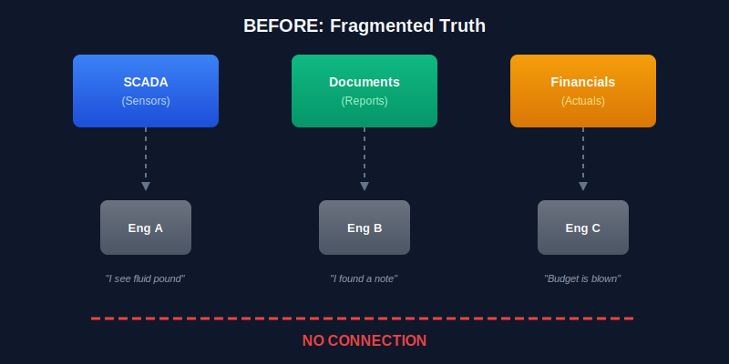
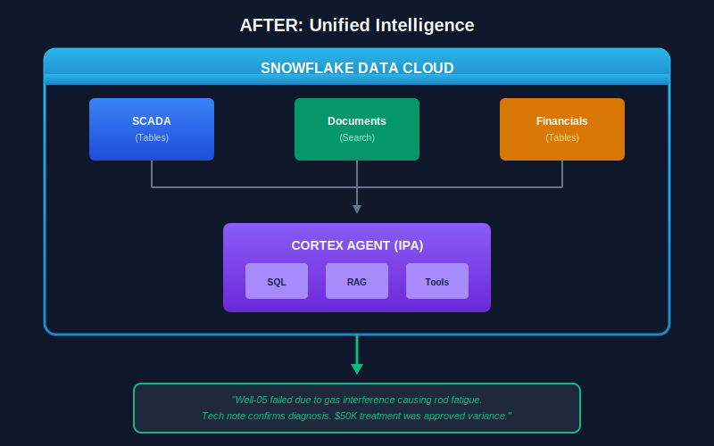
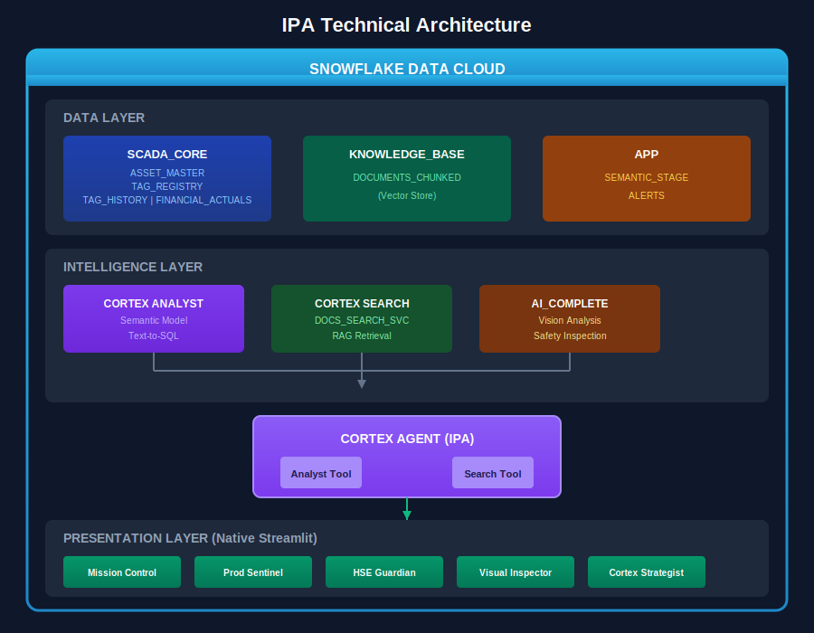
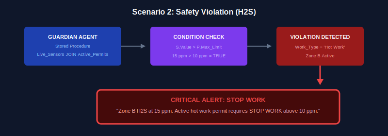
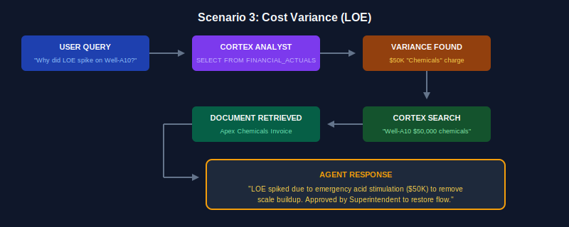

author: Jonathan Martindale, Tripp Smith, Dureti Shemsi
id: intelligent-production-assistant-for-oil-gas
language: en
summary: AI-powered operational intelligence platform for upstream oil and gas, built entirely on Snowflake with autonomous agents for production monitoring, HSE compliance, and conversational root cause analysis
categories: snowflake-site:taxonomy/product/ai, snowflake-site:taxonomy/product/analytics, snowflake-site:taxonomy/snowflake-feature/applied-analytics, snowflake-site:taxonomy/snowflake-feature/cortex-llm-functions, snowflake-site:taxonomy/snowflake-feature/cortex-analyst, snowflake-site:taxonomy/snowflake-feature/cortex-search, snowflake-site:taxonomy/snowflake-feature/snowflake-intelligence, snowflake-site:taxonomy/snowflake-feature/unstructured-data-analysis, snowflake-site:taxonomy/industry/manufacturing, snowflake-site:taxonomy/solution-center/certification/certified-solution
environments: web
status: Published
feedback link: https://github.com/Snowflake-Labs/sfguides/issues
fork repo link: https://github.com/Snowflake-Labs/sfguide-intelligent-production-assistant-for-oil-gas/tree/main

# Intelligent Production Assistant for Oil & Gas

The Intelligent Production Assistant (IPA) is an AI-powered operational intelligence platform for upstream oil and gas, built entirely on Snowflake. Three autonomous detection agents — Sentinel, Guardian, and Fiscal — continuously monitor production physics, enforce HSE compliance, and flag cost variances. A Cortex Agent (IPA_AGENT) answers complex cross-domain questions in natural language by combining Cortex Analyst text-to-SQL with Cortex Search document retrieval — turning hours of diagnostic work into seconds.

## The Business Challenge

### The $62 Billion Problem

In 2023, the upstream oil and gas industry lost an estimated **$62 billion** to unplanned downtime, with equipment failures accounting for 42% of lost production days.

In Q3 2024, a major Permian Basin operator experienced a cascading failure across 12 rod pump wells. The root cause — gas interference leading to fluid pound — was documented in a maintenance report filed 72 hours before the first failure. No one connected the dots.

| Impact Area | Annual Industry Cost |
|-------------|---------------------|
| Unplanned downtime | $62B |
| Safety incidents (HSE) | $8.2B |
| Compliance violations | $2.1B |
| Inefficient troubleshooting | $4.7B |

Data exists. Expertise exists. But they live in silos — SCADA in one system, maintenance reports in another, financial actuals in a third. Engineers spend 60% of their time hunting for context instead of solving problems.

### Who Suffers and Why

**Production Engineer**: Sensor data is disconnected from engineering knowledge. Diagnostic cycles take 4–6 hours for failures that should take 30 minutes — at $15,000/hour in deferred production per well.

**HSE Manager**: Safety permits don't talk to real-time hazard monitoring. A hot work permit issued for Zone B with H2S sensors spiking goes undetected until after the incident, at an average cost of $1.2M per OSHA recordable.

**Asset Manager**: LOE spikes lack operational context. Budget cycles become dominated by forensic accounting, with 3-week delays in variance explanations.

**Operations Superintendent**: Critical insights are buried in document noise. With 47 daily reports to read, 2.3 hours per day are spent reading reports instead of acting.

## The Transformation

### Before: Fragmented Truth

Each engineer sees a fragment. Root cause analysis takes days. Permits, sensors, financials, and maintenance logs exist in separate systems with no shared intelligence layer.

### After: Unified Intelligence

One question. Complete context. Seconds instead of days. SCADA time-series, unstructured documents, and financial actuals are unified in Snowflake, queried by autonomous agents operating in real time.

## Business Value & ROI

| KPI | Current State | With IPA | Improvement |
|-----|---------------|----------|-------------|
| Mean Time to Diagnosis | 4.2 hours | 12 minutes | **95% faster** |
| Safety Near-Miss Detection | Reactive | Real-time | **100% proactive** |
| Variance Explanation Time | 3 weeks | Same day | **21x faster** |
| Engineer Productive Time | 40% | 85% | **2x capacity** |

### ROI Model (Per 100-Well Asset)

| Value Driver | Annual Savings |
|--------------|----------------|
| Reduced downtime (2 hrs/well/month) | $3.6M |
| Avoided safety incidents | $1.2M |
| Faster budget cycles | $400K |
| Engineering efficiency | $800K |
| **Total Annual Value** | **$6.0M** |

## Why Snowflake

| Pillar | IPA Implementation |
|--------|-------------------|
| **Unified Data** | SCADA, docs, and financials in one platform — no ETL, no data movement. |
| **Native AI/ML** | `AI_COMPLETE()` for agents. Cortex Analyst for SQL. Cortex Search for RAG. |
| **Collaboration** | Engineers and analysts share a single source of truth. |
| **Governance** | RBAC, full audit trail on every agent decision. No shadow AI. |

| Alternative | Challenge |
|-------------|-----------|
| Standalone LLM | No access to live operational data |
| Data Lake + Vector DB | Two systems, two governance models, sync lag |
| BI Tool + Chatbot | Can't reason across structured and unstructured |
| **Snowflake IPA** | Single platform, real-time, governed, scalable |

## Solution Architecture

### Data Schema

| Schema | Table | Purpose |
|--------|-------|---------|
| SCADA_CORE | ASSET_MASTER | Well and rig inventory with basin and geo-zone metadata |
| SCADA_CORE | TAG_REGISTRY | Sensor metadata — tag ID, asset, attribute, unit of measure |
| SCADA_CORE | TAG_HISTORY | Time-series sensor readings with quality flags |
| SCADA_CORE | FINANCIAL_ACTUALS | Cost data by cost center, date, and expense category |
| KNOWLEDGE_BASE | DOCUMENTS_CHUNKED | 31 operational documents (4 signal + 27 noise) indexed by Cortex Search |

### Agent Architecture

| Agent | Data Sources | Action |
|-------|--------------|--------|
| **Sentinel** | TAG_HISTORY + TAG_REGISTRY | Detects sensor anomalies (>10% deviation) via `AI_COMPLETE()` |
| **Guardian** | TAG_HISTORY + ACTIVE_PERMITS | Flags H2S/LEL violations against active permits via `AI_COMPLETE()` |
| **Fiscal** | FINANCIAL_ACTUALS + ASSET_MASTER | Flags high-spend transactions (>$10K) via `AI_COMPLETE()` |
| **IPA_AGENT** | Cortex Analyst + Cortex Search | Answers questions via text-to-SQL and document retrieval |

## Demo Scenarios

### Scenario 1: Rod Pump Physics Failure

**Well-RP-05** shows dynamometer load dropping to zero. The Sentinel agent detects the >10% deviation from baseline in TAG_HISTORY and generates an alert via `AI_COMPLETE()`. IPA_AGENT then surfaces both the live sensor reading and the failure analysis document in a single response: *"What caused the rod pump failure on Well-RP-05?"*

### Scenario 2: H2S Safety Violation

**Zone-B** H2S sensors spike to 15 ppm during an active hot work permit with a 10 ppm stop-work trigger. The Guardian agent detects the violation by querying live sensor readings against active work permits and escalates immediately — before an incident occurs.

### Scenario 3: LOE Cost Variance

**Well-A10** shows a $50,000 chemical expense spike. The Fiscal agent detects the high-spend transaction in FINANCIAL_ACTUALS and raises an alert. IPA_AGENT then retrieves the Apex Chemicals invoice from the knowledge base and explains the variance in seconds: *"What was the $50,000 charge on Well-A10?"*

## Application Experience

The IPA deploys as a five-page Streamlit application in Snowsight:

| Page | Purpose | Key Features |
|------|---------|--------------|
| **Mission Control** | Prioritized alert feed | Agent recommendations, anomaly highlights, one-click drill-down |
| **Production Sentinel** | Physics diagnostics | Dynamometer cards, gas lift curves, pump efficiency trends |
| **HSE Guardian** | Safety compliance | Barrier status map, permit overlay, real-time hazard monitoring |
| **Visual Inspector** | Computer vision | Equipment corrosion analysis, image-based diagnostics |
| **Cortex Strategist** | Conversational AI | Natural language Q&A across all data domains |

## Get Started

Ready to deploy autonomous operational intelligence for your oil and gas assets?

**[GitHub Repository →](https://github.com/Snowflake-Labs/sfguide-intelligent-production-assistant-for-oil-gas/tree/main)**

The repository contains the complete deployment script, SQL setup files, Streamlit application, and sample data generating 187,000+ rows of synthetic time-series across wells, rigs, and sensors.

## Resources

- [Cortex Agents Documentation](https://docs.snowflake.com/en/user-guide/snowflake-cortex/cortex-agents)
- [Cortex Analyst Documentation](https://docs.snowflake.com/en/user-guide/snowflake-cortex/cortex-analyst)
- [Cortex Search Documentation](https://docs.snowflake.com/en/user-guide/snowflake-cortex/cortex-search/cortex-search-overview)
- [Snowflake Cortex LLM Functions](https://docs.snowflake.com/en/user-guide/snowflake-cortex/llm-functions)
- [Streamlit in Snowflake Documentation](https://docs.snowflake.com/en/developer-guide/streamlit/about-streamlit)
