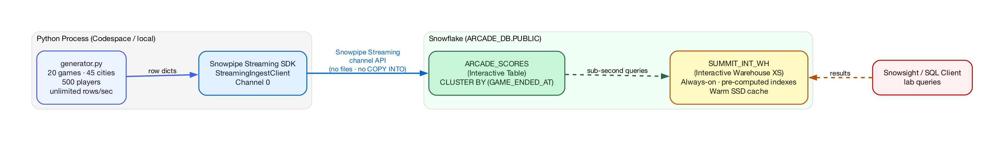

authors: Brad Culberson
id: interactive-tables-snowpipe-streaming-arcade-lab
summary: Stream thousands of arcade game scores into Snowflake in real time using the Snowpipe Streaming Python SDK, store them in an Interactive Table, and query with sub-second latency using an Interactive Warehouse.
categories: snowflake-site:taxonomy/solution-center/certification/quickstart, snowflake-site:taxonomy/product/data-engineering, snowflake-site:taxonomy/snowflake-feature/snowpipe-streaming, snowflake-site:taxonomy/snowflake-feature/ingestion, snowflake-site:taxonomy/snowflake-feature/interactive-tables, snowflake-site:taxonomy/snowflake-feature/interactive-warehouse
environments: web
language: en
status: Hidden
feedback link: https://github.com/Snowflake-Labs/sfguides/issues
fork repo link: https://github.com/Snowflake-Labs/sfquickstarts/tree/master/site/sfguides/src/interactive-tables-snowpipe-streaming-arcade-lab

# Real-Time Streaming with Snowpipe Streaming and Interactive Tables
<!-- ------------------------ -->
## Overview

In this lab you will stream thousands of synthetic arcade game scores from a Python process directly into Snowflake using the **Snowpipe Streaming Python SDK**, store them in an **Interactive Table**, and experience true sub-second query latency at scale using an **Interactive Warehouse**.

Everything runs inside a **GitHub Codespace** — no local installs required beyond a browser and a Snowflake account.



```
 Python Generator
 ─────────────────
  Arcade Score Events          Snowpipe Streaming SDK
  (unlimited rows/sec) ──────► StreamingIngestClient
  20 games · 45 cities          └─ Channel 0      ──► ARCADE_SCORES
  500 players                                          (Interactive Table)
                                                       CLUSTER BY (GAME_ENDED_AT)
                                                            │
                                                            ▼
                                                     SUMMIT_INT_WH
                                                  (Interactive Warehouse, XS)
                                                  Always-on · sub-second latency queries
```

Snowpipe Streaming uses the **channel API** — rows are written directly into the Interactive Table without any intermediate landing table, staging area, or `COPY INTO` command.

### Prerequisites

- A [Snowflake account](https://signup.snowflake.com/) in a [supported Interactive Tables region](https://docs.snowflake.com/en/user-guide/interactive#region-availability) with `ACCOUNTADMIN` access

### What You'll Learn

- How to stream rows into Snowflake using the **Snowpipe Streaming Python SDK** channel API
- How **Interactive Tables** differ from standard Snowflake tables and why they enable sub-second queries
- How an **Interactive Warehouse** uses pre-computed indexes and a warm local SSD cache to answer queries quickly
- How `CLUSTER BY` on a timestamp column eliminates irrelevant micro-partition scans on time-range queries
- How to measure real-time data **freshness** from within Snowsight
- How the Interactive Warehouse handles **50 concurrent users** without query queuing

### What You'll Need

- A [GitHub account](https://github.com/) (free tier is sufficient for Codespaces)
- A web browser — no local installs required; Python, the Snowpipe Streaming SDK, and all other dependencies are installed automatically in the Codespace

### What You'll Build

- A live arcade score streaming pipeline (Python → Snowpipe Streaming → Interactive Table)
- 11 analytical exercises covering freshness, leaderboards, geo heat maps, and concurrency benchmarking
- A side-by-side speed comparison between the Interactive Warehouse and a standard warehouse

<!-- ------------------------ -->
## Open the Lab in a GitHub Codespace

All lab code lives in a public GitHub repository. GitHub Codespaces gives you a fully configured cloud development environment — Python, the Snowpipe Streaming SDK, and all dependencies are installed automatically.

### Step 1 — Open the Codespace

1. Navigate to [https://github.com/Snowflake-Labs/Summit26-InteractiveLab](https://github.com/Snowflake-Labs/Summit26-InteractiveLab)
2. Click the green **Code** button → **Codespaces** tab → **Create codespace on main**

GitHub will build the container and open VS Code in your browser. This takes about 1–2 minutes on first launch.

> aside positive
> The Codespace automatically installs the `snowpipe-streaming` Python package and all other dependencies from `requirements.txt` — no manual `pip install` needed.

### Step 2 — Explore the repository structure

Once the Codespace is open, you will see:

```
Summit26-InteractiveLab/
├── sql/
│   ├── 01_setup.sql          Snowflake object provisioning
│   ├── 02_service_auth.sh    RSA key generation + ALTER USER SQL
│   ├── 03_lab_queries.sql    All 11 exercises + bonus queries
│   ├── 04_generate_pat.sql   Optional: PAT for Cortex CLI dashboard deployment
│   └── 05_cleanup.sql        Teardown script
├── python/
│   ├── arcade_streamer.py    Snowpipe Streaming SDK ingest
│   ├── generator.py          Synthetic arcade data generator
│   └── config.py             All tuneable parameters
├── jmeter/                   Concurrency test plan (optional)
├── profile.json.example      Snowflake connection template
└── requirements.txt
```

<!-- ------------------------ -->
## Provision Snowflake Objects

All Snowflake objects are created by a single SQL script. Run it in Snowsight using a **standard warehouse** session.

### What gets provisioned

| Object | Type | Purpose |
|---|---|---|
| `ARCADE_STREAMING_ROLE` | Role | Minimum-privilege role for the streaming user |
| `ARCADE_STREAMING_USER` | User | Service account used by the Python SDK |
| `ARCADE_KEYPAIR_POLICY` | Auth Policy | Restricts the service user to key-pair auth only |
| `ARCADE_DB` | Database | Holds all lab objects |
| `SUMMIT_TRAD_WH` | Standard Warehouse XS | Setup tasks; comparison benchmarks |
| `ARCADE_SCORES` | **Interactive Table** | Direct streaming target, `CLUSTER BY (GAME_ENDED_AT)` |
| `SUMMIT_INT_WH` | **Interactive Warehouse XS** | All lab queries — always-on, sub-second latency |
| `ARCADE_REPORTING_POOL` | Compute Pool | For the optional Streamlit dashboard |
| `ARCADE_LAB_READER` | Role | Read-only role for lab attendees |

### Step 1 — Open Snowsight

Log in to your Snowflake account at [app.snowflake.com](https://app.snowflake.com).

### Step 2 — Run the setup script

1. In the Codespace, open **`sql/01_setup.sql`**
2. Copy the entire file contents
3. In Snowsight, open a new SQL worksheet, paste, and click **Run All**

> aside negative
> **Important:** Run the script with a **Standard** warehouse session (e.g. `SUMMIT_TRAD_WH` once created, or any existing standard warehouse). `CREATE INTERACTIVE TABLE` is not supported from an Interactive Warehouse session.

When the script completes you will see:

```
Setup complete – start the Python streamer, then wait ~2 min for cache warm-up.
```

### What makes an Interactive Table different?

Interactive Tables are optimised for low-latency streaming ingestion and sub-second lookups. Key properties:

- **Direct streaming writes** — Snowpipe Streaming SDK writes rows without staging files
- **Always-queryable** — rows are visible immediately after commit, no `REFRESH` needed
- **Pre-computed indexes** — the Interactive Warehouse maintains in-memory index metadata
- **Time Travel** — fully supported even with continuous streaming writes
- **`CLUSTER BY`** — aligns micro-partitions with query predicates; the warehouse skips irrelevant partitions automatically

<!-- ------------------------ -->
## Register the RSA Key Pair

The Python streamer authenticates as `ARCADE_STREAMING_USER` using RSA key-pair authentication. A shell script generates the key pair and prints the exact SQL needed to register the public key.

### Step 1 — Run the keygen script

In the Codespace terminal:

```bash
bash sql/02_service_auth.sh
```

The script:
1. Generates `rsa_key.p8` (private key) and `rsa_key.pub` (public key) if they don't already exist
2. Prints the `ALTER USER` SQL with the public key pre-filled
3. Prints a ready-to-use `profile.json` block with the absolute path to `rsa_key.p8`

Example output:

```sql
-- Run as ACCOUNTADMIN in Snowsight
ALTER USER ARCADE_STREAMING_USER SET RSA_PUBLIC_KEY='MIIBIjANBgkqhkiG9w0BAQEFAAOCAQ...';
```

### Step 2 — Register the key in Snowsight

Copy the printed `ALTER USER` statement and run it in a Snowsight worksheet as `ACCOUNTADMIN`.

> aside positive
> `rsa_key.p8` is listed in `.gitignore` and will never be committed to the repository.

<!-- ------------------------ -->
## Configure the Connection Profile

The streamer reads connection details from `profile.json`.

### Step 1 — Create profile.json

```bash
cp profile.json.example profile.json
```

### Step 2 — Fill in your values

The script in the previous step printed a pre-filled JSON block. Copy it, or edit `profile.json` manually:

```json
{
    "user":             "ARCADE_STREAMING_USER",
    "account":          "YOUR_ORG-YOUR_ACCOUNT",
    "url":              "https://YOUR_ORG-YOUR_ACCOUNT.snowflakecomputing.com:443",
    "private_key_file": "/workspaces/Summit26-InteractiveLab/rsa_key.p8",
    "role":             "ARCADE_STREAMING_ROLE"
}
```

> aside positive
> **Finding your account identifier**
>
> In Snowsight, click your username in the bottom-left corner. Your account identifier appears under the account name in `ORG-ACCOUNT` format (e.g. `myorg-myaccount`).

> aside negative
> `private_key_file` must be an **absolute path**. The `02_service_auth.sh` script prints the exact path for your Codespace environment.

<!-- ------------------------ -->
## How the Snowpipe Streaming SDK Works

Before running the streamer, let's walk through the key parts of `python/arcade_streamer.py` to understand exactly how rows get from Python into Snowflake — no files, no `COPY INTO`, no batch window.

### 1 — Create the client

`StreamingIngestClient` is the top-level SDK object. One client maps to exactly one account / database / schema / pipe combination. It handles authentication, channel lifecycle, and the underlying HTTPS transport to Snowflake's ingest endpoint.

```python
# arcade_streamer.py  (main)
from snowflake.ingest.streaming import StreamingIngestClient

with StreamingIngestClient(
    client_name  = f"ARCADE_CLIENT_{uuid.uuid4().hex[:8].upper()}",
    db_name      = config.SNOWFLAKE_DATABASE,   # "ARCADE_DB"
    schema_name  = config.SNOWFLAKE_SCHEMA,     # "PUBLIC"
    pipe_name    = config.SNOWFLAKE_PIPE,        # "ARCADE_SCORES-STREAMING"
    profile_json = args.profile,                 # path to profile.json
) as client:
    ...
```

`profile_json` points at the `profile.json` you just created — the client reads the RSA private key path from there and signs its own JWT tokens for every request.

### 2 — Open a channel

A **channel** is the logical write path within a client. Each channel maintains its own internal write buffer and commit position. Opening a channel is idempotent — if a channel with the same name already exists (e.g. after a restart), the SDK resumes from the last committed offset token.

```python
# arcade_streamer.py  (channel_worker)
channel_name = f"ARCADE_CHANNEL_{channel_id}_{uuid.uuid4().hex[:8].upper()}"

with client.open_channel(channel_name)[0] as channel:
    print(f"  [channel-{channel_id}] opened: {channel.channel_name}")
    ...
```

`open_channel()` returns `(StreamingIngestChannel, ChannelStatus)` — the `[0]` unwraps the channel. The context manager automatically closes and flushes the channel when the `with` block exits.

### 3 — Append rows

`append_row()` is the core ingestion call. It accepts a plain Python `dict` where **keys are column names** (case-insensitive) and **values are native Python types**. No serialisation to JSON or Parquet needed — the SDK handles that internally.

```python
# arcade_streamer.py  (channel_worker inner loop)
batch = generate_batch(rows_per_batch)   # list of row dicts from generator.py

for row in batch:
    channel.append_row(row, str(offset_token))
    offset_token += 1
```

Each call to `append_row` is non-blocking. The SDK buffers rows in memory and flushes them to Snowflake in the background, automatically respecting Snowflake's micro-batch commit cadence.

### 4 — What a row looks like

`generator.py` produces rows as plain Python dicts. The dict keys map directly to `ARCADE_SCORES` column names:

```python
# generator.py  (generate_score)
return {
    "score_id":         str(uuid.uuid4()),   # VARCHAR(36)
    "player_id":        player["player_id"], # VARCHAR(36)
    "player_name":      player["player_name"],
    "player_country":   player["player_country"],
    "player_city":      player["player_city"],
    "latitude":         player["latitude"],  # FLOAT
    "longitude":        player["longitude"],
    "game_name":        game_name,
    "game_mode":        game_mode,
    "platform":         platform,
    "score":            score,               # NUMBER(12,0)
    "level_reached":    level,
    "duration_seconds": duration_sec,
    "lives_remaining":  lives,
    "accuracy_pct":     accuracy,            # nullable FLOAT
    "achievement":      achievement,         # nullable VARCHAR(64)
    "game_ended_at":    game_ended_at,       # TIMESTAMP_NTZ (UTC datetime)
}
```

The SDK maps Python `int` → `NUMBER`, `float` → `FLOAT`, `str` → `VARCHAR`, `datetime` → `TIMESTAMP_NTZ`, and `None` → `NULL` automatically.

### 5 — Offset tokens

Every `append_row` call takes an **offset token** — a monotonically increasing string the SDK uses to track exactly which rows have been durably committed on the Snowflake side. If the streamer crashes and restarts, it can reopen the same channel and resume from `channel.get_latest_committed_offset_token()`, avoiding duplicate inserts.

```python
# offset_token increments with every row:
channel.append_row(row, str(offset_token))
offset_token += 1
```

### 6 — Latency monitor

A background thread calls `client.get_channel_statuses()` periodically to retrieve Snowflake's reported average processing latency — the time between `append_row` being called and the row being durably committed and queryable in the Interactive Table.

```python
# arcade_streamer.py  (latency_monitor)
statuses = client.get_channel_statuses(names)
for name, st in statuses.items():
    lag = st.server_avg_processing_latency   # datetime.timedelta | None
    if lag is not None:
        print(f"[latency] {name}: {lag.total_seconds() * 1000:.0f} ms avg")
```

This is the `[latency]` line you will see in the console once the streamer is running.

> aside positive
> **Preview the data without connecting to Snowflake**
>
> Before starting the real streamer you can preview a few generated rows to confirm the generator is working:
> ```bash
> cd python
> python arcade_streamer.py --dry-run --rows 3
> ```

<!-- ------------------------ -->
## Start the Arcade Streamer

With the connection configured, start the Python streamer. It will immediately begin writing arcade score events to Snowflake at full speed.

```bash
cd python
python arcade_streamer.py
```

You should see output like:

```
============================================================
 Summit 2026 – Arcade Scores Snowpipe Streamer
============================================================
  Account   : YOUR_ORG-YOUR_ACCOUNT
  Database  : ARCADE_DB.PUBLIC
  Pipe      : ARCADE_SCORES-STREAMING
  Channels  : 1
  Target    : unlimited rows/sec
============================================================

  [14:22:05]  rows:      512  |  512.0 rows/sec  |  errors: 0  |  elapsed:    1s
  [14:22:05]  [latency] ARCADE_CHANNEL_0_A3F2B1C4: 540 ms avg
  [14:22:10]  rows:    1,024  |  512.0 rows/sec  |  errors: 0  |  elapsed:    6s
  [14:22:10]  [latency] ARCADE_CHANNEL_0_A3F2B1C4: 512 ms avg
```

The `[latency]` line is the **Snowflake-reported average processing latency** polled from the SDK's `get_channel_statuses()` API — typically under a second.

### Streamer options

```bash
# Throttle to 50 rows/sec (useful to observe fresh data trickle in)
python arcade_streamer.py --rate 50

# Scale to 4 parallel channels for higher throughput
python arcade_streamer.py --channels 4

# Insert exactly 10,000 rows then stop
python arcade_streamer.py --rows 10000

# Preview generated data without connecting to Snowflake
python arcade_streamer.py --dry-run --rows 5
```

### Wait for cache warm-up

> aside positive
> After the streamer starts, wait **2–3 minutes** before running lab queries. The `SUMMIT_INT_WH` Interactive Warehouse needs this time to populate its local SSD cache. Queries run before warm-up will still succeed but will be slower.

<!-- ------------------------ -->
## Exercise 1 — Pipeline Throughput

Open **`sql/03_lab_queries.sql`** in Snowsight and run the Exercise 1 queries while the streamer is running. Make sure `SUMMIT_INT_WH` is selected as the active warehouse.

### 1a — Total row count

```sql
SELECT COUNT(*) AS TOTAL_SCORES FROM ARCADE_SCORES;
```

Re-run this every few seconds. You should see the count climbing as new rows stream in.

### 1b — Rows per second (last 60 seconds)

```sql
SELECT
    COUNT(*)                   AS ROWS_LAST_60_SEC,
    ROUND(COUNT(*) / 60.0, 1) AS ROWS_PER_SECOND,
    COUNT(DISTINCT PLAYER_ID)  AS ACTIVE_PLAYERS
FROM ARCADE_SCORES
WHERE GAME_ENDED_AT >= DATEADD('second', -60, CURRENT_TIMESTAMP());
```

### 1c — Throughput by 10-second bucket (last 3 minutes)

```sql
SELECT
    DATEADD('second',
        FLOOR(DATEDIFF('second', '2000-01-01'::TIMESTAMP_NTZ, GAME_ENDED_AT) / 10) * 10,
        '2000-01-01'::TIMESTAMP_NTZ)   AS TIME_BUCKET,
    COUNT(*)                           AS SCORES
FROM ARCADE_SCORES
WHERE GAME_ENDED_AT >= DATEADD('minute', -3, CURRENT_TIMESTAMP())
GROUP BY TIME_BUCKET
ORDER BY TIME_BUCKET DESC
LIMIT 18;
```

This histogram shows you the exact shape of the ingest stream — each bucket represents 10 seconds of data arriving from the Python generator. Notice how rows are already in the Interactive Table by the time the query runs: there is no batch window, no `COPY INTO`, and no manual refresh.

<!-- ------------------------ -->
## Exercise 2 — Data Freshness

How stale is the most recent row in the table right now?

```sql
SELECT
    MAX(GAME_ENDED_AT)                                                    AS LATEST_GAME_ENDED,
    DATEDIFF(
        'millisecond',
        MAX(GAME_ENDED_AT),
        CONVERT_TIMEZONE('UTC', CURRENT_TIMESTAMP())::TIMESTAMP_NTZ
    ) / 1000.0                                                            AS FRESHNESS_SEC
FROM ARCADE_SCORES
WHERE GAME_ENDED_AT >= DATEADD('minute', -5,
          CONVERT_TIMEZONE('UTC', CURRENT_TIMESTAMP())::TIMESTAMP_NTZ);
```

`GAME_ENDED_AT` is the UTC timestamp when the Python generator emitted the row. `FRESHNESS_SEC` is how many seconds ago that was — the end-to-end pipeline latency from the Python process to a queryable row in Snowflake.

> aside positive
> **`CONVERT_TIMEZONE('UTC', CURRENT_TIMESTAMP())::TIMESTAMP_NTZ`** normalises the session-local `CURRENT_TIMESTAMP()` to UTC so it compares correctly against the UTC `TIMESTAMP_NTZ` values in `GAME_ENDED_AT`.

With a healthy streamer you should see freshness values in the range of **0.3 – 2 seconds**, depending on Snowflake region and network latency.

The streamer console also logs the SDK-reported average processing latency per channel (the `[latency]` lines) — compare that to the SQL freshness value.

<!-- ------------------------ -->
## Exercise 3 — Global Leaderboard

Who has the highest scores across all games in the last 24 hours?

```sql
SELECT
    RANK() OVER (ORDER BY SCORE DESC)  AS RANK,
    PLAYER_NAME,
    PLAYER_COUNTRY,
    PLAYER_CITY,
    GAME_NAME,
    TO_CHAR(SCORE, '999,999,999')      AS SCORE,
    LEVEL_REACHED,
    PLATFORM,
    COALESCE(ACHIEVEMENT, '—')         AS ACHIEVEMENT,
    GAME_ENDED_AT
FROM ARCADE_SCORES
WHERE GAME_ENDED_AT >= DATEADD('hour', -24, CURRENT_TIMESTAMP())
ORDER BY SCORE DESC
LIMIT 20;
```

Notice the query execution time in Snowsight's query history — it should be **sub-second** even with hundreds of thousands of rows in the table. 

This is the `CLUSTER BY (GAME_ENDED_AT)` effect: the Interactive Warehouse knows exactly which micro-partitions contain rows from the last 24 hours and skips everything else. No full table scan occurs.

> aside positive
> **Try it without the `WHERE` clause.** Remove the `GAME_ENDED_AT` filter and re-run. Snowsight will show the query hitting the 5-second Interactive Warehouse timeout — which is the expected, by-design behaviour that enforces efficient query patterns.

<!-- ------------------------ -->
## Exercise 4 — Per-Game Top 5

Use `QUALIFY ROW_NUMBER()` to rank the top 5 players per game in the last hour without a subquery:

```sql
SELECT
    GAME_NAME,
    ROW_NUMBER() OVER (
        PARTITION BY GAME_NAME ORDER BY SCORE DESC
    )                                  AS POSITION,
    PLAYER_NAME,
    PLAYER_COUNTRY,
    TO_CHAR(SCORE, '999,999,999')      AS SCORE,
    LEVEL_REACHED,
    GAME_MODE
FROM ARCADE_SCORES
WHERE GAME_ENDED_AT >= DATEADD('hour', -1, CURRENT_TIMESTAMP())
QUALIFY ROW_NUMBER() OVER (
    PARTITION BY GAME_NAME ORDER BY SCORE DESC
) <= 5
ORDER BY GAME_NAME, POSITION;
```

`QUALIFY` is Snowflake's inline filter for window functions — no outer `SELECT` wrapper needed. The Interactive Warehouse handles 20 game partitions × 5 positions in a single pass.

<!-- ------------------------ -->
## Exercises 5–9 — Deeper Analysis

These exercises explore the data from different angles. Open **`sql/03_lab_queries.sql`** and run the queries for each exercise.

### Exercise 5 — Country Heat Map

Which countries are generating the most play sessions right now?

```sql
SELECT
    PLAYER_COUNTRY,
    COUNT(*)                   AS GAMES_PLAYED,
    ROUND(AVG(SCORE))          AS AVG_SCORE,
    MAX(SCORE)                 AS HIGH_SCORE,
    COUNT(DISTINCT PLAYER_ID)  AS UNIQUE_PLAYERS
FROM ARCADE_SCORES
WHERE GAME_ENDED_AT >= DATEADD('hour', -1, CURRENT_TIMESTAMP())
GROUP BY PLAYER_COUNTRY
ORDER BY GAMES_PLAYED DESC
LIMIT 20;
```

Japan and South Korea lead — the data generator weights cities by real-world gaming culture.

### Exercise 6 — Game Popularity

Which games have the most sessions? How do average scores compare across titles?

```sql
SELECT
    GAME_NAME,
    COUNT(*)                                        AS SESSIONS,
    COUNT(DISTINCT PLAYER_ID)                       AS UNIQUE_PLAYERS,
    TO_CHAR(ROUND(AVG(SCORE)), '999,999,999')       AS AVG_SCORE,
    TO_CHAR(MAX(SCORE),        '999,999,999')       AS HIGH_SCORE,
    ROUND(AVG(LEVEL_REACHED), 1)                    AS AVG_LEVEL,
    ROUND(AVG(DURATION_SECONDS) / 60.0, 1)          AS AVG_GAME_MIN
FROM ARCADE_SCORES
WHERE GAME_ENDED_AT >= DATEADD('hour', -1, CURRENT_TIMESTAMP())
GROUP BY GAME_NAME
ORDER BY SESSIONS DESC;
```

Pac-Man and Tetris should lead with roughly 5× more sessions than rarer titles like Joust and Tron.

### Exercise 7 — Platform Breakdown

```sql
SELECT
    PLATFORM,
    COUNT(*)                   AS SESSIONS,
    ROUND(AVG(SCORE))          AS AVG_SCORE,
    ROUND(AVG(ACCURACY_PCT), 1) AS AVG_ACCURACY_PCT,
    COUNT(DISTINCT PLAYER_ID)  AS UNIQUE_PLAYERS
FROM ARCADE_SCORES
WHERE GAME_ENDED_AT >= DATEADD('hour', -1, CURRENT_TIMESTAMP())
GROUP BY PLATFORM
ORDER BY SESSIONS DESC;
```

Classic arcade cabinets dominate for titles like Pac-Man; Tetris skews mobile.

### Exercise 8 — Live Score Feed (re-run repeatedly!)

```sql
SELECT
    PLAYER_NAME,
    PLAYER_CITY,
    PLAYER_COUNTRY,
    GAME_NAME,
    TO_CHAR(SCORE, '999,999,999')  AS SCORE,
    LEVEL_REACHED,
    PLATFORM,
    COALESCE(ACHIEVEMENT, '—')     AS ACHIEVEMENT,
    GAME_ENDED_AT
FROM ARCADE_SCORES
WHERE GAME_ENDED_AT >= DATEADD('minute', -5, CURRENT_TIMESTAMP())
ORDER BY GAME_ENDED_AT DESC
LIMIT 30;
```

Re-run every few seconds. You'll see new rows appearing at the top — these are rows that streamed in after your last query execution. No refresh, no polling interval: the table is live.

### Exercise 9 — Achievement Rarity

```sql
SELECT
    ACHIEVEMENT,
    COUNT(*)                   AS TIMES_EARNED,
    COUNT(DISTINCT PLAYER_ID)  AS UNIQUE_EARNERS,
    ROUND(AVG(SCORE))          AS AVG_SCORE_WHEN_EARNED,
    ROUND(AVG(LEVEL_REACHED), 1) AS AVG_LEVEL
FROM ARCADE_SCORES
WHERE ACHIEVEMENT IS NOT NULL
  AND GAME_ENDED_AT >= DATEADD('hour', -1, CURRENT_TIMESTAMP())
GROUP BY ACHIEVEMENT
ORDER BY TIMES_EARNED ASC;
```

Achievements like "Pacifist" and "Triple Threat" require specific skill tier + game mode + score conditions and appear in fewer than 1 in 200 rows.

<!-- ------------------------ -->
## Exercise 10 — Interactive vs Traditional Warehouse

Run the same aggregation query on both warehouses back-to-back and compare execution times in Query History.

### Step A — Interactive Warehouse

```sql
USE WAREHOUSE SUMMIT_INT_WH;

SELECT
    PLAYER_COUNTRY,
    COUNT(*)    AS SESSIONS,
    MAX(SCORE)  AS HIGH_SCORE
FROM ARCADE_SCORES
WHERE GAME_ENDED_AT >= DATEADD('hour', -1, CURRENT_TIMESTAMP())
GROUP BY PLAYER_COUNTRY
ORDER BY SESSIONS DESC;
```

### Step B — Standard Warehouse (identical query)

```sql
USE WAREHOUSE SUMMIT_TRAD_WH;

SELECT
    PLAYER_COUNTRY,
    COUNT(*)    AS SESSIONS,
    MAX(SCORE)  AS HIGH_SCORE
FROM ARCADE_SCORES
WHERE GAME_ENDED_AT >= DATEADD('hour', -1, CURRENT_TIMESTAMP())
GROUP BY PLAYER_COUNTRY
ORDER BY SESSIONS DESC;
```

### Compare in Query History

Open **Activity → Query History** in Snowsight and compare the two query durations side by side.

| Warehouse | Typical latency | Why |
|---|---|---|
| `SUMMIT_INT_WH` (Interactive) | sub-second | Pre-computed indexes + local SSD cache; skips most micro-partitions via clustering |
| `SUMMIT_TRAD_WH` (Standard) | several seconds | Micro-partition scan on first run |

The Interactive Warehouse achieves significantly higher throughput and lower latency at high concurrency because it uses a dedicated shared SSD cache and pre-computed index metadata that survives between queries.

> aside positive
> **Switch back to the Interactive Warehouse** before continuing:
> ```sql
> USE WAREHOUSE SUMMIT_INT_WH;
> ```

<!-- ------------------------ -->
## Bonus Exercises

### Bonus A — Time Travel on an Interactive Table

Interactive Tables support Time Travel even with continuous streaming writes.

```sql
-- Row count 5 minutes ago
SELECT COUNT(*) AS ROWS_5_MIN_AGO
FROM ARCADE_SCORES AT(OFFSET => -300);

-- How many rows were generated in the last 5 minutes?
SELECT COUNT(*) AS NEW_ROWS_LAST_5_MIN
FROM ARCADE_SCORES
WHERE GAME_ENDED_AT >= DATEADD('minute', -5, CURRENT_TIMESTAMP());
```

### Bonus B — Rolling 1-Minute City Hotspot

Which cities are most active right now?

```sql
SELECT
    PLAYER_CITY,
    PLAYER_COUNTRY,
    COUNT(*) AS GAMES_LAST_MINUTE
FROM ARCADE_SCORES
WHERE GAME_ENDED_AT >= DATEADD('minute', -1, CURRENT_TIMESTAMP())
GROUP BY PLAYER_CITY, PLAYER_COUNTRY
ORDER BY GAMES_LAST_MINUTE DESC
LIMIT 15;
```

### Bonus C — Inspect Interactive Table Metadata

```sql
USE WAREHOUSE SUMMIT_TRAD_WH;
USE ROLE ACCOUNTADMIN;

SHOW INTERACTIVE TABLES IN SCHEMA ARCADE_DB.PUBLIC;

-- Clustering depth (lower is better-clustered for time-range queries)
SELECT SYSTEM$CLUSTERING_INFORMATION('ARCADE_DB.PUBLIC.ARCADE_SCORES', '(GAME_ENDED_AT)');
```

`CLUSTERING_RATIO` close to `1.0` means the Interactive Warehouse can skip nearly all micro-partitions on `GAME_ENDED_AT` predicates — this is what drives the sub-second query times in earlier exercises.

### Bonus D — Find the Ghost Player

Someone has been logging perfect scores on every game. Can you find them in the data?

```sql
SELECT PLAYER_NAME, PLAYER_CITY, PLAYER_COUNTRY,
       COUNT(*) AS PERFECT_GAMES,
       MIN(SCORE) AS MIN_SCORE,
       MAX(SCORE) AS MAX_SCORE,
       COUNT(DISTINCT GAME_NAME) AS GAMES_PLAYED
FROM ARCADE_SCORES
WHERE ACHIEVEMENT = 'Summit 2026'
GROUP BY PLAYER_NAME, PLAYER_CITY, PLAYER_COUNTRY
ORDER BY PERFECT_GAMES DESC
LIMIT 5;
```

<!-- ------------------------ -->
## Optional: Streamlit Dashboard

Deploy a live multi-page dashboard against `ARCADE_SCORES` using **Snowflake Cortex CLI** — an AI agent that reads your project files, writes the Streamlit app, and deploys it to Snowflake in one shot.

> aside positive
> The compute pool `ARCADE_REPORTING_POOL` (CPU_X64_XS) was provisioned by `sql/01_setup.sql` and is ready to use. No additional Snowflake setup is required.

### Step 1 — Install the Snowflake CLI

In the Codespace terminal:

```bash
pip install snowflake-cli
snow --version
```

### Step 2 — Install the Cortex CLI

```bash
curl -LsS https://ai.snowflake.com/static/cc-scripts/install.sh | sh
cortex --version
```

### Step 3 — Generate a PAT for the Cortex CLI

The Cortex CLI uses the **`snow` CLI** under the hood to deploy the Streamlit app to Snowflake. `snow` requires a **Programmatic Access Token (PAT)** registered as a named connection — this is completely separate from the RSA key pair used by the Python streamer, which is not involved here at all.

1. Open **`sql/04_generate_pat.sql`** in Snowsight and run it as the user who will deploy the dashboard
2. Copy the `SETUP_COMMAND` result that is printed, and run it in the Codespace terminal — it registers the `snow` connection in a single step

Verify the `snow` connection works:

```bash
snow connection test
```

### Step 4 — Run Cortex

From the project root in the Codespace terminal, start Cortex with all tool calls enabled so it can read project files, write the Streamlit app, and deploy it:

```bash
cortex --dangerously-allow-all-tool-calls
```

### Step 5 — Send the deployment prompt

Paste the following prompt into the Cortex session:

```
Use skill `developing-with-streamlit` to create a real-time arcade scores dashboard with the following requirements:

**Data Source:**
- Table: `ARCADE_DB.PUBLIC.ARCADE_SCORES`
- Warehouse: `SUMMIT_INT_WH` (Interactive Warehouse)
- Connection: Use default connection with programmatic token
- Columns: All columns and tables are uppercase in Snowflake

**Deployment:**
- Deploy as Streamlit in Snowflake named `ARCADE_SCORES_DASHBOARD` in `ARCADE_DB.PUBLIC`
- Use compute pool `ARCADE_REPORTING_POOL` (already provisioned)
- Add external access integration and network rule for PyPI access

**Dashboard Features:**
1. Global Leaderboard - Highest scores in last 24 hours
2. Top Players by Game - Top 5 players per game in last hour
3. Geographic Heatmap - Country-level plays over last hour
4. Game Popularity - Session and player counts by game (last hour)
5. Platform Breakdown - Session and player counts by platform (last hour)
6. Recent Activity - Last 30 scores
7. Achievements - All earned achievements (where ACHIEVEMENT IS NOT NULL) with counts
8. Active Cities - Most active cities in last minute
9. Pipeline Health - Operational metrics page with:
   - Total games played (all time)
   - Current data freshness in decimal seconds: DATEDIFF('millisecond', MAX(GAME_ENDED_AT), CONVERT_TIMEZONE('UTC', CURRENT_TIMESTAMP())::TIMESTAMP_NTZ) / 1000.0
   - Freshness over last hour as a time-series line chart bucketed by DATE_TRUNC('minute', GAME_ENDED_AT)
   - Rows/sec over last hour: count per minute bucket divided by 60, as a time-series line chart
```

Cortex will write the Streamlit app file and deploy it to Snowflake. Once complete, open the dashboard from **Snowsight → Streamlit → ARCADE_SCORES_DASHBOARD**.

> aside positive
> The dashboard queries `ARCADE_SCORES` through `SUMMIT_INT_WH` — the same Interactive Warehouse used in the lab exercises. All nine pages will refresh with live data as long as the Python streamer is running.

<!-- ------------------------ -->
## Cleanup

When you are done with the lab, run the teardown script to remove all Snowflake objects and stop billing.

1. Open **`sql/05_cleanup.sql`** in Snowsight
2. Run the entire script as `ACCOUNTADMIN`

This drops (in order): the Streamlit dashboard, compute pool, both warehouses, the `ARCADE_DB` database (which cascades to the Interactive Table and all pipes), the service user, and both roles.

> aside negative
> The Interactive Warehouse (`SUMMIT_INT_WH`) bills a **minimum of 1 hour** from the time it is created, then per-second thereafter. Run cleanup as soon as you are finished with the lab to avoid unnecessary charges.

You can also stop the Python streamer at any time with **Ctrl-C** in the Codespace terminal.

<!-- ------------------------ -->
## Conclusion And Resources

In this lab you built a fully operational real-time data pipeline on Snowflake:

- Streamed thousands of rows per second directly into an **Interactive Table** using the **Snowpipe Streaming Python SDK** — no files, no `COPY INTO`, no batch windows
- Queried live data with **sub-second latency** using an **Interactive Warehouse** backed by pre-computed indexes and a warm SSD cache
- Experienced how `CLUSTER BY (GAME_ENDED_AT)` eliminates micro-partition scans on time-range predicates — the key to Interactive Warehouse performance at scale
- Measured end-to-end pipeline freshness: from Python generator to queryable Snowflake row in under 2 seconds
- Compared the Interactive and Standard warehouse head-to-head under the same query workload

### What You Learned

- How Snowpipe Streaming's **channel API** enables direct, low-latency row-level ingestion without staging
- The architectural difference between **Interactive Tables** and standard Snowflake tables
- How an **Interactive Warehouse** uses persistent SSD caching and pre-computed indexes to deliver sub-second queries
- Why `CLUSTER BY` on a time column is essential for time-series workloads on Interactive Tables
- How to measure **data freshness** and **SDK processing latency** from within Snowflake

### Related Resources

- [Lab GitHub Repository](https://github.com/Snowflake-Labs/Summit26-InteractiveLab)
- [Snowpipe Streaming Documentation](https://docs.snowflake.com/en/user-guide/data-load-snowpipe-streaming-overview)
- [Snowpipe Streaming Python SDK Reference](https://docs.snowflake.com/en/user-guide/snowpipe-streaming-sdk-python/reference/latest/api/snowflake/ingest/streaming/index)
- [Interactive Tables Documentation](https://docs.snowflake.com/en/user-guide/interactive)
- [Interactive Warehouses Documentation](https://docs.snowflake.com/en/user-guide/warehouses-interactive)
- [Snowflake Quickstarts](https://quickstarts.snowflake.com)
