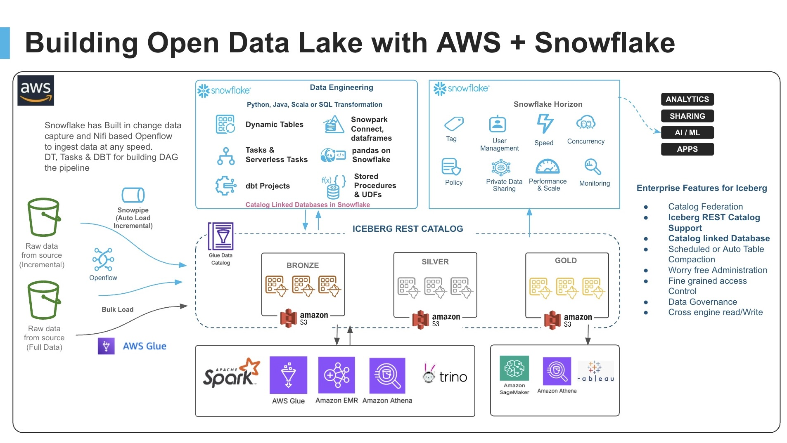
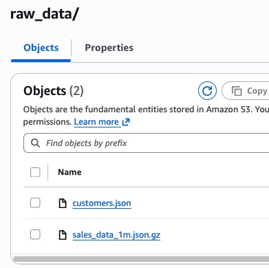
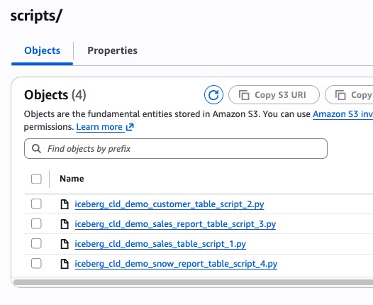
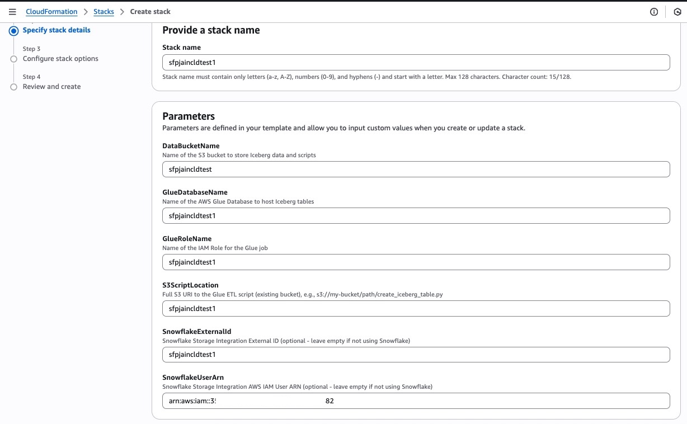
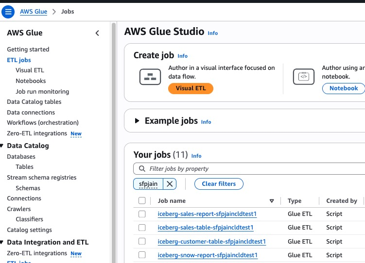
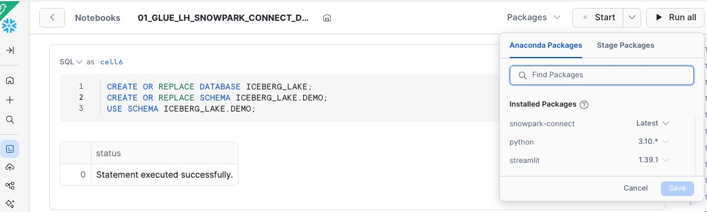

author: Parag Jain, Vino Duraisamy
id: interoperable-lakehouse-with-aws-glue-snowflake-iceberg-tables-and-snowpark-connect-for-apache-spark
categories: snowflake-site:taxonomy/solution-center/certification/quickstart, snowflake-site:taxonomy/product/data-engineering, snowflake-site:taxonomy/snowflake-feature/apache-iceberg
language: en
summary: Build an interoperable lakehouse architecture using Apache Iceberg with AWS Glue, Catalog-Linked Databases, and Snowpark Connect for true code portability.
environments: web
status: Published 
feedback link: https://github.com/Snowflake-Labs/sfguides/issues


# Interoperable Lakehouse with AWS Glue, Snowflake Iceberg Tables, and Snowpark Connect for Apache Spark
<!-- ------------------------ -->
## Overview 

[Apache Iceberg](https://iceberg.apache.org/) is an open table format for huge analytical datasets that enables high performance analytics on open data formats with ACID compliance. This guide demonstrates how to build a modern, interoperable lakehouse architecture that seamlessly integrates **AWS Glue**, **Apache Iceberg**, and **Snowflake** to enable data processing workloads across multiple compute engines while maintaining a single source of truth.

The solution showcases how organizations can leverage best-of-breed tools without vendor lock-in, allowing Spark code written for AWS Glue to run unmodified on Snowflake using [Snowpark Connect](https://docs.snowflake.com/en/developer-guide/snowpark-connect/snowpark-connect-overview).



For this guide, we will use a Sales Analytics use case where 1M+ transaction records are processed. We'll load sales and customer data into Iceberg tables via AWS Glue, then demonstrate how the exact same Spark code can run on both AWS Glue and Snowflake to generate identical Top 10 product sales reports.

### Prerequisites
- Familiarity with Snowflake, basic SQL, Snowsight UI, and Snowflake Objects
- Familiarity with AWS Services (S3, Glue, CloudFormation, IAM) and the Management Console
- Basic knowledge of Python and PySpark

### What You'll Learn 
- How to create Iceberg tables in the [AWS Glue Data Catalog](https://docs.aws.amazon.com/prescriptive-guidance/latest/serverless-etl-aws-glue/aws-glue-data-catalog.html) using Glue ETL jobs
- How to configure a [Snowflake Catalog-Linked Database](https://docs.snowflake.com/en/user-guide/tables-iceberg-catalog-linked-database) with the Glue Data Catalog via Iceberg REST Catalog APIs
- How to use [Snowpark Connect](https://docs.snowflake.com/en/developer-guide/snowpark-connect/snowpark-connect-overview) to run identical Spark code on Snowflake
- How to achieve true code portability between AWS Glue and Snowflake with zero data movement

### What You'll Need 
- A [Snowflake Account](https://signup.snowflake.com/?utm_source=snowflake-devrel&utm_medium=developer-guides&utm_cta=interoperable_lakehouse_glue_iceberg) with `ACCOUNTADMIN` access (Enterprise Edition or higher recommended)
- An [AWS Account](https://aws.amazon.com/free/) with administrative access
- [AWS CLI](https://aws.amazon.com/cli/) installed and configured (optional, for command-line deployment)
- Snowflake Notebook feature enabled (requires Snowflake Runtime 2.0+)
- The [accompanying GitHub repository](https://github.com/sfc-gh-pjain/glue_cld_snowflake/tree/main) cloned or downloaded to your local machine

### What You'll Build 
- An AWS Glue Database with Iceberg tables stored on S3
- CloudFormation-deployed infrastructure including IAM roles and Glue ETL jobs
- Snowflake External Volume and Catalog Integration with AWS Glue
- Snowflake Catalog-Linked Database for automatic table discovery
- Sales analytics pipeline demonstrating 95%+ code reuse between platforms

### Setup

This guide has an accompanying GitHub repository that contains all the files, scripts, data, and resources you need to complete this quickstart:

<button>

  [GitHub Repository: glue_cld_snowflake](https://github.com/sfc-gh-pjain/glue_cld_snowflake/tree/main)
</button>

**Repository Contents:**
```
glue_cld_snowflake/
├── cloudformation/
│   └── iceberg_glue_stack_cloudformation_template.yaml  # AWS infrastructure template
├── data/
│   ├── customers.json                                    # Customer data
│   └── sales_data_1m.json.gz                            # 1M sales records (compressed)
├── scripts/
│   ├── iceberg_cld_demo_sales_table_script_1.py         # Load sales data
│   ├── iceberg_cld_demo_customer_table_script_2.py      # Load customer data
│   ├── iceberg_cld_demo_sales_report_table_script_3.py  # Generate sales report
│   └── iceberg_cld_demo_snow_report_table_script_4.py   # Create Snowflake report table
├── snowflake_notebook/
│   └── 01_GLUE_LH_SNOWPARK_CONNECT_DEMO.ipynb           # Snowflake notebook
├── diagrams/                                             # Architecture diagrams
└── trusted_policy/
    └── IAM_trust_policy.json                             # IAM trust policy template
```

Clone or download this repository before starting the quickstart to have all necessary files readily available.

<!-- ------------------------ -->
## Architecture and Data Flow

This solution implements an **open lakehouse architecture** that separates storage from compute and uses open standards (Apache Iceberg) to enable seamless interoperability.

### Key Components

**1. AWS Glue with Apache Iceberg**
- Infrastructure as Code via CloudFormation template
- Glue Database for Iceberg table metadata
- 4 pre-configured Glue ETL jobs (Glue 4.0 with Spark 3.5)
- IAM roles with appropriate S3 and Glue permissions

**2. Snowflake Catalog-Linked Database**
- Automatically syncs with AWS Glue Data Catalog
- Discovers Iceberg tables without manual configuration
- Supports both read and write operations to the remote catalog
- Sync interval configurable (default 60 seconds)

**3. Snowpark Connect**
- Apache Spark DataFrame API implementation for Snowflake
- Enables existing Spark applications to run unchanged
- Provides Spark-compatible API with Snowflake's optimized query engine

### Data Flow Diagram

```
┌─────────────────────────────────────────────────────────────────┐
│                     S3 Data Bucket                              │
│  • raw_data/sales_data_1m.json.gz (1M records)                 │
│  • raw_data/customers.json                                      │
│  • iceberg-warehouse/ (Iceberg table storage)                   │
└────────────┬──────────────────────────────────┬─────────────────┘
             │                                  │
             ▼                                  ▼
┌─────────────────────────┐        ┌──────────────────────────────┐
│   AWS Glue ETL Jobs     │        │  AWS Glue Data Catalog       │
│  (Spark on AWS)         │◄──────►│  (Iceberg REST Catalog)      │
│                         │        │  • Metadata for all tables   │
│  Script 1: Load Sales   │        │  • Schema definitions        │
│  Script 2: Load Customers│       │  • Partition info            │
│  Script 3: Sales Report │        └──────────┬───────────────────┘
│  Script 4: Snow Report  │                   │
└─────────────────────────┘                   │ Iceberg REST API
                                              │ (Catalog Integration)
                                              ▼
                                   ┌──────────────────────────────┐
                                   │ Snowflake Catalog-Linked DB  │
                                   │  (Snowpark Connect)          │
                                   │                              │
                                   │  • Auto-discovers tables     │
                                   │  • Notebook with Spark code  │
                                   │  • Generates same report     │
                                   │  • Zero data movement        │
                                   └──────────────────────────────┘
```

<!-- ------------------------ -->
## Upload Data into S3

In this step, we will create an S3 bucket and upload the data files and Glue scripts needed for the demo.

### Create S3 Bucket

- Navigate to AWS S3 Console and create a new bucket
- Choose a unique name (e.g., `my-iceberg-lakehouse-demo-<your-account-id>`)
- Select the same region as your Snowflake account (to minimize egress charges)
- Keep default settings for encryption and versioning

```bash
# Option: Using AWS CLI
export DATA_BUCKET=my-iceberg-lakehouse-demo-<your-account-id>
export AWS_REGION=us-west-2  # Match with your Snowflake region

aws s3 mb s3://$DATA_BUCKET --region $AWS_REGION
```

### Create Folder Structure

Create the required folders in your bucket:
- `raw_data/` - for source data files
- `scripts/` - for Glue ETL scripts
- `iceberg-warehouse/` - for Iceberg table storage

```bash
# Create folder structure
aws s3api put-object --bucket $DATA_BUCKET --key raw_data/
aws s3api put-object --bucket $DATA_BUCKET --key scripts/
aws s3api put-object --bucket $DATA_BUCKET --key iceberg-warehouse/
```

### Upload Data Files

Upload the data files from the [`data/` folder](https://github.com/sfc-gh-pjain/glue_cld_snowflake/tree/main/data) in the repository:

```bash
# Navigate to the cloned repository directory
# (https://github.com/sfc-gh-pjain/glue_cld_snowflake)
cd glue_cld_snowflake

# Upload data files from the cloned repository
# (https://github.com/sfc-gh-pjain/glue_cld_snowflake/tree/main/data)
aws s3 cp data/customers.json s3://$DATA_BUCKET/raw_data/customers.json
aws s3 cp data/sales_data_1m.json.gz s3://$DATA_BUCKET/raw_data/sales_data_1m.json.gz

# Verify upload
aws s3 ls s3://$DATA_BUCKET/raw_data/
```



### Upload Glue Scripts

Upload all Glue ETL scripts from the [`scripts/` folder](https://github.com/sfc-gh-pjain/glue_cld_snowflake/tree/main/scripts) in the repository:

```bash
# Upload all Glue scripts from the cloned repository
# (https://github.com/sfc-gh-pjain/glue_cld_snowflake/tree/main/scripts)
aws s3 sync scripts/ s3://$DATA_BUCKET/scripts/ --exclude "*" --include "*.py"

# Verify scripts upload
aws s3 ls s3://$DATA_BUCKET/scripts/
```



**Expected Output:**
```
iceberg_cld_demo_customer_table_script_2.py
iceberg_cld_demo_sales_table_script_1.py
iceberg_cld_demo_sales_report_table_script_3.py
iceberg_cld_demo_snow_report_table_script_4.py
```

<!-- ------------------------ -->
## Create Snowflake External Volume

In this step, we will create the Snowflake database and External Volume to enable S3 access.

### Run Initial Setup Cells

Run the first cells of the Snowflake notebook to create the database and external volume.

**Cell 0: Create Database and Schema**
```sql
CREATE OR REPLACE DATABASE ICEBERG_LAKE;
CREATE OR REPLACE SCHEMA ICEBERG_LAKE.DEMO;
USE SCHEMA ICEBERG_LAKE.DEMO;
```

**Cell 2: Create External Volume**

Update the following parameters in Cell 2 before running:

| Placeholder | Replace With |
|-------------|--------------|
| `<Your dataBucket name>` | Your S3 bucket name from Step 1 |
| `<AWS ROLE ARN>` | Leave as placeholder (update after CloudFormation) |
| `<Any secret word you want>` | Choose a secret external ID (e.g., `my_iceberg_ext_id_2024`) |

```sql
CREATE OR REPLACE EXTERNAL VOLUME extvol_iceberg_demo
STORAGE_LOCATIONS =
      (
         (
            NAME = 'Iceberg-Table-Demo'
            STORAGE_PROVIDER = 'S3'
            STORAGE_BASE_URL = 's3://<Your dataBucket name>/'
            STORAGE_AWS_ROLE_ARN = '<AWS ROLE ARN>'
            STORAGE_AWS_EXTERNAL_ID = '<Any secret word you want>'
         )
      );
```

**Important:** Save the External ID you choose - you'll need it for CloudFormation deployment.

### Get Snowflake Credentials

Run Cell 3 to retrieve the Snowflake-generated IAM User ARN and External ID:

```sql
DESC EXTERNAL VOLUME extvol_iceberg_demo;

SELECT b.KEY, b.VALUE 
FROM 
    TABLE(RESULT_SCAN(LAST_QUERY_ID())) a, 
    TABLE(FLATTEN(INPUT => PARSE_JSON(a."property_value"))) b 
WHERE 
    a."parent_property" = 'STORAGE_LOCATIONS'
    AND a."property" = 'STORAGE_LOCATION_1'
    AND (b.KEY='STORAGE_AWS_EXTERNAL_ID' OR b.KEY ='STORAGE_AWS_IAM_USER_ARN');
```

**Output:**
```
KEY                          | VALUE
-----------------------------+----------------------------------------
STORAGE_AWS_IAM_USER_ARN     | arn:aws:iam::123456789012:user/abc...
STORAGE_AWS_EXTERNAL_ID      | XYZ12345_SFCRole=1_AbCdEfGh...
```

**IMPORTANT: Copy and save these values!**
- `STORAGE_AWS_IAM_USER_ARN` → Use as **SnowflakeUserArn** in CloudFormation
- `STORAGE_AWS_EXTERNAL_ID` → Use as **SnowflakeExternalId** in CloudFormation

<!-- ------------------------ -->
## Deploy AWS CloudFormation Stack

In this step, we will deploy the CloudFormation template that creates all AWS infrastructure including the Glue database, IAM role, and ETL jobs.

### Prepare CloudFormation Parameters

Gather these parameters before deploying:

| Parameter Name | Description | Example Value |
|----------------|-------------|---------------|
| **GlueDatabaseName** | Name for Glue database | `snowcldtest` |
| **GlueRoleName** | Name for IAM role | `snowcldtest` |
| **DataBucketName** | S3 bucket from Step 1 | `snowcldtestbucket` |
| **S3ScriptLocation** | Path to any script | `s3://snowcldtestbucket/scripts/iceberg_cld_demo_sales_table_script_1.py` |
| **SnowflakeUserArn** | From Step 4 | `arn:aws:iam::123456789012:user/abc...` |
| **SnowflakeExternalId** | From Step 4 | `XYZ12345_SFCRole=1_...` |

### Deploy via AWS Console

- Navigate to **AWS CloudFormation Console**
- Click **Create stack** → **With new resources**
- Choose **Upload a template file**
- Upload: [`cloudformation/iceberg_glue_stack_cloudformation_template.yaml`](https://github.com/sfc-gh-pjain/glue_cld_snowflake/tree/main/cloudformation)
- Click **Next**



### Enter Stack Parameters

- **Stack name**: `iceberg-glue-snowflake-demo`
- Fill in all parameters from the table above
- Click **Next**

### Configure Stack Options

- **Tags** (optional): Add tags for cost tracking
- **Permissions**: Leave as default
- **Stack failure options**: Select **Delete newly created resources during rollback**
- Click **Next**

### Review and Deploy

- Review all parameters
- Check the box: **"I acknowledge that AWS CloudFormation might create IAM resources with custom names"**
- Click **Submit**

### Monitor Stack Creation

- Wait for stack status to change to **CREATE_COMPLETE** (typically 2-5 minutes)
- Monitor the **Events** tab for progress
- If any errors occur, check the **Events** tab for details

### Deploy via AWS CLI (Alternative)

```bash
# Set variables
export GLUE_DB_NAME=iceberg_demo_db
export GLUE_ROLE_NAME=GlueIcebergRole
export DATA_BUCKET=my-iceberg-lakehouse-demo-123456789012
export SNOWFLAKE_USER_ARN="arn:aws:iam::123456789012:user/abc..."
export SNOWFLAKE_EXT_ID="XYZ12345_SFCRole=1_..."

# Deploy stack using CloudFormation template from the cloned repository
# (https://github.com/sfc-gh-pjain/glue_cld_snowflake/tree/main/cloudformation)
aws cloudformation create-stack \
  --stack-name iceberg-glue-snowflake-demo \
  --template-body file://cloudformation/iceberg_glue_stack_cloudformation_template.yaml \
  --capabilities CAPABILITY_NAMED_IAM \
  --on-failure DELETE \
  --parameters \
      ParameterKey=GlueDatabaseName,ParameterValue=$GLUE_DB_NAME \
      ParameterKey=GlueRoleName,ParameterValue=$GLUE_ROLE_NAME \
      ParameterKey=DataBucketName,ParameterValue=$DATA_BUCKET \
      ParameterKey=S3ScriptLocation,ParameterValue=s3://$DATA_BUCKET/scripts/iceberg_cld_demo_sales_table_script_1.py \
      ParameterKey=SnowflakeUserArn,ParameterValue="$SNOWFLAKE_USER_ARN" \
      ParameterKey=SnowflakeExternalId,ParameterValue="$SNOWFLAKE_EXT_ID"

# Check stack status
aws cloudformation describe-stacks \
  --stack-name iceberg-glue-snowflake-demo \
  --query 'Stacks[0].StackStatus'
```

After CloudFormation completes, retrieve the IAM Role ARN and update the Snowflake notebook.

### Get the Glue IAM Role ARN

**Using AWS Console:**
- Go to CloudFormation → Stacks → `iceberg-glue-snowflake-demo` → **Outputs** tab
- Look for "GlueRole" key → Copy the role name

**Using AWS CLI:**
```bash
aws cloudformation describe-stacks \
  --stack-name iceberg-glue-snowflake-demo \
  --query 'Stacks[0].Outputs[?OutputKey==`GlueRole`].OutputValue' \
  --output text
```

### Construct Full Role ARN

```
arn:aws:iam::<YOUR-AWS-ACCOUNT-ID>:role/<GlueRoleName>
```

Example:
```
arn:aws:iam::123456789012:role/GlueIcebergRole
```

### Update Snowflake Notebook Parameters

Go back to your Snowflake notebook and update the AWS Role ARN in Cell 2:

```sql
CREATE OR REPLACE EXTERNAL VOLUME extvol_iceberg_demo
STORAGE_LOCATIONS = (
    (
        NAME = 'Iceberg-Table-Demo'
        STORAGE_PROVIDER = 'S3'
        STORAGE_BASE_URL = 's3://<Your dataBucket name>/'
        STORAGE_AWS_ROLE_ARN = 'arn:aws:iam::<account-id>:role/<role-name>'  -- UPDATE THIS
        STORAGE_AWS_EXTERNAL_ID = '<your-external-id>'
    )
);
```

Re-run Cell 2 to recreate the external volume with the correct IAM role.

### Verify AWS Glue Resources

Before running the ETL jobs, verify that CloudFormation created all required resources.

### Check Glue Database

```bash
# Using AWS CLI
aws glue get-database --name $GLUE_DB_NAME

# Using AWS Console
# Navigate to: AWS Glue → Data Catalog → Databases
# Verify your database exists
```

### Check Glue ETL Jobs

Navigate to **AWS Glue Console** → **ETL Jobs**

You should see **4 Glue jobs** created:

| Job Name | Purpose |
|----------|---------|
| `iceberg-sales-table-<db-name>` | Load 1M sales records to Iceberg |
| `iceberg-customer-table-<db-name>` | Load customer data to Iceberg |
| `iceberg-sales-report-<db-name>` | Generate Top 10 products report (Spark) |
| `iceberg-snow-report-<db-name>` | Create placeholder table for Snowflake |



### Verify Job Configuration

Each job should have:
- **Script location**: `s3://<your-bucket>/scripts/iceberg_cld_demo_*.py`
- **IAM role**: The role created by CloudFormation
- **Glue version**: 4.0
- **Worker type**: G.1X
- **Number of workers**: 2

<!-- ------------------------ -->
## Run Glue ETL Jobs

In this step, we will run the Glue ETL jobs to load data into Iceberg tables.

### Run Customer Table Load Job

**Using AWS Console:**
- Go to **AWS Glue** → **ETL Jobs**
- Select `iceberg-customer-table-<db-name>`
- Click **Run** button
- Monitor the **Runs** tab for status

**Using AWS CLI:**
```bash
aws glue start-job-run --job-name iceberg-customer-table-$GLUE_DB_NAME
```

**Expected Duration:** 2-3 minutes

### Run Sales Table Load Job

**Using AWS Console:**
- Select `iceberg-sales-table-<db-name>`
- Click **Run**
- Monitor progress (will take longer due to 1M records)

**Using AWS CLI:**
```bash
aws glue start-job-run --job-name iceberg-sales-table-$GLUE_DB_NAME
```

**Expected Duration:** 3-5 minutes (processing 1M gzipped records)

### Wait for Both Jobs to Complete

Both jobs must show **SUCCEEDED** status before proceeding.

### Verify Iceberg Tables in Glue Catalog

```bash
# List tables in the Glue database
aws glue get-tables --database-name $GLUE_DB_NAME \
  --query 'TableList[*].[Name,StorageDescriptor.Location]' \
  --output table
```

**Expected Output:**
```
-----------------------------------------------------------
|                       GetTables                         |
+--------------------+-----------------------------------+
|  customers_info    |  s3://my-bucket/iceberg-warehouse/...|
|  raw_sales_data    |  s3://my-bucket/iceberg-warehouse/...|
-----------------------------------------------------------
```

### Generate Sales Report

In this step, we run the sales report job that performs the same analytics that we'll later replicate in Snowflake.

### Run Sales Report Job

This job reads from the `raw_sales_data` Iceberg table and generates the Top 10 products report.

**Using AWS Console:**
- Select `iceberg-sales-report-<db-name>` job
- Click **Run**
- Monitor the run (check logs for detailed output)

**Using AWS CLI:**
```bash
aws glue start-job-run --job-name iceberg-sales-report-$GLUE_DB_NAME
```

**Expected Duration:** 3-5 minutes

### What the Report Job Does

The sales report script performs these operations:
1. Reads from `raw_sales_data` Iceberg table
2. Flattens the nested purchase structure
3. Aggregates by product_id calculating:
   - Total sales amount
   - Total quantity sold
   - Unique customers
   - Transaction counts
   - Average transaction metrics
4. Generates Top 10 products by sales amount
5. Saves to Iceberg table: `top_10_products_report_spark`

### Run Snowflake Report Table Creation Job

Create the placeholder table for the Snowflake-generated report:

```bash
aws glue start-job-run --job-name iceberg-snow-report-$GLUE_DB_NAME
```

**Expected Duration:** 1-2 minutes

### Verify All Report Tables

```bash
aws glue get-tables --database-name $GLUE_DB_NAME \
  --query 'TableList[?starts_with(Name, `top_10`)].Name'
```

**Expected Output:**
```json
[
    "top_10_products_report_spark",
    "top_10_products_report_snow"
]
```

<!-- ------------------------ -->
## Create Snowflake Catalog Integration

Now we'll create the Snowflake Catalog Integration to connect to the AWS Glue Data Catalog.

### Update Catalog Integration Parameters

In Cell 4 of the Snowflake notebook, update these parameters:

| Placeholder | Where to Find |
|-------------|---------------|
| `<Glue database Name>` | Your CloudFormation parameter |
| `<AWS REGION>` | Your AWS region (e.g., `us-west-2`) |
| `<AWS ACCOUNT NUMBER>` | Your AWS account ID |
| `<AWS ROLE ARN>` | From CloudFormation outputs |
| `<External ID>` | From Step 4 (STORAGE_AWS_EXTERNAL_ID) |

```sql
CREATE OR REPLACE CATALOG INTEGRATION glue_rest_cat_int_demo
  CATALOG_SOURCE = ICEBERG_REST
  TABLE_FORMAT = ICEBERG
  CATALOG_NAMESPACE = '<Glue database Name>'
  REST_CONFIG = (
    CATALOG_URI = 'https://glue.<AWS REGION>.amazonaws.com/iceberg'
    CATALOG_API_TYPE = AWS_GLUE
    CATALOG_NAME = '<AWS ACCOUNT NUMBER>'
  )
  REST_AUTHENTICATION = (
    TYPE = SIGV4
    SIGV4_IAM_ROLE = '<AWS ROLE ARN>'
    SIGV4_SIGNING_REGION = '<AWS REGION>'
    SIGV4_EXTERNAL_ID = '<External ID>'
  )
  ENABLED = TRUE;
```

Run Cell 4 to create the catalog integration.

### Create Catalog-Linked Database

Update Cell 6 with your Glue database name:

```sql
CREATE DATABASE IF NOT EXISTS glue_lake_int_db
  LINKED_CATALOG = (
    CATALOG = 'glue_rest_cat_int_demo',
    ALLOWED_NAMESPACES = ('<Glue database name>'),
    NAMESPACE_MODE = FLATTEN_NESTED_NAMESPACE,
    NAMESPACE_FLATTEN_DELIMITER = '-',
    SYNC_INTERVAL_SECONDS = 60
  )
  EXTERNAL_VOLUME = 'extvol_iceberg_demo';
```

Run Cell 6 to create the catalog-linked database.

### Verify Catalog Link Status

Run Cell 7 to check the sync status:

```sql
SELECT SYSTEM$CATALOG_LINK_STATUS('glue_lake_int_db');
```

Expected output should show successful sync status:
```json
{"failureDetails":[],"executionState":"RUNNING","lastLinkAttemptStartTime":"2025-01-27T16:32:42.426Z"}
```

### Verify Tables Are Discovered

Run Cell 8 to see the automatically discovered tables:

```sql
USE DATABASE glue_lake_int_db;
USE SCHEMA "<glue database name>";
SHOW TABLES;
```

You should see all 4 Iceberg tables that were created by Glue:
- `customers_info`
- `raw_sales_data`
- `top_10_products_report_spark`
- `top_10_products_report_snow`

<!-- ------------------------ -->
## Run Apache Spark code in Snowflake

This is where the magic happens! We'll run the **exact same Spark code** in Snowflake that we ran in AWS Glue.

### Install Snowpark Connect for Apache Spark

First, create a Snowflake notebook and configure the required packages for Snowpark Connect.

**Access Snowflake Notebooks:**
- Log into your Snowflake account
- Navigate to **Projects** → **Notebooks** in the left sidebar
- Click **+ Notebook** button to create a new notebook

**Import the Notebook:**
- Select **Import from file** option
- Upload the file: [`snowflake_notebook/01_GLUE_LH_SNOWPARK_CONNECT_DEMO.ipynb`](https://github.com/sfc-gh-pjain/glue_cld_snowflake/tree/main/snowflake_notebook)
- Give your notebook a meaningful name (e.g., "AWS Glue Iceberg Integration Demo")

**Configure Notebook Runtime:**
- Click on **Notebook settings** (gear icon)
- Select **Snowflake Runtime**: Choose **2.0** or later
- Select **Warehouse**: Choose any warehouse for compute (e.g., `COMPUTE_WH`)
  - Recommended: Small or Medium warehouse for this demo
- Click **Apply**

**Add Snowpark Connect Package:**
- Click on the **Packages** tab in the notebook
- Search for `snowpark-connect`
- Select the **latest version** of Snowpark Connect
- Click **Add** to install the package



**Note:** The notebook will initialize with Snowpark Connect capabilities after adding this package.

### Initialize Snowpark Connect

Run Cell 13 to initialize Snowpark Connect:

```python
from snowflake import snowpark_connect
import traceback

spark = snowpark_connect.server.init_spark_session()
spark = snowpark_connect.get_session()

# Use lowercase table identifiers (Glue default)
spark.conf.set("snowpark.connect.sql.identifiers.auto-uppercase", "none")

# Catalog configuration
catalog = "GLUE_LAKE_INT_DB"
database = "<Glue database Name>"  # UPDATE THIS
source_sales_table = "raw_sales_data"  
report_table = "top_10_products_report_snow"
```

### Read Sales Data (Same as Glue Script)

```python
sales_iceberg_df = spark.table(f"{catalog}.{database}.{source_sales_table}")
record_count = sales_iceberg_df.count()
print(f"Sales data loaded successfully from Iceberg table. Total records: {record_count:,}")
sales_iceberg_df.show(3, truncate=False)
```

### Flatten and Clean Data (Same as Glue Script)

```python
from pyspark.sql.functions import col

flattened_sales = sales_iceberg_df.select(
    col("customer_id").alias("customer_id"),
    col("customer_name").alias("customer_name"),
    col("purchases.prodid").alias("product_id"),
    col("purchases.purchase_amount").alias("purchase_amount"),
    col("purchases.quantity").alias("quantity"),
    col("purchases.purchase_date").alias("purchase_date")
)

clean_sales = flattened_sales.filter(
    col("product_id").isNotNull() & 
    (col("product_id") > 0) & 
    col("purchase_amount").isNotNull() & 
    (col("purchase_amount") > 0) &
    col("quantity").isNotNull() & 
    (col("quantity") > 0)
)
```

### Aggregate by Product (Same as Glue Script)

```python
from pyspark.sql.functions import sum as spark_sum, count, avg, max as spark_max, min as spark_min, countDistinct, desc

product_sales_summary = clean_sales.groupBy("product_id").agg(
    spark_sum("purchase_amount").alias("total_sales_amount"),
    spark_sum("quantity").alias("total_quantity_sold"),
    count("*").alias("total_transactions"),
    avg("purchase_amount").alias("avg_transaction_amount"),
    spark_max("purchase_amount").alias("max_transaction_amount"),
    spark_min("purchase_amount").alias("min_transaction_amount"),
    avg("quantity").alias("avg_quantity_per_transaction"),
    spark_max("quantity").alias("max_quantity_per_transaction"),
    countDistinct("customer_id").alias("unique_customers"),
    spark_min("purchase_date").alias("first_sale_date"),
    spark_max("purchase_date").alias("last_sale_date")
)
```

### Generate Top 10 Report (Same as Glue Script)

```python
top_10_products = product_sales_summary.orderBy(desc("total_sales_amount")).limit(10)
print("\n=== TOP 10 HIGHEST SELLING PRODUCTS BY SALES AMOUNT ===")
top_10_products.show(10, truncate=False)
```

### Save Results to Iceberg Table

```python
from pyspark.sql.functions import current_date, lit
from pyspark.sql.window import Window
from pyspark.sql.functions import row_number

sales_window = Window.partitionBy(lit(1)).orderBy(desc("total_sales_amount"))

detailed_report = product_sales_summary.withColumn(
    "sales_amount_rank", row_number().over(sales_window)
).filter(col("sales_amount_rank") <= 10).orderBy("sales_amount_rank")

final_report = detailed_report.withColumn("report_date", current_date()) \
                             .withColumn("source_table", lit(source_sales_table)) \
                             .withColumn("job_name", lit("snowflake_notebook"))

# Truncate and insert
spark.sql(f"TRUNCATE TABLE {catalog}.{database}.{report_table}")
target_df = spark.read.table(f"{catalog}.{database}.{report_table}")
final_report.select(*target_df.columns).write.insertInto(f"{catalog}.{database}.{report_table}")
```

<!-- ------------------------ -->
## Verify Code Interoperability

Both AWS Glue and Snowflake have now generated the same Top 10 products report using **identical Spark code**.

### Compare Results

Query both reports to verify they produce identical results:

```python
# Get Glue-generated report
print("=== GLUE-GENERATED REPORT ===")
spark.sql(f"SELECT * FROM {catalog}.{database}.top_10_products_report_spark ORDER BY sales_amount_rank").show(10, truncate=False)

# Get Snowflake-generated report
print("=== SNOWFLAKE-GENERATED REPORT ===")
spark.sql(f"SELECT * FROM {catalog}.{database}.{report_table} ORDER BY sales_amount_rank").show(10, truncate=False)
```

### Verify in AWS Glue Console

Go to **AWS Glue Console** → **Data Catalog** → **Tables**

Check the `top_10_products_report_snow` table:
- It should now have data (populated by Snowflake)
- Metadata automatically synced back to Glue catalog

### Key Observations

✅ **Same Code**: 95%+ of the Spark code is identical between platforms  
✅ **Same Results**: Both reports show identical Top 10 products  
✅ **Same Data**: Both platforms query the same Iceberg files in S3  
✅ **Bi-directional**: Both platforms can create and modify tables  
✅ **Zero Data Movement**: No ETL between platforms required

<!-- ------------------------ -->
## Troubleshooting

### CloudFormation Stack Creation Failed

**Error:** IAM permissions denied

**Solution:**
- Ensure your AWS user has permissions to create IAM roles
- Add `iam:CreateRole`, `iam:PutRolePolicy`, `iam:AttachRolePolicy` permissions
- Or use an admin user for initial deployment

**Error:** S3 bucket not found

**Solution:**
- Verify the bucket exists: `aws s3 ls s3://$DATA_BUCKET`
- Ensure bucket name in parameters matches exactly
- Check bucket is in the same region as CloudFormation stack

### Glue Job Fails

**Error:** "Access Denied" to S3 bucket

**Solution:**
```bash
# Check IAM role permissions
aws iam get-role-policy --role-name $GLUE_ROLE_NAME --policy-name GlueIcebergS3Access
```

**Error:** "No JSON object could be decoded"

**Solution:**
- Verify data files uploaded correctly to S3
- Check file paths match: `s3://<bucket>/raw_data/customers.json`

### Tables Not Appearing in Snowflake

**Error:** `SHOW TABLES` returns empty in catalog-linked database

**Solution:**
1. Check catalog link status:
```sql
SELECT SYSTEM$CATALOG_LINK_STATUS('glue_lake_int_db');
```

2. Verify ALLOWED_NAMESPACES includes your Glue database

3. Verify tables exist in Glue:
```bash
aws glue get-tables --database-name $GLUE_DB_NAME
```

4. If tables still don't appear, drop and recreate catalog-linked database

### Snowpark Connect Not Working

**Error:** "Module 'snowpark_connect' not found"

**Solution:**
- Ensure Snowpark Connect package is added in Packages tab
- Restart notebook kernel
- Check Snowflake Runtime is 2.0 or later

### External ID Mismatch

**Error:** "External ID mismatch"

**Solution:**
- The external ID in Catalog Integration must match:
  - The External ID from DESC EXTERNAL VOLUME output
  - The SnowflakeExternalId parameter in CloudFormation
- All values must be identical

<!-- ------------------------ -->
## Cleanup

Follow these steps to remove all deployed resources.

### Delete Snowflake Resources

```sql
-- Drop catalog-linked database
DROP DATABASE IF EXISTS glue_lake_int_db;

-- Drop catalog integration
DROP CATALOG INTEGRATION IF EXISTS glue_rest_cat_int_demo;

-- Drop external volume
DROP EXTERNAL VOLUME IF EXISTS extvol_iceberg_demo;

-- Drop demo database
DROP DATABASE IF EXISTS ICEBERG_LAKE;
```

### Delete AWS CloudFormation Stack

```bash
# Delete stack (will remove all Glue jobs, database, IAM role)
aws cloudformation delete-stack --stack-name iceberg-glue-snowflake-demo

# Wait for deletion to complete
aws cloudformation wait stack-delete-complete --stack-name iceberg-glue-snowflake-demo

# Verify deletion
aws cloudformation describe-stacks --stack-name iceberg-glue-snowflake-demo
# Should return error: "Stack does not exist"
```

### Delete S3 Data

```bash
# Delete all Iceberg data
aws s3 rm s3://$DATA_BUCKET/iceberg-warehouse/ --recursive

# Delete scripts and raw data
aws s3 rm s3://$DATA_BUCKET/scripts/ --recursive
aws s3 rm s3://$DATA_BUCKET/raw_data/ --recursive

# Optional: Delete the bucket itself
aws s3 rb s3://$DATA_BUCKET --force
```

### Verify Cleanup

```bash
# Check Glue database is gone
aws glue get-database --name $GLUE_DB_NAME
# Should return error

# Check S3 bucket
aws s3 ls s3://$DATA_BUCKET
# Should be empty or not exist
```

<!-- ------------------------ -->
## Conclusion and Resources

You've successfully built an interoperable lakehouse architecture that demonstrates true code portability between AWS Glue and Snowflake using Apache Iceberg.

### What You Learned
- How to create Iceberg tables using AWS Glue ETL jobs
- How to configure Snowflake External Volume and Catalog Integration with AWS Glue
- How Snowflake Catalog-Linked Databases automatically discover and sync Iceberg tables
- How Snowpark Connect enables identical Spark code to run on both platforms
- How to achieve zero data movement with bi-directional read/write capabilities

### Related Resources 
- [GitHub Repository for this Quickstart](https://github.com/sfc-gh-pjain/glue_cld_snowflake/tree/main)
- [Snowflake Catalog-Linked Database Documentation](https://docs.snowflake.com/en/user-guide/tables-iceberg-catalog-linked-database)
- [Snowpark Connect Overview](https://docs.snowflake.com/en/developer-guide/snowpark-connect/snowpark-connect-overview)
- [Apache Iceberg Documentation](https://iceberg.apache.org/)
- [AWS Glue Developer Guide](https://docs.aws.amazon.com/glue/)
- [AWS Glue Iceberg Support](https://docs.aws.amazon.com/glue/latest/dg/aws-glue-programming-etl-format-iceberg.html)
- [Configure Catalog Integration for AWS Glue Iceberg REST](https://docs.snowflake.com/en/user-guide/tables-iceberg-configure-catalog-integration-rest-glue)

