authors: Matthias Nicola, Henrik Nielsen
id: internal_marketplace_intra_org_sharing
summary: INTRA-COMPANY DATA SHARING WITH THE SNOWFLAKE INTERNAL MARKETPLACE
categories: Data-Sharing
environments: web
status: Published
feedback link: <https://github.com/Snowflake-Labs/sfguides/issues>
tags: Summit HOL, Data Sharing, Marketplace, Snowflake Internal Marketplace, Data Mesh, Data Products

# Intra-Company Data Sharing with the Snowflake Internal Marketplace 
<!-- ------------------------ -->
## Overview

Duration: 15

Sharing information between departments or business units ("domains") of a company is critical for success. Sharing and consuming data assets is more successful if data is shared as a product. A data product is colelcted of related data objects plus metadata, such as a business description, onwership and contact information, service level objectives, data dictionaty, and more.

**Snowflake Internal Marketplace** enables companies to publish documented and governed data product so that they are discoverable and understandable for data consumers. Optionally, data quality metrics and SLOs can be included to make the product more trustworthy. The marketplace also offers rich capabilities to manage access to data product and wrap detailed governace around them to control which consumers can use which data products or which parts of a data product.

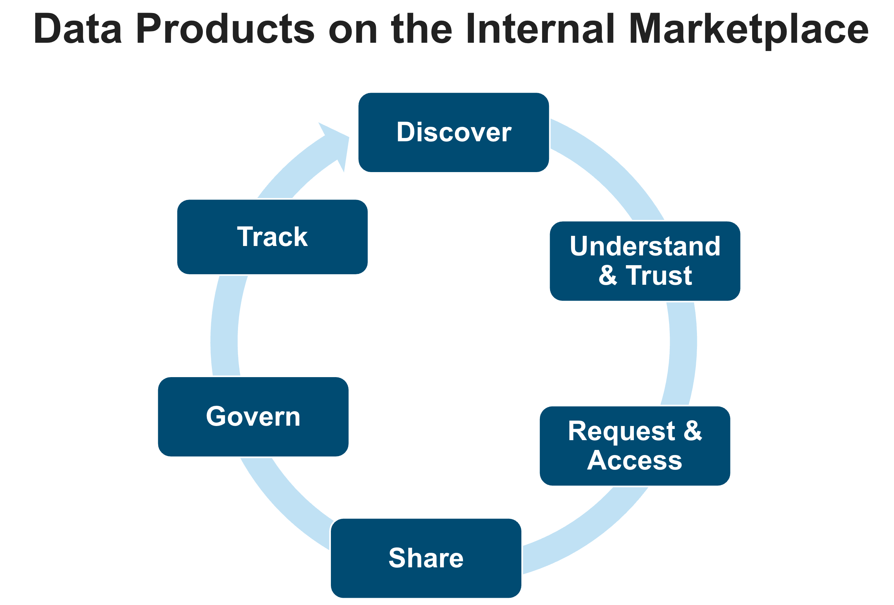


### What You’ll Learn

- How to publish, share, discover, and consume data product with the Snowflake Internal Marketplace
- How to setup profile for different business units that own the data products
- How to manage access to data products, including request & approval workflows 
- How to configure governance polices for fine-grained access control of data products across business units


### What You’ll Need

- Basic knowledge of SQL, Database Concepts
- Familiarity with using SQL in [Snowsight Worksheets](https://docs.snowflake.com/en/user-guide/ui-snowsight-worksheets-gs)

### What You’ll Build

- Data products based on simple TPC-H data
- Organizational Listings comprised of data and metadata
- Governance policies to manage your data products


## Prerequisites and Setup

The setup instructions for this lab describe all the steps for you to create the 3 accounts, domain profiles, and roles shown in the diagram below.

The internal marketplace exists by default. It does not need to be created. But, you will configure it with provider profiles for the different business units via the [organization account](https://docs.snowflake.com/en/user-guide/organization-accounts).

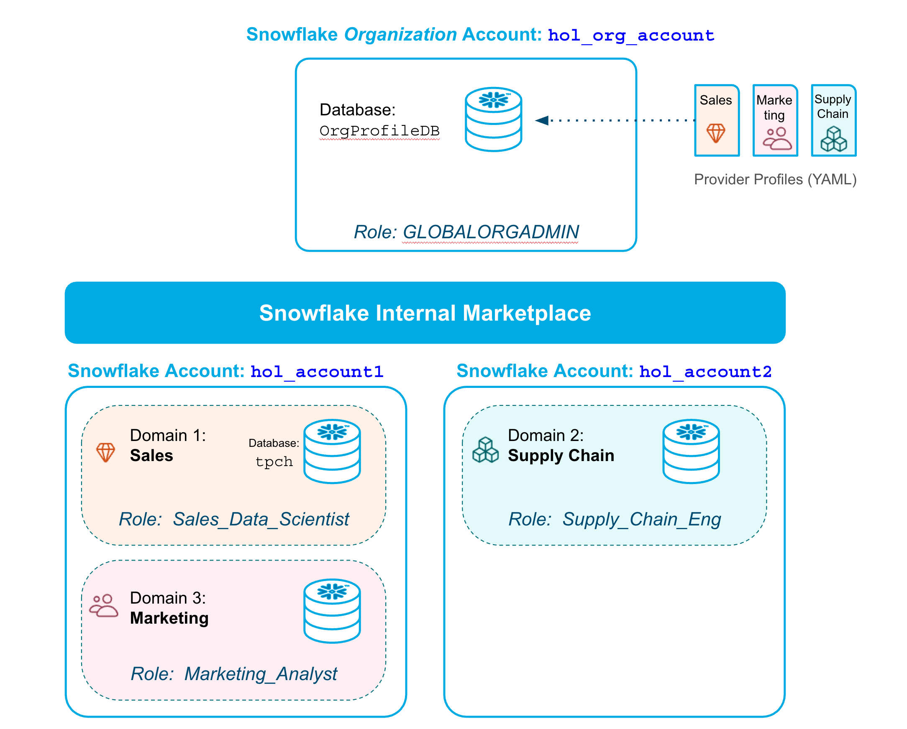

The setup has 6 steps:
- Step 1: Create a Snowflake trial account in a region of your choice
- Step 2: Configure the first account and create two more accounts _in the same org_
- Step 3: Configure the second account
- Step 4: Configure the organizaion account, and rename the first account 
- Step 5: Create profiles for the Sales, Marketing, and Supply Chain domains
- Step 6: Setup of a TPC-H sample database


### Step 1: Create a Snowflake trial account

Signup for a trial account [here](https://signup.snowflake.com/)

- Choose any cloud provider and region
- Choose **Enterprise Critical** edition
- Activate the account with admin user `sales_admin`


### Step 2: Configure the first account and create two more accounts _in the same org_
- Login as `sales_admin` to your Primary Account from Step 1 and execute the following commands in a worksheet. 
- In the first two commands, enter your own email and password!

```sql
USE ROLE accountadmin;

-- Use the same name and email for all accounts
set email_var = 'FILL_IN_YOUR_EMAIL';
set firstname_var  = 'FILL_IN_YOUR_FIRST_NAME';
set lasttname_var  = 'FILL_IN_YOUR_LAST_NAME';

-- Use the same password for users in all accounts
set pwd_var = 'FILL_IN_YOUR_PASSWORD';

CREATE OR REPLACE WAREHOUSE compute_wh WAREHOUSE_SIZE=small INITIALLY_SUSPENDED=TRUE;
GRANT ALL ON WAREHOUSE compute_wh TO ROLE public;

CREATE OR REPLACE ROLE sales_data_scientist_role;
GRANT CREATE SHARE ON ACCOUNT TO ROLE sales_data_scientist_role;
GRANT CREATE ORGANIZATION LISTING ON ACCOUNT TO ROLE sales_data_scientist_role;
GRANT ROLE sales_data_scientist_role TO USER sales_admin;

SET my_user_var = CURRENT_USER();
ALTER USER identifier($my_user_var) SET DEFAULT_ROLE = sales_data_scientist_role;


-- Next, create a user and role for the marketing domain
-- in the primary account:

USE ROLE accountadmin;
CREATE OR REPLACE ROLE marketing_analyst_role;

CREATE OR REPLACE USER marketing_admin
  PASSWORD = $pwd_var
  LOGIN_NAME = marketing_admin
  DISPLAY_NAME = marketing_admin
  FIRST_NAME = $firstname_var
  LAST_NAME = $lastname_var
  EMAIL = $email_var
  MUST_CHANGE_PASSWORD = FALSE
  DEFAULT_WAREHOUSE = compute_wh
  DEFAULT_ROLE = marketing_analyst_role
  COMMENT = 'Marketing domain admin';

GRANT ROLE marketing_analyst_role TO USER marketing_admin;
GRANT CREATE SHARE ON ACCOUNT TO ROLE marketing_analyst_role;
GRANT CREATE ORGANIZATION LISTING ON ACCOUNT TO ROLE marketing_analyst_role;
```
Check your email inbox for a message from "Snowflake Computing" and validate the email for the `marketing_admin` user. 

Now, run the following commands to create the next two accounts that you need. You can use the same worksheet as above. 

```sql
-- Create a secondary account in the same region (default!):
USE ROLE orgadmin;

CREATE ACCOUNT hol_account2
  admin_name = supply_chain_admin
  admin_password = $pwd_var
  first_name = $firstname_var
  last_name = $lastname_var 
  email = $email_var
  must_change_password = false
  edition = enterprise;

-- Create an organization account for admin purposes:
CREATE ORGANIZATION ACCOUNT hol_org_account
  admin_name = org_admin
  admin_password = $pwd_var
  first_name = $firstname_var
  last_name = $lastname_var 
  email = $email_var
  must_change_password = false
  edition = enterprise; 

-- Make a note of your account names, URLs, and passwords! 
-- Get an overview of all the accounts in the organization.
-- This SHOW command below should return 3 rows:

SHOW ACCOUNTS;
```


### Step 3: Configure the second account `hol_account2`
In a separate browser tab...

### Step 4: Configure the organizaion account and rename the first account 

### Step 5: Create profiles for the Sales, Marketing, and Supply Chain domains
Login to your Organization Account `HOL_ORG_ACCOUNT` to create data provider profiles. You will set up profiles for 3 business domains: **Sales**, **Marketing**, and **Supply chain**.

Download the script `create_org_profiles.sql` from....

Then....

<mark>We should create `create_org_profiles.sql` based on Step 5 in the setup instructions</mark>


### Step 6: Setup of a TPC-H sample database
Download the script `create_lab_database.sql` from....

<mark>We should create  `create_lab_database.sql` based on Step 6 in the setup instructions</mark>

Setup is now complete!

<!-- -------OLD--------- -->
## OLD!!!!  Provider Account Setup

<mark>we will remove this OLD section </mark>

 `Download ZIP` from the Lab Scripts [github site](https://github.com/Snowflake-Labs/sfguide-horizon-intra-organization-sharing)


Load the SQL scripts in the `code/sql` directory into [Snowsight Worksheets](https://docs.snowflake.com/en/user-guide/ui-snowsight-worksheets-gs#create-worksheets-in-sf-web-interface) - one script per worksheet

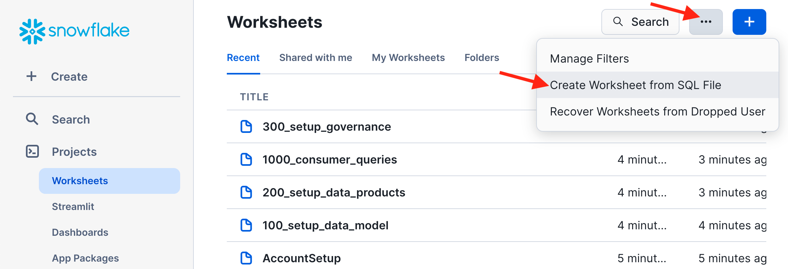

<mark>we will remove the OLD section above</mark>
<!-- ------- we will remove the OLD section above--------- -->


<!-- ----------------------------------------->
## Create and Publish an Organizational Listing in the Provider Studio UI

Duration: 20

In this section you will use in `hol_account1` create and publish [organizational listing](https://docs.snowflake.com/en/user-guide/collaboration/listings/organizational/org-listing-about). 

Login in to in `hol_account1` as `sales_admin`.

### Publishing Flow: Listing Title and Ownership

1. Navigate to the Provider Studio and click the blue **+Create Listing** button in the top right. Select "Internal Marketplace".

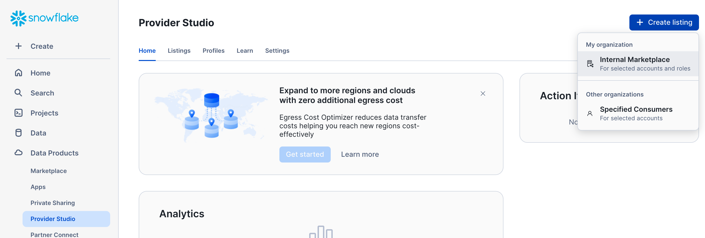
###
---
2. Give your data product a meaningful title. Let's use **Order Insights** in this lab. Click "Save".

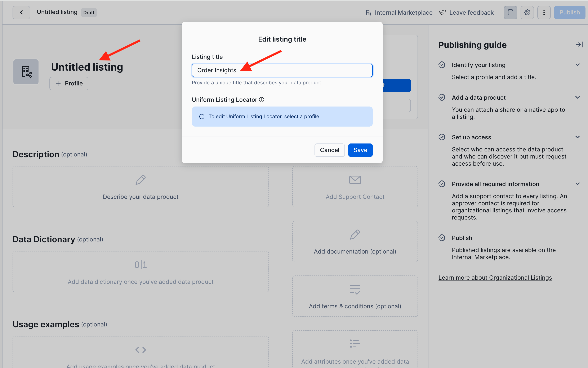
###
---
3. Click on the **+Profile** button and select the **Sales** profile as the owner of this data product. 

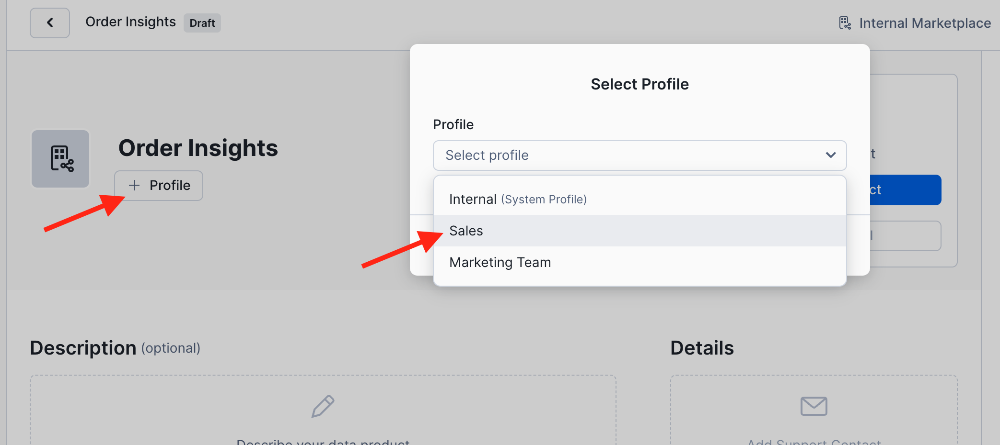

- When you save the profile selection, note that the contact email from the Sales profile is automatically entered as the default support contact for this listing. You can change on a per liusting basis it if you want. 
###
---

### Publishing Flow: Selecting Data Objects to Share

Now let's select the data objects that we want to share in this data product. 
- Click on the blue **+Add Data Product** button to open the object explorer. 

- Then, click **+ Select**, navigate to the SF1 schema of the TPCH database, and select all tables except *Region* and *Part*. Also select the ORDER_SUMMARY view and the  function ORDERS_PER_CUSTOMER. Click **Done** and **Save**.

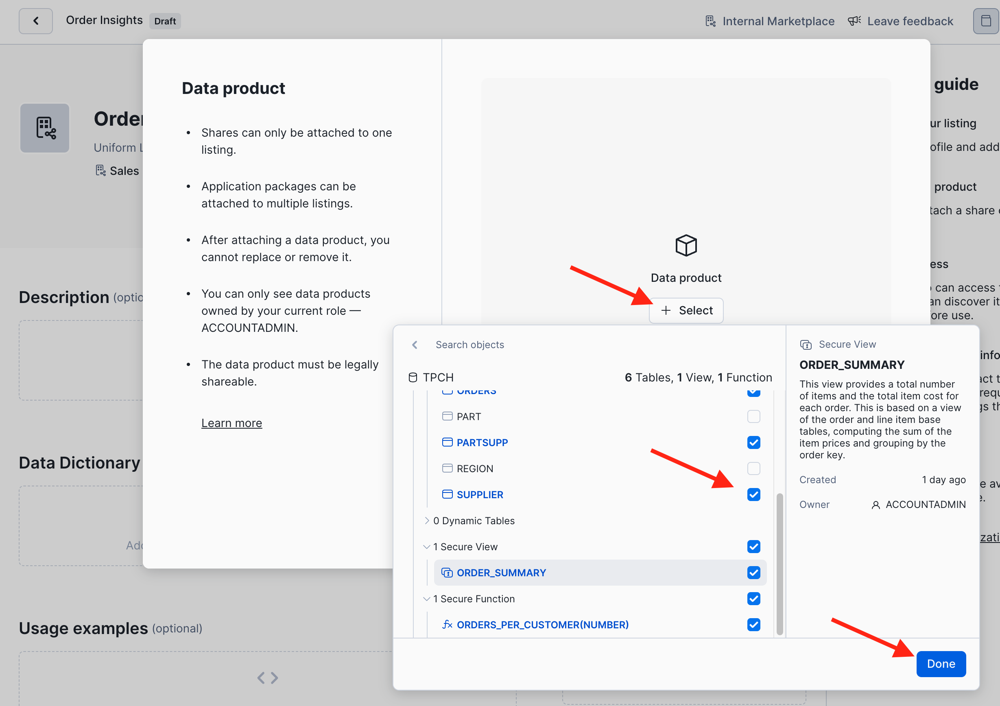

###
---
### Publishing Flow: Configure Access Control and the Approval Process

Next you set the access control for the data product. Click on the gray **+Access Control** button. 
- *Discovery* determines who can see the listing and all its metadata in the internal marketlace without having access to the shared data objects
- *Access* specifies who can discover the listing *and* access the shared data objects. 
###
For this first data product we keep it simple and stick with the defaults:

- *Grant Access*: No accounts or roles are pre-approved
- *Allow Discovery*: Entire Organization

As a result, every data consumer will need to request access to obatin approval to use the data product. Click on **Set up request approval flow** to proceed.

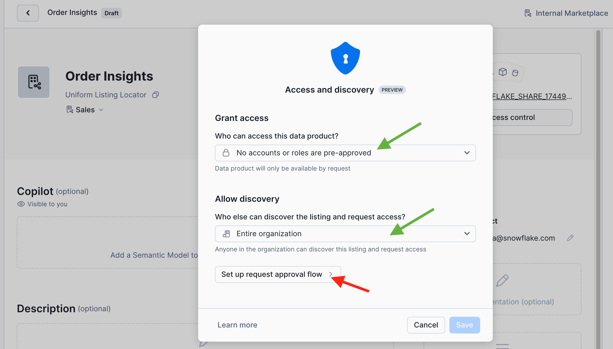

You could configure an external workflow engine for the request approval process. But for this lab we choose to **Manage requests in Snowflake**. The email address for notifications defaults to the one from the *Sales* profile but could be changed.

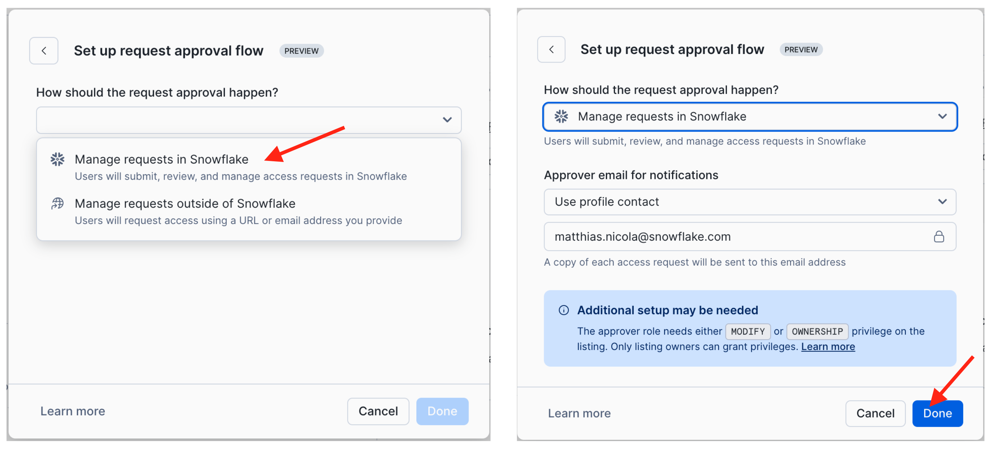

After you confirm the approval flow settings, Snowflake prompts you for one more configuration. Here is why: this listing is configured to be discoverable by the entire organization. What if you annother account to the organization but in a different cloud region? Then Snowflake would transparently perform incremental replication to that region to minimize egress cost. As the data provider you can choose the frequency of this replication.

So lets (1) **Review** the settings, (2) accept the default of daily replication, and then (3) **Save** the settings for this listing:

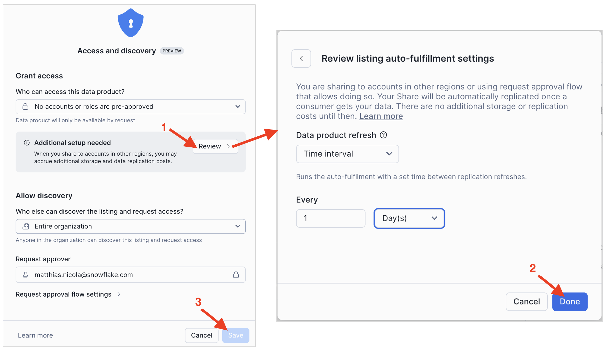

###
---
### Publishing Flow: Add Optional Metadata and SLOs
Data product should be understandable and trustworthy for data consumers so let's add additional metadata to describe the product (see screenshot below).

- Add a business **description** to document your listing.
  - For example: "This data product contains transactional records of customer orders, linking individual order details with specific items purchased. It includes information such as order IDs, customer identifiers, order dates, item names, quantities, and prices. This data can be leveraged to analyze customer purchasing patterns, identify popular products, understand order frequency, and gain insights into sales trends."

- **Add documention** by providing a URL to additional information. (You can enter any URL for now, such as http://www.snowflake.com/data-mesh)
- **Add terms & conditions** by providing a URL to where the T&Cs can be found.
- **Add attributes** that indicate **service level objectives** from the data product owner to data consumers. You can specify:
  - **Update Frequency**: How often you will refresh the data product, e.g. adding new or updated records to the shared tables. 
  - **Geographic Coverage**: The regions you will share this data product to, if your company uses Snowflake in multiple regions.
  - **Time Range**: Amount of history data included.
  - **Timestamp Granularity**: The interval between data points. For example, "*Event-based*" if there is one record for each incoming order, or "*Daily*" if order volumes are aggregated by date, and so on.
    
- Add at least one **Usage example** such as:
    ```sql
    -- Title: Explore the Order Summary View:

    SELECT * 
    FROM TPCH.SF1.ORDER_SUMMARY 
    LIMIT 100;

    -- Title: Use the UDF to obtain order details for one customer:

    SELECT customer_name, country, orderkey, orderdate, AMOUNT
    FROM TABLE(tpch.sf1.orders_per_customer(60001));
    ```


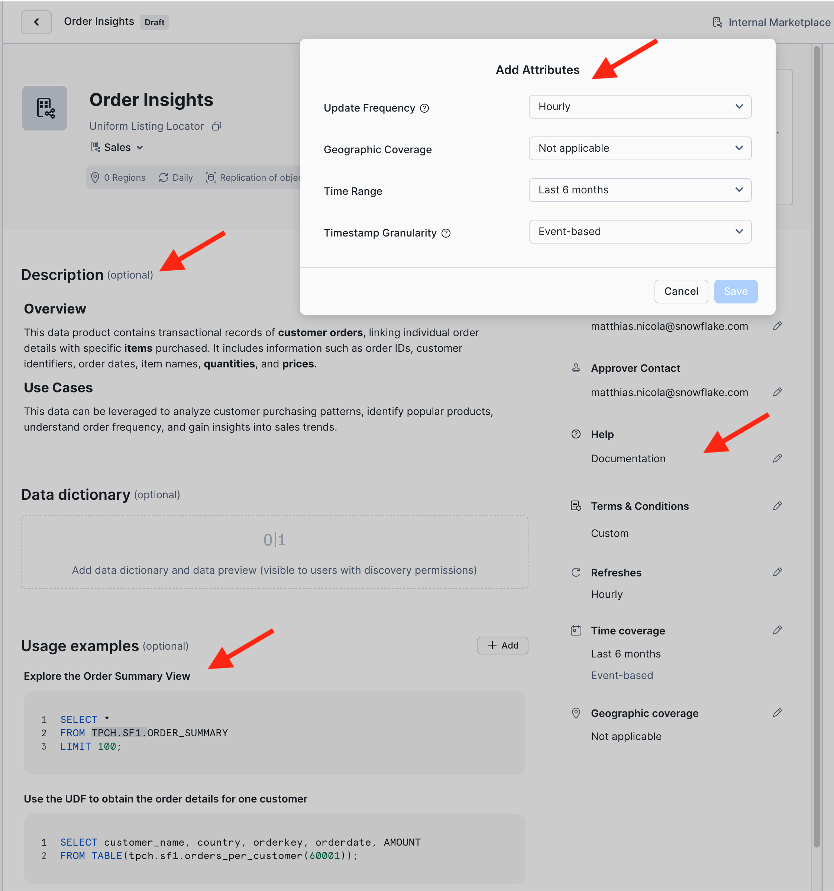

- Generate a **Data dictionary**. Snowflake will automatically compile column information and sample data for *all* objects in the data product.

    Select at least one (and up to 5) data objects and click **+Add to Featured**. These are the objects that consumers will see first in the dictionary.
    Suggestion: Select `customer`, `orders`, and `order_summary` to be featured.

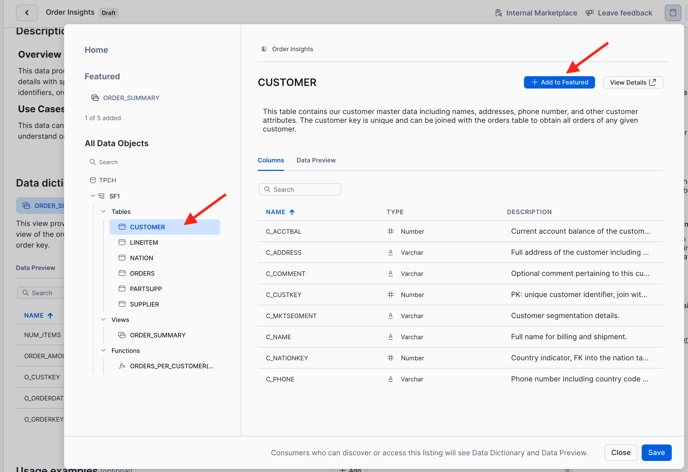

###
---
### Publishing Flow: Publish your listing to the internal marketplace

Click the blue **Publish** button in the top right corner.

Your data product is now live! You can see it when you navigate to the Internal Marketplace:

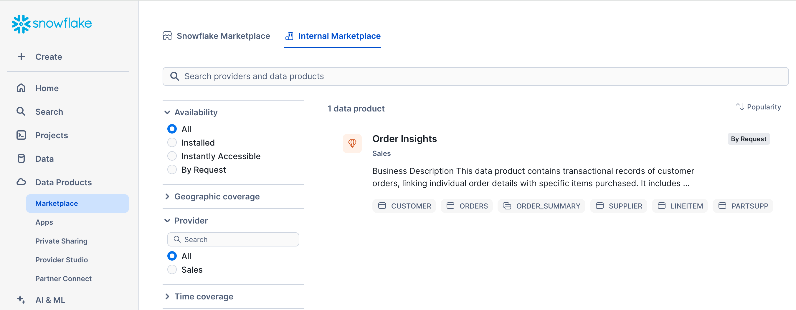

###
---


## Request and Grant Data Product Access for Data Consumers

In this section you will request sccess to the new data product for the **Marketing** domain and the **Supply chain** domain.

### Request Access

- Log out of your account `hol_account1` and log back in as the `marketing_admin` user.
- Navigate to the Internal Marketplace
- Click on the **Order Insights** listing
- Review all the listing elements from the data consumer point of view
- Click on the blue **Request Access** button
    - If you haven't previously validated your email of the `marketing_admin` user, Snowflake will now prompt you to do so, and you can follow the dialog to resend the verification email.
- The **Request access** dialog comes up. Enter a busines justification such as "*We need access to this data for our next marketing campaign.*" and submit the request. 
- After submitting the access request you can use the grey **View request** button to review or even withdraw your request. 
    - If you withdraw the request, please submit it again.

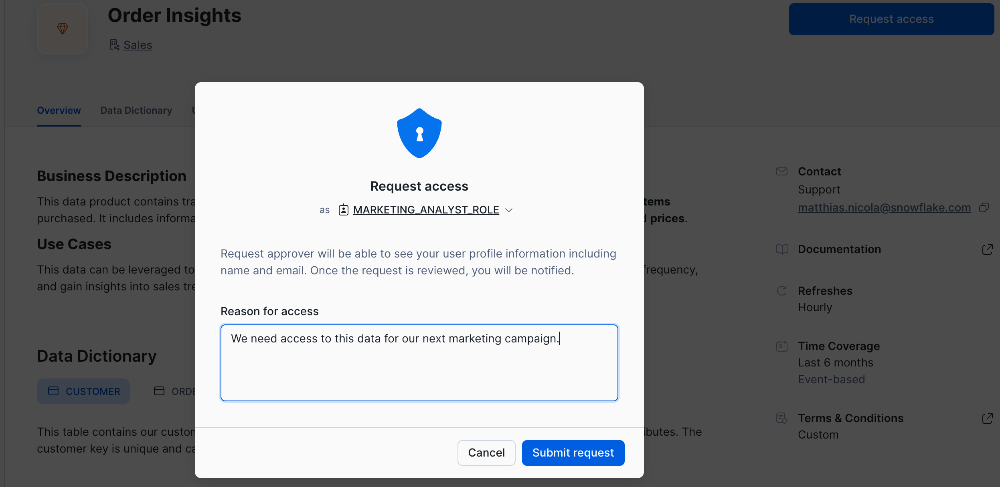

Now let's also request access for the  **Supply chain** team.
- In a seperate browser tab log into `hol_account2` as the `supply_chain_admin` user.
- Navigate to the Internal Marketplace, open the **Order Insights** listing, and **Request Access**
- Specify a reason for access such as "*We want to analyze order patters to optimize our supply chain operations.*"

### Review and Grant Access 

Let's switch back to the perspective of the data product owner to review and grant the access requests.
- Log into your account `hol_account1` as the `sales_admin` user.
- Navigate to the **Provider Studio** as shown in the screenshot below and open the tab **Internal Requests**.
- Click on each of the two requests to review the details and use the green **Grant** button to approve.

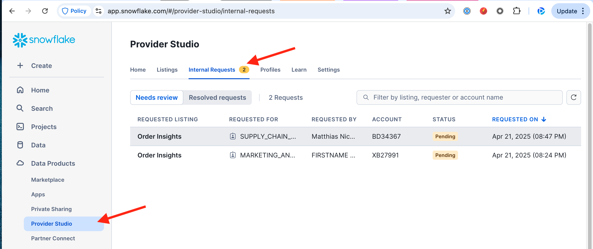

Switch from **Needs Review** to **Resolved Requests** to the history of requests. 

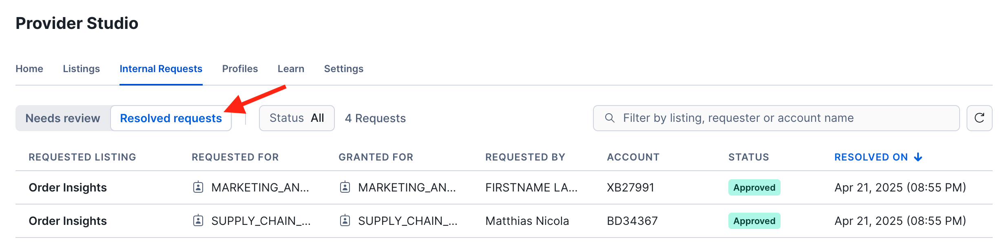

---
###


## Use an Organizational Listing as a Data Consumer

Now that access has been granted let's go back to at least one of the consumer roles:

- Log into account `hol_account1` as the `marketing_admin` user.
- In a seperate browser tab log into `hol_account2` as the `supply_chain_admin` user. *(Keep this tab alive for the rest of the lab.)*
- In the Internal Marketplace open the **Order Insights** listing again
- The blue **Request Access** button has now changed to **Query in Worksheet**. Reload the browser tab if needed to see the change.
- Click **Query in Worksheet**. Review and run the data poduct sample queries. *(Keep this tab alive for the rest of the lab.)*
- In the SQL, note the ULL (Uniform Listing Locator) that references the data product.

## Live data sharing in action

What happens when the data owner decides to update the data product?

- Switch back to the data provider side, ie. `sales_admin` user
in `hol_account1`
- Review the order details for customer 60001. 
```sql
use schema tpch.sf1;
use role sales_data_scientist_role;

SELECT customer_name, country, orderkey, orderdate, AMOUNT
FROM TABLE(orders_per_customer(60001));
```
- Note that customer 60001 lives in Kenya. But, he has moved to Mozambique which requires the following update:

```sql
-- Customer 60001 moves from Kenya to MOZAMBIQUE !
UPDATE customer SET c_nationkey = 16 WHERE c_custkey = 60001;
```
- Now switch to your browser tab where you are logged into `hol_account2` as `supply_chain_admin`. In the worksheet "**Order Insights - Examples**" run the second sample query again:

```sql
// Use the UDF to obtain the order details for one customer
SELECT customer_name, country, orderkey, orderdate, AMOUNT
FROM TABLE(ORGDATACLOUD$SALES$ORDER_INSIGHTS.sf1.orders_per_customer(60001));
```
- Note that the updated country information is instantly visible to data consumers!
- Other data product changes such as adding a column to a table would also be immediatly reflected on the consumer side. 
- **Best practice:** inform your data consumers of structural data product changes ahead of time.  In case of a breaking change consider creating a new listing "v2.0" and give data consumers time to migrate from the old to the new listing.

<mark> !!! we could add a structural data change here. maybe later if we have time !!!</mark>


## Simple Data Goverance Policies

Let's examine some simple techniques for row- and colum-level access control across domains.

- Switch back to the data provider side, ie. `sales_admin` user
in `hol_account1`
- Review the order summary view. Note that it returns data for customers in many different countries:
```sql
use schema tpch.sf1;
use role sales_data_scientist_role;

SELECT *
FROM order_summary; 
LIMIT 100;
```
### Row-level access control across domains
The data steward of the Sales domain has requested the following access restrictions:
- The marketing team may only see data for customers in Canada.
- The supply chain team may only see data for customers in the US.
  
Implement the following policy to make your data product compliant:

```sql
use schema tpch.sf1;
use role sales_data_scientist_role;

CREATE OR REPLACE ROW ACCESS POLICY country_filter AS (country INTEGER) 
RETURNS boolean ->
  CASE
    WHEN current_account_name() = 'HOL_ACCOUNT1' 
     AND current_role()         = 'SALES_DATA_SCIENTIST_ROLE'
     THEN true
    WHEN current_account_name() = 'HOL_ACCOUNT1' 
     AND current_role()         = 'MARKETING_ANALYST_ROLE'
     AND country                = 3 /* Canada */
     THEN true
    WHEN current_account_name() = 'HOL_ACCOUNT2' 
     AND country                = 24 /* USA */
     THEN true
   ELSE false
  END;

 ALTER TABLE nation ADD ROW ACCESS POLICY country_filter ON (n_nationkey); 
```
Before we review the impact of this policy on the data consumers, let's look at another governance requirement that requires column masking.
 
 ### Data masking across domains

The data steward of the Sales domain has requested the following data masking to enforced:
- The marketing and supply chain teams are not allowed to see order pricing or amount information for orders placed before 1996.

Implement the following policy to make your data product compliant:

```sql
CREATE OR REPLACE MASKING POLICY order_mask AS (value INT) RETURNS INT ->
  CASE
    WHEN current_account_name() = 'HOL_ACCOUNT1' 
     AND current_role()         = 'SALES_DATA_SCIENTIST_ROLE'
     THEN value
    WHEN current_account_name() = 'HOL_ACCOUNT1' 
     AND current_role()         = 'MARKETING_ANALYST_ROLE'
     THEN null
    WHEN current_account_name() = 'HOL_ACCOUNT2' 
     THEN null
   ELSE null
  END;

ALTER TABLE orders ALTER COLUMN o_totalprice SET MASKING POLICY order_mask;
ALTER TABLE lineitem ALTER COLUMN l_extendedprice SET MASKING POLICY order_mask;
```


<mark> !!! ! ! ! need to continue working here !!! !!!</mark>


1. Observe live data sharing in action

- Switch to the **AWS Provider** account where you published the listing
- Insert or update some of the source data. You can use the following statement which uses [a very cool SQL feature](https://docs.snowflake.com/en/sql-reference/sql/select#label-select-cmd-examples-select-all-in-table-replace) to modify the columns produced by ```SELECT *```.  
The syntax ```SELECT * REPLACE (<expression> AS <column_name>)``` returns all columns but replaces the column ```<column_name>``` with the ```<expression>```.

```sql
-- re-insert existing data for Berlin but give it today's date as the valid date 
INSERT INTO FROSTBYTE_TASTY_BYTES.WEATHER.HISTORY_DAY
  SELECT * REPLACE  (current_date AS DATE_VALID_STD) 
  FROM FROSTBYTE_TASTY_BYTES.WEATHER.HISTORY_DAY
  WHERE city_name = 'Berlin'
  ORDER BY date_valid_std DESC;
  ```

- Switch back to your **Horizon_Lab_AWS_Consumer** account to see that the data changes are instantly visible. For example:

```sql
SELECT *
FROM tasty_bytes_analytics.HARMONIZED.DAILY_WEATHER_V
WHERE city_name = 'Berlin'
ORDER BY date_valid_std DESC;
```

## Listing Management and Monitoring

Duration: 20

### Use the Listing API to modify listing properties programmatically

1. [SHOW LISTINGS](https://other-docs.snowflake.com/en/sql-reference/sql/show-listings) in the AWS Provider account where you published the listing.

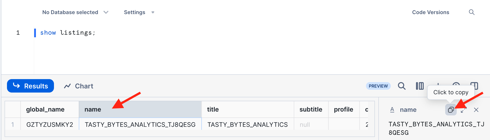

2. Copy the Snowflake object name of your listing and use it in the subsequent [DESCRIBE LISTING](https://other-docs.snowflake.com/en/sql-reference/sql/desc-listing) command.

- Note: If that listing name contains special characters other than the underscore, then the name must be in double quotes and is case-sensitive.

3. In the result of DESCRIBE LISTING, scroll to the right to the column [MANIFEST_YAML](https://other-docs.snowflake.com/en/progaccess/listing-manifest-reference) and copy its column value. This YAML file is a complete representation of the listing and enables programmatic management of listings.

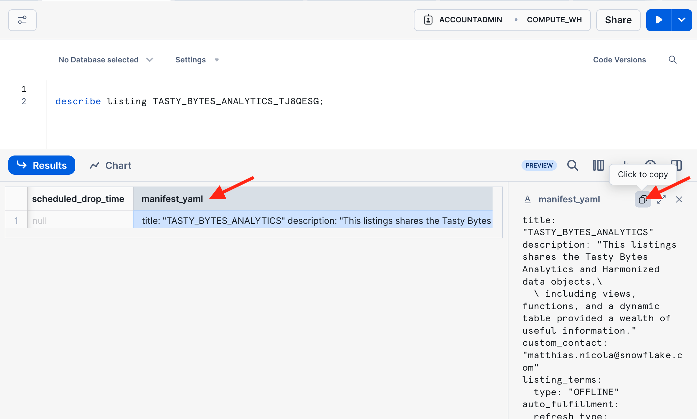

4. Paste the copied YAML into an [ALTER LISTING](https://other-docs.snowflake.com/en/sql-reference/sql/alter-listing) statement using the listing name obtained in step 2 above (Show Listing).

- Make some changes in the YAML that you can easily verify in the UI and on the consumer side. For example, update the title and the first line of the description.
- Execute the ALTER LISTING statement.


5. Verify the immediate effect of the ALTER LISTING statement

- In the provider account, navigate to the Provider Studio, select "Listings" from the horizontal menu at the top, and open your listing.

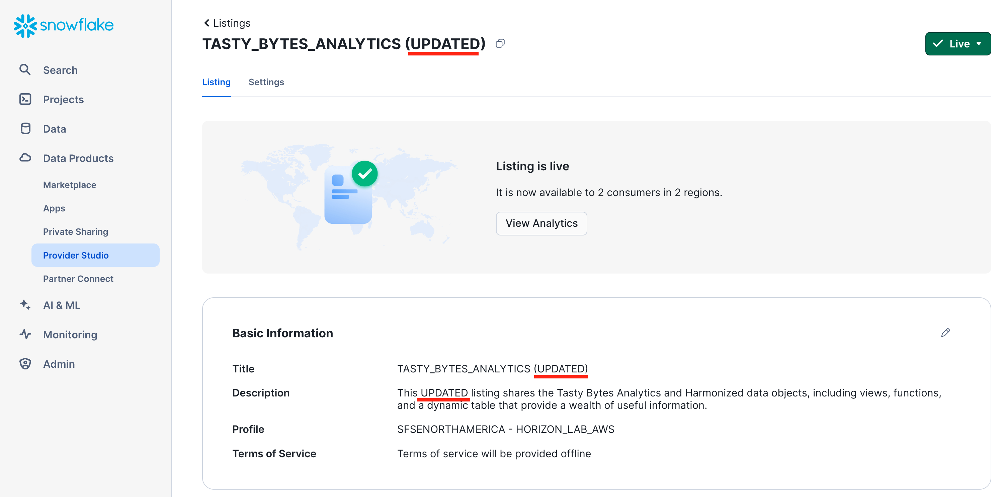

- Switch to your consumer account Horizon_Lab_AWS_Consumer.
- Navigate to "Data Products", then "Private Sharing", and open the listing page again. Refresh if needed to see the changes from the ALTER LISTING statement.

### Monitor Auto Fulfillment status and cost

Time to revisit the second consumer account ("horizon_lab_azure_consumer") and the replication into that Azure region. By now, the one-time replication setup has been completed in the background and the data product is now ready to use.

1. Switch to the account "horizon_lab_azure_consumer" as ACCOUNTADMIN, and navigate to "Private Sharing" to open the listing that has been shared.

2. Click the GET button to mount the data product locally, as you did in the "horizon_lab_aws_consumer" account.

3. Switch to the AWS Provider account and take the following steps to monitor replication status and cost.

4. Navigate to the "Provider Studio", select "Listings" from the horizontal menu at the top, and open your listing.

5. On the listings page, scoll down to "Consumer Account", click on the 3 dots, and select "Manage Regions & Replication"

6. Select the "Azure West Europe Region" to see the timestamp of the latest refresh to that region.

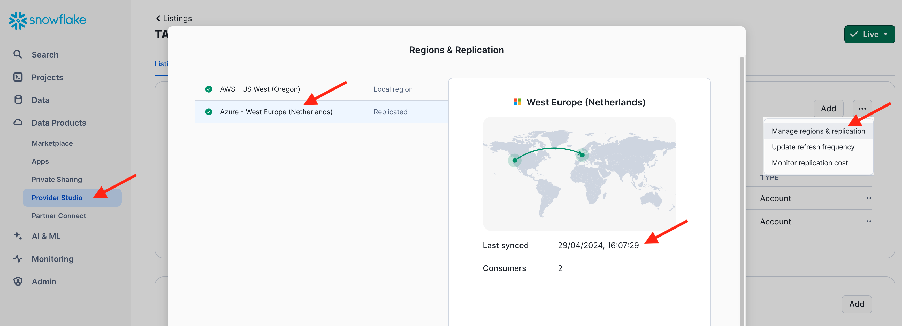

7. Go back to the Provider Studio, select "Analytics" from the horizontal menu at the top. This is where summarized and detailed statistics about the usage of the listings will be displayed eventually. There is some delay in populating these statistics, but the following screenshots give you an idea of what you will see.

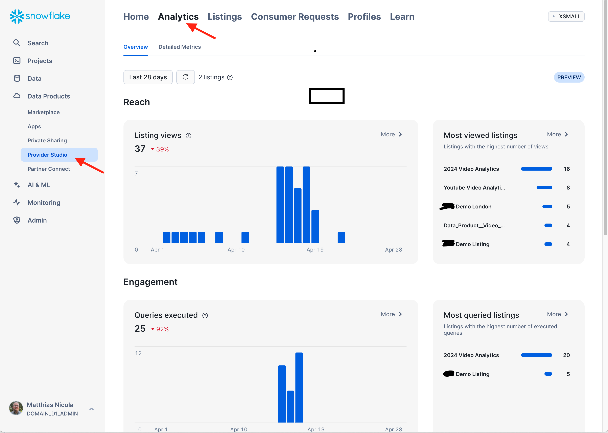

The same information as well as replication details can also be obtained from various views in the schema [SNOWFLAKE.DATA_SHARING_USAGE](https://docs.snowflake.com/en/sql-reference/data-sharing-usage) and [SNOWFLAKE.ORGANIZATION_USAGE](https://docs.snowflake.com/en/sql-reference/organization-usage):

```sql
use database SNOWFLAKE;

select * from DATA_SHARING_USAGE.LISTING_ACCESS_HISTORY;

select * from DATA_SHARING_USAGE.LISTING_AUTO_FULFILLMENT_DATABASE_STORAGE_DAILY;

select * from DATA_SHARING_USAGE.LISTING_AUTO_FULFILLMENT_REFRESH_DAILY;

select * from DATA_SHARING_USAGE.LISTING_EVENTS_DAILY;

select * from DATA_SHARING_USAGE.LISTING_TELEMETRY_DAILY;

select * from ORGANIZATION_USAGE.LISTING_AUTO_FULFILLMENT_USAGE_HISTORY;

select * from ORGANIZATION_USAGE.REPLICATION_USAGE_HISTORY:
```

8. The [replication cost](https://other-docs.snowflake.com/en/collaboration/provider-understand-cost-auto-fulfillment) can also be monitored in the UI. Navigate to the "Admin" menu in the left-hand panel, then to "Cost Management" and "Consumption". Switch the filter from "All Services" to "Cross-Cloud Auto-Fulfillment". Here is an example from a different test replicating a listing to the region Azure UK South:

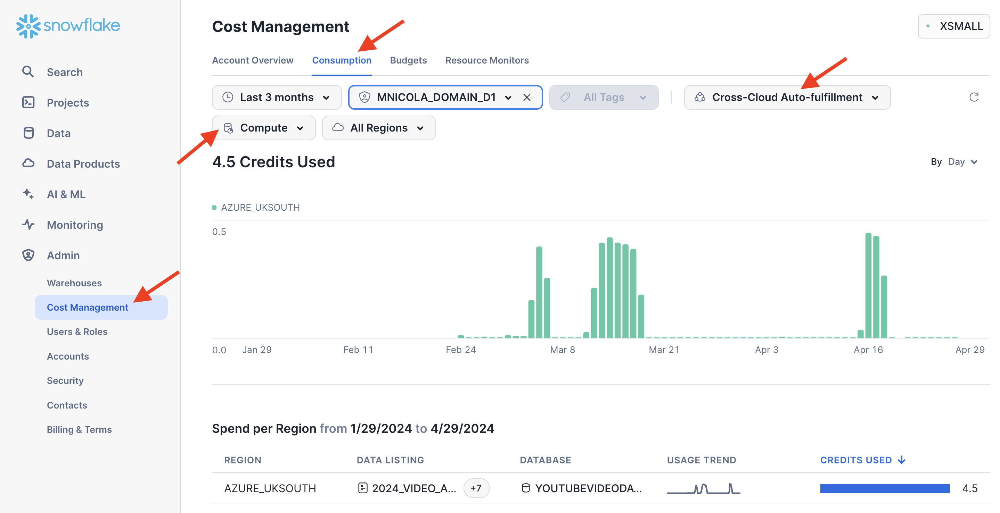

 Additional filters enable you to select a time period, pick a specific target region, or toggle between compute cost, storage cost, and data transfer volume incurred by the listing auto-fulfillment.

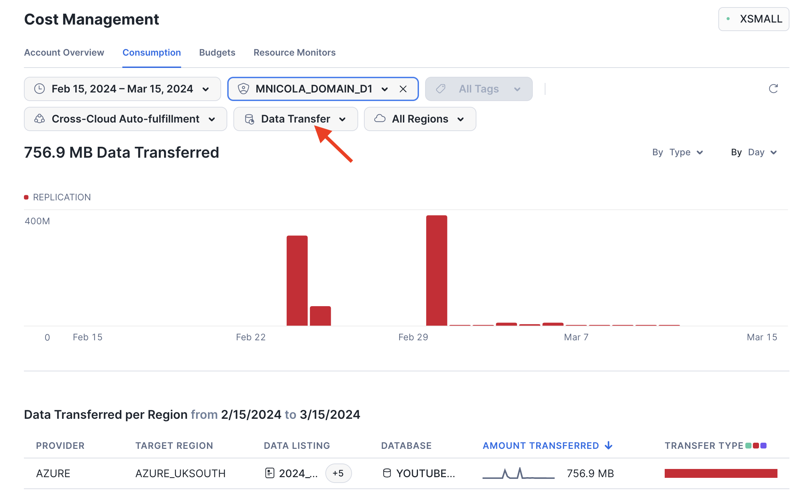

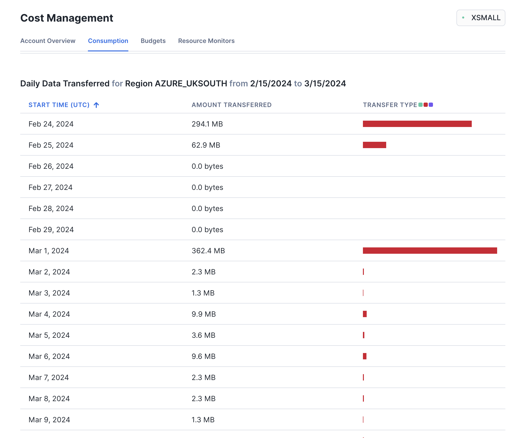

### Enable and Consume Change Tracking

The provider of a listing can choose to enable [change tracking](https://docs.snowflake.com/en/user-guide/streams) on the some or all of the tables or views that are shared in a listing. This enables the consumer to track the data changes. Let's do that with the view DAILY_WEATHER_V:

```sql
-- in the provider account:
ALTER VIEW FROSTBYTE_TASTY_BYTES.HARMONIZED.DAILY_WEATHER_V 
      SET CHANGE_TRACKING = TRUE;
```

The consumer can now [define a Stream](https://docs.snowflake.com/en/sql-reference/sql/create-stream) to capture the data changes in this view:

```sql
-- in the consumer account:
CREATE DATABASE tasty_bytes_local;
USE DATABASE tasty_bytes_local;

CREATE STREAM stream_daily_weather_changes ON VIEW tasty_bytes_analytics.HARMONIZED.DAILY_WEATHER_V;
```

To see the change tracking in action you can now insert, update, or delete some of the weather related data in the AWS Provider account. For example:

```sql
-- in the provider account:
INSERT INTO FROSTBYTE_TASTY_BYTES.WEATHER.HISTORY_DAY
  SELECT * REPLACE  (current_date AS DATE_VALID_STD) 
  FROM FROSTBYTE_TASTY_BYTES.WEATHER.HISTORY_DAY
  WHERE city_name = 'San Mateo'
  ORDER BY date_valid_std DESC;
  ```

Now switch to the consumer account and query the stream:

```sql
-- in the consumer account:
USE DATABASE tasty_bytes_local;

SELECT METADATA$ACTION, METADATA$ISUPDATE, * 
FROM stream_daily_weather_changes;
```

<!-- ------------------------ -->
## Protect Data with Governance Policies

Duration: 20

This section of the lab introduces several capabilities for data providers to restrict the usage of their products by consumers.

### Cross-Account Row-Level Access Policies

Frosty the data steward is concerned that our listing that we have shared includes the view ANALYTICS.CUSTOMER_LOYALTY_METRICS_V which contains sensitive information that must not be accessible to all data consumers. He requests the following restrictions:

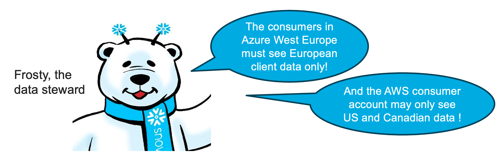

Let's implement a [row-level access policy](https://docs.snowflake.com/en/user-guide/security-row-intro) to implement the required access control. Note the usage of the context function **current_account_name()** to detect which consumer account is accessing the shared view.

<mark>Fill in AWS Provider Account Name below</mark>

```sql
use database frostbyte_tasty_bytes;
use schema analytics;

CREATE OR REPLACE ROW ACCESS POLICY country_filter AS (country string) 
RETURNS boolean ->
  CASE
    WHEN current_account_name() IN ('HORIZON_LAB_AWS_CONSUMER') 
      AND country               IN ('United States', 'Canada') 
      THEN true
    WHEN current_account_name() IN ('HORIZON_LAB_AZURE_CONSUMER')        
      AND country               IN ('France', 'Germany', 'Poland', 'Sweden', 'Spain') 
      THEN true
    WHEN current_account_name() IN ('*** FILL IN AWS Provider Account Name ***')
      THEN true
      ELSE false
  END;
  ```

Then apply the policy to the shared view:

```sql
ALTER VIEW CUSTOMER_LOYALTY_METRICS_V ADD ROW ACCESS POLICY country_filter ON (country);
```

Now switch to the consumer account HORIZON_LAB_AWS_CONSUMER to confirm that only US and Canadian client data is visible in the view ANALYTICS.CUSTOMER_LOYALTY_METRICS_V.

After the replication interval of 1 minute you will also see that the consumer account HORIZON_LAB_AZURE_CONSUMER can only see the Eurpean clients.

### Cross-Account Column Masking

But, Frosty the data steward is not yet satisfied:

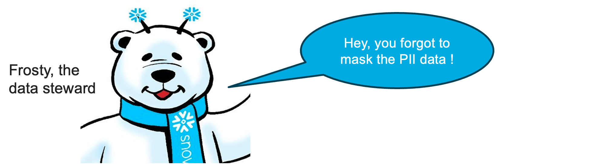

Ok, let's get to work.

To make things easy, let's first create a tag that you can use to indicate which columns contain PII data.

```sql
CREATE SCHEMA IF NOT EXISTS tags;

CREATE OR REPLACE TAG tags.tasty_pii
    ALLOWED_VALUES 'NAME', 'PHONE_NUMBER', 'EMAIL', 'BIRTHDAY'
    COMMENT = 'Tag for PII, allowed values are: NAME, PHONE_NUMBER, EMAIL, BIRTHDAY';
```

With the tag created, let's assign it to the relevant columns in the Customer Loyalty view:

```sql
ALTER VIEW ANALYTICS.CUSTOMER_LOYALTY_METRICS_V
    MODIFY COLUMN 
    first_name    SET TAG tags.tasty_pii = 'NAME',
    last_name     SET TAG tags.tasty_pii = 'NAME',
    phone_number  SET TAG tags.tasty_pii = 'PHONE_NUMBER',
    e_mail        SET TAG tags.tasty_pii = 'EMAIL';
```

Optionally, you can also use the UI to add or see the tags on these columns:

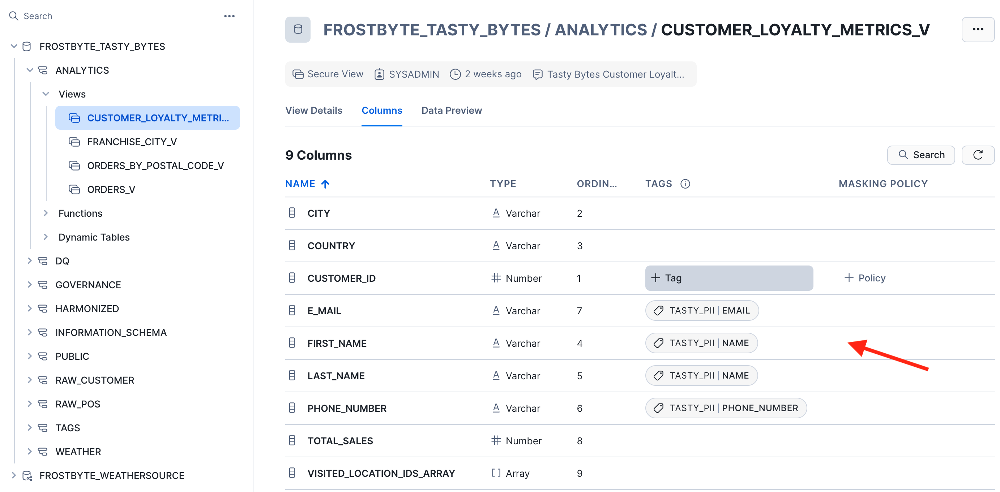

Now let's create a slightly more advanced [policy to mask the PII columns depending on their tag](https://docs.snowflake.com/en/user-guide/tag-based-masking-policies) value and the consmer account:

<mark>Fill in AWS Provider Account Name below</mark>

```sql
CREATE OR REPLACE MASKING POLICY pii_string_mask AS (value STRING) RETURNS STRING ->
  CASE
    -- two roles in the provider account have access to unmasked values 
    WHEN CURRENT_ACCOUNT_NAME() IN ('*** FILL IN AWS Provider Account Name ***') 
    AND CURRENT_ROLE()          IN ('ACCOUNTADMIN','SYSADMIN')
    THEN value

    -- For consumers in the 2nd AWS account: if a column is tagged with 
    -- TASTY_PII=PHONE_NUMBER then mask everything except the first 3 digits   
    WHEN CURRENT_ACCOUNT_NAME() IN ('HORIZON_LAB_AWS_CONSUMER') 
    AND SYSTEM$GET_TAG_ON_CURRENT_COLUMN('TAGS.TASTY_PII') = 'PHONE_NUMBER'
    THEN CONCAT(LEFT(value,3), '-***-****')
        
    -- For consumers in the Azure account: if a column is tagged with  
    -- TASTY_PII=EMAIL then mask everything before the @ sign  
    WHEN CURRENT_ACCOUNT_NAME() IN ('HORIZON_LAB_AZURE_CONSUMER') 
    AND SYSTEM$GET_TAG_ON_CURRENT_COLUMN('TAGS.TASTY_PII') = 'EMAIL'
    THEN CONCAT('**~MASKED~**','@', SPLIT_PART(value, '@', -1))
        
    -- all other cases and columns, such as first and last name, should be fully masked   
    ELSE '**~MASKED~**' 
  END;
```

Next, apply the policy to the tag so that the policy takes effect on all tages columns:

```sql
ALTER TAG tags.tasty_pii SET MASKING POLICY pii_string_mask;
```

Now switch to the consumer account HORIZON_LAB_AWS_CONSUMER and look at the view CUSTOMER_LOYALTY_METRICS_V to confirm that phone numbers are partially masked while the other PII columns are fully masked.

After the replication interval of 1 minute you will see in the account HORIZON_LAB_AZURE_CONSUMER that emails are partially masked while phone numbers and names are fully masked.  

### Database Roles - Provider Side

Just when we thought we had all the necessary governance controls in place, Frosty has a new requirement for us.

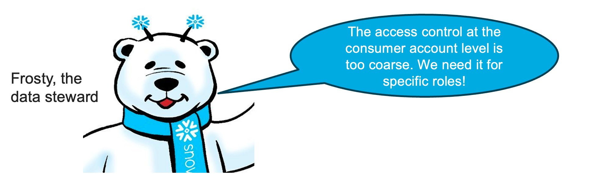

So far we have been using the context function **CURRENT_ACCOUNT_NAME()** in our governance policies to control which consumer account can see which data. Now Frosty is telling us, that this needs to be more fine-grained down to indivudal roles on the consumer side.

We will be using roles and [database roles](https://docs.snowflake.com/en/sql-reference/sql/create-database-role) for 3 different continents. Let's check that we have the correct roles in place.

On the AWS Provider account, use **show database roles** to confirm that you have 4 database roles in place. Else create them now.

```sql
show database roles in database FROSTBYTE_TASTY_BYTES;

USE DATABASE frostbyte_tasty_bytes;
CREATE OR REPLACE DATABASE ROLE tastybytes_emea_role;
CREATE OR REPLACE DATABASE ROLE tastybytes_americas_role;
CREATE OR REPLACE DATABASE ROLE tastybytes_apj_role;
CREATE OR REPLACE DATABASE ROLE tastybytes_manager_role;
```

We can use these roles to define more granular and role-based access control for the data consumers. First, we need to give these roles access to the providers's schema and objects that we want to govern, in this case ANALYTICS.CUSTOMER_LOYALTY_METRICS_V:

```sql
use database FROSTBYTE_TASTY_BYTES;

grant usage  on schema ANALYTICS to database role tastybytes_emea_role;
grant usage  on schema ANALYTICS to database role tastybytes_americas_role;
grant usage  on schema ANALYTICS to database role tastybytes_apj_role;
grant usage  on schema ANALYTICS to database role tastybytes_manager_role;

grant select on view ANALYTICS.CUSTOMER_LOYALTY_METRICS_V 
             to database role tastybytes_emea_role; 
grant select on view  ANALYTICS.CUSTOMER_LOYALTY_METRICS_V 
             to database role tastybytes_americas_role; 
grant select on view  ANALYTICS.CUSTOMER_LOYALTY_METRICS_V 
             to database role tastybytes_apj_role; 
grant select on view  ANALYTICS.CUSTOMER_LOYALTY_METRICS_V 
             to database role tastybytes_manager_role; 
```

Next, use the context function [**IS_DATABASE_ROLE_IN_SESSION()**](https://docs.snowflake.com/en/sql-reference/functions/is_database_role_in_session) to recreate our row-level access policy to define which role can see customer loyality data from which country.

<mark>Fill in Provider Account Name in the last WHEN clause of the policy below</mark>

```sql
use database frostbyte_tasty_bytes;
use schema analytics;

ALTER VIEW CUSTOMER_LOYALTY_METRICS_V DROP ROW ACCESS POLICY country_filter;

<mark>Fill in Provider Account Name below</mark>

CREATE OR REPLACE ROW ACCESS POLICY country_filter AS (country string) 
RETURNS boolean ->
  CASE
    -- users with the AMERICAS role can see data from the US, Canada, and Brazil
    WHEN IS_DATABASE_ROLE_IN_SESSION('TASTYBYTES_AMERICAS_ROLE') 
     AND country IN ('United States', 'Canada', 'Brazil') 
    THEN true
    -- users with the EMEA role can see data from these EMEA countries
    WHEN IS_DATABASE_ROLE_IN_SESSION('TASTYBYTES_EMEA_ROLE')         
     AND country IN ('France', 'Germany', 'Poland', 'Sweden', 
                     'Spain' , 'South Africa', 'Egypt') 
    THEN true
    -- users with the APJ role can see data from these APJ countries
    WHEN IS_DATABASE_ROLE_IN_SESSION('TASTYBYTES_APJ_ROLE')         
     AND country IN ('Japan', 'Australia', 'India', 'South Korea') 
    THEN true
    -- users with the manager role can see all data
    WHEN IS_DATABASE_ROLE_IN_SESSION('TASTYBYTES_MANAGER_ROLE')         
    THEN true
    -- the account admin in the provider account can see all data
    WHEN current_account_name() IN ('*** FILL IN AWS Provider Account Name ***') 
     AND current_role() = 'ACCOUNTADMIN'
    THEN true
    ELSE false
  END;

ALTER VIEW CUSTOMER_LOYALTY_METRICS_V 
      ADD ROW ACCESS POLICY country_filter ON (country);
```

For a larger number of roles and countries you can certainly use a mapping table from role to country so that the policy simply performs a lookup in the mapping table.

The final step in the provider account is to share the database roles to the consumer accounts along with the data product.  This is achieved by [granting the database roles to the share](https://docs.snowflake.com/en/sql-reference/sql/grant-database-role-share):

```sql
-- Use your share name in these commands.
-- See below for hints on how to find your share name.
GRANT DATABASE ROLE tastybytes_emea_role     TO SHARE <share_name>;
GRANT DATABASE ROLE tastybytes_americas_role TO SHARE <share_name>;
GRANT DATABASE ROLE tastybytes_apj_role      TO SHARE <share_name>;
GRANT DATABASE ROLE tastybytes_manager_role  TO SHARE <share_name>;
```

Here are two options how to find the share name for your listing:

**Option 1:**

In the provider account, navigate to the Provider Studio, select "Listings" from the horizontal menu at the top, and open your listing. In the section "Data Product" you find the name of the Secure Share that bundles the shared data objects.
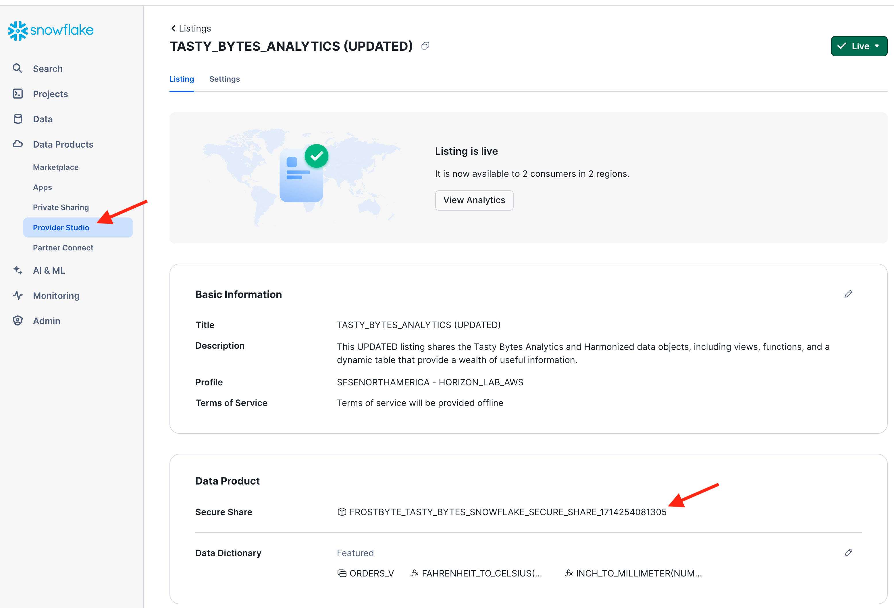

**Option 2:**

Use the SHOW SHARES command:

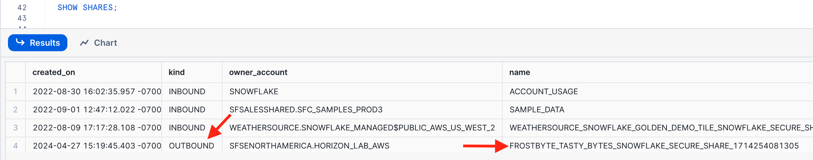

Copy the share name to a text file or worksheet because you will need it again later.

### Database Roles - Consumer Side

To complete the configuration of cross-account role-based access control you need to assign the shared database roles to local account roles in the consumer roles.

Switch to your consumer accounts.  

In each of your consumer accounts you should already have the following 4 roles that you created during the account setup. Verify that these roles are in place. Else, create them now.

```sql
SHOW ROLES LIKE 'SALES%';

CREATE OR REPLACE ROLE sales_emea_role     COMMENT = 'EMEA Sales role';
CREATE OR REPLACE ROLE sales_americas_role COMMENT = 'Americas Sales role ';
CREATE OR REPLACE ROLE sales_apj_role      COMMENT = 'APJ Sales role ';
CREATE OR REPLACE ROLE sales_manager_role  COMMENT = 'Manager (all-access) role';
```

In a real-world scenario you would now assign each of these roles to different users. For simplicity in this lab, grant all of these roles to yourself:

```sql
SET my_user_var  = CURRENT_USER();
GRANT ROLE sales_emea_role     TO USER identifier($my_user_var);
GRANT ROLE sales_americas_role TO USER identifier($my_user_var);
GRANT ROLE sales_apj_role      TO USER identifier($my_user_var);
GRANT ROLE sales_manager_role  TO USER identifier($my_user_var);
```

And finally, grant the shared database roles to the local account roles. This connects these local consumers roles to the row-access policy that you create on the provider side.

```sql
use database TASTY_BYTES_ANALYTICS;
grant database role tastybytes_emea_role     to role sales_emea_role; 
grant database role tastybytes_americas_role to role sales_americas_role;
grant database role tastybytes_apj_role      to role sales_apj_role; 
grant database role tastybytes_manager_role  to role sales_manager_role;
```

The following picture illustrates the use of our database roles in this data sharing scenario.

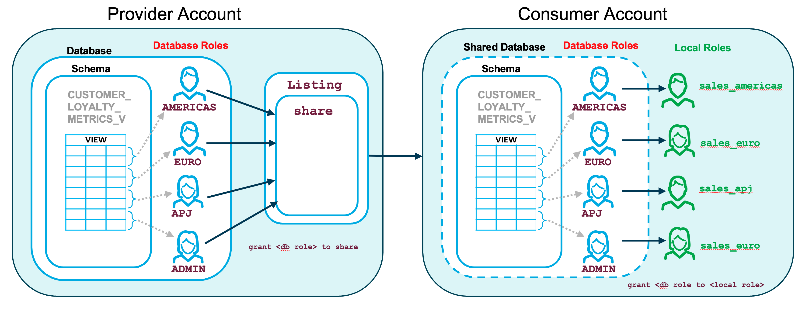

Now switch to the different local roles (sales_emea_role, sales_apj_role, etc) in each of your consumer accounts to verify that each local role can only see those rows in the CUSTOMER_LOYALTY_METRICS_V view that are permitted by the row-level access policy in the provider account.

### Aggregation and Projection Policies

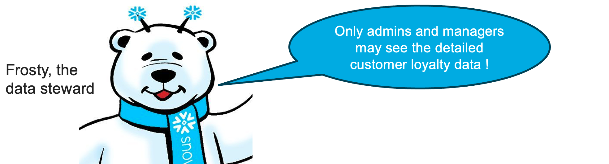

Frosty the data steward has a new requirement for us. In the consumer accounts, only admins and managers may see the detailed per-customer loyalty data. Anyone else may see aggregated data only.

Create the following [aggregation policy](https://docs.snowflake.com/en/user-guide/aggregation-policies) to implement this requirement:

<mark>Fill in AWS Provider Account Name below</mark>

```sql
CREATE OR REPLACE AGGREGATION POLICY tasty_aggregation_policy
  AS () RETURNS AGGREGATION_CONSTRAINT ->
  CASE
      WHEN current_account_name() IN ('*** FILL IN AWS Provider Account Name ***') 
       AND current_role() = 'ACCOUNTADMIN'
      THEN NO_AGGREGATION_CONSTRAINT()

      WHEN IS_DATABASE_ROLE_IN_SESSION('TASTYBYTES_MANAGER_ROLE')
      THEN NO_AGGREGATION_CONSTRAINT()

      ELSE AGGREGATION_CONSTRAINT(MIN_GROUP_SIZE => 50) -- at least 50 rows in aggregate
    END;

ALTER VIEW analytics.CUSTOMER_LOYALTY_METRICS_V
  SET AGGREGATION POLICY tasty_aggregation_policy;
```

Now switch to your consumer account **horizon_lab_aws_consumer** to verify the effect of the aggregation policy:

```sql
use role sales_apj_role;
-- sales_apj_role gets blocked from accessing any individual records:
SELECT * FROM analytics.CUSTOMER_LOYALTY_METRICS_V;

-- sales_apj_role can execute aggregation queries:
SELECT city, count(*) as num_cust_per_city
FROM analytics.CUSTOMER_LOYALTY_METRICS_V
GROUP BY city;

-- sales_manager_role is permitted to access  individual records:
use role sales_manager_role;
SELECT * FROM analytics.CUSTOMER_LOYALTY_METRICS_V LIMIT 100;
```

Switch back to your AWS Provider account and issue the following command to deactivate the aggregation policy.

```sql
ALTER TABLE analytics.CUSTOMER_LOYALTY_METRICS_V UNSET AGGREGATION POLICY;
```

Next, let's also create a [projection policy](https://docs.snowflake.com/en/user-guide/projection-policies) that prevents the **city** column from appearing in a result set but allows its usage in predicates to the restrict a query result:

<mark>Fill in AWS Provider Account Name below</mark>

```sql
CREATE OR REPLACE PROJECTION POLICY tasty_projection_policy
  AS () RETURNS PROJECTION_CONSTRAINT ->
  CASE
      WHEN current_account_name() IN ('*** FILL IN AWS Provider Account Name ***') 
       AND current_role() = 'ACCOUNTADMIN'
      THEN PROJECTION_CONSTRAINT(ALLOW => true)

      WHEN IS_DATABASE_ROLE_IN_SESSION('TASTYBYTES_MANAGER_ROLE')
      THEN PROJECTION_CONSTRAINT(ALLOW => true)

      ELSE PROJECTION_CONSTRAINT(ALLOW => false)
    END;

ALTER VIEW analytics.CUSTOMER_LOYALTY_METRICS_V
  MODIFY COLUMN city 
  SET PROJECTION POLICY tasty_projection_policy;
```

 Switch to your consumer account **horizon_lab_aws_consumer** again to explore the effect of the projection policy on the results or the following queries:

 ```sql
use role sales_apj_role;

SELECT *              FROM analytics.CUSTOMER_LOYALTY_METRICS_V;

SELECT * EXCLUDE city FROM analytics.CUSTOMER_LOYALTY_METRICS_V;

SELECT * EXCLUDE city 
FROM analytics.CUSTOMER_LOYALTY_METRICS_V
WHERE city IN ('Delhi','Tokyo','Seoul','Melbourne','Sydney','Mumbai');

SELECT city, count(*) as num_cust_per_city
FROM analytics.CUSTOMER_LOYALTY_METRICS_V
GROUP BY city;
```

Note that a projection policy by itself does not prevent users from detecting information about individuals. For example, the following query is permitted (and returns customer details if you remove the masking policy **pii_string_mask**):

 ```sql
SELECT * EXCLUDE city
FROM analytics.CUSTOMER_LOYALTY_METRICS_V
WHERE city = 'Melbourne' AND last_name = 'Arellano';
```

## Publish and Monitor Data Quality Metrics for Listings

Duration: 15

In this section the data provider will capture [data quality metrics](https://docs.snowflake.com/en/user-guide/data-quality-intro) and share them with the data consumers. In particular, we want to monitor the data quality in the view ANALYTICS.ORDERS_BY_POSTAL_CODE_V.

### Assign Built-in and Custom Data Quality Metrics to Shared Data

On AWS Provider account, execute the following commands to create a database where we will define any custom quality functions.

```sql
use role accountadmin;
create or replace database tasty_bytes_quality;
use database tasty_bytes_quality;
create schema dq_functions;
```

Next, let's define how often the quality of ORDERS_BY_POSTAL_CODE_V should be checked. For a table, the quality checks can be triggered by data changes or executed on a schedule. For views, the quality metrics can (currently) be evaluated on a schedule.

Let's set the schedule to the shortest possible interval, which is 5 minutes:

```sql
ALTER VIEW FROSTBYTE_TASTY_BYTES.ANALYTICS.ORDERS_BY_POSTAL_CODE_V
  SET DATA_METRIC_SCHEDULE = '5 MINUTE';
```

Now, let's use two of [Snowflake's built-in data quality functions](https://docs.snowflake.com/en/user-guide/data-quality-system-dmfs) to count the number of NULL valuse in the column POSTAL_CODE as well as the number of distinct cities reported in this view:

```sql
ALTER VIEW FROSTBYTE_TASTY_BYTES.ANALYTICS.ORDERS_BY_POSTAL_CODE_V
  ADD DATA METRIC FUNCTION SNOWFLAKE.CORE.NULL_COUNT ON (POSTAL_CODE);

ALTER VIEW FROSTBYTE_TASTY_BYTES.ANALYTICS.ORDERS_BY_POSTAL_CODE_V
  ADD DATA METRIC FUNCTION SNOWFLAKE.CORE.UNIQUE_COUNT ON (CITY);
```

Additionally, let's create a [custom data quality function](https://docs.snowflake.com/user-guide/data-quality-working#create-your-own-dmf) that counts the number of outliers, i.e. postal areas with an exceptionally high or low number of orders:

```sql
CREATE OR REPLACE DATA METRIC FUNCTION tasty_bytes_quality.dq_functions.postal_code_order_outliers (t TABLE  (count_order INTEGER) )
RETURNS INTEGER
AS
$$
  select count(*) 
  from t
  where count_order > 300000
     or count_order < 30
$$;
```

The owner of the object that is being monitored needs to have the privilege to execute the custom data metric function and use the database and schema where that function resides. Additional privileges are required to execute the built-in metric functions or view their results. To keep it simple, let's grant the following privileges to all users:

```sql
GRANT ALL ON FUNCTION tasty_bytes_quality.dq_functions.postal_code_order_outliers(TABLE(INTEGER)) to role public;
GRANT USAGE ON DATABASE tasty_bytes_quality              to role public;
GRANT USAGE ON SCHEMA   tasty_bytes_quality.dq_functions to role public;

GRANT EXECUTE DATA METRIC FUNCTION ON ACCOUNT            to role public;
GRANT DATABASE ROLE SNOWFLAKE.DATA_METRIC_USER           to role public;
GRANT DATABASE ROLE SNOWFLAKE.USAGE_VIEWER               to role public;
```

Now we can apply our customer quality function to the view ORDERS_BY_POSTAL_CODE_V:

```sql
ALTER VIEW FROSTBYTE_TASTY_BYTES.ANALYTICS.ORDERS_BY_POSTAL_CODE_V
  ADD DATA METRIC FUNCTION tasty_bytes_quality.dq_functions.postal_code_order_outliers 
  ON (count_order);
```

Use the following command to verify that all three quality metrics have been scheduled correctly. Any permission problems would be reflected in the column "schedule_status". Possible status values are [documented here](https://docs.snowflake.com/sql-reference/functions/data_metric_function_references#returns).

```sql
  SELECT schedule_status, *
  FROM TABLE(
    INFORMATION_SCHEMA.DATA_METRIC_FUNCTION_REFERENCES(
      REF_ENTITY_NAME => 'FROSTBYTE_TASTY_BYTES.ANALYTICS.ORDERS_BY_POSTAL_CODE_V',
      REF_ENTITY_DOMAIN => 'VIEW'  )
  );
```  

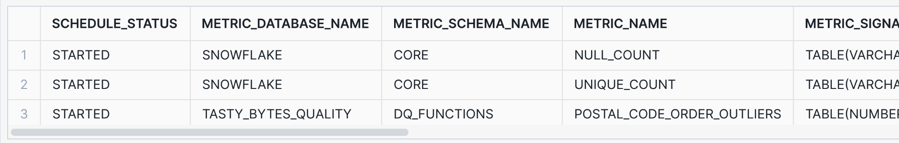

After 5 minutes you can start observing quality metrics in the [default event table](https://docs.snowflake.com/en/user-guide/data-quality-working#view-the-dmf-results) where all quality results are recorded:

<mark>Unfortuately, accessing **snowflake.local.data_quality_monitoring_results** is not yet available in Snowflake trial accounts. Skip ahead to the next section _Sharing Data quality Metrics_ if you are using a trial account.</mark>

```sql
SELECT scheduled_time, measurement_time, metric_name, metric_schema,
       value, table_name, table_schema, table_database 
FROM snowflake.local.data_quality_monitoring_results  /* not yet available in trial accounts! */
ORDER BY measurement_time DESC;
```

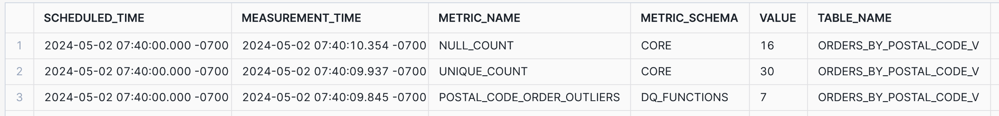

Additionally, you could define [Alerts](https://docs.snowflake.com/en/user-guide/alerts) to watch the data quality metrics and take action automatically if acceptable thresholds are exceeded. For example, if the number of outliers reported by our custom quality function exceeds a certain value an alert could copy the offending rows into an exception table for review and send an [email notification](https://docs.snowflake.com/en/user-guide/email-stored-procedures).

### Sharing Data Quality Metrics

How to share quality metrics from the event table with data consumers? At the time of authoring this lab (May 2024) event tables cannot be shared in a Listing directly. Similarly, views, streams, and dynamic tables are not yet an option for sharing data quality events.

And since Snowflake trial accounts cannot access the event table (yet!), let's setup a task that regularly inserts data quality metrics into a table for sharing:

```sql
USE DATABASE FROSTBYTE_TASTY_BYTES;
CREATE SCHEMA FROSTBYTE_TASTY_BYTES.dq;

-- this table will hold and share 7 days worth of quality metrics:
CREATE OR REPLACE TABLE FROSTBYTE_TASTY_BYTES.dq.shared_quality_events 
  (measurement_time TIMESTAMP, 
   table_name       VARCHAR, 
   table_schema     VARCHAR, 
   table_database   VARCHAR, 
   metric_name      VARCHAR, 
   metric_schema    VARCHAR,
   value            INTEGER  );  
 

-- this task will maintain the table above:
CREATE OR REPLACE TASK FROSTBYTE_TASTY_BYTES.dq.subset_quality_events
   SCHEDULE = '3 MINUTE'
   AS BEGIN
        DELETE FROM dq.shared_quality_events
        WHERE measurement_time < current_date - 7;   

        INSERT INTO dq.shared_quality_events
           SELECT current_timestamp, 'ORDERS_BY_POSTAL_CODE_V',
                  'ANALYTICS', 'FROSTBYTE_TASTY_BYTES',
                  'NULL_COUNT', 'SNOWFLAKE.CORE',
                   SNOWFLAKE.CORE.NULL_COUNT(
                       SELECT POSTAL_CODE
                       FROM ANALYTICS.ORDERS_BY_POSTAL_CODE_V);
                       
        INSERT INTO FROSTBYTE_TASTY_BYTES.dq.shared_quality_events
           SELECT current_timestamp, 'ORDERS_BY_POSTAL_CODE_V',
                  'ANALYTICS', 'FROSTBYTE_TASTY_BYTES',
                  'UNIQUE_COUNT', 'SNOWFLAKE.CORE',
                   SNOWFLAKE.CORE.UNIQUE_COUNT(
                       SELECT city
                       FROM ANALYTICS.ORDERS_BY_POSTAL_CODE_V);               
                       
        INSERT INTO FROSTBYTE_TASTY_BYTES.dq.shared_quality_events
           SELECT current_timestamp, 'ORDERS_BY_POSTAL_CODE_V',
                  'ANALYTICS', 'FROSTBYTE_TASTY_BYTES',
                  'postal_code_order_outliers', 'dq_functions',
                   tasty_bytes_quality.dq_functions.postal_code_order_outliers(
                       SELECT count_order
                       FROM ANALYTICS.ORDERS_BY_POSTAL_CODE_V);                     
   END;

ALTER TASK subset_quality_events RESUME;
```

Now you can add the table "shared_quality_events" to the shared data product. Here are 2 options how you can so this.

**Option 1: Programmatically**

Grant the share the necessary access to the "shared_quality_events" table. You should already have the share name from the early section on Database Roles. Else, get the share name as in the first step of option 2 below.

```sql
GRANT USAGE ON SCHEMA FROSTBYTE_TASTY_BYTES.dq TO SHARE <share_name>;
 
GRANT SELECT ON FROSTBYTE_TASTY_BYTES.dq.shared_quality_events TO SHARE <share_name>;
```

**Option 2: In the UI**

Take the following 3 steps in the UI:

1. In the provider account, navigate to the Provider Studio, select "Listings" from the horizontal menu at the top, and open your listing. In the section "Data Product" click on the name of the Secure Share that bundles the shared data objects.


2. You are now looking at a page detailing the underlying share. In the section "Data", click the "Edit" button:
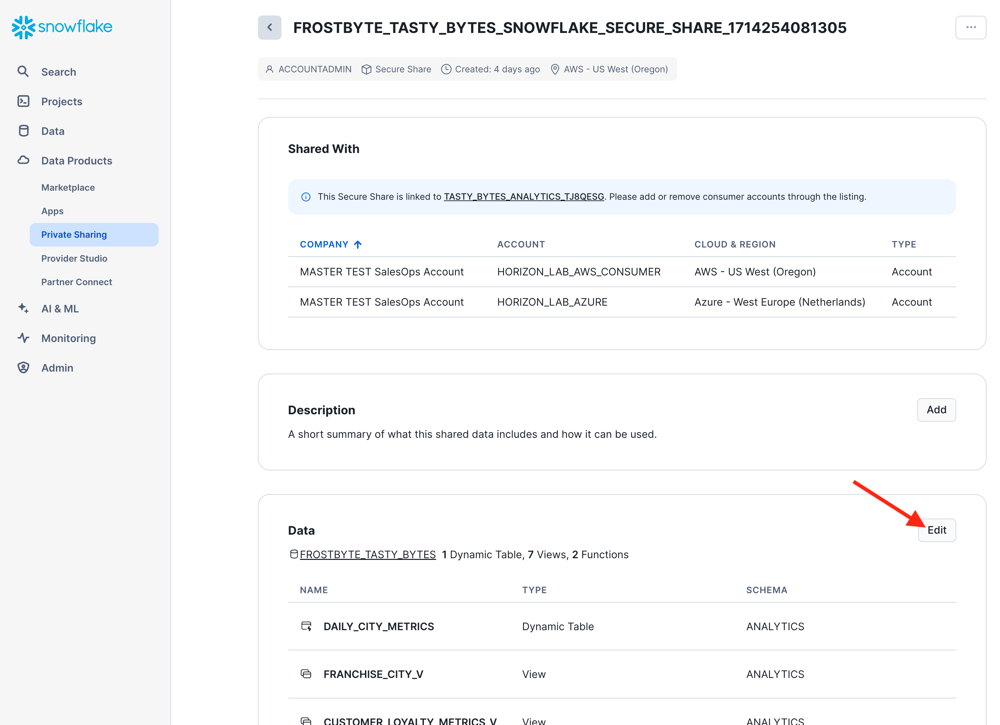

3. Now you can open the data explorer to find and select the table "dq.shared_quality_events". Click "Done" and "Save" to finalize the update of your data product.
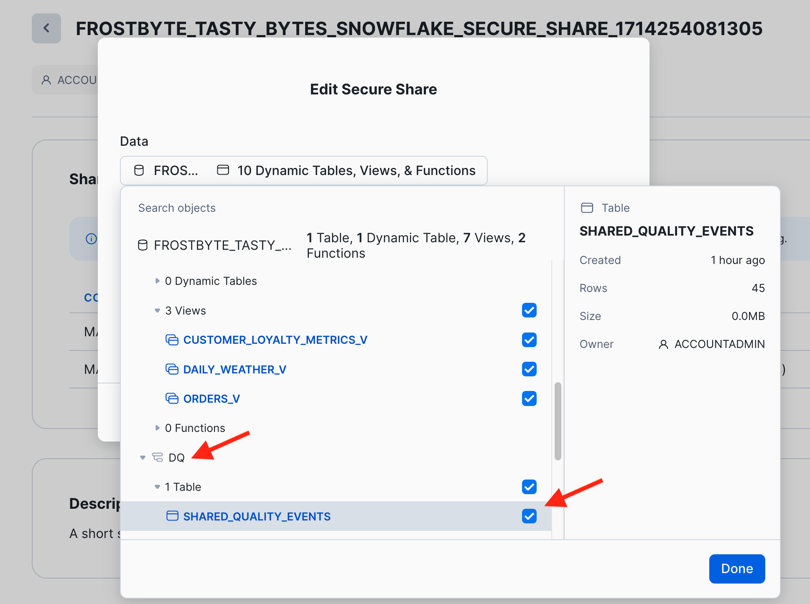

4. Switch to your consumer account "horizon_lab_aws_consumer" to verify that the data quality metrics are immediately visible as a new table in the data product. In the second consumer account "horizon_lab_azure_consumer" you will see the same after the 1 minute replication interval.

5. Go back to your provider account and suspend the task, to save credits in your trial account.

```sql
  ALTER TASK subset_quality_events SUSPEND;
  
  ALTER VIEW FROSTBYTE_TASTY_BYTES.ANALYTICS.ORDERS_BY_POSTAL_CODE_V
  UNSET DATA_METRIC_SCHEDULE;
```

<!-- ------------------------ -->


<!-- ------------------------ -->
## Conclusion & Resources

Duration: 5

Congratulations, you made it through the internal marketplace journey! You have exercised a range of data sharing and governance capabilities. You have worked with different types of data products including structured data, unstructured data, and native applications. And you have deployed different types of governance policies to implement data access and data privacy restrictions.

### What you Learned

- How to blend local Point-of-Sale data with Marketplace Weather data to build analytics data products.

- How to publish data products as Listings targeted at accounts in your company
- How to configure data access and privacy polices as a data provider to restrict data access by data consumers.
- How to use tag-based column masking, row-access, aggregation and projection policies with database roles in a collaboration scenario.
- How to manage Listings via the Listings API.
- How to setup data quality monitoring of shared data products


### Related Resources

- [Lab Source Code on Github](https://github.com/Snowflake-Labs/sfguide-horizon-intra-organization-sharing)

- [Snowflake Listings](https://other-docs.snowflake.com/en/collaboration/collaboration-listings-about) and [Managing Listings via API](https://docs.snowflake.com/en/sql-reference/commands-listings)

- [Cross-cloud Auto-Fulfillment](https://other-docs.snowflake.com/en/collaboration/provider-listings-auto-fulfillment)

- [Data Governance Policies](https://docs.snowflake.com/en/guides-overview-govern) and  [Data Privacy Policies](https://docs.snowflake.com/en/guides-overview-privacy)

- [Data Quality Metrics](https://docs.snowflake.com/en/user-guide/data-quality-intro)

- [Sharing  Data Protected by a Policy](https://docs.snowflake.com/en/user-guide/data-sharing-policy-protected-data)
- [Iceberg Tables in Snowflake](https://docs.snowflake.com/en/user-guide/tables-iceberg)
- [Best Practices publishing a Snowflake Native App](https://docs.snowflake.com/en/developer-guide/native-apps/publish-guidelines#best-practices-when-publishing-a-native-app)
- [Sharing Unstructured Data](https://docs.snowflake.com/en/user-guide/unstructured-data-sharing)
