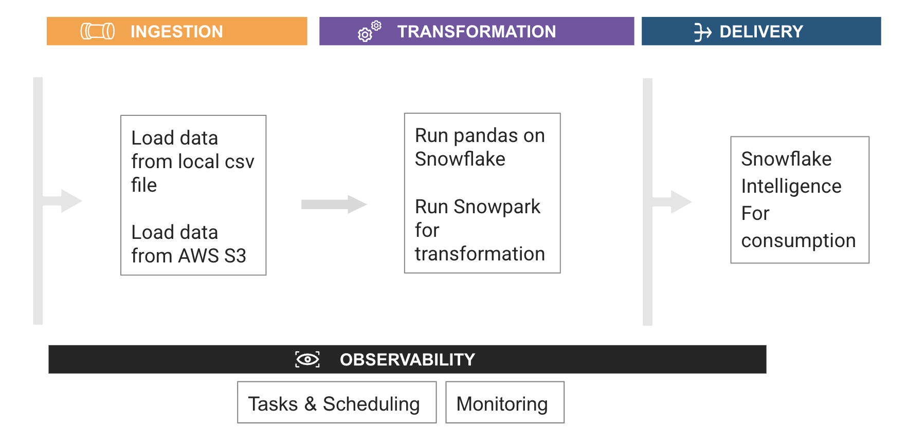
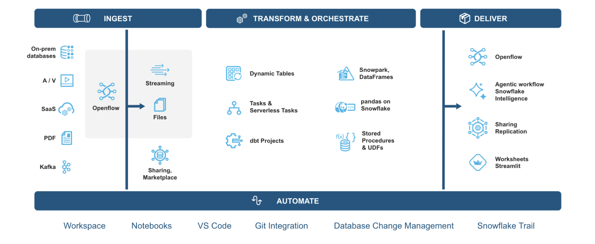
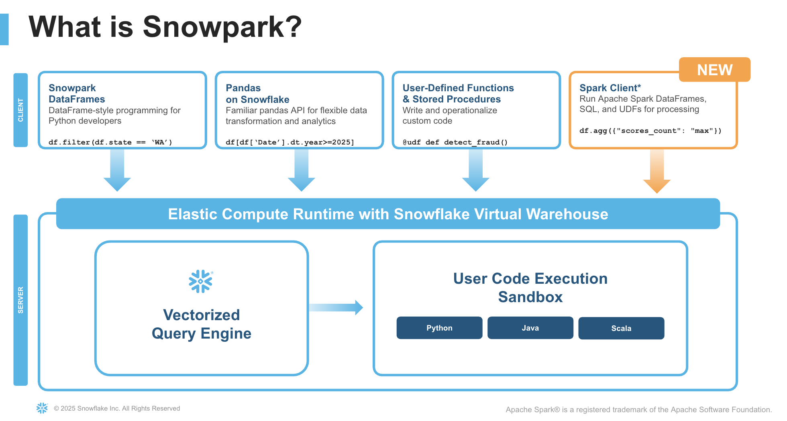
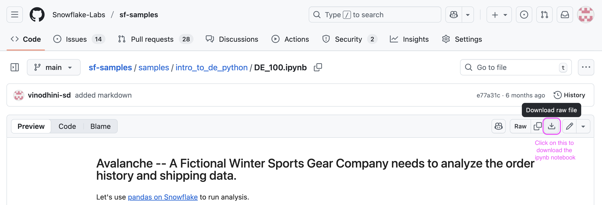
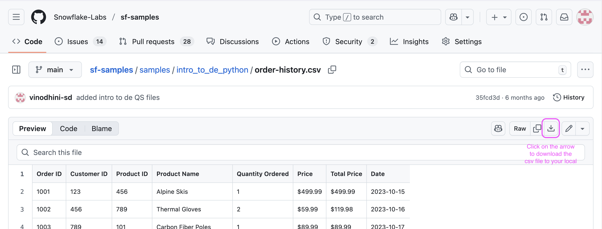
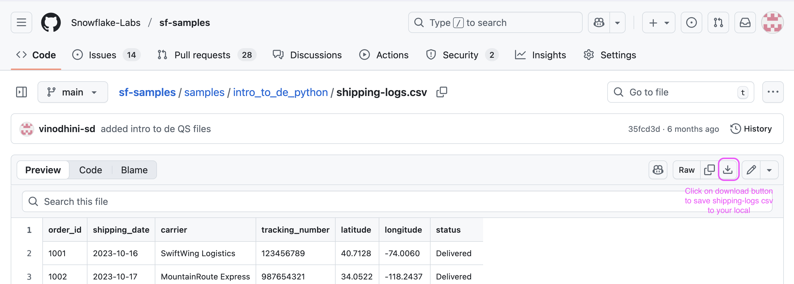
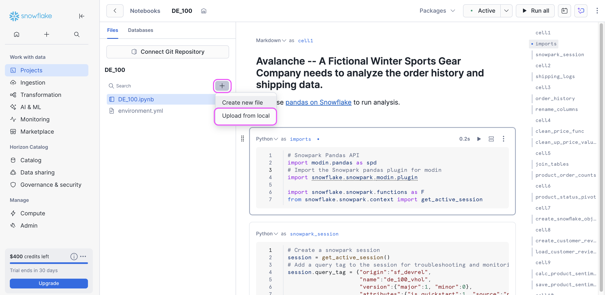

author: Vino Duraisamy
id: intro-to-data-engineering-python
categories: snowflake-site:taxonomy/solution-center/certification/quickstart, snowflake-site:taxonomy/product/ai, snowflake-site:taxonomy/product/data-engineering
language: en
summary: Through this quickstart guide, you will explore Data engineering in Snowflake using Python 
environments: web
status: Published 
feedback link: https://github.com/Snowflake-Labs/sfguides/issues

# Intro to Data Engineering using Python in Snowflake
<!-- ------------------------ -->

## Overview

Through this quickstart, you will learn how to build your first data engineering pipeline using [Snowflake notebooks](https://docs.snowflake.com/user-guide/ui-snowsight/notebooks).

### What you’ll learn

* How to install and configure the Snowpark pandas library  
* How to use Snowpark pandas to transform and analyze datasets using the power of Snowflake  
* How to use Snowpark Python to transform and aggregate data

### Data Engineering in Snowflake Overview

### What is Snowpark?

Snowpark is the set of libraries and code execution environments that run Python and other programming languages next to your data in Snowflake. Snowpark can be used to build data pipelines, ML models, apps, and other data processing tasks.

### What is pandas on Snowflake?

pandas on Snowflake lets you run your pandas code in a distributed manner scalably and securely directly on your data in Snowflake. Just by changing the import statement and a few lines of code, you can get the same pandas-native experience you know and love with the scalability and security benefits of Snowflake. 

### Why use pandas on Snowflake?

pandas is the go-to data processing library for millions worldwide, including countless Snowflake users. However, pandas was never built to handle data at the scale organizations are operating today. Running pandas code requires transferring and loading all of the data into a single in-memory process. It becomes unwieldy on moderate-to-large data sets and breaks down completely on data sets that grow beyond what a single node can handle. With pandas on Snowflake, you can run the same pandas code, but with all the pandas processing pushed down to run in a distributed fashion in Snowflake. Your data never leaves Snowflake, and your pandas workflows can process much more efficiently using the Snowflake elastic engine. This brings the power of Snowflake to pandas developers everywhere.

### What You'll Build

* Build a Python data pipeline with Snowflake Notebooks

* Aggregate and transform data to create new features with pandas on Snowflake

* Transform and analyze data using Snowpark Python

* Create a Serverless Task to schedule the transformation

### Pre-requisites

* A Snowflake account. If you do not have a Snowflake account, you can register for a [free trial account](https://signup.snowflake.com/?utm_source=snowflake-devrel&utm_medium=developer-guides&utm_cta=developer-guides).

<!-- ------------------------ -->
## Setup

This section covers the Snowflake objects creation and other setup needed to run this quickstart successfully.

* Login to your Snowflake free trial account.
* On the left pane, under `Horizon Catalog` section, avigate to `Catalog`. Click on `Database Explorer` tab. Click on `+Database` button on top right and create a database and call it `AVALANCHE_DB`.
* Click on `avalanche_db` database. On the top right, click on `+Schema` button to create a new schema under `avalanche_db`. Call it `AVALANCHE_SCHEMA`.  
* On the left pane, under `Manage` section, select `Compute` and click on `warehouses`. Create a new warehouse. Name it `DE_XS`. Select type as `Standard(Gen1)` and size as `X-Small`.  
* On a new browser tab, navigate to this [git repo](https://github.com/Snowflake-Labs/sf-samples/blob/main/samples/intro_to_de_python/DE_100.ipynb) and click on download button to download the `DE_100.ipynb` file.

* Navigate to the Snowflake UI. Under `work with data` section on the left pane, select `Projects` -> `Notebooks`. On the top right, click on the **down arrow** next to `+Notebook` button and select `Import ipynb file` to load a notebook.
* Call it `AVALANCHE_ANALYTICS_NB`. Select `AVALANCHE_DB` database for notebook location and `AVALANCHE_SCHEMA` for schema, Query warehouse as `DE_XS` and create notebook.  
* After the notebook is created, at the top right, click on `packages`. Search and install modin. Once installed, click on `Start` to start the notebook session to run analysis.

* On a new browser tab, navigate to this [git repo](https://github.com/Snowflake-Labs/sf-samples/blob/main/samples/intro_to_de_python/order-history.csv) and click on download button to download the `order-history.csv` file.

* On a new browser tab, navigate to this [git repo](https://github.com/Snowflake-Labs/sf-samples/blob/main/samples/intro_to_de_python/shipping-logs.csv) and click on download button to download the `shipping-logs.csv` file.

* Switch back to the Snowflake UI, On the left panel right below the name of the notebook, there is a `+` sign. Click on `+` to load the `order-history.csv` and `shipping-logs.csv` files to your notebook workspace.

With this, we are ready to run our first data engineering pipeline in Snowflake using Python.

<!-- ------------------------ -->
## Data Engineering using Python

During this step you will learn how to use pandas on Snowflake to:

* Create a pandas dataframe from a local csv data file  
* Clean up and transform data to create new features  
* Join dataframes

You will also learn how to use Snowpark Python to:

* Create a Snowflake table from a csv file stored in AWS S3 bucket  
* Load the Snowflake table as a Snowpark dataframe  
* Aggregate data to derive insights  
* Save the result into a Snowflake table

In addition to the ingestion and transformation steps above, you will learn how to:

* Create a serverless task to schedule the pipeline

Follow along and run each of the cells in the [Notebook](https://github.com/Snowflake-Labs/sf-samples/blob/main/samples/intro_to_de_python/DE_100.ipynb).

<!-- ------------------------ -->
## Conclusion & Resources

Congratulations, you have successfully completed this quickstart!

### What you learned

* How to install and configure the Snowpark pandas library  
* How to use Snowpark pandas to transform and analyze datasets using the power of Snowflake  
* How to use Snowpark Python to transform and aggregate data

### Related Resources

* [Pandas on Snowflake](https://docs.snowflake.com/developer-guide/snowpark/python/pandas-on-snowflake)  
* [Snowpark Python Dataframe API](https://docs.snowflake.com/en/developer-guide/snowpark/python/index)  
* [Source code on GitHub](https://github.com/Snowflake-Labs/sf-samples/tree/main/samples/intro\_to\_de\_python)  
