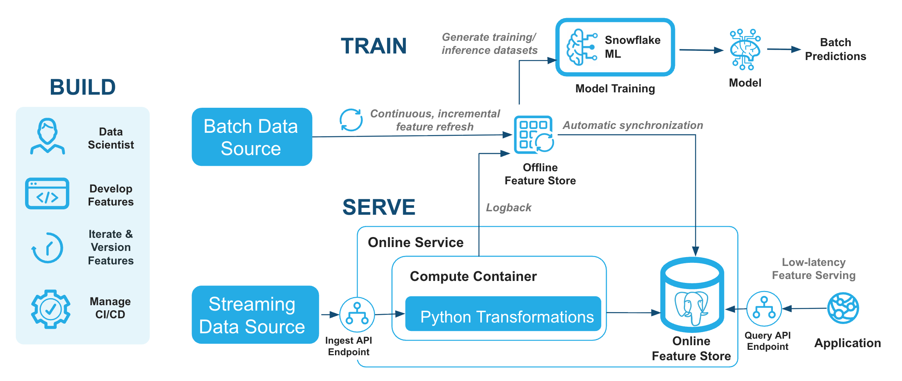

author: Sho Tanaka, Doris Lee
language: en
id: intro-to-online-feature-store-postgres-in-snowflake
summary: Build real-time fraud detection using Snowflake Online Feature Store with Postgres for low-letency feature serving
categories: snowflake-site:taxonomy/product/ai, snowflake-site:taxonomy/product/data-engineering, snowflake-site:taxonomy/snowflake-feature/model-development, snowflake-site:taxonomy/snowflake-feature/applied-analytics, snowflake-site:taxonomy/snowflake-feature/snowflake-ml-functions, snowflake-site:taxonomy/snowflake-feature/snowpark, snowflake-site:taxonomy/snowflake-feature/snowpark-container-services, snowflake-site:taxonomy/solution-center/certification/quickstart, snowflake-site:taxonomy/solution-center/certification/certified-solution
environments: web
status: Published
feedback link: https://github.com/Snowflake-Labs/sfguides/issues
fork repo link: https://github.com/Snowflake-Labs/sfguide-intro-to-online-feature-store-in-snowflake


# Introduction to Online Feature Store in Snowflake

<!-- ------------------------ -->
## 1. Overview

The Snowflake Online Feature Store with Postgres (Public Preview) provides low-letency feature retrieval for real-time ML inference. This guide demonstrates how to build a real-time fraud detection system using the Online Feature Store — covering online feature retrieval, time-windowed aggregations, streaming ingestion, and REST API usage.

You'll learn how to register batch, aggregation, and stream Feature Views backed by a managed Postgres serving layer, and how to query and ingest data through the REST API endpoints.



### Prerequisites
- A Snowflake account (non-trial) in AWS or Azure commercial regions
- Basic knowledge of Python and SQL
- Familiarity with machine learning concepts
- ACCOUNTADMIN access or equivalent permissions
- `snowflake-ml-python` version 1.41 or later
- A Programmatic Access Token (PAT) for authenticating to the Online Feature Store REST endpoints

### What You'll Learn
- How to set up the Snowflake Feature Store with a Postgres-backed online service
- How to register batch, aggregation, and stream Feature Views
- How to query online features with low latency
- How to define Stream and Real-time Feature Views
- How to ingest streaming events and query features through the REST API
- How to integrate with the Snowflake Model Registry

### What You'll Need
- A [Snowflake](https://signup.snowflake.com/?utm_source=snowflake-devrel&utm_medium=developer-guides&utm_cta=developer-guides) account
- Basic understanding of Snowpark and Snowflake ML
- A Programmatic Access Token (PAT)

### What You'll Build
- A Feature Store with 3 online Feature Views (batch profile, tiled aggregation, stream velocity)
- Real-time fraud scoring with low lentency feature retrieval
- Stream ingestion pipeline with 2-3 second end-to-end freshness
- REST API integration for feature query and stream ingest

<!-- ------------------------ -->
## 2. Setup and Data Preparation

This section covers environment setup, creating the online service, and loading synthetic fraud data.

### Download and Import the Notebook

1. Click this link: [online_feature_store_fraud_detection.ipynb](assets/online_feature_store_fraud_detection.ipynb)
2. On the GitHub page, click the **Download raw file** button (download icon in the top right of the file preview)
3. Save the `.ipynb` file to your computer

Now import the notebook into Snowflake:

1. Navigate to **Projects** > **Workspaces** in Snowsight
2. Click **+ Add New** and choose **Upload files** button
3. Select the downloaded `online_feature_store_fraud_detection.ipynb` file from your computer


### Run the Setup Cell

The notebook includes a **Section 0: Setup** cell that creates all required resources:
- A dedicated role: `FS_DEMO_ROLE`
- A warehouse: `FS_DEMO_WH`
- A database: `FRAUD_OFS_DEMO_DB` with schemas `SOURCE_DATA`, `FEATURE_STORE`, `ML_PIPELINE`
- Network rule and external access integration for the notebook

Run this cell as `ACCOUNTADMIN`. You only need to run it once.


### Set Up Authentication (PAT)

The Postgres online service communicates via REST endpoints. Set your PAT as an environment variable in the notebook before reading online features:

```python
import os
os.environ["SNOWFLAKE_PAT"] = "<your_pat_token>"
```

To create a PAT in Snowsight: navigate to your profile menu > **My profile** > **Settings** > **Authentication** > **Programmatic access tokens** > **Generate new token**.

<!-- ------------------------ -->
## 3. Create Online Service and Entity

### Initialize Feature Store

Initialize the Feature Store client, pointing it at the `FEATURE_STORE` schema. This creates the internal metadata tables if they don't already exist.

```python
from snowflake.ml.feature_store import FeatureStore, CreationMode

fs = FeatureStore(
    session=session,
    database="FRAUD_OFS_DEMO_DB",
    name="FEATURE_STORE",
    default_warehouse="FS_DEMO_WH",
    creation_mode=CreationMode.CREATE_IF_NOT_EXIST,
)
```

### Create Online Service

The online service is a managed Postgres serving layer. Create it once per Feature Store before registering feature views with online serving.

```python
import time
from snowflake.ml.feature_store import online_service

create_result = fs.create_online_service(
    producer_role="FS_DEMO_ROLE",
    consumer_role="FS_DEMO_ROLE",
)
print(f"Create result: {create_result}")

# Wait for RUNNING status (takes several minutes on first creation)
for i in range(30):
    status = fs.get_online_service_status()
    if status.status == "RUNNING":
        break
    print(f"  [{i}] Status: {status.status}")
    time.sleep(30)

query_url = online_service.endpoint_url(status, "query")
ingest_url = online_service.endpoint_url(status, "ingest")
print(f"Query URL: {query_url}")
print(f"Ingest URL: {ingest_url}")
```

### Register Entity

An Entity defines the primary key used to join Feature Views together. Here we register a `CUSTOMER` entity with `CUSTOMER_ID` as the join key — all Feature Views in this guide will be keyed by customer.

```python
from snowflake.ml.feature_store import Entity

customer_entity = Entity(
    name="CUSTOMER",
    join_keys=["CUSTOMER_ID"],
    desc="A customer identified by their unique customer ID",
)
fs.register_entity(customer_entity)
fs.list_entities().show()
```

<!-- ------------------------ -->
## 4. Register Feature Views

This section demonstrates three types of Feature Views — the core building blocks of the Online Feature Store.

### Batch Feature View: Customer Profile

A batch feature view passes pre-computed features from an offline table to the online store. The online store serves the latest row per entity key.

```python
from snowflake.ml.feature_store import FeatureView, OnlineConfig, OnlineStoreType

profile_df = session.table("FRAUD_OFS_DEMO_DB.SOURCE_DATA.CUSTOMER_PROFILES")

profile_fv = FeatureView(
    name="CUSTOMER_PROFILE_FEATURES",
    entities=[customer_entity],
    feature_df=profile_df,
    timestamp_col="UPDATED_AT",
    refresh_freq="1m",
    online_config=OnlineConfig(
        enable=True,
        target_lag="10s",
        store_type=OnlineStoreType.POSTGRES,
    ),
    desc="Customer profile features: account age, total transactions, avg amount",
)

registered_profile_fv = fs.register_feature_view(profile_fv, "V1", overwrite=True)
print(f"Registered: {registered_profile_fv.name}/{registered_profile_fv.version}")
```

### Time-Windowed Aggregation Feature View

Use the `Feature` class to define rolling-window aggregate features. The online service pre-computes partial aggregates (tiles) and merges them at query time.

```python
from snowflake.ml.feature_store import Feature

txn_features = [
    Feature.sum("TRANSACTION_AMOUNT", "1h").alias("SUM_AMT_1H"),
    Feature.sum("TRANSACTION_AMOUNT", "24h").alias("SUM_AMT_24H"),
    Feature.count("TRANSACTION_AMOUNT", "24h").alias("TXN_COUNT_24H"),
    Feature.avg("TRANSACTION_AMOUNT", "7d").alias("AVG_AMT_7D"),
]

txn_df = session.table("FRAUD_OFS_DEMO_DB.SOURCE_DATA.TRANSACTIONS")

txn_agg_fv = FeatureView(
    name="CUSTOMER_TXN_AGG",
    entities=[customer_entity],
    feature_df=txn_df,
    features=txn_features,
    timestamp_col="TRANSACTION_TS",
    refresh_freq="1m",
    feature_granularity="1 minute",
    online_config=OnlineConfig(
        enable=True,
        store_type=OnlineStoreType.POSTGRES,
    ),
    desc="Rolling transaction aggregations: sum, count, avg over 1h/24h/7d windows",
)

registered_txn_fv = fs.register_feature_view(txn_agg_fv, "V1", overwrite=True)
print(f"Registered: {registered_txn_fv.name}/{registered_txn_fv.version}")
```

### Stream Feature View: Transaction Velocity

Stream Feature Views ingest events in real time and serve updated features with 2-3 second end-to-end freshness.

#### Register a Stream Source

```python
from snowflake.ml.feature_store import StreamSource, StreamConfig
from snowflake.snowpark.types import (
    StructType, StructField, StringType, FloatType,
    TimestampType, TimestampTimeZone,
)

txn_stream = StreamSource(
    name="TXN_EVENTS",
    schema=StructType([
        StructField("CUSTOMER_ID", StringType()),
        StructField("TRANSACTION_TS", TimestampType(TimestampTimeZone.NTZ)),
        StructField("TRANSACTION_AMOUNT", FloatType()),
        StructField("MERCHANT_CATEGORY", StringType()),
    ]),
    desc="Real-time transaction events for velocity features",
)
fs.register_stream_source(txn_stream)
```

#### Define Transformation and Register

Define a Python transformation function that runs on each ingested event. The `backfill_df` provides historical data so the online store is pre-populated before any new events arrive.

```python
import pandas as pd

def compute_velocity(df: pd.DataFrame) -> pd.DataFrame:
    """Flag high-velocity transactions."""
    df["IS_HIGH_AMOUNT"] = (df["TRANSACTION_AMOUNT"] > 500).astype(int)
    return df

backfill_df = session.table("FRAUD_OFS_DEMO_DB.SOURCE_DATA.TRANSACTIONS")

stream_fv = FeatureView(
    name="TXN_STREAM_VELOCITY",
    entities=[customer_entity],
    timestamp_col="TRANSACTION_TS",
    stream_config=StreamConfig(
        stream_source=txn_stream,
        transformation_fn=compute_velocity,
        backfill_df=backfill_df,
    ),
    online_config=OnlineConfig(
        enable=True,
        target_lag="10s",
        store_type=OnlineStoreType.POSTGRES,
    ),
    desc="Stream-ingested transaction velocity: per-event features with 2-3s freshness",
)

registered_stream_fv = fs.register_feature_view(stream_fv, "V1", overwrite=True)
print(f"Registered: {registered_stream_fv.name}/{registered_stream_fv.version}")
```

<!-- ------------------------ -->
## 5. Online Feature Retrieval

### Read Features from the Online Store

Retrieve feature values by entity key with low latency:

```python
fv = fs.get_feature_view("CUSTOMER_PROFILE_FEATURES", "V1")

online_df = fs.read_feature_view(
    fv,
    keys=[["CUST_000001"], ["CUST_000042"]],
    store_type="online",
)
online_df.show()
```

### Read Multiple Feature Views

```python
txn_fv = fs.get_feature_view("CUSTOMER_TXN_AGG", "V1")

txn_online = fs.read_feature_view(
    txn_fv,
    keys=[["CUST_000001"]],
    store_type="online",
)
txn_online.show()
```

### Latency Expectations

The Postgres online store achieves:
- **p50**: ~5-10ms (in-region)
- **p95**: sub-15ms
- **p99**: sub-20ms

For benchmarking in your own environment, see the [Online Feature Store Benchmark Kit](https://github.com/Snowflake-Labs/snowflake-feature-store-online-benchmark-kit).

<!-- ------------------------ -->
## 6. Stream Ingestion

### Ingest Events via Python SDK

Use `fs.stream_ingest()` to push events in real time. Ingested events are available in the online store within 2-3 seconds.

```python
import time
from datetime import datetime

# Ingest a new transaction event
fs.stream_ingest(
    stream_source="TXN_EVENTS",
    records=[
        {
            "CUSTOMER_ID": "CUST_000042",
            "TRANSACTION_TS": datetime.now().strftime("%Y-%m-%d %H:%M:%S"),
            "TRANSACTION_AMOUNT": 2500.00,
            "MERCHANT_CATEGORY": "electronics",
        }
    ],
)
print("Event ingested. Waiting for online store to update...")
time.sleep(3)

# Verify the update
stream_fv = fs.get_feature_view("TXN_STREAM_VELOCITY", "V1")
result = fs.read_feature_view(
    stream_fv,
    keys=[["CUST_000042"]],
    store_type="online",
)
result.show()
```

### Before/After Comparison

This demonstrates the end-to-end freshness of stream ingestion. We read the feature value before ingesting a new event, wait 3 seconds, then read again. You should see `IS_HIGH_AMOUNT` flip to `1` after the high-value transaction is ingested — confirming that the online store updates within seconds.

```python
# Read before ingest
before = fs.read_feature_view(stream_fv, keys=[["CUST_000042"]], store_type="online")
print("BEFORE:", before.to_pandas().to_string(index=False))

# Ingest suspicious transaction
fs.stream_ingest("TXN_EVENTS", records=[{
    "CUSTOMER_ID": "CUST_000042",
    "TRANSACTION_TS": datetime.now().strftime("%Y-%m-%d %H:%M:%S"),
    "TRANSACTION_AMOUNT": 5000.00,
    "MERCHANT_CATEGORY": "crypto_exchange",
}])
time.sleep(3)

# Read after ingest
after = fs.read_feature_view(stream_fv, keys=[["CUST_000042"]], store_type="online")
print("AFTER:", after.to_pandas().to_string(index=False))
```

<!-- ------------------------ -->
## 7. REST API: Query and Ingest

The online service exposes HTTP endpoints for feature retrieval and stream ingestion. These can be called from any client (Python, curl, application code).

### Query Endpoint

Retrieve features via the REST query API:

```bash
export SNOWFLAKE_PAT="<your_pat_token>"
export QUERY_URL="<query_endpoint_url>"

curl -s -X POST "$QUERY_URL/api/v1/query" \
  -H "Authorization: Snowflake Token=\"$SNOWFLAKE_PAT\"" \
  -H "Content-Type: application/json" \
  -d '{
    "feature_view": "CUSTOMER_TXN_AGG",
    "version": "V1",
    "keys": [["CUST_000001"], ["CUST_000042"]]
  }'
```

### Ingest Endpoint

Push events via the REST ingest API:

```bash
curl -s -X POST "$INGEST_URL/api/v1/ingest" \
  -H "Authorization: Snowflake Token=\"$SNOWFLAKE_PAT\"" \
  -H "Content-Type: application/json" \
  -d '{
    "stream_source": "TXN_EVENTS",
    "records": [
      {
        "CUSTOMER_ID": "CUST_000042",
        "TRANSACTION_TS": "2026-07-30 10:15:00",
        "TRANSACTION_AMOUNT": 3200.00,
        "MERCHANT_CATEGORY": "jewelry"
      }
    ]
  }'
```

### Get Endpoint URLs

In Python, retrieve the URLs from the online service status:

```python
from snowflake.ml.feature_store import online_service

status = fs.get_online_service_status()
query_url = online_service.endpoint_url(status, "query")
ingest_url = online_service.endpoint_url(status, "ingest")

print(f"Query: {query_url}")
print(f"Ingest: {ingest_url}")
```

<!-- ------------------------ -->
## 8. Model Registry Integration

The Online Feature Store integrates with the Snowflake Model Registry. When deploying a model as a service, you can configure automatic feature retrieval so the inference endpoint only needs entity IDs.

> NOTE:
> Model training is handled in the notebook. The notebook uses `fs.generate_training_set()` to create a point-in-time correct training dataset from the Feature Views above, then trains an XGBoost fraud classifier. See the notebook for full training details.

### Log Model to Registry

After training in the notebook, the model is registered:

```python
from snowflake.ml.registry import Registry

registry = Registry(session=session)

mv = registry.log_model(
    model=trained_model,
    model_name="FRAUD_DETECTION_MODEL",
    version_name="V1",
    metrics={"auc": auc_score, "f1": f1_score},
)
```

### Deploy with Automatic Feature Retrieval

Pass `feature_sources_per_function` to have the service automatically look up features from the online store at inference time. You only need to send the entity ID (`CUSTOMER_ID`) in the request.

```python
mv.create_service(
    service_name="FRAUD_SCORING_SVC",
    service_compute_pool="ML_INFERENCE_POOL",
    ingress_enabled=True,
    feature_sources_per_function={
        "predict": [registered_profile_fv, registered_txn_fv],
    },
)
```

With this configuration, a prediction request only needs:
```json
{"CUSTOMER_ID": "CUST_000042"}
```

The service fetches `CUSTOMER_PROFILE_FEATURES` and `CUSTOMER_TXN_AGG` from the online store automatically before invoking the model.

<!-- ------------------------ -->
## 9. Clean Up

### Drop the Online Service

The Postgres online service runs continuously. Drop it from the notebook when done:

```python
fs.drop_online_service()
```

### Run the Teardown Script

1. Open Snowflake and navigate to **Projects** > **Workspaces**
2. Create a new SQL file and paste the following:

```sql
USE ROLE ACCOUNTADMIN;

SET USERNAME = (SELECT CURRENT_USER());

-- Drop online service resources (handled by fs.drop_online_service() above)
-- Drop database (drops all schemas, tables, feature views, dynamic tables)
USE ROLE FS_DEMO_ROLE;
DROP DATABASE IF EXISTS FRAUD_OFS_DEMO_DB;
DROP WAREHOUSE IF EXISTS FS_DEMO_WH;
DROP COMPUTE POOL IF EXISTS FS_DEMO_INFERENCE_POOL;

-- Drop integration and role
USE ROLE ACCOUNTADMIN;
DROP INTEGRATION IF EXISTS FRAUD_OFS_DEMO_ALLOW_ALL_INTEGRATION;

REVOKE CREATE DATABASE ON ACCOUNT FROM ROLE FS_DEMO_ROLE;
REVOKE CREATE WAREHOUSE ON ACCOUNT FROM ROLE FS_DEMO_ROLE;
REVOKE CREATE COMPUTE POOL ON ACCOUNT FROM ROLE FS_DEMO_ROLE;
REVOKE BIND SERVICE ENDPOINT ON ACCOUNT FROM ROLE FS_DEMO_ROLE;
REVOKE IMPORT SHARE ON ACCOUNT FROM ROLE FS_DEMO_ROLE;
REVOKE EXECUTE TASK ON ACCOUNT FROM ROLE FS_DEMO_ROLE;
REVOKE EXECUTE MANAGED TASK ON ACCOUNT FROM ROLE FS_DEMO_ROLE;

REVOKE ROLE FS_DEMO_ROLE FROM USER identifier($USERNAME);
DROP ROLE IF EXISTS FS_DEMO_ROLE;

SELECT 'Teardown complete.' AS STATUS;
```

<!-- ------------------------ -->
## 10. Conclusion and Resources

Congratulations! You've built a real-time fraud detection system using the Snowflake Online Feature Store with Postgres.

### What You Learned
- How to create a Postgres-backed online service with `create_online_service()`
- How to register batch, aggregation, and stream Feature Views with `OnlineStoreType.POSTGRES`
- How to retrieve online features with low latency
- How to ingest streaming events with 2-3 second end-to-end freshness
- How to use the REST API endpoints for feature query and stream ingest
- How to integrate with Model Registry for automatic feature retrieval at inference time

### Key Takeaways
- **Postgres Online Store** delivers p50 ~5-10ms in-region latency via the REST query API
- **Time-windowed aggregations** (`Feature.sum/count/avg`) compute rolling metrics automatically
- **Stream Feature Views** provide 2-3 second freshness via REST ingest
- **REST API** enables language-agnostic integration (curl, Python, any HTTP client)
- **`feature_sources_per_function`** eliminates the need for clients to fetch features manually

### Related Resources
- [Serving Online Features (Postgres)](https://docs.snowflake.com/en/developer-guide/snowflake-ml/feature-store/online-feature-store)
- [Online Feature Store Quickstart Notebook](assets/online_feature_store_fraud_detection.ipynb)
- [Snowflake Feature Store Documentation](https://docs.snowflake.com/en/developer-guide/snowflake-ml/feature-store/overview)
- [Ingest API Reference](https://docs.snowflake.com/developer-guide/snowflake-ml/feature-store/online-feature-store-ingest-api-reference)
- [Query API Reference](https://docs.snowflake.com/developer-guide/snowflake-ml/feature-store/online-feature-store-query-api-reference)
- [Online Feature Store Benchmark Kit](https://github.com/Snowflake-Labs/snowflake-feature-store-online-benchmark-kit)
- [Real-time Inference with Online Feature Store](https://docs.snowflake.com/developer-guide/snowflake-ml/inference/real-time-inference-rest-api#label-real-time-inference-online-feature-store-integration)
- [Advanced Feature Engineering (Aggregations)](https://docs.snowflake.com/developer-guide/snowflake-ml/feature-store/advanced-feature-engineering)
- [Programmatic Access Tokens](https://docs.snowflake.com/user-guide/programmatic-access-tokens)

### Next Steps

- Try the feature store with your own datasets
- Integrate online features into production applications via the REST query API
