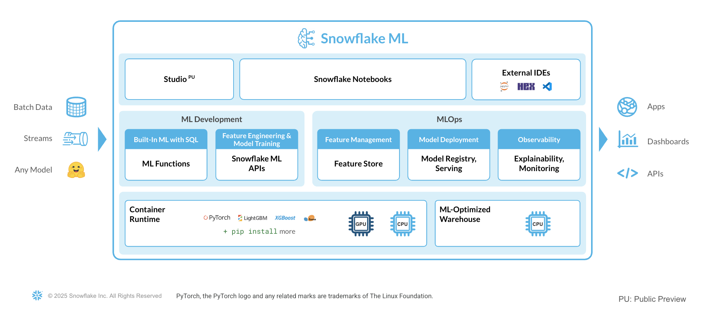

author: sikha-das
id: intro_to_machine_learning_with_snowpark_ml_for_python
summary: Through this quickstart guide, you will explore Snowflake for Machine Learning.
categories: Getting-Started
environments: web
status: Published 
feedback link: https://github.com/Snowflake-Labs/sfguides/issues
tags: Getting Started, Data Science, Data Engineering, Machine Learning, Snowpark

# Getting Started with Snowflake ML
<!-- ------------------------ -->
## Overview 

Through this quickstart guide, you will get an introduction to [Snowflake for Machine Learning](https://www.snowflake.com/en/data-cloud/snowflake-ml/). You will set up your Snowflake and Python environments and build an end to end ML workflow from feature engineering to model training and batch inference with Snowflake ML all from a set of unified Python APIs.

### What is Snowflake ML?

Snowflake ML is the integrated set of capabilities for end-to-end machine learning in a single platform on top of your governed data. Data scientists and ML engineers can easily and securely develop and productionize scalable features and models without any data movement, silos or governance tradeoffs.

Capabilities for model development and inference include: 
- **Snowflake Notebooks** for a familiar, easy-to-use notebook interface that blends Python, SQL, and Markdown
- **Container Runtime** for distributed compute on CPUs and GPUs from Snowflake Notebooks. This quickstart does not showcase container runtime but you can try it with this [intro quickstart](https://quickstarts.snowflake.com/guide/notebook-container-runtime/index.html#4). 
- **Snowflake ML APIs** for distributed feature engineering, distributed training, and distributed hyperparameter optimization
- **Snowflake Feature Store** for continuous, automated refreshes on batch or streaming data
- **Snowflake Model Registry** to manage models and their metadata, with model serving for inference with CPUs or GPUs
- **ML Lineage** to trace end-to-end feature and model lineage 
- **ML Explainability** to better understand the features the model considers most impactful when generating predictions
- **ML Monitoring** to monitor performance metrics for models running inference in Snowflake



To get started with Snowflake ML, developers can use the Python APIs from the [Snowflake ML library](https://docs.snowflake.com/en/developer-guide/snowflake-ml/snowpark-ml), directly from Snowflake Notebooks. 

**Snowflake ML provides the following advantages:**
- Transform your data and train your models using open-source Python ML frameworks such as scikit-learn and xgboost
- Streamline model management and batch inference with built-in versioning support and role-based access control catering to both Python and SQL users
- Keep your ML pipeline running within Snowflake's security and governance perimeters
- Take advantage of the performance and scalability of Snowflake's scalable computing platform.

Learn more about model development with [Snowflake ML APIs](https://docs.snowflake.com/en/developer-guide/snowflake-ml/snowpark-ml) and deployment with the [Snowflake Model Registry](https://docs.snowflake.com/en/developer-guide/snowpark-ml/snowpark-ml-mlops).

### What you will learn 
This quickstart will focus on building a custom ML workflow using the following features: 
- [Snowflake Notebooks](https://docs.snowflake.com/en/user-guide/ui-snowsight/notebooks), which comes pre-integrated with Snowflake ML capabilities 
- [Snowflake ML Distributed Preprocessing APIs](https://docs.snowflake.com/developer-guide/snowflake-ml/modeling#distributed-preprocessing) for feature engineering.
- [Snowflake Model Registry](https://docs.snowflake.com/en/developer-guide/snowpark-ml/snowpark-ml-mlops), which provides scalable and secure model management of ML models - whether you trained them in Snowflake or another ML platform. Using these features, you can build and operationalize a complete ML workflow, taking advantage of Snowflake's scale and security features. It also includes an [explainability function](https://docs.snowflake.com/en/developer-guide/snowflake-ml/model-registry/model-explainability) based on [Shapley values](https://towardsdatascience.com/the-shapley-value-for-ml-models-f1100bff78d1).

### Prerequisites
- [Git](https://git-scm.com/book/en/v2/Getting-Started-Installing-Git) installed
    > aside positive
    >
    >Download the [git repo](https://github.com/Snowflake-Labs/sfguide-intro-to-machine-learning-with-snowflake-ml-for-python)
- A Snowflake account login with a role that has the ability to create database, schema, tables, stages, user-defined functions, and stored procedures. If not, you will need to register for [a free trial](https://signup.snowflake.com/) or use a different role.

### What You’ll Build 
- A set of notebooks leveraging Snowflake ML for Python:
    - to load and clean data
    - to perform features transformations on the data using Snowpark ML transformers
    - to train an XGBoost ML model
    - to log models and execute batch inference in Snowflake using the Snowflake Model Registry
    - to apply a built-in explainability function to understand model performance 
    - to manage model metadata and trace machine learning artifacts via Snowflake Datasets and ML Lineage

<!-- ------------------------ -->
## Using Snowflake Notebooks
Duration: 2

To get started using Snowflake Notebooks, first login to Snowsight and run the following [setup.sql](https://github.com/Snowflake-Labs/sfguide-intro-to-machine-learning-with-snowflake-ml-for-python/blob/main/scripts/setup.sql) in a SQL worksheet. This will connect to the git repo where all the Snowflake Notebooks are stored and create them for you in your Snowflake environment.

```sql
USE ROLE ACCOUNTADMIN;
SET USERNAME = (SELECT CURRENT_USER());
SELECT $USERNAME;

-- Using ACCOUNTADMIN, create a new role for this exercise and grant to applicable users
CREATE OR REPLACE ROLE ML_MODEL_HOL_USER;
GRANT ROLE ML_MODEL_HOL_USER to USER identifier($USERNAME);

GRANT CREATE DATABASE ON ACCOUNT TO ROLE ML_MODEL_HOL_USER; 
GRANT CREATE COMPUTE POOL ON ACCOUNT TO ROLE ML_MODEL_HOL_USER;
GRANT BIND SERVICE ENDPOINT ON ACCOUNT TO ROLE ML_MODEL_HOL_USER;
GRANT CREATE ROLE ON ACCOUNT TO ROLE ML_MODEL_HOL_USER;
GRANT CREATE WAREHOUSE ON ACCOUNT TO ROLE ML_MODEL_HOL_USER;
GRANT MANAGE GRANTS ON ACCOUNT TO ROLE ML_MODEL_HOL_USER;
GRANT CREATE INTEGRATION ON ACCOUNT TO ROLE ML_MODEL_HOL_USER;
GRANT CREATE APPLICATION PACKAGE ON ACCOUNT TO ROLE ML_MODEL_HOL_USER;
GRANT CREATE APPLICATION ON ACCOUNT TO ROLE ML_MODEL_HOL_USER;
GRANT IMPORT SHARE ON ACCOUNT TO ROLE ML_MODEL_HOL_USER;

USE ROLE ML_MODEL_HOL_USER;

CREATE OR REPLACE WAREHOUSE ML_HOL_WH; --by default, this creates an XS Standard Warehouse
CREATE OR REPLACE DATABASE ML_HOL_DB;
CREATE OR REPLACE SCHEMA ML_HOL_SCHEMA;
CREATE OR REPLACE STAGE ML_HOL_ASSETS; --to store model assets

-- create csv format
CREATE FILE FORMAT IF NOT EXISTS ML_HOL_DB.ML_HOL_SCHEMA.CSVFORMAT 
    SKIP_HEADER = 1 
    TYPE = 'CSV';

-- create external stage with the csv format to stage the diamonds dataset
CREATE STAGE IF NOT EXISTS ML_HOL_DB.ML_HOL_SCHEMA.DIAMONDS_ASSETS 
    FILE_FORMAT = ML_HOL_DB.ML_HOL_SCHEMA.CSVFORMAT 
    URL = 's3://sfquickstarts/intro-to-machine-learning-with-snowpark-ml-for-python/diamonds.csv';

-- create network rule to allow all external access from Notebook
CREATE OR REPLACE NETWORK RULE allow_all_rule
  TYPE = 'HOST_PORT'
  MODE= 'EGRESS'
  VALUE_LIST = ('0.0.0.0:443','0.0.0.0:80');

CREATE OR REPLACE EXTERNAL ACCESS INTEGRATION allow_all_integration
  ALLOWED_NETWORK_RULES = (allow_all_rule)
  ENABLED = true;

GRANT USAGE ON INTEGRATION allow_all_integration TO ROLE ML_MODEL_HOL_USER;

-- create an API integration with Github
CREATE OR REPLACE API INTEGRATION GITHUB_INTEGRATION_ML_HOL
   api_provider = git_https_api
   api_allowed_prefixes = ('https://github.com/')
   enabled = true
   comment='Git integration with Snowflake Demo Github Repository.';

-- create the integration with the Github demo repository
CREATE OR REPLACE GIT REPOSITORY GITHUB_INTEGRATION_ML_HOL
   ORIGIN = 'https://github.com/Snowflake-Labs/sfguide-intro-to-machine-learning-with-snowflake-ml-for-python.git'
   API_INTEGRATION = 'GITHUB_INTEGRATION_ML_HOL' 
   COMMENT = 'Github Repository';

-- fetch most recent files from Github repository
ALTER GIT REPOSITORY GITHUB_INTEGRATION_ML_HOL FETCH;

-- copy notebooks into Snowflake & configure runtime settings
CREATE OR REPLACE NOTEBOOK ML_HOL_DB.ML_HOL_SCHEMA.ML_HOL_DATA_INGEST
FROM '@ML_HOL_DB.ML_HOL_SCHEMA.GITHUB_INTEGRATION_ML_HOL/branches/main' 
MAIN_FILE = 'notebooks/0_start_here.ipynb' 
QUERY_WAREHOUSE = ML_HOL_WH
RUNTIME_NAME = 'SYSTEM$BASIC_RUNTIME' 
COMPUTE_POOL = 'SYSTEM_COMPUTE_POOL_CPU'
IDLE_AUTO_SHUTDOWN_TIME_SECONDS = 3600;

ALTER NOTEBOOK ML_HOL_DB.ML_HOL_SCHEMA.ML_HOL_DATA_INGEST ADD LIVE VERSION FROM LAST;
ALTER NOTEBOOK ML_HOL_DB.ML_HOL_SCHEMA.ML_HOL_DATA_INGEST SET EXTERNAL_ACCESS_INTEGRATIONS = ('allow_all_integration')

CREATE OR REPLACE NOTEBOOK ML_HOL_DB.ML_HOL_SCHEMA.ML_HOL_FEATURE_TRANSFORM
FROM '@ML_HOL_DB.ML_HOL_SCHEMA.GITHUB_INTEGRATION_ML_HOL/branches/main' 
MAIN_FILE = 'notebooks/1_sf_nb_snowflake_ml_feature_transformations.ipynb' 
QUERY_WAREHOUSE = ML_HOL_WH
RUNTIME_NAME = 'SYSTEM$BASIC_RUNTIME' 
COMPUTE_POOL = 'SYSTEM_COMPUTE_POOL_CPU'
IDLE_AUTO_SHUTDOWN_TIME_SECONDS = 3600;

ALTER NOTEBOOK ML_HOL_DB.ML_HOL_SCHEMA.ML_HOL_FEATURE_TRANSFORM ADD LIVE VERSION FROM LAST;
ALTER NOTEBOOK ML_HOL_DB.ML_HOL_SCHEMA.ML_HOL_FEATURE_TRANSFORM SET EXTERNAL_ACCESS_INTEGRATIONS = ('allow_all_integration')

CREATE OR REPLACE NOTEBOOK ML_HOL_DB.ML_HOL_SCHEMA.ML_HOL_MODELING
FROM '@ML_HOL_DB.ML_HOL_SCHEMA.GITHUB_INTEGRATION_ML_HOL/branches/main' 
MAIN_FILE = 'notebooks/2_sf_nb_snowflake_ml_model_training_inference.ipynb' 
QUERY_WAREHOUSE = ML_HOL_WH
RUNTIME_NAME = 'SYSTEM$BASIC_RUNTIME' 
COMPUTE_POOL = 'SYSTEM_COMPUTE_POOL_CPU'
IDLE_AUTO_SHUTDOWN_TIME_SECONDS = 3600;

ALTER NOTEBOOK ML_HOL_DB.ML_HOL_SCHEMA.ML_HOL_MODELING ADD LIVE VERSION FROM LAST;
ALTER NOTEBOOK ML_HOL_DB.ML_HOL_SCHEMA.ML_HOL_MODELING SET EXTERNAL_ACCESS_INTEGRATIONS = ('allow_all_integration')

CREATE OR REPLACE NOTEBOOK ML_HOL_DB.ML_HOL_SCHEMA.ML_HOL_MLOPS
FROM '@ML_HOL_DB.ML_HOL_SCHEMA.GITHUB_INTEGRATION_ML_HOL/branches/main' 
MAIN_FILE = 'notebooks/3_sf_nb_snowpark_ml_adv_mlops.ipynb' 
QUERY_WAREHOUSE = ML_HOL_WH
RUNTIME_NAME = 'SYSTEM$BASIC_RUNTIME' 
COMPUTE_POOL = 'SYSTEM_COMPUTE_POOL_CPU'
IDLE_AUTO_SHUTDOWN_TIME_SECONDS = 3600;

ALTER NOTEBOOK ML_HOL_DB.ML_HOL_SCHEMA.ML_HOL_MLOPS ADD LIVE VERSION FROM LAST;
ALTER NOTEBOOK ML_HOL_DB.ML_HOL_SCHEMA.ML_HOL_MLOPS SET EXTERNAL_ACCESS_INTEGRATIONS = ('allow_all_integration')
```

<!-- ------------------------ -->
## Set up the data in Snowflake
Duration: 7

**Change role to** `ML_MODEL_HOL_USER`

Navigate to `Notebooks` > `ML_HOL_DATA_INGEST`.

Within this notebook, we will clean and ingest the `diamonds` dataset into a Snowflake table from an external stage. The `diamonds` dataset has been widely used in data science and machine learning, and we will use it to demonstrate Snowflake's native data science transformers throughout this quickstart. 

The overall goal of this ML project is to predict the price of diamonds given different qualitative and quantitative attributes.

<!-- ------------------------ -->
## ML Feature Transformations
Duration: 10

**Change role to** `ML_MODEL_HOL_USER`

Navigate to `Notebooks` > `ML_HOL_FEATURE_TRANSFORM`.

In this notebook, we will walk through a few transformations on the `diamonds` dataset that are included in the Snowpark ML Modeling. We will also build a preprocessing pipeline to be used in the ML modeling notebook.

<!-- ------------------------ -->
## ML Model Training and Inference
Duration: 15

**Change role to** `ML_MODEL_HOL_USER`

Navigate to `Notebooks` > `ML_HOL_MODELING`.

In this notebook, we will illustrate how to train an XGBoost model with the `diamonds`. We also show how to execute batch inference and model explainability through the Snowflake Model Registry.

<!-- ------------------------ -->
## Advanced MLOps: Managing ML Models from Iteration to Production
Duration: 15

**Change role to** `ML_MODEL_HOL_USER`

Navigate to `Notebooks` > `ML_HOL_MLOPS`.

In this notebook, we will show you how to manage Machine Learning models from experimentation to production using Model Registry as well as:
- [Snowflake Datasets](https://docs.snowflake.com/en/developer-guide/snowflake-ml/dataset) for creating and managing training data
- [Snowflake ML Lineage](https://docs.snowflake.com/en/developer-guide/snowflake-ml/ml-lineage) to trace end-to-end data and model lineage 

We will also go more into detail in using the Model Registry API.

<!-- ------------------------ -->
## Conclusion and Resources
Congratulations, you have successfully completed this quickstart! Through this quickstart, we were able to showcase Snowflake for Machine Learning through the introduction of native model development and operations capabilities to streamline end to end workflows. Now, you can run data preprocessing, feature engineering, model training, and batch inference in a few lines of code. You can also manage your models from iteration to production and trace your ML lineage to better understand how machine learning artifacts relate to each other.

For more information, check out the resources below:

### Related Resources
- [Source Code on GitHub](https://github.com/Snowflake-Labs/sfguide-intro-to-machine-learning-with-snowflake-ml-for-python)
- [Snowflake ML Webpage](https://www.snowflake.com/en/data-cloud/snowflake-ml/)
- [Snowflake ML API Docs](https://docs.snowflake.com/en/developer-guide/snowpark-ml/index)
- [Build an End-to-End ML Workflow in Snowflake
](https://quickstarts.snowflake.com/guide/end-to-end-ml-workflow/#0)

<!-- ------------------------ -->