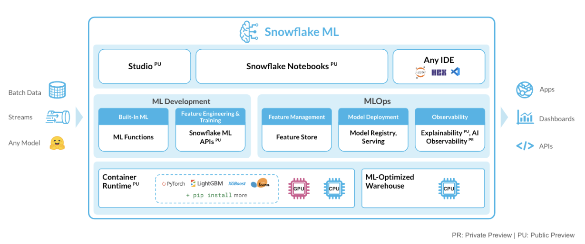
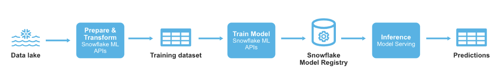
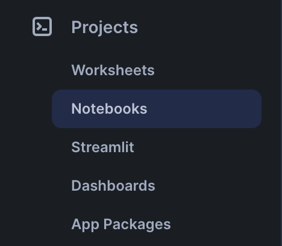
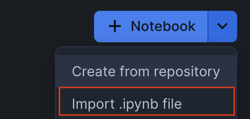
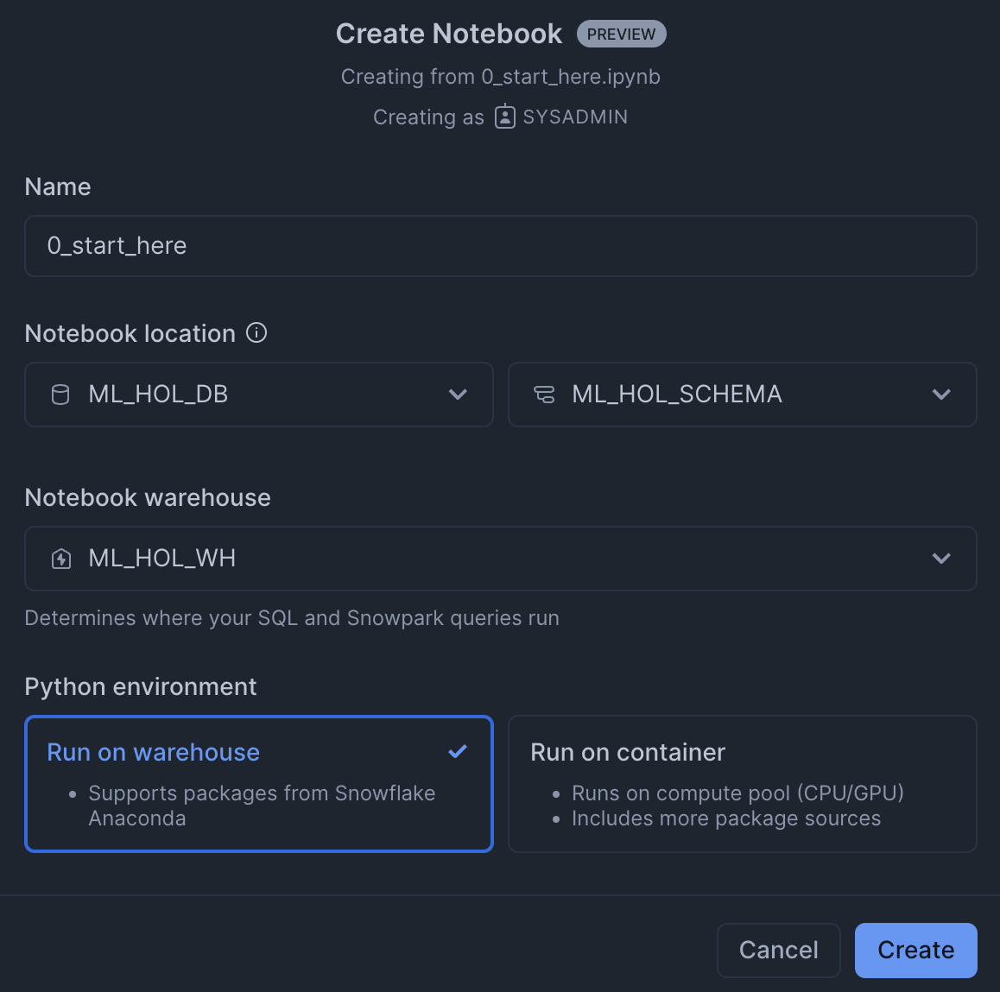
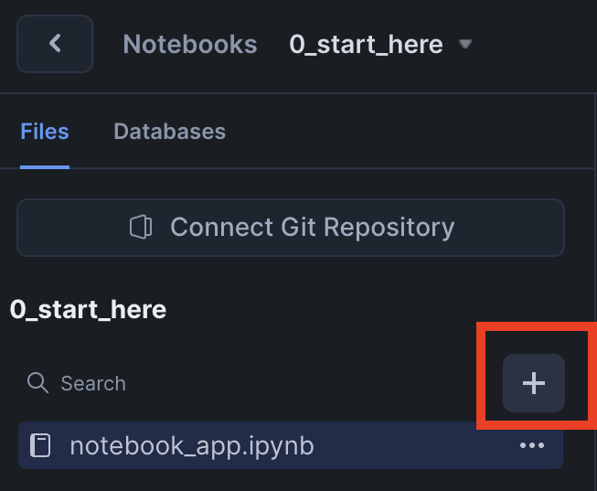
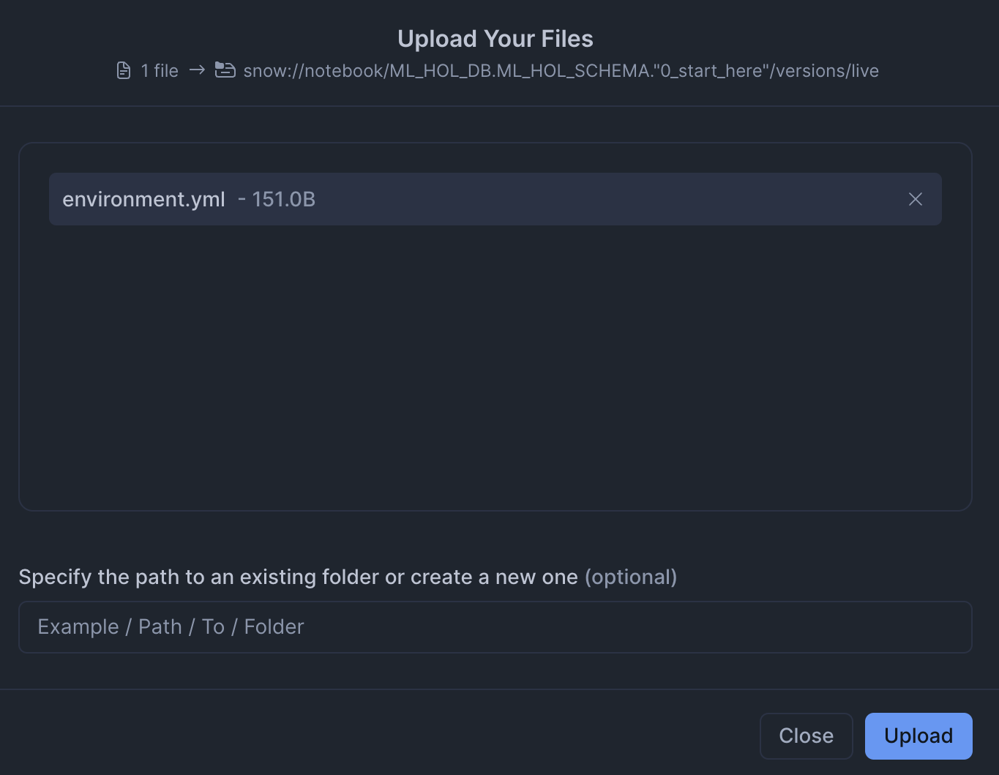

author: sikha-das
id: intro_to_machine_learning_with_snowpark_ml_for_python
summary: Through this quickstart guide, you will explore Snowflake for Machine Learning.
categories: Getting-Started
environments: web
status: Published 
feedback link: https://github.com/Snowflake-Labs/sfguides/issues
tags: Getting Started, Data Science, Data Engineering, Machine Learning, Snowpark

# Getting Started with Snowflake ML
<!-- ------------------------ -->
## Overview 

Through this quickstart guide, you will get an introduction to [Snowflake for Machine Learning](https://www.snowflake.com/en/data-cloud/snowflake-ml/). You will set up your Snowflake and Python environments and build an end to end ML workflow from feature engineering to model training and batch inference with Snowflake ML all from a set of unified Python APIs in the Snowpark ML library.

### What is Snowflake ML?

Snowflake ML is the integrated set of capabilities for end-to-end machine learning in a single platform on top of your governed data. Data scientists and ML engineers can easily and securely develop and productionize scalable features and models without any data movement, silos or governance tradeoffs.

Capabilities for custom ML include: 
- **Snowflake Notebooks** for a familiar, easy-to-use notebook interface that blends Python, SQL, and Markdown
- **Container Runtime** for distributed compute on CPUs and GPUs from Snowflake Notebooks
- **Snowpark ML Modeling** for feature engineering and model training with familiar Python frameworks  
- **Snowflake Feature Store** for continuous, automated refreshes on batch or streaming data
- **Snowflake Model Registry** to manage models and their metadata 
- **ML Lineage** to trace end-to-end feature and model lineage 
- **ML Explainability** to better understand the features the model considers most impactful when generating predictions



To get started with Snowflake ML, developers can use the Python APIs from the [Snowpark ML library](https://docs.snowflake.com/en/developer-guide/snowpark-ml/index), directly from Snowflake Notebooks (public preview) or downloaded and installed into any IDE of choice, including Jupyter or Hex. 

**Feature Engineering and Preprocessing:** Improve performance and scalability with distributed execution for common scikit-learn preprocessing functions.

**Model Training:** Accelerate model training for scikit-learn, XGBoost and LightGBM models without the need to manually create stored procedures or user-defined functions (UDFs), and leverage distributed hyperparameter optimization.


**Model Management, Batch Inference, and Model Explainability:** Manage several types of ML models created both within and outside Snowflake, execute batch inference, and understand features the model considers most impactful when generating predictions.


**Snowflake ML provides the following advantages:**
- Transform your data and train your models using popular Python ML frameworks such as scikit-learn, xgboost, and lightgbm without moving data out of Snowflake
- Streamline model management and batch inference with built-in versioning support and role-based access control catering to both Python and SQL users
- Keep your ML pipeline running within Snowflake's security and governance perimeters
- Take advantage of the performance and scalability of Snowflake's scalable computing platform.

The first batch of algorithms provided in Snowpark ML Modeling is based on [scikit-learn](https://scikit-learn.org/stable/) preprocessing transformations from [sklearn.preprocessing](https://scikit-learn.org/stable/modules/classes.html#module-sklearn.preprocessing  ), as well as estimators that are compatible with those in the scikit-learn, xgboost, and lightgbm libraries.

Learn more about [Snowpark ML Modeling](https://docs.snowflake.com/en/developer-guide/snowpark-ml/snowpark-ml-modeling) and [Snowflake Model Registry](https://docs.snowflake.com/en/developer-guide/snowpark-ml/snowpark-ml-mlops).

### What you will learn 
This quickstart will focus on building a custom ML workflow using the following features: 
- Snowflake Notebooks, which comes pre-integrated with Snowflake ML capabilities 
- [Snowpark ML Modeling](https://docs.snowflake.com/en/developer-guide/snowpark-ml/snowpark-ml-modeling), which enables the use of popular Python ML frameworks, such as scikit-learn and XGBoost, for feature engineering and model training without the need to move data out of Snowflake.
- [Snowflake Model Registry](https://docs.snowflake.com/en/developer-guide/snowpark-ml/snowpark-ml-mlops), which provides scalable and secure model management of ML models - whether you trained them in Snowflake or another ML platform. Using these features, you can build and operationalize a complete ML workflow, taking advantage of Snowflake's scale and security features. It also includes an [explainability function](https://docs.snowflake.com/en/developer-guide/snowflake-ml/model-registry/model-explainability) based on [Shapley values](https://towardsdatascience.com/the-shapley-value-for-ml-models-f1100bff78d1).

### Prerequisites
- [Git](https://git-scm.com/book/en/v2/Getting-Started-Installing-Git) installed
    > aside positive
    >
    >Download the [git repo](https://github.com/Snowflake-Labs/sfguide-intro-to-machine-learning-with-snowflake-ml-for-python)
- A Snowflake account login with a role that has the ability to create database, schema, tables, stages, user-defined functions, and stored procedures. If not, you will need to register for [a free trial](https://signup.snowflake.com/) or use a different role.

### What You’ll Build 
- A set of notebooks leveraging Snowflake ML for Python:
    - to load and clean data
    - to perform features transformations on the data using Snowpark ML transformers
    - to train an XGBoost ML model using Snowpark ML estimators
    - to log models and execute batch inference in Snowflake using the Snowflake Model Registry
    - to apply a built-in explainability function to understand model performance 
    - to manage model metadata and trace machine learning artifacts via Snowflake Datasets and ML Lineage



<!-- ------------------------ -->
## Using Snowflake Notebooks
Duration: 2

To get started using Snowflake Notebooks, first login to Snowsight and run the following [setup.sql](https://github.com/Snowflake-Labs/sfguide-intro-to-machine-learning-with-snowflake-ml-for-python/blob/main/scripts/setup.sql) in a SQL worksheet (we need to create the database, warehouse, schema, etc. that we will use for our ML project).

```sql
USE ROLE SYSADMIN;
CREATE OR REPLACE WAREHOUSE ML_HOL_WH; --by default, this creates an XS Standard Warehouse
CREATE OR REPLACE DATABASE ML_HOL_DB;
CREATE OR REPLACE SCHEMA ML_HOL_SCHEMA;
CREATE OR REPLACE STAGE ML_HOL_ASSETS; --to store model assets

-- create csv format
CREATE FILE FORMAT IF NOT EXISTS ML_HOL_DB.ML_HOL_SCHEMA.CSVFORMAT 
    SKIP_HEADER = 1 
    TYPE = 'CSV';

-- create external stage with the csv format to stage the diamonds dataset
CREATE STAGE IF NOT EXISTS ML_HOL_DB.ML_HOL_SCHEMA.DIAMONDS_ASSETS 
    FILE_FORMAT = ML_HOL_DB.ML_HOL_SCHEMA.CSVFORMAT 
    URL = 's3://sfquickstarts/intro-to-machine-learning-with-snowpark-ml-for-python/diamonds.csv';
    -- https://sfquickstarts.s3.us-west-1.amazonaws.com/intro-to-machine-learning-with-snowpark-ml-for-python/diamonds.csv

LS @DIAMONDS_ASSETS;
```

Now, let's create our first Notebook by importing a `.ipynb` file. First, make sure your current role is `SYSADMIN`. Then, select the Notebooks tab under the Projects dropdown in the left sidebar:



Next, click the gray upload/import .ipynb button, and select [0_start_here.ipynb](https://github.com/Snowflake-Labs/sfguide-intro-to-machine-learning-with-snowflake-ml-for-python/blob/main/notebooks/0_start_here.ipynb) from your local filesystem:



Leave the populated notebook name as-is (or change it if you'd like!), and make sure that the location is set to `ML_HOL_DB` and `ML_HOL_SCHEMA`. Lastly, make sure the Notebook warehouse is `ML_HOL_WH`, and click Create:



This will create and open the notebook you just uploaded. 

Now, upload the provided [environment.yml](https://github.com/Snowflake-Labs/sfguide-intro-to-machine-learning-with-snowflake-ml-for-python/blob/main/notebooks/environment.yml) file.





Then, click `Start` and run the Notebook start to finish! 

Repeat this process with all the other Notebooks to see how easy it is to write Python and SQL code in a single, familiar Notebook interface directly in Snowsight!

<!-- ------------------------ -->
## Set up the data in Snowflake
Duration: 7

Open the following notebook in Snowflake Notebooks and run each of the cells: [0_start_here.ipynb](https://github.com/Snowflake-Labs/sfguide-intro-to-machine-learning-with-snowflake-ml-for-python/blob/main/notebooks/0_start_here.ipynb)

Within this notebook, we will clean and ingest the `diamonds` dataset into a Snowflake table from an external stage. The `diamonds` dataset has been widely used in data science and machine learning, and we will use it to demonstrate Snowflake's native data science transformers throughout this quickstart. 

The overall goal of this ML project is to predict the price of diamonds given different qualitative and quantitative attributes.

<!-- ------------------------ -->
## ML Feature Transformations
Duration: 10

Open the following notebook in Snowflake Notebooks and run each of the cells: [1_sf_nb_snowflake_ml_feature_transformations.ipynb](https://github.com/Snowflake-Labs/sfguide-intro-to-machine-learning-with-snowflake-ml-for-python/blob/main/notebooks/1_sf_nb_snowflake_ml_feature_transformations.ipynb)

In this notebook, we will walk through a few transformations on the `diamonds` dataset that are included in the Snowpark ML Modeling. We will also build a preprocessing pipeline to be used in the ML modeling notebook.

<!-- ------------------------ -->
## ML Model Training and Inference
Duration: 15

Open the following notebook in Snowflake Notebooks and run each of the cells: [2_sf_nb_snowflake_ml_model_training_inference.ipynb](https://github.com/Snowflake-Labs/sfguide-intro-to-machine-learning-with-snowflake-ml-for-python/blob/main/notebooks/2_sf_nb_snowflake_ml_model_training_inference.ipynb)

In this notebook, we will illustrate how to train an XGBoost model with the `diamonds` dataset using the Snowpark ML Modeling. We also show how to execute batch inference and model explainability through the Snowflake Model Registry.

<!-- ------------------------ -->
## Advanced MLOps: Managing ML Models from Iteration to Production
Duration: 15

Open the following notebook in Snowflake Notebooks and run each of the cells: [3_sf_nb_snowpark_ml_adv_mlops.ipynb](https://github.com/Snowflake-Labs/sfguide-intro-to-machine-learning-with-snowflake-ml-for-python/blob/main/notebooks/3_sf_nb_snowpark_ml_adv_mlops.ipynb)

In this notebook, we will show you how to manage Machine Learning models from experimentation to production using existing (Snowpark ML Modeling & Model Registry) and new Snowflake MLOps features:
- [Snowflake Datasets](https://docs.snowflake.com/en/developer-guide/snowflake-ml/dataset) for creating and managing training data
- [Snowflake ML Lineage](https://docs.snowflake.com/en/developer-guide/snowflake-ml/ml-lineage) to trace end-to-end data and model lineage 

We will also go more into detail in using the Model Registry API.

<!-- ------------------------ -->
## Conclusion and Resources
Congratulations, you have successfully completed this quickstart! Through this quickstart, we were able to showcase Snowflake for Machine Learning through the introduction of Snowpark ML, the Python library and underlying infrastructure for data science and machine learning tasks. Now, you can run data preprocessing, feature engineering, model training, and batch inference in a few lines of code without having to define and deploy stored procedures that package scikit-learn, xgboost, or lightgbm code. You can also manage your models from iteration to production and trace your ML lineage to better understand how machine learning artifacts relate to each other.

For more information, check out the resources below:

### Related Resources
- [Source Code on GitHub](https://github.com/Snowflake-Labs/sfguide-intro-to-machine-learning-with-snowflake-ml-for-python)
- [Snowflake ML Docs](https://docs.snowflake.com/en/developer-guide/snowflake-ml/overview)
- [Snowpark ML API Docs](https://docs.snowflake.com/en/developer-guide/snowpark-ml/index)
- [Getting Started with Data Engineering and ML Using Snowpark](https://quickstarts.snowflake.com/guide/getting_started_with_dataengineering_ml_using_snowpark_python/index.html?index=..%2F..index#0)
- [Develop and Manage ML Models with Feature Store and Model Registry](https://quickstarts.snowflake.com/guide/develop-and-manage-ml-models-with-feature-store-and-model-registry/index.html#0)
- [Snowpark for Python Developer Docs](https://docs.snowflake.com/en/developer-guide/snowpark/python/index.html)

<!-- ------------------------ -->