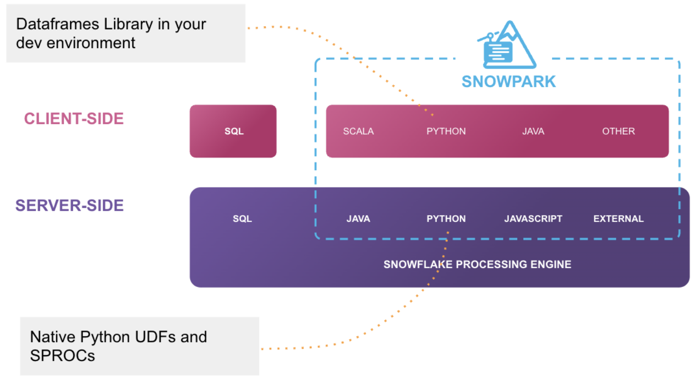
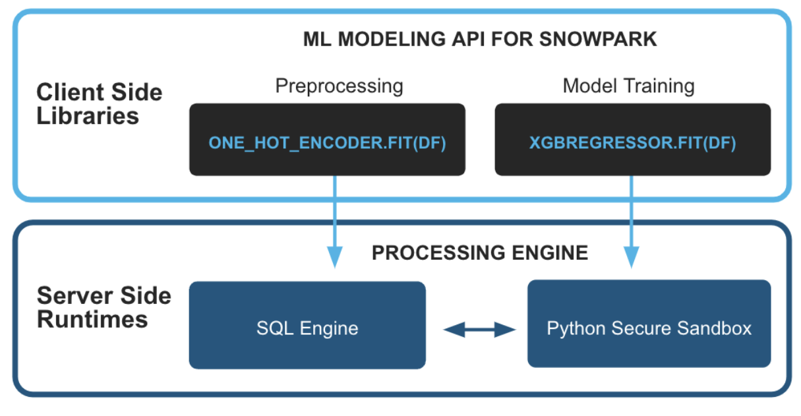
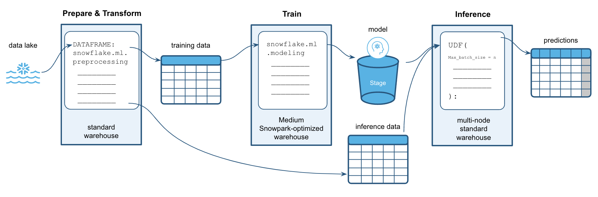

author: sikha-das
id: intro_to_machine_learning_with_snowpark_ml_for_python
summary: Through this quickstart guide, you will explore what's new in Snowpark for Machine Learning.
categories: Getting-Started
environments: web
status: Draft 
feedback link: https://github.com/Snowflake-Labs/sfguides/issues
tags: Getting Started, Data Science, Data Engineering, Machine Learning, Snowpark

# Intro to Machine Learning with Snowpark ML for Python
<!-- ------------------------ -->
## Overview 

Through this quickstart guide, you will explore what's new in Snowpark for Machine Learning. You will set up your Snowflake and Python environments and build an end to end ML workflow from feature engineering to model training and deployment using Snowpark ML.

### What is Snowpark?

Snowpark is the set of libraries and runtimes that securely enable developers to deploy and process Python code in Snowflake.

**Familiar Client Side Libraries** - Snowpark brings deeply integrated, DataFrame-style programming and OSS compatible APIs to the languages data practitioners like to use. It also includes a set of  Snowpark ML APIs for more efficient ML modeling (public preview) and ML Operations (private preview).

**Flexible Runtime Constructs** - Snowpark provides flexible runtime constructs that allow users to bring in and run custom logic. Developers can seamlessly build data pipelines, ML models, and data applications with User-Defined Functions and Stored Procedures.

Learn more about [Snowpark](http://www.snowflake.com/snowpark).



### What is Snowpark ML?

Snowpark ML is a new library for faster and more intuitive end-to-end ML development in Snowflake. Snowpark ML has 2 APIs: Snowpark ML Modeling (public preview) for model development and Snowpark ML operations (private preview) for model deployment. 

This quickstart will focus on the Snowpark ML Modeling API, which scales out feature engineering and simplifies ML training execution. 

**Preprocessing:** Improve performance and scalability with distributed, multi-node execution for common feature engineering functions

**Model Training:** Execute training for popular scikit-learn and xgboost models without manual creation of Stored Procedures or UDFs



By letting you perform these tasks in a Snowflake Python application, snowpark-ml provides the following advantages:
- Transform your data and train your models without moving your data out of Snowflake and without having to define and deploy stored procedures that package scikit-learn, xgboost, or lightgbm code.
- Work with APIs similar to those you’re already familiar with, such as scikit-learn.
- Keep your ML pipeline running within Snowflake’s security and governance frameworks.
- Take advantage of the performance and scalability of Snowflake’s data warehouses.

The first batch of algorithms provided in Snowpark Python is based on [scikit-learn](https://scikit-learn.org/stable/) preprocessing transformations from [sklearn.preprocessing](https://scikit-learn.org/stable/modules/classes.html#module-sklearn.preprocessing), as well as estimators that are compatible with those in the scikit-learn, xgboost, and lightgbm libraries.

Learn more about [Snowpark ML Modeling API](https://docs.snowflake.com/developer-guide/snowpark/python/snowpark-ml-modeling).

### What you will learn 
- How to perform feature engineering and train a model in Snowflake with [Snowpark ML Modeling API](https://docs.snowflake.com/developer-guide/snowpark/python/snowpark-ml-modeling)
- How to deploy a Snowpark ML model in Snowflake to a User Defined Function (UDF) for model inference


### Prerequisites
- [Git](https://git-scm.com/book/en/v2/Getting-Started-Installing-Git) installed
- [Anaconda](https://www.anaconda.com/) installed
- [Python 3.9](https://www.python.org/downloads/) installed
    - Note that you will be creating a Python environment with 3.9 in the **Setup the Python Environment** step
- A Snowflake account with [Anaconda Packages enabled by ORGADMIN](https://docs.snowflake.com/en/developer-guide/udf/python/udf-python-packages.html#using-third-party-packages-from-anaconda). If you do not have a Snowflake account, you can register for a [free trial account](https://signup.snowflake.com/).
- A Snowflake account login with ACCOUNTADMIN role. If not, you will need to register for a free trial or use a different role that has the ability to create database, schema, tables, stages, user-defined functions, and stored procedures.

### What You’ll Build 
- A set of notebooks leveraging Snowpark & Snowpark ML for Python:
    - to load and clean data
    - to perform features transformations on the data using Snowpark ML transformers
    - to train an XGBoost ML model using Snowpark ML estimators
    - to deploy the trained model in Snowflake using a Python User Defined Function (UDF)



<!-- ------------------------ -->
## Set up the Snowflake environment
Duration: 2

Run the following SQL commands in a SQL worksheet to create the [warehouse](https://docs.snowflake.com/en/sql-reference/sql/create-warehouse.html), [database](https://docs.snowflake.com/en/sql-reference/sql/create-database.html) and [schema](https://docs.snowflake.com/en/sql-reference/sql/create-schema.html).

```SQL
USE ROLE ACCOUNTADMIN;

CREATE OR REPLACE WAREHOUSE ML_HOL_WH;
CREATE OR REPLACE DATABASE ML_HOL_DB;
CREATE OR REPLACE SCHEMA ML_HOL_SCHEMA;
CREATE OR REPLACE STAGE DIAMONDS_ASSETS;
```

These can also be found in the **setup.sql** file.

<!-- ------------------------ -->
## Set up the Python environment
Duration: 7

### Snowpark for Python and Snowpark ML

- Download and install the miniconda installer from [https://conda.io/miniconda.html](https://conda.io/miniconda.html). (OR, you may use any other Python environment with Python 3.9, for example, [virtualenv](https://virtualenv.pypa.io/en/latest/)).

- Download the latest version of Snowpark ML from [here](https://drive.google.com/drive/folders/1NFe9oUmhJEtx0XPoDkSJtP4eysNKrlcV). Make sure you download the `.tar.bz2` file. **1.0.2 is the latest version as of this guide's publish date.**

- Open a new terminal window and execute the following commands in the same terminal window:

  1. Create a local conda channel for .tar.bz2 file
Create a folder for your channel, for example, mychannel. And Create a folder named noarch in it.
  ```
  $ mkdir -p <some_path>/mychannel/noarch
  ```
  i.e. `mkdir -p ./mychannel/noarch` to save to your current folder

  2. Put the .tar.bz2 file into that folder.
  ```
  $ cp snowflake_ml_python-${VERSION}-py_0.tar.bz2 <some_path>/mychannel/noarch/snowflake_ml_python-${VERSION}-py_0.tar.bz2
  ```

  3. Install conda-build.
  ```
  $ conda install conda-build
  ```

  4. Run conda index to create the local conda channel.
  ```
  $ conda index <some_path>/mychannel
  ```

  5. Create your Python environment based on the `conda_env.yml` file provided.
  ```
  $ conda env create -f conda_env.yml
  ``` 

  5. Install Snowpark ML in the created environment:
  ```
  $ conda activate snowpark-ml-hol
  $ conda install -c file://<some_path>/mychannel -c https://repo.anaconda.com/pkgs/snowflake/ --override-channel snowflake-ml-python
  ```
  ** Make sure you write your full path to /mychannel here: i.e. `file://Users/<username>/<some path>/mychannel` 

  7. `Optionally` start notebook server
  ```
  $ jupyter notebook &> /tmp/notebook.log &
  ```  

- Update [connection.json](connection.json) with your Snowflake account details and credentials.
  Here's a sample based on the object names we created in the last step:

```
{
  "account"   : "<your_account_identifier_goes_here>",
  "user"      : "<your_username_goes_here>",
  "password"  : "<your_password_goes_here>",
  "role"      : "ACCOUNTADMIN",
  "warehouse" : "ML_HOL_WH",
  "database"  : "ML_HOL_DB",
  "schema"    : "ML_HOL_SCHEMA"
}
```

> aside negative
> 
> **Note:** For the account parameter above, specify your account identifier and do not include the snowflakecomputing.com domain name. Snowflake automatically appends this when creating the connection. For more details on that, refer to the documentation.

<!-- ------------------------ -->
## Set up the data in Snowflake
Duration: 7

Open the following jupyter notebook and run each of the cells: [1_snowpark_ml_data_ingest.ipynb](notebooks/1_snowpark_ml_data_ingest.ipynb)

Within this notebook, we will clean and ingest the `diamonds` dataset into a Snowflake table. The `diamonds` dataset has been widely used in data science and machine learning, and we will use it to demonstrate Snowflake's native data science transformers throughout this quickstart.

The overall goal of this ML project is to predict the price of diamonds given different qualitative and quantitative attributes.

<!-- ------------------------ -->
## ML Feature Transformations
Duration: 10

Open the following jupyter notebook and run each of the cells: [2_snowpark_ml_feature_transformations.ipynb](notebooks/2_snowpark_ml_feature_transformations.ipynb)

In this notebook, we will walk through a few transformations on the `diamonds` dataset that are included in the Snowpark ML Preprocessing API. We will also build a preprocessing pipeline to be used in the ML modeling notebook.

<!-- ------------------------ -->
## ML Model Training and Deployment
Duration: 15

Open the following jupyter notebook and run each of the cells: [3_snowpark_ml_model_training_deployment.ipynb](notebooks/3_snowpark_ml_modeling.ipynb)

In this notebook, we will illustrate how to train an XGBoost model with the `diamonds` dataset using the Snowpark ML Model API. We also show how to do inference and deploy the model as a UDF. 

***Note: Once Snowpark ML's native model registry is available, this will be the more streamlined approach to deploy your model.***

<!-- ------------------------ -->
## Conclusion
Congratulations, you have successfully completed this quickstart! Through this quickstart, we were able to showcase what's new in Snowpark for Machine Learning through the introduction of Snowpark ML, a collection of Python APIs for data science and machine learning tasks. Now, you can run data preprocessing and model training steps in a few lines of code without having to define and deploy stored procedures that package scikit-learn, xgboost, or lightgbm code.

For more information, check out the resources below:

### Related Resources
- [Source Code on GitHub](https://github.com/Snowflake-Labs/sfguide-intro_to_machine_learning_with_snowpark_ml_for_python)
- [Getting Started with Data Engineering and ML Using Snowpark](https://quickstarts.snowflake.com/guide/getting_started_with_dataengineering_ml_using_snowpark_python/index.html?index=..%2F..index#0)
- [Advanced: Snowpark for Python Data Engineering Guide](https://quickstarts.snowflake.com/guide/data_engineering_pipelines_with_snowpark_python/index.html)
- [Advanced: Snowpark for Python Machine Learning Guide](https://quickstarts.snowflake.com/guide/getting_started_snowpark_machine_learning/index.html)
- [Snowpark for Python Demos](https://github.com/Snowflake-Labs/snowpark-python-demos/blob/main/README.md)
- [Snowpark for Python Developer Docs](https://docs.snowflake.com/en/developer-guide/snowpark/python/index.html)
- [Snowpark ML API Docs](https://docs.snowflake.com/developer-guide/snowpark/python/snowpark-ml-modeling)

<!-- ------------------------ -->