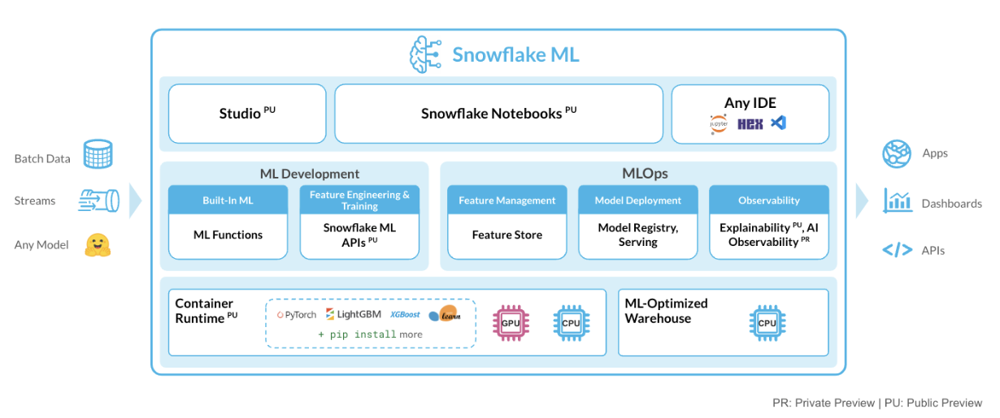
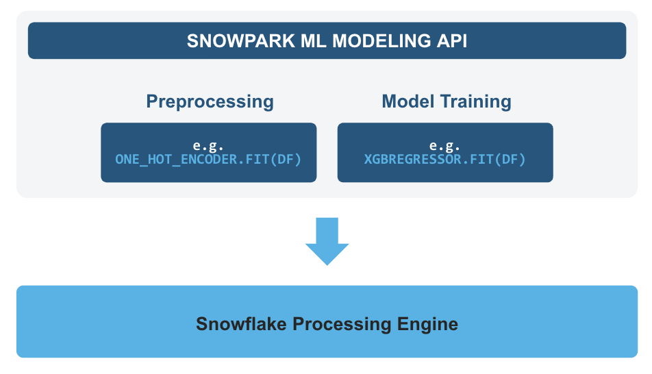
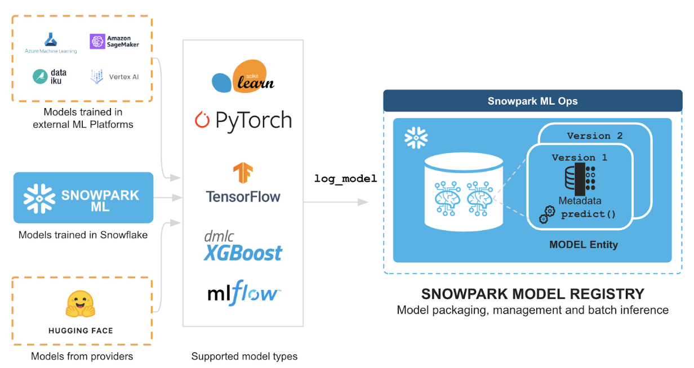

author: sikha-das
id: intro_to_snowpark_ml
summary: Through this quickstart guide, you will explore what's new in Snowpark for Machine Learning.
categories: Getting-Started
environments: web
status: Draft 
feedback link: https://github.com/Snowflake-Labs/sfguides/issues
tags: Getting Started, Data Science, Data Engineering, Machine Learning, Snowpark

# Intro to Machine Learning with Snowpark ML for Python
<!-- ------------------------ -->
## Overview 

Through this quickstart guide, you will explore what's new in Snowpark for Machine Learning. You will set up your Snowflake and Python environments and build an end to end ML workflow from feature engineering to model training and batch inference using Snowpark ML.

### What is Snowpark?

Snowpark is the set of libraries and runtimes that securely enable developers to deploy and process Python code in Snowflake.

**Client Side Libraries** - Snowpark libraries can be installed and downloaded from any client-side notebook or IDE and are used for code development and deployment. Libraries include the Snowpark API for data pipelines and apps and the Snowpark ML API for end to end machine learning.

**Elastic Compute Runtimes** - Snowpark provides elastic compute runtimes for secure execution of your code in Snowflake. Runtimes include Python, Java, and Scala in virtual warehouses with CPU compute or Snowpark Container Services (public preview) to execute any language of choice with CPU or GPU compute.

Learn more about [Snowpark](http://www.snowflake.com/snowpark).

### What is Snowpark ML?

[Snowpark ML](https://docs.snowflake.com/en/developer-guide/snowpark-ml/index) includes the Python library and underlying infrastructure for end-to-end ML workflows in Snowflake. With Snowpark ML, data scientists and ML engineers can use familiar Python frameworks for preprocessing, feature engineering, and training models that can be managed entirely in Snowflake without any data movement, silos or governance trade-offs. Snowpark ML has 2 components: Snowpark ML Modeling for model development and Snowpark ML Operations including the Snowpark Model Registry (public preview) for model management and batch inference.



This quickstart will focus on
* Snowpark ML Modeling API, which enables the use of popular Python ML frameworks, such as scikit-learn and XGBoost, for feature engineering and model training without the need to move data out of Snowflake.
* Snowpark Model Registry, which provides scalable and secure model management of ML models in Snowflake, regardless of origin. 

Using these features, you can build and operationalize a complete ML workflow, taking advantage of Snowflake's scale and security features.

**Feature Engineering and Preprocessing:** Improve performance and scalability with distributed execution for common scikit-learn preprocessing functions. 

**Model Training:** Accelerate model training for scikit-learn, XGBoost and LightGBM models without the need to manually create stored procedures or user-defined functions (UDFs), and leverage distributed hyperparameter optimization (public preview).



**Model Management and Batch Inference:** Manage several types of ML models created both within and outside Snowflake and execute batch inference.



By letting you perform these tasks within Snowflake, snowpark-ml provides the following advantages:
* Transform your data and train your models using popular Python ML frameworks such as scikit-learn, xgboost, and lightgbm without moving data out of Snowflake
* Streamline model management and batch inference with built-in versioning support and role-based access control catering to both Python and SQL users
* Keep your ML pipeline running within Snowflake's security and governance perimeters
* Take advantage of the performance and scalability of Snowflake's scalable computing platform.

The first batch of algorithms provided in Snowpark Python is based on [scikit-learn](https://scikit-learn.org/stable/) preprocessing transformations from [sklearn.preprocessing](https://scikit-learn.org/stable/modules/classes.html#module-sklearn.preprocessing), as well as estimators that are compatible with those in the scikit-learn, xgboost, and lightgbm libraries.

Learn more about [Snowpark ML Modeling API](https://docs.snowflake.com/en/developer-guide/snowpark-ml/snowpark-ml-modeling) and [Snowpark Model Registry](https://docs.snowflake.com/LIMITEDACCESS/snowflake-ml-model-registry).

### What you will learn 
- How to perform feature engineering and train a model in Snowflake with [Snowpark ML Modeling API](https://docs.snowflake.com/en/developer-guide/snowpark-ml/snowpark-ml-modeling)
- How to manage models and execute batch inference in Snowflake via [Snowpark Model Registry](https://docs.snowflake.com/LIMITEDACCESS/snowflake-ml-model-registry) for model inference

### Prerequisites
- [Git](https://git-scm.com/book/en/v2/Getting-Started-Installing-Git) installed
    > aside positive
    >
    >Download the [git repo](https://github.com/Snowflake-Labs/sfguide-intro-to-machine-learning-with-snowpark-ml-for-python**)
- [Anaconda](https://www.anaconda.com/) installed
- [Python 3.11](https://www.python.org/downloads/) installed
    - Note that you will be creating a Python environment with 3.11 in the **Setup the Python Environment** step
- A Snowflake account with [Anaconda Packages enabled by ORGADMIN](https://docs.snowflake.com/en/developer-guide/udf/python/udf-python-packages.html#using-third-party-packages-from-anaconda). If you do not have a Snowflake account, you can register for a [free trial account](https://signup.snowflake.com/).
- A Snowflake account login with a role that has the ability to create database, schema, tables, stages, user-defined functions, and stored procedures. If not, you will need to register for a free trial or use a different role.

### What You’ll Build 
- A set of notebooks leveraging Snowpark & Snowpark ML for Python:
    - to load and clean data
    - to perform features transformations on the data using Snowpark ML transformers
    - to train an XGBoost ML model using Snowpark ML estimators
    - to log models and execute batch inference in Snowflake using the Snowpark Model Registry

<!-- ------------------------ -->
## Set up the Snowflake environment
Duration: 2

> aside positive
>
> MAKE SURE YOU'VE DOWNLOADED THE [GIT REPO](https://github.com/Snowflake-Labs/sfguide-intro-to-machine-learning-with-snowpark-ml-for-python**).

Run the following SQL commands in a SQL worksheet to create the [warehouse](https://docs.snowflake.com/en/sql-reference/sql/create-warehouse.html), [database](https://docs.snowflake.com/en/sql-reference/sql/create-database.html) and [schema](https://docs.snowflake.com/en/sql-reference/sql/create-schema.html).

```SQL
USE ROLE ACCOUNTADMIN;
CREATE OR REPLACE WAREHOUSE ML_HOL_WH; --by default, this creates an XS Standard Warehouse
CREATE OR REPLACE DATABASE ML_HOL_DB;
CREATE OR REPLACE SCHEMA ML_HOL_SCHEMA;
CREATE OR REPLACE STAGE ML_HOL_ASSETS; --to store model assets

-- create csv format
CREATE FILE FORMAT IF NOT EXISTS ML_HOL_DB.ML_HOL_SCHEMA.CSVFORMAT 
    SKIP_HEADER = 1 
    TYPE = 'CSV';

-- create external stage with the csv format to stage the diamonds dataset
CREATE STAGE IF NOT EXISTS ML_HOL_DB.ML_HOL_SCHEMA.DIAMONDS_ASSETS 
    FILE_FORMAT = ML_HOL_DB.ML_HOL_SCHEMA.CSVFORMAT 
    URL = 's3://sfquickstarts/intro-to-machine-learning-with-snowpark-ml-for-python/diamonds.csv';
    -- https://sfquickstarts.s3.us-west-1.amazonaws.com/intro-to-machine-learning-with-snowpark-ml-for-python/diamonds.csv

LS @DIAMONDS_ASSETS;
```

These can also be found in the **setup.sql** file.

<!-- ------------------------ -->
## Set up the Python environment
Duration: 7

> aside positive
>
> MAKE SURE YOU'VE DOWNLOADED THE [GIT REPO](https://github.com/Snowflake-Labs/sfguide-intro-to-machine-learning-with-snowpark-ml-for-python**).

### Snowpark for Python and Snowpark ML

- Download and install the miniconda installer from [https://conda.io/miniconda.html](https://conda.io/miniconda.html). (OR, you may use any other Python environment with Python 3.9, for example, [virtualenv](https://virtualenv.pypa.io/en/latest/)).

- Open a new terminal window and execute the following commands in the same terminal window:

  1. Create the conda environment.
  ```
  conda env create -f conda_env.yml
  ```

  2. Activate the conda environment.
  ```
  conda activate snowpark-ml-hol
  ```

  2. `Optionally` start notebook server:
  ```
  $ jupyter notebook &> /tmp/notebook.log &
  ```  

- Update [connection.json](connection.json) with your Snowflake account details and credentials.
  Here's a sample based on the object names we created in the last step:

```
{
  "account"   : "<your_account_identifier_goes_here>",
  "user"      : "<your_username_goes_here>",
  "password"  : "<your_password_goes_here>",
  "role"      : "ACCOUNTADMIN",
  "warehouse" : "ML_HOL_WH",
  "database"  : "ML_HOL_DB",
  "schema"    : "ML_HOL_SCHEMA"
}
```

> aside negative
> 
> **Note:** For the account parameter above, specify your account identifier and do not include the snowflakecomputing.com domain name. Snowflake automatically appends this when creating the connection. For more details on that, refer to the documentation.

<!-- ------------------------ -->
## Set up the data in Snowflake
Duration: 7

Open the following jupyter notebook and run each of the cells: [1_snowpark_ml_data_ingest.ipynb](https://github.com/Snowflake-Labs/sfguide-intro-to-machine-learning-with-snowpark-ml-for-python/blob/main/1_snowpark_ml_data_ingest.ipynb)

Within this notebook, we will clean and ingest the `diamonds` dataset into a Snowflake table from an external stage. The `diamonds` dataset has been widely used in data science and machine learning, and we will use it to demonstrate Snowflake's native data science transformers throughout this quickstart. 

The overall goal of this ML project is to predict the price of diamonds given different qualitative and quantitative attributes.

<!-- ------------------------ -->
## ML Feature Transformations
Duration: 10

Open the following jupyter notebook and run each of the cells: [2_snowpark_ml_feature_transformations.ipynb](https://github.com/Snowflake-Labs/sfguide-intro-to-machine-learning-with-snowpark-ml-for-python/blob/main/2_snowpark_ml_feature_transformations.ipynb)

In this notebook, we will walk through a few transformations on the `diamonds` dataset that are included in the Snowpark ML Preprocessing API. We will also build a preprocessing pipeline to be used in the ML modeling notebook.

<!-- ------------------------ -->
## ML Model Training and Inference
Duration: 15

Open the following jupyter notebook and run each of the cells: [3_snowpark_ml_model_training_inference.ipynb](https://github.com/Snowflake-Labs/sfguide-intro-to-machine-learning-with-snowpark-ml-for-python/blob/main/3_snowpark_ml_model_training_inference.ipynb)

In this notebook, we will illustrate how to train an XGBoost model with the `diamonds` dataset using the Snowpark ML Modeling API. We also show how to execute batch inference through the Snowpark Model Registry.

<!-- ------------------------ -->
## Conclusion
Congratulations, you have successfully completed this quickstart! Through this quickstart, we were able to showcase Snowpark for Machine Learning through the introduction of Snowpark ML, the Python library and underlying infrastructure for data science and machine learning tasks. Now, you can run data preprocessing, feature engineering, model training, and batch inference in a few lines of code without having to define and deploy stored procedures that package scikit-learn, xgboost, or lightgbm code.

For more information, check out the resources below:

### Related Resources
- [Source Code on GitHub](https://github.com/Snowflake-Labs/sfguide-intro-to-machine-learning-with-snowpark-ml-for-python)
- [Snowpark ML API Docs](https://docs.snowflake.com/en/developer-guide/snowpark-ml/index)
- [Getting Started with Data Engineering and ML Using Snowpark](https://quickstarts.snowflake.com/guide/getting_started_with_dataengineering_ml_using_snowpark_python/index.html?index=..%2F..index#0)
- [Advanced: Snowpark for Python Data Engineering Guide](https://quickstarts.snowflake.com/guide/data_engineering_pipelines_with_snowpark_python/index.html)
- [Advanced: Snowpark for Python Machine Learning Guide](https://quickstarts.snowflake.com/guide/getting_started_snowpark_machine_learning/index.html)
- [Snowpark for Python Demos](https://github.com/Snowflake-Labs/snowpark-python-demos/blob/main/README.md)
- [Snowpark for Python Developer Docs](https://docs.snowflake.com/en/developer-guide/snowpark/python/index.html)

<!-- ------------------------ -->