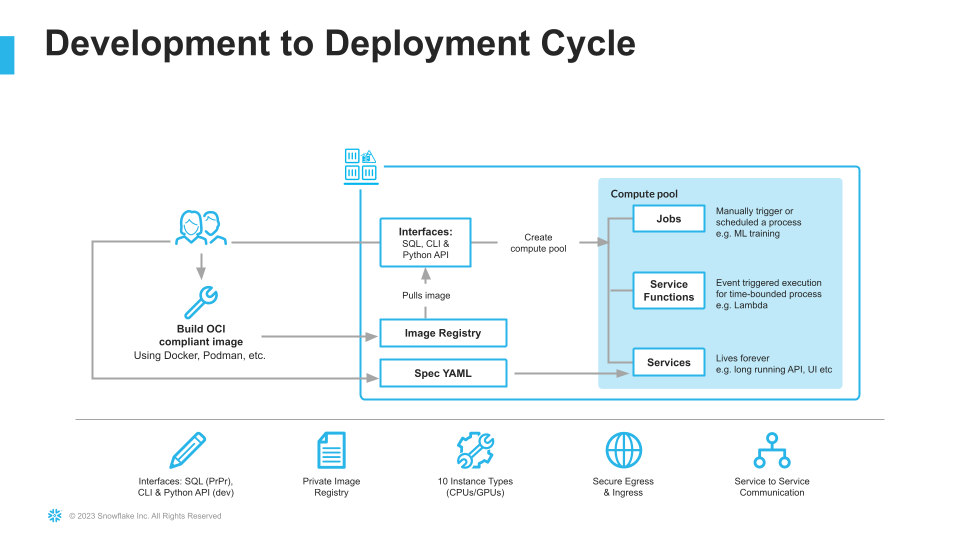
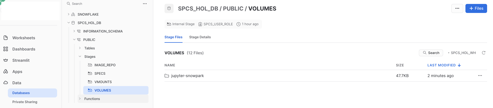
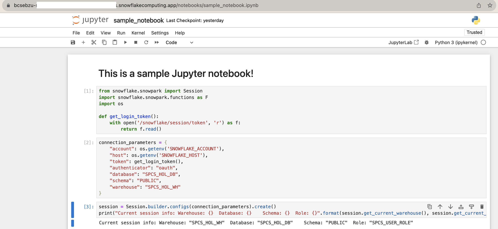

author: Caleb Baechtold
id: intro_to_snowpark_container_services
summary: Through this quickstart guide, you will explore Snowpark Container Services
categories: Getting-Started
environments: web
status: Draft 
feedback link: https://github.com/Snowflake-Labs/sfguides/issues
tags: Getting Started, Containers, Snowpark

# Intro to Snowpark Container Services
<!-- ------------------------ -->
## Overview 
Duration: 3

Through this quickstart guide, you will explore [Snowpark Container Services](https://docs.snowflake.com/en/developer-guide/snowpark-container-services/overview), which are now in Public Preview on AWS. You will learn the basic mechanics of working with Snowpark Container Services and build several introductory services. **Please note: this quickstart assumes some existing knowledge and familiarity with containerization (e.g. Docker) and basic familiarity with container orchestration.**

### What is Snowpark Container Services?


[Snowpark Container Services](https://docs.snowflake.com/en/developer-guide/snowpark-container-services/overview) is a fully managed container offering that allows you to easily deploy, manage, and scale containerized services, jobs, and functions, all within the security and governance boundaries of Snowflake, and requiring zero data movement. As a fully managed service, SPCS comes with Snowflake’s native security, RBAC support, and built-in configuration and operational best-practices.

Snowpark Container Services are fully integrated with both Snowflake features and third-party tools, such as Snowflake Virtual Warehouses and Docker, allowing teams to focus on building data applications, and not building or managing infrastructure. Just like all things Snowflake, this managed service allows you to run and scale your container workloads across regions and clouds without the additional complexity of managing a control plane, worker nodes, and also while having quick and easy access to your Snowflake data.

The introduction of Snowpark Container Services on Snowflake includes the incorporation of new object types and constructs to the Snowflake platform, namely: images, image registry, image repositories, compute pools, specification files, services, and jobs.



For more information on these objects, check out [this article](https://medium.com/snowflake/snowpark-container-services-a-tech-primer-99ff2ca8e741) along with the Snowpark Container Services [documentation](https://docs.snowflake.com/en/developer-guide/snowpark-container-services/overview).

How are customers and partners using Snowpark Container Services today? Containerized services on Snowflake open up the opportunity to host and run long-running services, like front-end web applications, all natively within your Snowflake environment. Customers are now running GPU-enabled machine learning and AI workloads, such as GPU-accelerated model training and open-source Large Language Models (LLMs) as jobs and as service functions, including fine-tuning of these LLMs on your own Snowflake data, without having to move the data to external compute infrastructure. Snowpark Container Services are an excellent path for deploying applications and services that are tightly coupled to the Data Cloud.

Note that while in this quickstart, we will predominantly use the direct SQL commands to interact with Snowpark Container Services and their associated objects, there is also [Python API support](https://docs.snowflake.com/developer-guide/snowflake-python-api/snowflake-python-overview) in Public Preview that you can also use. Refer to the [documentation](https://docs.snowflake.com/developer-guide/snowflake-python-api/snowflake-python-overview) for more info.

### What you will learn 
- The basic mechanics of how Snowpark Container Services works
- How to deploy a long-running service with a UI and use volume mounts to persist changes in the file system
- How to interact with Snowflake warehouses to run SQL queries from inside of a service
- How to deploy a Service Function to perform basic calculations

### Prerequisites

- [Docker Desktop](https://www.docker.com/products/docker-desktop/) installed
- [Python 3.10](https://www.python.org/downloads/) installed
    - Note that you will be creating a Python environment with 3.10 in the **Setup the Local Environment** step
- (Optional) [Git](https://git-scm.com/book/en/v2/Getting-Started-Installing-Git) installed
    >**Download the git repo here: https://github.com/Snowflake-Labs/sfguide-intro-to-snowpark-container-services.git**. You can simply doownload the repo as a .zip if you don't have Git installed locally.
- (Optional) [VSCode](https://code.visualstudio.com/) (recommended) with the [Docker](https://marketplace.visualstudio.com/items?itemName=ms-azuretools.vscode-docker), [Python](https://marketplace.visualstudio.com/items?itemName=ms-python.python), and [Snowflake](https://marketplace.visualstudio.com/items?itemName=snowflake.snowflake-vsc) extensions installed.
- A non-trial Snowflake account in a supported [AWS region](https://docs.snowflake.com/en/developer-guide/snowpark-container-services/overview#available-regions).
- A Snowflake account login with a role that has the `ACCOUNTADMIN` role. If not, you will need to work with your `ACCOUNTADMIN` to perform the initial account setup (e.g. creating the `CONTAINER_USER_ROLE` and granting required privileges, as well as creating the OAuth Security Integration).

### What You’ll Build 
- A hosted Jupyter Notebook service running inside of Snowpark Container Services with a basic notebook
- A Python REST API to perform basic temperature conversions
- A Snowflake Service Function that leverages the REST API

<!--  -->

<!-- ------------------------ -->
## Set up the Snowflake environment
Duration: 5

Run the following SQL commands in [`00_setup.sql`](https://github.com/Snowflake-Labs/sfguide-intro-to-snowpark-container-services/blob/main/00_setup.sql) using the Snowflake VSCode Extension OR in a SQL worksheet to create the role, database, warehouse, and stage that we need to get started:
```SQL
// Create an CONTAINER_USER_ROLE with required privileges
USE ROLE ACCOUNTADMIN;
CREATE ROLE CONTAINER_USER_ROLE;
GRANT CREATE DATABASE ON ACCOUNT TO ROLE CONTAINER_USER_ROLE;
GRANT CREATE WAREHOUSE ON ACCOUNT TO ROLE CONTAINER_USER_ROLE;
GRANT CREATE COMPUTE POOL ON ACCOUNT TO ROLE CONTAINER_USER_ROLE;
GRANT CREATE INTEGRATION ON ACCOUNT TO ROLE CONTAINER_USER_ROLE;
GRANT MONITOR USAGE ON ACCOUNT TO  ROLE  CONTAINER_USER_ROLE;
GRANT BIND SERVICE ENDPOINT ON ACCOUNT TO ROLE CONTAINER_USER_ROLE;
GRANT IMPORTED PRIVILEGES ON DATABASE snowflake TO ROLE CONTAINER_USER_ROLE;

// Grant CONTAINER_USER_ROLE to ACCOUNTADMIN
grant role CONTAINER_USER_ROLE to role ACCOUNTADMIN;

// Create Database, Warehouse, and Image spec stage
USE ROLE CONTAINER_USER_ROLE;
CREATE OR REPLACE DATABASE CONTAINER_HOL_DB;

CREATE OR REPLACE WAREHOUSE CONTAINER_HOL_WH
  WAREHOUSE_SIZE = XSMALL
  AUTO_SUSPEND = 120
  AUTO_RESUME = TRUE;
  
CREATE STAGE IF NOT EXISTS specs
ENCRYPTION = (TYPE='SNOWFLAKE_SSE');

CREATE STAGE IF NOT EXISTS volumes
ENCRYPTION = (TYPE='SNOWFLAKE_SSE')
DIRECTORY = (ENABLE = TRUE);
```

Run the following SQL commands in [`01_snowpark_container_services_setup.sql`](https://github.com/Snowflake-Labs/sfguide-intro-to-snowpark-container-services/blob/main/01_snowpark_container_services_setup.sql) using the Snowflake VSCode Extension OR in a SQL worksheet to create the [OAuth Security Integration](https://docs.snowflake.com/en/user-guide/oauth-custom#create-a-snowflake-oauth-integration), our first [compute pool](https://docs.snowflake.com/en/developer-guide/snowpark-container-services/working-with-compute-pool), and our [image repository](https://docs.snowflake.com/en/developer-guide/snowpark-container-services/working-with-registry-repository)
```SQL
USE ROLE ACCOUNTADMIN;
CREATE SECURITY INTEGRATION IF NOT EXISTS snowservices_ingress_oauth
  TYPE=oauth
  OAUTH_CLIENT=snowservices_ingress
  ENABLED=true;

USE ROLE CONTAINER_USER_ROLE;
CREATE COMPUTE POOL IF NOT EXISTS CONTAINER_HOL_POOL
MIN_NODES = 1
MAX_NODES = 1
INSTANCE_FAMILY = standard_1;

CREATE IMAGE REPOSITORY CONTAINER_HOL_DB.PUBLIC.IMAGE_REPO;

SHOW IMAGE REPOSITORIES IN SCHEMA CONTAINER_HOL_DB.PUBLIC;
```
- The [OAuth security integration](https://docs.snowflake.com/en/user-guide/oauth-custom#create-a-snowflake-oauth-integration) will allow us to login to our UI-based services using our web browser and Snowflake credentials
- The [compute pool](https://docs.snowflake.com/en/developer-guide/snowpark-container-services/working-with-compute-pool) is the set of compute resources on which our services will run
- The [image repository](https://docs.snowflake.com/en/developer-guide/snowpark-container-services/working-with-registry-repository) is the location in Snowflake where we will push our Docker images so that our services can use them

<!-- ------------------------ -->
## Set up your local environment
Duration: 10

### Python Virtual Environment and SnowCLI

- Download and install the miniconda installer from [https://conda.io/miniconda.html](https://conda.io/miniconda.html). (OR, you may use any other Python environment with Python 3.10, for example, [virtualenv](https://virtualenv.pypa.io/en/latest/)).

- Open a new terminal window, navigate to your Git repo, and execute the following commands in the same terminal window:

  1. Create the conda environment.
  ```
  conda env create -f conda_env.yml
  ```

  2. Activate the conda environment.
  ```
  conda activate snowpark-container-services-hol
  ```

  3. Install hatch so we can build the SnowCLI:
  ```
  pip install hatch
  ```

  4. Install SnowCLI:
  ```bash
  # naviage to where you want to download the snowcli GitHub repo, e.g. ~/Downloads
  cd /your/preferred/path
  # clone the git repo
  git clone https://github.com/Snowflake-Labs/snowcli
  # cd into the snowcli repo
  cd snowcli
  # install
  hatch build && pip install .
  # during install you may observe some dependency errors, which should be okay for the time being 
  ```

  5. Configure your Snowflake CLI connection. The Snowflake CLI is designed to make managing UDFs, stored procedures, and other developer centric configuration files easier and more intuitive to manage. Let's create a new connection using:
  ```bash
  snow connection add
  ```
  ```yaml
  # follow the wizard prompts to set the following values:
  name : CONTAINER_hol
  account name: <ORG>-<ACCOUNT-NAME> # e.g. MYORGANIZATION-MYACCOUNT
  username : <user_name>
  password : <password>  
  role: CONTAINER_USER_ROLE  
  warehouse : CONTAINER_HOL_WH
  Database : CONTAINER_HOL_DB  
  Schema : public  
  connection :   
  port : 
  Region :  
  ```
  ```bash
  # test the connection:
  snow connection test --connection "CONTAINER_hol"
  ```

  6. Start docker via opening Docker Desktop.
  
  7. Test that we can successfully login to the image repository we created above, `CONTAINER_HOL_DB.PUBLIC.IMAGE_REPO`. Run the following using Snowflake VSCode Extension or in a SQL worksheet and copy the `repository_url` field, then execute a `docker login` with your registry host and user name from the terminal:
  ```sql
  // Get the image repository URL
  use role CONTAINER_user_role;
  show image repositories in schema CONTAINER_HOL_DB.PUBLIC;
  // COPY the repository_url field, e.g. org-account.registry.snowflakecomputing.com/container_hol_db/public/image_repo
  ```
  ```bash
  # e.g. if repository_url = org-account.registry.snowflakecomputing.com/container_hol_db/public/image_repo, snowflake_registry_hostname = org-account.registry.snowflakecomputing.com
  docker login <snowflake_registry_hostname> -u <user_name>
  > prompt for password
  ```
  **Note the difference between `REPOSITORY_URL` (`org-account.registry.snowflakecomputing.com/container_hol_db/public/image_repo`) and `SNOWFLAKE_REGISTRY_HOSTNAME` (`org-account.registry.snowflakecomputing.com`)**

<!-- ------------------------ -->
## Build, Push, and Run the Jupyter Service
Duration: 45

### Build and Test the Image Locally

The first service we are going to create is a hosted Jupyter notebook service. First, we will build and test the image locally. In the code repo, there is a [`./src/jupyter-snowpark/dockerfile`](https://github.com/Snowflake-Labs/sfguide-intro-to-snowpark-container-services/blob/main/src/jupyter-snowpark/dockerfile) with the following contents:
```python
FROM python:3.9
LABEL author=""

#Install packages & python base
RUN apt-get update && \
    apt-get install -y python3-pip

RUN pip3 install JPype1 jupyter pandas numpy seaborn scipy matplotlib seaborn pyNetLogo SALib "snowflake-snowpark-python[pandas]" snowflake-connector-python

#Create a new user for the notebook server , NB RUN instrcution are only ever executed during the buid
RUN useradd -ms /bin/bash jupyter   

#set the user and working directory 
USER jupyter
WORKDIR /home/jupyter 

#other system settings
EXPOSE 8888   

#launch jupyter notebook server. NOTE!  ENTRYPOINT ( or CMD )intrscutions run each time a container is launched!
ENTRYPOINT ["jupyter", "notebook","--allow-root","--ip=0.0.0.0","--port=8888","--no-browser" , "--NotebookApp.token=''", "--NotebookApp.password=''"] 
```
This is just a normal Dockerfile, where we install some packages, change our working directory, expose a port, and then launch our notebook service. There's nothing unique to Snowpark Container Services here! 

Let's build and test the image locally from the terminal. **Note it is a best practice to tag your local images with a `local_repository` prefix.** Often, users will set this to a combination of first initial and last name, e.g. `jsmith/my-image:latest`. Navigate to your local clone of `.../snowpark-container-services-101-quickstart/src/jupyter-snowpark` and run a Docker build command:
```bash
cd .../snowpark-container-services-101-quickstart/src/jupyter-snowpark
docker build --platform=linux/amd64 -t <local_repository>/python-jupyter-snowpark:latest .
```
Verify the image built successfully:
```bash
docker image list
```
Now that our local image has built, let's validate that it runs successfully. From a terminal run:
```bash
docker run -d -p 8888:8888 <local_repository>/python-jupyter-snowpark:latest
```
Open up a browser and navigate to [localhost:8888/lab](http://localhost:8888/lab) to verify your notebook service is working locally. Once you've verified that the service is working, you can stop the container: `docker stop python-jupyter-snowpark`.

### Tag and Push the Image
Now that we have a local version of our container working, we need to push it to Snowflake so that a Service can access the image. To do this we will create a new tag of the image that points at our image repository in our Snowflake account, and then push said tagged image. From a terminal, run the following:
```bash
  # e.g. if repository_url = org-account.registry.snowflakecomputing.com/container_hol_db/public/image_repo, snowflake_registry_hostname = org-account.registry.snowflakecomputing.com
  docker login <snowflake_registry_hostname> -u <user_name>
  > prompt for password
  docker tag <local_repository>/python-jupyter-snowpark:latest <repository_url>/python-jupyter-snowpark:dev
```
  **Note the difference** between `REPOSITORY_URL` (`org-account.registry.snowflakecomputing.com/container_hol_db/public/image_repo`) and `SNOWFLAKE_REGISTRY_HOSTNAME` (`org-account.registry.snowflakecomputing.com`)

Verify that the new tagged image exists by running:
```bash
docker image list
```
Now, we need to push our image to Snowflake. From the terminal:
```bash
docker push <repository_url>/python-jupyter-snowpark:dev
```
This may take some time, so you can move on to the next step **Configure and Push the Spec YAML** while the image is being pushed. Once the `docker push` command completes, you can verify that the image exists in your Snowflake Image Repository by running the following SQL using the Snowflake VSCode Extension or SQL worksheet:
```sql
USE ROLE CONTAINER_USER_ROLE;
CALL SYSTEM$REGISTRY_LIST_IMAGES('/CONTAINER_HOL_DB/PUBLIC/IMAGE_REPO');
```
You should see your `python-jupyter-snowpark` image listed.

### Configure and Push the Spec YAML
Services in Snowpark Container Services are defined using YAML files. These YAML files configure all of the various parameters, etc. needed to run the containers within your Snowflake account. These YAMLs support a [large number of configurable parameter](https://docs.snowflake.com/en/developer-guide/snowpark-container-services/specification-reference), although we will not reference all of them here. Navigate to your local clone of `.../snowpark-container-services-101-quickstart/src/jupyter-snowpark/jupyter-snowpark.yaml`, which should look like this:
```yaml
spec:
  containers:
    - name: jupyter-snowpark
      image: <repository_hostname>/container_hol_db/public/image_repo/python-jupyter-snowpark:dev
      volumeMounts:
        - name: jupyter-home
          mountPath: /home/jupyter
  endpoints:
    - name: jupyter-snowpark
      port: 8888
      public: true
  volumes:
    - name: jupyter-home
      source: "@volumes/jupyter-snowpark"
      uid: 1000
      gid: 1000
  networkPolicyConfig:
      allowInternetEgress: true

```
**Update the <repository_hostname> for your image** and save the file. Now that the spec file is updated, we need to push it to our Snowflake Stage so that we can reference it next in our `create service` statement. We will use snowcli to push the yaml file. From the terminal:
```bash
cd .../snowpark-container-services-101-quickstart/src/jupyter-snowpark
snow object stage copy ./jupyter-snowpark.yaml @specs --overwrite --connection CONTAINER_hol
```
You can verify that your yaml was pushed successfully by running the following SQL using the Snowflake VSCode Extension or a SQL worksheet and verifying that the file is listed:
```sql
USE ROLE CONTAINER_USER_ROLE;
LS @CONTAINER_HOL_DB.PUBLIC.SPECS;
```

### Create and Test the Service
Once we have successfully pushed our image and our spec YAML, we have all of the components uploaded to Snowflake that we need in order to create our service. There are three components required to create the service: a service name, a compute pool the service will run on, and the spec file that defines the service. Run the following SQL to create our Jupyter service:
```sql
use role CONTAINER_user_role;
create service CONTAINER_HOL_DB.PUBLIC.jupyter_snowpark_service
    in compute pool CONTAINER_HOL_POOL
    from @specs
    spec='jupyter-snowpark.yaml';
```
Run `CALL SYSTEM$GET_SERVICE_STATUS('CONTAINER_HOL_DB.PUBLIC.JUPYTER_SNOWPARK_SERVICE');` to verify that the service is successfully running. These commands are also spelled out in [`02_jupyter_service.sql`](https://github.com/Snowflake-Labs/sfguide-intro-to-snowpark-container-services/blob/main/02_jupyter_service.sql).

Since we specified that the `jupyter-snowpark` endpoint running on port `8888` would be `public: true` in our spec YAML, Snowflake is going to generate a URL for our service that can be used to access the service via our Web Browser. To get the URL, once the service is successfully in a `RUNNING` state, execute the following:
```sql
SHOW ENDPOINTS IN SERVICE JUPYTER_SNOWPARK_SERVICE;
```
Copy the `jupyter-snowpark` endpoint URL, and paste it in your browser. You will be asked to login to Snowflake via your username and password, after which you should successfully see your Jupyter instance running, all inside of Snowflake! **Note, to access the service** the user logging in must have the `CONTAINER_USER_ROLE` AND their default role cannot be `ACCOUNTADMIN`, `SECURITYADMIN`, or `ORGADMIN`.

### Upload and Modify a Jupyter Notebook
Notice that in our spec YAML file we mounted the `@volumes/jupyter-snowpark` internal stage location to our `/home/jupyter` directory inside of our running container. What this means is that we will use our internal stage `@volumes` to persist and store artifacts from our container. If you go check out the `@volumes` stage in Snowsight, you'll see that when we created our `jupyter_snowpark_service`, a folder was created in our stage: `@volumes/jupyter-snowpark`



Now, any file that is uploaded to `@volumes/jupyter-snowpark` will be available inside of our container in the `/home/jupyter` directory, and vice versa. Read more about volume mounts in the [documentation](https://docs.snowflake.com/en/developer-guide/snowpark-container-services/specification-reference#spec-volumes-field-optional). To test this out, let's upload the sample Jupyter notebook that is in our source code repo at `.../snowpark-container-services-101-quickstart/src/jupyter-snowpark/sample_notebook.ipynb`. To do this you can either
- Click on the `jupyter-snowpark` directory in Snowsight, click the blue `+ Files` button and drag/browse to `sample_notebook.ipynb`. Click Upload. Navigate to your Jupyter service UI in your browser, click the refresh arrow and you should now see your notebook available!

OR
- Upload `sample_notebook.ipynb` to `@volumes/jupyter-snowpark` using SnowCLI

OR
- Upload `sample_notebook.ipynb` directly in your Jupyter service  on the home screen by clicking the `Upload` button. If you now navigate back to `@volumes/jupyter-snowpark` in Snowsight, our run an `ls @volumes/jupyter-snowpark` SQL command, you should see  your `sample_notebook.ipynb` file listed. Note you may need to hit the Refresh icon in Snowsight for the file to appear.

What we've done is now created a Jupyter notebook which we can modify in our service, and the changes will be persisted in the file because it is using a stage-backed volume. Let's take a look at the contents of our `sample_notebook.ipynb`. Open up the notebook in your Jupyter service:



We want to pay special attention to the contents of the `get_login_token()` function:
```python
def get_login_token():
    with open('/snowflake/session/token', 'r') as f:
        return f.read()
```
When you start a service or a job, Snowflake provides credentials to the running containers in the form of an oauth token located at `/snowflake/session/token`, enabling your container code to use Snowflake connectors for [connecting to Snowflake](https://docs.snowflake.com/en/developer-guide/snowpark-container-services/additional-considerations-services-jobs#connecting-to-snowflake-from-inside-a-container) and executing SQL (similar to any other code on your computer connecting to Snowflake). The provided credentials authenticate as the service role. Snowflake provides some of the information as environment variables in your containers.

Every object in Snowflake has an owner role. In the case of a service or job, Snowflake has a concept called a service role (this term applies to both services and jobs). The service role determines what capabilities your service is allowed to perform when interacting with Snowflake. This includes executing SQL, accessing stages, and service-to-service networking.

We configure the Snowpark Python Client to connect to our Snowflake account and execute SQL using this oauth token:
```python
connection_parameters = {
    "account": os.getenv('SNOWFLAKE_ACCOUNT'),
    "host": os.getenv('SNOWFLAKE_HOST'),
    "token": get_login_token(),
    "authenticator": "oauth",
    "database": "CONTAINER_HOL_DB",
    "schema": "PUBLIC",
    "warehouse": "CONTAINER_HOL_WH"
}
```

Now we can run a sample query using our Snowpark session!

We've successfully built and deployed our Jupyter Notebook service. Now let's move on to a REST API which we will interact with using a Service Function.
<!-- ------------------------ -->
## Build, Push, and Run the Temperature Conversion REST API Service
Duration: 30

### Build and Test the Image Locally

The next service we are going to create is a simple REST API that takes in Celsius temperatures and converts them to Fahrenheit- a trivial example. First, we will build and test the image locally. In the code repo, there is a [`./src/convert-api/dockerfile`](https://github.com/Snowflake-Labs/sfguide-intro-to-snowpark-container-services/blob/main/src/convert-api/dockerfile) with the following contents:
```python
FROM python:3.11

# Copy the packages file into the build
WORKDIR /app
COPY ./ /app/

# run the install using the packages manifest file
RUN pip install --no-cache-dir -r requirements.txt

# Open port 9090
EXPOSE 9090

# When the container launches run the flask app
ENV FLASK_APP="convert-app.py"
CMD ["flask", "run", "--host=0.0.0.0", "--port=9090"]
```
This is just a normal Dockerfile, where we install some packages, change our working directory, expose a port, and then launch our REST API. Our REST API is defined in [`./src/convert-api/convert-app.py`](https://github.com/Snowflake-Labs/sfguide-intro-to-snowpark-container-services/blob/main/src/convert-api/convert-app.py):
```python
from flask import Flask, request, jsonify

app = Flask(__name__)

# The function to convert Celsius to Fahrenheit
def celsius_to_fahrenheit(celsius):
    return celsius * 9./5 + 32

@app.route('/convert', methods=['POST'])
def convert():
    # Get JSON data from request
    data = request.get_json()

    # Check if the 'data' key exists in the received JSON
    if 'data' not in data:
        return jsonify({'error': 'Missing data key in request'}), 400

    # Extract the 'data' list from the received JSON
    data_list = data['data']

    # Initialize a list to store converted values
    converted_data = []

    # Iterate over each item in 'data_list'
    for item in data_list:
        # Check if the item is a list with at least two elements
        if not isinstance(item, list) or len(item) < 2:
            return jsonify({'error': 'Invalid data format'}), 400
        
        # Extract the Celsius value
        celsius = item[1]
        
        # Convert to Fahrenheit and append to 'converted_data'
        converted_data.append([item[0], celsius_to_fahrenheit(celsius)])

    # Return the converted data as JSON
    return jsonify({'data': converted_data})

if __name__ == '__main__':
    app.run(debug=True)
```

The only thing unique to Snowflake about this container, is that the REST API code expects to receive requests in the format that [Snowflake External Function](https://docs.snowflake.com/en/sql-reference/external-functions-data-format#body-format) calls are packaged, and must also package the response in the expected format so that we can use it as a Service Function. **Note this is only required if you intend to interact with the API via a SQL function**.

Let's build and test the image locally from the terminal. **Note it is a best practice to tag your local images with a `local_repository` prefix. Often, users will set this to a combination of first initial and last name, e.g. `jsmith/my-image:latest`. Navigate to your local clone of `.../snowpark-container-services-101-quickstart/src/convert-api` and run a Docker build command:
```bash
cd .../snowpark-container-services-101-quickstart/src/convert-api
docker build --platform=linux/amd64 -t <local_repository>/convert-api:latest .
```
Verify the image built successfully:
```bash
docker image list
```
Now that our local image has built, let's validate that it runs successfully. From a terminal run:
```bash
docker run -d -p 9090:9090 <local_repository>/convert-api:latest
```
Test our local container endpoint by running the following from a different terminal window:
```bash
curl -X POST -H "Content-Type: application/json" -d '{"data": [[0, 12],[1,19],[2,18],[3,23]]}' http://localhost:9090/convert
```
You should recieve back a JSON object, this will conatin the batch id and then the converted value in Fahrenheit:
```bash
{"data":[[0,53.6],[1,66.2],[2,64.4],[3,73.4]]}
```
Once you've verified that the service is working, you can stop the container: `docker stop convert-api`.

### Tag and Push the Image
Now that we have a local version of our container working, we need to push it to Snowflake so that a Service can access the image. To do this we will create a new tag of the image that points at our image repository in our Snowflake account, and then push said tagged image. From a terminal, run the following:
```bash
  # e.g. if repository_url = org-account.registry.snowflakecomputing.com/container_hol_db/public/image_repo, snowflake_registry_hostname = org-account.registry.snowflakecomputing.com
  docker login <snowflake_registry_hostname> -u <user_name>
  > prompt for password
  docker tag <local_repository>/convert-api:latest <repository_url>/convert-api:dev
```
**Note the difference between `REPOSITORY_URL` (`org-account.registry.snowflakecomputing.com/container_hol_db/public/image_repo`) and `SNOWFLAKE_REGISTRY_HOSTNAME` (`org-account.registry.snowflakecomputing.com`)**

Verify that the new tagged image exists by running:
```bash
docker image list
```
Now, we need to push our image to Snowflake. From the terminal:
```bash
docker push <repository_url>/convert-api:dev
```
This may take some time, so you can move on to the next step **Configure and Push the Spec YAML** while the image is being pushed. Once the `docker push` command completes, you can verify that the image exists in your Snowflake Image Repository by running the following SQL using the Snowflake VSCode Extension or SQL worksheet:
```sql
USE ROLE CONTAINER_USER_ROLE;
CALL SYSTEM$REGISTRY_LIST_IMAGES('/CONTAINER_HOL_DB/PUBLIC/IMAGE_REPO');
```
You should see your `convert-api` image listed.

### Configure and Push the Spec YAML
Services in Snowpark Container Services are defined using YAML files. These YAML files configure all of the various parameters, etc. needed to run the containers within your Snowflake account. These YAMLs support a [large number of configurable parameter](https://docs.snowflake.com/en/developer-guide/snowpark-container-services/specification-reference), although we will not reference all of them here. Navigate to your local clone of `.../snowpark-container-services-101-quickstart/src/convert-api/convert-api.yaml`, which should look like this:
```yaml
spec:
  containers:
    - name: convert-api
      image: <repository_hostname>/container_hol_db/public/image_repo/convert-api:dev
  endpoints:
    - name: convert-api
      port: 9090
      public: true
```
**Update the `<repository_hostname>` for your image** and save the file. Now that the spec file is updated, we need to push it to our Snowflake Stage so that we can reference it next in our `create service` statement. We will use snowcli to push the yaml file. From the terminal:
```bash
cd .../snowpark-container-services-101-quickstart/src/convert-api
snow object stage copy ./convert-api.yaml @specs --overwrite --connection CONTAINER_hol
```
You can verify that your yaml was pushed successfully by running the following SQL using the Snowflake VSCode Extension or a SQL worksheet and verifying that the file is listed:
```sql
USE ROLE CONTAINER_USER_ROLE;
LS @CONTAINER_HOL_DB.PUBLIC.SPECS;
```

### Create and Test the Service
Once we have successfully pushed our image and our spec YAML, we have all of the components uploaded to Snowflake that we need in order to create our service. There are three components required to create the service: a service name, a compute pool the service will run on, and the spec file that defines the service. Run the following SQL to create our Jupyter service:
```sql
use role CONTAINER_user_role;
create service CONTAINER_HOL_DB.PUBLIC.convert_api
    in compute pool CONTAINER_HOL_POOL
    from @specs
    spec='convert-api.yaml';
```
Run `CALL SYSTEM$GET_SERVICE_STATUS('CONTAINER_HOL_DB.PUBLIC.CONVERT-API');` to verify that the service is successfully running. These commands are also listed in [`03_rest_service.sql`](https://github.com/Snowflake-Labs/sfguide-intro-to-snowpark-container-services/blob/main/03_rest_service.sql)

### Create and Test the Service Function
Once the service is up and running, we will create a Service Function that allows us to call our REST API's function via SQL. First, let's create a table with some sample weather data in it:
```sql
USE ROLE CONTAINER_USER_ROLE;
USE DATABASE CONTAINER_HOL_DB;
USE SCHEMA PUBLIC;
USE WAREHOUSE CONTAINER_HOL_WH;

CREATE OR REPLACE TABLE WEATHER (
    DATE DATE,
    LOCATION VARCHAR,
    TEMP_C NUMBER,
    TEMP_F NUMBER
);

INSERT INTO weather (DATE, LOCATION, TEMP_C, TEMP_F) 
    VALUES 
        ('2023-03-21', 'London', 15, NULL),
        ('2023-07-13', 'Manchester', 20, NULL),
        ('2023-05-09', 'Liverpool', 17, NULL),
        ('2023-09-17', 'Cambridge', 19, NULL),
        ('2023-11-02', 'Oxford', 13, NULL),
        ('2023-01-25', 'Birmingham', 11, NULL),
        ('2023-08-30', 'Newcastle', 21, NULL),
        ('2023-06-15', 'Bristol', 16, NULL),
        ('2023-04-07', 'Leeds', 18, NULL),
        ('2023-10-23', 'Southampton', 12, NULL);
```
Now, let's create a function that specifies our `convert-api` service's `convert-api` endpoint:
```sql
CREATE OR REPLACE FUNCTION convert_udf (input float)
RETURNS float
SERVICE=CONVERT_API      //Snowpark Container Service name
ENDPOINT='convert-api'   //The endpoint within the container
MAX_BATCH_ROWS=5         //limit the size of the batch
AS '/convert';           //The API endpoint
```
We can now test our function:
```sql
SELECT convert_udf(12) as conversion_result;
```
And even update our table to populate the `TEMP_F` field using our Service Function:
```sql
UPDATE WEATHER
SET TEMP_F = convert_udf(TEMP_C);

SELECT * FROM WEATHER;
```

### (Optional) Call the Convert Temperature Service Function from our Jupyter Notebook Service
Open up our previously created Jupyter Notebook service and open up our `sample_notebook.ipynb`. Copy and paste the following code into a new cell at the bottom of the notebook:
```python
df = session.table('weather')
df = df.with_column("TEMP_F_SNOWPARK", F.call_udf('convert_udf', df['TEMP_C']))
df.show()
```

Run the cell, and you should see the following output dataframe, with our new column `TEMP_F_SNOWPARK` included:
```python
----------------------------------------------------------------------
|"DATE"      |"LOCATION"   |"TEMP_C"  |"TEMP_F"  |"TEMP_F_SNOWPARK"  |
----------------------------------------------------------------------
|2023-03-21  |London       |15        |59        |59.0               |
|2023-07-13  |Manchester   |20        |68        |68.0               |
|2023-05-09  |Liverpool    |17        |63        |62.6               |
|2023-09-17  |Cambridge    |19        |66        |66.2               |
|2023-11-02  |Oxford       |13        |55        |55.4               |
|2023-01-25  |Birmingham   |11        |52        |51.8               |
|2023-08-30  |Newcastle    |21        |70        |69.8               |
|2023-06-15  |Bristol      |16        |61        |60.8               |
|2023-04-07  |Leeds        |18        |64        |64.4               |
|2023-10-23  |Southampton  |12        |54        |53.6               |
----------------------------------------------------------------------
```

Now, save the Jupyter notebook- when you come back to this service in the future, your new code will be saved because of our stage-backed volume mount!
<!-- ------------------------ -->
## Managing Services with SQL
Duration: 5

There are a number of useful functions we should explore with respect to controlling the service itself from SQL. More information on SQL commands can be found at [Snowpark Container Services SQL Commands](https://docs.snowflake.com/en/sql-reference/commands-snowpark-container-services#service) and [Snowpark Container Services System Functions](https://docs.snowflake.com/en/developer-guide/snowpark-container-services/overview#what-s-next)

1. Get the status of your container using CALL $SYSTEM:

    From a SQl console:

    ```sql
    CALL SYSTEM$GET_SERVICE_STATUS('CONTAINER_HOL_DB.PUBLIC.JUPYTER_SNOWPARK_SERVICE');
    ```

2. Check the status of the logs with :

    From a SQl console:

    ```sql
    CALL SYSTEM$GET_SERVICE_LOGS('CONTAINER_HOL_DB.PUBLIC.JUPYTER_SNOWPARK_SERVICE', '0', 'jupyter-snowpark',10);
    ```

3. Suspend your container using the ALTER SERVICE command

    From a SQL console:

    ```sql
    ALTER SERVICE CONTAINER_HOL_DB.PUBLIC.JUPYTER_SNOWPARK_SERVICE SUSPEND ;
    ```

4. Resume your container using the ALTER SERVICE command

  From a SQL console:

  ```sql
  ALTER SERVICE CONTAINER_HOL_DB.PUBLIC.JUPYTER_SNOWPARK_SERVICE RESUME ;
  ```

<!-- ------------------------ -->
## Stop the Services and Suspend the Compute Pool
Duration: 2

If you no longer need the services and compute pool up and running, we can stop the services and suspend the compute pool so that we don't incur any cost (Snowpark Container Services bill credits/second based on the compute pool's uptime, similar to Virtual Warehouse billing):
```sql
USE ROLE CONTAINER_USER_ROLE;
ALTER COMPUTE POOL CONTAINER_HOL_POOL STOP ALL;
ALTER COMPUTE POOL CONTAINER_HOL_POOL SUSPEND;
```

If you want to clean up and remove ALL of the objects you created during this quickstart, run the following from [`04_cleanup.sql`](https://github.com/Snowflake-Labs/sfguide-intro-to-snowpark-container-services/blob/main/04_teardown.sql):
```sql
USE ROLE CONTAINER_USER_ROLE;
ALTER COMPUTE POOL CONTAINER_HOL_POOL STOP ALL;
ALTER COMPUTE POOL CONTAINER_HOL_POOL SUSPEND;

DROP SERVICE CONTAINER_HOL_DB.PUBLIC.JUPYTER_SNOWPARK_SERVICE;
DROP SERVICE CONTAINER_HOL_DB.PUBLIC.CONVERT_API;
DROP COMPUTE POOL CONTAINER_HOL_POOL;

DROP DATABASE CONTAINER_HOL_DB;
DROP WAREHOUSE CONTAINER_HOL_WH;

USE ROLE ACCOUNTADMIN;
DROP ROLE CONTAINER_USER_ROLE;
```

<!-- ------------------------ -->
## Conclusion
Congratulations, you have successfully completed this quickstart! Through this quickstart, we were able to create and manage long-running services using Snowflake's managed Snowpark Container Services. These services run entirely within your Snowflake account boundary using a managed container orchestration service- keeping your data secure, and making development to deployment incredibly easy.

For more information, check out the resources below:

### Related Resources
- [Snowpark Container Services Documentation](https://docs.snowflake.com/en/developer-guide/snowpark-container-services/overview)
- [Snowpark Container Services SQL Commands](https://docs.snowflake.com/en/sql-reference/commands-snowpark-container-services)
- [Snowpark Container Services - A Tech Primer](https://medium.com/snowflake/snowpark-container-services-a-tech-primer-99ff2ca8e741)
- [Building Advanced ML with Snowpark Container Services - Summit 2023](https://www.youtube.com/watch?v=DelaJBm0UgI)
- [Snowpark Container Services with NVIDIA](https://www.youtube.com/watch?v=u98YTgCelYg)
- [Quickstart GitHub](https://github.com/Snowflake-Labs/sfguide-intro-to-snowpark-container-services)
- [Snowflake Announces Snowpark Container Services](https://www.snowflake.com/blog/snowpark-container-services-deploy-genai-full-stack-apps/)

<!-- ------------------------ -->