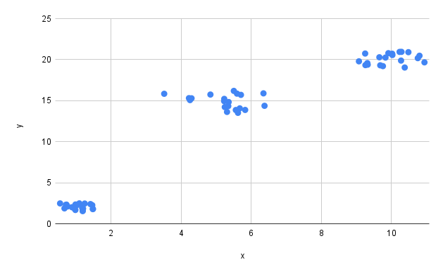

author: Alexey Litouka
id: java_trace_events
summary: An example of emitting trace events from Java, and analyzing them
categories: Getting-Started
environments: web
status: Published 
feedback link: https://github.com/Snowflake-Labs/sfguides/issues
tags: Getting Started, Trace Events, Telemetry, Java 

# Using trace events in Java
<!-- ------------------------ -->
## Overview 
Duration: 1

Have you ever created a stored procedure or a user-defined function in Snowflake? If you have, then you probably want to know whether it’s working well. If something goes wrong with it, you want to know what exactly is not working as expected. In other words, you are concerned about _observability_ of your code. You probably know that you can use a [logger](https://docs.snowflake.com/en/developer-guide/logging-tracing/logging) in your code, and that log records are stored in the [event table](https://docs.snowflake.com/en/developer-guide/logging-tracing/event-table-setting-up). But have you heard about [**trace events**](https://docs.snowflake.com/en/developer-guide/logging-tracing/tracing)? We have recently launched them in preview, and this guide explains how they can help you improve observability.

Unlike log records, trace events are structured. They contain named attributes which can be easily queried with SQL.

Please be aware that our current implementation of trace events has several limitations. Because of these limitations, we recommend using trace events in functions and procedures which are invoked _once per query_ , as in `call my_procedure();` or `select my_function();` (but **NOT** `select my_function(x) from some_table;`)


### Prerequisites
- A Snowflake account;
- Some familiarity with Java;
- Some familiarity with [stored procedures](https://docs.snowflake.com/en/sql-reference/stored-procedures-java) written in Java.

### What You’ll Learn 
- How to emit trace events from Java code;
- How to analyze them by querying an event table.

### What You’ll Need 
- A Snowflake account with an event table.
- If you have a Snowflake account but haven't created an event table yet, you'll need an `ACCOUNTADMIN` role so that you can set up an event table.

### What You’ll Build 
- A stored procedure which performs several operations, collects data about each operation, and records this data as a trace event.
- SQL queries which you can use to find those trace events in the event table, and aggregate them.

## Creating and seeding a database
Duration: 2

In this quickstart, we'll use a stored procedure that reads data from an input table, performs some computations, and saves results of those computations in an output table. So, let's create those tables and populate the input table with data:

- Creating a database:
```sql
create database java_trace_events_quickstart;
use database java_trace_events_quickstart;
```

- Creating an input table:
```sql
create table points(x float, y float);
```

- Creating an output table:
```sql
create table centroids(cluster_id integer, x float, y float);
```

- Populating the input table with data:
```sql
insert into points (x, y) values
(1.213553154, 2.235544541),
(0.8118554179, 1.6821308),
(1.399174966, 2.053757933),
(0.9512621773, 2.015222401),
(0.5887461028, 1.891685846),
(0.6577208216, 2.320720871),
(1.138717596, 1.556020953),
(1.275741404, 1.855811669),
(0.9634354253, 2.33982825),
(1.390448021, 1.99901768),
(0.9601962266, 1.916674695),
(1.466388729, 1.783033344),
(1.287095773, 1.505214384),
(0.5224690381, 1.535836808),
(1.004467712, 1.689165137),
(0.6189839587, 1.98350093),
(0.5519874087, 2.258298169),
(0.7359490453, 1.69681398),
(1.132060711, 2.395814026),
(0.7445552652, 1.500579867),
(9.723189864, 20.0014149),
(10.9206379, 19.94554546),
(9.469893731, 19.13094579),
(10.65544056, 19.53934379),
(10.19535497, 19.77086368),
(9.495595388, 19.13485713),
(9.382500149, 19.30473076),
(9.627784041, 19.04113154),
(10.02231036, 20.53784382),
(9.347483563, 20.85932972),
(9.967839449, 19.47796103),
(9.122536461, 20.35109391),
(9.922944802, 20.72190232),
(9.854270717, 20.64568569),
(10.08886809, 19.869337),
(9.995250676, 20.58962103),
(10.91948309, 19.87501052),
(10.95252272, 19.72416871),
(10.90777625, 20.84325985),
(10.41457795, 20.64964595),
(5.398656265, 16.23788224),
(5.586711317, 15.51057788),
(5.70908083, 15.51383295),
(4.820765545, 14.67189127),
(4.157480672, 13.58119069),
(5.365974039, 15.91155853),
(3.839719712, 16.36947194),
(5.249863368, 15.41913563),
(5.689566, 16.21414046),
(3.717206952, 14.65194383),
(4.256715825, 16.2572023),
(4.885755607, 15.57848386),
(6.402890523, 14.25692963),
(4.096131121, 16.28270187),
(4.22328614, 15.35017802),
(6.357887622, 13.7592523),
(4.036586515, 13.60022993),
(5.54888424, 14.16924161),
(4.230579224, 14.01085911),
(4.328285372, 14.1043345),
(null, 1),
(2, 'NaN');
```

### What's in the input data



These are coordinates of points on a plane. There are 3 clusters of points, centered around coordinates `(1, 2)`; `(10, 20)`; and `(5, 15)`. The stored procedure we'll create in the next step will try to find these centers by invoking the [K-Means clustering](https://towardsdatascience.com/understanding-k-means-clustering-in-machine-learning-6a6e67336aa1) algorithm.

### What is K-Means clustering
K-means clustering is an algorithm that finds groups of points in a dataset which are close to each other. It returns coordinates of “centers” of those groups - they are called “centroids”. It is an iterative process: the algorithm places each centroid at a random point, and gradually moves it. Eventually the algorithm reaches the state when centroids don’t move. It means that the algorithm has converged, and coordinates of centroids can be returned to a caller.

The K-means algorithm is fast, but the caller has to know the number of clusters in advance.

## Setting up an event table
Duration: 1

Trace events are stored in an event table. So, let's make sure that you have one. Please run the following commands:

- To check if you have _any_ event table:
```sql
show event tables;
```

- If the previous command returns multiple rows, you'll need to check which of the event tables is active:
```sql
show parameters like 'EVENT_TABLE' in account;
```

- If `show event tables` doesn't return any rows, you'll need to create a new event table and make it active:

```sql
use role ACCOUNTADMIN;
create or replace event table events;
alter account set event_table = 'java_trace_events_quickstart.public.events';
```

- Run this query again to confirm that the event table has been created and activated:

```sql
show parameters like 'EVENT_TABLE' in account;
```

## Creating a stored procedure
Duration: 2

Now, let's create our example stored procedure. It is quite long, because it does several things:
- Reads data from an input table;
- Filters out rows with missing values;
- Performs [K-Means clustering](https://towardsdatascience.com/understanding-k-means-clustering-in-machine-learning-6a6e67336aa1) of valid rows;
- Saves the output of the clustering algorithm to the output table.

At each step, the procedure emits a trace event containing information about that step.

### Stored procedure code
Please run the following query. It will create a procedure named `KMEANS`:

```sql
create or replace procedure kmeans(
  inputTable string, xColumn string, yColumn string,
  outputTable string, clusterIdColumn string, outputXColumn string, outputYColumn string,
  numClusters int, maxIterations int)
returns string
language java
packages=('com.snowflake:snowpark:latest', 'com.snowflake:telemetry:latest')
handler='KMeansClusterer.run'
as $$
import com.snowflake.snowpark_java.*;
import com.snowflake.snowpark_java.types.DataTypes;
import com.snowflake.snowpark_java.types.StructField;
import com.snowflake.snowpark_java.types.StructType;
import com.snowflake.telemetry.Telemetry;
import io.opentelemetry.api.common.AttributeKey;
import io.opentelemetry.api.common.Attributes;
import io.opentelemetry.api.common.AttributesBuilder;
import java.util.*;
import org.slf4j.Logger;
import org.slf4j.LoggerFactory;

/** Performs K-Means clustering of points in 2-dimensional space. */
class KMeansClusterer {
  private static Logger logger = LoggerFactory.getLogger(KMeansClusterer.class);

  private static String TRACE_PREFIX = "com.mycompany.kmeans.";
  private static String RUNTIME_ATTR_NAME = "runtime_millis";

  static class Point {
    Point(double x, double y) {
      this.x = x;
      this.y = y;
    }

    public double getX() { return x; }
    
    public void setX(double newValue) { this.x = newValue; }

    public double getY() { return y; }

    public void setY(double newValue) { this.y = newValue; }

    private double x;
    private double y;
  }

  KMeansClusterer(
      Session session,
      String inputTableName,
      String xColumnName,
      String yColumnName,
      String outputTableName,
      String outputClusterIdColumnName,
      String outputXColumnName,
      String outputYColumnName,
      int numClusters,
      int maxIterations) {
    this.numClusters = numClusters;
    this.maxIterations = maxIterations;
    this.session = session;
    this.inputTableName = inputTableName;
    this.xColumnName = xColumnName;
    this.yColumnName = yColumnName;
    this.outputTableName = outputTableName;
    this.outputClusterIdColumnName = outputClusterIdColumnName;
    this.outputXColumnName = outputXColumnName;
    this.outputYColumnName = outputYColumnName;
  }

  /**
   * Performs K-Means clustering of points stored in the given input table. Stores coordinates of
   * clusters' centroids in the given output table.
   *
   * @param session Snowpark session
   * @param inputTable Name of the input table
   * @param xColumn Name of the column in the input table that contains X coordinates of points
   * @param yColumn Name of the column in the input table that contains Y coordinates of points
   * @param outputTableName Name of the output table
   * @param outputClusterIdColumnName Name of the column in the output table that will be populated
   *     with cluster ids. Cluster ids are integer numbers.
   * @param outputXColumnName Name of the column in the output table that will be populated with X
   *     coordinates of clusters' centroids.
   * @param outputYColumnName Name of the column in the output table that will be populated with Y
   *     coordinates of clusters' centroids.
   * @param numClusters Number of clusters.
   * @param maxIterations The limit on the number of iterations.
   * @return "SUCCESS" if the algorithm converged, an error message otherwise.
   */
  public static String run(
      Session session,
      String inputTable,
      String xColumn,
      String yColumn,
      String outputTableName,
      String outputClusterIdColumnName,
      String outputXColumnName,
      String outputYColumnName,
      int numClusters,
      int maxIterations) {
    long startTime = System.currentTimeMillis();
    AttributesBuilder attributesBuilder = Attributes.builder();
    String result;
    boolean ranClustering = false;

    Telemetry.setSpanAttribute(TRACE_PREFIX + "input.num_clusters", numClusters);
    Telemetry.setSpanAttribute(TRACE_PREFIX + "input.max_iterations", maxIterations);

    if (numClusters != 0) {
      KMeansClusterer clusterer =
          new KMeansClusterer(
              session,
              inputTable,
              xColumn,
              yColumn,
              outputTableName,
              outputClusterIdColumnName,
              outputXColumnName,
              outputYColumnName,
              numClusters,
              maxIterations);

      Row[] rows = clusterer.readInputData();

      if (rows.length >= numClusters) {
        ranClustering = true;
        clusterer.initializeCentroids(rows);
        boolean converged = clusterer.computeClusters(rows);
        attributesBuilder.put(AttributeKey.longKey(TRACE_PREFIX + "rows.processed"), rows.length);
        if (converged) {
          clusterer.saveCentroids();
          result = "SUCCESS";
        } else {
          result = "Failed to converge";
        }
      } else {
        result =
            String.format(
                "Number of rows (%d) is less than the requested number of clusters (%d)",
                rows.length, numClusters);
      }
    } else {
      result = "The number of clusters should be greater than 0";
    }

    long endTime = System.currentTimeMillis();
    attributesBuilder.put(AttributeKey.booleanKey(TRACE_PREFIX + "ran_clustering"), ranClustering);
    attributesBuilder.put(
        AttributeKey.longKey(TRACE_PREFIX + RUNTIME_ATTR_NAME), endTime - startTime);
    attributesBuilder.put(AttributeKey.stringKey(TRACE_PREFIX + "return_value"), result);
    Telemetry.addEvent(TRACE_PREFIX + "summary", attributesBuilder.build());
    logger.info(String.format("Return value: %s", result));
    return result;
  }

  /** Computes a distance between two points. */
  public static double computeDistance(double x1, double y1, double x2, double y2) {
    double xDiff = x1 - x2;
    double yDiff = y1 - y2;
    return Math.sqrt(xDiff * xDiff + yDiff * yDiff);
  }

  private Row[] readInputData() {
    long startTime = System.currentTimeMillis();
    AttributesBuilder attributesBuilder = Attributes.builder();
    DataFrame rawInput = session.table(inputTableName);
    long totalNumRows = rawInput.count();

    Row[] result =
        rawInput
            .filter(
                Functions.col(xColumnName)
                    .is_not_null()
                    .and(Functions.not(Functions.col(xColumnName).equal_nan()))
                    .and(Functions.col(yColumnName).is_not_null())
                    .and(Functions.not(Functions.col(yColumnName).equal_nan())))
            .collect();

    long endTime = System.currentTimeMillis();
    long numGoodRows = result.length;
    long numFilteredOutRows = totalNumRows - numGoodRows;
    attributesBuilder.put(AttributeKey.longKey(TRACE_PREFIX + "rows.total"), totalNumRows);
    attributesBuilder.put(
        AttributeKey.longKey(TRACE_PREFIX + "rows.filtered_out"), numFilteredOutRows);
    attributesBuilder.put(AttributeKey.longKey(TRACE_PREFIX + "rows.good"), numGoodRows);
    attributesBuilder.put(
        AttributeKey.longKey(TRACE_PREFIX + RUNTIME_ATTR_NAME), endTime - startTime);
    Telemetry.addEvent(TRACE_PREFIX + "io.read", attributesBuilder.build());
    logger.info(
        String.format(
            "Read %d rows from input; filtered out %d of them. The remaining %d are good",
            totalNumRows, numFilteredOutRows, numGoodRows));
    return result;
  }

  private boolean computeClusters(Row[] rows) {
    long startTime = System.currentTimeMillis();
    AttributesBuilder attributesBuilder = Attributes.builder();
    int numIterations = 0;
    boolean centroidsMoved = true;

    while (centroidsMoved && numIterations < maxIterations) {
      computedClusters = new HashMap<>();
      for (Row row : rows) {
        double x = row.getDouble(0);
        double y = row.getDouble(1);

        double minDistance = Double.MAX_VALUE;
        Integer clusterWithMinDistance = createClusterId(0);
        for (int i = 0; i < numClusters; i++) {
          Integer clusterId = createClusterId(i);
          Point centroid = centroids.get(clusterId);
          double distance = computeDistance(x, y, centroid.getX(), centroid.getY());
          if (distance < minDistance) {
            minDistance = distance;
            clusterWithMinDistance = clusterId;
          }
        }
        if (!computedClusters.containsKey(clusterWithMinDistance)) {
          computedClusters.put(clusterWithMinDistance, new ArrayList<>());
        }
        computedClusters.get(clusterWithMinDistance).add(new Point(x, y));
      }

      centroidsMoved = false;
      for (Integer clusterId : computedClusters.keySet()) {
        double sumX = 0.0;
        double sumY = 0.0;
        int numPoints = 0;
        Point centroid = centroids.get(clusterId);
        for (Point pt : computedClusters.get(clusterId)) {
          sumX += pt.getX();
          sumY += pt.getY();
          numPoints++;
        }
        if (numPoints != 0) {
          double meanX = sumX / numPoints;
          double meanY = sumY / numPoints;
          double distance = computeDistance(centroid.getX(), centroid.getY(), meanX, meanY);
          logger.info(
              String.format(
                  "Iteration %d, cluster id %d, distance: %f", numIterations, clusterId, distance));
          if (distance > 0) {
            logger.info(
                String.format(
                    "Iteration %d: Moving centroid %d from (%f, %f) to (%f, %f)",
                    numIterations, clusterId, centroid.getX(), centroid.getY(), meanX, meanY));
            centroidsMoved = true;
            centroid.setX(meanX);
            centroid.setY(meanY);
          } else {
            logger.info(
                String.format(
                    "Iteration %d: Not moving centroid %d from (%f, %f)",
                    numIterations, clusterId, centroid.getX(), centroid.getY()));
          }
        } else {
          logger.info(
              String.format("Iteration %d: No points in cluster %d", numIterations, clusterId));
        }
      }
      numIterations++;
    }

    boolean converged = (numIterations < maxIterations);
    long endTime = System.currentTimeMillis();
    attributesBuilder.put(
        AttributeKey.longKey(TRACE_PREFIX + RUNTIME_ATTR_NAME), endTime - startTime);
    attributesBuilder.put(AttributeKey.longKey(TRACE_PREFIX + "num_iterations"), numIterations);
    attributesBuilder.put(
        AttributeKey.longKey(TRACE_PREFIX + "input.max_iterations"), maxIterations);
    attributesBuilder.put(AttributeKey.booleanKey(TRACE_PREFIX + "converged"), converged);
    Telemetry.addEvent(TRACE_PREFIX + "clustering", attributesBuilder.build());

    return converged;
  }

  private void saveCentroids() {
    long startTime = System.currentTimeMillis();
    Row[] rows = new Row[centroids.size()];
    int i = 0;

    for (Map.Entry<Integer, Point> centroid : centroids.entrySet()) {
      rows[i] =
          Row.create(centroid.getKey(), centroid.getValue().getX(), centroid.getValue().getY());
      i++;
    }

    StructType schema =
        StructType.create(
            new StructField(outputClusterIdColumnName, DataTypes.IntegerType),
            new StructField(outputXColumnName, DataTypes.DoubleType),
            new StructField(outputYColumnName, DataTypes.DoubleType));

    DataFrame df = session.createDataFrame(rows, schema);
    df.write().saveAsTable(outputTableName);

    long endTime = System.currentTimeMillis();
    AttributesBuilder attributesBuilder = Attributes.builder();
    attributesBuilder.put(
        AttributeKey.longKey(TRACE_PREFIX + RUNTIME_ATTR_NAME), endTime - startTime);
    Telemetry.addEvent(TRACE_PREFIX + "io.write", attributesBuilder.build());
  }

  private void initializeCentroids(Row[] rows) {
    Random rand = new Random(System.currentTimeMillis());
    Set<Integer> previousIndexes = new HashSet<>();
    for (int i = 0; i < numClusters; i++) {
      int index;
      do {
        index = rand.nextInt(rows.length);
      } while (previousIndexes.contains(index));
      previousIndexes.add(index);

      Point newCentroid = new Point(rows[index].getDouble(0), rows[index].getDouble(1));
      Integer clusterId = createClusterId(i);
      centroids.put(clusterId, newCentroid);
      logger.info(
          String.format(
              "Centroid %d initialized at (%f, %f)",
              clusterId, newCentroid.getX(), newCentroid.getY()));
    }
  }

  private static Integer createClusterId(int clusterIndex) {
    return clusterIndex + 1;
  }

  private Session session;
  private String inputTableName;
  private String xColumnName;
  private String yColumnName;
  private String outputTableName;
  private String outputClusterIdColumnName;
  private String outputXColumnName;
  private String outputYColumnName;
  private Map<Integer, Point> centroids = new HashMap<>();
  Map<Integer, List<Point>> computedClusters;
  private int numClusters;
  private int maxIterations;
}
$$;
```

## Taking a closer look at the code
Duration: 5

Let's take a closer look at the code of our stored procedure, and find parts required for emitting trace events:

### The Telemetry package

The procedure uses the `com.snowflake:telemetry` package:

```
packages=('com.snowflake:snowpark:latest', 'com.snowflake:telemetry:latest')
```

### Imports of telemetry APIs

The procedure imports classes defined in Snowflake's telemetry package and in [OpenTelemetry Java API](https://github.com/open-telemetry/opentelemetry-java):

```java
import com.snowflake.telemetry.Telemetry;
import io.opentelemetry.api.common.AttributeKey;
import io.opentelemetry.api.common.Attributes;
import io.opentelemetry.api.common.AttributesBuilder;
```

### Code that emits trace events

Try searching for calls to the `Telemetry.addEvent` method - you'll find quite a few of them.
Each event has _attributes_, which are recorded with the `AttributesBuilder` class.

```java
// Adding attributes to an event
AttributesBuilder attributesBuilder = Attributes.builder();
attributesBuilder.put(AttributeKey.booleanKey(TRACE_PREFIX + "ran_clustering"), ranClustering);
attributesBuilder.put(
        AttributeKey.longKey(TRACE_PREFIX + RUNTIME_ATTR_NAME), endTime - startTime);
attributesBuilder.put(AttributeKey.stringKey(TRACE_PREFIX + "return_value"), result);

// Emitting an event
Telemetry.addEvent(TRACE_PREFIX + "summary", attributesBuilder.build());
```

## Calling the stored procedure
Duration: 2

### Enabling logging and tracing
First, let's make sure that logging and tracing are enabled:

```sql
alter session set log_level='INFO';
alter session set trace_level='ALWAYS';
```

### Calling the procedure

Now, let's call our stored procedure. If you followed instructions in the "Creating and seeding a database" step precisely, and didn't change names of tables and columns, then the following command should work:

```sql
call kmeans('points', 'x', 'y', 'centroids', 'cluster_id', 'x', 'y', 3, 100);
```

If everything worked well, it should return the string `SUCCESS`. Try changing the last parameter to `1` and calling the procedure again - it will return `Failed to converge`.

### Examining its output

Every time when the `kmeans` procedure runs successfully, it inserts rows into the `centroids` table. The number of rows is equal to the number of clusters (`3` in the example above). Our input table contains 3 clusters centered around points with coordinates `(1, 2)`; `(10, 20)`; and `(5, 15)`. If everything works well, you should see values similar to those in the `centroids` table. However, the algorithm isn't always able to find an optimal solution. If you see values which are substantially different, you can `truncate table centroids` and call the `kmeans` procedure again.

## Analyzing trace events
Duration: 10

Trace events are structured records. Because of this, you can easily aggregate data collected from multiple invocations of your code, and answer questions such as:

- What is the average / median / p95 runtime of each part of my code?
- How many rows have been processed by my code?
- What is the failure ratio, and how are failed invocations different from successful ones?

Code in the following examples includes SQL queries run against events emitted by the `KMeansClusterer` class in the preceding examples. Please note that **it takes a few minutes for trace events to be ingested into an event table**. So, if you called the `kmeans` procedure a few seconds ago, please wait a few minutes before proceeding to the next step.

The following code sets the name of the event table. This variable is required for the queries below.

```sql
set event_table_name='events';
```

### Average, median, p90 / 95 / 99 runtime of each function

```sql
with raw_data as (  
select
  record['name'] as fn_name,
  record_attributes['com.mycompany.kmeans.runtime_millis'] as runtime_millis
from
  identifier($event_table_name)
where
  resource_attributes['snow.executable.name'] like 'KMEANS%'
  and record_type='SPAN_EVENT'
  and runtime_millis is not null
)
select
  fn_name,
  avg(runtime_millis) as runtime_average,
  percentile_disc(0.50) within group (order by runtime_millis) as runtime_median,
  percentile_disc(0.90) within group (order by runtime_millis) as runtime_p90,
  percentile_disc(0.95) within group (order by runtime_millis) as runtime_p95,
  percentile_disc(0.99) within group (order by runtime_millis) as runtime_p99
from
  raw_data
group by
  fn_name
order by
  runtime_p99 desc; 
```

### How many times the algorithm did and did not converge

```sql
select
  record_attributes['com.mycompany.kmeans.converged'] as is_converged,
  count(*) as num_invocations
from
  identifier($event_table_name)
where
  resource_attributes['snow.executable.name'] like 'KMEANS%'
  and record_type='SPAN_EVENT'
  and record['name'] = 'com.mycompany.kmeans.clustering'
group by is_converged;
```

### Percentage of invocations where the algorithm was able to converge

```sql
with tmp1 as (
  select
    case when record_attributes['com.mycompany.kmeans.converged'] = true then 1 else 0 end as one_converged,
    1 as one_invocation
  from
    identifier($event_table_name)
  where
    resource_attributes['snow.executable.name'] like 'KMEANS%'
    and record_type='SPAN_EVENT'
    and record['name'] = 'com.mycompany.kmeans.clustering'
),
tmp2 as (
  select
    sum(one_converged) as num_converged,
    sum(one_invocation) as num_invocations
  from
    tmp1
)
select
  num_converged / num_invocations * 100.0 as percent_converged
from tmp2;
```

### Average number of iterations required for convergence

```sql
select
  avg(record_attributes['com.mycompany.kmeans.num_iterations']) as average_iterations
from
  identifier($event_table_name)
where
  resource_attributes['snow.executable.name'] like 'KMEANS%'
  and record_type='SPAN_EVENT'
  and record['name'] = 'com.mycompany.kmeans.clustering'
  and record_attributes['com.mycompany.kmeans.converged'] = true;

```

### Total number of rows processed by all invocations of the algorithm

```sql
select
  sum(record_attributes['com.mycompany.kmeans.rows.processed']) as total_processed_rows
from
  identifier($event_table_name)
where
  resource_attributes['snow.executable.name'] like 'KMEANS%'
  and record_type='SPAN_EVENT'
  and record['name'] = 'com.mycompany.kmeans.summary';

```

### Average percentage of filtered out rows

```sql
select
  avg(record_attributes['com.mycompany.kmeans.rows.filtered_out'] / record_attributes['com.mycompany.kmeans.rows.total'] * 100.0) as avg_percent_of_filtered_out_rows
from
  identifier($event_table_name)
where
  resource_attributes['snow.executable.name'] like 'KMEANS%'
  and record_type='SPAN_EVENT'
  and record['name'] = 'com.mycompany.kmeans.io.read';
```

## What can be recorded as a trace event
Duration: 5

### Time taken to execute each part of a stored procedure
If your procedure performs several lengthy operations, you may want to record the amount of time taken by each operation. Later on, you can aggregate this information with a SQL query. 

For example, you can compute the average / median / p95 time taken by each operation. To do that, you can emit a trace event after each operation, recording the duration of that operation in an attribute of the event.

In our example, the `KMeansClusterer` class records the run time of each part of its workflow. It also records the total run time of its main function (`KMeansClusterer.run`).

```java
class KMeansClusterer {
  public static String run(/* parameters omitted */) {
    long startTime = System.currentTimeMillis();
    AttributesBuilder attributesBuilder = Attributes.builder();
    
    // Creating an instance of KMeansClusterer and calling its methods.

    long endTime = System.currentTimeMillis();    
    attributesBuilder.put(AttributeKey.longKey("com.mycompany.kmeans.runtime_millis"), endTime - startTime);    
    Telemetry.addEvent("com.mycompany.kmeans.stats", attributesBuilder.build());    
  }

  private Row[] readInputData() {
    long startTime = System.currentTimeMillis();
    AttributesBuilder attributesBuilder = Attributes.builder();
    
    // Reading data from a table and filtering out rows with missing values.
    
    attributesBuilder.put(AttributeKey.longKey("com.mycompany.kmeans.runtime_millis"), endTime - startTime);
    Telemetry.addEvent("com.mycompany.kmeans.io.read", attributesBuilder.build());    
  }

  private long computeClusters(Row[] rows) {
    long startTime = System.currentTimeMillis();
    AttributesBuilder attributesBuilder = Attributes.builder();
    
    // Computing clusters.

    long endTime = System.currentTimeMillis();
    attributesBuilder.put(AttributeKey.longKey("com.mycompany.kmeans.runtime_millis"), endTime - startTime);    
    Telemetry.addEvent("com.mycompany.kmeans.clustering", attributesBuilder.build());
  }  
}
```

### Intermediate results of a computation

If your stored procedure loads raw data and performs a sequence of transformations, then you may want to record some characteristics of the data after each transformation.

In our example, the `KMeansClusterer` class methods record the following data points:

- The `readInputData` method records the number of rows read from source and number of rows with missing values.
- The `computeClusters` method records the number of iterations performed by the clustering algorithm, the limit on the number of iterations, and a boolean value that indicates whether the algorithm converged before reaching that limit.

```java
class KMeansClusterer {  
  private Row[] readInputData() {
    long startTime = System.currentTimeMillis();
    AttributesBuilder attributesBuilder = Attributes.builder();
    DataFrame rawInput = session.table(inputTableName);
    long totalNumRows = rawInput.count();
    attributesBuilder.put(AttributeKey.longKey("com.mycompany.kmeans.rows.total"), totalNumRows);
    
    Row[] result =
        rawInput
            .filter(
                Functions.col(xColumnName)
                    .is_not_null()
                    .and(Functions.not(Functions.col(xColumnName).equal_nan()))
                    .and(Functions.col(yColumnName).is_not_null())
                    .and(Functions.not(Functions.col(yColumnName).equal_nan())))
            .collect();

    long endTime = System.currentTimeMillis();
    long numGoodRows = result.length;
    long numFilteredOutRows = totalNumRows - numGoodRows;
    
    attributesBuilder.put(AttributeKey.longKey("com.mycompany.kmeans.rows.filtered_out"), numFilteredOutRows);
    attributesBuilder.put(AttributeKey.longKey("com.mycompany.kmeans.runtime_millis"), endTime - startTime);
    Telemetry.addEvent("com.mycompany.kmeans.io.read", attributesBuilder.build());    
    return result;
  }

  private long computeClusters(Row[] rows) {
    long startTime = System.currentTimeMillis();
    AttributesBuilder attributesBuilder = Attributes.builder();
    
    // Computing clusters.

    long endTime = System.currentTimeMillis();
    attributesBuilder.put(AttributeKey.longKey("com.mycompany.kmeans.runtime_millis"), endTime - startTime);
    attributesBuilder.put(AttributeKey.longKey("numIterations"), numIterations);
    attributesBuilder.put(AttributeKey.longKey("maxIterations"), maxIterations);
    attributesBuilder.put(AttributeKey.booleanKey("converged"), (numIterations < maxIterations));
    Telemetry.addEvent("com.mycompany.kmeans.clustering", attributesBuilder.build());
  }  
}
```

### A summary of a stored procedure execution
At the end of a stored procedure, you may want to emit a trace event which contains attributes such as the number of rows processed, time taken to execute the whole procedure, and so on.

For example, the `KMeansClusterer` class records the following data points in its run function:

- Number of processed rows.
- Whether the clustering algorithm ran (it won’t run if the input is invalid).
- The value returned by the stored procedure to the caller.

```java
class KMeansClusterer {
  public static String run(/* parameters omitted */) {
    long startTime = System.currentTimeMillis();
    AttributesBuilder attributesBuilder = Attributes.builder();
    
    // Reading input

    attributesBuilder.put(AttributeKey.longKey("com.mycompany.kmeans.rows.processed"), rows.length);

    // Calling the clustering function

    long endTime = System.currentTimeMillis();
    attributesBuilder.put(AttributeKey.longKey("runtimeMillis"), endTime - startTime);
    attributesBuilder.put(AttributeKey.booleanKey("com.mycompany.kmeans.ran_clustering"), ranClustering);    
    attributesBuilder.put(AttributeKey.stringKey("com.mycompany.kmeans.return_value"), result);
    Telemetry.addEvent("com.mycompany.kmeans.stats", attributesBuilder.build());    
  } 
}
```

## What can be recorded as a span attribute
Duration: 1

Trace events are grouped into _spans_. However, the current version of the telemetry API does not allow you to create your own spans, or to control lifecycle of spans automatically created for you.

All events are added to a span that is created automatically before your code is invoked. If your query invokes a function or a procedure only once (as in `call my_stored_procedure();` or `select my_function();`), then we’ll create only one span, and all events emitted by `my_stored_procedure` or `my_function` will be added to that span. However, if your query invokes a function for each row (as in `select my_function(x) from some_table;`), then there will be multiple spans. If `my_function` emits trace events, then each event will be added to _one_ of those spans. When the number of events in a span reaches the limit, new events will be discarded (in Java), or old events will be deleted (in Python). So, it’s impossible to tell which events will be recorded and how they will be distributed across spans. This is the main reason why we don’t recommend emitting trace events from functions which are invoked once per row.

Despite these limitations, you can still find span attributes useful for recording information which doesn't change while your query is running. In our example, the `KMeansClusterer.run` method records its arguments as span attributes:

```java
Telemetry.setSpanAttribute(TRACE_PREFIX + "input.num_clusters", numClusters);
Telemetry.setSpanAttribute(TRACE_PREFIX + "input.max_iterations", maxIterations);
```

## Conclusion
Duration: 1

Trace events allow you to record structured information about what’s happening in your code while it is running in Snowflake. You can easily analyze trace events by running SQL queries against the event table. We recommend using trace events in stored procedures or functions which are invoked only once per SQL query.

### What we've covered
- Creating a Java stored procedure that emits trace events;
- Analyzing trace events emitted by that stored procedure;
- What trace events and span attributes can be used for;

### Related documentation
- [Setting up an event table](https://docs.snowflake.com/en/developer-guide/logging-tracing/event-table-setting-up);
- [Trace events for functions and procedures](https://docs.snowflake.com/en/developer-guide/logging-tracing/tracing).