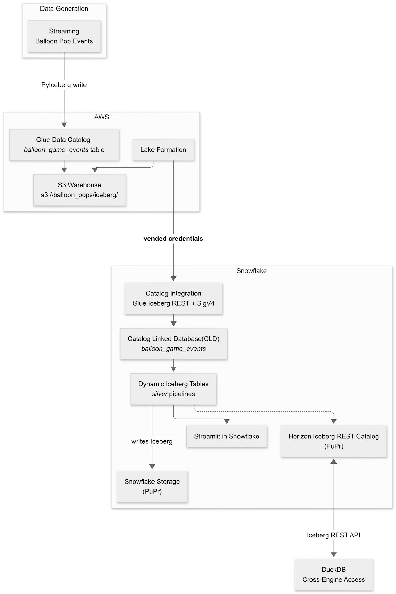
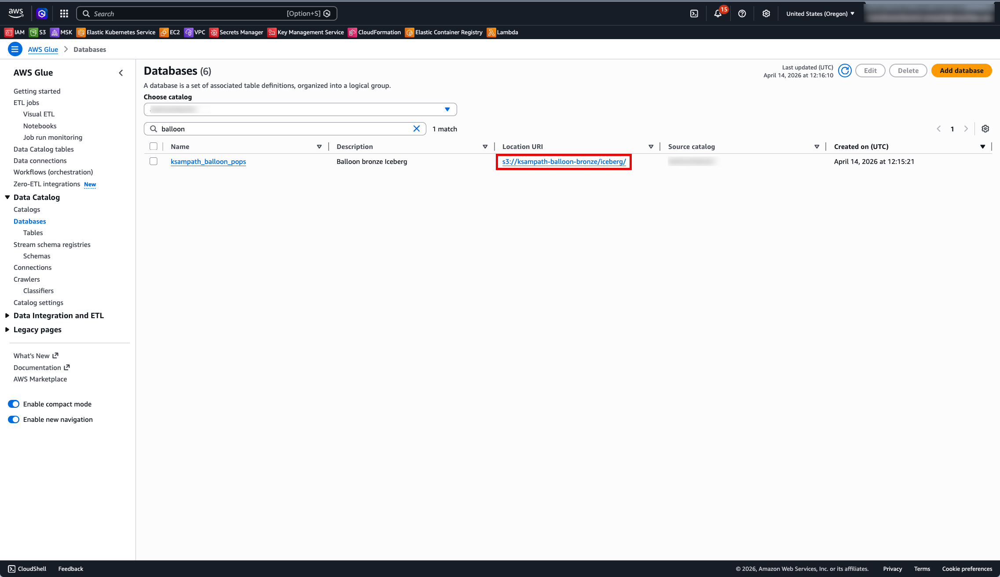
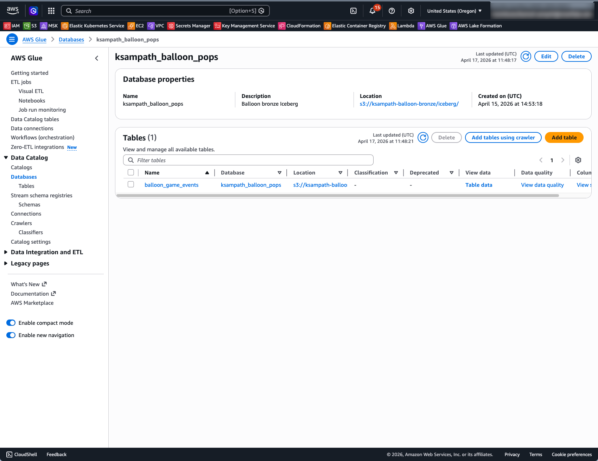
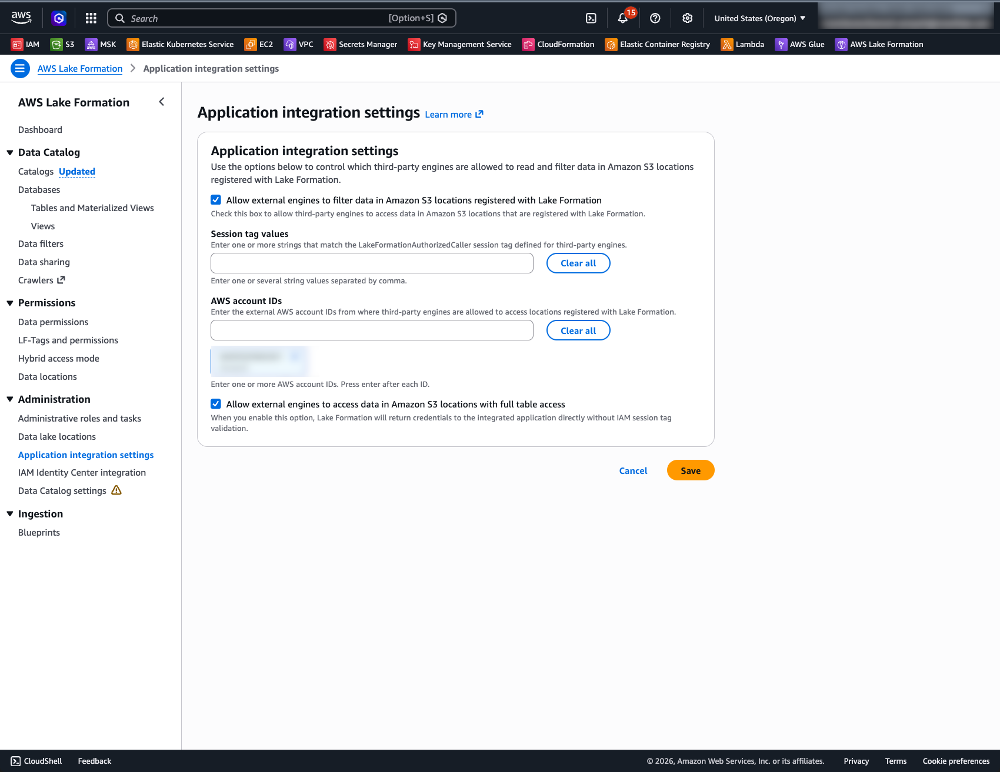

author: Kamesh Sampath, Gilberto Hernandez
id: lakehouse-iceberg-production-pipelines
categories: snowflake-site:taxonomy/solution-center/certification/quickstart,snowflake-site:taxonomy/product/data-engineering,snowflake-site:taxonomy/product/analytics
language: en
summary: Stop pipeline sprawl and the cost of data duplication. In this advanced lab, you will learn to perform secure, in-place transformations across your entire data estate. You will connect externally managed Iceberg tables with Catalog Linked Databases to always work on fresh data without ETL, build efficient and declarative pipelines with Dynamic Tables for Iceberg preserving multi-engine access to your data, and implement business continuity to ensure your production data is always available.
environments: web
status: Published
duration: 90
feedback link: <https://github.com/Snowflake-Labs/sfguides/issues>
fork repo link: <https://github.com/Snowflake-Labs/sfguide-lakehouse-iceberg-production-pipelines>

# Lakehouse Transformations: Build Production Pipelines for your Iceberg Tables
<!-- ------------------------ -->
## Overview

This quickstart shows how to build a bronze-to-silver Iceberg pipeline with AWS and Snowflake — without copying data into a second storage system. You prepare a bronze Iceberg landing zone in AWS (Glue catalog, S3 warehouse, and optional S3 Tables), connect Snowflake to the same catalog using Catalog Linked Databases, build Snowflake-managed Dynamic Iceberg Tables that refresh into silver storage you control, and visualize results using Streamlit in Snowflake. A final chapter queries the same silver tables from DuckDB via Snowflake's Horizon Iceberg REST Catalog.

The guide is bronze-first: each layer is verified before the next one starts, so any failure is easy to isolate.

### What You'll Learn

- How to prepare a bronze layer in AWS using Glue, S3, Lake Formation, and task-driven automation
- How Snowflake uses a catalog integration and Catalog Linked Databases to query externally managed Iceberg metadata without ETL duplication
- How Dynamic Iceberg Tables transform bronze JSON into production-ready silver aggregates while preserving Iceberg format and multi-engine access
- How to make your silver data AI-ready with a Semantic View for natural-language querying via Snowflake Intelligence
- How to build a live Streamlit in Snowflake dashboard over silver Dynamic Tables
- How to query Snowflake-managed Iceberg tables from DuckDB via the Horizon Iceberg REST Catalog

### What You'll Build

A repeatable lakehouse workflow: bronze Iceberg tables loaded in AWS, consumed and transformed in Snowflake via a Catalog Linked Database and Dynamic Iceberg Tables, surfaced as a Streamlit in Snowflake dashboard, and queried from DuckDB. Every layer is auditable and every file stays in open Iceberg format.

### Prerequisites

- Access to a [Snowflake account](https://signup.snowflake.com/?utm_source=snowflake-devrel&utm_medium=developer-guides&utm_cta=developer-guides)
- Access to an AWS account with permissions for Glue, S3, Lake Formation, and IAM
- Local workstation with required CLIs — see **Local Toolchain** in the next section
- A configured Snowflake CLI connection; verify with **snow connection test** before any **snow sql** steps ([Snowflake CLI installation](https://docs.snowflake.com/developer-guide/snowflake-cli/installation/installation))

<!-- ------------------------ -->
## Use Case and Architecture

### The Balloon Game

The lab uses a balloon-popping game as the sample workload. A Python generator simulates players popping balloons of different colors, producing a stream of game events. Each event is a JSON object with these fields:

| Field | Type | Description |
|-------|------|-------------|
| **player** | string | Player identifier |
| **balloon_color** | string | Color of the popped balloon |
| **score** | integer | Points scored for this pop |
| **page_id** | string | Game page where the pop occurred |
| **favorite_color_bonus** | boolean | Whether a scoring bonus was applied |
| **event_ts** | timestamp | Event time |

Events land as raw JSON strings in a single **event** column in the bronze Iceberg table **balloon_game_events**. The silver layer uses **PARSE_JSON** to project and aggregate these fields into five production-ready tables.

### Architecture



### Lab Layers

| Layer | Technology | What it does |
|-------|------------|--------------|
| Bronze | Glue + S3 + PyIceberg | Loads raw game events as Iceberg in AWS |
| Catalog | Snowflake Catalog Integration | Connects Snowflake to Glue Iceberg REST with SigV4 + LF vended credentials |
| CLD | Catalog-Linked Database | Mirrors Glue namespaces and tables as Snowflake schemas — no data copy |
| Silver | Dynamic Iceberg Tables | Transforms JSON bronze into 5 aggregation tables; writes Iceberg back to S3 |
| AI-Ready | Snowflake Intelligence | Semantic View over silver DTs enables natural-language querying via Cortex Analyst |
| Dashboard | Streamlit in Snowflake | Live dashboard over silver DTs; zero local server |
| Cross-engine | DuckDB via HIRC | Queries silver Iceberg tables through Snowflake's Horizon REST Catalog |

<!-- ------------------------ -->
## Tools and Prerequisites

### Clone Repository

This quickstart's narrative lives on Snowflake Quickstarts; all automation lives in the companion repository. Clone it and use the repo root as your working directory for every **task**, **uv run**, and path reference.

```bash
git clone https://github.com/Snowflake-Labs/sfguide-lakehouse-iceberg-production-pipelines.git
```

```bash
cd sfguide-lakehouse-iceberg-production-pipelines
```

Repository: [Snowflake-Labs/sfguide-lakehouse-iceberg-production-pipelines](https://github.com/Snowflake-Labs/sfguide-lakehouse-iceberg-production-pipelines)

### Accounts and Permissions

- AWS account with a named profile (**AWS_PROFILE**) that can create and update Glue databases, manage IAM roles, and access S3
- Snowflake account with **ACCOUNTADMIN** or a role with **CREATE INTEGRATION**, **CREATE DATABASE**, and **CREATE STREAMLIT** privileges
- Snowflake CLI connection configured for that account — **snow connection list** and **snow connection test** both succeed

### Required Tools

This repo targets Python 3.12+. **uv** manages the interpreter and all dependencies.

| Tool | Role | macOS | Linux (Debian/Ubuntu) | Windows |
|------|------|-------|-----------------------|---------|
| **Git** | Clone the companion repository | *brew install git* | *sudo apt install git* | [Git for Windows](https://git-scm.com/download/win) |
| **uv** | Python deps and *uv run* entrypoints | *brew install uv* | [Astral installer](https://docs.astral.sh/uv/getting-started/installation/) | [PowerShell installer](https://docs.astral.sh/uv/getting-started/installation/) |
| **Task** | *task bronze:\**, *task check-tools* | *brew install go-task* | [Install script](https://taskfile.dev/installation/) | *scoop install task* |
| **AWS CLI v2** | Glue, S3, STS; S3 Tables needs v2.34+ | *brew install awscli* | [AWS bundled installer](https://docs.aws.amazon.com/cli/latest/userguide/getting-started-install.html) | [AWS MSI](https://docs.aws.amazon.com/cli/latest/userguide/getting-started-install.html) |
| **Snowflake CLI** | Snowflake steps; also available via *uv sync* | [Snowflake CLI docs](https://docs.snowflake.com/developer-guide/snowflake-cli/installation/installation) | [Snowflake CLI docs](https://docs.snowflake.com/developer-guide/snowflake-cli/installation/installation) | [Snowflake CLI docs](https://docs.snowflake.com/developer-guide/snowflake-cli/installation/installation) |
| **envsubst** | Renders IAM policy templates (gettext package) | *brew install gettext* | *sudo apt install gettext-base* | WSL2 recommended |
| **jq** | JSON checks at the shell | *brew install jq* | *sudo apt install jq* | *scoop install jq* |

After **uv sync**, use **uv run snow …** from the repo root, or add **.venv/bin** (macOS/Linux) or **.venv\Scripts** (Windows) to your PATH.

> **Windows note:** If **task check-tools** fails only on **envsubst**, use WSL2 or run **uv run bronze-cli render-iam** (the Python path) instead.

### Recommended Tools

| Tool | Why | macOS | Linux (Debian/Ubuntu) | Windows |
|------|-----|-------|-----------------------|---------|
| **direnv** | Auto-loads *.env* when you *cd* into the repo | *brew install direnv* | *sudo apt install direnv* | WSL2 |
| **curl** | Scripts and health checks | pre-installed | pre-installed | [curl.se](https://curl.se/download.html) |
| **openssl** | TLS and common crypto one-liners | pre-installed | pre-installed | [OpenSSL binaries](https://wiki.openssl.org/index.php/Binaries) |

### Verify Installation

Run the one-time bootstrap to install Python deps and create **.env** from the template (if it does not exist yet):

```bash
task setup
```

Configure your AWS profile and run the prerequisite check. The check will report errors for any missing required binaries, provide warnings for recommended (but not required) tools, and use **aws sts get-caller-identity** to validate your AWS session. Address any missing tools or credential issues, then rerun the check until you see **All required tools are available.**

```bash
export AWS_PROFILE=your-profile
task check-tools
```

### Environment Inputs

**task setup** copies **.env.example** to **.env** on first run. Edit **.env** and fill in your values.

The **.env.example** is organized by lab phase. Key sections and variables:

```bash
# =============================================================
# Phase 1 — AWS (bronze landing)
# =============================================================
AWS_PROFILE=                    # AWS named profile
AWS_REGION=                     # e.g. us-west-2

# Shared workshop: set this for per-participant bucket/database name derivation.
# Leave BRONZE_BUCKET_NAME empty when LAB_USERNAME is set.
# LAB_USERNAME=

# =============================================================
# Phase 1 — Iceberg warehouse (Glue + PyIceberg)
# =============================================================
BRONZE_BUCKET_NAME=             # Globally unique S3 bucket name
# GLUE_DATABASE=balloon_pops    # Derived from LAB_USERNAME when unset
# BRONZE_LOAD_DURATION_MINUTES=5

# =============================================================
# Phase 1 — Amazon S3 Tables (optional, AWS CLI 2.34+)
# =============================================================
BRONZE_S3TABLES_BUCKET_NAME=
S3TABLES_NAMESPACE=balloon_pops

# =============================================================
# Phase 2 — Snowflake CLI / SQL
# =============================================================
# SNOWFLAKE_DEFAULT_CONNECTION_NAME=devrel-ent
# SNOWFLAKE_ROLE=ACCOUNTADMIN
# SNOWFLAKE_WAREHOUSE=COMPUTE_WH

# =============================================================
# Phase 2 — Dynamic Iceberg Tables (task dt:generate-sql)
# =============================================================
# SNOWFLAKE_SILVER_DATABASE=balloon_silver
# SNOWFLAKE_SILVER_SCHEMA=silver
```

**Key variables:**

| Variable | Phase | Default | Notes |
|----------|-------|---------|-------|
| **AWS_PROFILE** | 1 | required | AWS named profile for all bronze tasks |
| **AWS_REGION** | 1 | required | Keeps all API calls in one region |
| **LAB_USERNAME** | 1 | none | Workshop shared accounts — drives bucket/database name derivation |
| **BRONZE_BUCKET_NAME** | 1 | derived | S3 warehouse bucket; *iceberg/* becomes the Glue warehouse URI |
| **SNOWFLAKE_DEFAULT_CONNECTION_NAME** | 2 | snow default | Override when using a non-default *snow* connection |
| **SNOWFLAKE_ROLE** | 2 | ACCOUNTADMIN | Role for catalog integration and CLD commands |
| **SNOWFLAKE_SILVER_DATABASE** | 2 | balloon_silver | Native Snowflake database for DT objects |
| **SNOWFLAKE_SILVER_SCHEMA** | 2 | silver | Schema for silver Dynamic Iceberg Tables |
| **SNOWFLAKE_APPS_SCHEMA** | 2 | apps | Schema for Streamlit app deployment (SiS chapter) |

<!-- ------------------------ -->
## Bronze Landing Zone

This is the first hands-on chapter. All downstream Snowflake steps assume the bronze Iceberg tables exist in AWS Glue and that the bronze ARNs and Glue metadata are ready.

### Set Up and Load

Preview any setup step without making changes (optional but recommended first):

```bash
task bronze:render-iam-dry-run
task bronze:glue-setup-dry-run
task bronze:s3tables-setup-dry-run
```

Render the IAM policy template (optional — run first if attaching a new IAM role):

```bash
task bronze:render-iam
```

Create the Glue database and register the S3 warehouse:

```bash
task bronze:glue-setup
```

Provision the S3 Tables control plane (optional — requires AWS CLI 2.34+):

```bash
task bronze:s3tables-setup
```

Load sample balloon game events into the Glue Iceberg table:

```bash
task bronze:load
```

Or run all three setup steps and load in one shot:

```bash
task bronze:all
```

### What Gets Created

| Glue database | Table | Schema |
|---------------|-------|--------|
| **GLUE_DATABASE** (e.g. *ksampath_balloon_pops*) | **balloon_game_events** | **event** — STRING, one JSON object per row |

Each JSON object contains: **player**, **balloon_color**, **score**, **page_id**, **favorite_color_bonus**, **event_ts**. Snowflake Dynamic Iceberg Tables use **PARSE_JSON** and variant paths to project these fields into typed columns.

Print a copy-paste sheet of ARNs and exports needed for Snowflake catalog integration SQL:

```bash
task bronze:snowflake-summary
```

### Lake Formation Setup

After **task bronze:load** and after completing step 1 of the Snowflake CLD chapter (**task snowflake:create-glue-catalog-read-role**), configure Lake Formation for vended credentials.

Preview the Lake Formation setup without any AWS writes:

```bash
task bronze:lakeformation-setup-dry-run
```

Apply Lake Formation grants:

```bash
task bronze:lakeformation-setup
```

This step registers **BRONZE_BUCKET_NAME** with Lake Formation using a dedicated data-access IAM role (**HybridAccessEnabled=false**, **WithFederation=false**), clears the default Glue IAM-only table permissions on **GLUE_DATABASE**, and grants **SELECT** and **DESCRIBE** to your Snowflake SIGV4 role.

**Keep the SIGV4 and LF data-access roles separate.** Using the same role causes credential vending errors — see the Troubleshooting chapter for error code **094120**.

### Verify in AWS Console

Use the same AWS account and **AWS_REGION** as your CLI profile.

**Glue Data Catalog:**

1. Open **Glue** → **Data catalog** → **Databases** and confirm **GLUE_DATABASE** exists.
2. Open that database → **Tables** → confirm **balloon_game_events** is listed.
3. Open **balloon_game_events** and confirm **Apache Iceberg** as the table format.







**S3 Warehouse:**

1. Open **S3** → **Buckets** → **BRONZE_BUCKET_NAME**.
2. Open the **iceberg/** prefix — expect **metadata/** and **data/** style keys after load.

**S3 Tables (optional):**

Open **S3 Tables** → **Table buckets** and confirm **BRONZE_S3TABLES_BUCKET_NAME** appears.

### Optional: Query in Athena

Use data source **AwsDataCatalog**, database **GLUE_DATABASE**, and table **balloon_game_events**. Do **not** select the **s3tables/\<table-bucket\>** federated catalog entry — that path is an empty shell until a separate writer commits metadata.

<!-- ------------------------ -->
## Snowflake Catalog Linked Database (CLD)

This chapter creates the Glue Iceberg REST catalog integration, tightens IAM trust, creates the catalog linked database (CLD), and runs discovery and read queries against **balloon_game_events**.

**Before starting:**

- Bronze tables are loaded; **.aws-config/glue-database.json** was written by **task bronze:glue-setup**
- **snow connection test** succeeds
- Lake Formation is configured for **VENDED_CREDENTIALS** (see **Lake Formation Setup** in the Bronze chapter)

### Easy Path — Interactive Notebook

Open [cld_lab_guide.ipynb](https://github.com/Snowflake-Labs/sfguide-lakehouse-iceberg-production-pipelines/blob/main/notebooks/cld_lab_guide.ipynb) in Snowflake Notebooks for an interactive walkthrough. The notebook uses:

- **`ENABLED = FALSE`** on the catalog integration to break the IAM chicken-egg dependency — trust policy values are generated without connecting to Glue
- A companion **CloudFormation template** ([cfn-snowflake-cld.yaml](https://github.com/Snowflake-Labs/sfguide-lakehouse-iceberg-production-pipelines/blob/main/notebooks/cfn-snowflake-cld.yaml)) that deploys all IAM roles, Lake Formation registration, and permissions in a single stack
- **Cortex Code prompts** embedded in each step — use Cmd+K or the chat sidebar to generate SQL and CLI commands from natural language
- **`SYSTEM$VERIFY_CATALOG_INTEGRATION`** to validate connectivity before creating the CLD

Follow the **Detailed Path** below for step-by-step shell commands.

### Detailed Path

> **Role requirement:** The commands in this chapter require **ACCOUNTADMIN** or a role with **CREATE INTEGRATION**, **CREATE DATABASE**, and **GRANT** privileges. The lab defaults to **SNOWFLAKE_ROLE** = **ACCOUNTADMIN** set in **.env**. Confirm this before running any **snow sql** commands.

#### Create IAM Role

Create the Snowflake SIGV4 IAM role that Snowflake uses to sign Glue REST requests:

```bash
task snowflake:create-glue-catalog-read-role
```

This writes the IAM role ARN to **.aws-config/snowflake-glue-catalog-iam-role-arn.txt**. All subsequent lab tools read it automatically — no env var override needed.

After this step, return to the Bronze chapter and run **task bronze:lakeformation-setup** to grant the SIGV4 role access via Lake Formation before proceeding.

> **Notebook path (CloudFormation):** The interactive notebook uses a single CloudFormation template instead of individual **task** commands for IAM and Lake Formation setup. It creates the catalog integration as **ENABLED = FALSE** first, extracts trust values from **DESC INTEGRATION**, and passes them as stack parameters — eliminating the manual trust-render-apply cycle. See the notebook for details.

#### Generate SQL

Generate runnable SQL from your **.aws-config/** artifacts:

```bash
task snowflake:generate-lab-sql
```

This writes two files to **snowflake/lab/generated/**:

- **01_catalog_integration.generated.sql** — CREATE CATALOG INTEGRATION
- **02_cld_verify.generated.sql** — CREATE DATABASE + SHOW + SELECT

To preview the SQL without writing files:

```bash
task snowflake:generate-lab-sql-stdout
```

#### Create Catalog Integration

Apply the generated catalog integration SQL:

```bash
snow sql --filename snowflake/lab/generated/01_catalog_integration.generated.sql
```

The generated SQL creates **glue_rest_catalog_int** (default name) with these settings:

- **CATALOG_SOURCE = ICEBERG_REST**, **TABLE_FORMAT = ICEBERG**
- **CATALOG_URI** = https://glue.\<region\>.amazonaws.com/iceberg
- **CATALOG_API_TYPE = AWS_GLUE**, **ACCESS_DELEGATION_MODE = VENDED_CREDENTIALS**
- **CATALOG_NAME** = your 12-digit AWS account ID (Glue Data Catalog default)
- **CATALOG_NAMESPACE** = **GLUE_DATABASE**
- **SIGV4_IAM_ROLE** = ARN from **.aws-config/snowflake-glue-catalog-iam-role-arn.txt**

> **Tip: Breaking the chicken-egg dependency.** The notebook creates the catalog integration with **ENABLED = FALSE**. This generates **API_AWS_IAM_USER_ARN** and **API_AWS_EXTERNAL_ID** immediately without requiring the IAM role to exist yet. After deploying the CloudFormation stack with the real trust values, the integration is enabled via **ALTER CATALOG INTEGRATION … SET ENABLED = TRUE**. This avoids a two-pass trust policy update.

#### Describe and Capture Trust Fields

Print catalog integration properties including the Snowflake-generated trust fields:

```bash
task snowflake:describe-catalog-integration
```

Or run the SQL directly:

```sql
DESC CATALOG INTEGRATION glue_rest_catalog_int;
```

Note **API_AWS_IAM_USER_ARN** and **API_AWS_EXTERNAL_ID** from the output — these are needed to tighten the trust policy on the SIGV4 IAM role.

#### Apply IAM Trust

Render the trust document using the **DESC** output:

```bash
task snowflake:render-glue-catalog-trust
```

Apply the rendered trust policy to the SIGV4 IAM role:

```bash
task snowflake:apply-glue-catalog-trust-from-rendered
```

This updates the IAM role's trust policy to scope access to Snowflake's specific IAM user ARN and external ID. Alternatively, paste the rendered JSON from **.aws-config/snowflake-glue-catalog-trust-policy.rendered.json** directly in the IAM console under **Trust relationships**.

#### Verify Catalog Integration

After applying the trust policy, verify the integration can connect to Glue:

```sql
SELECT SYSTEM$VERIFY_CATALOG_INTEGRATION('glue_rest_catalog_int');
```

Expect `"success": true` in the JSON response. If it fails, check that the trust policy values match **DESC INTEGRATION** output exactly and that IAM propagation is complete (up to 30 seconds).

#### Create Catalog-Linked Database

Apply the generated CLD and verify script:

```bash
snow sql --filename snowflake/lab/generated/02_cld_verify.generated.sql
```

This creates **balloon_game_events** as a Catalog-Linked Database and runs initial discovery. To create it manually instead:

```sql
CREATE OR REPLACE DATABASE balloon_game_events
  COMMENT = 'CLD: Glue bronze Iceberg'
  LINKED_CATALOG = (
    CATALOG = 'glue_rest_catalog_int'
  );
```

> **Note:** Any change to Lake Formation permissions or IAM trust after a link failure requires re-creating the CLD. After fixing the LF/IAM settings, re-run **CREATE OR REPLACE DATABASE … LINKED_CATALOG = (…)** and re-apply **GRANT USAGE ON INTEGRATION glue_rest_catalog_int TO ROLE \<your_role\>**. See *Privileges Lost After CLD Recreate* in Troubleshooting.

Optional status checks:

```sql
SELECT SYSTEM$CATALOG_LINK_STATUS('balloon_game_events');
```

```sql
SELECT SYSTEM$GET_CATALOG_LINKED_DATABASE_CONFIG('balloon_game_events');
```

#### Discover and Query

List remote namespaces discovered from Glue:

```sql
SHOW SCHEMAS IN DATABASE balloon_game_events;
```

List Iceberg tables in the discovered namespace:

```sql
-- Replace <remote_schema> with your GLUE_DATABASE name in lowercase
SHOW ICEBERG TABLES IN SCHEMA balloon_game_events."<remote_schema>";
```

Read raw events and project fields using **PARSE_JSON**:

```sql
SELECT
  PARSE_JSON(event):player::STRING         AS player,
  PARSE_JSON(event):balloon_color::STRING  AS balloon_color,
  PARSE_JSON(event):score::INTEGER         AS score,
  PARSE_JSON(event):event_ts::TIMESTAMP_TZ AS event_ts
FROM balloon_game_events."<remote_schema>"."balloon_game_events"
LIMIT 10;
```

#### Lake Formation Console Checks

> **When to check:** Run these checks only if **SYSTEM$CATALOG_LINK_STATUS('balloon_game_events')** reports failures. A healthy link returns:
> ```json
> {"failureDetails":[],"executionState":"RUNNING","lastLinkAttemptStartTime":"..."}
> ```

If **task bronze:lakeformation-setup** ran successfully, skip this. Otherwise verify these four settings manually.

> **Notebook users:** The interactive notebook includes the same four checks with annotated screenshots in **Step 2c: Verify Lake Formation Settings**.

**1. Database mode:**

Open **Lake Formation** → **Data catalog** → **Databases** → open **GLUE_DATABASE** → **Edit**. Confirm **Use only IAM access control for new tables** is unchecked.


**2. Data lake location:**

Open **Permissions** → **Data lake locations**. Confirm **s3://\<BRONZE_BUCKET_NAME\>/iceberg/** is registered with **HybridAccessEnabled=false** and **WithFederation=false** using a dedicated LF data-access role that is **different** from the SIGV4 role.


**3. Data permissions:**

Open **Permissions** → **Data permissions**. Confirm the SIGV4 role has **DESCRIBE** on the database and **SELECT**, **DESCRIBE** on the table wildcard.


**4. Application integration settings:**

Open **Lake Formation** → **Administration** → **Application integration settings**. Confirm **Allow external engines to access data in Amazon S3 locations with full table access** is enabled. This setting is mandatory for Snowflake's vended-credentials flow — without it, Lake Formation will not issue temporary credentials to the SIGV4 role.



#### Full Reference Sequence

End-to-end Snowflake command sequence (assumes tools verified and bronze loaded):

| Command | What it does |
|---------|-------------|
| **task bronze:snowflake-summary** | Print bucket/DB/ARNs needed for Snowflake catalog SQL |
| **task snowflake:create-glue-catalog-read-role** | Create SIGV4 IAM role; write ARN to **.aws-config/** |
| *(return to Bronze)* **task bronze:lakeformation-setup** | Grant SIGV4 role access via Lake Formation |
| **task snowflake:generate-lab-sql** | Generate **01_catalog_integration** and **02_cld_verify** SQL |
| **snow sql --filename snowflake/lab/generated/01_catalog_integration.generated.sql** | Create the catalog integration in Snowflake |
| **task snowflake:describe-catalog-integration** | Print trust fields (API_AWS_IAM_USER_ARN + external ID) |
| **task snowflake:render-glue-catalog-trust** | Render trust JSON using those fields |
| **task snowflake:apply-glue-catalog-trust-from-rendered** | Apply rendered trust to SIGV4 IAM role |
| **SELECT SYSTEM$VERIFY_CATALOG_INTEGRATION('glue_rest_catalog_int')** | Verify integration connects to Glue (expect `"success": true`) |
| **snow sql --filename snowflake/lab/generated/02_cld_verify.generated.sql** | Create CLD and run discovery queries |

> **Notebook alternative (ENABLED=FALSE flow):**
>
> | Step | Command | What it does |
> |------|---------|-------------|
> | 2a | **CREATE CATALOG INTEGRATION … ENABLED = FALSE** | Generate trust values without connecting to Glue |
> | 2b | **DESC INTEGRATION** → **aws cloudformation deploy** | Extract trust values and deploy IAM + LF via CFN |
> | 2c | Verify Lake Formation settings in AWS Console | Confirm CFN deployed correctly |
> | 2d | **ALTER CATALOG INTEGRATION … SET ENABLED = TRUE** | Enable and verify with **SYSTEM$VERIFY_CATALOG_INTEGRATION** |

<!-- ------------------------ -->
## Dynamic Iceberg Tables

With bronze readable through the CLD, add [Dynamic Iceberg Tables](https://docs.snowflake.com/en/user-guide/dynamic-tables-create-iceberg) that write silver Iceberg data. It uses [Snowflake Managed Storage](https://docs.snowflake.com/en/user-guide/tables-iceberg-internal-storage) for Iceberg. The silver pipeline frequency is controlled on a declared **TARGET_LAG**. Five aggregation tables refresh automatically and remain readable by any Iceberg-compatible engine.

### Five Silver Tables

| Table | What it aggregates |
|-------|--------------------|
| **dt_player_leaderboard** | Per-player total score, bonus pops, last event |
| **dt_balloon_color_stats** | Per-player, per-color breakdown (pops, points, bonuses) |
| **dt_realtime_scores** | 15-second windowed scores per player |
| **dt_balloon_colored_pops** | 15-second windows by player and balloon color |
| **dt_color_performance_trends** | Average score per pop by color over 15-second windows |

### Easy Path — Interactive Notebook

Open [dt_lab_guide.ipynb](https://github.com/Snowflake-Labs/sfguide-lakehouse-iceberg-production-pipelines/blob/main/notebooks/dt_lab_guide.ipynb) in Snowflake Notebooks for an interactive walkthrough. The notebook builds on the CLD Lab Guide and includes:

- **CLD recap** — summarizes what was built in the previous chapter before diving into silver
- **"Why Dynamic Iceberg Tables?"** — callout explaining DIT vs regular Dynamic Tables, TARGET_LAG, and Iceberg interoperability
- **Cortex Code prompts** — generate the first DT SQL via Cmd+K, check refresh status via chat, and explore silver data with intent-driven prompts
- **Teachable moment** — the Cortex Code prompt for `dt_player_leaderboard` may generate `TIMESTAMP_TZ`, which Iceberg doesn't support — workshoppers debug and fix it live
- **"What Just Happened?"** — architecture summary of the bronze→silver pipeline
- **Cleanup** — single `DROP DATABASE` to tear down all DTs

Use the **Detailed Path** below for step-by-step shell commands.

### Detailed Path

#### Configure Environment

Set these variables in **.env** before generating SQL:

| Variable | Default | Notes |
|----------|---------|-------|
| **SNOWFLAKE_SILVER_DATABASE** | *balloon_silver* | Native Snowflake database for DT objects |
| **SNOWFLAKE_SILVER_SCHEMA** | *silver* | Schema for all silver DTs |
| **SNOWFLAKE_WAREHOUSE** | *COMPUTE_WH* | Warehouse for DT refresh compute |

Print current environment hints:

```bash
task snowflake:print-env-hints
```

> Dynamic Iceberg Tables use Snowflake Managed Storage — no external volume setup is required.

> **Iceberg type limitation:** Iceberg tables do not support `TIMESTAMP_TZ`. Use `TIMESTAMP_LTZ` (maps to Iceberg `timestamptz`) or `TIMESTAMP_NTZ` (maps to Iceberg `timestamp`). If generated SQL uses `TIMESTAMP_TZ`, change it to `TIMESTAMP_LTZ(6)` or `TIMESTAMP_NTZ`.

#### Generate and Apply DT SQL

Generate the silver DT SQL from your env and **.aws-config/** artifacts:

```bash
task dt:generate-sql
```

This writes **snowflake/lab/generated/03_dt_pipelines.generated.sql**.

Apply the generated SQL:

```bash
snow sql --filename snowflake/lab/generated/03_dt_pipelines.generated.sql
```

The unedited scaffold for manual editing lives at **snowflake/lab/03_dt_pipelines.sql**.

#### Verify

Check DT status after creation:

```sql
USE DATABASE balloon_silver;
USE SCHEMA silver;
SHOW DYNAMIC TABLES LIKE 'dt_%' IN SCHEMA;
```

Wait for an initial refresh (check Snowsight → **Data** → **Dynamic Tables**, or inspect **SCHEDULING_STATE** in the **SHOW** output), then query:

```sql
-- Top players by score
SELECT player, total_score, bonus_pops, last_event_ts
FROM balloon_silver.silver.dt_player_leaderboard
ORDER BY total_score DESC NULLS LAST
LIMIT 15;
```

```sql
-- 15-second windowed scores
SELECT player, total_score, window_start, window_end
FROM balloon_silver.silver.dt_realtime_scores
ORDER BY window_start DESC, player
LIMIT 20;
```

Run all verification queries at once:

```bash
snow sql --filename snowflake/lab/04_dt_verify_sample_queries.sql
```

#### Quick Teardown

To remove all silver DTs and their refresh schedules:

```sql
DROP DATABASE IF EXISTS balloon_silver;
```

DT refreshes stop automatically when the database is dropped. The external volume and S3 data are **not** deleted — remove those separately if needed.

<!-- ------------------------ -->
## Snowflake Intelligence

Your silver Dynamic Iceberg Tables are now **AI-ready**. By creating a [Semantic View](https://docs.snowflake.com/en/user-guide/views-semantic) over the five silver tables, you enable natural-language querying via [Snowflake Intelligence](https://docs.snowflake.com/en/user-guide/snowflake-intelligence) and the [Cortex Analyst](https://docs.snowflake.com/en/user-guide/snowflake-cortex/cortex-analyst) API — no additional ETL, no model training, no external tools.

A Semantic View defines the business meaning of your tables, columns, and metrics in YAML. Once created, users (and AI agents) can ask questions like:

- *"Who is the top-scoring player?"*
- *"Which balloon color gives the highest average points?"*
- *"Show me score trends over the last hour"*

…and get accurate SQL-backed answers grounded in your silver data.

### Easy Path — Interactive Notebook

Open [si_lab_guide.ipynb](https://github.com/Snowflake-Labs/sfguide-lakehouse-iceberg-production-pipelines/blob/main/notebooks/si_lab_guide.ipynb) in Snowflake Notebooks for a guided walkthrough. The notebook uses the same environment variables as the DT Lab Guide and includes a **Cortex Code prompt** to auto-generate the Semantic View, plus step-by-step instructions for configuring the Intelligence agent.

### Detailed Path

#### Create the Semantic View

Create a Semantic View that describes all five silver tables with their business context. Replace **balloon_silver** with your **SNOWFLAKE_SILVER_DATABASE** if different:

```sql
CREATE OR REPLACE SEMANTIC VIEW summit26_ar103_balloon_silver.silver.balloon_game_semantic_view

  TABLES (
    player_leaderboard AS summit26_ar103_balloon_silver.silver.dt_player_leaderboard
      PRIMARY KEY (player)
      WITH SYNONYMS ('leaderboard', 'rankings', 'top players')
      COMMENT = 'Aggregated player scores: total score, bonus pops, last event timestamp per player',

    color_stats AS summit26_ar103_balloon_silver.silver.dt_balloon_color_stats
      UNIQUE (player, balloon_color)
      WITH SYNONYMS ('color breakdown', 'player colors', 'color scores')
      COMMENT = 'Per-player breakdown by balloon color: pops, points, and bonus hits',

    realtime_scores AS summit26_ar103_balloon_silver.silver.dt_realtime_scores
      WITH SYNONYMS ('live scores', 'recent scores', 'hot streaks')
      COMMENT = '15-second windowed score totals per player for time-series analysis',

    colored_pops AS summit26_ar103_balloon_silver.silver.dt_balloon_colored_pops
      WITH SYNONYMS ('detailed pops', 'player color windows')
      COMMENT = 'Most granular view: per-player, per-color pops in 15-second time windows',

    color_trends AS summit26_ar103_balloon_silver.silver.dt_color_performance_trends
      WITH SYNONYMS ('color trends', 'color performance', 'best colors')
      COMMENT = 'Average score per pop and total pops by balloon color over 15-second windows'
  )

  RELATIONSHIPS (
    color_stats_to_leaderboard AS
      color_stats (player) REFERENCES player_leaderboard,
    realtime_to_leaderboard AS
      realtime_scores (player) REFERENCES player_leaderboard,
    colored_pops_to_leaderboard AS
      colored_pops (player) REFERENCES player_leaderboard,
    colored_pops_to_color_stats AS
      colored_pops (player, balloon_color) REFERENCES color_stats
  )

  FACTS (
    player_leaderboard.total_score AS player_leaderboard.total_score
      WITH SYNONYMS = ('total score', 'overall score', 'total points')
      COMMENT = 'Cumulative score across all balloon pops',
    player_leaderboard.bonus_pops AS player_leaderboard.bonus_pops
      WITH SYNONYMS = ('bonus pops', 'bonuses', 'bonus count')
      COMMENT = 'Number of pops where player hit their favorite color',
    color_stats.balloon_pops AS color_stats.balloon_pops
      WITH SYNONYMS = ('pops', 'pop count', 'times popped')
      COMMENT = 'Number of times this player popped this color',
    color_stats.points_by_color AS color_stats.points_by_color
      WITH SYNONYMS = ('points by color', 'color points', 'color score')
      COMMENT = 'Total points earned from popping this color',
    color_stats.bonus_hits AS color_stats.bonus_hits
      WITH SYNONYMS = ('bonus hits', 'color bonuses')
      COMMENT = 'Number of favorite-color bonus pops for this color',
    realtime_scores.window_score AS realtime_scores.total_score
      WITH SYNONYMS = ('window score', 'live score', 'current score')
      COMMENT = 'Sum of scores within the 15-second window',
    colored_pops.window_pops AS colored_pops.balloon_pops
      COMMENT = 'Pop count for this player+color in this window',
    colored_pops.window_points AS colored_pops.points_by_color
      COMMENT = 'Points for this player+color in this window',
    colored_pops.window_bonus AS colored_pops.bonus_hits
      COMMENT = 'Bonus pops for this player+color in this window',
    color_trends.avg_score_per_pop AS color_trends.avg_score_per_pop
      WITH SYNONYMS = ('efficiency', 'points per pop', 'scoring rate', 'best value')
      COMMENT = 'Average points earned per pop of this color in this window',
    color_trends.total_pops AS color_trends.total_pops
      WITH SYNONYMS = ('volume', 'popularity', 'total pops')
      COMMENT = 'Total pops of this color in this window'
  )

  DIMENSIONS (
    player_leaderboard.player_name AS player_leaderboard.player
      WITH SYNONYMS = ('player', 'gamer', 'username', 'who')
      COMMENT = 'Unique player identifier',
    player_leaderboard.last_active AS player_leaderboard.last_event_ts
      WITH SYNONYMS = ('last active', 'last seen', 'last played')
      COMMENT = 'Timestamp of the most recent game event for this player',
    color_stats.cs_player AS color_stats.player
      COMMENT = 'Player identifier in color stats',
    color_stats.color AS color_stats.balloon_color
      WITH SYNONYMS = ('balloon color', 'color', 'balloon type')
      COMMENT = 'Color of the balloon (red, blue, green, yellow, etc.)',
    color_stats.cs_last_event AS color_stats.last_event_ts
      COMMENT = 'Most recent pop of this color by this player',
    realtime_scores.rs_player AS realtime_scores.player
      COMMENT = 'Player identifier in realtime scores',
    realtime_scores.window_start AS realtime_scores.window_start
      WITH SYNONYMS = ('start time', 'window start')
      COMMENT = 'Start of the 15-second time window',
    realtime_scores.window_end AS realtime_scores.window_end
      WITH SYNONYMS = ('end time', 'window end')
      COMMENT = 'End of the 15-second time window',
    colored_pops.cp_player AS colored_pops.player
      COMMENT = 'Player identifier in colored pops',
    colored_pops.cp_color AS colored_pops.balloon_color
      COMMENT = 'Balloon color in the detailed window view',
    colored_pops.cp_window_start AS colored_pops.window_start
      COMMENT = 'Start of the time window',
    colored_pops.cp_window_end AS colored_pops.window_end
      COMMENT = 'End of the time window',
    color_trends.ct_color AS color_trends.balloon_color
      WITH SYNONYMS = ('trending color', 'color trend')
      COMMENT = 'Balloon color for performance trend analysis',
    color_trends.ct_window_start AS color_trends.window_start
      COMMENT = 'Start of the trend analysis window',
    color_trends.ct_window_end AS color_trends.window_end
      COMMENT = 'End of the trend analysis window'
  )

  METRICS (
    player_leaderboard.m_total_score AS SUM(player_leaderboard.total_score)
      WITH SYNONYMS = ('total points', 'combined score')
      COMMENT = 'Total cumulative score across all players',
    player_leaderboard.m_total_bonus_pops AS SUM(player_leaderboard.bonus_pops)
      WITH SYNONYMS = ('bonus total', 'all bonuses')
      COMMENT = 'Total bonus pops across all players',
    player_leaderboard.m_player_count AS COUNT(player_leaderboard.player)
      WITH SYNONYMS = ('number of players', 'how many players')
      COMMENT = 'Count of players on the leaderboard',
    color_stats.m_total_pops_by_color AS SUM(color_stats.balloon_pops)
      WITH SYNONYMS = ('total balloon pops', 'all pops')
      COMMENT = 'Total balloon pops aggregated across players for a given color',
    color_stats.m_total_points_by_color AS SUM(color_stats.points_by_color)
      WITH SYNONYMS = ('color points total', 'total color points')
      COMMENT = 'Total points aggregated across players for a given color',
    color_stats.m_avg_points_per_pop AS AVG(color_stats.points_by_color / NULLIF(color_stats.balloon_pops, 0))
      WITH SYNONYMS = ('efficiency', 'scoring rate', 'points per pop')
      COMMENT = 'Average points per pop across colors',
    realtime_scores.m_max_window_score AS MAX(realtime_scores.window_score)
      WITH SYNONYMS = ('best window', 'peak score', 'hottest moment')
      COMMENT = 'Highest score in any single 15-second window',
    realtime_scores.m_avg_window_score AS AVG(realtime_scores.window_score)
      WITH SYNONYMS = ('average window score', 'typical window')
      COMMENT = 'Average score per 15-second window',
    color_trends.m_avg_efficiency AS AVG(color_trends.avg_score_per_pop)
      WITH SYNONYMS = ('trend efficiency', 'color efficiency')
      COMMENT = 'Weighted average score per pop across time windows',
    color_trends.m_total_pops AS SUM(color_trends.total_pops)
      WITH SYNONYMS = ('color popularity', 'total color pops')
      COMMENT = 'Total balloon pops across all colors and time windows'
  )

  COMMENT = 'AI-ready semantic layer over balloon game silver Dynamic Iceberg Tables'

  AI_SQL_GENERATION 'This is a balloon popping game. Players pop colored balloons to earn points. Some pops are bonus pops worth extra. The leaderboard has overall rankings by total_score. Color stats show which colors each player pops most and points per color. Realtime scores show 15-second windows of activity. Color trends show which balloon colors give the best points-per-pop over time. When asked about the top player, use the leaderboard total_score. When asked which color scores best, use color_trends avg_score_per_pop. When asked who is hot right now, use realtime_scores with the most recent window_start.';
```

#### Verify the Semantic View

Check the view was created and inspect its structure:

```sql
SHOW SEMANTIC VIEWS IN SCHEMA balloon_silver.silver;
```

```sql
DESC SEMANTIC VIEW balloon_silver.silver.balloon_game_semantic_view;
```

#### Configure Snowflake Intelligence with the Semantic View

With the Semantic View created, set up a Snowflake Intelligence **agent** that uses it as a tool for natural-language querying. This follows the same pattern as the official [Getting Started with Snowflake Intelligence](https://www.snowflake.com/en/developers/guides/getting-started-with-snowflake-intelligence/) guide — but since we already have a Semantic View (not a YAML file), setup is simpler.

##### Required Privileges

Lab users running as **ACCOUNTADMIN** already have the necessary permissions — no additional grants are needed. ACCOUNTADMIN inherits all privileges including Cortex AI access and ownership of objects you create.

> **Production note:** In a production environment, you would grant `SNOWFLAKE.CORTEX_USER` and `REFERENCES` + `SELECT` on the Semantic View to consumer roles:
> ```sql
> GRANT DATABASE ROLE SNOWFLAKE.CORTEX_USER TO ROLE <consumer_role>;
> GRANT REFERENCES, SELECT ON SEMANTIC VIEW balloon_silver.silver.balloon_game_semantic_view
>   TO ROLE <consumer_role>;
> ```

##### Create the Agent

**1. Navigate to the Agent admin page** — In Snowsight, go to **AI & ML → Agents**. Confirm your role is set to **ACCOUNTADMIN** (top-right role selector).

**2. Create a new agent:**

- Click **+ Create agent**
- **Agent object name:** `balloon_game_agent` (internal identifier)
- **Display name:** `Balloon Game Analytics` (shown to users in the chat UI)
- **Description:** *"Ask questions about balloon game player scores, color stats, and performance trends from the silver lakehouse tables."*
- Click **Create agent**

**3. Add the Cortex Analyst tool (Semantic View):**

- Select the **Tools** tab in the agent editor
- Find **Cortex Analyst** and click **+ Add**
- Choose **Semantic View** (not "Semantic model file" — we already have a view, not a YAML on a stage)
- Select database: `balloon_silver`, schema: `silver`, view: `balloon_game_semantic_view`
- For **Description**, click **Generate with Cortex** to auto-generate a tool description from your semantic metadata — or write your own, e.g.: *"Queries structured balloon game data including player leaderboards, color stats, real-time scores, and performance trends. Use for any question about players, scores, colors, or time-based patterns."*
- Set the **Warehouse** to your lab warehouse (e.g. `KAMESH_DEMOS_S` or your assigned warehouse)

**4. (Optional) Add the Email tool:**

If you want the agent to send query results or insights via email (e.g. *"Email me the top 5 players leaderboard"*), first create the notification integration and stored procedure in your silver database:

```sql
-- Notification integration for email delivery
CREATE OR REPLACE NOTIFICATION INTEGRATION email_integration
  TYPE = EMAIL
  ENABLED = TRUE
  DEFAULT_SUBJECT = 'Balloon Game Analytics';

-- Stored procedure that the agent calls to send emails
CREATE OR REPLACE PROCEDURE balloon_silver.silver.send_email(
    recipient_email VARCHAR,
    subject VARCHAR,
    body VARCHAR
)
RETURNS VARCHAR
LANGUAGE SQL
AS
BEGIN
    CALL SYSTEM$SEND_EMAIL(
        'email_integration',
        :recipient_email,
        :subject,
        :body,
        'text/html'
    );
    RETURN 'Email sent successfully to ' || :recipient_email;
END;

-- Grant execute to your role (ACCOUNTADMIN already has it)
GRANT USAGE ON PROCEDURE balloon_silver.silver.send_email(VARCHAR, VARCHAR, VARCHAR)
  TO ROLE ACCOUNTADMIN;
```

> **Source:** Adapted from the [official Snowflake Intelligence setup](https://github.com/Snowflake-Labs/sfguide-getting-started-with-snowflake-intelligence/blob/main/setup.sql#L160-L210).

Then, in the agent editor:

- In the **Tools** tab, find **Custom Tools** and click **+ Add**
- Select database: `balloon_silver`, schema: `silver`, procedure: `send_email`
- Configure parameter descriptions (these guide the agent on how to use the tool):
  - **recipient_email:** *"If the email is not provided, send it to the current user's email address."*
  - **subject:** *"If subject is not provided, use 'Balloon Game Analytics'."*
  - **body:** *"If body is not provided, summarize the last question and use that as content for the email."*
- The agent can now send results via email when prompted

> **Note:** The Email tool is optional for this lab. Skip it if you only want to explore data interactively. Your Snowflake user must have a verified email address for delivery to work.

**5. Add sample questions (recommended):**

- Select the **Voice** tab (or **Instructions** tab depending on your Snowsight version)
- Under **Sample questions**, add examples that help users get started:
  - *"Who are the top 5 players by total score?"*
  - *"Which balloon color gives the best average points per pop?"*
  - *"Show me score trends over the last few time windows"*
  - *"How many total bonus pops have all players earned?"*
  - *"Email me a summary of the top 3 players"*

**6. Set orchestration instructions:**

- In the **Instructions** section, add the following orchestration instruction:
  - *"Whenever you can answer visually with a chart, always choose to generate a chart even if the user didn't specify to."*

**7. Save the agent** — Click **Save** in the top-right corner. The agent is now live.

##### Access the Agent

Once saved, users can access the agent in two ways:

- **Snowflake Intelligence chat:** Navigate to **AI & ML → Snowflake Intelligence**, select `Balloon Game Analytics` from the agent picker in the chat bar, and start asking questions
- **Direct URL:** Go to [ai.snowflake.com](https://ai.snowflake.com) and select the agent

> **How it works:** When a user asks a question, the agent routes it to Cortex Analyst, which reads the Semantic View's table/column descriptions, relationships, and primary keys to generate accurate SQL. The query executes against your silver Dynamic Iceberg Tables and returns results in the chat — no SQL knowledge required.

#### Try It with Snowflake Intelligence

Once configured, open your Intelligence app and ask natural-language questions about your balloon game data. Intelligence will ground its SQL generation in the semantic context you defined — table relationships, column descriptions, and metric definitions.

Example questions to try:

- *"Who are the top 5 players by total score?"*
- *"What's the most popular balloon color across all players?"*
- *"Which color gives the best average points per pop?"*
- *"Show me how player scores trend over time windows"*
- *"Which players have the most bonus pops as a percentage of total pops?"*
- *"How many total bonus pops have all players earned?"*
- *"Email me a summary of the top 3 players"*

> **Why this matters:** Your silver data was already queryable by SQL users and BI tools. The Semantic View now makes it queryable by **anyone** — business analysts, executives, or automated agents — using plain English. The same Iceberg data powers dashboards, cross-engine queries (DuckDB), **and** AI-driven analytics.

<!-- ------------------------ -->
## SiS Dashboard

After the silver Dynamic Tables are live, deploy a Streamlit in Snowflake app that visualizes the balloon game event data. The app runs entirely in your Snowflake account next to your data.

This chapter offers **two paths** to the same outcome — choose one (or try both):

| Path | How | What you'll learn |
|------|-----|-------------------|
| **Easy Path: Cortex Code** | Describe what you want in natural language; AI builds, debugs, and deploys | Intent-driven development — how iterative prompts replace manual coding |
| **Detailed Path: CLI** | Write every file and run every CLI command yourself | Full control, traditional workflow |

> **Recommended:** Try the Easy Path first. Watch Cortex Code encounter errors (missing packages, unsupported features, permission gaps) and self-heal. Then ask it to generate the "ideal prompt" that would have worked in one shot — that's the core lesson of [Intent-Driven Development (IDD)](https://blogs.kameshs.dev/intent-driven-development-the-shift-developers-cant-ignore-ef434f94d56c).

**Prerequisites:**

- **03_dt_pipelines** applied and all five **dt_*** tables exist in **balloon_silver.silver**

### Easy Path: Intent-Driven (Cortex Code)

Open **Cortex Code** from the Snowsight sidebar. This path has three rounds that demonstrate the progression from vague intent to precise specification.

#### Round 1 — State Your Intent

*Tell the agent **what** you want, not **how** to build it.*

Copy and paste this into Cortex Code:

```text
First, ask me the following before you start building:

1. What database.schema has my game's Dynamic Tables?
2. Where should the Streamlit app and stage be created?
3. What warehouse should it use?

Then, build me a multi-page Streamlit in Snowflake dashboard for my balloon popper game using the Dynamic Tables from the schema above.

Structure the app in its own directory with a pages/ directory:

- streamlit_app.py — home page with a game summary and key metrics
- pages/1_Leaderboard.py — top 5 player rankings, score gaps, bar chart
- pages/2_Color_Breakdown.py — pops by color, avg points per pop, player-color heatmap, players favorite color
- pages/3_Trends.py — color value over time, player scores over time

I want to answer: 
  * Who is winning and by how much? 
  * Which colors are most popular? 
  * Which color is worth more points? How are scores trending?

Make it auto-refreshing, clean charts, easy to read at a glance. Handle missing data gracefully. Add a color scheme toggle. Use get_active_session(), wide layout, lowercase column names from Snowpark before passing to pandas. 
```

When Cortex Code asks you the interactive questions, answer with:

- **Dynamic Tables schema:** **balloon_silver.silver** (or your **SNOWFLAKE_SILVER_DATABASE.SNOWFLAKE_SILVER_SCHEMA**)
- **App schema:** **balloon_silver.apps**
- **Warehouse:** your **SNOWFLAKE_WAREHOUSE** value

**What to watch for:** Cortex Code will likely hit 3–4 errors and fix each one automatically:

| Expected error | Root cause | CoCo self-heals by… |
|----------------|-----------|----------------------|
| **st.set_page_config** crash | **page_icon** / **page_title** unsupported in SiS | Removing unsupported params |
| Heatmap import error | **px.imshow** requires **scipy** (not in Snowflake conda) | Switching to **plotly.graph_objects.Heatmap** |
| **st.rerun()** not found | Default Streamlit version is 1.22; **st.rerun** needs ≥ 1.27 | Pinning **streamlit=1.35.0** in **environment.yml** |
| Schema does not exist | **balloon_silver.apps** not yet created | Creating the schema automatically |
| "No data available" on all pages | App's owner role lacks SELECT on silver DTs | Discovering and granting permissions |

That iterative error → fix loop **is** the demo. Each failure is an intent gap that Cortex Code closes autonomously.

#### Round 2 — Ask CoCo to Reflect

After the dashboard is running, paste this into Cortex Code:

```text
Look at the errors you encountered and the fixes you made while
building this dashboard. Based on that experience, write me the
precise, optimized prompt that would have built this app correctly
in one shot — no errors, no retries. Include every technical
constraint and detail you had to discover along the way.
```

Save the prompt Cortex Code generates — that's your **baseline prompt**. This is the core practice of intent-driven development: start vague, let the agent iterate, then capture the learnings as a precise specification.

#### Round 3 (Optional) — Prove the Difference

Want to see the contrast? Ask Cortex Code to delete the app, start a fresh CoCo session, paste the optimized prompt from Round 2, and watch it build cleanly in one pass — zero errors, zero retries.

### Detailed Path (CLI)

Follow this path for a traditional, manual deployment using the Snowflake CLI.

**Additional prerequisites for Detailed Path:**

- Snowflake CLI 3.14+ installed (via **uv sync**, then use **uv run snow**)
- Your role has **SELECT** on **balloon_silver.silver.*** and **CREATE STREAMLIT** on **balloon_silver.apps**

#### Prepare the APPS Schema

Create the schema and grant access before deploying:

```sql
CREATE SCHEMA IF NOT EXISTS balloon_silver.apps;
```

If your Streamlit app will run under a role other than **ACCOUNTADMIN** (e.g. a personal lab role), grant access to the silver data:

```sql
GRANT USAGE ON DATABASE balloon_silver TO ROLE <your_role>;
GRANT USAGE ON SCHEMA balloon_silver.silver TO ROLE <your_role>;
GRANT SELECT ON ALL DYNAMIC TABLES IN SCHEMA balloon_silver.silver TO ROLE <your_role>;
GRANT ALL ON SCHEMA balloon_silver.apps TO ROLE <your_role>;
```

**App defaults (from **snowflake/sis/snowflake.yml**):**

| Setting | Value |
|---------|-------|
| Streamlit object location | *balloon_silver.apps* |
| Silver data source | *balloon_silver.silver* |
| Query warehouse | *COMPUTE_WH* (override via **SNOWFLAKE_WAREHOUSE**) |
| Deploy task | *task snowflake:sis-deploy* |

The **snowflake/sis/snowflake.yml** is the ground truth for deployment defaults. The app's schema (**SNOWFLAKE_APPS_SCHEMA** = **apps**) is separate from the silver data schema (**SNOWFLAKE_SILVER_SCHEMA** = **silver**).

#### Deploy the App

**task snowflake:sis-deploy** creates the target schema, stage, and Streamlit object automatically. Deploy using the task wrapper (recommended — reads **LAB_USERNAME**, **SNOWFLAKE_APPS_SCHEMA**, **SNOWFLAKE_SILVER_DATABASE**, **SNOWFLAKE_SILVER_SCHEMA**, and **SNOWFLAKE_WAREHOUSE** from **.env**):

```bash
task snowflake:sis-deploy -- --open
```

Adding **--open** launches the app in a browser immediately after deploy.

Alternatively, deploy directly with Snowflake CLI:

```bash
snow streamlit deploy balloon_game_dashboard --project snowflake/sis --replace
```

Preview the resolved deploy config without deploying:

```bash
uv run sis-deploy show-config
```

### Open and Share

Print the deployed app URL:

```bash
task snowflake:url
```

Open the deployed app in Snowsight. Grant access to analyst roles:

```sql
GRANT USAGE ON STREAMLIT balloon_silver.apps.balloon_game_dashboard TO ROLE <analyst_role>;
```

If the account requires it, promote the live version:

```sql
ALTER STREAMLIT balloon_silver.apps.balloon_game_dashboard ADD LIVE VERSION FROM LAST;
```

### App Pages

| Page | What it shows |
|------|---------------|
| **Home** | Summary cards — total pops, players, top score |
| **Leaderboard** | Ranked player table from **dt_player_leaderboard** |
| **Color Analysis** | Balloon color preference heatmaps from **dt_balloon_color_stats** |
| **Performance Trends** | Time-series scoring from **dt_color_performance_trends** |

<!-- ------------------------ -->
## DuckDB Integration

DuckDB can read Snowflake-managed Iceberg tables directly via the [Horizon Iceberg REST Catalog (HIRC)](https://docs.snowflake.com/en/user-guide/tables-iceberg-access-using-external-query-engine-snowflake-horizon), giving cross-engine access to the same silver data without copying files or converting formats.

> **Preview feature:** HIRC is in Public Preview. It works in all Snowflake public regions except government regions. No additional charges apply during preview.

### What Is HIRC

Snowflake exposes Snowflake-managed Iceberg tables via a standard Iceberg REST endpoint:

```
https://<account>.snowflakecomputing.com/polaris/api/catalog
```

DuckDB authenticates using a Programmatic Access Token (PAT). The PAT is exchanged for temporary credentials via the OAuth2 client credentials flow, scoped to a Snowflake role. DuckDB then reads Iceberg metadata and S3 data files directly — Snowflake does not proxy the data.

Two HIRC-specific rules to keep in mind before you start:

- **Warehouse name is case-sensitive** — the catalog name in **ATTACH** must be **UPPERCASE** (e.g. **'BALLOON_SILVER'**). Lowercase returns HTTP 404.
- **GRANT ON ALL TABLES skips Dynamic Iceberg Tables** — you must use **ON ALL DYNAMIC TABLES** and **ON FUTURE DYNAMIC TABLES**; the plain **TABLES** variant silently grants nothing.

### Easy Path — Interactive Notebook

Import [duckdb_lab_guide.ipynb](https://github.com/Snowflake-Labs/sfguide-lakehouse-iceberg-production-pipelines/blob/main/notebooks/duckdb_lab_guide.ipynb) into [Google Colab](https://colab.research.google.com/) or any Jupyter-compatible environment (JupyterLab, VS Code, etc.) for an interactive walkthrough of external engine integration via HIRC.

**Before running the notebook**, complete the HIRC setup in Snowflake using [05_duckdb_hirc_setup.ipynb](https://github.com/Snowflake-Labs/sfguide-lakehouse-iceberg-production-pipelines/blob/main/notebooks/05_duckdb_hirc_setup.ipynb) in Snowflake Notebooks. This creates the service account, reader role, network policy, and PAT needed for DuckDB authentication.

The DuckDB notebook:

- Installs the DuckDB Iceberg and HTTPFS extensions
- Authenticates to Snowflake's HIRC endpoint using the PAT created in the setup notebook
- Attaches the silver database and discovers all five Dynamic Iceberg Tables
- Runs cross-engine queries against the same silver data — proving multi-engine interoperability without data copies

> **Tip:** To open in Google Colab directly, prepend `https://colab.research.google.com/github/` to the notebook path:
> ```
> https://colab.research.google.com/github/Snowflake-Labs/sfguide-lakehouse-iceberg-production-pipelines/blob/main/notebooks/duckdb_lab_guide.ipynb
> ```

Follow the **Detailed Path** below for step-by-step shell commands and raw DuckDB SQL.

### Detailed Path

#### Quick Setup

The fastest path: set three env vars, run one task, open the notebook.

**1. Add to .env** (substitute your **LAB_USERNAME** prefix — for example **ksampath**):

```bash
SNOWFLAKE_ACCOUNT_URL=https://<org>-<account>.snowflakecomputing.com
SA_USER=${LAB_USERNAME}_duckdb_sa          # e.g. ksampath_duckdb_sa
SA_ROLE=${LAB_USERNAME}_duckdb_silver_reader
SNOWFLAKE_SILVER_DATABASE=${LAB_USERNAME}_balloon_silver
```

**2. Create the service account, role, and PAT** (run from the repo root):

```bash
task snowflake:pat-create
```

This creates the role, user, and a PAT scoped to that role, then stores the PAT in your OS keyring. No further steps needed for auth.

**3. Grant Iceberg access** (run as **ACCOUNTADMIN** — replace **balloon_silver** with your **SNOWFLAKE_SILVER_DATABASE**):

> **Critical:** **GRANT SELECT ON ALL TABLES** silently skips Dynamic Iceberg Tables. Use **ON ALL DYNAMIC TABLES** and **ON FUTURE DYNAMIC TABLES**.

```sql
GRANT USAGE ON DATABASE balloon_silver TO ROLE duckdb_silver_reader;
GRANT USAGE ON SCHEMA balloon_silver.silver TO ROLE duckdb_silver_reader;
GRANT SELECT ON ALL DYNAMIC TABLES IN SCHEMA balloon_silver.silver TO ROLE duckdb_silver_reader;
GRANT SELECT ON FUTURE DYNAMIC TABLES IN SCHEMA balloon_silver.silver TO ROLE duckdb_silver_reader;
```

**4. Open the notebook:**

[duckdb_lab_guide.ipynb](https://github.com/Snowflake-Labs/sfguide-lakehouse-iceberg-production-pipelines/blob/main/notebooks/duckdb_lab_guide.ipynb) — loads the PAT from the OS keyring automatically, installs the DuckDB Iceberg extension, attaches the silver database via HIRC, and queries all five silver DTs.

#### Detailed Walkthrough

This section explains each step in the Quick Setup and shows the raw DuckDB SQL if you prefer to run it outside the notebook.

#### Prerequisites

- Silver Dynamic Iceberg Tables created and refreshed at least once
- Snowflake role with **CREATE ROLE** / **CREATE USER** privileges for service account setup
- DuckDB available in the project Python environment — **uv sync** installs it automatically

#### What **task snowflake:pat-create** does

**task snowflake:pat-create** calls **sfutils-pat create --user SA_USER --role SA_ROLE --db SNOWFLAKE_SILVER_DATABASE**, which:

1. Creates the role **SA_ROLE** if it does not exist (no hyphens — HIRC requires underscore-only role names)
2. Creates the user **SA_USER** with **DEFAULT_ROLE = SA_ROLE**
3. Grants **SA_ROLE** to **SA_USER**
4. Creates a PAT scoped to **SA_ROLE** and stores it in the OS keyring under **HOST:ACCOUNT:USER:SFUTILS-PAT:PAT_NAME**

The PAT never touches **.env** or any tracked file.

> **Security:** For CI/CD environments, inject the PAT at runtime from a vault or secrets manager.

#### Grant Iceberg access (manual SQL)

The task creates the role and user but does not grant table access. Run this once as **ACCOUNTADMIN**:

```sql
CREATE ROLE IF NOT EXISTS duckdb_silver_reader;

GRANT USAGE ON DATABASE balloon_silver TO ROLE duckdb_silver_reader;
GRANT USAGE ON SCHEMA balloon_silver.silver TO ROLE duckdb_silver_reader;
GRANT SELECT ON ALL DYNAMIC TABLES IN SCHEMA balloon_silver.silver TO ROLE duckdb_silver_reader;
GRANT SELECT ON FUTURE DYNAMIC TABLES IN SCHEMA balloon_silver.silver TO ROLE duckdb_silver_reader;
```

#### Connect from DuckDB

Install and load the required extensions (once per DuckDB installation):

```sql
INSTALL iceberg;
LOAD iceberg;
INSTALL httpfs;
LOAD httpfs;
```

Create the PAT-based Iceberg secret:

```sql
CREATE SECRET iceberg_pat_secret (
  TYPE iceberg,
  CLIENT_ID '',
  CLIENT_SECRET '<your_pat>',
  OAUTH2_SERVER_URI 'https://<account>.snowflakecomputing.com/polaris/api/catalog/v1/oauth/tokens',
  OAUTH2_GRANT_TYPE 'client_credentials',
  OAUTH2_SCOPE 'session:role:duckdb_silver_reader'
);
```

Attach the silver database — warehouse name must be **UPPERCASE**:

```sql
ATTACH 'BALLOON_SILVER' AS balloon_silver (
  TYPE iceberg,
  SECRET iceberg_pat_secret,
  ENDPOINT 'https://<account>.snowflakecomputing.com/polaris/api/catalog',
  SUPPORT_NESTED_NAMESPACES false
);
```

Discover tables — **SHOW ALL TABLES** returns empty for Iceberg REST catalogs; use **USE** first:

```sql
USE balloon_silver.SILVER;
SHOW TABLES;
```

Query the player leaderboard:

```sql
SELECT player, total_score, bonus_pops, last_event_ts
FROM balloon_silver.SILVER.DT_PLAYER_LEADERBOARD
ORDER BY total_score DESC NULLS LAST
LIMIT 10;
```

### Limitations

- External engines can query but cannot write to Iceberg tables via HIRC
- Reads work on Iceberg v2 or earlier only
- Tables with row access policies or masking policies are not accessible via HIRC
- Only Snowflake-managed Iceberg tables are supported — not externally managed, Delta, or Parquet Direct tables
- **SHOW ALL TABLES** and **information_schema** are unavailable for attached Iceberg REST catalogs in DuckDB — use **USE catalog.SCHEMA; SHOW TABLES**

### Case-Sensitive Identifiers

Snowflake identifiers are UPPERCASE when accessed through HIRC. Always use uppercase schema and table names in DuckDB:

```sql
-- Wrong: lowercase identifiers fail with "table does not exist"
SELECT * FROM balloon_silver.silver.dt_player_leaderboard;

-- Correct: uppercase matches Snowflake's internal representation
SELECT * FROM balloon_silver.SILVER.DT_PLAYER_LEADERBOARD;
```

<!-- ------------------------ -->
## Cleanup

Remove lab resources in reverse order of creation.

### Snowflake Objects

Drop Dynamic Tables and the silver database:

```sql
DROP DATABASE IF EXISTS balloon_silver;
```

Drop the Streamlit app (if deployed). If you used the **Easy Path (Cortex Code)**, the app name may differ — check **SHOW STREAMLITS IN SCHEMA balloon_silver.apps** first:

```sql
SHOW STREAMLITS IN SCHEMA balloon_silver.apps;
DROP STREAMLIT IF EXISTS balloon_silver.apps.balloon_game_dashboard;
```

Drop the catalog-linked database:

```sql
DROP DATABASE IF EXISTS balloon_game_events;
```

Drop the catalog integration:

```sql
DROP CATALOG INTEGRATION IF EXISTS glue_rest_catalog_int;
```

Drop the DuckDB service account objects (if created):

Revoke the DuckDB service account PAT before dropping the user:

```bash
task snowflake:pat-revoke
```

```sql
DROP USER IF EXISTS duckdb_sa;
DROP ROLE IF EXISTS duckdb_silver_reader;
```

> See *Privileges Lost After CLD Recreate* in Troubleshooting if you recreate the CLD during teardown and re-setup.

### Bronze (AWS)

Preview what will be deleted:

```bash
task bronze:cleanup-dry-run
```

Remove Glue tables, the Glue database, and S3 Tables control-plane resources:

```bash
task bronze:cleanup
```

**bronze:cleanup** removes Glue and S3 Tables metadata only. It does **not** delete **BRONZE_BUCKET_NAME** or objects under **iceberg/** in S3. Remove those manually:

```bash
aws s3 rm "s3://$BRONZE_BUCKET_NAME/iceberg/" --recursive
```

Lake Formation registrations and IAM roles created for LF are not removed by **bronze:cleanup** — delete those in the AWS console or via CLI as needed.

> **Notebook users (CloudFormation):** If you used the notebook's CloudFormation template, a single command removes all IAM roles, policies, Lake Formation registration, and permissions:
>
> ```bash
> aws cloudformation delete-stack --stack-name snowflake-cld-iam --region $AWS_REGION
> aws cloudformation wait stack-delete-complete --stack-name snowflake-cld-iam --region $AWS_REGION
> ```
>
> If deletion fails due to active Lake Formation dependencies, check the CloudFormation **Events** tab for the failed resource.

### Optional: Delete SIGV4 Lab Role

If **task snowflake:create-glue-catalog-read-role** created the IAM role, remove it after Snowflake teardown:

```bash
task bronze:cleanup-dry-run -- --delete-snowflake-catalog-iam-role
```

```bash
task bronze:cleanup -- --yes --delete-snowflake-catalog-iam-role
```

This deletes only roles tagged **project=balloon-popper-demo** and **purpose=snowflake-glue-catalog-read**.

<!-- ------------------------ -->
## Troubleshooting

### Credential Vending Error 094120

If **SYSTEM$CATALOG_LINK_STATUS** returns error code **094120** ("Failed to retrieve credentials from the Catalog"), work through this checklist in order:

1. **Two separate IAM roles:** The SIGV4 role (Snowflake catalog signer) and the LF data-access role passed to **register-resource --role-arn** must be different principals. Using the same role causes credential vending failures.
2. **Register-resource flags:** The warehouse S3 location must be registered with **HybridAccessEnabled=false** and **WithFederation=false**. Hybrid mode produces unpredictable vending behavior.
3. **Glue default permissions:** Run **aws glue update-database** with empty **CreateTableDefaultPermissions** on **GLUE_DATABASE** so new tables follow Lake Formation mode, not IAM-only defaults.
4. **LF grants:** The SIGV4 role must have **DESCRIBE** on the database and **SELECT**, **DESCRIBE** on the table wildcard via Lake Formation **grant-permissions**.
5. **Recreate the CLD:** After fixing any LF or IAM setting, run **CREATE OR REPLACE DATABASE … LINKED_CATALOG = ( … )**. **ALTER DATABASE … RESUME DISCOVERY** only retries table/schema discovery — it does not re-establish the catalog connection.

### Glue Schema Not Found

Glue database names surface as lowercase schema identifiers in the CLD. Always use double-quoted lowercase:

```sql
-- See the exact name Snowflake discovered:
SHOW SCHEMAS IN DATABASE balloon_game_events;
```

```sql
-- Use it in double quotes:
SHOW ICEBERG TABLES IN SCHEMA balloon_game_events."ksampath_balloon_pops";
```

### Integration DISABLED After Trust Apply

IAM trust policy changes can take up to 30 seconds to propagate. Wait briefly and re-run **DESC CATALOG INTEGRATION** — the status should update. If it stays DISABLED, confirm **GLUE_AWS_IAM_USER_ARN** and **GLUE_AWS_EXTERNAL_ID** in the rendered trust JSON match the current **DESC** output exactly.

Use **SYSTEM$VERIFY_CATALOG_INTEGRATION** to test connectivity explicitly:

```sql
SELECT SYSTEM$VERIFY_CATALOG_INTEGRATION('glue_rest_catalog_int');
```

The JSON response includes error details when the trust policy or IAM permissions are misconfigured.

### Empty Windowed DTs

**dt_realtime_scores**, **dt_balloon_colored_pops**, and **dt_color_performance_trends** use 15-second **TIME_SLICE** windows. They are empty when all bronze events fall in a single bucket or when DTs have not yet completed an initial refresh.

Load additional events:

```bash
task bronze:load-more
```

Wait for **TARGET_LAG** to elapse, then re-query.

### Missing USAGE on External Volume

If Dynamic Iceberg Table creation fails with a permissions error:

```sql
GRANT USAGE ON EXTERNAL VOLUME <volume_name> TO ROLE <your_role>;
```

```sql
GRANT USAGE ON WAREHOUSE <warehouse_name> TO ROLE <your_role>;
```

### Privileges Lost After CLD Recreate

After **CREATE OR REPLACE DATABASE … LINKED_CATALOG**, re-apply integration usage:

```sql
GRANT USAGE ON INTEGRATION glue_rest_catalog_int TO ROLE <your_role>;
```

See the [BCR-2114 behavior change](https://docs.snowflake.com/en/release-notes/bcr-bundles/2025_07/bcr-2114) in Snowflake release notes regarding catalog integration usage requirements.

### DuckDB HIRC: Role Not Found

HIRC does not support role names with hyphens. If you see "Role not found", ensure the role name uses underscores only — **duckdb_silver_reader** not **duckdb-silver-reader**.

### DuckDB HIRC: Table Does Not Exist

If **SHOW ALL TABLES** returns results but a **SELECT** fails with "table does not exist", the identifiers are case-sensitive. Use uppercase schema and table names:

```sql
SELECT * FROM balloon_silver.SILVER.DT_PLAYER_LEADERBOARD LIMIT 5;
```

<!-- ------------------------ -->
## Task References

Quick reference for all lab tasks. Run **task --list** from the repo root to see all available tasks with their current status.

### Root Tasks

| Task | Description |
|------|-------------|
| **setup** | Bootstrap: **uv sync** + copy **.env.example** → **.env** if missing |
| **check-tools** | Verify lab CLIs on PATH and run *aws sts get-caller-identity* |
| **default** | List all available tasks |
| **dashboard-local** | Optional dev: run the Streamlit dashboard locally (not the lab outcome) |
| **generator-local** | Run the balloon game data generator locally |

### bronze:* Tasks

| Task | Description |
|------|-------------|
| **bronze:glue-setup** | Create Glue database and register S3 warehouse |
| **bronze:glue-setup-dry-run** | Preview Glue setup without making changes |
| **bronze:s3tables-setup** | Create S3 Tables table bucket, namespace, and Iceberg table |
| **bronze:s3tables-setup-dry-run** | Preview S3 Tables setup without creating resources |
| **bronze:render-iam** | Render IAM policy template to *.aws-config/* |
| **bronze:render-iam-dry-run** | Print rendered IAM policy JSON without writing files |
| **bronze:lakeformation-setup** | Create LF data-access role, register S3, grant permissions to SIGV4 role |
| **bronze:lakeformation-setup-dry-run** | Preview Lake Formation setup without AWS writes |
| **bronze:load** | Load sample balloon game events into Glue Iceberg table |
| **bronze:load-more** | Append a second batch of events (different RNG seed) |
| **bronze:snowflake-summary** | Print resolved bucket, database, and ARNs for Snowflake catalog setup |
| **bronze:snowflake-summary-json** | Same as snowflake-summary with JSON output |
| **bronze:cleanup** | Delete bronze metadata: Glue tables/database and S3 Tables resources |
| **bronze:cleanup-dry-run** | Preview bronze cleanup without deleting anything |
| **bronze:all** | Run glue-setup, s3tables-setup, and load in sequence |

### snowflake:* Tasks

| Task | Description |
|------|-------------|
| **snowflake:create-glue-catalog-read-role** | Create SIGV4 IAM role with Glue/LF permissions; write ARN to *.aws-config/* |
| **snowflake:create-glue-catalog-read-role-dry-run** | Print IAM trust and permissions JSON without creating AWS resources |
| **snowflake:apply-glue-catalog-trust-from-rendered** | Apply rendered trust policy to the SIGV4 IAM role |
| **snowflake:describe-catalog-integration** | Print catalog integration properties from DESC |
| **snowflake:describe-catalog-integration-json** | Same as describe-catalog-integration with JSON output |
| **snowflake:render-glue-catalog-trust** | Write rendered trust policy JSON from DESC output |
| **snowflake:render-glue-catalog-trust-dry-run** | Print rendered trust JSON without writing to *.aws-config/* |
| **snowflake:generate-lab-sql** | Write 01_catalog_integration and 02_cld_verify generated SQL files |
| **snowflake:generate-lab-sql-stdout** | Print catalog and CLD SQL to stdout only |
| **snowflake:generate-lab-sql-all** | Write all three generated SQL files in one shot |
| **snowflake:print-env-hints** | Print Snowflake CLD env defaults and SIGV4 hints |
| **snowflake:sis-deploy** | Deploy the Streamlit in Snowflake app to *balloon_silver.apps* |
| **snowflake:url** | Print deployed Streamlit in Snowflake app URL |
| **snowflake:pat-create** | Create PAT for duckdb_sa and store in OS keychain |
| **snowflake:pat-print** | Print PAT value from keychain to stdout |
| **snowflake:pat-revoke** | Revoke and delete PAT from keychain and Snowflake |

### dt:* Tasks

| Task | Description |
|------|-------------|
| **dt:generate-sql** | Write 03_dt_pipelines.generated.sql with all five silver DTs |
| **dt:generate-sql-stdout** | Print DT SQL to stdout only |
| **dt:extvol-help** | Show sfutils-extvolumes top-level CLI help |
| **dt:extvol-create-help** | Show sfutils-extvolumes create subcommand help |
| **dt:extvol-create-dry-run** | Preview S3/IAM/Snowflake external volume creation without changes |
| **dt:extvol-create** | Create S3 bucket, IAM role/policy, and Snowflake external volume |
| **dt:extvol-verify** | Verify connectivity for an existing Snowflake external volume |
| **dt:extvol-describe** | Describe an existing Snowflake external volume |
| **dt:extvol-update-trust** | Re-sync IAM trust policy from Snowflake to the IAM role |
| **dt:extvol-delete** | Drop Snowflake external volume and IAM resources |

<!-- ------------------------ -->
## Conclusion And Resources

Congratulations! You have successfully built an end-to-end Iceberg lakehouse pipeline with AWS and Snowflake.

Starting from a raw event stream in AWS Glue, you connected Snowflake directly to externally managed Iceberg tables without an ETL copy, layered in Dynamic Iceberg Tables that write silver aggregates back to open Iceberg format, shipped a live Streamlit in Snowflake dashboard, and queried the same silver tables from DuckDB via the Horizon Iceberg REST Catalog — all while keeping every layer in open format and every file in storage you control.

### What You Learned

- How to prepare a bronze Iceberg landing zone in AWS using Glue, S3, and Lake Formation with vended credentials configured for Snowflake
- How to configure a Snowflake Glue Iceberg REST catalog integration with a two-role Lake Formation setup
- How to create a catalog-linked database that reflects externally managed Iceberg tables without data duplication
- How to build Dynamic Iceberg Tables that transform bronze JSON into production-ready silver aggregates on a declared target lag
- How to make your silver data AI-ready by creating a Semantic View that enables natural-language querying via Snowflake Intelligence and Cortex Analyst
- How to deploy a Streamlit in Snowflake dashboard that reads from silver Dynamic Tables
- How to query Snowflake-managed Iceberg tables from DuckDB via the Horizon REST Catalog using a Programmatic Access Token
- How intent-driven development with Cortex Code can replace manual coding workflows — and how refining prompts iteratively captures reusable engineering specifications

### Related Resources

Documentation:

- [Snowflake Iceberg tables](https://docs.snowflake.com/en/user-guide/tables-iceberg)
- [Configure a catalog integration for AWS Glue Iceberg REST](https://docs.snowflake.com/en/user-guide/tables-iceberg-configure-catalog-integration-rest-glue)
- [Use a catalog-linked database](https://docs.snowflake.com/en/user-guide/tables-iceberg-catalog-linked-database)
- [Create dynamic Apache Iceberg tables](https://docs.snowflake.com/en/user-guide/dynamic-tables-create-iceberg)
- [Semantic Views](https://docs.snowflake.com/en/user-guide/views-semantic)
- [Snowflake Intelligence](https://docs.snowflake.com/en/user-guide/snowflake-intelligence)
- [Cortex Analyst](https://docs.snowflake.com/en/user-guide/snowflake-cortex/cortex-analyst)
- [Getting started with Streamlit in Snowflake](https://docs.snowflake.com/en/developer-guide/streamlit/getting-started/overview)
- [Programmatic Access Tokens](https://docs.snowflake.com/en/user-guide/programmatic-access-tokens)

AWS Documentation:

- [AWS Glue: connect using the Iceberg REST endpoint](https://docs.aws.amazon.com/glue/latest/dg/connect-glu-iceberg-rest.html)
- [AWS Lake Formation](https://docs.aws.amazon.com/lake-formation/latest/dg/what-is-lake-formation.html)
- [S3 Tables: Iceberg REST endpoint for open-source clients](https://docs.aws.amazon.com/AmazonS3/latest/userguide/s3-tables-integrating-open-source.html)

Additional Reading:

- [Companion repository: sfguide-lakehouse-iceberg-production-pipelines](https://github.com/Snowflake-Labs/sfguide-lakehouse-iceberg-production-pipelines)
- [DuckDB HIRC demo: hirc-duckdb-demo](https://github.com/kameshsampath/hirc-duckdb-demo)
- [sfutils-extvolumes](https://github.com/Snowflake-Labs/sfutils-extvolumes)
- [Apache Iceberg REST Catalog API spec](https://iceberg.apache.org/spec/#rest-catalog-api)