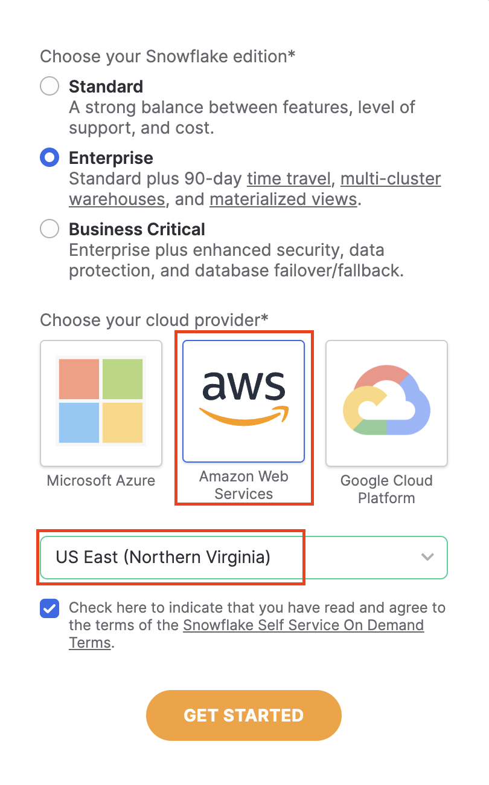

author: hope-wat
id: leverage_dbt_cloud_to_generate_ml_ready_pipelines_using_snowpark_python
summary: This is a sample Snowflake Guide
categories: Getting-Started
environments: web
status: Published 
feedback link: https://github.com/Snowflake-Labs/sfguides/issues
tags: Getting Started, Data Science, Data Engineering, Twitter 


<!-- http://localhost:8000/guide/leverage_dbt_cloud_to_generate_ml_ready_pipelines_using_snowpark_python -->


# Snowflake Guide Template
<!-- ------------------------ -->
## Overview 
Duration: 3

The focus of this workshop will be to demonstrate how we can use both *SQL and python together* in the same workflow to run *both analytics and machine learning models* on dbt Cloud.

All code in today’s workshop can be found on [GitHub](https://github.com/dbt-labs/python-snowpark-formula1/tree/python-formula1).

### What you'll use during the lab

- A [Snowflake account](https://trial.snowflake.com/) with ACCOUNTADMIN access
- A [dbt Cloud account](https://www.getdbt.com/signup/)
- A [GitHub](https://github.com/) Account 

### What you'll learn

- How to use dbt with Snowflake to build scalable transformations using SQL and Python
    - How to use dbt SQL to prepare your data from sources to encoding 
    - How to train a model in dbt python and use it for future prediction 
    - How to deploy your full project 

### What you need to know

- Basic to intermediate SQL and python.
- Basic understanding of dbt fundamentals. We recommend the [dbt Fundamentals course](https://courses.getdbt.com/collections) if you're interested.
- High level machine learning process (encoding, training, testing)
- Simple ML algorithms &mdash; we will use logistic regression to keep the focus on the *workflow*, not algorithms!

### What you'll build

- A set of data analytics and prediction pipelines using Formula 1 data leveraging dbt and Snowflake, making use of best practices like data quality tests and code promotion between environments
- We will create insights for:
    1. Finding the lap time average and rolling average through the years
    2. Predicting the position of each driver based on a decade of data

As inputs, we are going to leverage Formula 1 datasets hosted on a dbt Labs public S3 bucket. We will create a Snowflake Stage for our CSV files then use Snowflake’s `COPY INTO` function to copy the data in from our CSV files into tables. The Formula 1 is available on [Kaggle](https://www.kaggle.com/datasets/rohanrao/formula-1-world-championship-1950-2020). The data is originally compiled from the [Ergast Developer API](http://ergast.com/mrd/).

## Configure Snowflake
In this section we’re going to sign up for a Snowflake trial account and enable Anaconda-provided Python packages.

1. [Sign up for a Snowflake Trial Account using this form](https://signup.snowflake.com/) if you don’t have one. Ensure that your account is set up using **AWS** in the **US East (N. Virginia)**. We will be copying the data from a public AWS S3 bucket hosted by dbt Labs in the us-east-1 region. By ensuring our Snowflake environment setup matches our bucket region, we avoid any multi-region data copy and retrieval latency issues.





2. After creating your account and verifying it from your sign-up email, Snowflake will direct you back to the UI called Snowsight.

3. When Snowsight first opens, your window should look like the following, with you logged in as the ACCOUNTADMIN with demo worksheets open:

<Lightbox src="/img/guides/dbt-ecosystem/dbt-python-snowpark/2-snowflake-configuration/2-new-snowflake-account.png" title="Snowflake trial demo worksheets"/>


4. Navigate to **Admin > Billing & Terms**. Click **Enable > Acknowledge & Continue** to enable Anaconda Python Packages to run in Snowflake.
    
<Lightbox src="/img/guides/dbt-ecosystem/dbt-python-snowpark/2-snowflake-configuration/3-accept-anaconda-terms.jpeg" title="Anaconda terms"/>

<Lightbox src="/img/guides/dbt-ecosystem/dbt-python-snowpark/2-snowflake-configuration/4-enable-anaconda.jpeg" title="Enable Anaconda"/>

5. Finally, create a new Worksheet by selecting **+ Worksheet** in the upper right corner.

## Load data into Snowflake
We need to obtain our data source by copying our Formula 1 data into Snowflake tables from a public S3 bucket that dbt Labs hosts. 

1. Your new Snowflake account has a preconfigured warehouse named `COMPUTE_WH`. If for some reason you don’t have this warehouse, we can create a warehouse using the following script:

    ```sql
    create or replace warehouse COMPUTE_WH with warehouse_size=XSMALL
    ```
2. Rename the worksheet by clicking the worksheet name (this is automatically set to the current timestamp) using the option **…** and **Rename**. Rename the file  to `data setup script` since we will be placing code in this worksheet to ingest the Formula 1 data. Make sure your role is set as the **ACCOUNTADMIN** and select the **COMPUTE_WH** warehouse.

    <Lightbox src="/img/guides/dbt-ecosystem/dbt-python-snowpark/3-connect-to-data-source/1-rename-worksheet-and-select-warehouse.png" title="Rename worksheet and select warehouse"/>

3. Copy the following code into the main body of the Snowflake worksheet. You can also find this setup script under the `setup` folder in the [Git repository](https://github.com/dbt-labs/python-snowpark-formula1/blob/main/setup/setup_script_s3_to_snowflake.sql). The script is long since it's bringing in all of the data we'll need today! Generally during this lab we'll be explaining and breaking down the queries. We won't going line by line, but we will point out important information related to our learning objectives!

4. Ensure all the commands are selected before running the query &mdash; an easy way to do this is to use Ctrl-A to highlight all of the code in the worksheet. Select **run** (blue triangle icon). Notice how the dot next to your **COMPUTE_WH** turns from gray to green as you run the query. The **status** table is the final table of all 14 tables loaded in. 

    <Lightbox src="/img/guides/dbt-ecosystem/dbt-python-snowpark/3-connect-to-data-source/2-load-data-from-s3.png" title="Load data from S3 bucket"/>

5. Let’s unpack that pretty long query we ran into component parts. We ran this query to load in our 14 Formula 1 tables from a public S3 bucket. To do this, we:
    - Created a new database called `formula1` and a schema called `raw` to place our raw (untransformed) data into. 
    - Created a stage to locate our data we are going to load in. Snowflake Stages are locations where data files are stored. Stages are used to both load and unload data to and from Snowflake locations. Here we are using an external stage, by referencing an S3 bucket. 
    - Created our tables for our data to be copied into. These are empty tables with the column name and data type. Think of this as creating an empty container that the data will then fill into. 
    - Used the `copy into` statement for each of our tables. We reference our staged location we created and upon loading errors continue to load in the rest of the data. You should not have data loading errors but if you do, those rows will be skipped and Snowflake will tell you which rows caused errors

6. Now let's take a look at some of our cool Formula 1 data we just loaded up!
    1. Create a new worksheet by selecting the **+** then **New Worksheet**.
        <Lightbox src="/img/guides/dbt-ecosystem/dbt-python-snowpark/3-connect-to-data-source/3-create-new-worksheet-to-query-data.png" title="Create new worksheet to query data"/>
    2. Navigate to **Database > Formula1 > RAW > Tables**. 
    3. Query the data using the following code. There are only 76 rows in the circuits table, so we don’t need to worry about limiting the amount of data we query.
        ```sql
        select * from formula1.raw.circuits
        ```
    4. Run the query. From here on out, we’ll use the keyboard shortcuts Command-Enter or Control-Enter to run queries and won’t explicitly call out this step. 
    5. Review the query results, you should see information about Formula 1 circuits, starting with Albert Park in Australia! 
    6. Finally, ensure you have all 14 tables starting with `CIRCUITS` and ending with `STATUS`. Now we are ready to connect into dbt Cloud!

        <Lightbox src="/img/guides/dbt-ecosystem/dbt-python-snowpark/3-connect-to-data-source/4-query-circuits-data.png" title="Query circuits data"/>


## Setup dbt project 
We are going to be using [Snowflake Partner Connect](https://docs.snowflake.com/en/user-guide/ecosystem-partner-connect.html) to set up a dbt Cloud account. Using this method will allow you to spin up a fully fledged dbt account with your [Snowflake connection](/docs/cloud/connect-data-platform/connect-snowflake), [managed repository](/docs/collaborate/git/managed-repository), environments, and credentials already established.

1. Navigate out of your worksheet back by selecting **home**.
2. In Snowsight, confirm that you are using the **ACCOUNTADMIN** role.
3. Navigate to the **Admin** **> Partner Connect**. Find **dbt** either by using the search bar or navigating the **Data Integration**. Select the **dbt** tile.
    <Lightbox src="/img/guides/dbt-ecosystem/dbt-python-snowpark/4-configure-dbt/1-open-partner-connect.png" title="Open Partner Connect"/>
4. You should now see a new window that says **Connect to dbt**. Select **Optional Grant** and add the `FORMULA1` database. This will grant access for your new dbt user role to the FORMULA1 database.
    <Lightbox src="/img/guides/dbt-ecosystem/dbt-python-snowpark/4-configure-dbt/2-partner-connect-optional-grant.png" title="Partner Connect Optional Grant"/>

5. Ensure the `FORMULA1` is present in your optional grant before clicking **Connect**.  This will create a dedicated dbt user, database, warehouse, and role for your dbt Cloud trial.

    <Lightbox src="/img/guides/dbt-ecosystem/dbt-python-snowpark/4-configure-dbt/3-connect-to-dbt.png" title="Connect to dbt"/>

6. When you see the **Your partner account has been created** window, click **Activate**.

7. You should be redirected to a dbt Cloud registration page. Fill out the form. Make sure to save the password somewhere for login in the future. 

    <Lightbox src="/img/guides/dbt-ecosystem/dbt-python-snowpark/4-configure-dbt/4-dbt-cloud-sign-up.png" title="dbt Cloud sign up"/>

8. Select **Complete Registration**. You should now be redirected to your dbt Cloud account, complete with a connection to your Snowflake account, a deployment and a development environment, and a sample job.

9. To help you version control your dbt project, we have connected it to a [managed repository](/docs/collaborate/git/managed-repository), which means that dbt Labs will be hosting your repository for you. This will give you access to a Git workflow without you having to create and host the repository yourself. You will not need to know Git for this workshop; dbt Cloud will help guide you through the workflow. In the future, when you’re developing your own project, [feel free to use your own repository](/docs/cloud/git/connect-github). This will allow you to learn more about features like [Slim CI](/docs/deploy/cloud-ci-job#configuring-a-slim-ci-job) builds after this workshop.


<!-- ------------------------ -->
## Metadata Configuration
Duration: 2

It is important to set the correct metadata for your Snowflake Guide. The metadata contains all the information required for listing and publishing your guide and includes the following:


- **summary**: This is a sample Snowflake Guide 
  - This should be a short, 1 sentence description of your guide. This will be visible on the main landing page. 
- **id**: sample 
  - make sure to match the id here with the name of the file, all one word.
- **categories**: data-science 
  - You can have multiple categories, but the first one listed is used for the icon.
- **environments**: web 
  - `web` is default. If this will be published for a specific event or  conference, include it here.
- **status**: Published
  - (`Draft`, `Published`, `Deprecated`, `Hidden`) to indicate the progress and whether the sfguide is ready to be published. `Hidden` implies the sfguide is for restricted use, should be available only by direct URL, and should not appear on the main landing page.
- **feedback link**: https://github.com/Snowflake-Labs/sfguides/issues
- **tags**: Getting Started, Data Science, Twitter 
  - Add relevant  tags to make your sfguide easily found and SEO friendly.
- **authors**: Daniel Myers 
  - Indicate the author(s) of this specific sfguide.

---

You can see the source metadata for this guide you are reading now, on [the github repo](https://raw.githubusercontent.com/Snowflake-Labs/sfguides/master/site/sfguides/sample.md).


<!-- ------------------------ -->
## Creating a Step
Duration: 2

A single sfguide consists of multiple steps. These steps are defined in Markdown using Header 2 tag `##`. 

```markdown
## Step 1 Title
Duration: 3

All the content for the step goes here.

## Step 2 Title
Duration: 1

All the content for the step goes here.
```

To indicate how long each step will take, set the `Duration` under the step title (i.e. `##`) to an integer. The integers refer to minutes. If you set `Duration: 4` then a particular step will take 4 minutes to complete. 

The total sfguide completion time is calculated automatically for you and will be displayed on the landing page. 

<!-- ------------------------ -->
## Code Snippets, Info Boxes, and Tables
Duration: 2

Look at the [markdown source for this sfguide](https://raw.githubusercontent.com/Snowflake-Labs/sfguides/master/site/sfguides/sample.md) to see how to use markdown to generate code snippets, info boxes, and download buttons. 

### JavaScript
```javascript
{ 
  key1: "string", 
  key2: integer,
  key3: "string"
}
```

### Java
```java
for (statement 1; statement 2; statement 3) {
  // code block to be executed
}
```

### Info Boxes
> aside positive
> 
>  This will appear in a positive info box.


> aside negative
> 
>  This will appear in a negative info box.

### Buttons
<button>

  [This is a download button](link.com)
</button>

### Tables
<table>
    <thead>
        <tr>
            <th colspan="2"> **The table header** </th>
        </tr>
    </thead>
    <tbody>
        <tr>
            <td>The table body</td>
            <td>with two columns</td>
        </tr>
    </tbody>
</table>

### Hyperlinking
[Youtube - Halsey Playlists](https://www.youtube.com/user/iamhalsey/playlists)

<!-- ------------------------ -->
## Images, Videos, and Surveys, and iFrames
Duration: 2

Look at the [markdown source for this guide](https://raw.githubusercontent.com/Snowflake-Labs/sfguides/master/site/sfguides/sample.md) to see how to use markdown to generate these elements. 

### Images


### Videos
Videos from youtube can be directly embedded:
<video id="KmeiFXrZucE"></video>

### Inline Surveys
<form>
  <name>How do you rate yourself as a user of Snowflake?</name>
  <input type="radio" value="Beginner">
  <input type="radio" value="Intermediate">
  <input type="radio" value="Advanced">
</form>

### Embed an iframe


<!-- ------------------------ -->
## Conclusion
Duration: 1

At the end of your Snowflake Guide, always have a clear call to action (CTA). This CTA could be a link to the docs pages, links to videos on youtube, a GitHub repo link, etc. 

If you want to learn more about Snowflake Guide formatting, checkout the official documentation here: [Formatting Guide](https://github.com/googlecodelabs/tools/blob/master/FORMAT-GUIDE.md)

### What we've covered
- creating steps and setting duration
- adding code snippets
- embedding images, videos, and surveys
- importing other markdown files